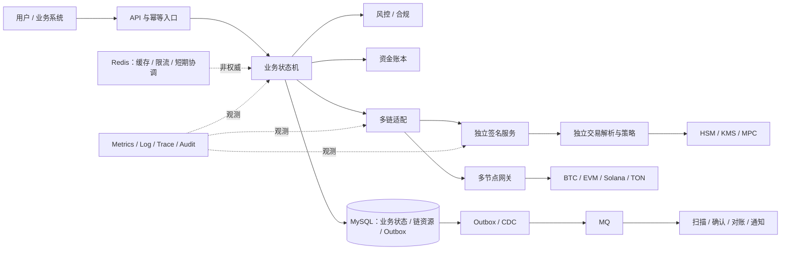

# 托管钱包项目架构图讲法与追问回答

> 适用场景：从架构图介绍支持 BTC、EVM、Solana、TON 的托管钱包方案。  
> 表达原则：不逐框念模块名，而是围绕权威事实、信任边界、故障恢复和损失上限展开。  
> 经历口径：当前仓库能证明的是个人学习、研究和理论设计；除非另有真实证据，不应表述为生产上线经历。

## 一、架构图

## 二、开场讲法

我不会按图从左到右念服务名。这张图主要表达三条边界：第一，链事实、业务状态和内部账本回答的是三个不同问题，必须分开保存再通过对账收敛；第二，签名是资金离开系统前的最后一道独立授权边界，不能信任上游给出的展示字段；第三，多链适配只统一稳定能力和错误语义，UTXO、nonce、Recent Blockhash、账户锁和 `seqno` 等链资源必须保留。

整个方案的优先级是资金正确性和密钥安全高于可用性。MySQL 保存权威状态，MQ 负责传播，Redis 负责提速；后两者都不是资金最终事实。外部节点、风控供应商和业务调用方都按不可信输入处理，结果未知时宁可暂停，也不把未知解释成失败或成功。

## 三、三条核心边界

### 1. 链事实、业务状态和账本为什么分离

三者回答的问题不同：

| 数据层 | 回答的问题 | 典型内容 | 变化方式 |
|---|---|---|---|
| 链事实 | 链上实际发生了什么 | 区块、交易、Event、Instruction、Message、确认与重组证据 | 随规范链和最终性变化 |
| 业务状态 | 平台准备如何处理 | 充值待确认、提币已冻结、待签名、广播未知、人工处理 | 受状态机和策略控制 |
| 内部账本 | 平台对用户和自身的资产、负债是多少 | 可用、冻结、在途余额及不可变分录 | 只通过幂等账务命令和补偿分录变化 |

如果把三者合成一张表，就会把“节点查到交易”“业务允许入账”和“余额已经增加”误当成同一件事。链重组时也可能通过删除记录破坏审计，或者因为业务状态回退而直接覆盖历史账务。

正确做法是用稳定标识关联三层：链事实保留区块锚点和原始证据；业务状态使用期望状态与版本做条件迁移；账本使用最小单位整数、借贷平衡和业务命令唯一键。重组或纠错不删除旧分录，而是新增反向或补偿分录。最后通过链事实、业务记录和账本三方对账证明一致。

### 2. 签名为什么独立并重新解析交易

提币服务有合法调用身份，不代表它提交的每笔交易都合法。如果业务服务、构建器或传输链路被攻陷，上游给出的“转给 A、金额 1”可能与真实待签名字节中的“转给 B、金额 100”不一致。HSM 只保护密钥不导出，本身通常不知道哈希代表的业务含义。

因此签名服务处在独立网络、身份和权限域中，从 canonical payload 重新解析并核对：

- 链和网络身份、资产或 Token 合约身份；
- 全部收款地址、金额、找零和原生币 `value`；
- 费用上限、合约方法、授权额度和有效期；
- BTC UTXO 与 SIGHASH、EVM nonce、Solana Blockhash/账户、TON `seqno`/消息；
- 业务单、审批证明、策略版本、请求 generation 和防重放值。

解析结果必须与审批意图一致才调用 HSM/KMS/MPC。签名请求以业务 ID、generation 和 payload hash 持久化幂等；超时后查询原 request，不能换 ID 盲目再签。这样即使业务服务失陷，攻击者仍需同时突破独立解析、策略、审批和额度边界。

### 3. 链适配统一什么，保留什么

统一的是稳定的业务能力：地址校验与规范化、资产标识、费用报价、交易构建、独立解析、签名封装、广播、状态查询、区块扫描、确认评估，以及 `accepted / rejected / unknown` 等错误语义。金额统一使用“资产 ID + 最小单位整数”，每次操作携带配置和适配器版本。

不能被万能 `Transaction` DTO 抹平的是链特有资源和失败语义：

| 链 | 必须保留的资源与语义 |
|---|---|
| BTC | UTXO 选择与预留、输入输出、找零、SIGHASH、RBF/CPFP、重组 |
| EVM | 发送地址 nonce、EIP-1559 费用、Receipt、Log、同 nonce 替换与 gap |
| Solana | Recent Blockhash、签名有效期、可写账户锁、Instruction、ATA、Commitment |
| TON | 钱包合约版本、`seqno`、Cell/BOC、External/Internal Message、Bounce 和异步消息链 |

适配器负责把链数据解释成规范化证据，业务策略根据证据决定状态是否推进。适配器不能伪造共识，也不能替业务层决定用户余额。

## 四、主流程串讲

以提币为例，入口先用客户端请求号幂等受理，在本地事务中创建提币单、冻结余额并写 Outbox。风控和审批通过后，多链适配器在数据库中持久化预留 UTXO、nonce 或 `seqno` 等资源，再构建确定的 canonical payload。独立签名服务重新解析并匹配审批意图，签名结果和原始交易先持久化，再由节点网关广播。

广播超时进入 `BROADCAST_UNKNOWN`，保持余额冻结和链资源占用。恢复任务按 txid、signature、sender + nonce、UTXO 或消息链向独立节点查证；原载荷仍有效时只重播同一字节。达到链特定确认条件后，在本地事务中完成最终账本扣减、状态迁移和 Outbox。任何阶段都允许消息重复，但唯一约束、版本条件和对账保证业务效果不重复。

## 五、十个压力追问

### 1. 为什么不使用分布式事务？

提币跨风控、账本、签名、节点和区块链，持续时间可能从几分钟到几小时。两阶段提交需要参与方支持事务协议并长期持锁，但区块链既不参与数据库事务，也不能在交易确认后由数据库回滚。因此全局分布式事务不仅成本高，而且解决不了最关键的链上不可逆问题。

方案采用“短本地事务 + 持久化状态机 + Outbox + 幂等消费 + 补偿与对账”。冻结、扣减等单个账务效果在本地事务内保持原子；跨服务步骤显式记录状态。这里的补偿不是删除历史，而是安全解冻、反向分录、交易替换或人工处置。

### 2. 数据库提交成功、MQ 失败怎么办？

业务状态、账本变化和 Outbox 事件写入同一个 MySQL 本地事务。数据库提交成功而 MQ 暂时不可用时，Outbox 仍是 `PENDING`，Publisher 或 CDC 恢复后继续投递。若消息已发送但 Publisher 在标记成功前崩溃，它会再次发送，所以消费者必须按 `event_id` 或稳定业务命令 ID 幂等，并检查聚合版本。

不能直接在业务事务后“顺手发 MQ”，否则数据库成功、消息失败会形成不可恢复的双写窗口。监控 `outbox_pending_count` 和最老事件年龄；恢复后核对 Outbox、消费者副作用与业务状态，而不是只看 MQ 积压归零。

### 3. 广播超时为何不能直接重建交易？

超时只表示客户端没有拿到响应，节点可能已经接收并传播交易。此时重建交易可能换用另一组 UTXO、一个新 nonce、新 Blockhash 或新 `seqno`，从而让两笔交易都有效，造成重复支付。

因此先保存签名原文、payload hash 和预期链身份并进入未知状态，再进行多节点查询。查到原交易就继续跟踪；查不到但原载荷仍有效，可以重播相同字节。只有证明旧交易不可能生效且链规则允许时，才创建关联的新 attempt，例如 EVM 同 nonce 提价替换、BTC 合规使用 RBF/CPFP、Solana 确认旧 Blockhash 过期后重签。新 attempt 不能覆盖旧交易证据。

### 4. Redis 锁失效后如何保证正确性？

Redis 锁只是减少竞争，不是资金正确性的最终防线。锁可能因 TTL 到期、进程暂停、主从切换或网络分区失效，所以即使两个 Worker 同时进入临界区，数据库仍必须拒绝第二个业务效果。

具体依靠：业务请求唯一索引、账本命令唯一键、`WHERE status = ? AND version = ?` 条件更新、事务行锁、链资源唯一约束，以及必要时的 fencing token。BTC 对 outpoint 唯一预留，EVM 对 `chain + sender + nonce` 唯一，TON 对 `chain + wallet + seqno` 唯一。恢复时再查询链上资源是否已消费，不能因 Redis key 消失就释放资源或重新付款。

### 5. 节点返回冲突数据如何处理？

先把节点当作外部证据源，而不是权威数据库。系统记录节点身份、网络/genesis、查询锚点、同步高度、观测时间和原始响应哈希，再把供应商差异规范化成同一链事实后比较，不能直接比较 JSON。

若节点处于不同区块锚点，先对齐锚点重查；仍冲突时查询独立故障域、归档节点和链特有证据，并按共识规则判断规范链。`K/N` 一致只能作为信号，不能机械服从多数，因为多数节点可能共享上游或同时落后。无法确定时暂停相关链或资产的入账、签名或资源释放，保存证据并转人工；确定后隔离错误节点，从可信 checkpoint 幂等重扫并对账。

### 6. 扩容后顺序和链资源如何协调？

系统不追求没有必要的全局顺序，只在业务键内有序：账本按 `account_id`，充值按 `deposit_id`，提币按 `withdrawal_id`，EVM nonce 按 `chain + sender`，TON 按 `chain + wallet`，BTC UTXO 按 outpoint。MQ 使用稳定分区键，但消费者仍校验 `aggregate_version`：旧版本忽略，连续版本应用，发现 gap 就暂停该 aggregate 并回补。

扩消费者只能提高不同 key 的并行度，不能突破单钱包 nonce 或 `seqno` 的串行边界。链资源必须在数据库事务中分配并建立唯一约束；热点时可增加发送钱包、分片地址池或并行处理不相交 UTXO。若瓶颈是行锁或单钱包顺序，盲目加实例反而会增加冲突。

### 7. 最坏情况下会损失什么，如何限制？

最坏情况不是“服务不可用”，而是有效的错误交易已签名并上链，或者深度重组使已入账充值消失且用户已经把余额提出。链上动作通常不能回滚，可能损失热钱包可支配资产、错误入账后形成的风险敞口、已支付手续费，以及一段时间的业务可用性和人工恢复成本。

限制方式包括：热、温、冷资金分层；热钱包只保留业务所需水位；单笔、单日、单地址、单资产和单协议额度；大额多级审批与更高确认阈值；签名策略和目标白名单；Gas/Token 补充累计上限；分批与金丝雀发布；异常时暂停签名和提币。不能承诺“零损失”，应把最大自动损失限制在经审批的热钱包水位和时间窗口额度内。具体金额必须来自真实风险预算，不能在面试中虚构。

### 8. 你亲自写了什么，谁批准了方案？

按当前仓库可验证的事实，合适的回答是：

> 这是一份个人学习与理论设计，不是我已经上线的生产钱包。我亲自完成或维护的部分只能按 Git 提交、文档、代码和测试证据逐项说明，例如架构图、状态机、四链差异表、测试网解析或故障推演。当前仓库没有生产评审和上线审批证据，所以我不会声称由架构委员会、安全负责人或业务负责人批准。若用于真实工作项目，我会分别说明我起草、实现和验证的部分，以及实际批准设计、风险例外和生产变更的角色。

面试前应把“我写了什么”替换为可打开的文件、提交或测试，把“谁批准”替换为真实角色和评审记录。没有批准人时就明确说这是候选方案。

### 9. 结果数字从哪里来，能否复现？

当前仓库中的 `500,000` 日充值事件、8 倍峰值和容量公式属于假设场景及数量级估算，不是生产实测结果。可以复现计算：

$$
\lambda_{deposit}=\frac{500000}{86400}\approx 5.79\ \text{events/s}
$$

按 8 倍峰值约为 $46.3$ events/s，但这不等于扫链吞吐，因为扫描器还要解析未命中充值的全部区块数据。

如果报告实测结果，必须同时提供代码版本、机器配置、JVM 参数、节点或 Mock 数据、固定输入集、预热方式、并发、持续时间、成功率分母和 P50/P95/P99，并保留压测脚本、原始输出和故障注入记录。在同一环境重复运行并比较链事实集合、状态迁移、账本分录和副作用集合，才能说明性能提升没有改变资金语义。没有这些证据时只说“估算”或“尚未测量”。

### 10. 方案中最大的未解决风险是什么？

技术上最大的剩余风险是多个本应独立的控制同时失效，例如业务服务、审批/策略配置和签名调用权限被同一攻击路径控制。HSM 能防止私钥导出，却不能天然识别一次“接口上合法、业务上恶意”的签名。多节点也可能因共享上游产生相关故障，测试网验证无法证明主网极端重组、供应商故障和真实运维流程下仍然安全。

现阶段只能降低而不能消除该风险：继续强化职责分离、独立解析、多人治理、策略变更延迟、热钱包损失上限、不可篡改审计、紧急停签和恢复演练。上线前仍需要威胁建模、第三方安全评审、HSM/MPC 与灾备实测、多节点独立性验证，以及小额分阶段灰度。就当前仓库的证据边界而言，最大不足是这些生产级验证尚未发生，必须明确标注。

## 六、收尾总结

这张图的核心不是服务数量，而是让每个失败都有明确落点：链事实落在可重放证据中，业务进度落在持久化状态机中，资金变化落在不可变账本中，异步传播落在 Outbox 中，链资源落在数据库唯一约束中，密钥落在独立签名边界中。系统允许超时、重复、乱序和局部不可用，但不允许把未知结果直接变成第二次资金动作。最终恢复标准不是服务重新启动，而是链事实、业务状态、账本、签名记录和链上交易完成对账。