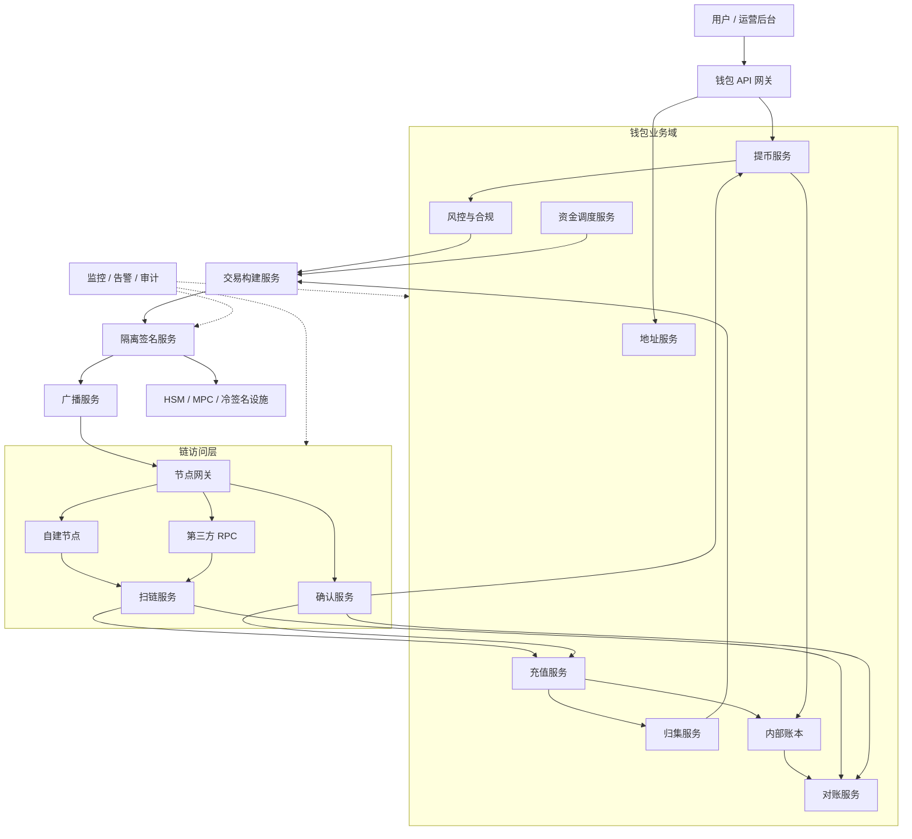
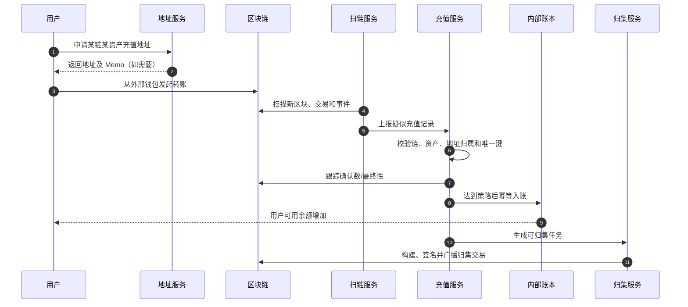
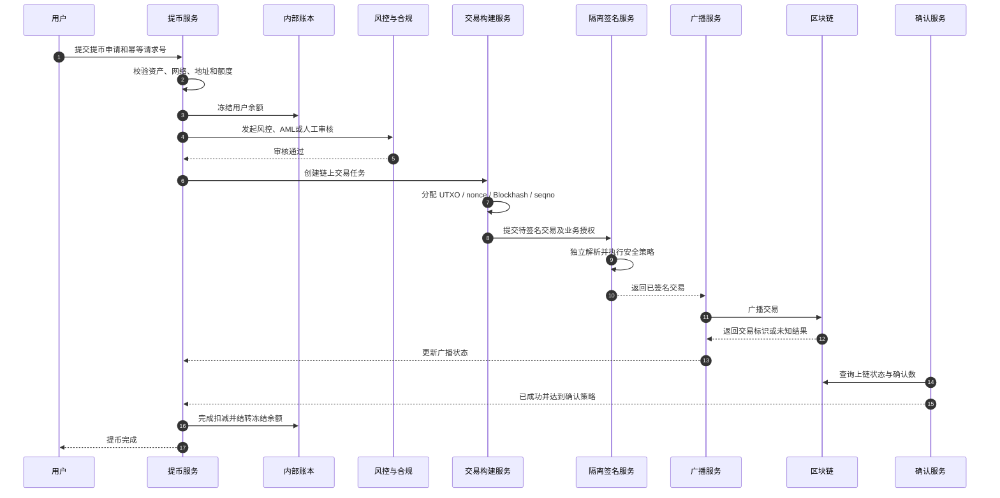
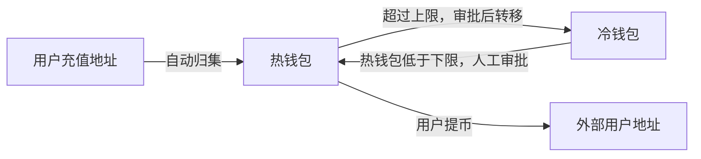

# Day 01：认识交易所钱包系统

> 学习目标：建立交易所 / 托管钱包的完整认知，能够讲清钱包类型、核心模块、资金模型、主要业务流程和冷热钱包分层。  
> 建议用时：3～4 小时  
> 完成标准：能够脱离资料画出总体架构，并连续回答文末 6 道面试题。

## 一、学习内容

### 1. 钱包类型

#### 1.1 去中心化钱包（非托管钱包）

典型产品包括 MetaMask、Phantom 等。私钥或助记词由用户控制，钱包软件主要负责：

- 生成和管理账户；
- 构建并签名交易；
- 连接区块链节点或 RPC 服务；
- 展示链上资产；
- 与 DApp 交互。

核心特点是“用户自己控制密钥”。服务方通常不能替用户恢复私钥，也不能单方面转移用户资产。

#### 1.2 交易所托管钱包

私钥及链上资金由交易所统一管理。用户在交易所中的资产主要体现为内部账本余额，不一定对应一个由用户独占、可直接控制的链上地址。

交易所负责：

- 分配和维护充值地址；
- 监听、解析并确认链上充值；
- 更新用户内部账本；
- 审核、构建、签名和广播提币交易；
- 归集用户充值地址中的资金；
- 调度热钱包、温钱包和冷钱包资金；
- 执行风控、合规、审计和对账。

核心特点是“平台托管密钥，内部账本承载用户权益”。

#### 1.3 MPC 钱包

MPC（Multi-Party Computation，多方安全计算）通常把签名能力分散到多个参与方或设备中。各方持有密钥分片，通过协议协同生成签名，完整私钥通常不在单一位置出现。

MPC 是一种密钥管理与签名技术，不等同于一种独立的业务钱包形态。交易所托管钱包和面向用户的钱包都可以采用 MPC。

主要价值：

- 降低单点私钥泄露风险；
- 支持阈值审批和多参与方控制；
- 便于构建跨链一致的签名策略。

主要限制：

- 协议和系统实现复杂；
- 节点可用性会影响签名；
- 仍需防范终端入侵、恶意参与方、权限滥用和供应链风险；
- MPC 不能代替风控、审计和业务校验。

#### 1.4 智能合约钱包

智能合约钱包通过链上合约管理资产和授权逻辑，例如 Safe 多签钱包和基于账户抽象的钱包。

常见能力：

- 多签或阈值审批；
- 每日限额；
- 社交恢复；
- 批量交易；
- Session Key；
- Gas 代付；
- 可编程权限策略。

其安全性不仅依赖密钥，还依赖合约代码、管理员权限、升级机制以及底层链的执行安全。

#### 1.5 四类钱包对比

| 维度 | 去中心化钱包 | 交易所托管钱包 | MPC 钱包 | 智能合约钱包 |
|---|---|---|---|---|
| 密钥控制 | 用户 | 平台 | 多方持有分片 | 外部签名者控制合约权限 |
| 用户余额来源 | 链上状态 | 平台内部账本 | 取决于业务形态 | 合约链上状态 |
| 交易发起 | 用户直接签名 | 平台审核后代签 | 多方协同签名 | 调用合约执行 |
| 资产恢复 | 依赖助记词/备份 | 依赖平台账户与风控 | 依赖分片恢复机制 | 取决于合约恢复设计 |
| 主要风险 | 用户丢失或泄露私钥 | 平台私钥、内控和系统风险 | 分片节点、协议和权限风险 | 合约漏洞、升级和权限风险 |
| 是否互斥 | 否 | 否 | 否，属于签名技术 | 否，属于链上账户形态 |

> 注意：这四个概念并非完全处于同一分类维度。例如，交易所托管钱包可以使用 MPC，也可以用智能合约多签管理部分资产。

---

### 2. 交易所钱包核心模块

| 模块 | 主要职责 | 关键风险 |
|---|---|---|
| 地址服务 | 地址生成、地址池、用户绑定、地址校验 | 地址重复、网络错误、派生关系丢失 |
| 节点网关 | 管理自建节点和第三方 RPC，完成路由、限流及容灾 | 节点落后、数据不一致、供应商故障 |
| 扫链服务 | 按区块扫描交易和事件，维护扫描游标 | 漏扫、重复扫描、链重组 |
| 充值服务 | 识别归属、等待确认、创建入账事件 | 重复入账、错误资产、确认不足 |
| 提币服务 | 接收申请并驱动提币状态机 | 重复提币、状态不一致 |
| 风控与合规 | 额度、频率、地址、AML、人工审核 | 规则绕过、误报、服务不可用 |
| 交易构建服务 | 选择 UTXO/nonce，估算费用并生成待签名交易 | 并发冲突、费用异常、目标被篡改 |
| 签名服务 | 隔离密钥，独立校验交易并完成签名 | 私钥泄露、未授权签名、请求重放 |
| 广播服务 | 向一个或多个节点提交已签名交易 | 超时导致结果未知、重复广播 |
| 确认服务 | 跟踪交易上链、执行结果和最终确认 | 错判成功、交易替换、链重组 |
| 归集服务 | 将分散充值资金转入统一资金地址 | Gas 不足、重复归集、成本过高 |
| 资金调度 | 热转冷、冷转热、控制钱包水位 | 热钱包不足、冷转热审批失控 |
| 内部账本 | 记录用户可用、冻结、在途余额和不可变流水 | 超发、少记、精度和并发错误 |
| 对账服务 | 比对链上资产、钱包记录和内部账本 | 差异未发现、错误补账 |
| 审计与监控 | 记录关键操作，检测异常并触发告警 | 日志泄密、告警缺失、审计被篡改 |

#### 模块设计原则

1. **密钥与业务隔离**：普通业务服务不能读取私钥。
2. **链上记录与内部账本分离**：链上交易不是用户账务流水。
3. **所有资金操作必须幂等**：消息重试、服务重启不能导致重复入账或重复提币。
4. **先校验再签名**：签名服务应独立解析目标地址、金额、费用、链和资产。
5. **关键状态可恢复**：不能依赖单个进程内存保存扫描高度、nonce 或提币状态。
6. **默认安全失败**：无法确认风控、签名或链状态时，不应盲目放行资金操作。

---

### 3. 链上资产与交易所内部余额

#### 3.1 两套状态

**链上资产**由区块链共识决定，表现为：

- BTC 地址控制的 UTXO；
- EVM、Solana 或 TON 账户及代币余额；
- 已广播、待确认或已确认的链上交易。

**内部余额**由交易所账本决定，通常包括：

- 可用余额；
- 冻结余额；
- 在途余额；
- 用户充值、交易、手续费和提币形成的流水。

用户在交易所内部完成买卖或转账时，通常只更新内部账本，不会为每次操作创建链上交易。

#### 3.2 为什么两者不相等

1. 多个用户的资金会被归集到同一个热钱包或冷钱包。
2. 用户的充值地址可能已经没有余额，但用户内部余额仍然存在。
3. 交易所内部交易只改变用户权益归属，不改变链上资产总量。
4. 提币申请后，内部余额可能已冻结，但链上交易尚未广播。
5. 充值已被链发现，但达到确认数之前可能尚未计入可用余额。
6. 链上钱包还需要保存手续费储备和运营资金。

交易所需要满足的核心资金关系可以概括为：

$$
\text{链上可控总资产} \geq \text{用户负债总额} + \text{其他应付款}
$$

实际对账还要考虑待确认充值、在途提币、手续费、归集交易和内部系统之间的时间差。

---

### 4. 交易所钱包总体架构图



#### 架构说明

- 节点网关对不同链及不同 RPC 供应商进行统一治理，但不应掩盖链模型差异。
- 扫链服务负责发现事实，充值服务负责业务确认和入账，二者职责分离。
- 提币服务负责状态编排，交易构建和签名服务分别处理链特有数据与密钥操作。
- 签名设施与普通业务网络隔离，并执行独立策略校验。
- 内部账本是用户余额的权威数据源，对账服务持续验证账本与链上资产的一致性。

---

### 5. 充值完整流程



#### 充值关键控制点

- 地址、网络、资产合约必须来自可信配置。
- 使用链特有唯一键防止重复识别和重复入账。
- 区块高度和区块哈希同时持久化，以检测链重组。
- 确认策略按照链、资产、金额和风险等级配置。
- 入账和可靠事件写入应处于同一本地事务或使用等效可靠机制。
- 发生重组、漏扫或节点分歧时，需要暂停、重扫、冻结或人工处理。

#### 扫链专题：四条链如何识别疑似充值与设计幂等键

扫链服务的统一判断原则是：

> 在已执行或待确认的链上交易中，发现“受支持资产进入交易所控制地址”的资产转移事件。发现事件只代表疑似充值，经过资产校验、地址归属校验、执行结果校验和确认策略后才能入账。

幂等键必须定位到一笔交易中的**具体资产转移事件**。不能只使用交易哈希，因为 BTC、EVM Token 和 Solana 的一笔交易都可能包含多笔转账；也不能使用地址、金额、Memo 或区块高度，因为这些值可能重复或因链重组发生变化。

| 链上事件 | 疑似充值判断依据 | 推荐业务唯一键 |
|---|---|---|
| BTC | 某个交易输出的锁定脚本属于交易所，且金额符合充值规则 | `network + txid + vout` |
| EVM 原生币直接转账 | 顶层交易成功，`to` 属于交易所且 `value > 0` | `chainId + txHash + native` |
| ERC-20 | 白名单 Token 合约产生 `Transfer` Log，接收方属于交易所 | `chainId + txHash + logIndex` |
| EVM 内部原生币转账 | 成功 Trace 中有原生币进入交易所地址 | `chainId + txHash + traceAddress` |
| Solana SOL/SPL Token | 成功交易的顶层或内部 Instruction 将资产转入交易所账户 | `cluster + signature + instructionPath` |
| TON 原生币 | 交易所账户收到有效的 Internal Message | `network + inboundMessageHash` |
| TON Jetton | 白名单 Jetton 的消息链表明资产进入交易所控制的 Jetton Wallet | `network + transferNotificationMessageHash` |

##### BTC

BTC 扫块时遍历每笔交易的所有输出：

1. 读取并规范化输出的 `scriptPubKey`；
2. 判断锁定脚本或解析出的地址是否属于交易所地址库；
3. 校验网络和最小充值金额；
4. 创建待确认充值记录。

唯一键使用 `network + txid + vout`。`txid` 只能定位交易，`vout` 才能定位具体输出。一笔交易可能有多个属于交易所的输出，因此不能只用 `txid`。

##### EVM

EVM 需要区分三类资产转移：

1. **原生币直接转账**：检查成功交易的顶层 `to` 和 `value`；
2. **ERC-20 转账**：检查白名单 Token 合约产生的 `Transfer(address,address,uint256)` Event Log，真正接收方位于 Log 中，而不是交易的 `to`；
3. **内部原生币转账**：检查节点 Trace 中成功执行的内部调用，并使用稳定、规范化的调用路径定位。

ERC-20 必须根据 `chainId + tokenContract` 识别资产，不能依赖 Token 名称或 Symbol。交易 Receipt 失败时，该交易产生的状态变化和 Log 均不能作为有效充值。

##### Solana

Solana 需要解析成功交易中的顶层 Instruction 和 Inner Instruction：

1. SOL 充值主要识别 System Program 的转账指令；
2. SPL Token 充值识别 SPL Token Program 或 Token-2022 Program 的转账；
3. 校验目标 Token Account/ATA 归交易所控制；
4. 校验 Mint 和 Token Program 与支持资产配置一致；
5. 使用 `preBalances/postBalances` 或 Token Balance 变化验证实际到账数量。

只有 `meta.err == null` 才可视为执行成功。余额变化还可能来自手续费、账户租金或账户关闭，因此应以 Instruction 语义识别为主、余额变化校验为辅。

`instructionPath` 必须区分顶层和内部指令，例如 `outer-2`、`outer-3/inner-1`。该路径必须根据原始交易确定性生成，不能依赖数据库插入顺序。

##### TON

TON 是异步消息模型，充值识别应围绕消息进行：

1. 原生 TON 充值检查进入交易所账户的有效 Internal Message；
2. 共用地址模式还要解析 Comment/Memo，并映射到具体用户；
3. Jetton 充值需要验证受信任的 Jetton Master、接收方 Jetton Wallet 及其 Owner；
4. 跟踪消息是否 Bounce，并验证最终资产变化或转账通知。

Jetton 不能根据名称或 Symbol 判断真伪，必须以白名单 Jetton Master 地址作为资产身份。`query_id` 和 Memo 都可能重复，不能单独作为幂等唯一键。

当消息哈希不可稳定取得时，TON 交易还可使用 `network + accountAddress + transactionLT + transactionHash` 定位，再追加消息位置以区分同一交易中的多个业务事件。

##### 统一数据模型

四条链可以规范化为内部充值事件，并保留链特有定位字段：

| 字段 | 说明 |
|---|---|
| `network` | 链及网络，例如 BTC 主网或某 EVM Chain ID |
| `assetId` | 交易所内部资产 ID |
| `assetContract` | EVM Token、SPL Mint 或 Jetton Master；原生币可为空 |
| `recipientAddress` | 交易所控制的接收地址 |
| `transactionId` | `txid`、`txHash`、Solana Signature 或 TON 交易哈希 |
| `eventLocator` | `vout`、`logIndex`、`traceAddress`、`instructionPath` 或消息哈希 |
| `blockHeightOrSlot` | 区块高度、Slot 或 TON 对应位置 |
| `blockHash` | 用于检测重组或确认原始归属 |
| `amountAtomic` | 使用资产最小单位保存的金额 |
| `status` | `DETECTED`、`CONFIRMING`、`CREDITED`、`REORGED` 等状态 |

数据库可建立以下唯一约束：

```text
UNIQUE(network, transaction_id, event_locator)
```

也可以确定性生成：

$$
	ext{eventId} = H(\text{network} \parallel \text{transactionId} \parallel \text{eventLocator})
$$

即使生成了 `eventId`，仍应保留原始定位字段，便于排障、重扫和审计。

##### 幂等与链重组的关系

- 幂等键回答“这是否是已经处理过的同一个资产转移事件”。
- 区块高度和区块哈希回答“这个事件当前是否仍在有效主链上”。
- 区块高度或区块哈希不应进入充值业务唯一键，否则同一事件重组后进入新块可能被再次入账。
- 重组时不要删除原充值记录，应将状态改为 `REORGED` 或 `ORPHANED`，然后执行恢复、冻结、冲正或人工处理。
- 同一个事件重新回到主链时，应恢复原记录并继续确认，而不是创建第二笔账务流水。

面试时可以用一句话概括：

> BTC 用 `txid:vout` 定位输出，EVM 用 `txHash:logIndex/traceAddress` 定位事件，Solana 用 `signature:instructionPath` 定位指令，TON 用 `messageHash` 或 `account:LT:txHash` 定位消息和交易；区块哈希用于检测回滚，不用于定义充值事件身份。

---

### 6. 提币完整流程



#### 提币关键控制点

- 申请必须有业务幂等键。
- 冻结余额和提币单创建必须保持一致。
- 风控不可确认时默认暂停，而不是绕过。
- 链资源必须防止并发冲突，例如 BTC UTXO 和 EVM nonce。
- 签名请求必须绑定业务单、目标、金额、链、资产、费用和有效期。
- 广播超时属于“结果未知”，不能立即创建另一笔支付。
- 链上成功但内部状态未更新时，应由确认和对账任务恢复。

---

### 7. 归集与热转冷流程

#### 7.1 归集

充值地址收到资产后，归集服务根据金额、时间、手续费和风险策略，将分散资金转移到统一资金地址。

不同链的归集难点：

- BTC：UTXO 选择、粉尘、交易体积和费率；
- EVM Token：充值地址需要原生币支付 Gas；
- Solana：Token Account、ATA、Blockhash 和账户租金；
- TON：钱包合约 `seqno`、异步消息和 Jetton 转账通知。

#### 7.2 热转冷

当热钱包余额超过安全水位时，系统将超出运营需求的资金转移至离线程度更高的冷钱包，以降低在线攻击的最大损失。



#### 7.3 热、温、冷钱包职责

| 类型 | 联网与签名方式 | 主要职责 | 优点 | 风险/代价 |
|---|---|---|---|---|
| 热钱包 | 在线自动签名 | 日常小额提币、归集和手续费支付 | 响应快、自动化高 | 暴露面最大，应严格限额 |
| 温钱包 | 半在线或加强审批 | 中等额度调度、热钱包补充 | 安全与效率折中 | 流程和权限设计复杂 |
| 冷钱包 | 离线或强隔离签名 | 保存绝大多数长期资金 | 网络攻击面小 | 操作慢，恢复和审批成本高 |

核心原则：

- 热钱包仅保留满足短期运营所需的最低资金；
- 冷钱包不参与高频自动提币；
- 冷转热通常需要多人审批和离线签名；
- 所有层级都必须具备密钥备份、恢复演练和审计；
- “冷”不代表绝对安全，人员、流程和备份介质仍可能成为攻击面。

---

## 二、钱包业务术语表

| 术语 | 含义 |
|---|---|
| 托管钱包 | 平台控制密钥并代表用户管理链上资产的钱包系统 |
| 非托管钱包 | 用户自行控制私钥或助记词的钱包 |
| 私钥 | 控制账户并生成数字签名的秘密数据 |
| 公钥 | 由私钥推导，用于验签或进一步生成地址 |
| 地址 | 链上接收资产或标识账户的字符串 |
| 助记词 | 按标准编码随机熵、用于恢复 Seed 的单词序列 |
| HD Wallet | 可从一个 Seed 分层确定性派生多个密钥的钱包 |
| MPC | 多方在不重构完整私钥的情况下协同完成签名的技术 |
| 多签 | 满足多个签名者中的指定阈值后才可执行交易的机制 |
| HSM | 受保护地生成、保存和使用密钥的硬件安全模块 |
| 热钱包 | 在线并支持自动签名的运营钱包 |
| 温钱包 | 在在线效率和离线安全之间折中的钱包层级 |
| 冷钱包 | 与在线业务强隔离、用于保存大额资金的钱包 |
| 充值 | 用户从外部链上地址向交易所转入资产的过程 |
| 提币 | 交易所按照用户申请向外部地址发送链上资产的过程 |
| 归集 | 将多个充值地址中的资产集中到统一资金地址的过程 |
| 热转冷 | 将热钱包超额资金转移到冷钱包的过程 |
| 冷转热 | 经审批从冷钱包补充热钱包运营资金的过程 |
| 扫链 | 持续读取区块、交易和事件以发现链上业务记录的过程 |
| 确认数 | 某交易所在区块之后又产生的区块数量，常用于衡量回滚风险 |
| 最终性 | 链上状态不可逆或达到业务可接受不可逆程度的性质 |
| 链重组 | 节点切换到另一条更符合共识规则的链，导致部分区块被替换 |
| UTXO | BTC 等链中尚未花费、可作为新交易输入的输出 |
| nonce | EVM 账户交易序号，用于排序并防止重复执行 |
| Gas | 智能合约链执行交易所消耗的计算资源费用 |
| Memo/Tag | 共用充值地址模式下用于识别用户的附加标识 |
| 内部账本 | 记录用户权益、余额和资金流水的交易所内部系统 |
| 可用余额 | 当前可用于交易、转账或提币的用户余额 |
| 冻结余额 | 因提币、风控或其他业务暂时不可使用的余额 |
| 幂等 | 同一请求执行一次或重复执行，最终业务结果保持一致 |
| 广播 | 将已签名交易提交给区块链节点或 P2P 网络 |
| 交易哈希 | 链上交易的标识，具体生成规则因链而异 |
| 对账 | 比对链上资产、钱包业务记录与内部账本并处理差异 |
| AML | 反洗钱流程，包括风险识别、监控、审查与报告 |
| 节点网关 | 统一管理链节点访问、路由、限流、熔断和容灾的服务 |

---

## 三、口头面试题参考答案

> 使用方法：先脱离答案口述，再对照要点补充。不要逐字背诵。

### 1. 交易所钱包和 MetaMask 这类钱包有什么本质区别？

**参考回答：**

本质区别是密钥控制权和账务模型。MetaMask 属于非托管钱包，私钥由用户控制，余额主要来自链上状态，用户直接签名交易。交易所钱包属于托管体系，平台统一控制链上密钥，用户看到的余额来自内部账本，平台经过风控、账务和审批后代表用户执行链上操作。

因此，交易所钱包除了地址和签名功能，还必须具备扫链、充值确认、提币状态机、归集、冷热调度、账本、对账、合规、审计和灾难恢复。其核心风险也从“单个用户丢失私钥”扩展为“平台密钥或内部系统失陷造成集中资金损失”。

### 2. 为什么用户在交易所看到的余额不等于某个链上地址的余额？

**参考回答：**

交易所采用内部账本记录用户权益。用户充值后，资产可能被归集到统一热钱包或冷钱包，原充值地址余额可以变为零，但内部账本仍记录交易所欠用户相应资产。交易所内部买卖和用户间转账也通常只更新账本，不产生链上交易。

此外，待确认充值、冻结提币、在途交易、手续费储备都会产生时间和口径差异。因此交易所应分别维护链上资产、钱包业务状态和内部账本，并通过持续对账保证链上可控资产能够覆盖用户负债。

### 3. 一个完整的托管钱包系统应该包含哪些服务？

**参考回答：**

可以分为五层：

1. **链访问层**：节点网关、扫链、广播和确认服务；
2. **钱包业务层**：地址、充值、提币、归集和资金调度；
3. **安全层**：风控、合规、审批、独立签名服务、HSM 或 MPC；
4. **账务层**：内部账本、余额、流水和对账；
5. **平台保障层**：配置、监控、告警、审计、任务调度和应急恢复。

服务边界应遵循密钥隔离、资金操作幂等、状态可恢复和默认安全失败原则。不同链可以共享业务编排，但 UTXO、nonce、Blockhash、`seqno` 等链特有机制不能被错误地强行统一。

### 4. 热钱包、冷钱包和温钱包分别解决什么问题？

**参考回答：**

热钱包在线运行，用于高频小额提币、归集和手续费支付，解决业务时效问题，但攻击面最大，所以必须限制余额和权限。冷钱包与在线环境强隔离，用于保存大部分资金，解决大额资产的长期安全问题，但操作和审批较慢。温钱包位于两者之间，通常用于中等额度资金调度或热钱包补充，在安全与效率间折中。

三层设计的关键不是名称，而是明确网络隔离、签名方式、金额上限、审批阈值和人员权限。热钱包超过上限应热转冷，低于下限时通过受控的冷转热或温钱包补充。

### 5. 从用户发起提币到最终到账，系统经过哪些步骤？

**参考回答：**

用户首先提交带幂等号的提币申请。系统校验资产、网络、地址、金额和账户状态，然后在本地事务中创建提币单并冻结余额。申请经过额度、频率、地址风险、AML 或人工审核后，交易构建服务分配链资源，例如 BTC UTXO、EVM nonce、Solana Blockhash 或 TON `seqno`，并估算手续费。

待签名交易被送入隔离签名服务。签名服务不能只签哈希，而应独立校验链、资产、目标、金额、费用、业务授权和有效期。签名完成后由广播服务提交到多个受控节点，确认服务持续跟踪上链、执行结果和确认数。达到最终策略后，系统完成账务结转并通知用户。

异常情况下，广播超时应视为结果未知，先按交易标识和链资源查询，不能立即重新支付；链上成功但内部状态未更新时，应由确认和对账任务恢复。

### 6. 钱包系统最重要的三个质量目标是什么？如何权衡安全、可用性和效率？

**参考回答：**

三个核心目标是：

1. **资金安全与账务正确**：不能丢币、重复入账、重复提币或泄露私钥；
2. **可用性与可恢复性**：节点或服务故障后，关键状态可恢复，业务能够受控降级；
3. **处理效率与用户体验**：充值及时到账，提币延迟和手续费保持合理。

权衡时，资金安全是硬约束，不能为了速度绕过确认、风控或签名校验。可用性也不等于所有情况下继续出金：读服务可以切换节点或使用缓存降级，但无法确认风控和签名状态时，提币应暂停并告警。效率主要通过批量处理、多节点路由、异步化、合理确认策略和热钱包水位管理提升，而不是降低安全底线。

对于不同金额可以采用分级策略，例如小额自动审批和动态确认，大额增加确认数、人工复核并使用更安全的钱包层级，从而在风险可控的前提下优化体验。

### 7. BTC、EVM、Solana、TON 如何判断疑似充值？分别使用什么幂等唯一键？

**参考回答：**

统一原则是识别“受支持资产进入交易所控制地址”的具体资产转移事件，并使用链上的事件位置做幂等，而不是只用交易哈希。

- BTC 遍历交易输出，根据锁定脚本匹配交易所地址，使用 `network + txid + vout`；
- EVM 原生币检查成功交易的 `to/value`，ERC-20 解析白名单合约的 `Transfer` Log，内部转账解析 Trace，分别使用 `txHash + native`、`txHash + logIndex`、`txHash + traceAddress`；
- Solana 解析成功交易中的顶层和内部 Instruction，校验目标账户、Token Program 和 Mint，以余额变化验证金额，使用 `signature + instructionPath`；
- TON 原生币识别进入交易所账户的 Internal Message，Jetton 还要验证 Jetton Master、Jetton Wallet 和 Owner，优先使用消息哈希；消息哈希不可用时使用 `account + LT + txHash` 再追加消息位置。

所有键都应加链或网络维度。区块高度和区块哈希单独保存，用于确认和重组检测，不加入业务唯一键。发现记录后还要经过执行成功、资产白名单、地址归属和确认策略校验才能真正入账。

# BTC：根据交易输出判断

## 1. 如何发现疑似充值

扫块时遍历每笔交易的所有输出：

Block
  └─ Transaction
       ├─ Output 0
       ├─ Output 1
       └─ Output 2

对每个输出执行：

1. 读取 `scriptPubKey`；
2. 解析或规范化其支付目标；
3. 查询该锁定脚本是否属于交易所地址库；
4. 检查输出金额是否大于最小充值金额；
5. 如果属于交易所，则创建疑似充值记录。

生产系统最好使用规范化后的 `scriptPubKey` 或内部地址标识匹配，而不只是比较地址字符串。因为同一个支付条件可能有不同的字符串表示形式，且部分脚本不一定能表示为普通地址。

## 2. 唯一键

network+txid+voutnetwork+txid+vout


例如：

其中：

- `txid` 定位交易；
- `vout` 定位该交易的具体输出；
- `network` 防止主网、测试网或者不同 BTC 系链发生冲突。

不能只使用 `txid`，因为一笔 BTC 交易可以有多个输出，其中多个输出都可能属于交易所。

## 3. 特殊注意事项

- Coinbase 交易需要等待更严格的成熟或确认策略。

- RBF 替换后，新交易通常会有新的 `txid`。

- 同一 UTXO 只能入账一次。

- 重组后不要立即删除记录，应将其标记为 `ORPHANED` 或 `REORGED`。

- 重组后重新出现的同一个 `txid:vout` 应恢复原记录，而不是再次创建入账流水。

# EVM：原生币与 Token 必须分开判断

## 1. 原生币直接转账

通常判断：

1. 交易所属 `chainId` 正确；
2. `to` 地址属于交易所；
3. `value > 0`；
4. Receipt 的执行状态成功；
5. 区块达到配置的确认或最终性要求。

推荐唯一键：

chainId+txHashchainId+txHash


普通外部交易只有一个顶层原生币接收目标，所以一般足够。

但这只能识别**顶层直接转账**，无法识别合约内部向交易所地址发送的 ETH。

## 2. ERC-20 充值

不能根据交易的 `to` 判断，因为 ERC-20 转账时：

- 交易的 `to` 是 Token 合约；
- 真正收款地址在 `Transfer` Event 中。

判断依据：

1. Receipt 执行成功；
2. Log 的合约地址在交易所支持的 Token 白名单中；
3. Event 签名是：

1. 解码后的接收地址属于交易所；
2. 数量大于最小充值金额；
3. Token 合约地址、链和资产配置完全匹配。

唯一键：

chainId+txHash+logIndexchainId+txHash+logIndex


不能只使用 `txHash`，因为一个交易可以产生多个 `Transfer` Event。

## 3. 合约内部原生币转账

某些用户可能通过合约向交易所地址发送 ETH。这类转账不一定出现在顶层交易的 `to/value` 中，需要节点提供 Trace 数据。

判断依据：

- Trace 中存在向交易所地址转入原生币的成功调用；
- 对应调用没有因上层 Revert 而回滚。

唯一键可以使用：

chainId+txHash+traceAddresschainId+txHash+traceAddress


`traceAddress` 是该次内部调用在调用树中的位置。

需要注意，不同 RPC 供应商的 Trace 格式可能不同。系统应将其转换成内部统一、确定性的调用路径。

## 4. EVM 重组处理

还要保存：

chain_id
block_number
block_hash
tx_hash
log_index 或 trace_address

检测到同高度区块哈希发生变化时：

1. 将旧区块中的充值记录标记为重组失效；

2. 撤销尚未最终确认的充值；

3. 对已入账充值执行冻结、冲正或人工处理；

4. 从共同祖先区块重新扫描。

# Solana：根据 Instruction 和余额变化判断

Solana 比 EVM 更复杂，因为一笔交易包含多个 Instruction，还可能包含 Inner Instruction。

## 1. SOL 充值

可以根据两类数据识别：

### 方法 A：解析 System Program 转账指令

检查：

- Program 是 System Program；
- Instruction 类型是 `transfer`；
- 目标账户属于交易所；
- 交易执行成功。

### 方法 B：比较账户余额变化

比较交易元数据中的：

- `preBalances`
- `postBalances`

但单纯使用余额差不够可靠，因为余额变化还可能来自：

- 交易手续费；
- 创建账户；
- 关闭账户；
- 租金变化；
- 多条指令共同作用。

因此，生产系统通常以 **Instruction 语义为主，余额变化用于校验**。

## 2. SPL Token 充值

判断依据：

1. 交易执行成功；
2. 解析 SPL Token Program 或 Token-2022 Program 指令；
3. 目标 Token Account/ATA 属于交易所；
4. 该 Token Account 的 Owner 是交易所用户地址；
5. Mint 在支持资产白名单中；
6. 使用 Token Balance 变化验证实际到账数量。

不能只根据 Token 名称或 Symbol 判断资产，必须使用：

cluster + tokenProgram + mint

识别具体资产。

## 3. 唯一键

Solana 的交易标识通常使用第一签名 `signature`，但一个交易可包含多笔转账，因此不能只用签名。

推荐：

cluster+signature+instructionPathcluster+signature+instructionPath


`instructionPath` 应能区分：

- 顶层 Instruction；
- Inner Instruction；
- 同一顶层指令产生的多笔内部转账。

例如：

如果解析框架无法稳定提供 Inner Instruction 的精确位置，可以建立内部规范化事件序号，但这个序号必须从原始交易数据确定性生成，不能依赖数据库查询顺序。

## 4. Solana 特别注意

- 只有 `meta.err == null` 才能认为交易执行成功。

- `processed` 不适合作为大额充值的最终入账标准。

- 可在 `confirmed` 时记录待确认充值，在 `finalized` 时完成入账。

- Slot 不是业务唯一键，同一 Slot 中有大量交易。

- ATA 地址本身不能唯一标识 Token，必须同时校验 Mint 和 Token Program。

- Token-2022 可能存在 Transfer Fee 等扩展，应以实际余额变化为准。

# TON：根据入站消息和交易定位

TON 是异步消息模型，不能只把一笔交易理解成一次同步函数调用。

## 1. TON 原生币充值

判断依据通常是：

1. 交易账户属于交易所；
2. 存在进入该账户的 Internal Message；
3. 消息携带的 TON 数量大于零；
4. 消息没有被 Bounce，或者最终确实增加了交易所账户余额；
5. 如果使用共用地址模式，解析 Comment/Memo；
6. Memo 能映射到有效用户。

推荐唯一键：

network+inboundMessageHashnetwork+inboundMessageHash


消息是 TON 资产流转的重要单位，使用入站消息哈希通常比只使用区块位置更贴合业务事件。

也可以使用交易定位键：

network+accountAddress+transactionLT+transactionHashnetwork+accountAddress+transactionLT+transactionHash


其中 `LT` 是 Logical Time。

如果一笔账户交易中需要识别多个业务事件，还应加入消息哈希或消息位置。

## 2. Jetton 充值

Jetton 不是直接记录在用户主账户上的统一余额，而是通过 Jetton Wallet 合约管理。

判断时需要验证：

1. Jetton Master 地址在交易所支持资产白名单中；
2. 接收方 Jetton Wallet 属于交易所控制；
3. Jetton Wallet 的 Owner 是预期的交易所账户；
4. 正确解析 Jetton Transfer Notification；
5. 检查数量、`query_id` 和消息链；
6. 确认消息没有 Bounce，并且状态变化符合预期。

不能只根据：

- Token 名称；
- Symbol；
- Jetton Wallet 地址；
- Comment；
- `query_id`。

假币合约可以使用相同名称和 Symbol，因此必须以受信任的 Jetton Master 地址为资产身份。

幂等键优先使用：

network+transferNotificationMessageHashnetwork+transferNotificationMessageHash


同时保存关联交易的：

`query_id` 是业务关联字段，不应单独作为全局唯一键，因为不同合约或发送者可能使用相同值。

| 链           | 疑似充值判断依据                                     | 推荐幂等唯一键                          |
| ------------ | ---------------------------------------------------- | --------------------------------------- |
| BTC          | 交易输出的锁定脚本或地址属于交易所                   | `network + txid + vout`                 |
| EVM 原生币   | 交易成功，且 `to` 是交易所地址、`value > 0`          | `chainId + txHash`                      |
| ERC-20       | 合约在白名单，`Transfer` 日志的 `to` 是交易所地址    | `chainId + txHash + logIndex`           |
| EVM 内部转账 | Trace 中某次调用向交易所地址转入原生币               | `chainId + txHash + traceAddress`       |
| Solana       | 成功交易中的 SOL/SPL 转账目标账户属于交易所          | `cluster + signature + instructionPath` |
| TON 原生币   | 入站内部消息的目标账户属于交易所                     | `network + messageHash`，或交易定位键   |
| Jetton       | 白名单 Jetton 的转账通知表明资产进入交易所控制的钱包 | `network + messageHash`，或交易定位键   |

---

## 四、当天任务

### 任务 1：理解与整理（60～90 分钟）

- [ ] 阅读并理解四类钱包的定义及对比。
- [ ] 能解释 MPC 是签名技术，不必然是一种独立业务钱包。
- [ ] 梳理核心服务的输入、输出和职责边界。
- [ ] 用自己的话解释链上资产与内部余额的差异。

### 任务 2：图示输出（45～60 分钟）

- [ ] 不看本文，重新画一张钱包总体架构图。
- [ ] 重新画出充值流程并标记幂等、确认和重组处理点。
- [ ] 重新画出提币流程并标记冻结、风控、签名和确认点。
- [ ] 画出充值地址、热钱包、温钱包和冷钱包的资金流。
- [ ] 制作 BTC/EVM/Solana/TON 疑似充值判断与唯一键对比表。

### 任务 3：术语与笔记（30 分钟）

- [ ] 从术语表中随机选择 20 个术语，每个用一句自己的话解释。
- [ ] 记录今天最容易混淆的 5 个概念。
- [ ] 将仍不理解的问题写入 `progress.md`。

### 任务 4：口头表达（30～45 分钟）

- [ ] 每道面试题先用 30 秒给出结论，包括四链扫链与幂等键问题。
- [ ] 再用 2～5 分钟按“原理 → 流程 → 风险 → 恢复”展开。
- [ ] 全程录音，不看参考答案。
- [ ] 回听录音，删除无关内容并补充遗漏的异常场景。

### 任务 5：闭卷验收（15 分钟）

在不看资料的情况下完成：

- [ ] 2 分钟说明托管钱包与非托管钱包的区别。
- [ ] 5 分钟画出托管钱包总体架构。
- [ ] 5 分钟讲完提币完整流程。
- [ ] 3 分钟说明冷热分层及其权衡。

---

## 五、Day 01 验收清单

- [ ] 能说明四类钱包的分类维度及其组合关系。
- [ ] 能列出至少 10 个托管钱包核心模块。
- [ ] 能解释链上资产和内部余额为何不同。
- [ ] 能完整讲清充值、提币、归集和热转冷流程。
- [ ] 能说明热、温、冷钱包的职责和风险。
- [ ] 能分别说出 BTC、EVM、Solana、TON 的疑似充值判断依据与幂等唯一键。
- [ ] 能回答 7 道面试题，每题至少包含一个异常或安全点。
- [ ] 所有图和笔记已保存。
- [ ] 已完成 `progress.md` 当日打卡。

## 六、自评分

| 能力 | 1 分 | 3 分 | 5 分 | 今日得分 |
|---|---|---|---|---|
| 钱包类型 | 只能说出名称 | 能解释密钥控制差异 | 能说明分类维度、组合关系和风险 |  |
| 系统架构 | 只能罗列模块 | 能讲清正常调用链 | 能说明边界、异常、监控和恢复 |  |
| 资金模型 | 混淆地址余额和用户余额 | 能解释内部账本 | 能说明负债、在途状态和对账关系 |  |
| 业务流程 | 只能描述正常流程 | 能讲清主要状态 | 能处理幂等、重组、未知结果和补偿 |  |
| 口头表达 | 术语零散 | 回答基本完整 | 结论明确、结构清楚且能接受追问 |  |

**当日总分：** ____ / 25  
**明日优先补强：** ______________________________
