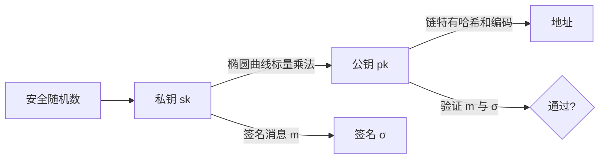
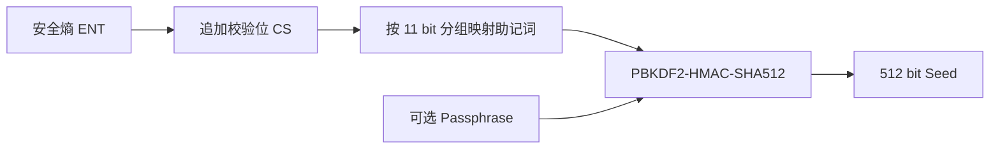
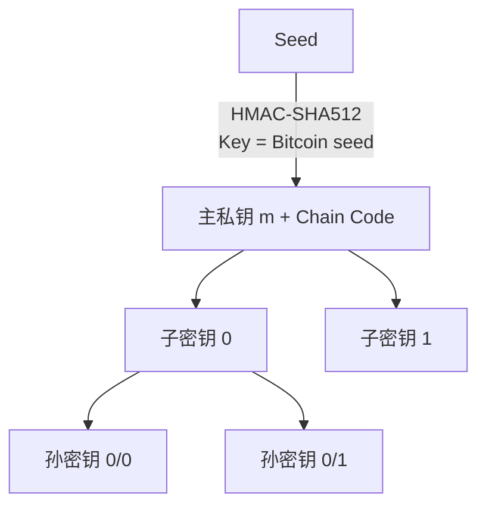
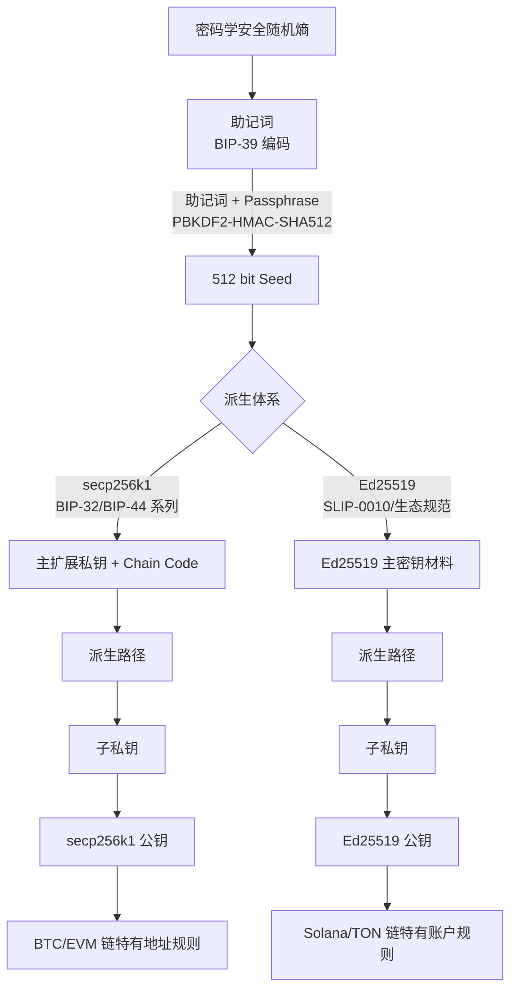

# Day 02：密码学、密钥与 HD Wallet

> 学习目标：理解钱包使用的密码学组件、密钥派生标准和多链地址差异，能够解释签名安全风险，并完成一个仅用于学习的 Java 本地签名与验签程序。  
> 建议用时：3～4 小时  
> 完成标准：能脱离资料画出密钥派生图，比较 ECDSA、Schnorr、Ed25519，并回答文末 7 道面试题。

## 安全边界

- 所有练习只使用临时生成、没有任何资产的测试密钥。
- 不在源码、日志、截图、Git、聊天工具或配置文件中保存真实助记词和私钥。
- 示例程序用于理解签名 API，不等同于可直接处理链上交易的生产签名器。
- 生产钱包应使用经过审计的链 SDK、密码库、HSM 或 MPC 方案，不自行实现椭圆曲线运算。

---

## 一、基础密码学组件

### 1. 哈希

哈希函数把任意长度输入映射为固定长度摘要：

$$
h = H(m)
$$

钱包中常见用途：

- 生成交易摘要和交易标识；
- 构造地址；
- Merkle Tree；
- 完整性校验；
- 签名前压缩待签名消息；
- 工作量证明等共识机制。

重要性质：

- **确定性**：相同输入得到相同输出；
- **原像抗性**：难以从摘要反推出原文；
- **第二原像抗性**：给定一条消息，难以找到摘要相同的另一条消息；
- **碰撞抗性**：难以找到任意两条摘要相同的消息；
- **雪崩效应**：输入发生微小变化，输出应显著变化。

> 哈希不是加密。哈希通常不可逆，也不存在用于“解密”的密钥。

### 2. 对称加密

加密和解密使用同一个密钥：

$$
c = E_k(m), \qquad m = D_k(c)
$$

特点：

- 速度快，适合保护大量数据；
- 密钥分发和保管困难；
- 应使用带认证的加密模式，例如 AES-GCM；
- 不能把固定 IV、ECB 或“只加密不认证”当作安全设计。

钱包中的典型用途是加密备份或敏感配置，但“私钥被加密后存入普通业务数据库”不自动等于安全，因为解密密钥、运行环境和访问权限仍可能同时失陷。

### 3. 非对称密码

非对称体系使用成对密钥：

- 私钥必须保密；
- 公钥可以公开；
- 数字签名由私钥产生，由公钥验证。

区块链钱包主要使用非对称密码完成身份控制和交易授权，而不是加密公开链上的交易内容。

### 4. 数字签名

抽象流程：

$$
\sigma = \operatorname{Sign}(sk, m)
$$

$$
\operatorname{Verify}(pk, m, \sigma) \in \{true,false\}
$$

数字签名主要证明：

1. 签名者掌握与公钥对应的私钥；
2. 被验证的消息自签名后未被修改；
3. 在协议和证据链成立的前提下，可提供一定的授权证据。

数字签名**不能保证消息保密**。公开链上的交易、金额和签名通常都可以被任何人读取。

### 5. 四类技术对比

| 技术 | 是否使用密钥 | 是否可逆 | 主要目标 | 钱包场景 |
|---|---:|---:|---|---|
| 哈希 | 否 | 通常不可逆 | 摘要、完整性、承诺 | 交易摘要、地址、Merkle Tree |
| 对称加密 | 是，同一密钥 | 是 | 数据保密与认证 | 加密备份、静态敏感数据保护 |
| 非对称加密 | 是，公私钥对 | 是 | 保密传输 | 通信协议中可能使用，不是普通链上转账核心 |
| 数字签名 | 是，公私钥对 | 不适用 | 身份控制、完整性、授权 | 交易签名、消息签名 |

---

## 二、私钥、公钥、地址、签名与验签

### 1. 基本关系



椭圆曲线体系可抽象表示为：

$$
PK = sk \cdot G
$$

其中 $G$ 是曲线规定的生成点。由私钥计算公钥容易，但在正确参数和密钥空间下，从公钥反推出私钥在计算上不可行。

### 2. 地址不是公钥的通用别名

地址通常由公钥经过链特有规则得到，但不同链规则不同：

- BTC 地址与 Script 类型相关，可能编码公钥哈希、脚本哈希或 Taproot 输出密钥；
- EVM 地址通常取未压缩公钥主体 Keccak-256 摘要的后 20 字节，再使用十六进制或 EIP-55 表示；
- Solana 普通账户地址通常是 32 字节 Ed25519 公钥的 Base58 表示；
- TON 地址包含 Workchain 和账户 ID，并有 Raw/Friendly、Bounceable 等表示差异；钱包账户本身通常是合约账户。

因此，不能写一个“公钥取哈希”函数就声称支持所有链。

### 3. 签名对象必须明确

签名系统必须准确回答：

- 签的原始字节是什么？
- 是否先哈希，使用什么哈希和序列化规则？
- 是否包含 Chain ID、网络、合约、用途或版本？
- 数字字段使用什么字节序和长度？
- 签名编码是固定长度、DER，还是链特有格式？

“显示内容相同”不代表“待签名字节相同”。字符编码、序列化、字段顺序或前缀不同都会产生不同签名。

---

## 三、ECDSA、Schnorr 与 Ed25519

### 1. ECDSA

ECDSA 是基于椭圆曲线的数字签名算法。BTC 的传统及 SegWit v0 输入和 EVM 账户交易主要使用 `secp256k1` 曲线上的 ECDSA。

ECDSA 每次签名需要一个秘密 nonce $k$。简化公式为：

$$
r = x(kG) \bmod n
$$

$$
s = k^{-1}(z + rd) \bmod n
$$

其中：

- $d$ 是私钥；
- $z$ 是消息摘要对应的整数；
- $n$ 是曲线基点阶。

如果相同私钥对不同消息复用同一个 $k$，攻击者可由两个签名恢复 $k$，进而恢复私钥。若 $k$ 有偏差或熵不足，也可能通过统计或格攻击泄露私钥。

工程上通常采用标准规定的确定性 nonce 生成方式，例如 RFC 6979，并配合成熟密码库。EVM 还要求规范化低 $s$，并携带恢复标识或 `yParity` 等链特有信息。

### 2. Schnorr

BTC Taproot 的 Key Path 签名使用 BIP-340 定义的 `secp256k1` Schnorr 签名。

主要特点：

- 结构和安全分析相对简洁；
- 具有线性特征，更适合密钥聚合和多方协议；
- BIP-340 使用 x-only 公钥和固定 64 字节签名；
- nonce 生成必须严格遵循标准，BIP-340 还支持辅助随机数增强防护。

不能把通用“Schnorr”实现直接当成 BIP-340 实现；消息标记哈希、x-only 公钥、奇偶规范化和编码规则都必须符合标准。

### 3. Ed25519

Ed25519 是 Edwards25519 曲线上的 EdDSA 实例，Solana 和常见 TON 钱包主要使用 Ed25519。

主要特点：

- 密钥、签名编码较固定；
- 签名过程是确定性的，不依赖调用者额外提供随机 nonce；
- 性能好，工程接口相对简单；
- 必须使用正确变体和协议定义的消息格式。

确定性并不代表可以随意复用密钥或忽略域隔离。实现缺陷、故障注入、侧信道和错误的消息封装仍可能导致安全问题。

### 4. 对比表

| 维度 | ECDSA | BIP-340 Schnorr | Ed25519 |
|---|---|---|---|
| 常见曲线/形式 | `secp256k1` | `secp256k1`，x-only 公钥 | Edwards25519 |
| 典型链 | BTC Legacy/SegWit v0、EVM | BTC Taproot Key Path | Solana、常见 TON 钱包 |
| nonce | 必须唯一且不可预测；常用 RFC 6979 | 按 BIP-340 生成，可混入辅助随机数 | 从密钥材料和消息确定性派生 |
| 签名特点 | EVM/BTC 编码规则不同 | BIP-340 固定 64 字节 | 通常固定 64 字节 |
| 聚合能力 | 原生线性较弱 | 线性好，适合聚合协议 | 可构建多方协议，但不能简单拼接签名 |
| 主要风险 | nonce 复用/偏差、签名延展、编码错误 | nonce 实现错误、标准不兼容 | 变体混用、密钥格式和消息封装错误 |

### 5. 链与算法速查

| 链/场景 | 主要签名算法 | 关键提醒 |
|---|---|---|
| BTC Legacy、SegWit v0 | ECDSA + `secp256k1` | SIGHASH 与 DER/低 $s$ 规则 |
| BTC Taproot Key Path | BIP-340 Schnorr + `secp256k1` | x-only 公钥、Tagged Hash |
| EVM EOA 交易 | ECDSA + `secp256k1` | Chain ID、低 $s$、恢复标识/`yParity` |
| Solana | Ed25519 | 签名完整序列化 Message |
| 常见 TON Wallet | Ed25519 | 钱包合约版本和待签名 Cell/消息格式必须匹配 |

> “某条链使用某算法”只是第一层答案。生产接入还必须明确消息构造、哈希、编码、签名格式和验签规则。

---

## 四、BIP-39、BIP-32 与 BIP-44

### 1. BIP-39：熵、助记词与 Seed

BIP-39 的主要流程：



关键点：

- 助记词不是人脑选择的一组普通单词，而是随机熵与校验位的编码；
- 常见助记词长度为 12、15、18、21 或 24 个词；
- Seed 由助记词和可选 Passphrase 通过 PBKDF2-HMAC-SHA512 派生；
- 任意 Passphrase 都可能产生一个看似有效但完全不同的 Seed；
- Passphrase 丢失后无法仅凭助记词恢复对应钱包；
- BIP-39 负责生成 Seed，不负责规定具体链的地址路径。

### 2. BIP-32：分层确定性密钥

BIP-32 从一个 Seed 生成主扩展密钥，再派生树状子密钥：



扩展密钥不只有密钥本身，还包含 Chain Code 等派生信息。常见表示：

- `xprv`：扩展私钥，可继续派生私钥和公钥；
- `xpub`：扩展公钥，在非 Hardened 分支上可派生后代公钥。

#### Hardened 与 Non-hardened

- Hardened 索引常写作 `i'`，内部索引为 $i + 2^{31}$；
- Hardened 子密钥派生需要父私钥，不能只凭父公钥派生；
- Non-hardened 路径可通过扩展公钥派生地址，便于在线地址服务不接触私钥；
- 但 xpub 泄露会暴露对应分支的地址关系和隐私；在某些错误组合中，父 xpub 与一个 Non-hardened 子私钥泄露还可能危及父私钥。

### 3. BIP-44：路径语义

常见路径模板：

```text
m / purpose' / coin_type' / account' / change / address_index
```

字段含义：

| 层级 | 含义 | 示例 |
|---|---|---|
| `purpose'` | 派生规范或地址用途 | `44'`、`49'`、`84'`、`86'` |
| `coin_type'` | 币种编号 | BTC 常见 `0'`，ETH 常见 `60'` |
| `account'` | 逻辑账户 | `0'` |
| `change` | 外部收款或内部找零 | 常见 `0`/`1` |
| `address_index` | 地址序号 | `0`、`1`、`2`... |

常见示例仅供理解：

```text
BTC BIP-44 P2PKH: m/44'/0'/0'/0/0
BTC BIP-84 P2WPKH: m/84'/0'/0'/0/0
BTC BIP-86 P2TR:   m/86'/0'/0'/0/0
ETH 常见路径:      m/44'/60'/0'/0/0
```

> 路径只是密钥派生约定，不会自动决定最终地址格式。BTC 地址还取决于 Script 类型，ETH 地址还要执行 EVM 特有公钥哈希和编码。

### 4. Ed25519 链的派生差异

BIP-32 原始规范围绕 `secp256k1`。Solana 等 Ed25519 链常使用 SLIP-0010 或生态钱包约定，并常采用全 Hardened 路径。TON 的路径和密钥处理还可能随钱包标准或 SDK 而变化。

因此：

- 不应假设同一个通用 BIP-32 实现可以直接派生所有链；
- 必须固定并记录链、算法、路径规范、钱包版本和 SDK；
- 恢复前必须验证地址能否与历史记录一致；
- 路径错误不会报“私钥错误”，而是产生另一组合法但不持有目标资产的地址。

### 5. 完整派生关系图



---

## 五、确定性签名、随机数复用、重放攻击与域隔离

### 1. 确定性签名

确定性签名的目标是避免依赖质量不可靠的外部随机数。例如 RFC 6979 根据私钥和消息摘要生成 ECDSA nonce。

它解决的是 nonce 随机源风险，不代表：

- 相同私钥可以跨协议随意复用；
- 不需要侧信道防护；
- 不需要规范化编码；
- 不需要消息域隔离；
- 所有库对同一“显示文本”都会输出相同签名。

### 2. ECDSA nonce 复用为何泄露私钥

同一私钥 $d$ 使用相同 $k$ 签署两个不同摘要 $z_1,z_2$：

$$
s_1 = k^{-1}(z_1 + rd) \bmod n
$$

$$
s_2 = k^{-1}(z_2 + rd) \bmod n
$$

两式相减可求：

$$
k = (z_1-z_2)(s_1-s_2)^{-1} \bmod n
$$

进而得到：

$$
d = (s_1k-z_1)r^{-1} \bmod n
$$

这说明 nonce 是一次性秘密，不是可以重复使用的普通编号。

### 3. 重放攻击

重放攻击是攻击者把一份过去有效的签名或交易再次提交，使系统重复执行授权操作。

常见防护：

- 链或网络标识，例如 EVM Chain ID；
- 账户序号，例如 EVM nonce、TON `seqno`；
- 已消费输入，例如 BTC UTXO；
- Recent Blockhash 或有效期；
- 合约 nonce；
- 签名请求中的业务单号、时间窗和一次性挑战；
- 数据库幂等约束。

### 4. 域隔离

域隔离把协议、链、版本或用途绑定到待签名消息中：

$$
m' = H(\text{domain} \parallel \text{message})
$$

它避免一份为 A 场景生成的签名在 B 场景被解释为有效授权。

常见思想或实例：

- EVM Chain ID 防止旧式跨链交易重放；
- EIP-712 将 Domain、类型和结构化数据绑定；
- BIP-340 使用 Tagged Hash 区分计算用途；
- 签名服务把环境、链、资产、业务类型、业务单和版本加入授权上下文。

签名服务不能只接收无语义哈希并直接签名，否则无法确认哈希究竟对应哪条链、哪个地址、多少金额以及什么业务授权。

---

## 六、Java 中的常见风险

### 1. 金额

- 禁止使用 `double` 或 `float` 保存资产金额；
- 链上原始金额优先使用最小单位整数和 `BigInteger`；
- 对外十进制展示可使用 `BigDecimal`，并明确资产精度和舍入策略；
- 从字符串构造 `BigDecimal`，不要从二进制浮点值构造；
- 数据库存储精度必须覆盖最大供应量、手续费和中间计算。

示例：

```java
BigInteger wei = new BigInteger("1000000000000000000");
BigDecimal eth = new BigDecimal(wei).movePointLeft(18);
```

### 2. `BigInteger` 的符号陷阱

`new BigInteger(byte[])` 会把最高位解释为符号位。解析无符号哈希或整数时应明确：

```java
BigInteger unsigned = new BigInteger(1, bytes);
```

反向转换时，`toByteArray()` 可能为了保持正数而添加前导 `0x00`，不能假设输出总是固定 32 字节。链上编码通常需要显式的定长左填充和范围校验。

### 3. 字节序

- 网络协议和多数密码编码常使用大端序；
- BTC 交易展示值、内部序列化字段和哈希显示可能存在字节顺序差异；
- 不要因为区块浏览器显示顺序与字节数组不同就直接反转所有字段；
- 每个字段必须依据对应协议处理。

### 4. 十六进制

- 明确是否允许 `0x` 前缀；
- 校验偶数长度和合法字符；
- 保留前导零；
- 不要用 `new BigInteger(hex, 16).toByteArray()` 代替可靠 Hex 解码；
- 日志不得打印私钥、Seed、助记词或完整签名请求中的敏感内容。

### 5. 字符编码与序列化

- 字符串转字节必须显式使用 `StandardCharsets.UTF_8`；
- JSON 字段顺序、空白和数字表示不稳定，不应直接把普通 JSON 文本作为跨系统签名协议；
- 使用协议规定的 RLP、SSZ、Borsh、BOC、Protobuf 或确定性编码；
- 明确“签原文”还是“签摘要”，避免调用方和签名端重复哈希。

### 6. 密钥生命周期

- 优先让密钥留在 HSM/MPC/受控密钥容器中；
- 若学习代码必须使用内存字节数组，尽量缩短生命周期并在使用后覆盖；
- Java `String` 不可变，不适合承载可擦除的私钥或口令；
- 覆盖数组不能保证消除 JVM、Dump、交换文件和库内部副本；
- 禁止在异常堆栈、指标标签和 Trace 中携带秘密。

### 7. 签名编码与库差异

- `SHA256withECDSA` 通常输出 ASN.1 DER 编码的 `(r,s)`，不等同于 EVM 的 65 字节或 EIP-2098 格式；
- JDK 的 `EC` 支持情况不代表始终支持 `secp256k1`；
- Ed25519 API 对消息直接签名，调用者不要擅自额外哈希，除非协议明确要求；
- 生产中使用链官方或成熟 SDK 构建准确的待签名字节。

---

## 七、Java 本地签名与验签练习

下面示例使用 JDK 17+ 内置 Ed25519，只用于演示“生成密钥 → 签名 → 验签 → 篡改后失败”。它不是 Solana 或 TON 交易签名程序，因为真实链还需要按协议构造完整交易消息。

```java
import java.nio.charset.StandardCharsets;
import java.security.KeyPair;
import java.security.KeyPairGenerator;
import java.security.Signature;
import java.util.Base64;

public final class Ed25519SignVerifyDemo {
	public static void main(String[] args) throws Exception {
		KeyPairGenerator generator = KeyPairGenerator.getInstance("Ed25519");
		KeyPair keyPair = generator.generateKeyPair();

		byte[] message = "wallet-signing-demo".getBytes(StandardCharsets.UTF_8);

		Signature signer = Signature.getInstance("Ed25519");
		signer.initSign(keyPair.getPrivate());
		signer.update(message);
		byte[] signature = signer.sign();

		Signature verifier = Signature.getInstance("Ed25519");
		verifier.initVerify(keyPair.getPublic());
		verifier.update(message);
		boolean valid = verifier.verify(signature);

		Signature tamperedVerifier = Signature.getInstance("Ed25519");
		tamperedVerifier.initVerify(keyPair.getPublic());
		tamperedVerifier.update("wallet-signing-demo-tampered"
				.getBytes(StandardCharsets.UTF_8));
		boolean tamperedValid = tamperedVerifier.verify(signature);

		System.out.println("publicKey="
				+ Base64.getEncoder().encodeToString(keyPair.getPublic().getEncoded()));
		System.out.println("signature="
				+ Base64.getEncoder().encodeToString(signature));
		System.out.println("valid=" + valid);
		System.out.println("tamperedValid=" + tamperedValid);
	}
}
```

预期结果：

```text
valid=true
tamperedValid=false
```

练习时观察：

1. 每次生成的新密钥不同；
2. 同一密钥和同一消息的 Ed25519 签名应具有确定性；
3. 修改消息后原签名验证失败；
4. 换一个公钥后验证失败；
5. 公钥编码是带算法信息的 X.509 `SubjectPublicKeyInfo`，不等同于链上使用的原始 32 字节公钥。

> 不要把示例改成打印私钥。即使是测试代码，也应建立“不输出密钥”的习惯。

---

## 八、口头面试题参考答案

> 使用方式：先不看答案回答，再按“结论 → 原理 → 生产实现 → 风险”补全。

### 1. 私钥、公钥、地址三者如何关联？

**参考回答：**

私钥是安全随机生成的秘密标量，公钥通常由私钥在指定椭圆曲线上的单向运算得到。地址再通过链特有的公钥处理、脚本语义、哈希和编码规则生成。私钥用于签名，公钥用于验签，地址用于标识链上收款或账户。

这种关系不是所有链完全相同。BTC 地址取决于 P2PKH、SegWit、Taproot 等 Script 类型；EVM 地址来自 `secp256k1` 公钥的 Keccak 摘要；Solana 普通地址通常直接编码 Ed25519 公钥；TON 地址标识钱包合约账户。因此地址服务必须按链和地址类型实现，不能把地址简单等同于公钥哈希。

### 2. 数字签名证明了什么？它能否保证交易内容保密？

**参考回答：**

数字签名证明签名者掌握对应私钥，并且被验证的消息自签名后没有改变。在具体协议和授权链成立时，它可作为交易授权依据。

签名不保证保密。消息、签名和公钥都可以公开，任何人都能验签。若需要保护静态敏感数据，应使用带认证的对称加密；若需要保护传输，则使用 TLS 等安全信道。区块链交易最终通常是公开的。

### 3. BIP-39 和 BIP-32 分别解决什么问题？

**参考回答：**

BIP-39 规定如何把随机熵和校验位编码为助记词，并通过助记词与可选 Passphrase 派生 512 位 Seed。它解决的是 Seed 的备份和人工可记录表示。

BIP-32 规定如何从 Seed 生成主扩展密钥，并用密钥和 Chain Code 分层派生大量子密钥。它解决的是一份根材料管理多个账户和地址的问题。BIP-44 则进一步赋予路径各层用途、币种、账户、找零和索引等语义。

需要补充的是，Ed25519 链经常采用 SLIP-0010 或生态特有路径，不应假设原始 BIP-32 可直接覆盖所有链。

### 4. 为什么同一个助记词可以派生多条链的地址？

**参考回答：**

同一个助记词通过 BIP-39 得到同一个 Seed。不同链或账户按照不同派生路径、曲线和派生标准得到不同子私钥，再使用各自的公钥、哈希、脚本和地址编码规则生成地址。

所以“同一助记词支持多链”依赖一组明确约定：Seed 算法、曲线、路径、钱包版本和地址格式。只要其中一个约定不同，就可能得到另一组完全合法但不同的地址。恢复钱包时必须验证路径和地址，不应只确认助记词校验通过。

### 5. ECDSA 的随机数被复用会造成什么后果？

**参考回答：**

ECDSA 每次签名使用秘密 nonce $k$。同一私钥对两个不同消息复用相同 $k$ 时，两个签名会具有相同的 $r$，攻击者可以联立公式求出 $k$，随后恢复私钥。nonce 有偏差或熵不足也可能逐步泄露私钥。

生产实现应采用成熟密码库和标准确定性 nonce 方案，例如 RFC 6979，并做好侧信道、故障注入和密钥访问防护。确定性签名减少随机源风险，但不能代替 HSM、MPC、域隔离和权限控制。

### 6. BTC Taproot、ETH、Solana/TON 分别主要使用什么签名算法？

**参考回答：**

- BTC Legacy 和 SegWit v0 主要使用 `secp256k1` ECDSA；
- BTC Taproot Key Path 使用 BIP-340 `secp256k1` Schnorr；
- ETH EOA 交易使用 `secp256k1` ECDSA，并包含恢复标识或 `yParity` 等交易格式信息；
- Solana 使用 Ed25519；
- 常见 TON Wallet 使用 Ed25519，但待签名字节取决于钱包合约版本和消息格式。

面试中不能只答算法名，还应补充每条链的消息构造、哈希、编码和签名格式不同，不能跨链复用签名代码。

### 7. 为什么生产系统不能自行发明加密算法或签名格式？

**参考回答：**

密码系统的安全依赖算法设计、参数选择、随机数、编码、实现、侧信道防护和长期公开分析。自创算法即使看起来复杂，也很可能存在攻击者可利用的数学结构、nonce、延展性、解析歧义或降级问题，而且无法与链节点和硬件设备互操作。

生产钱包应使用链协议规定的算法和序列化格式，以及经过审计、持续维护的密码库或 HSM/MPC 实现。团队的工作重点应是正确构造待签名交易、隔离密钥、校验授权、限制额度、审计和恢复，而不是发明新的密码原语。

---

## 九、当天任务

### 任务 1：基础概念（45 分钟）

- [ ] 用自己的话区分哈希、对称加密、非对称密码和数字签名。
- [ ] 画出私钥、公钥、地址、签名和验签关系图。
- [ ] 分别写出 BTC、EVM、Solana、TON 的公钥与地址关系差异。
- [ ] 解释为什么签名不能隐藏交易内容。

### 任务 2：算法对比（45 分钟）

- [ ] 完成 ECDSA、BIP-340 Schnorr、Ed25519 对比表。
- [ ] 记住 BTC Legacy/SegWit v0、Taproot、EVM、Solana、TON 的主要签名算法。
- [ ] 手工推导 ECDSA nonce 复用恢复私钥的公式关系。
- [ ] 列出确定性签名仍不能解决的三个安全问题。

### 任务 3：HD Wallet（60 分钟）

- [ ] 重画“熵 → 助记词 → Seed → 主密钥 → 子私钥 → 公钥 → 地址”。
- [ ] 解释 BIP-39、BIP-32、BIP-44 各自负责什么。
- [ ] 写出 BTC BIP-84、BTC BIP-86 和 ETH 常见路径。
- [ ] 对比 Hardened 与 Non-hardened 派生。
- [ ] 说明为什么 Solana/TON 不能机械套用 BTC 的 BIP-32 实现。

### 任务 4：Java 实践（45～60 分钟）

- [ ] 在本地运行 Ed25519 签名与验签示例。
- [ ] 验证原消息结果为 `true`，篡改消息结果为 `false`。
- [ ] 使用错误公钥再次验签并确认失败。
- [ ] 检查代码、终端记录和 Git 状态，确保未输出或提交私钥。
- [ ] 写出该示例与真实 Solana/TON 交易签名之间至少三个差异。

### 任务 5：Java 风险检查（30 分钟）

- [ ] 用 `BigInteger` 表示 1 ETH 的 Wei 数量，并转换为 `BigDecimal` 展示。
- [ ] 验证 `new BigInteger(byte[])` 与 `new BigInteger(1, byte[])` 的差异。
- [ ] 验证前导零在 `BigInteger.toByteArray()` 中的表现。
- [ ] 整理金额、Hex、字符集、字节序和签名编码检查表。

### 任务 6：口头表达（30～45 分钟）

- [ ] 不看答案回答 7 道面试题并录音。
- [ ] 每题先用 30 秒给结论，再用 2～5 分钟展开。
- [ ] 回听并检查是否讲清标准、链差异和生产风险。
- [ ] 将答错或含糊的概念写入 `progress.md`。

---

## 十、闭卷验收

在不看资料的情况下完成：

- [ ] 3 分钟讲清哈希、加密和签名的区别。
- [ ] 5 分钟画出完整 HD Wallet 派生流程。
- [ ] 5 分钟比较 ECDSA、Schnorr、Ed25519。
- [ ] 3 分钟解释 ECDSA nonce 复用如何泄露私钥。
- [ ] 3 分钟说明 BIP-39、BIP-32、BIP-44 的职责边界。
- [ ] 3 分钟说明为什么一个通用地址生成函数无法正确支持四条链。
- [ ] 说出至少 8 个 Java 密码与金额处理风险。

## 十一、Day 02 验收清单

- [ ] 能解释私钥、公钥、地址、签名和验签的关系。
- [ ] 能说明数字签名不提供保密性。
- [ ] 能比较三种签名算法及其主要使用链。
- [ ] 能解释助记词、Passphrase、Seed、主密钥和派生路径。
- [ ] 能区分 Hardened 与 Non-hardened 派生。
- [ ] 能解释确定性签名、nonce 复用、重放攻击和域隔离。
- [ ] Java 示例运行成功，篡改消息验签失败。
- [ ] 没有在仓库或日志中留下任何私钥和助记词。
- [ ] 已完成 7 道口头面试题并更新 `progress.md`。

## 十二、自评分

| 能力 | 1 分 | 3 分 | 5 分 | 今日得分 |
|---|---|---|---|---|
| 密码学基础 | 只能记住术语 | 能解释哈希、加密和签名 | 能说明安全性质、适用边界和误用风险 |  |
| 密钥与地址 | 混淆私钥、公钥和地址 | 能解释基本派生关系 | 能比较四条链的曲线、路径和地址规则 |  |
| 签名算法 | 只能说出算法名称 | 能对应主要使用链 | 能解释 nonce、编码、域隔离和实现风险 |  |
| HD Wallet | 只能背路径 | 能区分三个 BIP | 能解释 Hardened、xpub、Ed25519 差异和恢复风险 |  |
| Java 实践 | 示例无法运行 | 能完成签名与验签 | 能识别金额、字节、编码和密钥生命周期风险 |  |
| 口头表达 | 回答零散 | 能说明正常原理 | 能比较方案并回答连续安全追问 |  |

**当日总分：** ____ / 30  
**最薄弱的三个知识点：** 1. __________ 2. __________ 3. __________  
**明日优先补强：** ______________________________
