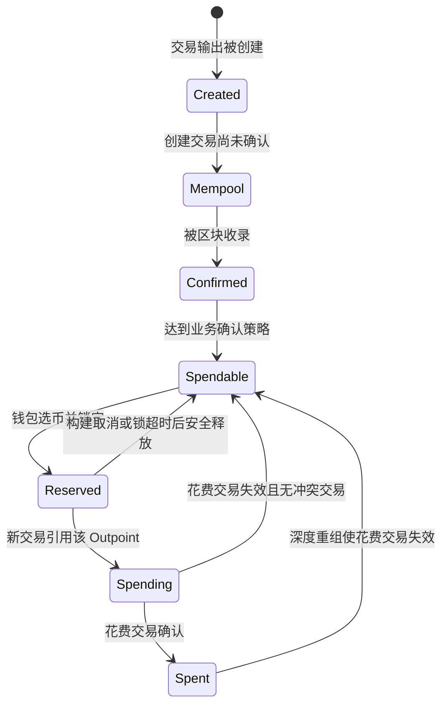
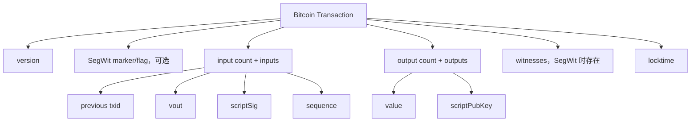
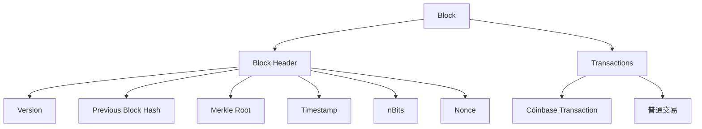
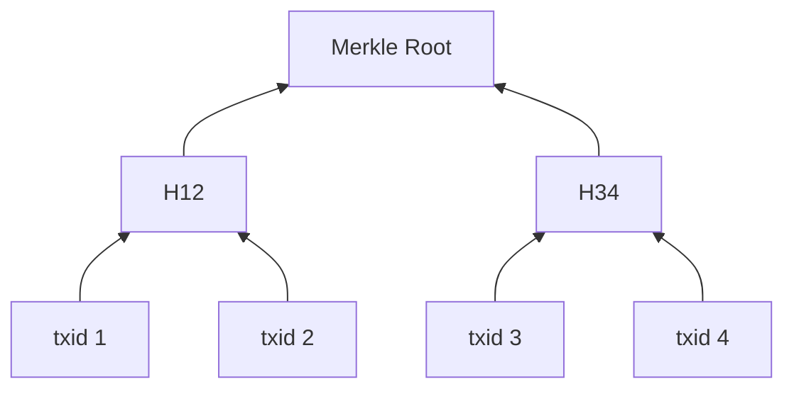
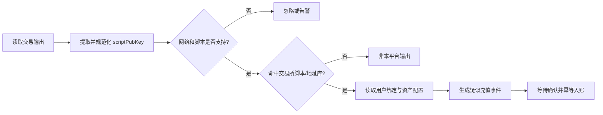
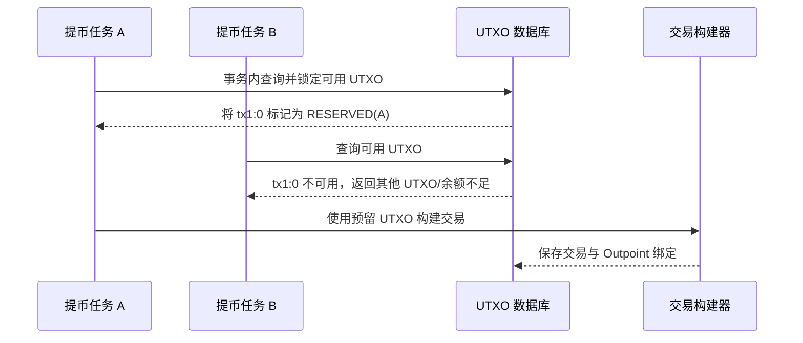

# Day 03：BTC UTXO 与交易解析

> 学习目标：理解 Bitcoin 的 UTXO 状态模型，能够逐字段解析一笔交易，识别常见输出脚本和地址类型，并准确计算余额、手续费与确认数。  
> 建议用时：3～4 小时  
> 完成标准：独立解析一笔 Bitcoin Testnet 交易，解释每个输入和输出的来源、去向、金额及脚本类型，并完成文末 7 道面试题。

## 安全边界

- 实践仅使用 Bitcoin Testnet、Signet 或公开链上交易。
- 不使用、不导入任何真实资产私钥或助记词。
- 区块浏览器用于辅助观察，生产钱包不能把浏览器 API 作为唯一资金数据源。
- 不根据地址外观猜测资金归属；生产系统以受控地址库和规范化 `scriptPubKey` 为准。

---

## 一、UTXO 模型

### 1. 什么是 UTXO

UTXO 是 **Unspent Transaction Output**，即“尚未被花费的交易输出”。

Bitcoin 不在链上维护如下账户记录：

```text
Alice.balance = 1.5 BTC
```

它维护的是所有当前仍可花费的输出集合：

```text
UTXO Set = {尚未被后续交易输入引用的全部输出}
```

一个 UTXO 至少可以用以下二元组定位：

```text
(txid, vout)
```

其中：

- `txid`：创建该输出的交易标识；
- `vout`：该输出在交易输出数组中的索引，从 `0` 开始。

UTXO 还包含：

- 金额，单位为 satoshi；
- `scriptPubKey`，规定未来花费该输出必须满足的条件；
- 是否来自 Coinbase Transaction；
- 所在区块及确认信息。

### 2. UTXO 生命周期



从共识角度，输出只有“未花费”或“已花费”；`Reserved`、`Spending` 等是托管钱包为了并发控制建立的业务状态。

### 3. 一笔交易如何转移价值

假设钱包拥有两个 UTXO：

| Outpoint | 金额 |
|---|---:|
| `txA:0` | 0.4 BTC |
| `txB:1` | 0.7 BTC |

用户要支付 0.8 BTC，手续费为 0.0001 BTC。钱包可以消费两个 UTXO，并创建：

- 收款输出：0.8 BTC；
- 找零输出：0.2999 BTC；
- 手续费：0.0001 BTC。

$$
0.4 + 0.7 = 0.8 + 0.2999 + 0.0001
$$

原来的两个 UTXO 被整体消费，不能只从其中“扣除一部分”。未支付给收款方的剩余价值必须通过新的找零输出返还，否则会全部成为矿工费。

### 4. BTC 余额如何计算

某个钱包的链上余额不是一个独立账户字段，而是它当前可控制的 UTXO 金额之和：

$$
\text{Balance} = \sum_{u \in \text{Wallet UTXO Set}} u.\text{value}
$$

生产钱包通常还会区分：

- `unconfirmed`：零确认输出；
- `confirmed`：已确认输出；
- `spendable`：达到策略且未锁定；
- `reserved`：已被提币任务预占；
- `immature`：尚未成熟的 Coinbase 输出；
- `frozen`：因风控、合规或人工操作禁止消费。

因此，可用余额通常不是简单的节点地址余额：

$$
\text{Spendable Balance}
= \sum \text{Confirmed UTXO}
- \sum \text{Reserved/Frozen UTXO}
$$

---

## 二、Bitcoin 交易结构

### 1. 交易整体结构



关键字段：

| 字段 | 作用 |
|---|---|
| `version` | 交易格式及部分语义版本 |
| `marker/flag` | SegWit 序列化标识，传统交易不存在 |
| Input Count | 输入数量，使用 CompactSize 编码 |
| Inputs | 引用旧 UTXO，并提供满足花费条件的数据 |
| Output Count | 输出数量，使用 CompactSize 编码 |
| Outputs | 创建新 UTXO，指定金额和锁定脚本 |
| Witness | SegWit 输入的见证数据 |
| `locktime` | 交易最早可被确认的高度或时间条件之一 |

### 2. 交易输入

每个普通输入主要包括：

```text
previous_txid
vout
scriptSig
sequence
witness（在交易主体之外按输入对应保存）
```

#### `previous_txid` 与 `vout`

二者共同形成 Outpoint，定位本次要消费的旧输出：

```text
previous_txid:vout
```

要解析输入金额和被花费的脚本，必须继续查询前序交易的对应输出。当前交易输入本身不直接携带输入金额。

#### `scriptSig`

`scriptSig` 是传统输入中的解锁数据。例如 P2PKH 输入通常在其中放置签名和公钥。

对于 Native SegWit 输入，`scriptSig` 通常为空；对于 P2SH 嵌套 SegWit，它通常只携带 Redeem Script，而签名和公钥位于 Witness。

#### `sequence`

`sequence` 可参与：

- 相对时间锁 BIP-68；
- Replace-by-Fee（BIP-125）信号及策略判断；
- 与 `locktime` 的启用关系。

不能只把它理解成没有意义的固定值。

#### Witness

Witness 是 SegWit 引入的、与每个输入对应的见证栈。不同脚本类型内容不同：

- P2WPKH：通常是签名、公钥；
- P2WSH：满足 Witness Script 所需的数据以及 Witness Script；
- P2TR Key Path：通常是 Schnorr 签名；
- P2TR Script Path：还会包含脚本和 Control Block。

### 3. 交易输出

每个输出包含：

```text
value
scriptPubKey
```

#### `value`

输出金额使用 satoshi 表示：

$$
1\ \text{BTC} = 100,000,000\ \text{satoshi}
$$

协议层应使用整数处理金额，不能用 `double`。

#### `scriptPubKey`

`scriptPubKey` 是锁定脚本，它表达“未来谁可以在什么条件下花费这个输出”。地址只是某类锁定条件的人类友好编码，并不是交易输出中直接保存的字符串。

### 4. `txid` 与 `wtxid`

- `txid`：对不包含 Witness 的传统交易序列化执行两次 SHA-256 后，以常见显示字节序展示；
- `wtxid`：对包含 Witness 的完整交易序列化执行两次 SHA-256 后得到。

对于非 SegWit 交易，两者相同；对于包含 Witness 的交易，通常不同。

SegWit 把签名等见证数据移出 `txid` 的计算范围，解决了传统交易中第三方修改签名编码导致 `txid` 改变的主要交易延展性问题，并为后续扩展提供了更好的结构。

> SegWit 没有消灭所有“重新构造不同交易”的可能性，它主要解决旧式签名数据导致的非预期交易标识延展问题。

---

## 三、手续费、重量与找零

### 1. 手续费计算

Bitcoin 交易没有单独的 `fee` 字段。手续费由输入总额减去输出总额隐式得到：

$$
\text{Fee} = \sum \text{Input Value} - \sum \text{Output Value}
$$

因此，仅查看当前交易原始数据通常无法独立算出手续费，还必须取得每个输入引用的前序输出金额。

如果出现：

$$
\sum \text{Output Value} > \sum \text{Input Value}
$$

普通交易无效。Coinbase Transaction 是创建区块补贴和领取手续费的特殊交易，不适用普通输入规则。

### 2. 费率

现代钱包常用 sat/vB 表示费率：

$$
\text{Fee Rate} = \frac{\text{Fee in sat}}{\text{Virtual Size in vB}}
$$

SegWit 使用 Weight：

$$
\text{Weight} = 4 \times \text{Stripped Size} + \text{Witness Size}
$$

$$
\text{Virtual Size} = \left\lceil \frac{\text{Weight}}{4} \right\rceil
$$

实际费用主要取决于交易占用的区块空间，而不是转账金额。一个输入很多的小额转账，费用可能高于金额很大的单输入转账。

### 3. 找零

找零是选中 UTXO 的总额扣除收款金额和手续费后的剩余值：

$$
\text{Change}
= \sum \text{Inputs}
- \sum \text{Payments}
- \text{Fee}
$$

找零通常发送到钱包新生成的内部地址。若找零太小，不值得未来花费，钱包可能把它作为额外手续费而不创建粉尘输出。

仅根据链上数据不一定能准确判断哪个输出是找零。常见启发式规则可能失效，例如：

- 多个收款人批量提币；
- 支付金额不规则；
- 找零地址类型与付款地址相同；
- CoinJoin 或隐私增强交易。

交易所应通过自己的构建记录和地址归属库确认找零，而不是依赖猜测。

---

## 四、常见输出脚本与地址类型

### 1. P2PKH

**Pay to Public Key Hash**，经典 Legacy 地址类型。

锁定脚本形式：

```text
OP_DUP OP_HASH160 <20-byte pubKeyHash> OP_EQUALVERIFY OP_CHECKSIG
```

特点：

- 主网地址通常以 `1` 开头；
- Testnet/Signet 常以 `m` 或 `n` 开头；
- 地址使用 Base58Check；
- 解锁数据通常位于 `scriptSig`；
- 相比 SegWit，占用空间和手续费通常更高。

### 2. P2SH

**Pay to Script Hash**，把复杂条件封装为脚本哈希。

锁定脚本形式：

```text
OP_HASH160 <20-byte scriptHash> OP_EQUAL
```

特点：

- 主网地址通常以 `3` 开头；
- Testnet/Signet 通常以 `2` 开头；
- 可承载多签等脚本；
- 也常用于兼容旧钱包的 P2SH-P2WPKH 或 P2SH-P2WSH 嵌套 SegWit；
- 仅看到 P2SH 输出时，通常要等它被花费后才能知道 Redeem Script 的具体条件。

### 3. P2WPKH

**Pay to Witness Public Key Hash**，SegWit v0 公钥哈希输出。

脚本形式：

```text
OP_0 <20-byte pubKeyHash>
```

特点：

- 主网地址通常以 `bc1q` 开头；
- Testnet/Signet 通常以 `tb1q` 开头；
- 使用 Bech32；
- `scriptSig` 为空，签名和公钥位于 Witness；
- 相比 P2PKH 通常节省费用。

### 4. P2WSH

**Pay to Witness Script Hash**，SegWit v0 脚本哈希输出。

脚本形式：

```text
OP_0 <32-byte witnessScriptHash>
```

特点：

- 地址通常也是 `bc1q` 或 `tb1q`，但长度与 P2WPKH 不同；
- 可表达多签和更复杂的 Witness Script；
- 使用 SHA-256 脚本哈希；
- 花费时 Witness 中包含满足条件的数据和 Witness Script。

### 5. P2TR

**Pay to Taproot**，SegWit v1 输出。

脚本形式：

```text
OP_1 <32-byte outputKey>
```

特点：

- 主网地址通常以 `bc1p` 开头；
- Testnet/Signet 通常以 `tb1p` 开头；
- 使用 Bech32m，不是 SegWit v0 的 Bech32 校验常量；
- Key Path 使用 BIP-340 Schnorr 签名；
- Script Path 可以只揭示实际执行的脚本分支，改善隐私和效率。

### 6. 类型对比表

| 类型 | Witness 版本 | 锁定对象 | 主网前缀 | Testnet/Signet 前缀 | 编码 | 典型解锁位置 |
|---|---:|---|---|---|---|---|
| P2PKH | 无 | 公钥哈希 | `1` | `m`/`n` | Base58Check | `scriptSig` |
| P2SH | 无 | Redeem Script 哈希 | `3` | `2` | Base58Check | `scriptSig`，嵌套 SegWit 时部分数据在 Witness |
| P2WPKH | 0 | 公钥哈希 | `bc1q` | `tb1q` | Bech32 | Witness |
| P2WSH | 0 | Witness Script 哈希 | `bc1q` | `tb1q` | Bech32 | Witness |
| P2TR | 1 | Taproot Output Key | `bc1p` | `tb1p` | Bech32m | Witness |

### 7. Legacy、Nested SegWit、Native SegWit 与 Taproot

| 分类 | 常见类型 | 优点 | 局限 |
|---|---|---|---|
| Legacy | P2PKH、P2SH | 兼容性最好 | 空间和手续费效率较低 |
| Nested SegWit | P2SH-P2WPKH、P2SH-P2WSH | 兼容只识别 P2SH 的旧系统 | 比 Native SegWit 多一层封装 |
| Native SegWit | P2WPKH、P2WSH | 费率和错误检测更好 | 极老旧系统可能不支持 |
| Taproot | P2TR | Schnorr、隐私和脚本效率更好 | 集成、签名和硬件兼容需充分验证 |

> 地址前缀只用于初步识别。生产系统应解码地址、校验网络和校验和，并生成或比对规范化 `scriptPubKey`。

---

## 五、区块、Merkle Tree、Mempool 与确认数

### 1. 区块

Bitcoin 区块可以抽象为：



区块头通过 `previous block hash` 连接前一个区块，形成链式结构。修改历史区块会改变其哈希及所有后续链接，并需要重新完成相应工作量。

### 2. Merkle Tree

区块中的交易 `txid` 两两哈希，逐层形成 Merkle Root：



Merkle Proof 可以用 $O(\log n)$ 个兄弟节点证明某笔交易被包含在区块中，而无需下载该区块的全部交易。

区块头中的传统 Merkle Root 基于 `txid`。SegWit Witness 数据通过 Coinbase Transaction 中的 Witness Commitment 另行承诺。

### 3. Mempool

Mempool 是节点保存“已验证但尚未确认交易”的本地集合。

重要认识：

- Mempool 不是全网统一数据库；
- 不同节点可能看到不同交易；
- 交易可能因为低费率、冲突、过期策略或节点重启而被移除；
- “本节点 Mempool 中查不到”不等于交易从未广播或必然失败；
- 零确认充值存在双花和替换风险，普通交易所不应直接按最终到账处理。

### 4. 确认数

若交易位于高度 $h$，当前最佳链高度为 $H$，确认数通常为：

$$
\text{Confirmations} = H - h + 1
$$

- 刚被区块收录：1 个确认；
- 后续又产生一个区块：2 个确认；
- 尚未进区块：0 个确认。

确认数越多，短链重组使交易失效的成本通常越高，但不是数学意义上的绝对不可逆。交易所应根据链、金额、来源风险和运营策略动态确定入账确认数。

### 5. Coinbase Transaction

Coinbase Transaction 是每个区块的第一笔交易，用于：

- 创建区块补贴；
- 领取该区块内普通交易的手续费；
- 承载区块高度等数据；
- 在 SegWit 区块中承载 Witness Commitment。

特点：

- 不引用普通 UTXO；
- 输入 Outpoint 使用特殊空值；
- 输出总额不能超过区块补贴加该区块手续费；
- Coinbase 输出需满足 100 个区块的成熟规则后才能花费。

交易所充值系统需要识别 Coinbase 输出，不能把未成熟输出计入可花费余额。

---

## 六、如何判断某个输出属于交易所

### 1. 生产判断流程



推荐做法：

1. 地址分配时同时保存标准地址、网络、脚本类型和规范化 `scriptPubKey`；
2. 扫块时按输出脚本精确匹配受控脚本库；
3. 使用 `network + txid + vout` 作为充值事件唯一键；
4. 保存区块高度和区块哈希用于确认与重组检测；
5. 根据地址绑定关系确定用户，但不要把 `userId` 放进链上事件唯一键；
6. 达到确认策略后，通过账本幂等流水完成入账。

### 2. 为什么优先匹配 `scriptPubKey`

- 链上输出保存的是脚本，不是地址字符串；
- 地址只是特定脚本模板的编码；
- 地址大小写、网络或编码处理错误可能造成误判；
- 某些非标准脚本无法表示成常见地址；
- 规范化脚本匹配更接近共识层事实。

### 3. 唯一键

BTC 充值唯一键推荐为：

```text
network + txid + vout
```

不能只使用 `txid`，因为一笔交易可以有多个输出，其中多个输出都可能属于交易所。

区块高度和区块哈希不应加入业务唯一键。同一个输出可能因重组进入不同区块；若把区块位置作为身份的一部分，可能产生重复入账。

---

## 七、两个提币任务消费同一个 UTXO

### 1. 会发生什么

假设任务 A 和任务 B 都引用 `tx1:0`：

- 两笔交易在共识上互相冲突；
- 最多只有一笔能在有效链上花费该 UTXO；
- 节点可能只接受先看到或费率策略更优的一笔；
- 另一笔会被拒绝、替换或长期处于错误状态；
- 若业务系统提前把两笔都标记为成功，可能造成账务和用户状态错误。

### 2. 钱包系统如何防止



关键措施：

- 数据库是 UTXO 分配状态的权威来源；
- 在同一事务中选择并将 UTXO 从 `AVAILABLE` 更新为 `RESERVED`；
- 使用行锁、条件更新或乐观锁处理竞争；
- 对“活跃消费关系”建立唯一约束；
- 将 UTXO 与提币业务单、原始交易和签名记录绑定；
- Redis 锁只能辅助协调，不能代替数据库状态和链上冲突检查；
- 释放预留前必须确认没有已签名或已广播交易，不能只依赖锁超时。

Day 04 将进一步学习 UTXO 选择、预留、RBF、CPFP 与交易加速。

---

## 八、测试网交易解析实践

### 1. 选择交易

从以下任一可靠来源选择一笔已经确认的 Bitcoin Testnet 或 Signet 交易：

- 自建 Bitcoin Core 节点；
- 公共 Testnet/Signet 区块浏览器；
- 自己使用无价值测试币创建的交易。

优先选择：

- 至少 1 个输入；
- 至少 2 个输出，便于分析收款与找零；
- 使用 P2WPKH 或 P2TR；
- 已确认，能查询前序输出；
- 原始交易 Hex 和 JSON 都可获取。

不要把主网大额交易、第三方 API Key 或任何私钥写入学习仓库。

### 2. 使用 Bitcoin Core 查询

节点已同步相应网络时，可使用：

```text
bitcoin-cli -testnet getrawtransaction <txid> true
bitcoin-cli -testnet getrawtransaction <txid> false
bitcoin-cli -testnet decoderawtransaction <raw_hex>
bitcoin-cli -testnet gettxout <txid> <vout>
```

如果是 Signet，将网络参数替换为 `-signet`。

解析输入金额时，还要查询每个输入的前序交易：

```text
bitcoin-cli -testnet getrawtransaction <previous_txid> true
```

公共节点可能关闭任意历史交易查询；生产扫描服务应使用正确配置和已同步的自建节点或可信索引层。

### 3. 逐字段解析清单

#### 交易级

- [ ] 网络：Testnet 或 Signet
- [ ] `txid`
- [ ] `wtxid/hash`
- [ ] `version`
- [ ] `size`
- [ ] `vsize`
- [ ] `weight`
- [ ] `locktime`
- [ ] 是否位于 Mempool 或区块
- [ ] 区块高度、区块哈希与确认数

#### 每个输入

- [ ] 输入索引
- [ ] `previous_txid`
- [ ] `vout`
- [ ] 前序输出金额
- [ ] 前序输出 `scriptPubKey`
- [ ] 前序输出脚本类型
- [ ] `scriptSig`
- [ ] `sequence`
- [ ] Witness 栈元素

#### 每个输出

- [ ] `vout`
- [ ] 金额（BTC 与 satoshi）
- [ ] `scriptPubKey` Hex
- [ ] 脚本类型
- [ ] 可表示的地址及网络
- [ ] 推测为收款、找零或其他输出，并说明证据和不确定性

#### 费用校验

- [ ] 输入总额
- [ ] 输出总额
- [ ] 手续费
- [ ] 费率 sat/vB
- [ ] 验证 `fee = inputs - outputs`

### 4. 解析报告模板

```markdown
# Bitcoin Testnet 交易解析报告

## 基本信息
- 网络：
- txid：
- wtxid：
- 区块高度/哈希：
- 确认数：
- version/locktime：
- size/vsize/weight：

## 输入
| vin | previous txid:vout | 金额 sat | 脚本类型 | scriptSig | Witness 摘要 |
|---:|---|---:|---|---|---|

## 输出
| vout | 金额 sat | scriptPubKey | 类型 | 地址 | 归属判断 |
|---:|---:|---|---|---|---|

## 费用
- 输入总额：
- 输出总额：
- 手续费：
- vsize：
- 费率：

## 结论
- 收款输出：
- 疑似找零输出及判断依据：
- 若交易所扫描该交易，疑似充值唯一键：
- 仍不能从公开链上确定的信息：
```

### 5. 不要伪造结论

公开链上通常可以确定金额、脚本、交易关系和确认状态，但未必能确定：

- 某地址现实中属于谁；
- 哪个输出一定是找零；
- 交易双方真实身份；
- 交易的业务目的。

解析报告应明确区分“链上事实”“钱包内部数据”和“启发式推测”。

---

## 九、口头面试题参考答案

> 先脱离答案口述，再用“结论 → 原理 → 生产实现 → 异常风险”补充。

### 1. 为什么 BTC 没有传统账户余额和 nonce？

**参考回答：**

Bitcoin 使用 UTXO 模型。共识状态记录哪些交易输出尚未被花费，而不是维护每个地址的余额字段。钱包余额是它能解锁的 UTXO 金额之和。

它也不需要 EVM 那样的账户 nonce，因为每笔交易通过 `txid:vout` 明确引用并消费旧输出。同一个 UTXO 在有效链上只能被成功消费一次，重复引用会形成双花冲突。交易顺序主要由输入依赖、区块顺序和共识验证确定。

交易所内部仍需要 UTXO 预留状态、版本号和业务幂等键，用来防止多个实例同时选中同一个输出。

### 2. 如何计算一笔 BTC 交易的手续费？

**参考回答：**

手续费等于所有输入引用的前序输出金额之和减去当前交易输出金额之和：

$$
\text{Fee}=\sum \text{Inputs}-\sum \text{Outputs}
$$

输入本身不直接保存金额，因此必须查询每个 Outpoint 对应的前序输出。费率通常用 `fee / vsize` 得到 sat/vB。生产系统还要验证金额范围、前序输出存在且未花费，并避免把 BTC 单位与 satoshi 混用。

### 3. 为什么交易输出之和通常小于输入之和？

**参考回答：**

两者差额就是矿工费。UTXO 必须整体消费，因此钱包通常创建收款输出和找零输出，把剩余价值返还给自己。如果不创建找零，未分配给输出的全部差额都会成为手续费。

输出之和可以等于输入之和，但这意味着零手续费，通常难以被节点中继和矿工确认；输出之和不能大于输入之和，Coinbase 特殊规则除外。

### 4. Witness 解决了什么问题？

**参考回答：**

SegWit 把签名等见证数据从传统交易主体中分离，并让 `txid` 不包含 Witness。这样解决了传统签名编码可被第三方修改而导致 `txid` 改变的主要交易延展性问题，使依赖未确认交易标识的二层协议更可靠。

同时，Weight 对 Witness 数据给予不同计费权重，提高区块有效容量，并通过版本化 Witness Program 为 Taproot 等升级提供扩展路径。Witness 并不是“不上链”，它仍随区块传播并受 Witness Commitment 约束。

### 5. `txid` 和交易确认数分别表示什么？

**参考回答：**

`txid` 是基于非 Witness 交易序列化计算的交易标识，用来引用交易及其输出。SegWit 交易还有包含 Witness 的 `wtxid`。

确认数表示交易所在区块以及其后的最佳链深度。交易刚进入区块是 1 个确认，当前高度减交易高度再加 1 即为确认数。确认数越多，短重组使交易失效的概率通常越低，但它不是绝对最终性的数学证明。

### 6. 如何判断某个输出属于交易所？

**参考回答：**

扫描服务读取输出的 `scriptPubKey`，解析并规范化脚本类型，然后与交易所地址分配时保存的受控脚本库精确匹配。命中后再根据地址绑定关系确定用户，生成 `network + txid + vout` 唯一的疑似充值记录。

不能只看地址字符串、金额或交易哈希。链上实际保存的是脚本，一笔交易也可能有多个属于交易所的输出。区块高度和哈希用于确认与重组检测，不应加入业务唯一键。

### 7. 两个提币任务同时消费同一个 UTXO 会发生什么？

**参考回答：**

两笔交易会形成双花冲突，最多只有一笔能在有效链上确认。另一笔可能被节点拒绝、被替换或最终失效。如果内部系统把两笔都当作成功，就会产生严重账务错误。

交易所应在数据库事务中选择并预留 UTXO，通过行锁、条件更新或乐观锁确保只有一个任务能把它从 `AVAILABLE` 改为 `RESERVED`，并建立活跃消费唯一约束。Redis 可以辅助协调但不能作为唯一保障。释放预留前必须核查是否已有已签名、已广播或冲突交易。

---

## 十、当天任务

### 任务 1：UTXO 基础（40 分钟）

- [ ] 用自己的话解释 UTXO、Outpoint 和 UTXO Set。
- [ ] 使用三个输入、两个输出画一笔交易的价值流。
- [ ] 解释为什么 UTXO 必须整体消费。
- [ ] 写出钱包余额、可用余额和预留余额的计算口径。

### 任务 2：交易结构（45 分钟）

- [ ] 画出 Bitcoin 交易完整字段结构。
- [ ] 解释 `txid`、`vout`、`scriptSig`、`sequence` 和 Witness。
- [ ] 说明为什么解析输入金额必须查询前序交易。
- [ ] 比较 `txid` 与 `wtxid`。

### 任务 3：地址与脚本（45 分钟）

- [ ] 完成 P2PKH、P2SH、P2WPKH、P2WSH、P2TR 对比表。
- [ ] 记住各类型的锁定脚本模板和 Testnet 前缀。
- [ ] 解释 Bech32 与 Bech32m 的使用边界。
- [ ] 说明为什么地址不是交易输出中的原始字段。

### 任务 4：测试网交易解析（60～90 分钟）

- [ ] 选择一笔已确认的 Testnet 或 Signet 交易。
- [ ] 获取原始 Hex、解码 JSON 和全部前序输出。
- [ ] 逐字段完成交易解析报告。
- [ ] 以 satoshi 为单位核对输入总额、输出总额和手续费。
- [ ] 计算 vsize、Weight 和 sat/vB 费率。
- [ ] 标出收款与疑似找零输出，并明确哪些只是推测。

### 任务 5：交易所场景（30 分钟）

- [ ] 设计地址库中保存的 BTC 地址和 `scriptPubKey` 字段。
- [ ] 写出疑似充值唯一键 `network + txid + vout`。
- [ ] 推演同一交易有两个输出都属于交易所的情况。
- [ ] 推演两个提币任务竞争同一 UTXO 的数据库状态变化。

### 任务 6：口头表达（30～45 分钟）

- [ ] 不看资料回答 7 道面试题并录音。
- [ ] 用 5 分钟完整讲解所选测试网交易。
- [ ] 回听并检查是否混淆地址、脚本、交易和 UTXO。
- [ ] 将薄弱点写入 `progress.md`。

---

## 十一、闭卷验收

- [ ] 3 分钟解释 UTXO 模型与账户模型的区别。
- [ ] 5 分钟画出一笔 Bitcoin 交易及其前序输出关系。
- [ ] 说出五种常见输出类型的脚本结构和地址前缀。
- [ ] 写出手续费、确认数、Weight 和 vsize 公式。
- [ ] 解释 `txid` 与 `wtxid` 的差异。
- [ ] 解释 Mempool 为什么不是全网统一状态。
- [ ] 说明 Coinbase Transaction 的三个特殊点。
- [ ] 说明交易所如何识别充值并防止重复入账。
- [ ] 说明交易所如何防止 UTXO 并发占用。

## 十二、Day 03 验收清单

- [ ] 能解释 UTXO 的创建、确认、预留、消费和重组恢复。
- [ ] 能逐字段解释交易输入和输出。
- [ ] 能查询前序输出并正确计算手续费。
- [ ] 能比较 P2PKH、P2SH、P2WPKH、P2WSH 和 P2TR。
- [ ] 能解释 SegWit、Witness、`txid` 和 `wtxid`。
- [ ] 能解释区块、Merkle Root、Mempool、确认数和 Coinbase。
- [ ] 已完成一份真实 Testnet/Signet 交易解析报告。
- [ ] 能说明充值识别键为什么是 `network + txid + vout`。
- [ ] 已完成 7 道口头面试题并更新 `progress.md`。

## 十三、自评分

| 能力 | 1 分 | 3 分 | 5 分 | 今日得分 |
|---|---|---|---|---|
| UTXO 模型 | 只能说出定义 | 能计算余额和价值流 | 能解释业务状态、并发与重组恢复 |  |
| 交易解析 | 只能识别输入输出 | 能逐字段解析和计算手续费 | 能处理 Witness、前序输出和异常数据 |  |
| 脚本与地址 | 只看地址前缀 | 能区分五种常见类型 | 能从脚本、编码和花费条件解释差异 |  |
| 区块与确认 | 只会数确认数 | 能解释 Merkle Tree 和 Mempool | 能说明节点差异、重组与确认策略 |  |
| 钱包工程 | 只能描述扫地址 | 能识别充值和锁定 UTXO | 能设计幂等、并发、审计和恢复 |  |
| 口头表达 | 回答零散 | 能讲清正常交易 | 能覆盖异常、安全和工程取舍 |  |

**当日总分：** ____ / 30  
**所解析的测试网交易 ID：** ______________________________  
**最薄弱的三个知识点：** 1. __________ 2. __________ 3. __________  
**明日优先补强：** ______________________________
