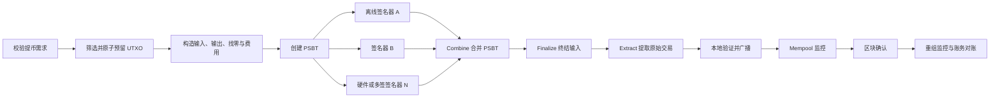
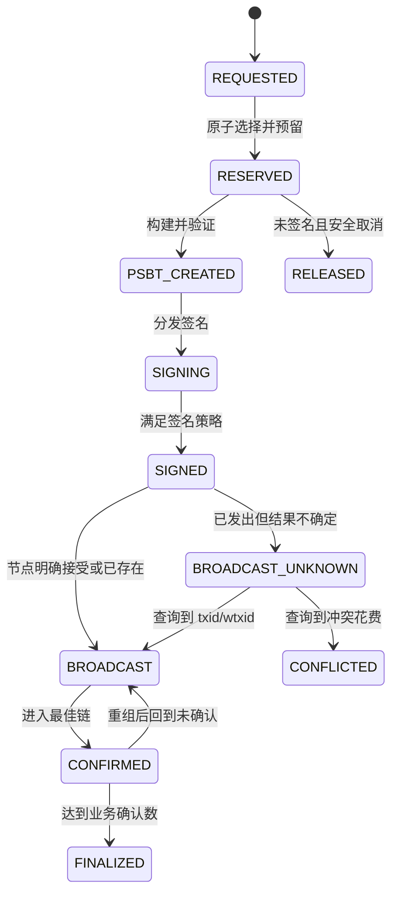
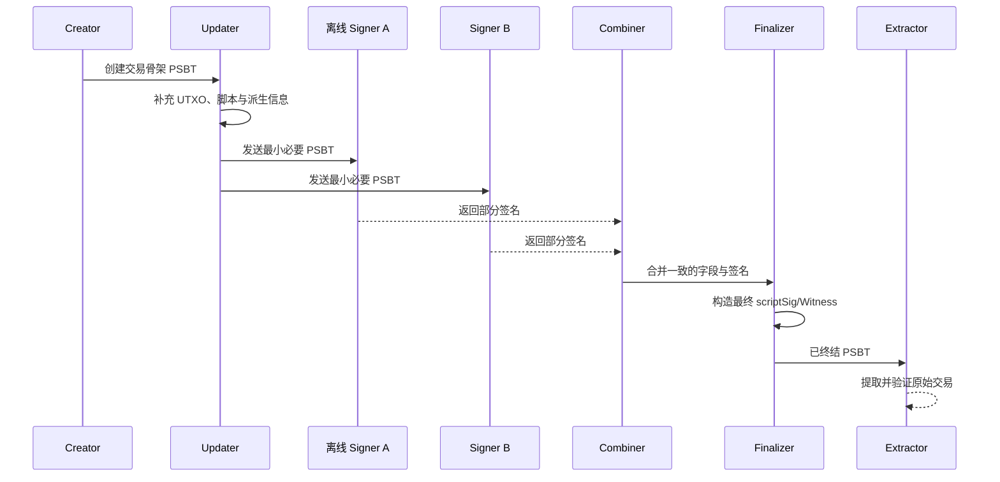

# Day 04：BTC 交易构建、签名与手续费

> 学习目标：掌握 Bitcoin 交易从业务校验、UTXO 选择与预留、手续费迭代、PSBT 签名，到广播、确认和对账的完整生命周期；能够解释 SIGHASH、ECDSA、Schnorr、RBF、CPFP 与多实例并发控制。  
> 建议用时：4～5 小时  
> 完成标准：仅使用 Bitcoin Testnet 或 Signet，独立设计并演练一笔交易的构建与签名流程，完成文末测试场景、7 道面试题和闭卷验收。

## 安全边界

- 实践仅使用 Bitcoin Testnet、Signet 或公开测试交易，不使用主网真实资金。
- 不生成、导入、粘贴或提交真实私钥、助记词、扩展私钥和生产 PSBT。
- 使用成熟且经过审计的 Bitcoin 库、硬件钱包或 Bitcoin Core；**绝不手写密码学、签名算法或 SIGHASH 实现**。
- 签名前必须在可信显示或离线策略引擎中核对网络、全部输出、金额、找零归属、费率、绝对手续费和 SIGHASH；禁止盲签哈希。
- PSBT 是数据容器，不会自动提供授权、真实性、保密性或审批安全；接收方仍须独立验证。
- 广播、重试和回调必须幂等；已签名原始交易及其业务映射应不可变保存并可审计。

---

## 一、端到端交易生命周期

### 1. 从需求到确认

一笔生产级提币不是“选几个 UTXO 后调用签名”这么简单。完整流程应包括：

1. **需求校验**：校验网络、地址、脚本类型、金额、业务状态、限额、风控、幂等键和审批结果；将地址解码为 `scriptPubKey` 后再处理。
2. **UTXO 资格过滤**：排除确认数不足、Coinbase 未成熟、已冻结、已预留、已花费、来源风险不合格或脚本类型不受签名器支持的输出。
3. **选择与原子预留**：根据目标金额、费率、输入类型、隐私和碎片治理选择 UTXO，并在 MySQL 事务内原子占用。
4. **构造输入和目标输出**：固定 Outpoint、`sequence`、收款脚本及整数 satoshi 金额；根据业务策略决定是否启用 RBF。
5. **迭代估费与找零**：输入脚本类型和输出数量会改变 vsize；加入或移除找零后必须重新计算费用，直至结构稳定。
6. **粉尘与策略检查**：找零若低于当前输出脚本和中继费率对应的 dust threshold，通常不创建，而将剩余计入手续费；同时检查费用上限。
7. **创建 PSBT**：携带签名所需的前序输出、脚本、派生信息及交易结构，但避免泄露不必要的 xpub 和元数据。
8. **签名**：离线或多方签名器独立验证策略和可见交易字段，再对允许的输入签名。
9. **合并、终结与提取**：组合各方 PSBT，验证签名完整性，生成最终 `scriptSig`/Witness，提取原始交易并执行本地共识与策略检查。
10. **广播**：使用多个可信节点谨慎重试；区分“明确拒绝”“已接受”和“结果未知”。
11. **确认与对账**：跟踪 Mempool、冲突、替换、区块确认、重组和业务账本；把同一业务交易的 RBF 替换链作为一个 lineage 管理。



### 2. 需求校验清单

- 网络必须匹配 Testnet 或 Signet，拒绝主网地址和网络不明脚本；
- 金额必须是合法范围内的整数 satoshi，不能使用浮点数；
- 每个目标输出的地址、脚本、金额和业务收款人必须绑定到已审批快照；
- 输出不得重复、遗漏或被未授权追加，批量提币还要检查整批总额和逐笔映射；
- 检查业务幂等键，重复请求返回已有构建结果，而不是重新选币；
- 费率来源、绝对费用上限、费率上限和低费告警必须同时生效；
- 找零脚本必须来自钱包已验证的内部派生路径，不能相信外部调用方传入的“找零地址”；
- 签名器必须能识别所有输入脚本类型和 SIGHASH 策略，否则停止而不是降级盲签。

### 3. 状态机与不可变记录



关键原则：

- `SIGNED` 以后不能仅因 lease/TTL 到期而释放 UTXO；已有交易仍可能在网络传播并最终确认。
- 已签名原始交易、PSBT 摘要、输入集合、输出集合、费率、签名策略和业务单映射应作为不可变审计记录保存。
- 对 SegWit/Taproot 交易，签名完成后即可稳定计算不含 Witness 的 `txid`，便于广播前建立跟踪记录；传统 Legacy 交易仍有历史交易延展性风险，应同时用业务 ID、输入集合及最终原始交易追踪，避免把广播前 `txid` 当作唯一不变事实。
- “广播超时”不等于“广播失败”。结果未知时先按已可能传播处理，禁止立即释放输入并构造无关的新付款。

---

## 二、SIGHASH：签名究竟承诺了什么

### 1. 核心认识

Bitcoin 签名不是简单地“对最终交易 Hex 签名”。签名器根据当前输入、脚本版本和 SIGHASH 类型构造签名摘要。签名会承诺特定交易字段，例如版本、锁定时间、部分或全部输入、输出、金额、脚本和序号；具体集合取决于 Legacy、SegWit v0、Taproot 规则及 SIGHASH 标志。

因此必须记住：

- 修改被承诺的字段会使签名失效；
- 未被某种 SIGHASH 承诺的字段可能被其他参与方修改；
- 签名器不能只显示“一个哈希”，而应重建并展示用户实际授权的输出、金额、费用和策略；
- 应调用成熟库对每种输入按协议构造摘要，绝不能手写序列化或密码学。

### 2. 三代摘要规则的概念差异

#### Legacy

Legacy 摘要规则源于早期交易序列化模型。签名当前输入时会插入相应前序输出脚本，并依据 SIGHASH 清空、保留或调整其他输入和输出。它不直接承诺所有输入金额，处理复杂脚本和多输入时容易因上下文错误而签错。

#### SegWit v0

BIP-143 为 SegWit v0 定义结构化摘要，按模式承诺前序 Outpoint、`sequence`、输出等聚合哈希，并明确承诺当前输入的前序输出金额与 `scriptCode`。这改善了离线签名器的金额验证能力，也减少重复哈希计算。

#### Taproot

Taproot 的签名消息按 BIP-341/342 设计，适配 BIP-340 Schnorr，并在相应模式下承诺输入金额、`scriptPubKey` 等更完整上下文。Key Path 和 Script Path 使用额外上下文区分；Script Path 还会承诺实际执行叶子等信息。Taproot 引入默认的 `SIGHASH_DEFAULT`，语义通常类似 ALL，但编码和细节应交由成熟库处理。

> 面试重点是“不同脚本版本的签名消息不同，签名器必须知道前序输出及路径上下文”，而不是背诵字节级序列化。

### 3. SIGHASH 模式表

| 模式 | 通常承诺的输出 | 输入承诺概念 | 典型用途与风险 |
|---|---|---|---|
| `SIGHASH_ALL` | 全部输出 | 默认承诺当前交易输入集合；不带 `ANYONECANPAY` 时通常绑定所有 Outpoint | 普通付款的常见选择，防止收款和找零被改动 |
| `SIGHASH_NONE` | 不承诺输出 | 签名者授权花费输入，但输出可由其他方后定 | 协作协议可能使用；普通提币风险极高 |
| `SIGHASH_SINGLE` | 只承诺与当前输入索引对应的输出 | 其他输出可能可变 | 输入与指定输出配对的协议；必须严格检查索引 |
| `ALL|ANYONECANPAY` | 全部输出 | 仅绑定当前签名输入，其他方可加输入 | 协作集资等；输出仍固定 |
| `NONE|ANYONECANPAY` | 不承诺输出 | 仅绑定当前输入 | 授权范围非常宽，普通钱包应拒绝或专项审批 |
| `SINGLE|ANYONECANPAY` | 对应索引输出 | 仅绑定当前输入 | 可组合输入/输出对；排序和索引变化要谨慎 |
| `SIGHASH_DEFAULT` | Taproot 默认行为，通常等价于 ALL 的授权意图 | 依 Taproot 规则 | 仅用于 Taproot；不要与显式字节编码细节混淆 |

`ANYONECANPAY` 是修饰位，可与 ALL、NONE、SINGLE 组合。它通常把输入承诺缩小到当前输入，使其他参与者能够增加或调整其他输入，但并不意味着“任何人都能花这枚币”；当前输入仍须由合法密钥授权。

### 4. `SIGHASH_SINGLE` 历史边界

传统签名哈希存在著名历史边界：当使用 `SIGHASH_SINGLE` 且当前输入索引没有对应输出时，旧规则会产生特殊的固定哈希结果，而不是按直觉报错。这通常称为 `SIGHASH_SINGLE` bug。

工程要求：

- 创建和签名时强制校验 `inputIndex < outputCount`；
- 不依赖该历史行为设计新协议；
- 使用库仍要显式做结构校验，不能因为“库能签”就认为授权语义正确；
- Taproot 的规则不应被简单套用 Legacy 的历史边界，但跨脚本钱包仍须按每个输入版本分别处理。

---

## 三、ECDSA、Schnorr 与 Taproot 花费路径

### 1. ECDSA 与 BIP-340 Schnorr

Bitcoin 在 Taproot 之前的常见单签和多签路径使用 secp256k1 ECDSA；Taproot 使用 BIP-340 Schnorr 签名。二者都建立在 secp256k1 曲线上，但签名算法、编码和协议性质不同。

| 维度 | ECDSA（常见于 Taproot 前） | BIP-340 Schnorr（Taproot） |
|---|---|---|
| 常见输出 | P2PKH、P2WPKH、P2SH/P2WSH 脚本 | P2TR Key Path 与 Script Path 中的签名检查 |
| 签名编码 | Bitcoin 中常见 DER 编码并附 SIGHASH 字节 | 固定 64 字节主体，非默认 SIGHASH 时附类型字节 |
| 线性性质 | 不具备 Schnorr 的直接线性组合性质 | 线性结构更适合安全构建聚合协议，但多签协议仍需专门设计 |
| 可塑性处理 | 共识/策略需处理低 S 等规范；Legacy 历史上受签名编码延展性影响 | BIP-340 定义唯一性更清晰的验证形式；不代表交易整体绝不可重构 |
| 批量验证 | 一般不使用原生批量验证优势 | 理论上支持批量验证，但实现必须防御性正确 |
| 实现要求 | 使用成熟库，安全 nonce 至关重要 | 使用成熟库，确定性/辅助随机 nonce 规则仍必须正确 |

任何一种算法重复或错误生成 nonce 都可能泄露私钥。禁止自行实现 nonce、曲线运算、签名编码或密钥聚合。

### 2. Taproot Key Path

Key Path 花费通常只需在 Witness 中提供 Schnorr 签名。链上不揭示脚本树，通常更节省空间并改善隐私。实际输出密钥可能由内部密钥和脚本树承诺 tweak 得到，因此签名器必须验证其掌握的内部密钥、Merkle Root 与链上 Output Key 的关系。

### 3. Taproot Script Path

Script Path 在需要条件脚本时使用，Witness 概念上包含：

- 满足所选 Tapscript 的栈数据；
- 实际执行的脚本叶子；
- `control block`，用于证明该叶子属于承诺在 Output Key 中的脚本树；
- 可选 `annex`，若存在会进入相应签名承诺和解析规则，普通钱包不应忽略或擅自插入。

只需掌握：Script Path 只揭示实际使用的分支；Control Block 证明分支归属；Annex 是受规则约束的可选元素。生产实现必须交给支持 Taproot 的成熟库验证。

---

## 四、PSBT：把构建与签名安全解耦

### 1. PSBT 是什么

PSBT（Partially Signed Bitcoin Transaction）由 BIP-174 定义，是在多角色之间传递未签名交易结构、前序输出、脚本、派生提示、部分签名和最终解锁数据的标准容器。后续规范还包括 PSBT v2 等扩展；使用何种版本取决于钱包、硬件和库的兼容矩阵，不能把“版本更新”误认为自动更安全。



### 2. 六种角色

- **Creator**：创建交易骨架，确定输入、输出和全局字段。
- **Updater**：补充每个输入的前序输出、Redeem/Witness Script、派生信息等签名上下文。
- **Signer**：独立验证交易和授权策略，只对自己控制且上下文完整的输入签名。
- **Combiner**：合并同一底层交易的不同 PSBT 副本，拒绝冲突字段。
- **Finalizer**：在签名条件满足后生成最终 `scriptSig` 和 Witness，并清理不再需要的数据。
- **Extractor**：从已终结 PSBT 提取可广播的原始交易。

一个软件可以承担多个角色，但角色分离有助于最小权限、离线签名和审计。

### 3. 为什么适合离线与多签

- 离线签名器不需要直接连接节点，Updater 可提供验证所需的 UTXO 和脚本上下文；
- 多个签名者可以各自在相同交易承诺上产生部分签名，再由 Combiner 汇总；
- 硬件钱包可以解析标准字段并显示输出、费用和派生路径；
- 未完成签名时仍可传递和持久化状态，无需共享私钥；
- 角色之间可以实施审批、隔离网络、双人复核和审计留痕。

### 4. 安全与隐私边界

- **验证未知字段**：PSBT 允许未知键和 proprietary 字段以支持扩展。解析器应保留未知字段、防止重复键和资源耗尽，并按策略拒绝语义不明但可能影响授权的扩展；不能静默丢失后再宣称数据完整。
- **独立重建交易**：Signer 必须确认所有输入引用、UTXO 金额、脚本、输出、手续费和 SIGHASH；不能只信 Creator 提供的摘要文字。
- **xpub 隐私**：全局 xpub、派生路径和指纹可能暴露钱包结构及地址关联。只传最小必要信息，严格控制日志和跨组织共享。
- **完整性局限**：PSBT 可被复制、替换或修改；只有对具体交易字段有效的签名提供相应完整性承诺。未签字段、元数据和审批状态不因此自动可信。
- **授权局限**：拥有一份 PSBT 不等于获准付款；生成有效签名也不等于业务审批、风控和费率策略均已通过。
- **兼容性**：PSBT v0/v2、Taproot 字段和硬件支持需要组合测试；不支持时应阻断，不应删除字段或降级脚本。

---

## 五、Coin Selection：选币不是简单凑数

### 1. 选币目标

Coin Selection 要在多个互相冲突的目标之间权衡：

- 足够支付目标输出与当前交易费用；
- 减少输入数量和当前费用；
- 尽量精确匹配，避免创建找零；
- 控制未来花费找零的成本，即 change cost；
- 避免把来源、用户或时间上无关的 UTXO 聚合，减少隐私关联；
- 在低费率时合并碎片，在高费率时避免无谓整理；
- 遵守确认数、Coinbase 成熟度、风控、冻结、脚本支持和未确认祖先风险策略；
- 避免产生 dust 或大量难以经济花费的小额 UTXO。

### 2. 常见策略

| 策略 | 思路 | 优点 | 缺点与适用边界 |
|---|---|---|---|
| Largest First | 从大到小选取 | 输入少、速度快、当前费用常较低 | 容易暴露大额 UTXO，可能形成明显找零并破坏隐私 |
| Smallest First | 从小到大选取 | 可在低费时整理碎片 | 输入多、费用高，可能合并大量地址关联 |
| Branch and Bound | 搜索接近目标的子集 | 有机会找到无找零或低 waste 解 | 搜索复杂度高，需要限制迭代并准备回退策略 |
| Exact/No-change | 目标是输入恰好覆盖付款与费用 | 不创建找零，减少未来花费和隐私启发式 | 精确解不总存在；费用随输入组合变化，不能只匹配金额 |
| 随机化/隐私分组 | 在合格桶内随机或按标签选择 | 降低固定算法指纹，避免跨来源合并 | 可能增加费用；随机性和分组规则需可审计 |

### 3. Waste metric 概念

生产钱包常用 waste metric 比较候选集合，而不是只看输入总额。概念上可以考虑：

- 当前费率下新增输入的成本；
- 与长期预期费率相比“现在花”的机会成本；
- 创建找零输出的当前成本；
- 未来花费找零输入的预期成本；
- 无找零时超过目标的额外手续费；
- 隐私、风险和碎片治理的业务惩罚项。

具体公式依钱包策略而异。面试时应说明：费用最小不一定等于总 waste 最小，隐私也不能被一个纯金额公式完整表达。

### 4. 确定性伪代码

以下伪代码强调正确边界，不是可直接上线的最优选币器。生产中的精确费率、脚本满足成本、BnB 搜索、隐私分组、并发重试和包策略更复杂，应使用经过测试的实现。

```text
function buildAndReserveWithdrawal(request, feeRate, ownerId):
    assert request.network in {TESTNET, SIGNET}
    assert all target amounts are positive integer satoshis
    validateAddressesAndConvertToScripts(request.outputs, request.network)
    assert feeRate within configured floor and cap

    begin MySQL transaction

    existing = findByBusinessIdForUpdate(request.businessId)
    if existing exists:
        commit
        return existing                         // 业务幂等

    candidates = selectEligibleUTXOsForUpdateSkipLocked(
        network=request.network,
        state=AVAILABLE,
        minConfirmations=policy.minConfirmations,
        matureCoinbase=true,
        signerSupportsScript=true,
        riskEligible=true
    )

    // 顺序必须稳定；真实系统可先按隐私桶分组，再使用 BnB/waste 评分。
    candidates = deterministicPolicyOrder(candidates)
    selected = []
    selectedValue = 0
    targetValue = sum(request.outputs.amount)
    includeChange = false
    previousShape = null

    for each utxo in candidates:
        selected.append(utxo)
        selectedValue += utxo.value

        // 输入 vsize 取决于每个被选 UTXO 的脚本/实际满足路径；
        // 输出数取决于是否存在找零，因此必须迭代至交易结构稳定。
        includeChange = true
        repeat up to MAX_FEE_ITERATIONS:
            outputs = request.outputs plus (includeChange ? walletChangeScript : none)
            estimatedVsize = estimateSignedVsize(selected, outputs)
            fee = ceil(estimatedVsize * feeRate)
            change = selectedValue - targetValue - fee

            if change < 0:
                break                           // 当前集合不足，继续加输入

            dust = dustThreshold(walletChangeScript, nodeRelayFeePolicy)
            if includeChange and change <= dust:
                includeChange = false           // 不创建 dust 找零
                continue                        // 少一个输出，必须重算 vsize/fee

            shape = (selected outpoints, includeChange, outputs.count, fee, change)
            if shape == previousShape or feeAndStructureStable(shape, previousShape):
                break
            previousShape = shape

        if change >= 0:
            if includeChange:
                finalOutputs = request.outputs plus changeOutput(change)
                finalFee = fee
            else:
                baseVsize = estimateSignedVsize(selected, request.outputs)
                requiredFee = ceil(baseVsize * feeRate)
                remainder = selectedValue - targetValue - requiredFee
                if remainder < 0:
                    continue
                finalOutputs = request.outputs
                finalFee = requiredFee + remainder // 小额剩余成为额外费用

            assert finalFee <= policy.absoluteFeeCap
            assert finalFee / estimateSignedVsize(selected, finalOutputs)
                   <= policy.feeRateCapWithRoundingTolerance
            assert sum(selected.value) == sum(finalOutputs.value) + finalFee

            // 锁仍由当前事务持有；条件更新防止状态被并发修改。
            updated = conditionalUpdateAll(
                selected outpoints,
                fromState=AVAILABLE,
                toState=RESERVED,
                reservationOwner=ownerId,
                leaseUntil=now + policy.unsignedBuildLease
            )
            if updated != selected.count:
                rollback
                retry whole operation with bounded backoff

            record = insertWithdrawalAndReservation(
                request.businessId, selected, finalOutputs, finalFee,
                feeRate, state=RESERVED
            )
            commit
            return record

    rollback
    raise InsufficientFunds(targetValue, estimatedFeeForEligibleSet)
```

关键说明：

- **余额不足**必须包含手续费后判断；“UTXO 总额大于付款金额”仍可能不足。
- 费率取决于选中输入的脚本类型和实际花费路径；费用还取决于输出数量，找零加入或移除后必须迭代重算。
- dust threshold 依输出脚本和节点中继费率策略计算，不能写死为 546 sat。
- 选中与预留必须在同一 MySQL 事务和锁语义下完成；若条件更新数量不一致，整体回滚并重试。
- 更优实现会对候选集合运行有界 BnB、waste 评分及回退算法，而不是固定选到第一个可行集合。

---

## 六、手续费工程

### 1. sat/vB、Weight 与 vsize

手续费通常以 sat/vB 报价：

$$
\text{fee} = \left\lceil \text{feeRate}_{sat/vB} \times \text{vsize}_{vB} \right\rceil
$$

$$
\text{weight} = 4 \times \text{strippedSize} + \text{witnessSize}
$$

$$
\text{vsize} = \left\lceil \frac{\text{weight}}{4} \right\rceil
$$

实际签名长度、脚本路径、CompactSize 边界、输入类型和输出数量都会影响大小。构建前用上界或成熟库估算，签名后再用最终交易复核实际 vsize 与费用。

### 2. 常见大小的粗略估计

下表仅用于心算和容量规划，**不是协议常量，也不能替代对实际脚本和最终交易的序列化计算**：

| 项目 | 粗略 vB | 说明 |
|---|---:|---|
| P2PKH 输入 | 约 148 | ECDSA DER 签名长度会变化 |
| P2WPKH 输入 | 约 68 | Native SegWit 单签常见估计 |
| P2TR Key Path 输入 | 约 57.5～58 | SIGHASH 字节等会影响结果 |
| P2PKH 输出 | 约 34 | 不含整个交易的公共开销 |
| P2WPKH 输出 | 约 31 | 仅典型脚本长度估计 |
| P2TR 输出 | 约 43 | 仅典型脚本长度估计 |
| 交易公共开销 | 通常约 10～11 | 输入/输出计数边界和 SegWit 标记会变化 |

P2WSH、Taproot Script Path 和多签输入不能用一个固定数字概括，必须根据实际满足脚本估算。

### 3. 费率来源与防护

费率可以来自：

- 自建 Bitcoin Core 节点的目标确认估算；
- 多个节点或可信服务的观测；
- 本地 Mempool 分布和历史确认数据；
- 运营配置的保守 fallback。

生产策略应：

- 对来源设置超时、陈旧时间和异常值检测；
- 多源差异过大时告警，而不是盲目取最高或最低；
- 设置最小中继/业务下限、普通上限、绝对手续费上限和人工审批阈值；
- 估算不可用时使用明确、可审计且可能较保守的 fallback，或暂停高额交易；
- 保存“请求费率、估算来源、构建费率、最终实际费率”以便审计。

### 4. 找零成本与无找零解

创建找零不仅增加当前的一个输出，还会在未来花费时增加一个输入。判断是否值得创建找零，应比较：

$$
\text{Change Cost}
\approx \text{create-output cost at current rate} + \text{spend-input cost at expected future rate}
$$

因此，一个高于 dust threshold 的小找零仍可能是“经济上不值得”的 uneconomic change。钱包可以在策略允许范围内把它作为额外手续费，但必须受费用上限约束并清晰审计。

### 5. 批量提币

批量提币把多个收款输出放进同一交易，共享输入集合和交易公共开销，通常比多笔独立交易节省 vbytes 和手续费。但代价包括：

- 多个收款人被链上关联，隐私耦合；
- 单个构建、签名或广播问题影响整批，爆炸半径更大；
- 所有收款共享确认、替换和重组命运；
- 输出遗漏、重复、错网或金额错误的风险随批次增大；
- 大交易可能更难在目标费率下快速确认，且加速成本更高。

必须逐输出校验地址、网络、金额、业务单映射和重复项，并设置批次金额、输出数、vsize 与风险上限。

---

## 七、Dust：策略门槛，不是共识最小金额

Dust 是节点中继/挖矿策略概念：某输出金额相对于按给定 dust relay fee 估算的未来花费成本过小，节点可能把创建它的交易视为非标准而不予中继。

必须区分：

- dust threshold 取决于输出脚本类型、预期花费大小和节点采用的中继费率策略；
- **不存在适用于所有脚本和所有节点策略的“统一 546 sat”规则**；546 sat 只是特定历史默认条件下某些输出的常见数值；
- dust 通常不是“金额低于它就共识无效”。矿工直接收录或策略不同的节点可能有不同行为，但普通钱包不能依赖非标准中继；
- dust 输出会增加 UTXO 集和未来花费成本，也可能成为垃圾、追踪或地址关联载体。

钱包应从节点/库的策略实现计算阈值，并在构建时避免目标输出或找零成为 dust。用户请求本身产生 dust 目标输出时，应拒绝、合并或按明确产品规则处理，而不是悄悄改金额。

---

## 八、RBF、CPFP 与交易加速

### 1. RBF（BIP-125 与 full-RBF）

RBF 通过广播一笔与原交易冲突、花费至少一个相同输入且支付更高费用的替代交易，提高被确认概率。BIP-125 描述了 opt-in RBF 的信号和节点接受替换时的策略条件，概念上包括冲突关系、费用增量和对 Mempool 依赖的限制。

一些节点支持 full-RBF，即使原交易没有显式 opt-in，也可能按本地策略接受替换。它不是所有节点、矿工和路径都一致采用的共识保证。因此：

- 不要把“未设置 RBF 信号”理解为绝对不可替换或零确认安全；
- 替换交易必须继续满足业务授权，收款输出通常保持不变，可减少找零或增加输入来加费；
- 原交易和所有替代交易属于同一业务交易 lineage，不能分别记成多次付款；
- 跟踪每个候选 `txid`、冲突输入和最终确认者，账务以业务 ID 归并。

### 2. CPFP

CPFP（Child Pays For Parent）创建一笔高费率子交易，花费未确认父交易中自己可控制的输出。矿工若按父子包的总费用和总 vsize 评估，可能一起确认。

前提与限制：

- 必须有可花费且价值足够的未确认输出，例如钱包找零或收款方控制的输出；
- 子交易自身要留出合理输出，不能为了加速制造 dust 或超过经济价值；
- 节点对祖先/后代、包中继和 Mempool 接受有本地策略及实现限制；
- package relay 能力在演进中，不能假设任意包都能通过所有节点直接提交；
- 某些路径只能先见到父交易再接受子交易，传播效果取决于节点和矿工策略。

### 3. RBF 与 CPFP 对比

| 维度 | RBF | CPFP |
|---|---|---|
| 核心方式 | 用更高费冲突交易替换父交易 | 创建高费子交易拉高父子包费率 |
| 需要控制 | 原交易至少一个输入及重新签名权限 | 父交易中的一个可花费输出 |
| 是否新增交易 | 替换原交易，产生新候选 txid | 保留父交易并新增子交易 |
| 空间成本 | 可通过减少找零或加输入调费 | 必然增加子交易 vsize |
| 适合场景 | 发送方可重签、交易允许按策略替换 | 收款方或找零控制方无法/不便修改父交易 |
| 主要风险 | 输出被意外修改、业务重复、替换传播不一致 | 没有可用输出、包限制、祖先链复杂、加速成本更高 |
| 账务处理 | 全部替代版本归入同一 lineage | 父子均需跟踪，付款仍以父交易业务记录为主 |

### 4. 费用与加速决策矩阵

| 状态 | 首选动作 | 可选加速 | 不应做的事 |
|---|---|---|---|
| 未签名，估算费率已陈旧 | 重新估费、重选币并重建 | 不适用 | 沿用过期费率盲签 |
| 已签名但确认未广播 | 复核当前费率；必要时按审批重新构建 | RBF 候选需重新签名 | 删除不可变签名记录或仅因 TTL 释放输入 |
| 已广播、RBF 可用且可重签 | 保持业务输出，构造更高费替代并验证 | RBF | 把替代 txid 当成第二笔付款 |
| 已广播、有可控未确认输出 | 评估父子包有效费率和经济性 | CPFP | 忽略祖先/后代及包传播限制 |
| 已广播、两者均可 | 比较新增 vsize、签名可用性、隐私和传播 | 通常优先成本较低且可验证的方案 | 同时无协调地发送多个加速方案 |
| 广播结果未知 | 查询多个自有节点、Mempool、输入冲突及日志 | 先确认事实，再决定 RBF/CPFP | 立即释放 UTXO 或创建无关重复付款 |
| 已确认但未达业务深度 | 等待并监控重组 | 通常无需加速 | 把 1 确认表述为绝对最终 |

---

## 九、长时间未确认与广播未知 Runbook

### 1. 长时间未确认

1. 以业务 ID 查询不可变原始交易、全部候选 `txid`、输入 Outpoint、输出和费率。
2. 查询多个自有节点：是否在 Mempool、是否被替换、输入是否被冲突交易花费、是否已进区块。
3. 重新评估当前 Mempool 费率、交易有效费率、祖先包和节点拒绝原因；单节点查不到不能直接判失败。
4. 若交易仍有效且费率不足，按决策矩阵选择等待、RBF 或 CPFP，并重新执行输出、费用、授权和签名校验。
5. RBF 时将新旧 `txid` 关联到同一 lineage；CPFP 时关联父子包，不重复扣用户余额。
6. 持续跟踪确认和重组；达到业务确认数后再终结账务状态。
7. 若发现冲突且对方交易未知，冻结自动处理并人工调查，不能简单重发。

### 2. 广播结果未知

典型场景是 RPC 超时、网络断开或服务崩溃发生在节点接收前后。安全处理方式：

- 预先保存最终原始交易和可计算的交易标识，再进行广播；
- 使用同一原始交易幂等重播是安全恢复动作之一，节点通常会返回已存在或已知状态；
- 查询交易、Mempool 和所有输入的花费状态，等待传播窗口；
- 保持 UTXO 为 `SIGNED`/`BROADCAST_UNKNOWN`，禁止 TTL 自动释放；
- 只有在充分证明原交易未传播、未被接受、无冲突且按审批安全取消后，才能进入释放流程；
- Legacy 延展性场景还应按输入集合和业务记录搜索可能的变体，不能只查预期 `txid`。

---

## 十、多实例 UTXO 并发控制

### 1. MySQL 是权威来源

推荐把 MySQL 作为 UTXO 资格、预留和花费状态的 source of truth。Redis 可用于缓存、削峰、短锁或通知，但缓存丢失、锁过期和网络分区不能导致同一 Outpoint 被重复分配。

可采用的数据库保障：

- 在事务内用 `SELECT ... FOR UPDATE SKIP LOCKED` 获取候选，或用带版本/状态条件的原子 `UPDATE`；
- 只有 `state = AVAILABLE` 才能转为 `RESERVED`，并检查受影响行数；
- 对 `(network, txid, vout)` 建立唯一键；
- 对活跃 reservation/消费关系建立数据库可执行的唯一性约束，例如单独的 active reservation 表以 Outpoint 为唯一键；
- 业务请求以 `business_id` 唯一，重试返回原记录；
- 交易、输入、预留和业务账本在可控事务边界内关联，失败整体回滚。

### 2. Lease 到期的危险

Lease 只适合回收“尚未签名且可证明构建已放弃”的预留。状态一旦达到 `SIGNING`，尤其是 `SIGNED` 或 `BROADCAST_UNKNOWN`：

- 签名副本可能已离线、在队列中或由第三方持有；
- 原交易可能已被部分节点接收；
- 自动释放会让新任务再次消费同一输入，制造双花和账务不确定性。

因此回收器必须联查签名记录、广播日志、Mempool、链上花费和冲突关系。**绝不能仅因 TTL 到期释放已签名交易的 UTXO。**

### 3. 对账驱动状态修复

对账器应周期性：

- 扫描节点和区块，更新 `BROADCAST`、`CONFIRMED`、`SPENT`；
- 识别 RBF 替代、未知冲突和重组；
- 将找零作为新 UTXO 入库，但在父交易未达到策略前标记相应风险；
- 修复“业务超时但链上已确认”等状态漂移；
- 对无法自动归因的输入花费告警并冻结相关业务。

---

## 十一、Testnet/Signet 测试练习

> 不使用真实私钥。可以使用观察模式钱包、公开测试交易、Bitcoin Core 的 decode/analyze 工具或完全虚构但数值一致的测试夹具。

### 场景 1：混合脚本输入导致低估费用

**条件：** 候选包含一个 P2WPKH 和一个 P2PKH UTXO。构建器错误地把两个输入都按 P2WPKH 估算。

**预期推理：** P2PKH 输入通常更大，最终 vsize 和所需费用会上升；如果找零按错误费用计算，最终可能低于目标费率甚至变成负值。应按每个输入实际脚本和满足路径估算，签名后再复核。

### 场景 2：找零在加入输出后成为 dust

**条件：** 初次按无找零结构计算有小额剩余；加入 P2WPKH 找零输出后费用增加，剩余低于该节点策略下的 dust threshold。

**预期推理：** 移除找零输出并重新估算；若剩余非负且费用上限允许，将剩余计入手续费。不能写死 546 sat，也不能保留难以中继的 dust 找零。

### 场景 3：两个实例同时选择同一 UTXO

**条件：** A、B 同时读取一个 `AVAILABLE` Outpoint。

**预期推理：** 必须由 MySQL 事务锁或条件更新决定唯一胜者。失败方检查受影响行数后整体回滚并重选。Redis 锁即使存在也只能辅助。若 A 已签名，lease 到期不能使 B 获得该 UTXO。

### 场景 4：广播 RPC 超时

**条件：** 已保存最终原始 SegWit 交易及 `txid`，调用广播后连接中断。

**预期推理：** 标记 `BROADCAST_UNKNOWN` 并保留预留；在多个节点查询交易、Mempool 和输入冲突，可幂等重播同一原始交易。不能立即构建第二笔独立付款。若是 Legacy，还需考虑预期 `txid` 之外的延展变体。

### 场景 5：低费父交易，发送方可重签且有找零

**条件：** 父交易已长期未确认，按策略启用了 RBF，同时钱包控制找零。

**预期推理：** RBF 和 CPFP 都可能可用。比较替代交易新增输入/减少找零的成本与 CPFP 子交易 vsize、包费率和传播限制。无论选择哪种，都要保持业务输出正确；RBF 新旧 txid 属于同一 lineage。

### 场景 6：PSBT 中出现陌生 proprietary 字段和全局 xpub

**条件：** 离线签名器收到来源不明的 PSBT，其中包含未批准扩展字段和不必要的全局 xpub。

**预期推理：** 不应盲签或静默删除。先验证底层交易、字段唯一性和扩展策略；不理解且可能影响授权时拒绝。删除非必要 xpub/派生信息后由可信流程重新生成最小 PSBT，以降低钱包关联泄露。

### 场景 7：批量提币中一个输出网络错误

**条件：** 20 个 Testnet 输出中混入一个主网地址。

**预期推理：** 整批在构建前失败，不应跳过该输出后继续签名，也不应尝试“自动转换网络”。逐输出错误必须回写对应业务单，修正并重新审批整批快照。

---

## 十二、口头面试题参考答案

> 本节严格对应 7 道题。先闭卷口述，再用“结论 → 原理 → 工程实现 → 异常风险”检查完整性。

### 1. PSBT 为什么适合冷签名和多方签名？

**参考回答：**

PSBT 把交易骨架、前序输出、脚本、派生提示、部分签名和最终解锁数据放进标准容器，使构建、补充上下文、签名、合并、终结和提取可以由不同角色完成。冷签名器不必联网查询节点，也不需要接触其他签名者的私钥；多方可对同一交易分别产生部分签名，再合并成满足策略的交易。

但 PSBT 只是容器，不自动代表业务授权或数据可信。Signer 仍要独立验证网络、输入 UTXO、全部输出、找零、手续费和 SIGHASH，拒绝盲签；未知/proprietary 字段要按策略处理，全局 xpub 和派生路径要最小化，防止隐私泄露。PSBT v0/v2 和 Taproot 支持也要做兼容测试。

### 2. Coin Selection 有哪些权衡？

**参考回答：**

Largest First 常减少输入和当前费用，但可能暴露大额 UTXO；Smallest First 能整理碎片，却会增加输入、费用和地址关联；Branch and Bound 尝试寻找精确或低 waste 组合，但搜索成本高，需要有界执行和回退。Exact/no-change 可省去找零及未来花费成本，却不一定存在可行解。

生产选择还要考虑输入脚本大小、当前与长期费率、change cost、确认数、Coinbase 成熟度、未确认祖先、来源风险、隐私桶和碎片治理。费用依所选输入类型与输出数量变化，所以选择、估费和找零判断必须迭代，而不是先按金额选完再固定扣一笔费用。

### 3. 什么是 dust，为什么要避免？

**参考回答：**

Dust 是中继和挖矿策略概念：输出金额相对未来花费成本过小，节点可能不愿中继创建它的交易。阈值取决于输出脚本、预期花费大小和节点的 dust relay fee，不是所有情况都等于 546 sat，也通常不是共识有效性的统一下限。

应避免 dust，因为它可能无法正常传播，增加 UTXO 集和未来花费成本，还会造成钱包碎片与隐私追踪风险。构建器应按当前策略计算阈值；找零成为 dust 时通常移除找零并重新计算费用，目标付款本身是 dust 时则应按明确规则拒绝或合并，不能静默改金额。

### 4. 长时间未确认的交易如何处理？

**参考回答：**

先从不可变记录恢复业务 ID、原始交易、候选 txid、输入、输出和原费率，再查询多个自有节点的 Mempool、区块、冲突和输入花费状态。单节点查不到不能证明交易从未广播。

若只是费率不足，可根据授权能力和可花费输出选择等待、RBF 或 CPFP。RBF 的替代版本必须归入同一业务 lineage，CPFP 要计算父子包费率并检查祖先及传播限制。广播结果未知时保留 UTXO，不因超时或 TTL 释放；可幂等重播同一原始交易。最终持续处理确认和重组，冲突来源不明时转人工调查。

### 5. RBF 与 CPFP 的原理和使用场景是什么？

**参考回答：**

RBF 用支付更高费用的冲突交易替换原交易，适合发送方仍能重签并控制原输入的场景。BIP-125 opt-in 和 full-RBF 都属于节点策略维度，传播并非全网绝对一致；替换时要保持业务授权输出并把新旧 txid 归为同一付款。

CPFP 让一个高费子交易花费低费父交易的可控输出，矿工按父子包整体收益考虑一起确认。它适合无法修改父交易但收款方或找零方控制某个输出的场景。其代价是增加 vsize，并受可花费输出、祖先/后代和 package relay 策略限制。选择时比较总成本、签名权限、隐私和实际传播能力。

### 6. 为什么批量提币通常节省手续费？

**参考回答：**

多笔独立交易各自承担输入、找零和交易公共开销；批量提币把多个收款输出放入同一交易，可以共享输入集合与公共字段，往往减少总 vbytes，所以在相同费率下总费用更低。

但批量会把收款人链上关联，所有输出共享确认和替换命运，且一个错误影响整批。生产系统要逐输出校验网络、脚本、金额和业务映射，并限制批次金额、输出数和 vsize。节费不是越大批越好，还要权衡隐私、延迟与爆炸半径。

### 7. 如何防止多个实例预留同一个 UTXO？

**参考回答：**

以 MySQL 为权威来源，在同一数据库事务中查询合格 UTXO 并从 `AVAILABLE` 条件更新为 `RESERVED`。可以使用行锁、`SKIP LOCKED`、乐观版本或条件更新，并检查受影响行数；Outpoint 和活跃 reservation 应有数据库唯一约束。失败实例整体回滚并重选，业务 ID 唯一保证重试幂等。

Redis 只能辅助，不能替代数据库和链上对账。预留必须绑定业务单、输入集合、PSBT 和签名记录。Lease 只可回收未签名且确认放弃的任务；一旦签名或广播结果未知，绝不能只因 TTL 到期释放，因为交易副本可能仍会传播和确认。

---

## 十三、当天任务

### 任务 1：端到端构建（45 分钟）

- [ ] 画出需求校验、选币、预留、构建、签名、广播和确认状态机。
- [ ] 用整数 satoshi 构造一组目标输出，并写出输入、找零和费用守恒式。
- [ ] 解释为什么加入或删除找零后必须重新估费。
- [ ] 列出签名前对输出、找零、费率和绝对费用的检查项。

### 任务 2：SIGHASH 与签名（45 分钟）

- [ ] 闭卷比较 Legacy、SegWit v0 和 Taproot 签名摘要的概念差异。
- [ ] 解释 ALL、NONE、SINGLE 与 ANYONECANPAY 的组合含义。
- [ ] 说明 `SIGHASH_SINGLE` 历史边界及防御检查。
- [ ] 比较 ECDSA 和 BIP-340 Schnorr，并讲清 Taproot 两种花费路径。

### 任务 3：PSBT 演练（45 分钟）

- [ ] 仅用 Testnet/Signet 测试夹具创建或分析一份 PSBT。
- [ ] 标出 Creator、Updater、Signer、Combiner、Finalizer、Extractor 的职责。
- [ ] 检查 UTXO、输出、费用、SIGHASH、xpub 和未知字段。
- [ ] 不接触真实私钥，完成离线/多方签名流程图和威胁清单。

### 任务 4：选币与手续费（60 分钟）

- [ ] 手工比较 Largest First、Smallest First、BnB 和 no-change 候选。
- [ ] 对混合 P2PKH/P2WPKH/P2TR 输入迭代估算 vsize。
- [ ] 分别推演正常找零、uneconomic change、dust 和余额不足。
- [ ] 解释 waste metric、change cost 和费率 fallback/cap。

### 任务 5：加速与并发（45 分钟）

- [ ] 为一笔低费测试交易分别设计 RBF 与 CPFP 方案，不实际使用真实密钥。
- [ ] 写出广播未知和长时间未确认 Runbook。
- [ ] 画出两个实例竞争 UTXO 时的 MySQL 事务结果。
- [ ] 说明为什么 Redis 和 TTL 不能单独保证资金安全。

### 任务 6：测试与表达（30～45 分钟）

- [ ] 完成文中至少 5 个测试场景并写出预期推理。
- [ ] 不看资料回答 7 道面试题并录音。
- [ ] 用 8 分钟讲清一笔交易从请求到确认的全链路。
- [ ] 将薄弱点记录到 `progress.md`，但本次文档创建任务不修改该文件。

---

## 十四、闭卷验收

- [ ] 5 分钟画出 construct → PSBT → 多方签名 → finalize/extract → broadcast → confirm 流程。
- [ ] 说出 Legacy、SegWit v0、Taproot 摘要规则的核心差异。
- [ ] 不看表解释 6 种常见 SIGHASH 组合及授权风险。
- [ ] 说明 `SIGHASH_SINGLE` 历史边界，且不把它错误泛化到所有版本。
- [ ] 比较 ECDSA、Schnorr、Taproot Key Path 与 Script Path。
- [ ] 写出 Weight、vsize、fee 和 change 公式。
- [ ] 解释为何输入脚本类型和输出数会迫使费用迭代。
- [ ] 解释 dust 为何不是统一 546 sat 或共识最小输出。
- [ ] 比较四种选币策略、waste、隐私和碎片治理。
- [ ] 用决策矩阵选择等待、RBF 或 CPFP。
- [ ] 口述广播未知与长期未确认的安全处理步骤。
- [ ] 设计 MySQL 原子预留、幂等、lease 回收和链上对账。
- [ ] 说明批量提币的节费原因、隐私耦合和爆炸半径。
- [ ] 明确签名前验证输出与费用、禁止盲签和手写密码学。

## 十五、Day 04 验收清单

- [ ] 能从业务需求完整推导输入、目标输出、找零和手续费。
- [ ] 能为混合脚本输入迭代估费，并处理余额不足、无找零和 dust。
- [ ] 能解释 PSBT 六种角色及其安全和隐私边界。
- [ ] 能解释 SIGHASH 模式、字段承诺和历史边界。
- [ ] 能比较 ECDSA 与 BIP-340 Schnorr，并说明 Taproot 两条花费路径。
- [ ] 能根据场景选择 Coin Selection 策略并解释 waste。
- [ ] 能比较 RBF 与 CPFP，管理替换 lineage 和父子包。
- [ ] 能执行长期未确认及广播未知 Runbook。
- [ ] 能设计多实例 MySQL UTXO 预留与安全释放流程。
- [ ] 已完成至少 5 个无真实私钥的 Testnet/Signet 测试场景。
- [ ] 已闭卷回答且复盘恰好 7 道面试题。

## 十六、30 分自评分

| 能力 | 1 分 | 3 分 | 5 分 | 今日得分 |
|---|---|---|---|---|
| 交易构建 | 只能拼接输入输出 | 能算找零和费用 | 能覆盖校验、预留、迭代、广播与对账 |  |
| 签名与 PSBT | 只知道签名概念 | 能解释角色和 SIGHASH | 能审查授权、隐私、版本与异常字段 |  |
| 选币与费用 | 只会 Largest First | 能处理 dust 和混合输入 | 能权衡 waste、隐私、碎片和长期成本 |  |
| 加速与恢复 | 只知道提高费率 | 能比较 RBF/CPFP | 能处理 lineage、包限制、广播未知和重组 |  |
| 并发与账务 | 只会加 Redis 锁 | 能用 MySQL 原子预留 | 能设计 lease、安全状态机、幂等和对账 |  |
| 口头表达 | 回答零散 | 能讲清正常流程 | 能覆盖协议差异、风险边界和工程取舍 |  |

**当日总分：** ____ / 30  
**测试网络：** Testnet / Signet  
**测试交易或夹具 ID：** ______________________________  
**最薄弱的三个知识点：** 1. __________ 2. __________ 3. __________  
**下一步补强：** ______________________________
