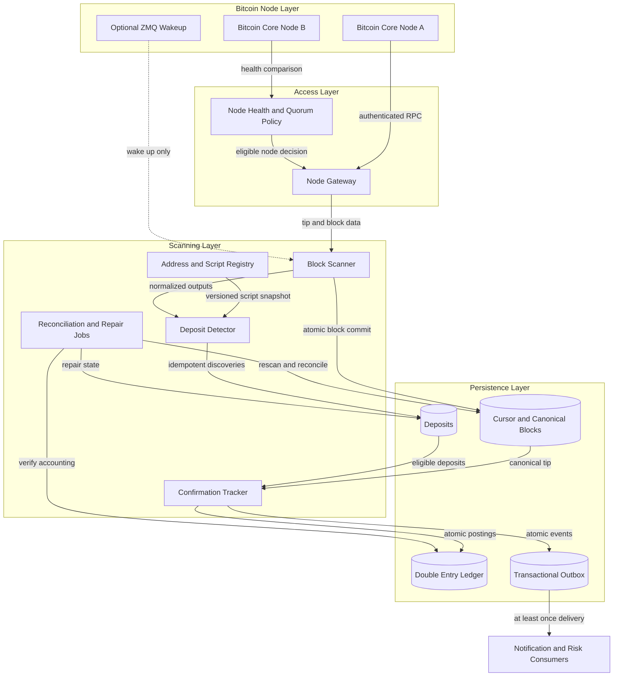
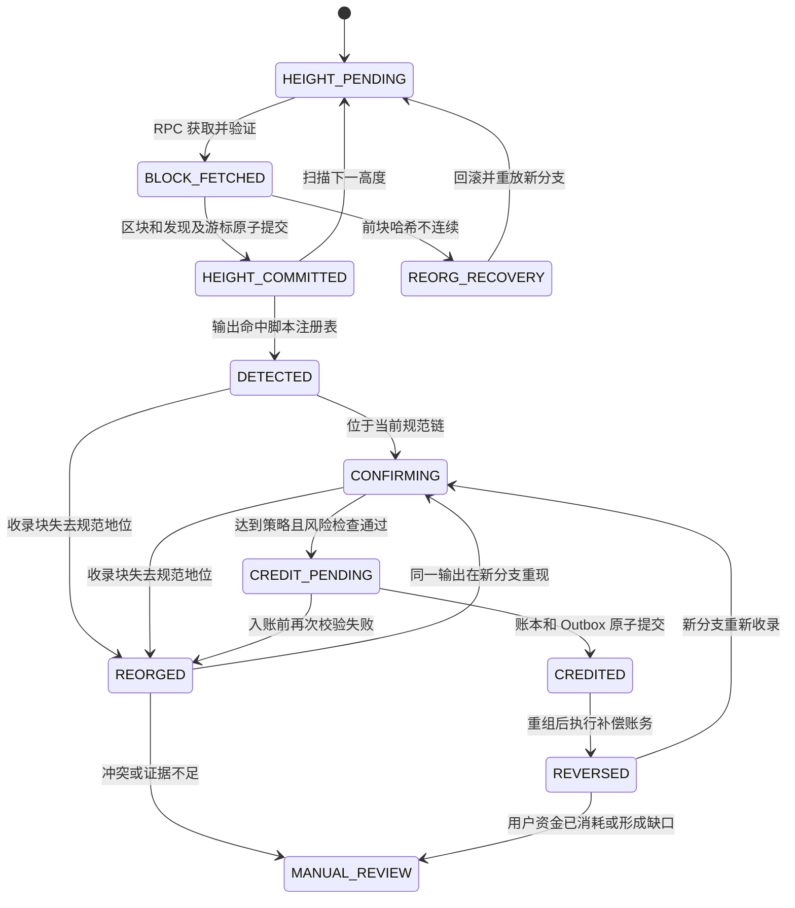

# Day 05：BTC 扫链、充值确认与链重组

> 学习目标：掌握基于 Bitcoin Core RPC 的生产级 BTC 扫链、充值识别、确认跟踪、幂等入账、链重组恢复和多节点异常处置；能够从游标、数据库事务、账本和审计角度解释“不重不漏”的工程含义。  
> 建议用时：4～5 小时  
> 完成标准：仅在 Bitcoin Testnet 或 Signet 完成扫块与重组演练，画出架构和状态机，设计核心表与唯一索引，写出正常扫描、重启、重组、确认入账伪代码，并闭卷完成文末恰好 7 道面试题。

## 安全边界

- 实践仅使用 Bitcoin Testnet 或 Signet，不连接主网资金业务，不使用有真实价值的地址、私钥或助记词。
- 扫描节点只需要验证区块和提供查询能力，不保存热钱包或冷钱包私钥；地址分配、签名和扫链职责分离。
- 不把区块浏览器 API 当作生产资金事实来源。公开浏览器只能辅助人工观察，规范数据应来自独立运营并验证同步状态的 Bitcoin Core 节点。
- Webhook、ZMQ 和消息通知只能作为“有新数据可查”的唤醒提示；按高度和区块哈希轮询、连续性校验与可重放数据库状态才是恢复依据。
- 所有金额使用整数 satoshi；所有网络、哈希、脚本、数组长度和 RPC 响应都必须验证，禁止信任外部字符串或无限制解析恶意脚本。

---

## 一、生产扫链架构与职责边界

### 1. 总体架构与数据流

<!-- mermaid-checked: no \n, no em-dash/en-dash, no {} in labels, subgraphs are id["label"], arrows are -->|"label"|, all subgraphs closed by end, ids unique -->


### 2. 组件职责

| 组件 | 核心职责 | 不应承担的职责 |
|---|---|---|
| Bitcoin Core 全节点 | 验证区块与交易、维护最佳链、提供 RPC；可选发布 ZMQ 通知 | 不替代业务地址归属、确认策略和用户账本 |
| Node Gateway | RPC 认证、超时、限流、响应校验、节点选择、熔断与指标 | 不修改节点返回的链事实，不凭多数票伪造“共识” |
| Block Scanner | 按高度/哈希读取区块，验证 `previousblockhash` 连续性，事务提交区块、充值发现和游标 | 不直接修改用户可用余额 |
| 地址/脚本注册表 | 保存网络、规范化 `scriptPubKey`、用户绑定、有效期和版本快照 | 不靠地址前缀或展示字符串猜测归属 |
| Deposit Detector | 遍历输出并匹配脚本，生成唯一充值事件 | 不把区块位置当作充值身份 |
| Confirmation Tracker | 根据当前规范链 tip、收录高度及策略快照计算确认数和推进状态 | 不把“网络确认”直接等同于“可提现终局” |
| Ledger | 通过复式记账表达负债、冻结、冲正和可用余额变化 | 不允许直接覆盖余额或删除历史流水 |
| 对账/修复任务 | 比较链索引、充值、账本与节点，执行有界重扫、补偿和人工队列 | 不在证据不足时自动吞掉差异 |

### 3. 轮询、通知与恢复

**轮询模式**按固定节奏调用 `getblockchaininfo`，再从持久化 `next_height` 开始逐块读取。它延迟略高、RPC 调用较稳定，但恢复语义清晰：无论服务停机多久，都能从游标继续。

**通知模式**可订阅 Bitcoin Core ZMQ，例如新块哈希通知，也可由内部 Webhook 唤醒扫描器。它能降低发现延迟，却存在进程重启、订阅断线、网络丢包、乱序、重复投递和节点切换等问题。

正确组合是：

1. ZMQ/Webhook 到达时只触发一次“检查 tip 并追赶”的任务；
2. 即使没有通知，也持续低频轮询；
3. 扫描始终根据数据库游标和节点 `height/hash` 拉取，不根据通知序号推进；
4. 通知重复不会重复入账，通知丢失不会漏块；
5. 崩溃恢复和修复只依赖按高度/哈希重放，而不依赖通知历史。

因此，扫描服务提供的是**至少一次扫描**。系统不宣称网络、RPC、队列或任务调度具备“恰好一次投递”；它通过数据库唯一约束、事务和账本幂等键实现**恰好一次业务效果**。

---

## 二、面向 RPC 的扫块流程

### 1. 正常调用顺序

1. 调用 `getblockchaininfo`，检查网络、`blocks`、`headers`、`bestblockhash`、`chainwork`、`initialblockdownload` 和同步进度。
2. 对 `next_height` 调用 `getblockhash height`，得到该高度当前规范块哈希。
3. 调用 `getblock hash verbosity` 获取区块头和交易；充值扫描通常使用 verbosity 2，直接得到解码交易及输出。
4. 校验返回哈希、高度、`previousblockhash`、交易结构和大小限制。
5. 规范化每个 `vout.scriptPubKey.hex`，与地址/脚本注册表快照匹配。
6. 在单个数据库事务内写入区块索引、幂等充值发现，并推进游标。
7. Confirmation Tracker 基于当前规范 tip 另行计算确认数；达到策略时再执行原子账本入账。

### 2. RPC 使用与限制

| RPC/数据源 | 扫链用途 | 关键限制与注意事项 |
|---|---|---|
| `getblockchaininfo` | 读取链名、tip 高度/哈希、headers、chainwork、IBD 状态和同步情况 | `blocks == headers` 也不代表节点一定健康；还需检查新鲜度、连接数、磁盘和多节点差异 |
| `getblockhash height` | 把高度解析为该节点当前最佳链上的哈希 | 重组后同一高度可返回不同哈希，所以高度不能单独作为版本依据 |
| `getblock hash 0` | 返回原始区块 Hex | 带宽和解析成本高，需自己安全解码；适合专用解析器或存档 |
| `getblock hash 1` | 返回区块元数据和交易 `txid` 列表 | 不能直接匹配输出，仍需取得每笔交易内容 |
| `getblock hash 2` | 返回解码区块和解码交易 | 常用于充值扫描；响应大，必须设置大小、交易数、脚本长度和超时上限 |
| `getblockheader hash true` | 读取高度、前块哈希、确认状态、chainwork 等头信息 | 适合连续性检查和寻找共同祖先；不能代替输出扫描 |
| `getrawtransaction txid true` | 查询单笔原始交易及解码结果 | 任意历史交易通常需要 `-txindex`；否则仅钱包相关、Mempool 中或提供正确 `blockhash` 上下文时可能可查 |
| `gettxout txid vout` | 查询当前 UTXO Set 中尚未花费的输出 | 输出一旦花费就消失，不能用于完整历史充值扫描，也不能证明某输出从未存在 |
| `getrawmempool`/`getmempoolentry` | 观察零确认交易、冲突和确认前延迟 | Mempool 是节点本地策略视图，不统一、不持久且可丢失；普通充值不应把零确认当最终到账 |
| ZMQ 通知 | 快速获知新块/交易线索 | 可重复、丢失、断线或乱序，只是唤醒提示，不是 source of truth |
| Explorer API | 学习时辅助查看 | 不作为生产扫描、恢复或账务权威，避免限流、索引延迟、口径差异和第三方篡改风险 |

### 3. verbosity 与 `txindex` 选择

充值扫描拥有区块上下文，优先 `getblock(hash, 2)` 一次取得全部交易输出，避免对每个 `txid` 再做 N 次 RPC。若出于带宽使用 verbosity 1，则必须有可靠交易索引层或以区块哈希上下文查询交易；不能默认 `getrawtransaction` 能查询所有历史交易。

开启 `txindex=1` 便于按 `txid` 查询任意已索引交易，但会增加磁盘和初始索引时间。它不是逐块扫描的正确性前提，也不能修复错误游标。Pruned 节点会删除旧区块数据，即使知道旧区块哈希，也可能无法返回完整区块；需要从保留范围内扫描，或使用非裁剪归档节点执行历史重扫。

---

## 三、地址匹配与充值身份

### 1. 为什么匹配 `scriptPubKey`

链上输出保存的是金额和锁定脚本，不是“地址字符串”。同一语义可能经过不同展示、网络或库层转换；部分脚本没有常见地址表示。生产匹配流程应当：

1. 地址分配时校验 Testnet/Signet 网络和支持的地址类型；
2. 用受信库把地址转换为标准锁定脚本；
3. 保存原始地址用于展示，同时保存规范化 `scriptPubKey` Hex 用于匹配；
4. 扫块时从输出直接读取并规范化脚本字节，按 `(network, script_hash/script_bytes)` 查找；
5. 对非标准、未知 Witness 版本、过长或不支持脚本记录受限审计信息并告警，不尝试猜地址。

### 2. 注册表快照

每次扫描一个区块时应使用可重现的注册表快照，例如 `registry_version` 或“在区块提交事务开始时生效的版本”。充值记录保存：

- 命中的 `registry_entry_id`；
- `registry_version`；
- 当时绑定的 `user_id/account_id`；
- 脚本类型和规范化脚本哈希；
- 分配有效期与迟到充值处理策略。

这样，地址后来重新绑定、停用或迁移时，历史充值归属不会被悄悄重写。若业务允许过期地址继续收款，应显式配置；若不允许，也应进入人工审核，而不是忽略已收到的链上资金。

### 3. 充值唯一身份

推荐唯一键：

```text
(network, txid, vout)
```

`txid + vout` 定位交易输出，`network` 防止 Testnet、Signet 或其他网络名称空间碰撞。`block_height`、`block_hash` 是该输出当前所在的**位置和版本**，不是身份：同一输出可能因重组从旧块消失，随后以同一个 `txid:vout` 出现在新分支的另一个区块中。

若同一输出重现，应更新其规范收录版本并恢复确认流程，而不是插入第二笔充值。若出现同输入的冲突/替代交易产生不同 `txid`，则它是不同链上候选，需要通过冲突关系、当前规范链和业务规则判断，不能仅靠字符串相似性合并。

---

## 四、核心数据模型与唯一约束

> 字段名为设计示例，可按数据库规范调整；金额仍必须是整数 satoshi。状态转换应通过条件更新或版本号保护。

| 表 | 关键字段 | 关键唯一索引/约束 | 作用 |
|---|---|---|---|
| `scan_cursor` | `network`, `scanner_id`, `partition_id`, `next_height`, `last_committed_height`, `last_block_hash`, `status`, `version`, `updated_at`, `lease_owner`, `lease_until` | `UNIQUE(network, scanner_id, partition_id)`；`version` 用于乐观并发 | 表示**下一块从哪里开始**，并把最后已原子提交的高度与哈希绑定 |
| `canonical_block` | `network`, `height`, `block_hash`, `prev_hash`, `chainwork`, `block_time`, `canonical`, `status`, `scanner_id`, `committed_at`, `reorged_at` | `UNIQUE(network, block_hash)`；对当前规范记录实现 `UNIQUE(network, height) WHERE canonical=true` 或等价设计 | 保存近期规范窗口、分叉历史和检查点，支持连续性、祖先搜索及审计 |
| `deposit` | `network`, `txid`, `vout`, `amount_sat`, `script_hash`, `registry_entry_id`, `registry_version`, `user_id`, `block_height`, `block_hash`, `canonical`, `confirmations`, `required_confirmations`, `policy_version`, `status`, `risk_hold`, `version`, timestamps | `UNIQUE(network, txid, vout)`；状态和规范高度索引用于确认任务 | 保存输出身份、当前收录位置、策略快照和业务状态，不删除重组历史 |
| `ledger_entry` | `ledger_tx_id`, `account_id`, `asset`, `amount_sat`, `direction`, `entry_type`, `reference_type`, `reference_id`, `idempotency_key`, `created_at` | `UNIQUE(idempotency_key)`；同一 `ledger_tx_id` 的借贷合计必须平衡 | 复式记账；充值、冻结、解冻和冲正均追加流水，不覆盖历史 |
| `outbox_event` | `event_id`, `aggregate_type`, `aggregate_id`, `event_type`, `payload_version`, `payload`, `idempotency_key`, `status`, `attempts`, `next_attempt_at`, `created_at`, `published_at` | `UNIQUE(idempotency_key)` | 与业务事务同库提交；发布者可至少一次投递，消费者仍按事件 ID 幂等 |

地址注册表建议另有：`UNIQUE(network, normalized_script_hash, effective_version)`，并保留不可变版本记录。哈希索引命中后仍可比较完整脚本字节，防止实现或截断错误。

### 1. 为什么只保存高度会失败

假设游标只有 `height=100`。节点短暂进入分支 A 后扫描了 A100；随后规范链切换到分支 B，B100 的高度相同但哈希不同。只看高度会认为“100 已完成”，直接扫 101，从而漏掉 B100 的充值，也无法撤销 A100 的充值。

因此至少需要：

- 已提交高度和对应 `last_block_hash`；
- 新块的 `previousblockhash` 必须等于预期前块哈希；
- 近期 `height/hash/prev_hash/status` 窗口或检查点；
- 重组后能够找到共同祖先并下降回滚、上升重放。

---

## 五、事务边界与幂等业务效果

### 1. 每块原子扫描事务

外部 RPC 不宜长时间占用数据库事务。先在事务外获取并验证完整区块，再开始短事务；提交前锁定游标并重新检查预期位置，防止另一个实例抢先推进。

```text
RPC 阶段（事务外）
  读取节点 tip
  获取 next_height 对应 block_hash 和完整区块
  校验网络、哈希、高度、previousblockhash、交易/脚本边界
  使用明确 registry_version 构造候选充值集合

数据库事务（单块）
  SELECT scan_cursor ... FOR UPDATE
  断言 cursor.next_height == block.height
  断言 cursor.last_block_hash == block.previousblockhash
  UPSERT canonical_block(network, block_hash)
  对每个命中输出：
      INSERT deposit ... ON UNIQUE(network, txid, vout) DO IDEMPOTENT REAPPEAR_UPDATE
      不得覆盖不兼容的金额、脚本和用户快照；冲突则阻断并告警
  UPDATE scan_cursor
      SET last_committed_height = block.height,
          last_block_hash = block.hash,
          next_height = block.height + 1,
          version = version + 1
  COMMIT
```

关键故障语义：

- **提交前崩溃**：区块、充值和游标全部回滚；重启后重扫同一高度。
- **提交成功但响应前崩溃**：重启看到新游标；若任务重复提交，唯一键和条件检查使其成为无害重复。
- **重复块/重复通知**：不根据通知推进；按游标检查后发现已提交，或幂等 UPSERT 不产生第二笔充值。
- **数据库不可用**：绝不在内存中假装提交；停止推进游标，恢复后从最后提交点重放。

不能把“写充值”“推进游标”拆成两个事务。先推进游标再写充值会漏账；先写充值再推进游标若没有幂等约束会重复。

### 2. 原子信用入账、账本与 Outbox

达到确认策略只表示“具备尝试入账资格”。真正入账必须在一个事务中完成：

```text
数据库事务（单笔充值）
  SELECT deposit ... FOR UPDATE
  重新确认 deposit.canonical == true
  重新计算 confirmations >= deposit.required_confirmations
  断言 status in (CONFIRMING, CREDIT_PENDING)

  UPDATE deposit SET status = CREDIT_PENDING（条件更新）

  INSERT ledger transaction：
      借：BTC 链上资产/清算资产账户
      贷：用户 BTC 负债账户
      idempotency_key = "deposit-credit:<network>:<txid>:<vout>"
  校验同一 ledger_tx_id 借贷平衡

  INSERT outbox_event：
      event_type = "DepositCredited"
      idempotency_key = "deposit-credited:<network>:<txid>:<vout>"

  UPDATE deposit SET status = CREDITED, credited_at = now
  COMMIT
```

Outbox 发布器在事务后重试发送。消息可能投递多次，因此消费者也用 `event_id/idempotency_key` 去重。数据库唯一索引防止信用流水重复，状态条件防止并发任务重复推进。这里实现的是恰好一次**业务效果**，不是声称消息系统能恰好一次投递。

---

## 六、游标、规范块窗口与正常恢复

### 1. 游标语义

推荐把 `next_height` 定义为“尚未提交、下一次必须扫描的高度”，并同时保存：

```text
last_committed_height = next_height - 1
last_block_hash = 最后已提交规范块哈希
```

不要在代码中混用“最后看到”“最后读取”“最后提交”三个含义。只有数据库事务提交后，游标才前进。

### 2. 正常扫描与重启伪代码

```text
function scanUntilTip(network, scannerId):
    assert network in {TESTNET, SIGNET}

    loop:
        cursor = loadCursor(network, scannerId)
        info = gateway.getBlockchainInfoFromEligibleNode()

        if info.initialblockdownload or info.bestBlockFreshness is stale:
            markScannerWaitingForHealthyNode()
            return

        if cursor.next_height > info.blocks:
            updateConfirmationsFromCanonicalTip(info.blocks, info.bestblockhash)
            return

        // 每次循环都按高度解析当前规范哈希，不信任旧通知。
        hash = rpc.getblockhash(cursor.next_height)
        block = rpc.getblock(hash, verbosity=2)
        validateBlockResponse(block, expectedHeight=cursor.next_height,
                              expectedHash=hash, bounded=true)

        if block.previousblockhash != cursor.last_block_hash:
            handleReorg(cursor, observedBlock=block, nodeInfo=info)
            continue

        registrySnapshot = loadRegistrySnapshotForScan()
        candidates = detectDepositsByNormalizedScript(block, registrySnapshot)

        begin transaction
            locked = selectCursorForUpdate(network, scannerId)

            // 其他实例可能已提交；放弃当前旧结果并重新循环。
            if locked.version != cursor.version or
               locked.next_height != block.height or
               locked.last_block_hash != block.previousblockhash:
                rollback
                continue

            upsertCanonicalBlock(block, canonical=true)
            for candidate in candidates:
                upsertDepositIdempotently(candidate, block, registrySnapshot)
            advanceCursorToNextBlock(locked, block)
        commit
```

初始化新游标时，应从明确的部署高度、地址注册最早生效高度或经过验证的检查点开始，而不是默认从当前 tip 开始。否则服务首次启动前发生的充值会被永久跳过。

### 3. 近期窗口与检查点

`canonical_block` 至少保留超过自动处理最大重组深度的近期窗口；更老数据可压缩成周期检查点，但审计记录不应丢失。每条记录保存 `height/hash/prev_hash/canonical/status`。窗口用途包括：

- 快速发现预期前哈希不连续；
- 从后向前找到共同祖先；
- 按块定位要失效的充值；
- 对重启后的游标与节点最佳链做一致性校验。

若重组深度超过保留窗口，不能猜祖先。进入安全 fallback：暂停相关高度信用入账，选择可信归档节点，从更早的已验证检查点重新扫描并重建规范索引，完成对账后再恢复。

---

## 七、确认数、状态机与动态策略

### 1. 确认数公式

若充值仍位于当前规范链高度 $h$，当前规范 tip 高度为 $H$，则：

$$
\text{confirmations} = H - h + 1
$$

尚未入块、已从规范链移除或位置未经验证时，不能继续沿用旧确认数；通常显示为 0 或明确的 `REORGED` 状态。确认任务必须从当前规范 tip 和当前 `canonical=true` 收录位置计算，不能单纯自增数据库字段。

### 2. 扫描与充值确认状态机

<!-- mermaid-checked: no \n, no em-dash/en-dash, no {} in labels, subgraphs are id["label"], arrows are -->|"label"|, all subgraphs closed by end, ids unique -->


`DETECTED/CONFIRMING` 是网络观察；`CREDIT_PENDING/CREDITED` 是业务账务。达到若干确认不代表数学意义绝对终局，业务还可根据风险、节点健康、提现权限和运营状态施加 hold。

### 3. 动态确认策略示例

> **以下矩阵仅为 Testnet/Signet 练习示例，不是主网建议、协议常量或通用确认数。真实策略必须由风险、财务、安全和运营共同评审。**

| 示例条件 | 示例所需确认 | 额外动作 | 解释 |
|---|---:|---|---|
| 小额、来源正常、节点健康 | 2 | 入账后仍受基础风控 | 用于演练低风险快速到账，不代表任何生产通用值 |
| 中额或新分配地址 | 4 | 延迟提现或增强监控 | 增加观察窗口，并验证地址绑定与来源 |
| 大额、来源高风险或异常费率 | 12 | 人工复核、提现冻结 | 风险越高，业务可以要求更深确认和额外授权 |
| 节点分歧、scanner lag 或近期重组 | 动态暂停 | 只检测，不做最终信用入账 | 运营健康可以覆盖金额规则，避免在链视图不确定时放款 |

策略可以考虑：金额、风险评分、来源、地址年龄、脚本类型、节点/扫描健康、近期重组、合规结果。每笔充值必须保存 `required_confirmations` 和 `policy_version` 快照。策略变更有两种安全方式：

- 旧充值继续使用原快照，新充值使用新策略；
- 明确执行迁移任务，记录变更前后值、原因、审批人和影响范围。

不能让一条配置更新静默改变所有在途充值，导致同一笔充值在不同重试中使用不同门槛。

### 4. 确认更新与信用入账伪代码

```text
function updateConfirmationsAndCredit(network):
    tip = loadVerifiedCanonicalTip(network)

    for deposit in loadNonTerminalDeposits(network):
        begin transaction
            d = selectDepositForUpdate(deposit.id)
            inclusion = loadCanonicalBlock(d.block_hash)

            if not d.canonical or inclusion is absent or not inclusion.canonical:
                markReorgedIfNeeded(d)
                commit
                continue

            confirmations = tip.height - inclusion.height + 1
            assert confirmations >= 1
            updateDepositConfirmations(d, confirmations)

            policy = loadPolicyBySnapshottedVersion(d.policy_version)
            if confirmations < d.required_confirmations:
                setStatus(d, CONFIRMING)
                commit
                continue

            if tip.health is uncertain or riskCheck(d, policy) != PASS:
                setRiskHoldOrManualReview(d)
                commit
                continue

            // 仍在同一事务和行锁下执行幂等账本及 Outbox 写入。
            setStatus(d, CREDIT_PENDING)
            insertBalancedCreditLedgerEntries(
                idempotencyKey="deposit-credit:" + d.identity)
            insertOutboxEvent(
                idempotencyKey="deposit-credited:" + d.identity)
            setStatus(d, CREDITED)
        commit
```

实际高吞吐实现可分批加锁，但不得牺牲“入账前再次验证规范收录、确认数和状态”的条件。

---

## 八、链重组：检测、回滚与重放

### 1. 术语和检测

短分叉发生时，不同有效分支可能暂时竞争。节点最终选择累计工作量更优且有效的链。原来最佳链上的块失去规范地位，可称为 **stale block**；“orphan”在工程沟通中常被混用，严格说也可指缺少父块的块。文档和字段应优先使用 `canonical/stale/reorged`，避免术语歧义。

检测信号：

- 新块 `previousblockhash != cursor.last_block_hash`；
- 重启时 `getblockhash(last_committed_height) != cursor.last_block_hash`；
- 已存规范高度的节点哈希发生变化；
- 多节点对同高度哈希、tip 或 chainwork 出现无法解释的差异。

### 2. 寻找共同祖先

优先在保留窗口内从本地最后提交块向后走，并用节点的当前最佳链按高度/头信息验证。不能只比较高度，因为两条分支可有相同高度。

```text
function findCommonAncestor(cursor, node, retainedWindow):
    height = cursor.last_committed_height
    localHash = cursor.last_block_hash
    walked = 0

    while height >= retainedWindow.lowest_height and walked <= MAX_AUTO_REORG_DEPTH:
        nodeCanonicalHash = node.getblockhash(height)
        localBlock = loadBlockByHash(localHash)

        if nodeCanonicalHash == localHash and localBlock is not null:
            return (height, localHash)

        if localBlock is null:
            break

        // 沿旧分支自己的 prev_hash 下降，而不是按节点当前高度替代。
        localHash = localBlock.prev_hash
        height = height - 1
        walked = walked + 1

    raise DeepReorgRequiresCheckpointRescan
```

`getblockheader` 可补充验证哈希、前块关系和 chainwork。若本地窗口缺失、节点被裁剪、RPC 证据不一致或深度超过自动阈值，应暂停信用入账并从更早可信检查点在归档节点重扫，而不是继续自动回滚未知范围。

### 3. 下降回滚、上升重放

回滚必须按高度从高到低，先解除子块再解除父块；新分支按高度从低到高重放。

```text
function handleReorg(cursor, observedBlock, nodeInfo):
    pauseFinalCreditForAffectedRange()
    ancestor = findCommonAncestor(cursor, selectedNode, retainedWindow)

    for height from cursor.last_committed_height downTo ancestor.height + 1:
        begin transaction
            oldBlock = selectCanonicalBlockForUpdate(network, height)
            markBlockCanonicalFalse(oldBlock, status=STALE)

            for d in depositsLocatedInBlock(oldBlock.hash):
                markDepositCanonicalFalse(d, status=REORGED)
                appendDepositLocationHistory(d, oldBlock, reason=REORG)
                if d.status was CREDITED:
                    enqueueOrExecuteControlledReversal(d)

            moveCursorBackOneBlock(
                next_height=height,
                last_committed_height=height - 1,
                last_block_hash=oldBlock.prev_hash)
        commit

    // 此时 cursor 指向 ancestor 后的第一高度。
    for height from ancestor.height + 1 to nodeInfo.blocks:
        hash = selectedNode.getblockhash(height)
        block = selectedNode.getblock(hash, 2)
        assert block.previousblockhash == currentCursor.last_block_hash
        scanAndCommitOneBlockAtomically(block)

    reconcileAffectedDepositsAndLedger()
    resumeCreditOnlyAfterNodeAndChainHealthPass()
```

重要规则：

- 不删除旧块、充值或账本记录；标记 `canonical=false`、`REORGED/STALE` 并保存位置历史。
- 同一 `network + txid + vout` 在新分支重现时，幂等更新它的新 `block_height/hash`、恢复 `CONFIRMING` 并重新计算确认；不能再次信用入账。
- 若原交易未重现，而同一输入被另一个交易花费，记录冲突关系并进入 `MANUAL_REVIEW`；不得把旧充值自动当成仍有效。
- 回滚与重放任务本身也必须可重试。每块状态和游标条件更新使“执行到一半崩溃”能从当前持久化位置继续。

### 4. 已信用入账后的重组

已经给用户入账时，绝不能删除充值和账本流水，也不能只把余额字段减成负数。安全处置需要同时考虑会计事实和资金授权：

1. **立即限制授权**：对受影响金额设置 risk hold，暂停其提现、内部转出和作为其他结算的可用额度；冻结的是可用性，不是篡改历史总账。
2. **追加补偿复式流水**：若政策允许且用户仍有足够可控余额，使用新的 `deposit-reversal` 幂等键，借记用户负债账户、贷记链上资产/清算账户，形成与原信用流水关联的冲正交易；原流水保持不变。
3. **资金已花费的缺口**：若可用余额不足，不应让一个无解释负数继续参与提现授权。应把未追回部分记入专门的应收/风险损失或客户欠款科目，账户进入 deficit/manual 状态，阻断新增提现，并由财务、风控和安全共同处置。
4. **重新出现**：同一输出在新分支重新收录后，从 `CONFIRMING` 重新累计确认；若先前已完整冲正，达到策略后可用新的、与恢复事件绑定的幂等账本交易恢复信用；若只是 hold，则按审计流程解冻，避免双重恢复。
5. **事故与审计**：记录重组深度、节点证据、影响用户、金额、提现尝试、操作人和恢复结果，触发风险事件和对账。

“账面余额”与“可提现余额”必须分离。复式账本表达经济事项，授权层根据 hold、deficit、风险和确认状态决定是否允许资金流出。

---

## 九、多节点故障、分歧与可信判断

### 1. 健康比较维度

对独立运营、网络路径尽量隔离的节点/提供方比较：

- `chain` 是否为预期 Testnet/Signet；
- tip `height/hash`；
- `chainwork` 与头部关系；
- `initialblockdownload`；
- `blocks` 与 `headers` 差距；
- peer 数、入站/出站多样性；
- tip 时间和本地观测新鲜度；
- RPC 延迟、错误率、磁盘/裁剪状态；
- 相同高度的块头、`prev_hash` 和有效性。

### 2. 不盲目多数投票

两个落后或受同一网络分区影响的节点，不会因为数量更多就自动比一个同步良好、累计工作量更高的节点可信。判断要基于：

1. 节点是否完整验证并处于非 IBD；
2. 候选链是否满足共识有效性；
3. 可比较分支的累计 chainwork；
4. 本地既定 canonical policy 和可信检查点；
5. 节点是否真正独立，避免同一云、同一上游、同一 ASN 形成伪多样性。

当证据不足时，正确行为不是猜一个结果，而是：隔离落后/分歧节点；暂停不确定高度范围的最终信用入账；若旧历史在健康节点间一致，可继续安全历史扫描；提高告警；扩大节点和网络路径调查；完成对账后恢复。

网络分区或 eclipse attack 可能让节点只看到攻击者控制的 peers。应使用出站 peer 多样性、固定可信 peers 与普通发现机制的合理组合、网络隔离监控、跨提供方观测和 tip 新鲜度告警降低风险，但不能声称完全消除。

---

## 十、故障场景与恢复 Runbook

| 故障场景 | 风险 | 检测 | 安全恢复 |
|---|---|---|---|
| 重复块/重复通知 | 重复充值或入账 | 同高度已提交、唯一键冲突、重复事件指标 | 以游标为准跳过；充值、账本、Outbox 唯一键使重试无害 |
| 缺块或高度跳跃 | 漏充值、连续性破坏 | `next_height` 不连续或 `previousblockhash` 不匹配 | 停止推进，从最后提交高度按顺序补扫，不接受“直接跳到 tip” |
| RPC 超时 | 节点可能已返回部分数据，结果未知 | 超时、截断 JSON、请求 ID 不一致 | 丢弃不完整结果；同一高度幂等重试；必要时切换健康节点并重新验证哈希 |
| RPC 无效响应 | 恶意/损坏数据进入数据库 | 哈希、高度、前块、交易数组、脚本或金额校验失败 | 隔离节点，保留诊断摘要，换独立节点复核；不推进游标 |
| Pruned 节点缺旧块 | 无法历史重扫 | RPC 返回 block not available，裁剪高度覆盖目标 | 切换归档节点或从仍保留的可信检查点扫描；不要用 Explorer 代替权威恢复 |
| 未启用 `txindex` | 任意历史 `getrawtransaction` 失败 | RPC 明确错误，交易不在钱包/Mempool | 逐块用 verbosity 2；或提供正确 `blockhash` 上下文；需要任意查询时部署 txindex |
| RPC 限流 | 扫描滞后、重试风暴 | 429/服务错误、延迟和队列上升 | 有界指数退避、抖动、批量区块读取策略和并发上限；不跳块 |
| Scanner lag | 到账延迟、确认口径陈旧 | `node_tip_height - last_committed_height` 增长 | 限流追赶、扩容安全分区、检查 RPC/DB；lag 大时暂停最终信用并告警 |
| 数据库中断 | 游标与充值无法原子提交 | 连接失败、提交不确定、健康检查失败 | 停止扫描提交；恢复后读取已提交游标重放；提交结果未知时查询数据库而不是内存猜测 |
| 游标停滞 | 长时间不处理新区块 | `updated_at`、lease、处理速率异常 | 回收仅限扫描任务 lease，确认无活跃事务后接管；从持久化游标继续 |
| 短重组 | 旧块充值失效或位置改变 | 前块哈希断裂、同高度哈希变化 | 找共同祖先，下降标 stale/reorged，按新分支上升重放并对账 |
| 深重组超过窗口 | 自动恢复证据不足 | 祖先未找到或超过阈值 | 暂停信用，从更早检查点使用归档节点安全重扫并人工批准恢复 |
| 账本不匹配 | 资产与用户负债不平衡 | 链上充值汇总、deposit 与 ledger 对账差异 | 禁止直接改余额；定位幂等键和流水，追加经审批补偿或进入人工复核 |

### 修复/重扫工作流

1. 选择网络、起止高度和可信检查点，记录任务 ID 与审批原因。
2. 暂停受影响范围的新信用入账，不必停止完全不相关且已确认的安全范围。
3. 从健康归档节点按高度/哈希重建临时规范索引，验证连续性。
4. 将临时结果与 `canonical_block`、`deposit`、账本和 Outbox 对比，生成差异，不直接先改数据。
5. 对缺失充值执行正常幂等发现；对 stale 充值执行重组流程；对重复/冲突记录进入人工队列。
6. 对所有账务修复使用新的审计和幂等补偿流水，不覆盖原流水。
7. 再次从检查点到 tip 对账，确认游标、区块哈希、充值状态和借贷平衡一致后恢复信用。

---

## 十一、监控、告警与安全

### 1. 关键指标

| 类别 | 指标示例 | 典型告警含义 |
|---|---|---|
| 节点 | tip height/hash、headers 差、IBD、peer count、tip freshness、chainwork | 节点落后、孤立、同步异常或网络分区 |
| 扫描 | scanner lag、blocks/sec、cursor age、cursor stall、当前高度 | 到账延迟、任务卡死、追赶能力不足 |
| 连续性 | hash discontinuity、同高度哈希变化、reorg depth/count | 发生重组、错误节点或数据损坏 |
| 充值 | detected/credited 数量与金额、confirmation latency、状态停留时间 | 漏扫、入账延迟、策略或风险任务异常 |
| 幂等 | duplicate insert、duplicate conflict、outbox redelivery | 正常重试趋势或不兼容重复数据 |
| 账本 | deposit-ledger mismatch、借贷不平衡、reversal/deficit 数量 | 资金完整性问题，通常需高优先级处理 |
| RPC | latency、timeout、error code、invalid response、rate limit | 节点/Gateway/网络容量或安全问题 |
| 多节点 | tip/hash/chainwork disagreement、quarantined nodes | 分区、落后、eclipse 风险或提供方故障 |

建议按“持续时长 + 高度差 + 资金影响”组合告警，避免单次正常出块波动造成噪声。哈希不连续、借贷不平衡和已入账充值重组应进入高优先级事故流程。

### 2. 安全控制

- Bitcoin Core RPC 使用强认证，优先 cookie/rpcauth 等受支持机制；RPC 网络通过主机防火墙、私网和最小访问列表隔离，跨不可信链路使用安全隧道或 TLS 终止方案。
- Gateway 使用最小权限，只暴露扫描所需只读方法；禁止向扫描服务开放钱包解锁、私钥导入、签名和管理类 RPC。
- 扫描节点不存钱包私钥，不运行不必要的钱包；签名系统与节点网络分区隔离。
- 验证网络名、哈希格式、整数范围、区块大小、交易数量、输出数量、脚本长度、JSON 类型和 RPC request/response 关联。
- 对恶意交易和脚本实施解析深度、内存、CPU、响应体及超时限制；未知脚本保留有界 Hex/hash 供审计，不执行脚本来判断地址归属。
- 日志不记录 RPC 密码、cookie、Authorization、私钥、助记词或完整敏感用户资料；必要的 `txid/block_hash` 应配合访问控制和数据保留策略。
- 管理性重扫、策略变更、人工冲正和解除 hold 需要审批、权限分离和不可变审计。

---

## 十二、实践测试场景

> 以下全部在 Testnet/Signet、隔离数据库或确定性测试夹具中执行。每个场景都要核对游标、区块状态、充值唯一键、账本和 Outbox。

### 场景 1：重复区块

**条件：** 同一个新块 ZMQ 通知到达两次，任务也被重试一次。  
**预期处理：** 扫描器按 `next_height` 判断已提交块，不盲目消费通知；即使重复进入 UPSERT，`UNIQUE(network, txid, vout)`、区块哈希唯一键和账本幂等键也不会产生第二次业务效果。

### 场景 2：提交前崩溃

**条件：** 候选充值已在内存中识别，但数据库事务在写完 `canonical_block` 后、提交前进程崩溃。  
**预期处理：** 整个事务回滚，游标不变；重启从同一 `next_height` 重新 RPC 查询并提交，不漏充值。

### 场景 3：提交后崩溃

**条件：** 数据库已提交区块、充值和游标，但应用在收到 COMMIT 成功响应前崩溃。  
**预期处理：** 重启读取数据库游标；不得用内存日志推断提交失败。若重复处理，唯一约束和游标版本检查使结果幂等。

### 场景 4：信用入账前的一块重组

**条件：** 充值处于 `CONFIRMING`，其收录块被一块深度重组替换。  
**预期处理：** 检测前块哈希不连续，找到共同祖先；旧块标记 stale，充值标记 `REORGED` 且确认数失效；新分支若再次包含同一输出，则更新位置并重新确认，不重复入账。

### 场景 5：信用入账后的重组

**条件：** 充值已 `CREDITED`，随后其块离开规范链。  
**预期处理：** 立即 hold 受影响可用资金并阻断提现；追加关联的复式补偿流水，不删除原流水。资金已花费则将缺口进入专门风险/应收科目与 `MANUAL_REVIEW`，触发事故和审计。

### 场景 6：节点分歧

**条件：** 节点 A 和 B tip 高度相同但哈希不同，节点 C 落后一块；A、B 来自不同网络路径。  
**预期处理：** 比较 IBD、头关系、chainwork、peer/新鲜度和共识有效性，不盲目按 2:1 投票。隔离不健康节点，暂停不确定范围最终信用；扩大观测并等待可验证规范结果。

### 场景 7：节点落后或 Scanner lag

**条件：** 选中节点落后 20 块，扫描器 lag 持续增长。  
**预期处理：** Gateway 将其降级或隔离，切换健康节点后仍从同一持久化游标按高度追赶；不跳到 tip。lag 超阈值时暂停最终信用并告警。

### 场景 8：Pruned 节点无法重扫

**条件：** 修复任务要从高度 1000 重扫，但节点已裁剪该范围。  
**预期处理：** 明确报告历史块不可用，切换受控归档节点或更早可验证数据源；不使用 `gettxout` 或 Explorer 拼凑历史，不推进修复游标。

### 场景 9：数据库中断

**条件：** 已取到完整区块，开始事务前数据库不可用。  
**预期处理：** 不在本地文件或内存推进权威游标；有界退避并告警。数据库恢复后从最后提交高度重取区块，允许重复 RPC，不允许漏提交。

### 场景 10：RPC 限流或无效响应

**条件：** 节点返回限流错误，随后一次响应的 `previousblockhash` 与请求上下文不符。  
**预期处理：** 对限流执行有抖动的有界退避；无效响应立即丢弃并隔离节点，使用独立节点复核。两种情况都不推进游标。

---

## 十三、口头面试题参考答案

> 本节严格包含 7 道题，题目措辞与学习计划一致。先闭卷口述，再按“结论 → 链上依据 → 数据库事务 → 异常恢复 → 账务风险”补全。

### 1. 如何保证扫链不重不漏？

**参考回答：**

不存在依靠一次 RPC 或一次消息投递就绝对“不重不漏”的机制。生产设计采用至少一次扫描：以持久化 `next_height` 和 `last_block_hash` 为恢复点，严格按高度取得哈希和完整区块，验证新块 `previousblockhash` 等于最后已提交哈希。ZMQ/Webhook 仅唤醒，低频轮询负责补偿通知丢失。

每个区块在一个数据库事务中原子写入规范块索引、全部充值发现和新游标。提交前崩溃时全部回滚并重扫；提交后崩溃时数据库游标已经推进。充值用 `network + txid + vout` 唯一，账本和 Outbox 使用独立幂等键，重复扫描与重复投递不会重复信用。重组时找共同祖先，旧分支下降回滚、新分支上升重放，再执行链、充值和账本对账。它不承诺恰好一次投递，而是以幂等实现恰好一次业务效果。

### 2. 为什么只保存最新区块高度不够？

**参考回答：**

区块高度不是区块版本。重组后同一高度可能对应另一个哈希；若系统只记“已扫到 100”，它无法判断原来的 A100 已失效，也会跳过新规范链的 B100，造成漏充值或保留无效充值。

游标至少要保存网络、扫描器/分区、`next_height` 或 `last_committed_height`、`last_block_hash`、状态、版本和时间戳。还要保存近期规范块窗口的 `height/hash/prev_hash/status`。每次新块的前块哈希必须连接到游标哈希，重启时也要重新核对最后高度的节点规范哈希。高度负责顺序，哈希负责身份和连续性，两者缺一不可。

### 3. 如何发现链重组？

**参考回答：**

直接信号是待提交块的 `previousblockhash` 不等于游标的 `last_block_hash`；重启时也可比较 `getblockhash(last_committed_height)` 与本地记录。多节点同高度哈希变化、已存规范块的 confirmations 变为负语义或头部链不连续也是信号。

发现后先暂停受影响范围信用入账，从本地旧 tip 沿 `prev_hash` 向后走，并把每个旧哈希与节点当前最佳链同高度哈希比较，直到找到共同祖先。旧分支按高度下降标记 stale、使充值 `REORGED`，不删除审计；新分支从祖先后按高度上升重扫。若祖先超出保留窗口或证据不一致，就从更早可信检查点使用归档节点重扫，不能猜测。

### 4. 已经给用户入账后发生重组怎么办？

**参考回答：**

不能删除充值或原账本流水，也不能只做一个无解释的负余额。先对受影响金额设置 risk hold，阻止提现和内部转出；然后根据政策追加与原信用流水关联、带唯一幂等键的复式补偿冲正，保持借贷平衡和审计链。

若用户仍有足够可控余额，可完成冲正；若资金已消费，未追回部分进入专门应收、风险损失或客户欠款科目，账户进入 deficit/manual 状态并阻断提现，由财务、风控和安全处置。同一输出在新分支重新出现时重新累计确认；根据之前是 hold 还是已冲正，分别执行审计解冻或新的幂等恢复入账，避免重复恢复。

### 5. 为什么不能完全依赖节点 Webhook？

**参考回答：**

Webhook 或 ZMQ 通知可能丢失、重复、乱序，也会在订阅断线、节点重启、网络分区和服务切换期间留下空洞。通知通常只说明“可能有新块/交易”，并不构成持久化的规范链顺序，也不能独立表达重组后的完整旧分支与新分支。

因此通知只能用于降低延迟、唤醒扫描器。扫描器仍从数据库 `next_height` 开始调用 `getblockhash/getblock`，验证哈希连续性，并通过低频轮询追赶 tip。恢复、补扫和重组处理的权威路径始终是按高度和哈希查询及重放。

### 6. 不同金额为什么可以使用不同确认数？

**参考回答：**

确认越深，短重组或双花使交易失效的成本通常越高，但等待时间也越长。大额充值的潜在损失和攻击收益更高，业务可以要求更多确认、人工复核和提现延迟；小额、低风险充值可在可接受风险内更快提供信用。来源风险、地址年龄、脚本、节点健康和近期重组也会改变策略。

确认数不是适用于所有场景的固定真理，样例矩阵只能用于说明。每笔充值应快照 `required_confirmations` 和 `policy_version`，避免配置更新让在途充值门槛静默漂移。网络确认只决定链上深度，业务最终性还包括风控、运营健康和资金授权。

### 7. 节点返回的数据不一致时如何判断可信结果？

**参考回答：**

先检查所有节点是否在正确网络、是否处于 IBD、tip 是否新鲜、headers 是否追上、peer 是否足够且多样，再比较 tip 高度/哈希、区块头连接关系、共识有效性和累计 chainwork。节点数量不是唯一依据：多个落后或共享同一故障域的节点不能靠多数票覆盖一条经过完整验证、工作量更优的有效链。

应隔离落后、返回无效数据或持续分歧的节点，暂停不确定高度范围的最终信用；一致的旧历史可以继续安全扫描。随后使用独立运营和独立网络路径的节点/提供方扩大验证，考虑网络分区和 eclipse 风险，并在 canonical policy、可信检查点与对账均通过后恢复。证据不足时选择等待和人工调查，而不是猜测资金事实。

---

## 十四、当天任务

### 任务 1：架构与 RPC（45 分钟）

- [ ] 不看资料画出全节点、Gateway、Scanner、注册表、Detector、Tracker、Ledger、Outbox 和 Repair Job。
- [ ] 解释轮询与通知的取舍，以及为什么 ZMQ/Webhook 只能唤醒。
- [ ] 逐项说明 `getblockchaininfo`、`getblockhash`、`getblock` 三种 verbosity、`getblockheader` 的用途。
- [ ] 解释 `getrawtransaction`、`gettxout`、Mempool、txindex 和 pruned 节点的边界。

### 任务 2：数据模型与事务（60 分钟）

- [ ] 画出游标、规范块、充值、账本和 Outbox 表及唯一索引。
- [ ] 写出每块原子提交的事务边界，推演提交前后崩溃。
- [ ] 写出信用入账、复式账本和 Outbox 的原子事务。
- [ ] 解释至少一次扫描、消息重复和恰好一次业务效果的区别。

### 任务 3：脚本匹配与确认（45 分钟）

- [ ] 用规范化 `scriptPubKey` 设计地址注册表快照，不只保存地址字符串。
- [ ] 证明充值身份是 `network + txid + vout`，区块高度/哈希只是位置版本。
- [ ] 写出确认公式和状态迁移，区分网络确认与业务信用终局。
- [ ] 设计一份明确标注“仅为示例”的动态策略，并说明策略版本快照。

### 任务 4：重组恢复（60 分钟）

- [ ] 使用 Testnet/Signet 夹具构造两个共享祖先的短分支。
- [ ] 写出共同祖先搜索、旧分支下降回滚、新分支上升重放伪代码。
- [ ] 推演同一 `txid:vout` 在新块重现，以及冲突交易替换两种情况。
- [ ] 模拟已入账后重组的 hold、复式冲正、deficit 和人工处置。

### 任务 5：故障与监控（45 分钟）

- [ ] 完成至少 7 个实践测试场景并记录游标、充值、账本预期结果。
- [ ] 为节点分歧、Pruned 历史缺失、RPC 超时、DB 中断写 Runbook。
- [ ] 列出节点、scanner lag、连续性、充值、账本、RPC 和分歧指标。
- [ ] 检查 RPC 认证、网络隔离、最小权限、无私钥和日志脱敏。

### 任务 6：口头表达（30～45 分钟）

- [ ] 不看资料回答本节 7 道面试题并录音。
- [ ] 用 8 分钟讲清正常扫块、确认信用和一次短重组。
- [ ] 用 5 分钟解释“已信用后重组”为什么是会计与授权问题，而非删除记录。
- [ ] 在自己的学习记录中标记薄弱点；本次文件创建任务不修改其他仓库文件。

---

## 十五、闭卷验收

- [ ] 5 分钟画出扫链架构和数据流，并准确划分每个组件职责。
- [ ] 说出核心 Bitcoin Core RPC 的用途和 txindex、pruned、Mempool 限制。
- [ ] 解释为什么匹配 `scriptPubKey`，以及如何处理不支持/非标准脚本。
- [ ] 写出充值唯一键和游标/规范块核心字段及唯一约束。
- [ ] 从事务角度推演重复扫描、提交前崩溃和提交后崩溃。
- [ ] 写出确认数公式，区分网络确认与业务信用最终性。
- [ ] 解释动态确认策略和每笔充值策略版本快照。
- [ ] 画出短重组、寻找共同祖先、下降回滚和上升重放。
- [ ] 说明同一输出重现与冲突交易替换的不同处理。
- [ ] 设计已入账重组的 hold、复式冲正、缺口科目和提现阻断。
- [ ] 不用多数票捷径，解释多节点分歧时的 chainwork、有效性和健康判断。
- [ ] 完成不少于 7 个 Testnet/Signet 故障测试且结果符合预期。
- [ ] 说出至少 10 个监控指标和 6 项安全控制。
- [ ] 闭卷回答恰好 7 道面试题，回答覆盖正常流程、异常恢复和账务风险。

## 十六、Day 05 验收清单

- [ ] 仅在 Testnet/Signet 学习与测试，未接触主网真实资金和私钥。
- [ ] 能解释全节点 RPC、Gateway、Scanner、注册表、Detector、Tracker、Ledger 和 Repair Job。
- [ ] 能说明通知只是提示，轮询高度/哈希才是规范恢复路径。
- [ ] 能正确选择 `getblock` verbosity，并说明相关 RPC 限制。
- [ ] 能以规范化脚本识别充值并保留注册表版本快照。
- [ ] 能设计至少一次扫描、数据库幂等和恰好一次业务效果。
- [ ] 能原子提交每个块、充值发现和游标。
- [ ] 能原子提交信用账本、充值状态和 Outbox。
- [ ] 能维护游标、近期规范块窗口和可信检查点。
- [ ] 能计算确认数、设计状态机和版本化动态策略。
- [ ] 能自动处理有界短重组，并对深重组安全降级重扫。
- [ ] 能处理已信用重组，而不删除审计记录或随意制造负余额。
- [ ] 能处理节点分歧、Pruned、限流、无效响应、lag 和 DB 中断。
- [ ] 能建立扫描、资金、RPC、节点与安全监控。
- [ ] 已完成至少 7 个实践场景并复盘 7 道面试题。

## 十七、30 分自评分

| 能力 | 1 分 | 3 分 | 5 分 | 今日得分 |
|---|---|---|---|---|
| RPC 与扫链 | 只会调用浏览器 API | 能按高度读块和匹配输出 | 能处理 verbosity、txindex、裁剪、限流和恢复 |  |
| 游标与幂等 | 只保存高度 | 能用高度/哈希和唯一键 | 能设计每块原子事务、崩溃恢复和业务幂等 |  |
| 确认与策略 | 只会固定确认数 | 能计算确认并分状态 | 能版本化动态策略并区分网络与业务终局 |  |
| 重组恢复 | 只知道会回滚 | 能找到祖先并重放 | 能处理重现、冲突、深重扫和已信用冲正 |  |
| 故障与安全 | 只会重启服务 | 能处理节点/RPC/DB 故障 | 能判断多节点可信度、对账、监控和防攻击 |  |
| 口头表达 | 回答零散 | 能讲清正常扫链 | 能覆盖事务、重组、会计、风险与工程取舍 |  |

**当日总分：** ____ / 30  
**测试网络：** Testnet / Signet  
**测试检查点高度/哈希：** ______________________________  
**最薄弱的三个知识点：** 1. __________ 2. __________ 3. __________  
**BTC 五日总结完成度：** ____%  
**下一步补强：** ______________________________
