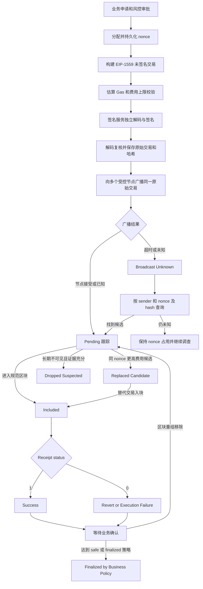

# Day 06：ETH/EVM 账户模型、交易与签名

> 学习目标：掌握 EVM 账户状态、Legacy/EIP-2930/EIP-1559 交易结构、Typed Transaction 签名、Gas 费用、Mempool 与 Receipt；能够解析一笔 Sepolia EIP-1559 交易，并从托管钱包角度解释 nonce 并发、交易替换、状态确认和 BTC/ETH 架构差异。  
> 建议用时：4～5 小时  
> 完成标准：仅使用 Sepolia 或本地开发链，完成一笔真实 EIP-1559 交易及 Receipt 解析、费用核算、生命周期图、BTC/ETH 对比表和一笔不广播的 Java 交易构建，并闭卷回答文末恰好 7 道面试题。

## 安全边界

- 仅使用 Sepolia、本地 Anvil/Hardhat 等开发链和无价值测试密钥；不连接主网资金，不粘贴或提交真实私钥、助记词、API Key。
- 浏览器、公开 RPC 和 Mempool 只能提供观察视图。生产资金事实应由经过认证、健康检查和交叉验证的节点网关提供。
- 不手写 secp256k1、ECDSA、Keccak、RLP 或交易签名实现；必须使用成熟库，并用独立解码器复核签名前的交易语义。
- 所有 ETH、Wei 和 Gas 字段使用整数或 `BigInteger`；禁止用 `double`，禁止把十六进制数量当十进制字符串处理。
- 签名前必须验证 Chain ID、发送方、nonce、收款地址、value、data、gasLimit、费用上限和业务审批快照；不能只接收一个哈希后盲签。
- 已签名交易可能在网络中传播。广播超时、节点查询不到或本地任务超时，都不能作为立即复用 nonce 的依据。

---

## 一、EVM 账户模型

### 1. EOA 与合约账户

| 维度 | EOA（Externally Owned Account） | 合约账户（Contract Account） |
|---|---|---|
| 控制方式 | 由私钥产生的 ECDSA 签名授权交易 | 由部署在地址上的 EVM 字节码和状态控制 |
| 发起顶层交易 | 可以签名并发起 | 不能自行签署顶层交易，只能被交易或其他合约调用 |
| 代码 | 没有运行时代码 | `codeHash` 指向运行时代码 |
| 存储 | 没有合约存储 | 通过 `storageRoot` 承诺键值存储 |
| nonce | 已发起交易的顺序计数 | 通常用于合约创建序号等协议语义 |
| 地址来源 | 通常取未压缩公钥主体的 Keccak-256 后 20 字节 | `CREATE` 由创建者地址和 nonce 推导；`CREATE2` 由部署者、salt 和 init code hash 推导 |
| 能否持有 ETH | 能 | 能 |

EOA 地址不是公钥本身，也不是私钥的哈希。常见推导是：secp256k1 私钥得到未压缩公钥，去掉 `0x04` 前缀，对剩余 64 字节做 Keccak-256，取末 20 字节。地址展示常使用 EIP-55 混合大小写校验和，但链上地址本质仍是 20 字节。

合约账户没有“合约私钥”。如果业务声称通过某个合约地址对应私钥签名，应立即视为模型错误。智能合约钱包的授权来自合约逻辑，可能验证一个或多个 EOA、Passkey、MPC 签名或其他证明。

### 2. 账户状态与世界状态

概念上，一个 Ethereum 账户状态包含：

```text
Account = (nonce, balance, storageRoot, codeHash)
```

- `nonce`：EOA 的发送交易序号；合约账户还承担合约创建计数等协议语义。
- `balance`：以 Wei 表示的原生 ETH 余额。
- `storageRoot`：该账户合约存储结构的根承诺；EOA 没有业务存储。
- `codeHash`：账户运行时代码的哈希；无代码账户对应空代码哈希。

区块头中的状态根承诺执行完该区块全部交易后的全局状态。节点按顺序执行交易，更新账户余额、nonce、代码和存储，并计算新的状态根。交易本身不会携带“执行后的余额”，Receipt 也不是完整状态快照。

> 现代 Ethereum 客户端在内部数据库布局、状态裁剪和未来状态承诺演进上可能不同。面试中重点是：区块头承诺规范状态，账户和存储变化由交易执行产生；不要把某个客户端的磁盘表结构误认为协议唯一实现。

### 3. 余额不是交易所用户余额

链上地址余额与交易所内部用户余额是两个系统：

- 链上余额由 Ethereum 状态决定，单位为 Wei；
- 用户充值地址可能只负责识别，资产会被归集到热/冷钱包；
- 交易所内部账本维护可用、冻结、在途和负债，不应把 RPC `eth_getBalance` 直接展示为用户最终余额；
- 链上转账成功、内部入账成功和可提现是三个不同状态；
- ERC-20 余额保存在代币合约存储中，不计入账户的原生 ETH `balance`。

### 4. nonce 的协议语义

EOA 发送的每笔顶层交易都携带一个 nonce。对某发送方，只有与协议期望 nonce 匹配的交易才能按序执行。交易执行后即使合约逻辑 revert，发送方 nonce 仍会消耗，因为该交易已经被区块执行并支付 Gas。

nonce 解决：

1. **同一发送方的交易顺序**：nonce 5 必须在 nonce 4 之后执行；
2. **防止同链重复执行**：已确认 nonce 不能再次作为新交易执行；
3. **定义替换冲突域**：同一发送方、同一 nonce 的多笔候选交易互相冲突，最终规范链至多采用一笔；
4. **影响合约地址推导**：EOA 使用 `CREATE` 时，创建地址与创建者及创建 nonce 有关。

nonce 不解决：

- 业务请求重复提交；仍需要业务幂等键；
- 跨链重放；需要 Chain ID 和签名域隔离；
- 多实例并发分配；需要数据库事务、唯一约束和可恢复 nonce 管理器；
- 已签名交易的安全取消；只能用同 nonce 的替换交易竞争，不能撤回已传播字节。

常见查询口径：

- `eth_getTransactionCount(address, "latest")`：通常反映最新规范区块执行后的已确认 nonce；
- `eth_getTransactionCount(address, "pending")`：加入该节点本地 pending 视图后的候选值；不同节点可能不同；
- 本地分配 nonce：交易所根据数据库中已预留、已签名、广播未知和在途交易维护的业务序号。

生产系统不能把一次 `pending` 查询当成并发锁。节点 Mempool 不统一，交易可能只在另一个节点传播，本节点可能重启丢池，多实例也可能同时读到相同值。

---

## 二、三类交易与 Typed Transaction

### 1. EIP-2718 类型化交易信封

EIP-2718 为不同交易格式定义类型前缀。概念上：

```text
Transaction = TransactionType || TransactionPayload
```

常见类型：

| 类型 | 类型字节/RPC `type` | 费用模型 | Access List | 主要用途 |
|---|---:|---|---|---|
| Legacy | 无 EIP-2718 类型字节；RPC 常见 `0x0` | `gasPrice` | 无 | 兼容历史交易 |
| EIP-2930 | `0x01` | `gasPrice` | 有 | 显式声明预热地址和存储槽 |
| EIP-1559 | `0x02` | `maxPriorityFeePerGas` + `maxFeePerGas` | 有 | 动态 Base Fee 下的主流交易 |

类型字节属于签名域的一部分，避免不同格式的字段被错误解释为另一类交易。RPC 返回结构是便于使用的 JSON 视图，不等于网络中的原始字节布局。

### 2. Legacy 交易

核心字段：

```text
nonce, gasPrice, gasLimit, to, value, data, v, r, s
```

签名前使用 RLP 编码。EIP-155 之前，签名未绑定 Chain ID，存在跨兼容链重放风险。采用 EIP-155 后，签名负载概念上加入：

```text
chainId, 0, 0
```

签名后的 `v` 编码恢复信息和 Chain ID。Legacy 的 `gasPrice` 是愿意为每单位 Gas 支付的价格；在 EIP-1559 区块中，它仍受 Base Fee 有效性约束。

### 3. EIP-2930 交易

未签名 payload：

```text
chainId,
nonce,
gasPrice,
gasLimit,
to,
value,
data,
accessList
```

签名字段：

```text
yParity, r, s
```

签名摘要概念上是：

```text
keccak256(0x01 || rlp(unsignedPayload))
```

Access List 列出交易预计访问的账户地址和存储键，使其在执行开始时处于 warm 状态，并对清单项支付固定成本。Access List 不是权限白名单，也不会阻止交易访问清单外状态；清单设计不当可能反而增加总 Gas。

### 4. EIP-1559 交易

未签名 payload：

```text
chainId,
nonce,
maxPriorityFeePerGas,
maxFeePerGas,
gasLimit,
to,
value,
data,
accessList
```

签名字段：

```text
yParity, r, s
```

签名摘要概念上是：

```text
keccak256(0x02 || rlp(unsignedPayload))
```

最终原始交易是类型字节 `0x02` 加上包含签名字段的 RLP payload。Typed Transaction 使用 `yParity`，不要机械套用 Legacy 的 `v = 27/28` 或 EIP-155 公式。

字段说明：

| 字段 | 含义 | 生产校验 |
|---|---|---|
| `chainId` | 签名所属链 | 必须与配置、RPC 和审批快照一致 |
| `nonce` | 发送方序号 | 必须由可恢复的 nonce 管理器唯一分配 |
| `maxPriorityFeePerGas` | 每 Gas 最多给区块提议者的优先费 | 非负且受策略上限控制 |
| `maxFeePerGas` | 每 Gas 愿意支付的总价上限 | 必须不低于 priority cap，并留出 Base Fee 波动空间 |
| `gasLimit` | 允许交易执行消耗的 Gas 上限 | 结合估算、安全余量、区块上限和业务上限校验 |
| `to` | 20 字节目标；合约创建时为空 | 校验网络无关的地址字节、业务白名单和零地址策略 |
| `value` | 转移的原生 ETH，单位 Wei | 使用整数并与审批金额完全一致 |
| `data` | 合约 calldata 或空字节 | 解码函数、参数、Token 地址和授权语义，禁止盲签 |
| `accessList` | 预热账户和存储槽 | 允许为空；若非空要限制大小并验证来源 |
| `yParity/r/s` | secp256k1 ECDSA 签名 | 使用成熟库、低 `s` 规则和恢复地址复核 |

### 5. RLP 的边界

RLP 编码的是嵌套字节串列表，不理解字段业务语义。整数通常以最短大端字节串表示，零值和空字节串有严格编码规则。常见风险包括：

- 把十六进制文本的 ASCII 字节当作实际 bytes；
- 给整数保留多余前导零；
- 把合约创建的空 `to` 与 20 字节零地址混为一谈；
- 忘记 Typed Transaction 的类型前缀；
- 对已经带类型前缀和签名的原始交易再次 RLP；
- 把 JSON-RPC quantity 的 `0x0` 编码规则直接当成 RLP 编码规则。

因此实践只需要能解释字段和签名边界，不要求手写 RLP。生产应使用经过测试的编码库并执行 decode-after-encode 复核。

---

## 三、Gas、EIP-1559 与费用计算

### 1. 五个关键量

- `gasLimit`：发送方允许本交易最多消耗的 Gas 数量，不是预付后一定全部扣除。
- `gasUsed`：Receipt 中该交易实际计费的 Gas 消耗。
- `baseFeePerGas`：收录区块根据父块使用率调整的协议基础费，每 Gas 对所有交易有统一基准并被销毁。
- `maxFeePerGas`：发送方愿意支付的每 Gas 总价上限。
- `maxPriorityFeePerGas`：发送方愿意支付给区块提议者的每 Gas 优先费上限。

EIP-1559 的有效 Gas 价格：

$$
\text{effectiveGasPrice}
= \min(\text{maxFeePerGas},\ \text{baseFeePerGas}+\text{maxPriorityFeePerGas})
$$

也可写出实际优先费：

$$
\text{priorityFeePerGas}
= \min(\text{maxPriorityFeePerGas},\ \text{maxFeePerGas}-\text{baseFeePerGas})
$$

前提是交易被收录时 `maxFeePerGas >= baseFeePerGas`。实际费用：

$$
\text{actualFee}=\text{gasUsed}\times\text{effectiveGasPrice}
$$

其中：

$$
\text{burnedFee}=\text{gasUsed}\times\text{baseFeePerGas}
$$

$$
\text{validatorTip}=\text{gasUsed}\times
(\text{effectiveGasPrice}-\text{baseFeePerGas})
$$

### 2. 示例计算

假设一笔普通 ETH 转账：

```text
gasLimit               = 30,000 gas
gasUsed                = 21,000 gas
baseFeePerGas           = 20 gwei
maxPriorityFeePerGas    = 2 gwei
maxFeePerGas            = 50 gwei
```

则：

$$
\text{effectiveGasPrice}=\min(50,20+2)=22\ \text{gwei}
$$

$$
\text{actualFee}=21{,}000\times22=462{,}000\ \text{gwei}
=0.000462\ \text{ETH}
$$

$$
\text{burnedFee}=21{,}000\times20=0.00042\ \text{ETH}
$$

$$
\text{validatorTip}=21{,}000\times2=0.000042\ \text{ETH}
$$

`gasLimit` 比 `gasUsed` 高 9,000，并不意味着多支付 9,000 Gas。发送前客户端会按协议检查发送方是否具备覆盖 `value + gasLimit × maxFeePerGas` 等上界的能力，但最终按实际 `gasUsed × effectiveGasPrice` 结算，未使用的 Gas 上限和 `maxFee` 与有效价之间的余量不会按上限收费。

### 3. gasLimit 过高、过低和 Revert

- **过高**：只要交易实际执行路径不变，一般不会因为上限高而多收；但会提高资金预留上界，削弱费用风控，且不能超过区块/节点接受范围。
- **过低**：执行发生 Out of Gas，状态变更回滚，但已消耗 Gas 仍收费，发送方 nonce 仍消耗。
- **合约 Revert**：合约状态变化回滚，未消耗到上限的剩余 Gas 通常不再执行；已执行部分和回滚开销仍收费，nonce 仍消耗。
- **估算成功**：不保证稍后链上成功。区块状态、Base Fee、余额、授权、价格、区块时间和并发交易都可能改变。
- **估算失败**：可能表示调用会 revert，也可能是节点状态、调用参数、费用字段或 RPC 能力问题；应解析错误并谨慎处理，不能盲目放大 gasLimit。

### 4. 费用估算策略

生产系统可结合：

1. 节点或可信费用估算源给出的 priority fee 建议；
2. 当前区块和近期区块 `baseFeePerGas`；
3. 目标确认时间和业务优先级；
4. `eth_feeHistory` 的奖励分位数；
5. `eth_estimateGas` 加经过验证的安全余量；
6. 每笔绝对费用上限、每 Gas 上限和异常倍数告警；
7. 卡住后的同 nonce 替换策略。

常见做法是给 Base Fee 留出若干区块上涨空间，但具体倍数不是协议常量。不能永久硬编码 `maxFee = 2 × baseFee + tip` 后宣称适用于所有网络和时效目标。

---

## 四、签名、Chain ID 与重放保护

### 1. ECDSA 签名证明什么

Ethereum EOA 使用 secp256k1 ECDSA。签名证明控制相应私钥的一方授权了签名摘要所承诺的交易字段。节点可从签名和摘要恢复公钥/地址，得到发送方 `from`；`from` 不是原始交易中一个可随意相信的签名字段。

签名不提供：

- 交易内容保密；原始交易和链上执行公开可见；
- 业务审批合法性；私钥可能被盗或签名服务可能被绕过；
- 一定成功；nonce、余额、费用和合约执行仍可能失败；
- 永久最终性；交易仍受区块重组和链最终性影响。

### 2. Chain ID 如何防重放

Chain ID 被放入签名摘要。假设同一账户在链 A 和链 B 上使用相同私钥：

- 在链 A 按 `chainId=A` 签名后，签名承诺了 A；
- 把完全相同的原始交易提交到链 B，B 按自己的规则检查时，签名域不匹配或 Chain ID 不被接受；
- 攻击者不能只改 Chain ID，因为这会改变摘要并使签名失效。

Chain ID 只能防止正确实现、不同 Chain ID 间的交易重放。以下仍需注意：

- 两条链错误配置成相同 Chain ID；
- 签名器未验证实际目标链；
- EIP-712 等应用层消息的域分离不完整；
- 合约签名授权没有绑定合约地址、nonce、截止时间或业务动作；
- 历史未采用 EIP-155 的 Legacy 签名。

### 3. 签名前后的独立校验

签名前校验：

- 从受控链配置取得 Chain ID，并用独立 RPC 复核；
- 业务单、发送地址、nonce 和审批版本一一绑定；
- 解析 `to/value/data`，识别原生转账、合约调用、Token 授权和部署；
- 检查余额、Gas 上界、单价上限、绝对费用上限；
- 对地址、金额、Token 合约、函数选择器和参数实施白名单/风控；
- 为请求加入不可重放业务 ID、签名策略版本和审计上下文。

签名后校验：

1. 对原始交易重新解码；
2. 复核所有字段与审批快照完全一致；
3. 从签名恢复发送地址并与预期地址比较；
4. 计算交易哈希并不可变保存原始 bytes；
5. 广播同一原始 bytes，重试时不重新分配 nonce 或静默改变字段。

---

## 五、交易生命周期与状态语义

### 1. 从构建到最终确认



### 2. 各状态的准确含义

| 状态 | 可观察含义 | 不能据此断言 |
|---|---|---|
| Built | 字段已构造 | 已签名、已广播或 nonce 安全占用 |
| Signed | 已产生有效原始交易和哈希 | 网络已看到、交易一定成功 |
| Broadcast Unknown | 已尝试发送但结果不确定 | 广播失败，可立即用新 nonce 重付 |
| Pending | 至少某个节点 Mempool 可见，或系统有在途证据 | 全网可见、一定会入块、顺序不会变化 |
| Included | 节点报告交易位于某个区块 | 区块不会重组、合约执行成功 |
| Success | 规范区块 Receipt `status=1` | Token 业务语义一定符合预期，或已达到业务最终性 |
| Revert/Failed | Receipt `status=0` | 没收费或 nonce 未消耗 |
| Dropped | 一段时间在观察节点中不可见的推测状态 | 交易永远不会重新传播或确认 |
| Replaced | 同发送方和 nonce 的另一候选被节点接受/最终入块 | 原候选在看到规范结果前已被全网永久删除 |
| Finalized | 共识 finalized 标签或业务确认策略达到 | 所有链、L2 和跨链桥拥有完全相同最终性语义 |

`dropped` 和 `replaced` 通常不是链上 Receipt 状态，而是钱包根据 Mempool、同 nonce 候选和规范链结果推导的业务状态。Mempool 是节点本地视图，不能因为一个节点查不到就直接释放 nonce。

### 3. 交易哈希存在不代表成功

交易哈希是原始已签名交易 bytes 的 Keccak-256 标识。任何拿到原始 bytes 的人都能在本地计算哈希，因此：

- 有 hash 可能只表示本地已签名，尚未广播；
- RPC 能查询到交易可能只是 pending；
- `blockHash` 非空表示节点认为它已收录，但还要验证该块位于当前规范链；
- 只有 Receipt 且 `status=0x1` 才说明顶层 EVM 执行成功；
- `status=0x0` 表示执行失败，但交易仍已入块、支付费用并消耗 nonce；
- 即使 `status=1`，仍要根据确认/最终性策略和业务事件判断到账结果。

### 4. Receipt 关键字段

| 字段 | 用途 | 注意事项 |
|---|---|---|
| `transactionHash` | 关联交易 | 还应校验发送方、nonce 和业务 ID 映射 |
| `transactionIndex` | 区块内顺序 | 不是业务唯一键 |
| `blockHash` / `blockNumber` | 定位收录块和跟踪重组 | 必须与当前规范链核对 |
| `status` | `0x1` 成功，`0x0` 执行失败 | Byzantium 之后使用；不要把字段缺失默认成成功 |
| `gasUsed` | 本交易实际计费 Gas | 用它乘 `effectiveGasPrice` 计算实际费用 |
| `effectiveGasPrice` | 实际每 Gas 价格 | 可与区块 Base Fee 交叉核算 |
| `cumulativeGasUsed` | 从块首到本交易累计 Gas | 不是本交易 Gas，不能直接用于单笔费用 |
| `logs` | 成功执行留下的事件日志 | Revert 的调用不会保留其回滚日志；事件仍需按合约和 Topic 解析 |
| `logsBloom` | 日志快速过滤 | 可能有假阳性，不能代替读取和验证 logs |
| `contractAddress` | 合约创建成功时的新地址 | 普通调用通常为空；仍应验证 code 和部署语义 |
| `type` | 交易类型 | 可核对是否为 `0x2` |

Receipt 通常不直接包含 Revert Reason。对失败交易可在相同区块状态上下文重放 `eth_call`、使用调试 API 或 Trace 分析，但历史状态、节点能力和内部调用会影响结果。调试接口数据敏感、开销大，生产应限权和限流。

### 5. 重组与最终性

交易被收录后仍可能因链重组离开规范链，随后：

- 同一原始交易可能重新进入 Mempool或另一个区块；
- 同 nonce 的替代交易可能进入新规范链；
- 原 Receipt 的块位置失效，不能继续沿用旧确认数；
- 业务系统应以 `(chainId, transactionHash)` 标识候选，以 `blockHash` 记录当前收录版本，并保留历史位置。

Ethereum JSON-RPC 常提供 `latest`、`safe`、`finalized` 标签。`latest` 是当前头部，不等于最终；`safe` 与 `finalized` 提供更强共识保证，但节点支持、网络和 L2 语义需单独验证。交易所还可在共识标签之上增加金额、风险和运营策略。

---

## 六、解析一笔 Sepolia EIP-1559 交易

> 本节不硬编码一个可能被复制错误或失去可用性的交易快照。实践时选择一笔已确认的 Sepolia `type=0x2` 交易，把哈希、原始 RPC 响应和查询时间保存到个人实验记录。公开 RPC/浏览器只是学习数据源，不是生产权威。

### 1. 需要采集的原始证据

至少保存以下三份 JSON：

```text
eth_getTransactionByHash(txHash)
eth_getTransactionReceipt(txHash)
eth_getBlockByHash(receipt.blockHash, false)
```

建议额外采集：

```text
eth_chainId
eth_getTransactionCount(from, "latest")
eth_getCode(to, receipt.blockNumber)
eth_call / debug_traceTransaction（仅在失败分析且节点支持时）
```

必须交叉校验：

- `eth_chainId == 0xaa36a7`，即 Sepolia 十进制 `11155111`；
- transaction、receipt 的 `transactionHash` 一致；
- transaction、receipt 的 `blockHash/blockNumber` 一致；
- block 的 `hash` 等于 Receipt 的 `blockHash`；
- transaction `type == 0x2`；
- Receipt `effectiveGasPrice` 与交易上限、区块 Base Fee 关系成立。

### 2. JSON-RPC 数量转换

JSON-RPC 的 quantity 是 `0x` 开头、无多余前导零的十六进制整数。例如：

```text
0x5208 = 21,000
0xaa36a7 = 11,155,111
1 ETH = 10^18 Wei
1 Gwei = 10^9 Wei
```

不要用 Java `long` 假定所有链上数量都不会溢出。统一解析为 `BigInteger`：

```java
static BigInteger quantity(String hex) {
    if (hex == null || !hex.startsWith("0x")) {
        throw new IllegalArgumentException("invalid JSON-RPC quantity");
    }
    String digits = hex.substring(2);
    return digits.isEmpty() ? BigInteger.ZERO : new BigInteger(digits, 16);
}
```

### 3. 逐字段解析模板

```text
查询时间（UTC）：
RPC/浏览器来源：
网络：Sepolia
Chain ID（hex / decimal）：

交易身份
- hash：
- type：
- from：
- to：
- nonce（hex / decimal）：
- blockHash：
- blockNumber（hex / decimal）：
- transactionIndex：

交易意图
- value（Wei / ETH）：
- input/data 字节数：
- 若为合约调用，函数选择器：
- 解码后的函数和参数：
- accessList：

Gas 上限
- gasLimit：
- maxFeePerGas（Wei / Gwei）：
- maxPriorityFeePerGas（Wei / Gwei）：

签名
- yParity/v：
- r：
- s：
- 恢复出的发送方是否等于 from：

收录区块
- block hash：
- block number：
- baseFeePerGas（Wei / Gwei）：
- 当前规范链是否仍在该高度返回此 hash：

Receipt
- status：
- gasUsed：
- cumulativeGasUsed：
- effectiveGasPrice（Wei / Gwei）：
- contractAddress：
- logs 数量：

费用核算
- min(maxFeePerGas, baseFeePerGas + maxPriorityFeePerGas)：
- gasUsed × effectiveGasPrice（Wei / ETH）：
- gasUsed × baseFeePerGas（销毁）：
- gasUsed × (effectiveGasPrice - baseFeePerGas)（Tip）：

结论
- 当前状态：pending / included-success / included-revert / reorged：
- 当前确认或 safe/finalized 情况：
- 链上可以证明的事实：
- 仍需要钱包内部数据才能证明的业务事实：
```

### 4. 费用核算伪代码

```text
assert tx.type == 0x2
assert tx.hash == receipt.transactionHash
assert tx.blockHash == receipt.blockHash
assert block.hash == receipt.blockHash

chainId       = hexToInteger(tx.chainId)
maxFee         = hexToInteger(tx.maxFeePerGas)
maxPriority    = hexToInteger(tx.maxPriorityFeePerGas)
baseFee        = hexToInteger(block.baseFeePerGas)
gasUsed        = hexToInteger(receipt.gasUsed)
effective      = hexToInteger(receipt.effectiveGasPrice)

assert chainId == 11155111
assert maxFee >= effective
assert effective == min(maxFee, baseFee + maxPriority)
assert effective >= baseFee

actualFee      = gasUsed * effective
burnedFee      = gasUsed * baseFee
validatorTip   = gasUsed * (effective - baseFee)
assert actualFee == burnedFee + validatorTip
```

对某些网络、协议升级或特殊交易类型，费用可能还有 Blob fee、L1 data fee、Rollup 费用等额外组成。本日只核算 Sepolia 普通 `type=0x2` 执行 Gas，不能把该公式不加区分地套到所有 L2 或 EIP-4844 Blob 交易。

### 5. 解析结论必须区分事实和推测

可以由链上证明：

- 原始交易字段、签名恢复地址、nonce 和 Chain ID；
- 当前节点视图中的收录块、Receipt、Gas 和日志；
- 顶层执行成功或失败；
- 当前规范链位置和共识标签。

仅靠公开链上不能证明：

- 地址现实中属于哪个用户或交易所；
- 交易是否通过企业审批、AML 或账本扣款；
- 合约事件是否满足交易所支持资产的全部业务规则；
- 某个 pending 交易是否已被所有节点接受；
- 一个地址背后的私钥是否由 HSM、MPC 或个人控制。

---

## 七、Java 构建一笔不广播的 EIP-1559 测试交易

> 示例使用 Web3j 的交易模型表达“构建但不广播”。具体构造器会随 Web3j 版本变化，应锁定依赖版本并查阅对应 API。示例不包含私钥，不调用 `eth_sendRawTransaction`，也不要求在仓库创建 Maven 项目。

### 1. Maven 依赖示例

```xml
<dependency>
    <groupId>org.web3j</groupId>
    <artifactId>core</artifactId>
    <version>4.12.3</version>
</dependency>
```

使用前应在 Maven Central 和项目发布页核对当前受支持版本及安全公告，不应盲目把示例版本当成长期推荐。

### 2. 只构建、不签名、不广播

```java
import java.math.BigInteger;
import org.web3j.crypto.RawTransaction;
import org.web3j.utils.Convert;

public final class BuildEip1559Transaction {
    private static final long SEPOLIA_CHAIN_ID = 11_155_111L;

    public static void main(String[] args) {
        BigInteger nonce = BigInteger.valueOf(7); // 仅为本地练习夹具
        BigInteger gasLimit = BigInteger.valueOf(21_000);
        BigInteger maxPriorityFeePerGas = Convert.toWei("1.5", Convert.Unit.GWEI).toBigIntegerExact();
        BigInteger maxFeePerGas = Convert.toWei("40", Convert.Unit.GWEI).toBigIntegerExact();
        String to = "0x1111111111111111111111111111111111111111";
        BigInteger value = Convert.toWei("0.001", Convert.Unit.ETHER).toBigIntegerExact();

        if (maxFeePerGas.compareTo(maxPriorityFeePerGas) < 0) {
            throw new IllegalArgumentException("maxFeePerGas must cover priority fee cap");
        }
        if (!to.matches("0x[0-9a-fA-F]{40}")) {
            throw new IllegalArgumentException("invalid destination bytes");
        }

        RawTransaction tx = RawTransaction.createEtherTransaction(
                SEPOLIA_CHAIN_ID,
                nonce,
                gasLimit,
                to,
                value,
                maxPriorityFeePerGas,
                maxFeePerGas);

        System.out.println("type=EIP-1559");
        System.out.println("chainId=" + SEPOLIA_CHAIN_ID);
        System.out.println("nonce=" + tx.getNonce());
        System.out.println("to=" + tx.getTo());
        System.out.println("valueWei=" + tx.getValue());
        System.out.println("gasLimit=" + tx.getGasLimit());
        System.out.println("maxPriorityFeePerGasWei=" + tx.getMaxPriorityFeePerGas());
        System.out.println("maxFeePerGasWei=" + tx.getMaxFeePerGas());
        System.out.println("No key loaded; not signed; not broadcast.");
    }
}
```

若所用 Web3j 版本没有相同签名的 `createEtherTransaction`，应使用该版本提供的 EIP-1559 `RawTransaction` 工厂方法，或显式构造对应对象。不要为了“让示例能编译”而退化成 Legacy `gasPrice` 交易。

### 3. 生产实现还必须补齐

- 从链配置而不是调用方请求获取 Chain ID；
- 校验 EIP-55 地址或先解码为 20 字节，再用规范格式展示；
- 从数据库事务分配 nonce，保存业务单和 nonce 唯一约束；
- 通过 `eth_estimateGas` 和费用策略产生 Gas 参数；
- 使用 HSM/KMS/MPC/隔离签名服务，不让业务服务接触明文私钥；
- 签名服务独立解码并校验 `to/value/data/fees`；
- 签名后恢复发送方并复核，保存原始交易和 hash；
- 广播重试始终使用同一原始 bytes；
- 对广播未知、替换、Revert、重组和最终性建立状态机。

---

## 八、BTC UTXO 与 EVM Account 模型对比

| 维度 | Bitcoin UTXO | Ethereum Account |
|---|---|---|
| 共识状态 | 未花费输出集合 | 地址到账户状态的映射 |
| 余额 | 钱包可解锁 UTXO 金额之和 | 账户状态中的 `balance`；Token 余额在合约存储 |
| 支付输入 | 明确引用多个 `txid:vout` | 指定一个发送账户和 nonce |
| 找零 | 通常需要显式找零输出 | 原生转账直接扣余额，无 UTXO 找零 |
| 顺序/防重放 | Outpoint 只能在规范链有效消费一次 | 同发送方 nonce 严格排序并防同链重复执行 |
| 并发冲突点 | 多任务竞争同一 UTXO | 多任务竞争同一发送地址的 nonce |
| 并行能力 | 不共享输入的交易可独立构建 | 同一发送方严格受 nonce 序列约束；多发送地址可分片 |
| 费用 | 输入总额减输出总额；主要由 vsize 和费率决定 | `gasUsed × effectiveGasPrice`；取决于执行路径和区块 Base Fee |
| 费用上界 | 构建时由输入输出差额固定 | `gasLimit × maxFeePerGas` 是费用上界，实际按执行结算 |
| 失败语义 | 通常是整笔交易不满足共识/脚本而不能入块；已入块即输入输出生效 | 交易可入块但合约执行 `status=0`，状态回滚、Gas 和 nonce 仍消耗 |
| 替换/加速 | RBF 替换交易或 CPFP 子交易 | 同发送方同 nonce、提高费用参数的替换交易 |
| 签名承诺 | 每个输入按脚本版本和 SIGHASH 签名 | 顶层交易按类型、Chain ID 和字段生成单个发送方签名 |
| 交易标识 | `txid`；SegWit 另有 `wtxid` | 已签名 typed transaction bytes 的 Keccak-256 hash |
| 充值唯一键 | `network + txid + vout`，一笔交易可有多个充值输出 | 原生 ETH 常以 `chainId + txHash` 表示顶层价值转移；内部调用/Token Log 需更细粒度事件键 |
| 扫链重点 | 遍历输出、匹配 `scriptPubKey`、追踪 UTXO 与确认 | 扫交易、Receipt 和 Logs，处理内部调用、合约事件与状态 |
| 资源预留 | UTXO 行级原子预留 | nonce 原子分配；同时预留余额和费用上界 |
| 批量提币 | 多输入、多输出天然适合链上批量 | EOA 一笔普通交易通常一个顶层目标；批量需合约并增加合约风险 |
| 归集 | 合并 UTXO，权衡碎片、隐私和费用 | 多充值地址逐个 nonce 转账；ERC-20 地址还需原生 ETH 支付 Gas |
| 重组处理 | 输出可能从规范链消失或冲突花费 | Receipt/Logs 可失效，交易可能重回 pending 或被同 nonce 候选替代 |
| 钱包架构影响 | UTXO 库、选币器、预留表、PSBT、找零地址管理 | nonce 服务、费用服务、合约解码、交易替换和 Receipt/Log 索引 |

### 对托管钱包架构的核心影响

**BTC：** 钱包必须知道每个 UTXO 的金额、脚本、确认、风险标签和预留状态。并发正确性围绕 Outpoint：选币与预留在数据库事务中原子完成。交易构建后输入集合基本确定，手续费加速涉及 RBF 或 CPFP，归集需要治理碎片。

**ETH：** 钱包必须对每个发送地址维护可恢复的 nonce 序列。一个低 nonce 卡住会阻塞后续高 nonce 交易，形成 nonce gap。为提高吞吐可使用多个热钱包地址分片，但会增加资金调度、Gas 和风控复杂度。合约调用还必须解码 calldata、模拟执行并核验 Receipt/Logs。

**共同点：** 两者都不能只靠 Redis 锁或节点临时状态保证资金安全；都需要数据库唯一约束、不可变签名记录、幂等广播、规范链确认、重组恢复、账本对账和人工兜底。

---

## 九、生产异常与恢复矩阵

| 场景 | 风险 | 检测 | 安全动作 |
|---|---|---|---|
| 两实例分到同一 nonce | 两笔提币互相替换，可能错付 | `(chainId, from, nonce)` 唯一冲突 | 数据库事务分配和条件更新；冲突时阻断签名并审计 |
| nonce gap | 后续交易长时间不能执行 | 最低未确认 nonce 缺失，后续 pending 堆积 | 找回/重播原始交易，或经审批发送同 nonce 自转取消交易 |
| `nonce too low` | 本地状态落后或交易已执行/替换 | 节点错误加链上 nonce 查询 | 按 sender+nonce 查询规范交易和候选，不直接分配新付款 |
| `replacement transaction underpriced` | 替换费率不足，卡住 | 节点明确拒绝 | 按节点/网络替换规则提高 fee caps，保持同 nonce 并复核业务语义 |
| `maxFee < baseFee` | 当前无法入块 | Base Fee 超过 fee cap | 等待 Base Fee 回落或经策略审批用同 nonce 提高费用替换 |
| 广播超时 | 原交易可能已传播，重复付款 | RPC timeout，结果未知 | 保存 `BROADCAST_UNKNOWN`，按 hash 和 sender+nonce 多节点查询，重发同 bytes |
| 单节点查不到 pending | 错误释放 nonce | 节点视图分歧 | 查询多节点、本地签名记录和链上 nonce；保持占用并等待证据 |
| Receipt `status=0` | 业务失败但费用已扣 | 已确认 Receipt | 标记链上失败，记录 Gas，解冻未支付业务本金但不恢复已花费用/nonce |
| 交易入块后重组 | Receipt 和 Logs 失效 | block hash 不再规范 | 回退到 pending/reorged，撤销未最终业务动作，重新跟踪同 nonce 候选 |
| 节点返回错误 Chain ID | 跨链错签 | 配置与 `eth_chainId` 不一致 | 隔离节点并停止签名；不接受调用方覆盖链配置 |
| Gas 估算恶意放大 | 费用或资金占用过高 | 相对历史、调用类型和绝对上限异常 | 阻断并模拟/人工审核，不盲目增加 gasLimit |
| 合约模拟成功但链上 Revert | 状态在收录前改变 | Receipt 失败，Trace/Revert 数据 | 记录失败原因，检查滑点/授权/截止时间；不自动无限重试 |
| 服务重启丢本地 Mempool 视图 | 重复分配 nonce | DB 在途记录与节点不一致 | 以 DB 已签名原始交易为恢复依据，重放查询和对账 |

---

## 十、监控与数据模型要点

### 1. 建议核心字段

```text
evm_transaction
- business_id                 UNIQUE
- chain_id
- from_address
- nonce
- tx_type
- to_address
- value_wei
- data_hash
- gas_limit
- max_fee_per_gas
- max_priority_fee_per_gas
- raw_tx_ciphertext/reference
- tx_hash
- replacement_group_id
- replaces_tx_hash
- status
- block_number
- block_hash
- receipt_status
- gas_used
- effective_gas_price
- version
- timestamps

UNIQUE(chain_id, from_address, nonce, active_generation)
UNIQUE(chain_id, tx_hash)
```

“同 nonce 替换”意味着不能简单永久禁止该 nonce 出现第二条记录。可用 `replacement_group_id` 表示一条 nonce lineage，并保证同一时刻只有一个受批准的 active candidate；保留所有候选原始交易和替换关系，不能覆盖旧记录。

### 2. 关键指标

- 每个热钱包的 confirmed nonce、节点 pending nonce、本地 next nonce 差值；
- nonce gap 数量和最老 gap 年龄；
- pending 数量、P50/P95/P99 入块延迟；
- 广播接受率、未知结果率、各节点错误码；
- replacement 数量、替换成功率和费用增幅；
- Receipt `status=0` 比例及按合约/函数聚合；
- 估算 Gas 与实际 `gasUsed` 比率；
- Base Fee、priority fee、实际费用和异常费用上限阻断；
- 热钱包 ETH 余额、已预留 value、最大 Gas 负债；
- 节点 Chain ID、tip 高度/hash、`safe/finalized` lag 和节点分歧；
- 已收录后重组次数、深度和受影响金额；
- 链上交易、业务单、账本和费用对账差异。

---

## 十一、口头面试题参考答案

> 本节严格包含计划中的 7 道题。先闭卷回答，再按“结论 → 原理 → 生产实现 → 异常与风险 → 监控和恢复”补全。

### 1. ETH 的 nonce 解决了什么问题？

**参考回答：**

nonce 是发送方 EOA 的交易序号，解决同一账户交易顺序和同链重复执行问题。节点只会按连续 nonce 执行交易；某 nonce 被规范链交易消耗后，旧签名不能再次作为新交易执行。同 sender、同 nonce 的候选还构成替换冲突域，最终规范链至多执行一个。

它不替代业务幂等和并发控制。交易所多实例必须在数据库事务中为 `(chainId, from)` 原子分配 nonce，并以唯一约束防冲突。已签名、广播未知和 pending 的 nonce 都不能因锁过期而释放。监控 confirmed、节点 pending、本地 next nonce 和 gap；发生差异时按原始交易、hash、sender+nonce 和规范链恢复。

### 2. EIP-1559 的费用如何计算？

**参考回答：**

每单位 Gas 的有效价格是 `min(maxFeePerGas, baseFeePerGas + maxPriorityFeePerGas)`，前提是 fee cap 能覆盖收录区块 Base Fee。实际费用是 `gasUsed × effectiveGasPrice`。其中 `gasUsed × baseFeePerGas` 被销毁，剩余部分是给区块提议者的优先费。

`maxFeePerGas` 是上限，不是一定支付价格。生产系统应使用 `eth_feeHistory`、近期 Base Fee 和目标时效估算，设置每 Gas 和绝对费用上限，并支持同 nonce 提价替换。核算时以 Receipt 的 `gasUsed/effectiveGasPrice` 和收录块 `baseFeePerGas` 为准。

### 3. `gasLimit` 设置过高是否一定多收费？

**参考回答：**

不一定。`gasLimit` 是允许执行的 Gas 上限，最终通常按 Receipt 的 `gasUsed × effectiveGasPrice` 收费；未使用的上限不会按实际消耗收费。例如普通 ETH 转账上限 30,000、实际使用 21,000，只按 21,000 结算。

但设置过高会扩大余额预留和潜在最坏费用，削弱风控，也可能超过节点或区块限制。设置过低会 Out of Gas，状态回滚但已消耗 Gas 和 nonce 不返还。生产应估算、加有依据的余量，同时限制绝对 Gas 和最大费用，不能遇到失败就无限放大。

### 4. Chain ID 如何防止跨链重放？

**参考回答：**

Chain ID 被包含在交易签名摘要中。链 A 的签名承诺 `chainId=A`，原始交易拿到链 B 后不能被当作 `chainId=B` 的有效授权；修改 Chain ID 会改变摘要并使签名失效。Legacy 交易通过 EIP-155 编码，EIP-2930/1559 把 Chain ID 作为显式签名字段。

边界是两条链若错误使用相同 Chain ID，或者应用层签名没有正确域隔离，仍可能重放。签名服务必须从受控配置取得 Chain ID，并与节点返回和审批快照交叉验证，不能信任调用方随意传入。

### 5. 交易哈希存在是否说明交易成功？

**参考回答：**

不说明。交易哈希可由本地已签名原始 bytes 直接计算，有 hash 甚至不代表已经广播。RPC 查到交易也可能只处于某个节点的 pending Mempool。只有交易进入当前规范区块并取得 Receipt 后，才能看顶层执行结果；`status=1` 是成功，`status=0` 是 Revert/失败。

即使 `status=1`，还要等待确认或 safe/finalized 策略，并验证业务事件、金额和账本。监控应区分 signed、broadcast unknown、pending、included、success/revert、reorged 和 finalized，不能用一个 hash 字段代替状态机。

### 6. 交易 Receipt 中哪些字段可用于判断结果？

**参考回答：**

首先看 `status`：`0x1` 表示顶层执行成功，`0x0` 表示失败。再用 `blockHash/blockNumber` 验证收录块仍在规范链，用 `transactionHash` 关联原交易。`gasUsed × effectiveGasPrice` 计算实际费用；不能误用 `cumulativeGasUsed`。合约业务还要解析 `logs`、Topic 和参数，合约部署可检查 `contractAddress`。

Receipt 成功不一定等于用户收到预期 Token，例如调用了错误合约、非标准 Token 或业务事件不符合预期。Receipt 通常也不直接携带 Revert Reason，失败分析可能需要在历史状态上下文重放调用或 Trace。最终仍需确认策略、日志校验和内部账本对账。

### 7. BTC UTXO 与 EVM Account 模型对钱包架构有什么影响？

**参考回答：**

BTC 钱包围绕 UTXO 集构建：维护每个 Outpoint 的金额、脚本、确认和预留状态，使用选币算法生成输入、找零和费用；并发核心是数据库原子预留 UTXO，长期不确认用 RBF 或 CPFP。充值按 `network+txid+vout` 识别，一笔交易可有多个相关输出。

EVM 钱包围绕账户余额和 nonce 构建：同一发送地址交易串行，必须有可恢复 nonce 服务，处理 gap、同 nonce 替换和广播未知。费用取决于执行 Gas，合约调用还要模拟、解码 calldata、检查 Receipt 和 Logs。提高吞吐通常采用多个发送地址分片，而不是选更多 UTXO。两者都需要数据库幂等、签名隔离、规范链确认、重组处理、账本和对账。

---

## 十二、当天任务

### 任务 1：账户与交易结构（45 分钟）

- [ ] 画出 EOA、合约账户和 `(nonce, balance, storageRoot, codeHash)`。
- [ ] 解释 EOA nonce 与合约账户 nonce 的差异。
- [ ] 默写 Legacy、EIP-2930、EIP-1559 核心字段。
- [ ] 解释 `0x01/0x02` 类型字节、RLP 和签名摘要边界。

### 任务 2：测试网交易解析（60～90 分钟）

- [ ] 在 Sepolia 选择一笔已确认 `type=0x2` 交易。
- [ ] 保存 transaction、receipt、block 三份原始 JSON 和 UTC 查询时间。
- [ ] 将所有十六进制 quantity 转为十进制，核对 Chain ID、hash 和 block 关系。
- [ ] 解码 `to/value/data`，区分原生转账、合约调用和合约创建。
- [ ] 使用 Receipt 判断执行结果，明确当前确认或 safe/finalized 状态。

### 任务 3：费用核算（30～45 分钟）

- [ ] 计算 `effectiveGasPrice` 并与 Receipt 比较。
- [ ] 计算实际费用、Base Fee 销毁和 Validator Tip，统一使用 Wei 后再展示 ETH。
- [ ] 解释 `gasLimit`、`gasUsed` 和资金预留上界的差异。
- [ ] 推演 Base Fee 超过 `maxFeePerGas` 以及 Out of Gas 两种情况。

### 任务 4：生命周期和异常（45 分钟）

- [ ] 不看资料画出构建、签名、广播、pending、included、Receipt、finalized 流程。
- [ ] 推演广播超时后服务重启，说明为什么不能立即创建新付款。
- [ ] 推演同 nonce 提价替换和 nonce gap。
- [ ] 推演已成功 Receipt 因重组失效并重新进入 pending。

### 任务 5：Java 与模型对比（45 分钟）

- [ ] 使用成熟 Java 库构建一笔不签名、不广播的 Sepolia EIP-1559 交易。
- [ ] 打印并人工核对 Chain ID、nonce、to、value、gasLimit 和两个费用上限。
- [ ] 完成 BTC/EVM 对比表，重点解释 UTXO 预留与 nonce 分配。
- [ ] 检查 Git 状态，确认没有私钥、助记词、API Key 或真实签名原文。

### 任务 6：口头表达（30～45 分钟）

- [ ] 不看资料回答本节恰好 7 道面试题并录音。
- [ ] 用 5 分钟讲清所选 EIP-1559 交易和费用。
- [ ] 用 5 分钟讲清 nonce 冲突、替换和广播未知恢复。
- [ ] 将薄弱点记录到 `progress.md`。

---

## 十三、闭卷验收

- [ ] 能解释 EOA、合约账户、四项账户状态和状态根。
- [ ] 能说明链上余额、ERC-20 余额和交易所内部余额的边界。
- [ ] 能解释 nonce 的排序、防重放、替换语义及其不解决的问题。
- [ ] 能默写 Legacy、EIP-2930、EIP-1559 的核心字段差异。
- [ ] 能解释 Typed Transaction 类型前缀、RLP 和签名摘要。
- [ ] 能写出 EIP-1559 有效价、实际费、销毁费和 Tip 公式。
- [ ] 能解释 Gas 上限过高、过低、Revert 和估算成功的边界。
- [ ] 能说明 Chain ID 的重放保护及相同 Chain ID/应用签名风险。
- [ ] 能从 transaction、receipt、block 三份数据完成交叉校验。
- [ ] 能区分 hash、pending、included、success、revert、dropped、replaced、finalized。
- [ ] 能用 Receipt 正确判断顶层结果并核算费用，不误用 `cumulativeGasUsed`。
- [ ] 能解释广播未知为什么不能释放 nonce。
- [ ] 能完成一笔不签名、不广播的 Java EIP-1559 构建。
- [ ] 能从并发、费用、扫描、失败和归集比较 BTC 与 ETH。
- [ ] 闭卷回答 7 道题，覆盖正常流程、异常恢复、监控和工程取舍。

## 十四、Day 06 验收清单

- [ ] 全部实验仅使用 Sepolia/本地开发链和无价值测试数据。
- [ ] 已保存一笔真实 EIP-1559 测试网交易、Receipt 和收录块证据。
- [ ] 已核对 Chain ID、交易类型、nonce、签名、区块位置和执行状态。
- [ ] 已以整数完成实际 Gas 费、销毁费和 Tip 核算。
- [ ] 已画出交易从业务申请到最终确认的完整生命周期。
- [ ] 已推演 dropped、replaced、revert、广播未知和重组。
- [ ] 已完成 BTC/ETH 交易模型及钱包架构对比表。
- [ ] 已使用 Java 库构建但未签名、未广播测试交易。
- [ ] Git 中没有私钥、助记词、API Key 或生产敏感信息。
- [ ] 已录音回答 7 道题并记录薄弱点。

## 十五、30 分自评分

| 能力 | 1 分 | 3 分 | 5 分 | 今日得分 |
|---|---|---|---|---|
| 账户与 nonce | 只知道账户有余额 | 能解释 EOA、合约与顺序 | 能设计多实例 nonce 分配、替换和恢复 |  |
| 交易与签名 | 只能识别 `to/value` | 能比较三类交易和 Chain ID | 能解释 typed envelope、签名域和独立复核 |  |
| Gas 与费用 | 只会看 gasLimit | 能核算 EIP-1559 实际费 | 能处理估算、上限、替换和异常费用策略 |  |
| 状态与 Receipt | 有 hash 就认为成功 | 能用 Receipt 判断 success/revert | 能处理 pending、广播未知、重组和最终性 |  |
| 钱包架构 | 只会调用 RPC 转账 | 能比较 UTXO 与 Account | 能设计 nonce、签名、监控、账本和恢复边界 |  |
| 口头表达 | 回答零散 | 能讲清正常交易 | 能覆盖异常、安全、监控和方案取舍 |  |

**当日总分：** ____ / 30  
**所解析的 Sepolia 交易哈希：** ______________________________  
**收录块高度/哈希：** ______________________________  
**实际 Gas 费用：** __________________ Wei / __________________ ETH  
**最薄弱的三个知识点：** 1. __________ 2. __________ 3. __________  
**明日优先补强：** ______________________________
