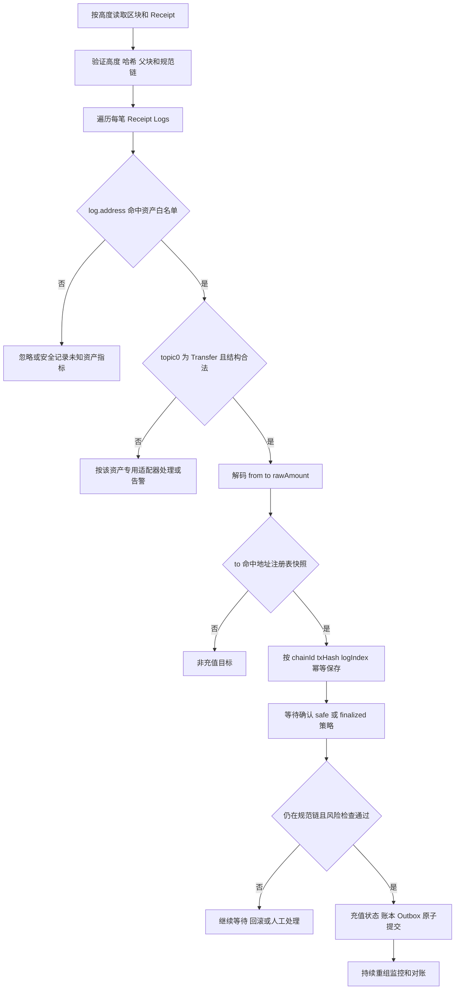
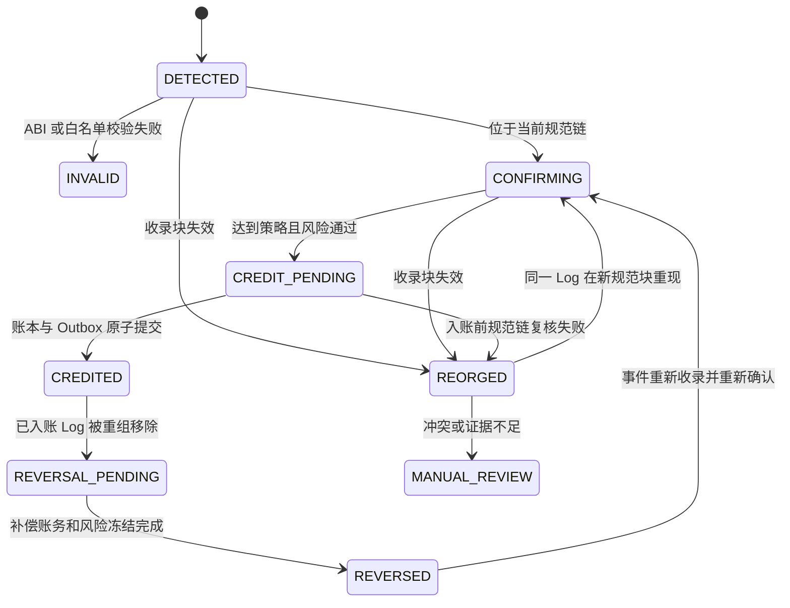
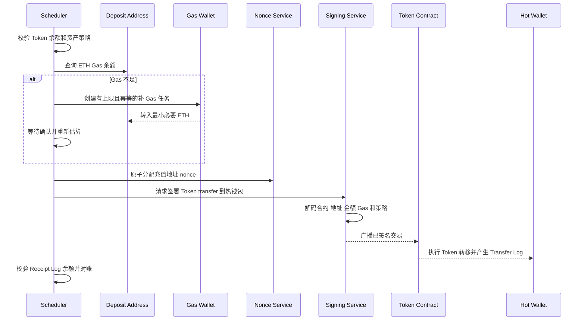
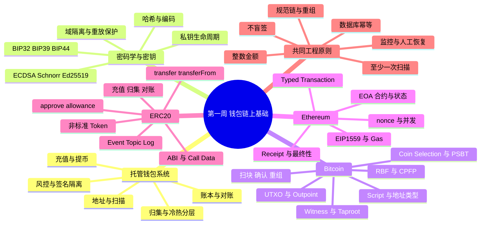

# Day 07：ERC-20、ABI、Event 与第一周复盘

> 学习目标：掌握 Solidity ABI、函数选择器、Call Data、Event Topic 与 Receipt Log 的解析方法；理解 ERC-20 转账、授权、非标准实现及交易所充值识别边界；能够完成一笔 Sepolia ERC-20 交易解析，并复盘第一周的密码学、BTC 与 EVM 核心知识。  
> 建议用时：4～5 小时  
> 完成标准：仅使用 Sepolia、公开历史交易或本地开发链，完成一笔 ERC-20 交易的 Call Data、Receipt 和 Event Log 交叉解析，制作原生 ETH/ERC-20 充值对比表，画出第一周知识地图，闭卷完成文末恰好 7 道面试题。

## 安全边界

- 仅使用 Sepolia、本地开发链和无价值测试资产；不使用主网真实资金，不提交私钥、助记词、API Key、签名原文或生产地址映射。
- Token 名称和符号不是资产身份。生产系统必须按 `chainId + contractAddress` 使用经过审批的资产白名单，不能按 `symbol`、名称或图标识别资产。
- 区块浏览器和第三方索引器仅用于学习与辅助核对，不是资金入账的唯一事实来源；生产数据应来自受控节点、可重放扫描和独立对账。
- 不手写 Keccak、ABI 编解码或 ECDSA；使用成熟库，但仍须验证数组长度、偏移、地址、整数范围、日志来源及资源上限。
- 所有 Token 原始金额使用无符号整数语义并在 Java 中保存为 `BigInteger`；`decimals` 只用于展示，禁止使用 `double` 参与账务。
- 不把 Receipt `status=1`、一次 `eth_call` 成功或出现一个 `Transfer` Topic 直接等同于交易所可入账。

---

## 一、ERC-20 是合约接口，不是原生资产

### 1. ERC-20 的基本模型

ERC-20 约定一组合约函数和事件，使钱包、交易所及应用可以用统一方式操作同质化 Token。余额和授权额度保存在 Token 合约自己的存储中，而不是 EVM 账户的原生 ETH `balance` 字段。

常见接口：

```solidity
function totalSupply() external view returns (uint256);
function balanceOf(address account) external view returns (uint256);
function transfer(address to, uint256 value) external returns (bool);
function allowance(address owner, address spender) external view returns (uint256);
function approve(address spender, uint256 value) external returns (bool);
function transferFrom(address from, address to, uint256 value) external returns (bool);

event Transfer(address indexed from, address indexed to, uint256 value);
event Approval(address indexed owner, address indexed spender, uint256 value);
```

常见元数据函数 `name()`、`symbol()`、`decimals()` 广泛使用，但历史 ERC-20 核心规范并不能保证所有合约都以完全一致的方式实现它们。扫描与账务不能因为元数据查询失败就错误解析金额，也不能相信合约返回的名称代表官方资产。

### 2. 四个核心操作

| 操作 | 状态变化 | 调用者与参数语义 | 典型用途 |
|---|---|---|---|
| `transfer(to, value)` | 从 `msg.sender` 余额扣减并增加 `to` 余额 | 发送者就是顶层调用者或当前合约 | 普通 Token 转账、提币、归集 |
| `approve(spender, value)` | 设置 `allowance[owner][spender]` | `owner = msg.sender` | 授权交易所、DEX、桥或业务合约代扣 |
| `allowance(owner, spender)` | 只读 | 查询剩余授权额度 | 转账前检查授权、风险展示 |
| `transferFrom(from, to, value)` | 扣减 `from` 余额，通常同时扣减调用者的 allowance | `spender = msg.sender` | 合约代扣、DEX、支付或托管流程 |

`transferFrom` 交易的顶层 `from` 是支付 Gas 的调用者，Call Data 中的第一个参数才是 Token 资金来源。不能把交易发送者、Token 来源地址和 Token 接收地址混为一谈。

### 3. 原始金额与展示金额

链上 `uint256 value` 是不可带小数点的原始整数。若资产配置中 `decimals=d`，展示值为：

$$
\text{displayAmount}=\frac{\text{rawAmount}}{10^d}
$$

例如 `rawAmount = 1,500,000` 且 `decimals = 6`：

$$
\text{displayAmount}=1.5
$$

生产要求：

- 原始金额、账本金额和对账金额统一保存最小单位整数；
- `decimals` 来自版本化资产配置，而不是每次入账临时调用不受信合约；
- 展示时使用 `BigDecimal(rawAmount, decimals)` 或等价精确方法；
- 不对入账金额做二进制浮点舍入；
- 合约升级或资产迁移时，元数据变化必须经过配置审批，不能静默改写历史流水。

---

## 二、ABI、函数选择器与 Call Data

### 1. ABI 的职责

ABI（Application Binary Interface）规定外部调用如何把函数及参数编码成字节，也规定返回值、错误和事件参数如何编码。ABI 不证明目标合约可信，也不保证函数一定遵循 ERC-20 语义。

函数 Call Data 的结构：

```text
4-byte function selector || ABI-encoded arguments
```

函数选择器：

$$
\text{selector}=\text{first4Bytes}(\operatorname{keccak256}(\text{canonicalFunctionSignature}))
$$

规范函数签名只包含函数名和规范参数类型，不包含参数名、返回值、空格或 `indexed`。例如：

```text
transfer(address,uint256)
```

其选择器为：

```text
0xa9059cbb
```

### 2. 常见 ERC-20 选择器

| 函数签名 | 选择器 | 参数/返回值 |
|---|---|---|
| `transfer(address,uint256)` | `0xa9059cbb` | `to, value` / `bool` |
| `transferFrom(address,address,uint256)` | `0x23b872dd` | `from, to, value` / `bool` |
| `approve(address,uint256)` | `0x095ea7b3` | `spender, value` / `bool` |
| `allowance(address,address)` | `0xdd62ed3e` | `owner, spender` / `uint256` |
| `balanceOf(address)` | `0x70a08231` | `account` / `uint256` |

选择器只有 4 字节，理论上可能碰撞。解码器必须结合目标合约地址、已审批 ABI、完整参数长度和业务上下文，不能只按前 4 字节断言调用语义。

### 3. ABI 的 32 字节槽

ABI 参数通常按 32 字节槽编码：

- `uint256`：32 字节大端无符号整数；
- `address`：20 字节地址左侧补 12 字节零；
- `bool`：编码为 0 或 1；
- `bytes32`：固定 32 字节；
- 固定大小静态类型直接放入 head；
- `bytes`、`string`、动态数组等动态类型在 head 中保存相对偏移，实际长度和内容放在 tail，并补齐到 32 字节边界。

ERC-20 `transfer(address,uint256)` 只有静态参数，因此 Call Data 长度通常为：

```text
4 + 32 + 32 = 68 bytes
```

### 4. 手工解析 `transfer` 示例

以下仅为确定性 ABI 示例，不对应真实资产：

```text
0xa9059cbb
0000000000000000000000001111111111111111111111111111111111111111
000000000000000000000000000000000000000000000000000000000016e360
```

解析：

```text
selector = 0xa9059cbb
function = transfer(address,uint256)
to       = 0x1111111111111111111111111111111111111111
value    = 0x16e360 = 1,500,000
```

若该 Token 的受控资产配置为 6 decimals，则展示为 1.5 Token。交易顶层字段通常是：

```text
tx.to    = Token 合约地址
tx.value = 0 ETH
tx.input = 上述 Call Data
```

因此 ERC-20 充值不能只看顶层 `to` 和 `value`：顶层 `to` 是 Token 合约，`value` 通常为 0，真正接收地址和 Token 数量在 Call Data、合约执行状态及 Event Log 中。

### 5. `transferFrom` 的三个地址

`transferFrom(from,to,value)` 解析时至少区分：

```text
tx.from        = spender / Gas payer
calldata.from  = Token owner / balance source
calldata.to    = Token receiver
```

例如 DEX Router 调用 Token 合约代扣用户资产时，交易发送方可能是用户，直接调用的 Token 合约也可能由 Router 在内部调用；仅扫描顶层 Call Data 会漏掉内部合约产生的 Token 转移。充值识别必须以经过验证的 Token 合约 `Transfer` Log 为主线，而不是只识别顶层 `transfer` 方法。

### 6. 返回值与 Revert Data

标准接口声明 `transfer/transferFrom/approve` 返回 `bool`，但链上顶层交易 Receipt 不直接保存普通函数返回值。返回值可在 `eth_call`、内部调用 Trace 或调用合约逻辑中观察。

失败数据常见形式：

- `Error(string)`：选择器 `0x08c379a0` 后接 ABI 编码字符串；
- `Panic(uint256)`：选择器 `0x4e487b71` 后接错误码；
- Custom Error：自定义错误选择器和参数；
- 空 Revert Data：没有可解码原因。

不要假设所有失败都带可读字符串，也不要把节点返回的错误文本直接作为账务事实。

---

## 三、Event、Topic 与 Receipt Log

### 1. Event 与 Log 的关系

Solidity `emit` 最终执行 EVM 日志指令，在 Receipt 中形成 Log。普通非匿名事件的布局：

```text
log.address = 发出日志的合约地址
topics[0]   = keccak256(canonicalEventSignature)
topics[1..] = indexed 参数
data         = 非 indexed 参数的 ABI 编码
```

ERC-20 事件签名：

```text
Transfer(address,address,uint256)
```

其 `topic0`：

```text
0xddf252ad1be2c89b69c2b068fc378daa952ba7f163c4a11628f55a4df523b3ef
```

注意：事件规范签名中不写 `indexed`，也不写参数名。

### 2. `Transfer` Log 布局

标准声明：

```solidity
event Transfer(address indexed from, address indexed to, uint256 value);
```

因此：

| 位置 | 内容 | 解码方式 |
|---|---|---|
| `log.address` | Token 合约地址 | 与资产白名单精确匹配 |
| `topics[0]` | `Transfer(address,address,uint256)` 的 Keccak-256 | 与完整 32 字节 Topic 精确匹配 |
| `topics[1]` | `from` | 取 32 字节槽末 20 字节，并验证高 12 字节为零 |
| `topics[2]` | `to` | 同上 |
| `data` | `value` | 将 32 字节解码为无符号 `uint256` |

交易铸币时常见 `from = 0x000...000`，销毁时常见 `to = 0x000...000`。是否允许把铸币或销毁识别为业务充值，必须由资产策略决定，不能只因目标地址属于交易所就自动入账。

### 3. indexed 参数规则

- 地址、整数、`bytes32` 等静态值可直接编码到 Topic；
- 动态类型如 `string`、`bytes`、数组若标记 `indexed`，Topic 保存其特殊编码的 Keccak 哈希，不能从 Topic 还原原值；
- 一个普通事件最多通常使用 3 个用户 indexed 参数，因为 `topics[0]` 被事件签名占用；匿名事件没有签名 Topic，可用更多用户 Topic；
- 匿名事件不能依靠 `topics[0]` 识别事件类型，必须结合 ABI 和合约白名单；
- Topic 适合节点过滤，但过滤命中仍需完整解码和校验。

### 4. Receipt 中的 Log 定位

一笔交易可产生多个 Log，同一个 Token 也可产生多次 `Transfer`。建议用以下唯一键标识链上日志事件：

```text
(chainId, transactionHash, logIndex)
```

同时保存：

```text
blockNumber, blockHash, transactionIndex, logIndex,
contractAddress, topic0, from, to, rawAmount, removed, canonical
```

`blockNumber/blockHash` 是当前收录位置和重组版本，不应取代事件身份。某些订阅接口在重组时会返回 `removed=true`；轮询 `eth_getLogs` 时仍必须自行用高度和区块哈希检测重组，不能完全依赖 WebSocket 通知。

### 5. 为什么必须校验 `log.address`

任何合约都可以声明同名 `Transfer` 事件并产生相同 `topic0`。攻击者可以部署名称、符号和事件完全相似的假 Token，向交易所地址发 Log。若扫描器只看 Topic 和接收地址，就会把无价值资产记成官方资产。

正确识别至少需要：

1. Chain ID 与预期网络一致；
2. `log.address` 精确命中版本化 Token 合约白名单；
3. `topic0`、Topic 数量、data 长度和 ABI 均合法；
4. Receipt `status=1` 且收录块仍在规范链；
5. `to` 命中当时有效的交易所地址注册表快照；
6. `rawAmount` 满足资产范围和最小充值策略；
7. 达到确认或 `safe/finalized` 策略后幂等入账；
8. 账本、余额或供应量异常通过独立对账发现。

---

## 四、ERC-20 充值识别流程

### 1. 从区块到入账



### 2. 推荐状态机



### 3. 幂等入账事务

```text
begin transaction
    event = SELECT token_deposit_event FOR UPDATE
    assert event.canonical == true
    assert event.receipt_status == 1
    assert confirmations/finality >= snapshotted policy
    assert event.status in (CONFIRMING, CREDIT_PENDING)

    INSERT balanced ledger entries
        idempotency_key = "erc20-credit:<chainId>:<txHash>:<logIndex>"

    INSERT outbox event
        idempotency_key = "erc20-credited:<chainId>:<txHash>:<logIndex>"

    UPDATE event SET status = CREDITED
commit
```

重复扫块、重复 Log 查询和 MQ 重投都不能产生第二次账务效果。若同一交易中两个 `Transfer` Log 都转入交易所，它们是两个独立充值事件，不能只以 `txHash` 去重。

### 4. 不能只扫描顶层交易

仅检查 `tx.to/input` 会漏掉：

- Router、桥、批量支付合约内部调用 Token；
- `transferFrom` 由业务合约触发；
- 一笔交易中多个 Token 或多次转账；
- 合约钱包或多签执行的内部 Token 转移。

Receipt Log 能反映成功执行后保留下来的事件，是 ERC-20 扫描主线。但 Log 也不是任意合约的可信会计证明：必须先信任具体 Token 合约，并为非标准资产建立适配和对账。

---

## 五、交易成功与 Token 业务成功

### 1. 三层成功语义

| 层次 | 判断证据 | 回答的问题 |
|---|---|---|
| 交易收录成功 | 当前规范块中有交易和 Receipt | 交易是否被执行并支付 Gas |
| 顶层 EVM 成功 | Receipt `status=1` | 顶层调用是否未 Revert |
| Token 业务成功 | 受信合约的合法 `Transfer` Log、金额规则、资产策略和必要对账 | 支持资产是否按预期到达目标账户 |
| 交易所入账成功 | 幂等充值状态、账本流水、确认策略和风险审批 | 用户内部余额是否已正确增加 |

`status=1` 只表示顶层 EVM 执行未 Revert，不保证：

- 调用了官方 Token 合约；
- 合约确实实现标准 ERC-20；
- 目标地址收到请求参数所写的全部数量；
- Fee-on-transfer Token 没有扣费；
- Rebase 后余额不会再次变化；
- 黑名单、暂停或代理升级不会影响后续转出；
- 交易所内部账本已经入账。

### 2. 为什么 Call Data 不能作为到账证据

Call Data 表示调用意图，不表示最终效果。例如：

- 交易可能 Revert；
- `transfer` 可能返回 `false` 而调用方未检查；
- 合约可能是恶意伪 Token；
- Fee-on-transfer 使接收方实际增加量小于参数 `value`；
- 合约可实现自定义逻辑，发出不同金额或不发标准事件；
- 代理实现可能在交易前后升级；
- Router 顶层 Call Data 与最终 Token 转移完全不同。

充值金额通常从受信 Token 合约的 `Transfer` Log 取得；对特殊资产还需余额差、专用事件或资产适配器交叉验证。

---

## 六、非标准 ERC-20 兼容策略

### 1. 常见非标准行为

| 类型 | 典型表现 | 钱包风险 | 处理策略 |
|---|---|---|---|
| 无返回值 | `transfer` 成功但返回数据为空 | 严格按 `bool` 解码会误判失败 | 调用适配器允许“空返回或解码为 true”，Revert/false 均失败 |
| 返回 `false` | 不 Revert，但返回 false | 顶层交易可能 `status=1`，业务未完成 | 提币/归集调用必须检查返回值；优先使用成熟安全封装 |
| Fee-on-transfer | 接收方实际增加量小于参数值 | 按 Call Data 入账会多记 | 以受信事件/余额差及资产规则核算，明确是否支持 |
| Rebase | 余额按比例变化，未必有逐地址 Transfer | 账本与链上余额自然漂移 | 通常不按普通充值资产接入；需份额模型和专用对账 |
| 黑名单 | 特定地址不能收或发 | 资金可能无法归集 | 接入前测试，持续监控权限和名单状态，设置风险限制 |
| Pausable | 管理员可暂停转账 | 充值或归集突然停止 | 监控暂停状态和失败率，暂停充提并提供人工 Runbook |
| 可升级代理 | 实现和行为可被管理员改变 | 已审计语义可突然变化 | 监控实现槽、管理员和升级事件；变更后重新评审 |
| 非标准 decimals | 缺失、异常或返回类型不兼容 | 展示和账务缩放错误 | 使用审批后的资产配置，不依赖实时元数据 |
| 恶意/伪造事件 | 发出标准 Topic 但不代表支持资产 | 假充值 | 合约地址白名单、代码/代理治理审查和余额对账 |
| Hook/回调 | 转账触发外部逻辑或特殊限制 | 重入、拒绝服务、Gas 异常 | 隔离调用、模拟、Gas 上限和专用安全评估 |

### 2. Safe 调用的正确边界

常见安全封装会使用低级调用，并按以下逻辑判断：

```text
if call reverted:
    fail
if returnData is empty:
    accept only for an approved known-compatible token
else:
    ABI-decode bool and require true
```

“兼容空返回”不等于接受任意返回字节。必须限制长度、正确解码，并结合资产白名单。成熟库如 OpenZeppelin `SafeERC20` 可降低常见兼容风险，但不能解决 Fee-on-transfer、Rebase、恶意合约、错误 Token 地址或治理风险。

### 3. 资产接入前检查

- 确认官方 Chain ID 和合约地址，保留来源证据与审批；
- 检查运行时代码、代理类型、当前实现、管理员和升级权限；
- 验证 `decimals`、最小单位、总量及元数据，但不把元数据当身份；
- 在 fork/测试环境覆盖 `transfer/transferFrom/approve`、零金额、最大金额和失败路径；
- 验证返回值、`Transfer` Log、余额变化和手续费 Token 行为；
- 检查暂停、黑名单、冻结、铸币、销毁、Rebase 和回调能力；
- 明确充值、提币、归集、对账和下架 Runbook；
- 为实现升级、管理员变化、异常供应量和转账失败率建立告警。

不满足普通 ERC-20 假设的资产应使用专用适配器，或明确拒绝接入；不要把所有差异堆进一个“万能解析器”。

---

## 七、approve、allowance 与授权风险

### 1. 授权模型

`approve(spender, amount)` 允许 `spender` 通过 `transferFrom(owner, ...)` 使用最多指定额度。授权不会立即转移 Token，也不会给 spender 所有者私钥，但它创建了未来可调用的资金权限。

风险包括：

- spender 合约被攻击、升级为恶意实现或管理员密钥泄露；
- 无限授权使单次漏洞可抽走 owner 的全部当前及未来余额；
- 用户误签到钓鱼合约或错误 Chain ID/Token 地址；
- 前端展示“登录/验证”，实际签署的是大额授权；
- owner 从旧额度 $N$ 直接改成新额度 $M$ 时，spender 可能抢跑先花 $N$，随后再花 $M$；
- 授权长期不撤销，风险暴露持续存在。

### 2. 额度变更竞争

经典竞争场景：

```text
当前 allowance = N
owner 提交 approve(spender, M)
spender 在该交易确认前先 transferFrom 使用 N
approve(M) 随后确认
spender 又可使用 M
```

常见缓解：

- 先将 allowance 设置为 0，确认后再设置新值；这降低经典竞争窗口，但需要两笔交易且不是对恶意 spender 的根治；
- 使用经过审计的增加/减少额度模式，在可用 Token 支持范围内避免覆盖式更新；
- 只授权业务所需最小额度和最短时间，完成后撤销；
- 对 spender 合约、代理管理员和升级实施白名单及持续监控；
- 使用签名授权方案时正确绑定 Chain ID、Token、owner、spender、value、nonce 和 deadline；签名授权本身也可能被钓鱼。

对托管钱包，签名策略应能识别 `approve` 选择器，禁止未审批无限授权，并将授权额度纳入链上资产风险敞口和定期撤销任务。

---

## 八、原生 ETH 充值与 ERC-20 充值对比

| 维度 | 原生 ETH 充值 | ERC-20 充值 |
|---|---|---|
| 资产所在位置 | EVM 账户原生 `balance` | Token 合约存储中的余额映射或专用模型 |
| 顶层 `tx.to` | 普通 EOA 转账时通常是收款地址 | 通常是 Token 合约、Router 或其他业务合约 |
| 顶层 `tx.value` | 表示转移的 ETH Wei | 通常为 0，不能代表 Token 数量 |
| 金额来源 | 顶层 value；内部 ETH 转移需 Trace/专用索引 | 受信 Token 合约 `Transfer` Log 的 raw amount，特殊资产需适配 |
| 接收地址来源 | 顶层 `to` 或内部调用目标 | `Transfer` Log 的 indexed `to` |
| 主要扫描对象 | 区块交易；内部转账还需 Trace | Receipt Logs，不能只扫顶层 Call Data |
| 资产身份 | `chainId + native asset` | `chainId + contractAddress` |
| 常用事件唯一键 | 顶层转账可用 `chainId + txHash`；内部转移需 Trace 位置 | `chainId + txHash + logIndex` |
| 成功判断 | Receipt `status=1`、规范链与确认策略 | 同前，再验证合约白名单、Transfer 结构和资产规则 |
| 一笔交易多笔充值 | 顶层原生转账通常一笔；内部调用可多笔 | 可产生多个 Token、多次 Transfer 和多个收款地址 |
| decimals | ETH 固定按 18 位展示 | 每个资产配置独立，不能按 symbol 猜测 |
| 假币风险 | 无同链伪造原生 ETH 合约地址的问题 | 极高；同名、同符号和同 Topic 合约都可伪造 |
| 非标准行为 | 协议语义相对统一 | 无返回、扣费、Rebase、黑名单、暂停、代理升级等 |
| 归集 Gas | 充值地址持有 ETH，可从本身余额支付 Gas | 地址可能只有 Token 没有 ETH，需要先补 Gas |
| 归集交易 | EOA 向热钱包发送 ETH | 调用 Token `transfer`，保留 ETH 支付 Gas |
| Gas 补充风险 | 通常不需额外补充 | 需防重复补 Gas、恶意消耗、尘埃地址和无限循环 |
| 对账 | 地址 ETH 余额、链上交易与内部账本 | Token `balanceOf`/专用状态、Transfer 索引、供应变化和账本 |
| 合约风险 | 收款方若为合约仍有执行语义 | Token 合约本身就是核心资产风险边界 |

### ERC-20 归集流程



Gas 补充必须按 `(chainId, address, token, collectionBatch)` 幂等，设置单地址、单资产、单日和全局额度。若补充后 Token 无法归集，不应无限补 Gas；应检查黑名单、暂停、费用 Token、nonce、合约升级和尘埃阈值并进入人工队列。

---

## 九、Sepolia ERC-20 交易解析练习

> 选择一笔已确认、合约地址来源可验证的 Sepolia ERC-20 `transfer` 或 `transferFrom`。保存 UTC 查询时间及原始 JSON。本文不硬编码易失效的公开交易快照，也不把测试 Token 当成官方资产。

### 1. 采集证据

至少保存：

```text
eth_chainId
eth_getTransactionByHash(txHash)
eth_getTransactionReceipt(txHash)
eth_getBlockByHash(receipt.blockHash, false)
eth_getCode(tokenAddress, receipt.blockNumber)
```

如需读取元数据或余额，可在指定区块标签调用：

```text
eth_call token.decimals()
eth_call token.balanceOf(receiver)
```

历史状态可能要求归档节点。当前余额不能证明交易发生时的余额差，因为后续交易、Rebase 或合约升级可能已改变状态。

### 2. 完整解析模板

```text
查询时间（UTC）：
网络 / Chain ID：Sepolia / 11155111
交易哈希：

顶层交易
- from：
- to：
- value Wei：
- nonce：
- type：
- input 长度：
- function selector：

Call Data
- 目标合约是否命中受控 Token 地址：
- 规范函数签名：
- 参数 1：
- 参数 2：
- 参数 3（如有）：
- 原始 Token 数量：
- 资产配置 decimals：
- 展示数量：

Receipt
- status：
- blockNumber / blockHash：
- gasUsed / effectiveGasPrice：
- logs 总数：

目标 Transfer Log
- logIndex：
- log.address：
- topics[0]：
- topics[1] -> from：
- topics[2] -> to：
- data -> raw value：
- Call Data value 与 Log value 是否一致：
- 若不一致，资产规则或内部调用如何解释：

交叉校验
- transactionHash 是否一致：
- Receipt 与区块 hash 是否一致：
- 当前规范链同高度 hash 是否一致：
- receipt.status 是否为 1：
- log.address 是否命中白名单：
- Log 结构和长度是否合法：
- 收款地址是否命中地址注册表快照：
- 充值唯一键：chainId + txHash + logIndex
- 当前确认 / safe / finalized 情况：

结论
- 链上事实：
- 业务推测：
- 是否满足测试入账规则：
- 仍需人工或资产配置确认的事项：
```

### 3. 解析规则

```text
assert chainId == configuredChainId
assert receipt.transactionHash == tx.hash
assert receipt.blockHash == block.hash
assert receipt.status == 1

for log in receipt.logs:
    if log.address not in versionedTokenWhitelist:
        continue
    if log.topics.length != 3:
        routeToAssetSpecificAdapterOrReject()
    if log.topics[0] != TRANSFER_TOPIC:
        continue
    if byteLength(log.data) != 32:
        rejectMalformedLog()

    from = last20Bytes(log.topics[1])
    to = last20Bytes(log.topics[2])
    rawAmount = unsignedBigInteger(log.data)

    if addressRegistry.matches(to, registrySnapshot):
        upsertDeposit(chainId, tx.hash, log.logIndex,
                      log.address, from, to, rawAmount,
                      receipt.blockNumber, receipt.blockHash)
```

不要强制要求每个充值 Log 都与顶层 `transfer` 参数一致，因为 Router、批量合约和内部调用会产生不同结构。应把 Call Data 解析用于解释交易意图，把受信 Log 用于识别执行结果，并通过资产适配器处理已知偏差。

---

## 十、Java ABI 编解码练习

> 示例展示 Web3j 的 ABI 类型，不连接节点、不签名、不广播。依赖版本沿用 Day 6 的受控练习环境；实际 API 以锁定版本文档为准。

### 1. 编码 `transfer`

```java
import java.math.BigInteger;
import java.util.List;
import org.web3j.abi.FunctionEncoder;
import org.web3j.abi.datatypes.Function;
import org.web3j.abi.datatypes.Address;
import org.web3j.abi.datatypes.generated.Uint256;

String receiver = "0x1111111111111111111111111111111111111111";
BigInteger rawAmount = BigInteger.valueOf(1_500_000L);

Function transfer = new Function(
        "transfer",
        List.of(new Address(receiver), new Uint256(rawAmount)),
        List.of());

String callData = FunctionEncoder.encode(transfer);
if (!callData.startsWith("0xa9059cbb")) {
    throw new IllegalStateException("unexpected selector");
}
System.out.println(callData);
```

### 2. 解码 Call Data 参数

```java
import java.util.List;
import org.web3j.abi.FunctionReturnDecoder;
import org.web3j.abi.TypeReference;
import org.web3j.abi.datatypes.Type;
import org.web3j.abi.datatypes.Address;
import org.web3j.abi.datatypes.generated.Uint256;

String input = callData;
String selector = input.substring(0, 10);
String encodedArguments = "0x" + input.substring(10);

if (!"0xa9059cbb".equals(selector)) {
    throw new IllegalArgumentException("not transfer(address,uint256)");
}

List<Type> values = FunctionReturnDecoder.decode(
        encodedArguments,
        List.of(
                new TypeReference<Address>() {},
                new TypeReference<Uint256>() {}));

String to = values.get(0).getValue().toString();
BigInteger amount = (BigInteger) values.get(1).getValue();
System.out.println("to=" + to);
System.out.println("rawAmount=" + amount);
```

生产代码还要验证：输入 Hex、偶数字节长度、完整 ABI 长度、地址规范、选择器与审批 ABI、目标 Token 合约白名单、金额范围和解码资源限制。不要把未知选择器回退为“可能是 transfer”。

### 3. 解码 `Transfer` Log 的概念步骤

```text
assert checksum/normalized(log.address) is approved token contract
assert topics.size == 3
assert topics[0] == TRANSFER_TOPIC
assert each topic is exactly 32 bytes
assert data is exactly 32 bytes for approved standard adapter

from = address(last 20 bytes of topics[1])
to = address(last 20 bytes of topics[2])
value = uint256(data)
```

实际项目应使用库的 Event 定义和解码器，并保留原始 Log 供审计。手工切片仅用于理解布局。

---

## 十一、第一周知识地图



### 1. 第一周能力闭环

```text
密钥产生地址
  -> 地址绑定用户或钱包角色
  -> 构建并签署链特有交易
  -> 节点广播与 Mempool
  -> 区块收录和确认
  -> 扫描识别链上事件
  -> 幂等写入业务状态和账本
  -> 重组、替换与失败恢复
  -> 链上资产和内部负债对账
```

### 2. 三个薄弱主题模板

不要直接复制固定答案，应根据闭卷测试选出个人最低分三项：

| 优先级 | 薄弱主题 | 可验证症状 | 明确补强动作 | 验收标准 |
|---|---|---|---|---|
| 1 | __________________ | 无法在 5 分钟内解释 __________________ | 重做对应交易解析和故障推演 | 闭卷回答达到 4/5 分 |
| 2 | __________________ | 容易混淆 __________________ | 画对比表并录音复述 | 连续追问 3 次仍准确 |
| 3 | __________________ | 缺少异常恢复或监控 | 编写状态机和 Runbook | 能讲清检测、阻断、恢复、对账 |

若暂时无法判断，可优先用以下高风险主题做诊断，而不是预设它们一定是薄弱点：

1. BTC 重组后已入账资金的账务冲正与风险冻结；
2. EVM nonce、广播未知、同 nonce 替换和恢复；
3. ERC-20 非标准行为、假币识别及 Log 幂等入账。

---

## 十二、第一周闭卷自测

### A. 快问快答（10 分钟）

- [ ] 私钥、公钥、地址和签名分别证明什么？
- [ ] BIP-32、BIP-39、BIP-44 各解决什么问题？
- [ ] BTC 手续费、EVM 实际 Gas 费分别如何计算？
- [ ] `txid:vout` 与 EVM nonce 各自解决什么冲突？
- [ ] 为什么交易哈希、Receipt 成功和业务入账是不同层次？

### B. 交易解析（10 分钟）

- [ ] 给一笔 BTC 交易，指出输入、输出、找零推测、手续费和充值唯一键。
- [ ] 给一笔 EIP-1559 交易，核算有效 Gas 价格和 Receipt 状态。
- [ ] 给一笔 ERC-20 Receipt，按合约地址、Topic、Log Index 和金额识别充值。

### C. 生产故障（10 分钟）

- [ ] BTC 扫描提交后崩溃，如何避免重复入账？
- [ ] EVM 广播超时且两个节点结果不一致，如何处理 nonce？
- [ ] ERC-20 `status=1` 但没有预期 Transfer Log，能否入账？
- [ ] 已入账充值所在区块发生重组，账本和提现权限如何处理？

### D. 自评标准

| 分数 | 表现 |
|---:|---|
| 1 | 只能说出术语，无法解释链上证据 |
| 2 | 能解释原理，但不能完成交易解析 |
| 3 | 能完成正常解析和生产流程 |
| 4 | 能覆盖幂等、失败、重组、监控和恢复 |
| 5 | 能比较 BTC/EVM/ERC-20 方案、说明取舍并承受连续追问 |

---

## 十三、口头面试题参考答案

> 本节严格包含计划中的 7 道题。先闭卷回答，再按“结论 → 原理 → 生产实现 → 异常与风险 → 监控和恢复”补全。

### 1. ERC-20 充值为什么不能只看交易的 `to` 和 `value`？

**参考回答：**

ERC-20 余额在 Token 合约存储里。普通 `transfer` 的顶层 `tx.to` 通常是 Token 合约地址，`tx.value` 通常为 0；真正接收地址和数量在 Call Data 及执行产生的 `Transfer` Log 中。Router、批量合约和 `transferFrom` 还可能通过内部调用转账，因此只看顶层交易会漏扫或认错。

生产应扫描 Receipt Logs，以 `chainId + contractAddress` 白名单识别资产，校验 `Transfer` Topic、indexed `to`、raw amount、Receipt 状态和规范链位置，并用 `chainId + txHash + logIndex` 幂等。非标准 Token 使用专用适配器，达到确认策略后再原子入账。

### 2. Event Topic 如何标识事件和索引参数？

**参考回答：**

普通非匿名事件的 `topics[0]` 是规范事件签名的 Keccak-256，例如 `Transfer(address,address,uint256)`，签名中不包含参数名和 `indexed`。后续 Topics 按声明顺序保存 indexed 参数；标准 Transfer 的 `topics[1]` 是 from，`topics[2]` 是 to，非 indexed 的 value 在 data 中。

地址 Topic 是 32 字节左补零，取末 20 字节。动态 indexed 参数通常只保存哈希，不能还原原值。生产还必须校验发出 Log 的合约地址，因为任意假 Token 都能产生相同 Topic；匿名事件没有签名 Topic，也不能套用普通规则。

### 3. Receipt 成功是否一定代表用户收到了预期数量的代币？

**参考回答：**

不一定。`status=1` 只表示顶层 EVM 调用没有 Revert。它可能调用了错误或恶意 Token，可能是 Fee-on-transfer 导致到账少于参数，可能由 Router 产生多次内部转移，也可能是非标准合约返回 false 但上层没有正确处理。即使链上 Token 到账，交易所内部账本也可能尚未入账。

应验证受信 Token 合约的 Transfer Log、from/to/raw amount、资产规则和规范链确认；特殊 Token 还需余额差或专用事件对账。监控 Receipt 成功但缺少预期 Log、金额偏差、合约升级及账本差异，异常时暂停自动入账。

### 4. 如何兼容非标准 ERC-20？

**参考回答：**

先做资产准入分类，而不是让一个通用解析器猜所有行为。调用侧可使用成熟安全封装：Revert 或返回 false 视为失败，已审批兼容 Token 的空返回可视为成功。扫描侧按具体合约白名单和资产适配器解析，Fee-on-transfer、Rebase、黑名单、暂停、代理升级分别建立规则和对账。

接入前测试返回值、Log、余额变化、decimals、权限和升级能力；运行中监控实现变化、暂停、失败率、供应和链上余额差。无法可靠核算或归集的 Token 应拒绝接入或进入人工流程，不能以“兼容”为名降低资金正确性。

### 5. `approve` 为什么会带来安全风险？

**参考回答：**

approve 给 spender 创建未来通过 `transferFrom` 支配 owner Token 的权限。无限授权意味着 spender 合约被攻击、恶意升级或管理员密钥泄露时，owner 当前及未来余额都可能被转走。用户也可能被钓鱼签署错误 Token、spender 或额度。

从旧额度直接改新额度还有抢跑风险：spender 可能先花旧额度，再使用新额度。缓解措施包括最小额度、用完撤销、必要时先归零再设置、审批 spender 及代理权限，并由签名策略识别无限授权。授权余额和高风险 spender 应持续监控，而非只在签署时检查。

### 6. ETH 与 ERC-20 充值在归集上有什么差异？

**参考回答：**

ETH 充值地址本身持有原生币，可以从该余额支付归集 Gas；归集时只需保留足够费用并发送原生 ETH。ERC-20 余额在 Token 合约中，充值地址可能没有 ETH，调用 `transfer` 前通常要从 Gas 钱包补充少量 ETH。

Gas 补充必须幂等并有单地址、资产和全局额度，确认后再分配 nonce 和归集。若 Token 被暂停、黑名单、扣费或升级，不能反复补 Gas；应停止并人工处理。ERC-20 还要按资产 decimals、最小归集额、Transfer Log、实际余额和非标准行为对账。

### 7. 请比较 BTC 和 ETH 的扫链、签名、并发控制方式。

**参考回答：**

BTC 扫链遍历交易输出并用 `scriptPubKey` 匹配地址库，充值唯一键是 `network + txid + vout`；ETH 原生币扫描交易和 Receipt，ERC-20 主要扫描受信合约 Logs，事件键常用 `chainId + txHash + logIndex`。两者都要保存高度和区块哈希、处理重组并幂等入账。

BTC 每个输入按脚本版本和 SIGHASH 签名，常用 PSBT 支持离线或多方签名；ETH 对包含 Chain ID、nonce、Gas、to/value/data 的 typed transaction 做 ECDSA 签名。BTC 并发核心是原子预留 UTXO，ETH 是为同一发送地址原子分配 nonce并处理 gap、替换和广播未知。两者都需要数据库唯一约束，Redis 锁不能单独保证资金安全。

---

## 十四、当天任务

### 任务 1：ABI 与 Call Data（45 分钟）

- [ ] 写出选择器计算规则和五个常见 ERC-20 选择器。
- [ ] 手工拆解一段 `transfer(address,uint256)` Call Data。
- [ ] 解释静态槽、动态偏移和地址左补零。
- [ ] 区分交易 `from`、`transferFrom` 的 from/to 和 spender。

### 任务 2：Event 与 Log（45 分钟）

- [ ] 写出 Transfer 事件签名和完整 `topic0`。
- [ ] 从 `topics[1]`、`topics[2]` 和 data 解码 from、to、value。
- [ ] 解释动态 indexed 参数和匿名事件边界。
- [ ] 证明为什么 Topic 相同但合约地址不同不能识别为同一资产。

### 任务 3：Sepolia 交易解析（60～90 分钟）

- [ ] 选择一笔已确认 Sepolia ERC-20 交易并保存原始 transaction、receipt、block JSON。
- [ ] 解析 Call Data、目标 Transfer Log、Receipt 状态和实际 Gas 费。
- [ ] 核对 Token 合约、接收地址、原始数量、decimals 和展示数量。
- [ ] 写出充值唯一键并检查同一交易是否还有其他 Transfer Log。
- [ ] 明确区分链上事实、资产配置和业务推测。

### 任务 4：非标准与安全（45 分钟）

- [ ] 为无返回、false、Fee-on-transfer、Rebase、黑名单、暂停和代理升级写处理规则。
- [ ] 推演 Receipt 成功但没有预期 Transfer Log。
- [ ] 推演假 Token 发出相同 Transfer Topic 的攻击。
- [ ] 推演无限 approve 的 spender 合约被攻击。

### 任务 5：充值、归集与对账（45 分钟）

- [ ] 完成原生 ETH/ERC-20 充值对比表。
- [ ] 画出 ERC-20 扫描、确认、入账和重组状态机。
- [ ] 设计 Gas 补充幂等键、额度和停止条件。
- [ ] 设计 Token Log、链上余额和内部账本的每日对账。

### 任务 6：第一周复盘（45～60 分钟）

- [ ] 闭卷重画第一周知识地图。
- [ ] 完成 30 分钟自测并按 1～5 分评分。
- [ ] 选出真实最低分的三个主题，填写症状、动作和验收标准。
- [ ] 进行 30 分钟模拟面试并录音，检查回答是否覆盖异常、监控和恢复。
- [ ] 将结果记录到 `progress.md`，据此调整第二周时间。

---

## 十五、闭卷验收

- [ ] 能解释 ERC-20 余额、原生 ETH 余额和交易所账本的边界。
- [ ] 能说明 `transfer`、`transferFrom`、`approve` 和 allowance 的语义。
- [ ] 能从规范函数签名计算选择器并解释 4 字节碰撞边界。
- [ ] 能手工解析标准 transfer 的地址和 uint256 数量。
- [ ] 能解释 ABI 静态槽、动态偏移和补齐规则。
- [ ] 能解释普通 Event 的 `topic0`、indexed 参数和 data。
- [ ] 能从 Transfer Log 解码 Token 合约、from、to 和 raw amount。
- [ ] 能说明为什么必须校验 `log.address`，不能按名称、symbol 或 Topic 认币。
- [ ] 能使用 `chainId + txHash + logIndex` 设计事件幂等。
- [ ] 能区分 Receipt 成功、Token 业务成功和交易所入账成功。
- [ ] 能处理无返回、false、扣费、Rebase、黑名单、暂停和代理升级。
- [ ] 能解释 approve 无限额度和额度变更竞争风险。
- [ ] 能比较原生 ETH 与 ERC-20 的扫描、充值、归集和对账。
- [ ] 能解释 BTC UTXO 预留与 EVM nonce 分配的差异。
- [ ] 已确定三个有证据的薄弱主题，并给出可验证补强计划。
- [ ] 闭卷回答恰好 7 道题，覆盖正常流程、异常、安全、监控和恢复。

## 十六、Day 07 验收清单

- [ ] 全部实验仅使用 Sepolia、开发链或公开历史数据。
- [ ] 已完成一笔 ERC-20 Call Data、Receipt、Event Log 和区块交叉解析。
- [ ] 已核对 Token 合约白名单、Transfer Topic、接收地址和原始金额。
- [ ] 已完成原生 ETH/ERC-20 充值与归集对比表。
- [ ] 已设计 Log 唯一键、确认状态机、重组回滚和幂等账本。
- [ ] 已完成非标准 Token 兼容与拒绝接入边界。
- [ ] 已解释 approve、allowance 和无限授权风险。
- [ ] 已完成第一周知识地图和 30 分钟闭卷自测。
- [ ] 已录音回答 7 道题并选出三个真实薄弱主题。
- [ ] Git 中没有私钥、助记词、API Key 或生产敏感数据。

## 十七、30 分自评分

| 能力 | 1 分 | 3 分 | 5 分 | 今日得分 |
|---|---|---|---|---|
| ABI 与 Call Data | 只认识 selector | 能解析标准 transfer | 能处理动态类型、碰撞边界和内部调用 |  |
| Event 与 Log | 只看 Topic | 能解码标准 Transfer | 能校验合约、幂等、重组和非标准事件 |  |
| ERC-20 语义 | 只会 transfer | 能解释授权和返回值 | 能处理非标准 Token、治理和资产准入 |  |
| 充值与归集 | 只看 tx.to | 能按 Log 入账并补 Gas | 能设计风控、状态机、对账和恢复 |  |
| 第一周综合 | 知识点孤立 | 能比较 BTC 与 ETH | 能贯通签名、扫描、账本、异常和安全 |  |
| 口头表达 | 回答零散 | 能讲清正常流程 | 能覆盖异常、监控、取舍并接受追问 |  |

**当日总分：** ____ / 30  
**所解析的 Sepolia 交易哈希：** ______________________________  
**Token 合约地址：** ______________________________  
**充值事件唯一键：** ______________________________  
**第一周最薄弱的三个主题：** 1. __________ 2. __________ 3. __________  
**第二周优先补强：** ______________________________
