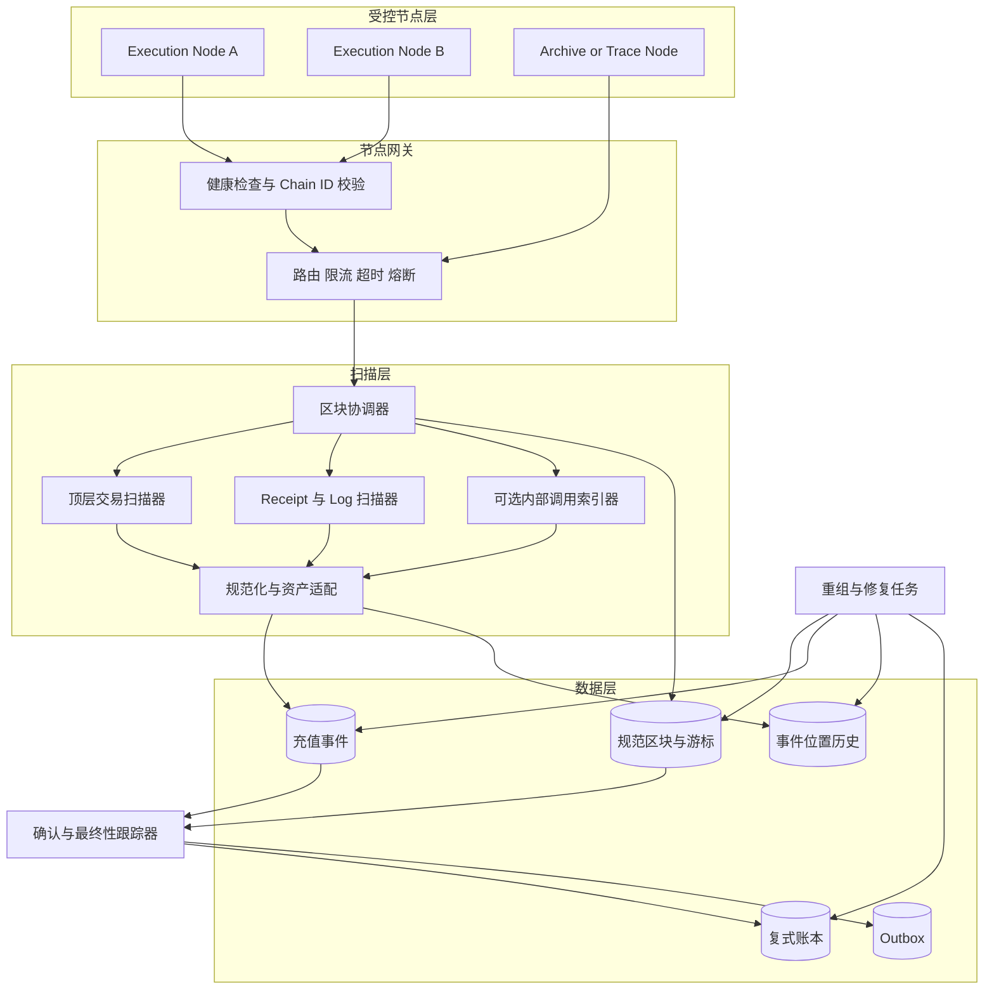
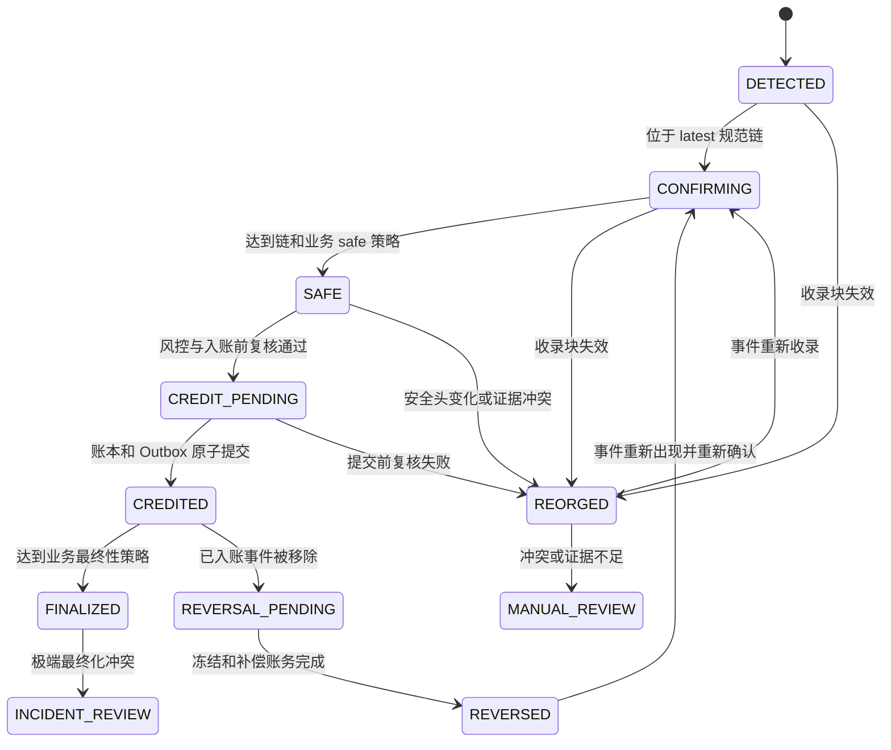
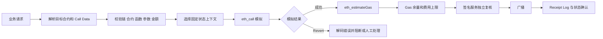

# Day 08：EVM 扫链、确认与合约交互异常

> 学习目标：掌握 EVM 区块、交易与 Event Log 三类扫描方式，能够设计原生 ETH 与 ERC-20 的统一充值流水线；理解 `latest`、`safe`、`finalized`、链重组和业务最终性的边界；能够模拟合约调用、估算 Gas、解码 Revert Data，并处理代理合约、内部调用、节点裁剪和 RPC 故障。  
> 建议用时：4～5 小时  
> 完成标准：仅使用 Sepolia、本地开发链或确定性测试夹具，画出统一扫描架构与充值状态机，写出重组回滚伪代码，整理不少于 8 种 RPC 异常及降级策略，并闭卷回答文末恰好 6 道面试题。

## 安全边界

- 实践只使用 Sepolia、本地 Anvil/Hardhat 和无价值测试数据；不连接生产签名服务，不提交私钥、助记词、API Key 或生产地址映射。
- 区块浏览器和第三方索引器只能辅助观察、告警和人工复核，不能成为资金入账、重组恢复或账本对账的唯一事实来源。
- `eth_call`、`eth_estimateGas` 和 Trace 是特定节点、特定区块上下文中的模拟结果，不是执行承诺；模拟成功不能绕过签名策略、风控、费用上限和 Receipt 校验。
- Token 必须按 `chainId + contractAddress` 匹配版本化白名单；不能按名称、symbol、Topic 或浏览器标签认币。
- 所有金额、Gas、区块高度和 Log Index 使用整数；Java 使用 `BigInteger`，禁止用 `double` 参与资金计算。
- 调试和 Trace API 开销大且可能暴露调用数据，应使用独立节点池、最小权限、限流、超时和审计，不能直接暴露给公网。

---

## 一、三种扫描方式

### 1. 区块扫描

区块扫描按高度读取规范链区块，核心调用通常是：

```text
eth_getBlockByNumber(height, true)
eth_getTransactionReceipt(txHash)
```

也可先取只含交易哈希的区块，再批量查询交易和 Receipt。生产系统必须保存高度和哈希，并验证父子连续性：

```text
newBlock.parentHash == cursor.lastBlockHash
```

**优点：**

- 能建立完整、连续、可重放的链视图；
- 同时发现原生 ETH 顶层交易、合约交易和区块元数据；
- 容易按高度做断点恢复、确认计算和重组检测；
- 可将区块、交易、Receipt 和 Log 放入统一事务边界。

**缺点：**

- 区块交易多时 Receipt RPC 数量和响应体较大；
- 普通区块数据看不到合约内部 ETH 转移；
- 需要自己维护游标、批量、限流、重试和重组窗口；
- 不同客户端的批量 RPC、Receipt 扩展方法和性能能力不同。

### 2. 交易扫描

交易扫描遍历区块中的顶层交易，根据 `to/value/input/from` 和 Receipt 判断业务。它适合识别：

- EOA 到 EOA 的原生 ETH 转账；
- EOA 向合约发送 ETH 的顶层转账；
- 提币交易、nonce 和费用状态；
- 需要进一步解析的合约调用候选。

它不能仅凭交易字段可靠识别：

- 合约内部通过 `CALL` 发送的 ETH；
- Router 或多签内部触发的 ERC-20 转移；
- 一笔交易中的多次内部价值流；
- 合约创建、`SELFDESTRUCT` 等历史或特殊价值变化的完整业务含义；
- Token 最终到账结果。

顶层 `tx.value > 0` 也不一定是充值。若 `to` 是交易所控制的合约，合约可能 Revert、退款或按业务规则分配资金，必须结合 Receipt、合约语义和必要的 Trace。

### 3. Event Log 扫描

Log 扫描通常调用：

```text
eth_getLogs({
  fromBlock,
  toBlock,
  address,
  topics
})
```

也可从逐笔 Receipt 中读取 `logs`。它适合 ERC-20 `Transfer`、业务合约存款事件等经过审批的事件模型。

**优点：**

- 可以按合约地址和 Topic 过滤，数据量通常小于遍历所有交易；
- Log 自带 `transactionHash`、`blockHash`、`blockNumber`、`logIndex`，便于定位与幂等；
- 能发现内部合约调用最终产生的事件，不依赖顶层 Call Data；
- 同一交易中的多个 Token 转移可以分别识别。

**缺点：**

- 只能看到合约主动发出的 Log，看不到没有事件的状态变化或内部 ETH 转移；
- 恶意合约可以伪造相同 Topic，必须校验 `log.address`；
- RPC 提供方常限制区块范围、地址数、Topic 数或结果数量；
- 重组后 Log 可能被移除、换块重现或永久消失；
- 非标准 Token、代理升级和错误事件实现需要专用适配。

### 4. 三种方式对比

| 维度 | 区块扫描 | 顶层交易扫描 | Event Log 扫描 |
|---|---|---|---|
| 数据范围 | 区块、交易及关联 Receipt | 顶层交易 | 合约日志 |
| 原生 ETH 顶层充值 | 支持 | 支持 | 通常不支持 |
| ERC-20 充值 | 需解析 Receipt Logs | 仅看 Call Data 不可靠 | 主要方式 |
| 内部 ETH 转移 | 普通区块数据不支持 | 不支持 | 除非业务合约发专用事件，否则不支持 |
| 内部 Token 转移 | 通过 Receipt Log 支持 | 不支持 | 支持 |
| 重组检测 | 最适合，天然维护高度/hash | 依赖所属区块 | 依赖 blockHash 和统一区块游标 |
| 数据量 | 最大 | 中等 | 可过滤，通常较小 |
| 可重放性 | 高 | 依赖区块范围 | 高，但受节点历史 Log 能力限制 |
| 主要风险 | RPC 压力、Receipt 数量 | 漏内部调用、错把意图当结果 | 漏事件、假事件、范围限制 |

生产推荐以**区块游标和规范块索引作为主骨架**：

- 对每个区块扫描顶层交易，识别原生 ETH 候选；
- 从 Receipt 或分块 `eth_getLogs` 识别 ERC-20；
- 对明确支持内部 ETH 充值的业务，使用专用 Trace/索引器并单独定义事件身份；
- 三条路径统一进入标准化充值事件、确认、幂等账本和重组恢复层。

---

## 二、统一充值扫描架构

### 1. 总体架构



### 2. 组件职责

| 组件 | 核心职责 | 不应承担 |
|---|---|---|
| 节点网关 | Chain ID 校验、健康路由、超时、限流、响应验证、节点隔离 | 不决定用户归属或直接入账 |
| 区块协调器 | 按高度获取区块，验证 `hash/parentHash`，原子推进游标 | 不根据一次 WebSocket 通知跳高度 |
| 顶层交易扫描器 | 识别原生 ETH 顶层价值转移，关联 Receipt | 不推断内部 ETH 转移 |
| Log 扫描器 | 获取 Receipt Logs 或分段 `eth_getLogs` | 不按 Topic 单独认币 |
| 资产适配器 | 校验合约、ABI、金额、非标准资产规则 | 不动态信任未审批合约 |
| 内部调用索引器 | 对明确支持的内部 ETH 场景生成稳定事件 | 不默认把所有 Trace 都当充值 |
| 确认跟踪器 | 基于当前规范链、`safe/finalized` 和策略快照推进状态 | 不把 `latest` 等同最终 |
| 账本与 Outbox | 原子入账并可靠发布业务事件 | 不覆盖历史流水或依赖 MQ 恰好一次 |
| 重组修复任务 | 找共同祖先、失效旧分支、重放新分支、补偿账务 | 不删除旧记录或静默改余额 |

### 3. 统一标准化事件

原生 ETH 与 ERC-20 可共享确认和账务流程，但链上身份不同：

```text
NormalizedDepositEvent
- chain_id
- asset_type                 NATIVE / ERC20 / INTERNAL_NATIVE
- asset_id                   native 或 token contract
- tx_hash
- event_index                顶层原生可固定 0；Log 使用 logIndex；Trace 使用稳定 trace identity
- from_address
- to_address
- raw_amount
- block_number
- block_hash
- tx_index
- receipt_status
- canonical
- finality_status
- required_policy_version
- address_registry_version
- asset_config_version
- status
```

推荐唯一键：

```text
原生 ETH 顶层充值：  (chainId, NATIVE, txHash)
ERC-20 充值：         (chainId, tokenAddress, txHash, logIndex)
内部 ETH 转移：       (chainId, NATIVE_INTERNAL, txHash, stableTraceIdentity)
```

不能强行把所有充值都简化成 `chainId + txHash`。一笔交易可能包含多个 Token Log 或多个内部转移。

### 4. 每块原子提交

外部 RPC 在数据库事务外完成，完整验证后再开启短事务：

```text
function scanOneHeight(expectedHeight):
    cursor = loadCursor()
    assert cursor.nextHeight == expectedHeight

    block = gateway.getBlockByNumber(expectedHeight, fullTransactions=true)
    receipts = gateway.getAndValidateReceipts(block.transactions)
    logs = obtainLogsFromReceiptsOrCrossCheckedGetLogs(block)

    validate block.number == expectedHeight
    validate block.parentHash == cursor.lastBlockHash
    validate every receipt.blockHash == block.hash
    validate every receipt.transactionHash belongs to block

    nativeEvents = detectTopLevelNativeDeposits(block, receipts)
    tokenEvents = detectApprovedTokenLogs(logs)
    allEvents = normalize(nativeEvents + tokenEvents)

    begin transaction
        locked = selectCursorForUpdate()
        if locked.version != cursor.version:
            rollback and retry
        assert locked.nextHeight == block.number
        assert locked.lastBlockHash == block.parentHash

        upsertCanonicalBlock(block)
        for event in allEvents:
            upsertDepositEventIdempotently(event)
            appendLocationHistoryIfChanged(event)
        advanceCursor(block.number + 1, block.hash)
    commit
```

提交前崩溃时，区块、事件和游标全部回滚；提交成功后崩溃时，重启读取新游标。重复扫描由区块哈希、充值唯一键和状态条件更新变成无害重复。

---

## 三、`latest`、`safe`、`finalized` 与确认策略

### 1. 三种标签

| 标签 | 一般含义 | 适合用途 | 风险边界 |
|---|---|---|---|
| `latest` | 节点当前规范链头 | 低延迟发现、展示、扫描追赶 | 可能短重组，不代表最终 |
| `safe` | 共识认为在正常假设下安全的区块 | 中等强度确认策略、风险分层 | 不是所有 EVM 链/RPC 都实现相同语义 |
| `finalized` | 共识已最终化的区块 | 高价值业务最终性参考、检查点 | 极端共识故障仍有治理风险；L2 语义不同 |
| `pending` | 节点本地待执行视图 | 费用/nonce 观察 | 非规范区块，不用于充值入账 |
| `earliest` | 节点可表示的最早状态语义标签 | 特殊查询 | 不保证节点保留所有历史状态 |

Ethereum PoS 中，`safe` 和 `finalized` 由共识层提供更强保证；执行客户端通常通过 Engine API/共识客户端获知这些头。扫描器仍应记录具体 `number/hash`，不能只保存标签名称。

### 2. 确认数与最终性

若事件收录于当前规范链高度 $h$，当前观察头高度为 $H$：

$$
\text{confirmations}=H-h+1
$$

确认数是深度，`safe/finalized` 是共识状态。二者不是完全等价：

- 交易所可要求“至少 N 个块且已 safe”；
- 大额充值可要求 finalized 加人工/风控审核；
- 节点出现分歧、扫描 lag 或 finalized 停滞时，即使确认数增长也可暂停入账；
- 每笔充值保存 `policyVersion` 和门槛快照，避免配置变化静默改变在途资金。

### 3. 不同 EVM 链的差异

不能把 Ethereum 主网的最终性语义直接复制给所有 EVM 网络：

- 部分侧链使用不同共识、验证者集合和重组特性；
- 部分 RPC 对 `safe/finalized` 返回与 `latest` 相同、返回错误或不支持；
- Optimistic Rollup 的 L2 区块、提交到 L1、挑战窗口和提款最终性是不同层次；
- ZK Rollup 的批次发布、证明验证和 L1 最终化也不是简单按 L2 块数判断；
- 跨链桥还增加源链最终性、消息证明、目标链执行和桥合约风险。

每条链必须配置并验证：共识模型、标签支持、平均出块、典型/最大重组、L1 数据可用性、排序器故障、提款最终性和暂停策略。

### 4. 节点标签能力探测

启动或定时检查：

```text
latest    = eth_getBlockByNumber("latest", false)
safe      = eth_getBlockByNumber("safe", false)
finalized = eth_getBlockByNumber("finalized", false)

assert hashes and heights are internally consistent
assert finalized.height <= safe.height <= latest.height
assert each returned block is ancestor-compatible
```

若标签不支持或关系异常，不能悄悄回退成 `latest` 并继续高价值入账。应标记节点能力不足，路由到合适节点，或按该链经过审批的确认数策略安全降级并告警。

---

## 四、链重组与充值回滚

### 1. 重组检测

常见信号：

- 新块 `parentHash != cursor.lastBlockHash`；
- 重启后 `eth_getBlockByNumber(lastHeight).hash != cursor.lastBlockHash`；
- 已存规范高度对应的节点哈希发生变化；
- Receipt/Log 的 `blockHash` 不再等于当前规范链同高度哈希；
- WebSocket Log 通知带 `removed=true`；
- 多节点对相同高度/hash 或 `safe/finalized` 头产生持续分歧。

`removed=true` 只是通知信号，不是唯一恢复机制。订阅可能断线、漏消息或切节点，最终仍要按高度/hash 回查并重放。

### 2. 寻找共同祖先

```text
function findCommonAncestor(localTip, node):
    height = localTip.height
    localHash = localTip.hash

    while height >= retainedWindow.lowestHeight:
        nodeBlock = node.getBlockByNumber(height)
        localBlock = loadBlockByHash(localHash)

        if nodeBlock.hash == localHash:
            return localBlock

        if localBlock is null:
            break

        localHash = localBlock.parentHash
        height = height - 1

    raise DeepReorgRequiresCheckpointRescan
```

应沿旧分支自己的 `parentHash` 后退，而不是只按高度覆盖记录。若超过自动处理深度、窗口不足或节点证据不一致，暂停相关入账，从更早可信检查点使用历史数据完整的节点重扫。

### 3. 旧分支下降与新分支上升

```text
function handleReorg(oldTip, observedNewBlock):
    pauseCreditsForAffectedRange()
    ancestor = findCommonAncestor(oldTip, selectedHealthyNode)

    for height from oldTip.height downTo ancestor.height + 1:
        begin transaction
            oldBlock = selectCanonicalBlockForUpdate(height)
            mark oldBlock canonical=false, status=STALE

            for event in eventsAtBlockHash(oldBlock.hash):
                appendLocationHistory(event, oldBlock, REORG_REMOVED)
                mark event canonical=false

                if event.status in (DETECTED, CONFIRMING, CREDIT_PENDING):
                    set event.status=REORGED
                else if event.status == CREDITED:
                    set event.status=REVERSAL_PENDING
                    createIdempotentRiskHold(event)
                    createControlledReversalTask(event)

            moveCursorBackTo(height, oldBlock.parentHash)
        commit

    for height from ancestor.height + 1 to healthyNode.latest.height:
        block = fetchAndValidate(height)
        scanOneBlockAtomically(block)

    reconcileBlocksDepositsLedgerAndOutbox()
    resumeCreditsOnlyAfterHealthChecksPass()
```

### 4. Log 被移除后的处理

对 ERC-20 Log：

1. 不删除原 Log 或充值记录，标记 `canonical=false/REORGED` 并保留位置历史；
2. 入账前移除：取消确认资格，不生成账本流水；
3. 已入账移除：立即限制受影响可用资金，追加幂等补偿账务，不覆盖原流水；
4. 同一 `(chainId, token, txHash, logIndex)` 在新规范块重现：更新当前位置并重新确认，不重复入账；
5. 同交易在新执行中 Log 顺序或内容改变：按新事件身份处理，并将旧事件保持为已移除；不能假定 `logIndex` 永远不变；
6. 用户已转出导致无法完整冲正：进入 deficit/应收或风险损失科目，冻结提现并人工处置；
7. 修复后对 Token 余额、充值事件、账本和用户可用余额做完整对账。

### 5. 充值状态机



“业务最终性”并不意味着删除重组处理代码。极端共识故障、链治理回滚、L2/桥故障仍需事故流程，只是处理权限和严重级别更高。

---

## 五、合约调用模拟

### 1. `eth_call`

`eth_call` 在节点指定状态上本地执行消息调用，不产生交易、不消耗真实 ETH，也不改变链上状态。请求可包含：

```text
from, to, gas, gasPrice 或 EIP-1559 fee 字段, value, data
block tag 或 EIP-1898 blockHash 上下文
state override（仅部分客户端支持）
```

模拟目的：

- 提前发现余额不足、授权不足、黑名单、暂停、滑点、deadline 和业务 require；
- 获取 view 函数返回值；
- 验证 Call Data 与目标合约是否可执行；
- 在失败时取得 Revert Data；
- 辅助签名策略展示预期合约动作。

模拟限制：

- 模拟到真正入块之间，余额、allowance、价格、nonce、时间和合约实现可能变化；
- `block.timestamp`、`block.number`、Base Fee、预言机和 MEV 顺序可能不同；
- pending 上下文是节点本地视图；
- 代理合约可能升级；
- 模拟请求的 `from/value` 若与真实交易不同，结果无意义；
- 模拟成功不能证明业务授权、安全或最终成功。

### 2. 使用固定区块上下文

排查历史失败时应尽量指定原交易的收录区块或前一状态，并记录 `blockHash`。只用当前 `latest` 重放可能得到不同结果。

EIP-1898 支持用区块哈希引用状态的客户端可减少“同高度重组后查询到另一块”的歧义。节点若已裁剪历史状态，即使保留区块头和 Receipt，也可能无法在旧状态执行 `eth_call`。

### 3. 调用前安全流程



---

## 六、Gas Estimation

### 1. `eth_estimateGas` 做什么

`eth_estimateGas` 在节点当前指定状态中模拟调用，搜索一个预计足以执行的 Gas 上限。它返回的是估算值，不是协议保证，也不是最终 `gasUsed`。

必须尽量传入与真实交易一致的：

```text
from, to, value, data, accessList, fee fields
```

若遗漏 `from`，授权、余额、白名单和合约分支可能不同；遗漏 `value` 可能改变 payable 逻辑；错误的 pending/latest 上下文也会改变结果。

### 2. 估算失败分类

| 现象 | 可能原因 | 安全处理 |
|---|---|---|
| 返回 Revert Data | 合约 require/custom error/权限失败 | 解码错误，修正业务参数或拒绝 |
| intrinsic gas too low | 基础交易 Gas 或请求字段错误 | 检查 data、创建交易和客户端参数 |
| insufficient funds | `from` 无法覆盖 value/费用上界 | 核实真实发送方余额和预留 |
| allowance/balance 不足 | Token 状态不满足 | 不盲目加 Gas，修正授权或余额 |
| execution timeout | 合约路径复杂或节点过载 | 切专用模拟节点、限流，禁止无限超时 |
| cap exceeded | 提供方/客户端设置 Gas 上限 | 检查调用复杂度和服务策略 |
| 历史状态缺失 | 节点裁剪旧状态 | 路由归档节点或使用保留快照 |

### 3. 安全余量

实际 `gasLimit` 可在估算值上加经过回测的安全余量，但同时必须有：

- 调用类型的绝对 Gas 上限；
- `gasLimit × maxFeePerGas` 的绝对费用上限；
- 合约/函数历史 `estimateGas / gasUsed` 偏差监控；
- 代理升级后重新基线；
- 估算异常倍数时阻断而不是自动无限放大。

对于状态可能快速变化的调用，余量只能缓解执行路径 Gas 波动，不能解决授权、余额、滑点或 deadline 失败。

---

## 七、Revert Reason 解码

### 1. 三种常见格式

| 类型 | 4 字节选择器 | 后续数据 |
|---|---|---|
| `Error(string)` | `0x08c379a0` | ABI 编码字符串 |
| `Panic(uint256)` | `0x4e487b71` | 32 字节 Panic code |
| Custom Error | `first4Bytes(keccak256("ErrorName(types)"))` | 按错误 ABI 编码参数 |

`Error(string)` 布局概念：

```text
0x08c379a0
000...020        动态字符串偏移
000...00d        字符串字节长度
4e6f7420616c6c6f776564...  UTF-8 内容及补齐
```

常见 Panic code 示例：

| Code | 常见含义 |
|---:|---|
| `0x01` | `assert(false)` 等内部错误 |
| `0x11` | 算术上溢/下溢（非 unchecked） |
| `0x12` | 除零或模零 |
| `0x21` | 非法 enum 转换 |
| `0x31` | 对空数组 `pop()` |
| `0x32` | 数组或 bytes 越界 |
| `0x41` | 内存分配过大 |
| `0x51` | 调用未初始化内部函数指针 |

### 2. 解码流程

```text
function decodeRevert(data, approvedAbi):
    if data is null or byteLength(data) < 4:
        return UnknownOrEmptyRevert

    selector = first4Bytes(data)
    payload = bytesAfterFirst4(data)

    if selector == 0x08c379a0:
        return decodeBoundedAbiString(payload)
    if selector == 0x4e487b71:
        return decodePanicCode(payload)
    if selector in approvedAbi.customErrors:
        return decodeCustomError(selector, payload, approvedAbi)

    return UnknownCustomError(selector, hash(payload))
```

安全要求：

- 校验 Hex、字节长度、动态偏移和最大字符串长度；
- Custom Error 必须使用目标实现合约经过审批的 ABI；
- 选择器可能碰撞，不能仅凭 4 字节猜错误名；
- 日志默认记录选择器、分类和受限摘要，避免泄露敏感参数；
- 用户可见错误应映射为受控业务文案，不能原样信任恶意合约字符串。

### 3. Receipt 为什么没有 Revert Reason

Receipt 记录执行状态、Gas 和 Logs，通常不直接保存返回/Revert Data。获取历史原因常用：

1. 在合适历史状态上下文用相同 `from/to/value/data` 执行 `eth_call`；
2. 使用 `debug_traceTransaction` 或客户端 Trace API；
3. 使用已保存的广播前模拟证据辅助，但不能假设与链上完全相同。

重放区块选择需要谨慎。原交易执行依赖它之前同块交易产生的状态，仅在前一区块状态执行可能无法复现；Trace 通常更接近真实执行，但需要支持历史状态的节点并消耗大量资源。

---

## 八、代理合约、事件缺失与内部调用

### 1. 代理合约

代理通常保存状态，通过 `delegatecall` 执行实现合约代码。扫描和签名策略需要区分：

```text
交易/Log 地址：通常是 Proxy 地址
代码语义/ABI：来自当前 Implementation
状态存储：位于 Proxy
升级权限：ProxyAdmin、管理员、多签或治理
```

风险：

- 实现升级后同一选择器语义改变；
- ABI 与当前实现不匹配导致解码错误；
- 管理员可加入黑名单、费用、暂停或盗取逻辑；
- 只对白名单实现地址过滤 Log 会漏掉 Proxy 发出的 Log；
- Beacon、UUPS、Transparent、Diamond 等模式的解析方式不同。

生产应白名单业务交互地址（通常为 Proxy），同时记录和监控实现、管理员、Beacon/Facet 和升级事件。升级后暂停高风险自动操作，重新模拟、解析和安全评审。

### 2. 事件缺失

合约状态变化不保证产生事件：

- 开发者可能忘记 `emit`；
- 非标准 Token 可能不按预期发 Log；
- Revert 会撤销当前调用链产生的 Logs；
- Rebase 可改变大量余额而没有逐地址 Transfer；
- 内部 ETH 转移没有协议级统一 `Transfer` Event。

若资产无法通过稳定、可信、可对账的事件识别充值，应使用明确的专用索引策略，或拒绝自动充值。不能仅为“兼容”而通过不受控 Trace 猜测资产变化。

### 3. 内部调用与 Trace

内部调用不是独立交易，没有独立交易哈希。Trace 可展示调用树中的：

- `CALL`、`STATICCALL`、`DELEGATECALL`、`CREATE/CREATE2`；
- from/to/value/input/output；
- 每层成功、Revert 和 Gas；
- 客户端特有的 trace path 或 call frame。

Trace API 非核心 JSON-RPC 标准的统一数据模型，不同客户端可能提供 `debug_traceTransaction`、`trace_transaction` 等不同格式。若用于资金识别，必须：

- 固定客户端和规范化版本；
- 定义稳定事件身份，例如交易哈希加调用树路径，并测试重放稳定性；
- 只接受成功且未被父调用回滚的价值转移；
- 处理重组、合约创建和特殊价值变化；
- 用地址余额、业务事件和账本独立对账；
- 将 Trace 节点与主扫描节点隔离，实施容量保护。

更安全的工程选择通常是：只支持顶层 ETH 充值地址；若业务必须支持合约内部充值，要求受控存款合约发出专用事件，而不是依赖任意调用树。

---

## 九、普通全节点、归档节点与索引服务

### 1. 概念边界

| 能力 | 普通全节点 | 归档节点 | 索引服务/数据库 |
|---|---|---|---|
| 验证区块与当前状态 | 是 | 是 | 通常否，依赖上游 |
| 当前区块、交易、Receipt | 是 | 是 | 通常是 |
| 历史区块与 Receipt | 通常保留，但依客户端/配置 | 是 | 按索引范围 |
| 任意历史高度状态查询 | 不保证，状态可能裁剪 | 核心能力 | 若预先索引则可提供 |
| 历史 `eth_call`/余额 | 旧状态可能失败 | 支持范围更完整 | 取决于索引内容 |
| Trace 历史交易 | 取决于状态、客户端和配置 | 更适合但成本高 | 可预计算 |
| 资金事实权威 | 可作为独立验证源 | 可作为历史验证源 | 不能脱离节点验证 |
| 成本 | 相对低 | 磁盘、同步和运维成本高 | 开发、存储和一致性成本 |

“全节点”表示验证链，不等于保存每个历史状态。“归档”通常指保存历史状态，使任意历史高度的状态查询和重放更可行。具体保留能力仍依客户端、同步模式和配置验证。

### 2. 使用场景

普通全节点适合：

- 实时按块扫描；
- 当前和近期交易、Receipt、Logs 查询；
- 广播、nonce、余额和费用估算；
- 独立验证链头和规范块。

归档节点适合：

- 很久以前高度的 `eth_getBalance`、`eth_getStorageAt`、`eth_getCode`；
- 历史 `eth_call` 和复杂 Trace；
- 深度重扫、审计、事故取证和状态差异分析；
- 代理历史实现与存储调查。

索引服务适合：

- 按地址、Topic、Token、用户和业务维度快速查询；
- 聚合统计、搜索、报表和 API；
- 预计算内部调用、Token 余额和事件关系。

索引服务必须能从链游标重建，并通过规范块哈希、节点查询和账本对账验证。不能因为查询快就替代共识验证节点。

---

## 十、RPC 异常与降级策略

| 异常 | 检测信号 | 风险 | 安全降级/恢复 |
|---|---|---|---|
| 超时或连接断开 | timeout、socket reset | 结果未知、扫描停滞 | 有界指数退避加抖动，换健康节点；不推进游标 |
| HTTP 429/限流 | 状态码或供应商错误 | 重试风暴、lag 增长 | 降低并发、缩小批次、令牌桶、切备用池并告警 |
| JSON-RPC 错误 | `error.code/message/data` | 请求非法或节点内部失败 | 按方法分类，不把所有错误重试；保留脱敏证据 |
| 响应 ID/结构不匹配 | ID 错、字段类型/长度异常 | 错配响应或恶意数据 | 丢弃响应、隔离节点，不写库 |
| 错误 Chain ID | `eth_chainId` 与配置不同 | 跨链污染和错签 | 立即隔离，暂停该路由和资金操作 |
| 节点落后 | tip freshness、height lag | 漏最新事件、错误确认数 | 只允许安全历史读或隔离，切同步节点 |
| 同高度哈希分歧 | 多节点 hash 不同 | 重组、分区或错误节点 | 比较祖先、safe/finalized 和健康；暂停不确定范围入账 |
| Receipt 暂缺 | 交易在区块但 Receipt null/批量不完整 | 区块数据不一致或节点未就绪 | 重试同节点后跨节点复核；整块不提交 |
| Log 范围过大 | too many results/range limit | 漏 Log 或查询失败 | 自适应二分区块范围，结果按 blockHash 复核 |
| WebSocket 断线 | heartbeat/订阅中断 | 漏通知 | 通知只唤醒；按数据库游标轮询补扫 |
| `safe/finalized` 不支持 | method/tag error 或返回异常 | 误把 latest 当最终 | 标记能力不足，切支持节点或使用审批后的链策略 |
| 历史状态缺失 | missing trie node/state unavailable | 无法历史 call/trace | 路由归档节点；不伪造结果或用当前状态替代 |
| Trace 超时/资源耗尽 | timeout、OOM、CPU 高 | 拖垮主节点 | 独立 Trace 池、并发上限、任务队列和熔断 |
| `eth_estimateGas` Revert | error data 含 Revert | 业务调用会失败或状态不符 | 解码并阻断；不通过无限提高 Gas 绕过 |
| 节点返回无效 Log | blockHash/txHash 不一致 | 假充值或索引损坏 | 与区块和 Receipt 交叉验证，隔离并重扫 |
| 数据库提交不确定 | connection lost during commit | 重复或漏处理 | 重启读取数据库游标与唯一键，不凭内存判断 |

### 1. 节点选择原则

- 读区块、读历史、模拟、Trace 和广播可使用不同节点池；
- 节点应跨故障域、供应商和网络路径，避免“多节点”共享同一上游；
- 不能简单多数投票。先验证 Chain ID、同步状态、祖先关系、标签和响应合法性；
- 证据不足时暂停最终入账，而不是猜一个资金事实；
- 重试预算必须分方法和业务等级，防止 RPC 故障放大成数据库和线程池故障。

### 2. `eth_getLogs` 自适应分片

```text
function scanLogs(from, to, filter):
    try:
        logs = rpc.getLogs(from, to, filter)
        validateEveryLog(logs)
        return logs
    catch RangeTooLarge or TooManyResults:
        if from == to:
            fallbackToReceiptsForSingleBlock(from)
        mid = floor((from + to) / 2)
        return scanLogs(from, mid, filter)
             + scanLogs(mid + 1, to, filter)
```

结果必须排序并按事件唯一键去重。分片只是查询策略，扫描游标仍按完整区块原子提交，不能某一半失败却推进整个范围。

---

## 十一、数据模型、监控与修复

### 1. 核心表

| 表 | 关键字段 | 唯一约束/用途 |
|---|---|---|
| `evm_scan_cursor` | `chain_id, scanner, next_height, last_height, last_hash, version` | `UNIQUE(chain_id, scanner)`；恢复和并发控制 |
| `evm_block` | `chain_id, height, hash, parent_hash, timestamp, canonical, finality` | hash 唯一；当前规范高度唯一 |
| `deposit_event` | 标准化事件字段、策略和配置版本、状态 | 按资产类型定义事件唯一键 |
| `deposit_location_history` | `event_id, block_hash, height, action, observed_at` | 保留收录、移除和重现历史 |
| `ledger_entry` | 复式分录、reference、idempotency key | 入账与冲正均不可变且唯一 |
| `outbox_event` | 事件、payload version、status、attempts | 与业务事务原子写入，至少一次发布 |
| `rpc_observation` | 节点、方法、块高/hash、错误分类、延迟 | 脱敏诊断与节点质量评估 |

### 2. 关键指标

- `latest/safe/finalized` 高度、哈希、新鲜度与相互 lag；
- scanner tip、cursor age、blocks/sec、scanner lag；
- 区块父哈希不连续、重组次数和深度；
- 每块交易、Receipt、Log 数量及不匹配数；
- 原生币和 Token 充值发现、确认、入账延迟；
- `removed/reorged/reversed/manual_review` 数量与金额；
- RPC P50/P95/P99 延迟、超时、429、错误分类和节点隔离数；
- `eth_getLogs` 分片次数、结果上限和重复率；
- 模拟成功率、Revert 分类、估算与实际 Gas 偏差；
- Trace 队列、CPU、超时和拒绝任务数；
- 代理实现/管理员变化、Token 暂停和异常事件；
- 链上事件、充值记录、账本与地址余额对账差异。

### 3. 历史修复流程

1. 选择链、起止高度、可信检查点和任务 ID，经审批后冻结受影响范围入账；
2. 从健康节点按高度/hash 重建临时规范块索引；
3. 重新读取交易、Receipt 和 Logs，必要时路由归档/Trace 节点；
4. 与现有区块、充值事件、位置历史和账本生成差异报告；
5. 缺失事件走正常幂等发现；旧分支事件走重组流程；冲突进入人工复核；
6. 账务修复只追加带审批和幂等键的补偿流水，不覆盖原记录；
7. 完成链、充值、账本、Outbox 和余额对账后，才恢复自动入账。

---

## 十二、实践故障场景

### 场景 1：重复扫描

同一高度因任务重试处理两次。预期：游标版本、区块哈希和充值唯一键使第二次成为无害重复，不产生第二笔账本和 Outbox。

### 场景 2：一块短重组

充值处于 `CONFIRMING`，收录块被替换。预期：检测父哈希断裂，旧块标 stale，充值标 `REORGED`；新分支重放后若事件重现，则重新确认。

### 场景 3：已入账 Log 被移除

预期：立即 risk hold，创建唯一补偿任务并追加复式冲正；用户已花费时进入 deficit/manual 状态，不删除原流水。

### 场景 4：`eth_getLogs` 结果过多

预期：按区块范围二分，单块仍超限时从 Receipt 获取；任何子范围失败都不推进完整游标。

### 场景 5：节点落后但响应正常

预期：根据 tip freshness、safe/finalized lag 和其他节点对比将其降级；不得使用其高度计算“已确认”。

### 场景 6：模拟成功、链上 Revert

在模拟后、入块前 allowance 被另一笔交易消耗。预期：Receipt `status=0`，记录实际 Gas 和 Revert/Trace 证据，不把模拟成功当付款成功，也不无限自动重试。

### 场景 7：历史状态被裁剪

普通节点可返回旧 Receipt，但历史 `eth_call` 报 state unavailable。预期：路由归档节点；若仍无证据，保留未知原因，不用当前 `latest` 结果伪装历史结果。

### 场景 8：代理实现升级

扫描中发现 Token Proxy 实现地址变化。预期：告警并按资产策略暂停高风险自动操作，重新校验 ABI、事件、返回值、权限和归集流程后再恢复。

### 场景 9：假 Token 相同 Topic

攻击合约向交易所地址发标准 Transfer Log。预期：因 `log.address` 不在 `chainId + contractAddress` 白名单而拒绝入账，并记录未知资产指标。

### 场景 10：数据库提交响应丢失

数据库已提交区块和游标，但应用收到连接断开。预期：重启查询持久化游标，不根据异常猜提交失败；唯一约束保证重试安全。

---

## 十三、口头面试题参考答案

> 本节严格包含计划中的 6 道题。先闭卷口述，再按“结论 → 原理 → 生产实现 → 异常与风险 → 监控和恢复”补全。

### 1. 交易扫描和 Event Log 扫描各有什么优缺点？

**参考回答：**

交易扫描能遍历顶层 `from/to/value/input`，适合识别普通原生 ETH 转账、nonce、费用和合约调用入口；配合按高度区块游标，恢复和重组检测清晰。但它看不到合约内部 ETH 转移，也不能仅靠 Call Data 判断 ERC-20 最终到账。

Log 扫描可按合约和 Topic 过滤，能看到内部调用最终产生的 Token 事件，一笔交易多次转账也能分别识别；缺点是合约可能不发事件、发非标准事件或伪造相同 Topic，RPC 还有范围和结果限制。生产以区块高度/hash为骨架，顶层交易扫原生币，受信合约 Log 扫 ERC-20，特殊内部转移使用专用事件或受控索引器。

### 2. 如何处理重组后被移除的 ERC-20 Log？

**参考回答：**

先通过父哈希断裂、同高度哈希变化、规范链回查或 `removed=true` 发现重组，再找到共同祖先。旧分支从高到低标记 stale，Log 和充值记录保留但设为 `canonical=false/REORGED`，不能删除审计记录；新分支从祖先后按高度重扫。

未入账事件停止确认。已入账事件先冻结受影响可用资金，再以唯一幂等键追加复式补偿流水；资金已转出则进入 deficit/manual 状态。同一事件在新规范链重现时更新位置并重新确认，不重复入账。最后对区块、Log、Token 余额、账本和 Outbox 做对账。

### 3. 为什么区块浏览器 API 不应成为资金系统的唯一数据源？

**参考回答：**

浏览器是第三方索引结果，不是共识验证接口。它可能延迟、漏数、限流、改变字段口径、缓存旧分支、错误解析代理或内部调用，也可能整体不可用；多个浏览器还可能共享同一上游，不能代表独立证据。

生产系统应运行或接入受控验证节点，按高度和哈希维护可重放游标，交叉校验 Receipt/Logs，并以数据库唯一约束和账本对账保证资金效果。浏览器适合人工观察、标签参考和故障佐证，但数据不一致时不能覆盖节点规范链与内部审计事实。

### 4. 合约调用前为什么要进行模拟？

**参考回答：**

模拟可在不广播、不改变状态的情况下提前发现 Revert、余额或 allowance 不足、黑名单、暂停、滑点、deadline 和错误参数，并辅助估算 Gas、解码错误和展示签名语义，从而减少失败交易和费用损失。

但 `eth_call` 只代表特定节点和区块上下文。真实入块前状态、时间、预言机、交易顺序和代理实现都可能变化，所以模拟成功不保证链上成功。生产应使用与真实交易一致的 `from/to/value/data`，记录 block context，之后仍执行签名策略、费用上限、Receipt/Log 校验和异常监控。

### 5. 如何解码 Revert Reason？

**参考回答：**

先取得 Revert Data，读取前 4 字节选择器。`0x08c379a0` 按 `Error(string)` 解码，`0x4e487b71` 按 `Panic(uint256)` 解码，其他选择器结合目标实现合约经过审批的 ABI 解析 Custom Error。必须校验长度、偏移和最大字符串大小，未知选择器保持未知，不能靠碰撞选择器猜名称。

Receipt 通常没有 Revert Data。历史失败可在正确状态上下文重放 `eth_call`，或使用受限的 Trace API；当前 latest 重放可能与当时状态不同。日志应脱敏，恶意合约返回的字符串不能未经处理直接展示或驱动账务。

### 6. 归档节点和普通全节点分别适合什么场景？

**参考回答：**

普通全节点验证区块和当前状态，适合实时扫描、近期区块/交易/Receipt/Logs、广播、余额和费用估算，但可能裁剪旧历史状态；能查旧区块不等于能在该高度执行 `eth_call`。

归档节点保存更完整的历史状态，适合任意历史高度余额、代码、存储、历史调用、Trace、深度重扫、审计和事故取证，代价是磁盘、同步和运维成本高。生产通常用普通节点承担实时主流量，归档/Trace 节点隔离处理历史和重任务；索引服务提高查询效率，但不能替代节点的共识验证和规范链事实。

---

## 十四、当天任务

### 任务 1：三种扫描方式（45 分钟）

- [ ] 画出区块、顶层交易、Receipt Log 三条数据路径。
- [ ] 列出原生 ETH、ERC-20、内部 ETH 分别需要什么证据。
- [ ] 解释为什么区块游标是统一恢复骨架。
- [ ] 为三类充值定义不冲突的唯一键。

### 任务 2：统一扫描与数据模型（60 分钟）

- [ ] 画出节点网关、扫描器、适配器、确认器、账本、Outbox 和修复任务。
- [ ] 写出单块 RPC 获取、校验和数据库原子提交伪代码。
- [ ] 设计游标、规范块、充值、位置历史和账本表。
- [ ] 推演提交前崩溃、提交后响应丢失和重复扫描。

### 任务 3：确认与重组（60 分钟）

- [ ] 比较 `latest`、`safe`、`finalized`，记录测试节点实际支持情况。
- [ ] 写出确认数公式和一份版本化业务确认策略。
- [ ] 用本地夹具构造两个共享祖先的短分支。
- [ ] 推演未入账、已入账和重新收录三类 Log。

### 任务 4：模拟与异常解码（45～60 分钟）

- [ ] 对本地合约执行成功和失败的 `eth_call`。
- [ ] 用真实 `from/to/value/data` 调用 `eth_estimateGas`，比较最终 `gasUsed`。
- [ ] 分别解码 `Error(string)`、`Panic(uint256)` 和一个 Custom Error。
- [ ] 推演模拟成功后状态变化导致链上 Revert。

### 任务 5：节点与 RPC 故障（45 分钟）

- [ ] 完成不少于 8 种 RPC 异常及降级策略表。
- [ ] 演练 `eth_getLogs` 范围过大后的二分查询。
- [ ] 比较普通、归档、Trace 节点和索引服务职责。
- [ ] 模拟两个节点同高度哈希不一致的排障流程。

### 任务 6：口头表达（30～45 分钟）

- [ ] 不看资料回答本节恰好 6 道题并录音。
- [ ] 用 8 分钟讲清统一充值扫描与短重组。
- [ ] 用 5 分钟讲清模拟、Gas 估算和 Revert 解码边界。
- [ ] 将薄弱点写入 `progress.md`。

---

## 十五、闭卷验收

- [ ] 能比较区块扫描、交易扫描和 Log 扫描的覆盖范围与风险。
- [ ] 能解释为什么普通区块数据看不到完整内部 ETH 转移。
- [ ] 能设计原生 ETH 与 ERC-20 的统一扫描骨架而不强行统一事件身份。
- [ ] 能写出每块原子提交、游标和幂等唯一键。
- [ ] 能准确区分 `latest`、`safe`、`finalized` 和业务最终性。
- [ ] 能说明不同 EVM 链和 L2 不能复制 Ethereum 主网确认策略。
- [ ] 能检测重组、寻找共同祖先、旧分支下降和新分支上升。
- [ ] 能处理未入账、已入账、重新收录和冲突 Log。
- [ ] 能解释 `eth_call` 和 `eth_estimateGas` 的用途及非保证性。
- [ ] 能解码 `Error(string)`、Panic 和 Custom Error，并处理未知数据。
- [ ] 能解释代理地址、实现地址、存储和升级权限的关系。
- [ ] 能说明事件缺失和内部调用为何需要专用策略。
- [ ] 能比较普通全节点、归档节点、Trace 节点和索引服务。
- [ ] 能处理至少 8 种 RPC 异常并设计安全降级。
- [ ] 能列出扫描、最终性、RPC、重组、模拟和账本关键指标。
- [ ] 闭卷回答恰好 6 道面试题，覆盖异常、监控和恢复。

## 十六、Day 08 验收清单

- [ ] 实践仅使用 Sepolia、本地开发链或确定性夹具。
- [ ] 已完成 EVM 原生币与 ERC-20 统一充值扫描流程图。
- [ ] 已定义顶层原生、Token Log 和内部转移的独立事件身份。
- [ ] 已完成游标、规范块、充值事件、位置历史和账本设计。
- [ ] 已完成待确认、safe、入账、重组、冲正和最终状态机。
- [ ] 已推演一笔 ERC-20 Log 被移除和重新收录。
- [ ] 已执行合约模拟、Gas Estimation 和三类 Revert 解码。
- [ ] 已说明代理升级、事件缺失和内部调用边界。
- [ ] 已整理不少于 8 种 RPC 异常和降级策略。
- [ ] 已比较普通节点、归档节点和索引服务。
- [ ] 已录音回答 6 道题并更新薄弱项。
- [ ] Git 中没有私钥、助记词、API Key 或生产敏感数据。

## 十七、30 分自评分

| 能力 | 1 分 | 3 分 | 5 分 | 今日得分 |
|---|---|---|---|---|
| 扫描设计 | 只会查交易 | 能扫原生币和 Token Log | 能统一游标、事件身份、幂等和修复 |  |
| 确认与重组 | 只数区块 | 能处理短重组 | 能处理 safe/finalized、已入账冲正和链差异 |  |
| 合约模拟 | 只会调用 `eth_call` | 能估算 Gas 和解码 Error | 能处理历史上下文、代理变化和非保证性 |  |
| 节点能力 | 只依赖浏览器 | 能区分普通与归档节点 | 能设计多池路由、Trace 隔离和可信判断 |  |
| RPC 容灾 | 失败就重试 | 能分类超时、限流和范围错误 | 能做预算、降级、交叉验证和恢复对账 |  |
| 口头表达 | 回答零散 | 能讲清正常流程 | 能覆盖异常、安全、监控和取舍 |  |

**当日总分：** ____ / 30  
**测试网络与 Chain ID：** ______________________________  
**扫描检查点高度/哈希：** ______________________________  
**演练的 Revert 类型：** ______________________________  
**最薄弱的三个知识点：** 1. __________ 2. __________ 3. __________  
**明日优先补强：** ______________________________
