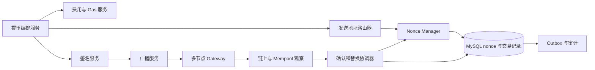
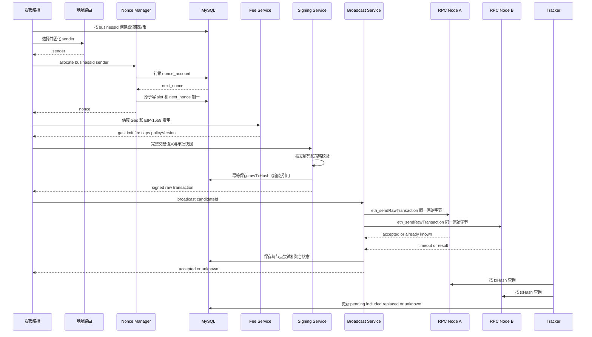
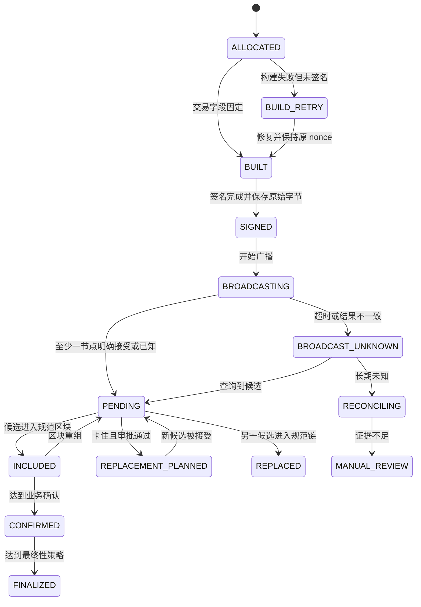

# Day 09：EVM nonce、提币并发与交易加速

> 学习目标：掌握 confirmed nonce、节点 pending nonce 与本地分配 nonce 的差异；能够设计多实例安全的 nonce 管理服务、单地址串行和多地址分片方案；能够处理 nonce gap、交易卡住、丢失、替换、取消、广播未知及服务重启恢复。  
> 建议用时：4～5 小时  
> 完成标准：仅使用 Sepolia、本地开发链或确定性夹具，画出 nonce 分配与广播时序图，设计核心表、唯一约束和状态机，推演 10 个并发提币及至少 8 种故障恢复，并闭卷回答文末恰好 7 道面试题。

## 安全边界

- 实践仅使用 Sepolia、本地 Anvil/Hardhat 和无价值测试账户；不使用主网私钥，不提交助记词、API Key、原始签名密钥或生产地址映射。
- nonce 是链上顺序资源，不是业务幂等键。每个提币仍必须有唯一 `businessId`，并与发送地址、nonce、交易候选和账务冻结绑定。
- 不依赖 Redis 锁、单次 `pending` 查询或节点 Mempool 作为资金正确性的最终依据；数据库事务、唯一约束和不可变签名记录必须兜底。
- 已签名交易可能已泄露或传播。锁过期、RPC 超时、单节点查不到和任务超时都不能自动释放 nonce 或重新付款。
- 加速或取消必须保持同一 `chainId + sender + nonce`，并重新经过业务审批、签名策略、费用上限和审计；“取消”只是竞争替换，不是撤回保证。
- EIP-1559 替换接受规则属于节点策略且可能因客户端、网络和版本不同而变化；本文不硬编码一个通用百分比。

---

## 一、三种 nonce 口径

### 1. confirmed nonce

通常调用：

```text
eth_getTransactionCount(address, "latest")
```

返回该节点当前 `latest` 状态下，发送方下一笔可执行交易的 nonce。若返回 42，表示当前规范链已经消耗 `0..41`，下一笔链上可执行序号是 42。

注意：

- `latest` 仍可能短重组；高风险恢复可同时观察 `safe/finalized`；
- 不同节点若链头不同，返回值可能暂时不同；
- 已入块但 Receipt `status=0` 的交易仍消耗 nonce；
- confirmed nonce 只反映链上状态，不包含本地尚未确认的已签名交易。

### 2. pending nonce

通常调用：

```text
eth_getTransactionCount(address, "pending")
```

它尝试把该节点本地 pending 视图纳入计算。常可理解为该节点认为“连续 pending 序列之后的下一 nonce”，但具体可见性和行为依客户端而异。

pending nonce 不是全网共识：

- 节点 A 可能见过交易，节点 B 尚未见过；
- 节点重启、淘汰低费交易或清理 Mempool 后视图会变化；
- nonce gap 后的 queued 交易未必计入连续 pending 值；
- 私有交易、Builder/Relay 和供应商内部广播不一定进入普通 Mempool；
- 多实例可在同一时刻读到相同值。

### 3. 本地 nonce

本地 nonce 是交易所根据数据库中已分配、构建、签名、广播未知、pending 和替换候选维护的下一序号。它是业务控制面状态，不是新的链上规则。

安全关系不是简单永久公式，但在正常无异常时可近似：

$$
N_{localNext} \ge N_{confirmed}
$$

若本地有连续在途交易，本地 next 通常也不小于健康节点观察到的 pending nonce。出现反例时不能直接取最大值后继续发币，而应先对账：

- `localNext < confirmed`：数据库可能落后、链上存在未知交易或恢复不完整；
- `localNext > confirmed`：可能有正常在途交易，也可能存在 gap、丢失签名记录或错误预留；
- 节点间 pending 不一致：是常见现象，需要结合本地原始交易和多节点查询判断。

### 4. 三种口径对比

| 口径 | 数据来源 | 代表含义 | 可否直接用于多实例分配 |
|---|---|---|---|
| confirmed | 当前规范链状态 | 下一笔可按链上顺序执行的 nonce | 否，忽略在途交易且存在并发竞态 |
| pending | 单节点本地 Mempool 视图 | 节点看到的连续 pending 序列之后的候选值 | 否，节点视图不统一且读取非原子 |
| local next | 交易所数据库 | 已由业务预留后下一候选 nonce | 可以作为分配源，但必须由事务、唯一约束和恢复机制保护 |

---

## 二、nonce 为什么是串行资源

同一 EOA 的交易必须按连续 nonce 执行。假设 confirmed nonce 为 10：

```text
nonce 10：可以先执行
nonce 11：只有 nonce 10 消耗后才能执行
nonce 12：只有 10、11 都消耗后才能执行
```

若 10 缺失而 11、12 已传播，后两笔可能停在节点 queued 区域，也可能因节点策略被淘汰。它们不是失败，只是暂时不可执行。

同一发送地址、同一 nonce 的多笔交易形成候选集合：

```text
(chainId, sender, nonce) = 一个执行槽位
```

规范链最终只能消费其中一笔。候选可用于：

- 提高费用加速原业务；
- 向自己发送 0 ETH 以尝试取消原业务；
- 修正尚未确认但允许替换的交易字段。

任何替换都可能改变最终资金去向，所以必须保留完整 lineage 并重新审批，不能把节点替换当作无害网络重试。

---

## 三、单地址串行、多地址分片与架构选择

### 1. 单地址串行

最简单方案是每个发送地址只有一个逻辑分配器，所有提币按 nonce 排序。

**优点：**

- 状态、余额、监控和审计简单；
- 恢复时只需处理一条 nonce 序列；
- 资金集中，调度成本低。

**缺点：**

- 低 nonce 卡住会阻塞全部后续交易；
- 吞吐和故障域集中；
- 单地址暴露和余额风险较高；
- 热点行锁竞争可能成为瓶颈。

“串行”主要指 nonce 分配和顺序恢复，不表示构建、模拟、签名、广播都只能单线程。可以并行准备任务，但最终必须安全获得唯一 nonce，并处理序列依赖。

### 2. 多地址分片

将提币按资产、网络、风险等级或稳定哈希分配到多个热钱包地址，每个地址维护独立 nonce 序列。

**优点：**

- 不同地址可并行执行，扩大吞吐；
- 某地址 nonce gap 不阻塞其他分片；
- 可隔离资产、额度和风险。

**代价：**

- 需要地址选路、余额水位和再平衡；
- 每个地址都要保留 ETH 支付 Gas；
- 地址数量增加签名策略、监控、对账和恢复复杂度；
- 分片迁移必须保持业务幂等，不能因重试换地址重复付款；
- Token 分散会增加归集和补 Gas 成本。

### 3. 推荐服务边界



Nonce Manager 只负责顺序资源、事务状态和恢复，不应自行决定用户余额、风控审批或签名策略。地址路由一旦绑定 `businessId`，重试时必须返回相同地址，除非经过显式迁移流程证明旧地址从未签名或传播。

---

## 四、多实例 nonce 原子分配

### 1. 数据库分配原则

对每个 `(chainId, sender)` 保存一行 nonce 账户状态：

```text
next_nonce = 下一次尚未分配的 nonce
confirmed_nonce = 最近对账的链上 next nonce
version = 乐观锁版本
status = ACTIVE / RECONCILING / PAUSED
```

分配与业务绑定必须在同一数据库事务内完成：

```text
begin transaction
    existing = SELECT withdrawal WHERE business_id = ? FOR UPDATE
    if existing exists:
        return existing                      // 业务幂等

    account = SELECT nonce_account
              WHERE chain_id=? AND sender=? FOR UPDATE
    assert account.status == ACTIVE

    nonce = account.next_nonce

    INSERT withdrawal(
        business_id, chain_id, sender, nonce,
        status='NONCE_ALLOCATED', ...)

    INSERT nonce_slot(
        chain_id, sender, nonce,
        business_id, status='ALLOCATED')

    UPDATE nonce_account
       SET next_nonce = next_nonce + 1,
           version = version + 1
commit
```

关键唯一约束：

```text
UNIQUE(business_id)
UNIQUE(chain_id, sender, nonce)            // nonce_slot 每个槽位唯一
```

替换交易不能再插入第二个 `nonce_slot`。它们挂在同一 slot 下的候选表中。

### 2. 为什么 SELECT 后 UPDATE 不够

以下流程存在竞态：

```text
实例 A 读取 next_nonce = 20
实例 B 读取 next_nonce = 20
A 更新为 21
B 也更新为 21
```

两实例都可能构建 nonce 20。必须使用：

- `SELECT ... FOR UPDATE` 行锁；或
- 原子 `UPDATE ... SET next_nonce=next_nonce+1` 加返回旧值；或
- 带 version 的条件更新并在冲突时整体重试；
- 最终以数据库唯一约束拒绝重复槽位。

Redis 可减少数据库争用或做租约协调，但不能取代这些约束。

### 3. 事务失败语义

- 提交前崩溃：分配和业务绑定全部回滚；
- 提交成功但响应丢失：调用方用相同 `businessId` 重试，返回已有 nonce；
- 构建失败但未签名：可以在受控条件下取消任务，但不要轻易回收中间 nonce 形成 gap；优先修复并继续使用该槽位；
- 已签名后失败：nonce 永久保持占用，直到链上确认、被批准替换或人工证明安全终止。

### 4. fencing token

若使用 Redis/DB lease 协调地址所有者，可给每次所有权分配单调递增 `fencing_token`。写数据库、创建签名请求和改变槽位状态时都必须携带当前 token；旧实例即使暂停后恢复，也会因 token 过期被拒绝。

fencing 只能阻止旧工作进程继续写内部系统，不能撤销它已经产生或泄露的有效链上签名。因此签名请求还必须按 `businessId + sender + nonce + payloadHash + generation` 唯一和审批。

---

## 五、nonce 分配与广播时序



重要边界：

- 节点返回 `already known` 可视为该节点已有相同原始交易，不是错误重建信号；
- 广播超时是未知结果，不是明确失败；
- 向多节点发送的是**相同原始字节**，不是重新估费、重签后产生多个候选；
- 只有替换协调器在明确策略下才能创建同 nonce 新候选。

---

## 六、交易与 nonce 状态机

### 1. nonce slot 状态



### 2. 候选状态

同一 slot 下可有多个候选：

```text
ORIGINAL -> SPEEDUP_1 -> SPEEDUP_2
                     -> CANCEL_1
```

每个候选保存不可变字段、原始交易 hash、签名引用、费用参数、创建原因和审批。slot 的终局由规范链实际消费 nonce 的候选决定：

- 原交易确认：业务正常完成；
- 加速交易确认：业务正常完成，旧候选 `SUPERSEDED`；
- 取消交易确认：原业务未链上支付，按账务策略解冻；
- 未知外部交易消费 nonce：立即事故审查，不能自动把任一内部业务标成功。

`dropped` 只是观察结论，不应直接作为释放 nonce 的终态。旧原始交易仍可能被其他节点保存并重新传播。

---

## 七、EIP-1559 动态费用与交易加速

### 1. 有效 Gas 价格

$$
\text{effectiveGasPrice}
=\min(\text{maxFeePerGas},\text{baseFeePerGas}+\text{maxPriorityFeePerGas})
$$

实际费用：

$$
\text{actualFee}=\text{gasUsed}\times\text{effectiveGasPrice}
$$

初始费用策略可结合：

- `eth_feeHistory` 的近期 Base Fee 和 priority reward 分位数；
- 目标确认时间与业务优先级；
- 网络拥堵和区块 Gas 使用率；
- 每 Gas 上限与绝对费用上限；
- 合约调用历史 Gas 与模拟结果；
- 该链和节点实际替换策略。

### 2. 替换交易的必要条件

替换候选必须：

- 相同 Chain ID；
- 相同 sender；
- 相同 nonce；
- 使用该 sender 的合法签名；
- 费用参数足以让目标节点接受替换；
- 重新通过金额、地址、data、Gas 和业务审批。

对 EIP-1559，通常需要同时审视并提高 `maxPriorityFeePerGas` 和 `maxFeePerGas`。只提高 fee cap 但有效 tip 没提高，或只提高 tip 但 fee cap 无法覆盖未来 Base Fee，都可能仍被拒绝。

节点可能返回：

```text
replacement transaction underpriced
```

这表示该节点认为新候选没有满足其替换策略，不是链上共识失败。不同节点的 bump 门槛、Mempool 状态和旧候选可见性可能不同，所以费用服务必须按网络/客户端实测和配置，不硬编码通用比例。

### 3. 加速

加速交易通常保持原业务语义：

```text
to, value, data, gasLimit 基本不变
sender, nonce 完全相同
提高 EIP-1559 fee caps
```

重新签名后得到新 hash。业务层应把多个 hash 放在一个 replacement group 中，对所有候选持续查询，直到规范链明确消费该 nonce。

### 4. 取消

常见取消候选：

```text
sender = 原发送地址
to = 原发送地址
value = 0
nonce = 原 nonce
费用高于原候选
```

取消不是撤销协议：

- 原交易可能先被打包；
- 不同节点/Builder 看到的候选不同；
- 已入块交易无法用 pending 替换取消；
- 合约账户或账户抽象交易的取消语义可能不同；
- 即使取消成功，也支付 Gas 并消耗 nonce。

因此取消必须显示为 `CANCEL_REQUESTED`，只有取消候选进入当前规范链并达到确认策略后，才能判定原支付未执行。

### 5. 费用上限

每次加速都应检查：

```text
candidate.maxFeePerGas <= perGasCap
candidate.gasLimit * candidate.maxFeePerGas <= absoluteFeeCap
replacementCount <= maxReplacementCount
now - firstBroadcastAt <= escalationWindow
```

达到上限仍未确认时进入人工审核或暂停该地址后续高风险提币，不能无限自动竞价。

---

## 八、广播幂等与多节点广播

### 1. 广播幂等

同一个已签名原始交易重复调用 `eth_sendRawTransaction` 不会产生第二笔链上付款，因为 hash、sender 和 nonce 不变。节点可能返回：

- 成功并返回相同 tx hash；
- `already known`；
- `nonce too low`；
- `replacement transaction underpriced`；
- 费用过低、余额不足或格式错误；
- 超时、断连或 5xx。

这些结果含义不同，不能统一标记失败后重新构建。

### 2. 多节点策略

广播服务可向独立节点池并行或分阶段广播相同 bytes：

- 至少一个节点明确接受/已知：候选进入 `PENDING_OBSERVED`；
- 全部明确格式/签名无效：构建事故，停止重试；
- `nonce too low`：先查询链上是否已有该 nonce 候选确认；
- 全部超时：`BROADCAST_UNKNOWN`，保持 nonce 占用；
- 结果不一致：记录逐节点证据并继续跟踪，不选择性重签。

### 3. 标准 RPC 的查询缺口

标准 JSON-RPC 可按 tx hash 查询：

```text
eth_getTransactionByHash(txHash)
eth_getTransactionReceipt(txHash)
```

但通常没有标准方法“按 sender + nonce 查询交易”。恢复时应依靠：

- 内部保存的所有候选 hash 和原始 bytes；
- 扫描规范区块，检查发送地址与 nonce；
- 经评审的客户端 `txpool_*` 扩展；
- 自建索引器或可信提供方查询；
- confirmed nonce 与余额/账本对账。

不能假装一次 RPC 就能找回所有未知候选。

---

## 九、故障恢复方案

### 1. 交易卡住

**症状：** 候选在多个节点 pending，超过目标确认时间，且该 nonce 尚未被规范链消费。

处理：

1. 验证链健康、Base Fee、发送方余额和更低 nonce；
2. 若前面有 gap，先恢复最低缺失 nonce；
3. 确认原候选业务语义仍有效；
4. 按策略生成同 nonce 加速候选，提高两个费用上限；
5. 重新审批和签名，广播同一新候选到多节点；
6. 同时跟踪全部旧/新 hash，直到一个候选确认；
7. 记录替换次数、总费用和最终胜出候选。

### 2. 交易丢失或 dropped

**症状：** 多节点均查询不到候选，confirmed nonce 未前进，但本地保存已签名原始交易。

处理：

- 首先重新广播**同一原始 bytes**；
- 若被明确低费拒绝，再走加速候选流程；
- 不因“查不到”就释放 nonce；
- 检查节点 Mempool 清理、余额变化、fee cap、私有广播和更低 nonce；
- 长期无法证明时保持 `RECONCILING/MANUAL_REVIEW`。

### 3. nonce gap

假设 confirmed nonce 20，本地有 21、22，缺少 20：

```text
20 missing
21 queued
22 queued
```

恢复优先级：

1. 查找 nonce 20 的内部 slot、候选 hash、签名和广播记录；
2. 扫描自最近已知规范块以来 sender 的链上交易；
3. 重播 nonce 20 原始交易；
4. 若原业务不再允许且确认未执行，经审批构造 nonce 20 取消候选；
5. nonce 20 被消费后观察 21、22 是否自动进入 pending；
6. 必要时逐个重播或加速，但不能跳过 20。

不能通过把本地 next nonce 重置成 20 后直接绑定另一个新付款来“补洞”，因为旧 nonce 20 签名可能仍会传播，导致两个不同业务竞争。

### 4. `nonce too low`

可能原因：

- 原候选或替换候选已确认；
- 发送地址存在内部系统未知交易；
- 节点链头不同或本地状态落后；
- 同 nonce 被另一个业务错误占用。

恢复：查询所有候选 Receipt，扫描规范块中的 sender+nonce，核对 confirmed nonce。若发现未知交易消费 nonce，暂停该地址、冻结相关业务状态并启动安全事件，不自动将其映射到当前提币。

### 5. `replacement underpriced`

- 确认发送地址与 nonce 相同；
- 读取节点是否仍看到旧候选；
- 按目标节点策略重新计算 priority fee 和 max fee；
- 检查绝对费用上限和替换次数；
- 重新审批、签名并生成新 hash；
- 不循环无上限 bump。

### 6. 广播未知

广播超时后：

```text
SIGNED -> BROADCAST_UNKNOWN
```

安全动作：

- 保存原始交易、hash、节点、请求时间和错误分类；
- 多节点按 hash 查询；
- 幂等重播相同 bytes；
- 扫描链上 sender+nonce；
- 保持业务冻结和 nonce 占用；
- 只有明确策略才创建同 nonce 替换候选；
- 绝不能换 nonce 再付一次。

### 7. 区块重组

若胜出候选从规范链移除：

- slot 从 `INCLUDED/CONFIRMED` 回退到 `PENDING_REORGED`；
- nonce 可能在新分支仍被同一或另一候选消费；
- 重新查询所有候选和规范链 sender+nonce；
- 尚未达到业务最终性时不得完成不可逆内部结算；
- 若已完成账务，根据提币状态机执行受控补偿和人工审查。

---

## 十、数据库模型

### 1. `evm_nonce_account`

| 字段 | 含义 |
|---|---|
| `chain_id` | 链标识 |
| `sender` | 规范化发送地址 |
| `next_nonce` | 下一未分配 nonce |
| `confirmed_nonce` | 最近对账的链上 next nonce |
| `safe_nonce` / `finalized_nonce` | 可选的更强状态观察 |
| `status` | ACTIVE、PAUSED、RECONCILING |
| `fencing_token` | 当前所有权代次 |
| `version` | 乐观锁版本 |
| `last_reconciled_block/hash` | 恢复检查点 |
| timestamps | 创建、更新、对账时间 |

唯一约束：

```text
UNIQUE(chain_id, sender)
```

### 2. `evm_nonce_slot`

| 字段 | 含义 |
|---|---|
| `chain_id, sender, nonce` | 链上执行槽位 |
| `business_id` | 绑定提币业务 |
| `status` | ALLOCATED 到 FINALIZED |
| `active_candidate_id` | 当前优先广播候选 |
| `winning_candidate_id` | 规范链实际消费候选 |
| `replacement_group_id` | 候选 lineage |
| `allocated_by/fencing_token` | 分配审计 |
| `version` | 条件状态迁移 |
| timestamps | 分配、签名、广播、确认时间 |

约束：

```text
UNIQUE(chain_id, sender, nonce)
UNIQUE(business_id)
```

### 3. `evm_tx_candidate`

| 字段 | 含义 |
|---|---|
| `candidate_id` | 内部唯一 ID |
| `slot_id` | 所属 nonce slot |
| `generation` | 0 为原始，之后为替换代次 |
| `purpose` | ORIGINAL、SPEEDUP、CANCEL |
| `tx_hash` | 签名交易 hash |
| `payload_hash` | 解码字段摘要 |
| `to/value/data_hash/gas_limit` | 不可变交易语义 |
| `max_fee_per_gas/max_priority_fee_per_gas` | 费用参数 |
| `raw_tx_reference` | 加密存储或受控对象引用 |
| `signing_policy_version` | 签名策略证据 |
| `status` | SIGNED、BROADCAST、INCLUDED 等 |
| `replaces_candidate_id` | 替换关系 |
| `block_number/hash` | 当前收录位置 |
| `receipt_status/gas_used/effective_gas_price` | 执行结果 |

约束：

```text
UNIQUE(chain_id, tx_hash)
UNIQUE(slot_id, generation)
```

### 4. `evm_broadcast_attempt`

保存 `candidate_id`、节点 ID、请求时间、结果分类、返回 hash、延迟和脱敏错误。它用于判断未知结果和节点质量，但不应把任一节点的临时状态直接覆盖 slot 终局。

---

## 十一、恢复算法

### 1. 启动恢复

```text
function reconcileSender(chainId, sender):
    acquire fenced ownership
    set nonce_account.status = RECONCILING

    observations = queryIndependentHealthyNodes(sender)
    confirmed = chooseVerifiedCanonicalConfirmedNonce(observations)
    safe = querySafeNonceIfSupported()
    finalized = queryFinalizedNonceIfSupported()

    account = lockNonceAccount(chainId, sender)
    slots = loadAllNonFinalSlotsFrom(confirmed)

    for slot in slots ordered by nonce:
        for candidate in slot.candidates:
            query transaction and receipt by candidate.txHash
        scanCanonicalBlocksForSenderNonceIfNeeded(slot)
        classifySlotFromEvidence(slot)

    if any nonce below confirmed has no known winning transaction:
        pause and raise UNKNOWN_NONCE_CONSUMPTION

    lowestGap = findLowestUnconsumedNonce(confirmed, slots)
    if lowestGap exists:
        createRecoveryPlanWithoutRebindingBusiness(lowestGap)

    account.confirmed_nonce = confirmed
    account.safe_nonce = safe
    account.finalized_nonce = finalized
    account.next_nonce = max(account.next_nonce,
                             highestPersistedAllocatedNonce + 1,
                             confirmed)

    if evidence is consistent and no unsafe gap:
        account.status = ACTIVE
    else:
        account.status = PAUSED
    commit with fencing token
```

### 2. 为什么不能简单 `max()` 后恢复

直接执行：

```text
nextNonce = max(dbNext, nodePending, nodeLatest)
```

可能跳过数据库丢失的槽位、掩盖未知链上交易、保留 gap 或把节点虚假的 pending 视图写成事实。`max()` 只能在逐槽位对账完成后作为下界计算的一部分，不能替代证据分类。

### 3. 服务重启恢复顺序

1. 停止该 sender 新分配并获得新 fencing token；
2. 读取数据库所有非终态 slot 和候选原始交易；
3. 获取多个健康节点的 latest/safe/finalized nonce 与链头；
4. 按候选 hash 查询交易和 Receipt；
5. 对缺失槽位扫描规范区块或查询自建 sender+nonce 索引；
6. 找最低未消费 nonce，优先修复 gap；
7. 对 `SIGNED/BROADCAST_UNKNOWN` 幂等重播相同 bytes；
8. 证据一致后更新本地 next 并恢复分配；
9. 对未知 nonce 消费、数据库缺失签名或节点分歧保持暂停并人工审查。

---

## 十二、Redis 锁的边界

### 1. 锁过期风险

实例 A 获得 Redis 锁并读取 nonce 50，随后发生长 GC 或网络分区。锁过期后实例 B 获锁，也分配 nonce 50。A 恢复后继续签名，最终两个业务产生同 nonce 候选：

```text
A: business-X -> nonce 50
B: business-Y -> nonce 50
```

两笔中只有一笔能上链，但内部可能错误冻结、扣款或通知两位用户，属于严重资金一致性事故。

### 2. 正确定位

Redis 可用于：

- 降低热点数据库竞争；
- 快速选主或 lease；
- 限流、排队和缓存；
- 提示哪个实例优先处理地址。

它不能单独保证：

- 唯一 nonce 分配；
- 旧实例停止执行；
- 已签名交易失效；
- 数据库和链上状态一致。

正确组合：Redis lease + fencing token + MySQL 行锁/条件更新 + 唯一索引 + 签名请求幂等 + 链上恢复。即便 Redis 完全失效，数据库仍应拒绝两个业务占用同一 slot。

---

## 十三、并发推演：10 个提币请求

假设：

```text
chainId = Sepolia
sender = 0xHot
confirmed nonce = 100
local next nonce = 100
```

10 个请求并发进入：

| 业务 | 分配 nonce | 结果 |
|---|---:|---|
| W-01 | 100 | 成功 |
| W-02 | 101 | 成功 |
| W-03 | 102 | 成功 |
| W-04 | 103 | 成功 |
| W-05 | 104 | 成功 |
| W-06 | 105 | 成功 |
| W-07 | 106 | 成功 |
| W-08 | 107 | 成功 |
| W-09 | 108 | 成功 |
| W-10 | 109 | 成功 |

事务结束后：

```text
local next nonce = 110
```

验证项：

- 每个 `businessId` 唯一；
- `(chainId, sender, nonce)` 无重复；
- 请求重试返回原 slot，不分配 110；
- 若 W-03 构建暂时失败，nonce 102 仍保留给 W-03，103 以后可能形成等待；
- 优先修复 102，不能把另一个业务塞进该槽位；
- 若吞吐压力持续，应增加 sender 分片，而不是放松 nonce 正确性。

---

## 十四、故障矩阵与监控

### 1. 故障矩阵

| 场景 | 风险 | 检测 | 安全动作 |
|---|---|---|---|
| 两实例读到同 nonce | 不同业务互相替换 | 唯一索引冲突 | 一个事务成功，另一个整体重试 |
| Redis 锁过期 | 旧实例继续签名 | fencing token 失效 | 拒绝旧写入；检查是否已产生签名 |
| 低 nonce 卡住 | 后续全部 queued | 最低未确认 age 增长 | 优先重播/加速/审批取消最低 nonce |
| 单节点查不到交易 | 错误判断 dropped | 节点间可见性不同 | 多节点查询，重播同 bytes，保持占用 |
| 广播超时 | 重复付款 | 无明确返回 | 标 UNKNOWN，查 hash 和 sender+nonce |
| `nonce too low` | 未知交易已消费 nonce | confirmed 前进 | 扫规范块并匹配候选，未知则暂停地址 |
| replacement underpriced | 加速候选未被接受 | 节点错误 | 按节点策略提高两个 fee cap，检查总上限 |
| Base Fee 超过 max fee | 长期不能入块 | fee cap 与 Base Fee 比较 | 经审批同 nonce 加速，或等待 |
| 取消交易竞争失败 | 原付款仍执行 | 原候选先确认 | 以规范链胜出候选决定业务结果 |
| DB 提交响应丢失 | 重复分配 | businessId 重试 | 查询已有记录，不按客户端异常猜失败 |
| 签名后服务崩溃 | 原始交易可能传播 | slot 为 SIGNED | 从受控存储恢复并重播同 bytes |
| 节点 Mempool 重启清空 | 交易似乎消失 | 多候选均查不到 | 重播原字节，不释放 nonce |
| 区块重组 | winning candidate 失效 | block hash 非规范 | 回退 slot 并重新跟踪所有候选 |
| 数据库 next 小于链上 | 重复旧 nonce | confirmed > local next | 暂停并完整对账，查未知链上交易 |
| 数据库 next 远大于链上 | gap 或记录丢失 | local-confirmed 差增大 | 逐 slot 恢复，不直接继续分配 |
| 余额不足 | 多个已分配交易无法执行 | 可用链上余额和预留差 | 预留 value+fee 上限，暂停新分配并补充资金 |

### 2. 关键指标

- 每个 sender 的 confirmed、safe、finalized、node pending、local next nonce；
- `localNext - confirmed`、节点间 pending 差异；
- 最低未确认 nonce、gap 数量和最老 gap 年龄；
- 各 slot 状态停留时间和 queued 交易数；
- 广播接受率、未知率、逐节点错误分类；
- pending P50/P95/P99 时长和目标超时率；
- replacement/cancel 数量、胜出率、费用增幅和上限阻断；
- `nonce too low`、underpriced、already known 数量；
- 估算费用、实际费用、Base Fee 和热钱包余额；
- 未知 nonce 消费、业务-slot 不匹配和签名幂等冲突；
- fencing token 拒绝次数、数据库锁等待与唯一约束冲突；
- 重组导致的 slot 回退和账务差异。

高优先级告警：未知链上交易消费 nonce、同 slot 不同业务签名、数据库缺失已确认候选、连续 gap、费用自动升级触顶、热钱包余额不足。

---

## 十五、口头面试题参考答案

> 本节严格包含计划中的 7 道题。先闭卷口述，再按“结论 → 原理 → 生产实现 → 异常与风险 → 监控和恢复”补全。

### 1. 多实例提币服务如何安全分配 nonce？

**参考回答：**

以 `(chainId, sender)` 为分配维度，在 MySQL 中维护 `next_nonce`。分配时开启事务，按 `businessId` 先做业务幂等，再对 nonce 账户行加锁或执行带 version 的原子递增，同时插入 `(chainId, sender, nonce)` 唯一 slot，最后一起提交。提交响应丢失时，相同业务重试返回原记录。

Redis 只能辅助 lease 和限流，必须配合 fencing token、数据库唯一约束和签名请求幂等。已签名或广播未知的 nonce 不允许因锁过期释放。恢复时暂停该 sender，核对数据库 slot、候选 hash、多个节点和规范链，证据一致后再恢复分配。

### 2. 为什么只调用 `pendingTransactionCount` 仍可能冲突？

**参考回答：**

`pending` 是单个节点的本地 Mempool 视图，不是全网共识。节点可能没见过另一节点已接收的交易，可能重启或淘汰低费交易，gap 后的 queued 交易也未必计入连续值；私有交易还可能不可见。更直接的竞态是多个实例同时读取相同 pending 值，然后都用它构建交易。

因此节点 pending 只能用于观测和恢复参考。真正分配由数据库原子事务、业务幂等和 `(chainId,sender,nonce)` 唯一约束完成，并保存所有已签名原始交易。监控 confirmed、pending 和 local next 的差异，不能简单取最大值掩盖 gap。

### 3. nonce gap 会产生什么影响？

**参考回答：**

同一发送方必须按连续 nonce 执行。若 confirmed 为 20，但 20 缺失、21 和 22 已广播，后两笔只能 queued，不能越过 20 入块；节点还可能因容量策略淘汰这些交易。结果是该地址后续提币整体阻塞、确认延迟和资金冻结增加。

恢复时先定位最低缺失 slot，查内部候选、规范块和多节点；优先重播原始交易，或经审批用同 nonce 取消。不能把另一个新业务直接绑定到缺口，因为旧签名仍可能传播。应监控最低未确认 nonce 和 gap age，必要时暂停该地址并把流量切到其他分片。

### 4. 如何加速或取消一笔 EVM 交易？

**参考回答：**

两者都创建相同 Chain ID、sender 和 nonce 的替换候选。加速通常保持原 `to/value/data`，提高 EIP-1559 的 priority fee cap 和 max fee cap；取消通常向自己发送 0 ETH并提高费用。新候选必须重新审批、签名和广播，并与旧候选放在同一个 replacement group 持续跟踪。

节点替换门槛是策略而非统一共识常量，费用服务应按网络和客户端配置，并限制单价、绝对费用和替换次数。取消只是竞争，原交易可能先确认；最终以规范链消费该 nonce 的候选决定业务结果。

### 5. 广播请求超时后能否直接构建一笔新交易？

**参考回答：**

不能。超时只表示结果未知，原交易可能已被节点接受并传播。若使用新 nonce 再付款，原交易和新交易可能都成功，造成重复支付；若复用同 nonce 但改变收款语义，也会形成未经控制的竞争。

应保存 `BROADCAST_UNKNOWN`、原始 bytes 和 tx hash，向多节点按 hash 查询并幂等重播同一 bytes，同时扫描规范链的 sender+nonce。保持业务冻结和 nonce 占用。只有明确的加速或取消策略经过审批后，才创建同 nonce 替换候选。

### 6. Redis 锁过期会对 nonce 分配造成什么风险？

**参考回答：**

实例 A 持锁分配 nonce 后发生 GC 或网络分区，锁过期；实例 B 获锁分配相同 nonce。A 恢复后若继续执行，两个业务会产生同 nonce 的不同签名，最终只有一个上链，但内部可能冻结或扣减两笔，属于资金事故。

应把 Redis 定位为协调优化，而非最终正确性。数据库行锁/条件更新和唯一索引保证 slot 唯一，fencing token 阻止旧实例写入，签名服务按业务、nonce、payload 和代次幂等。还要检查旧实例是否已产生签名，因为 fencing 不能让已泄露的链上签名失效。

### 7. 如何从数据库、节点和链上状态恢复 nonce 管理器？

**参考回答：**

先暂停该 sender 新分配并获得新 fencing token。读取数据库的 `next_nonce`、所有非终态 slot、候选 hash 和原始交易；从多个健康节点获取 latest/safe/finalized nonce 和链头，按每个候选 hash 查询交易与 Receipt。对缺失证据扫描规范区块或使用自建 sender+nonce 索引，因为标准 RPC 通常不能直接按 sender+nonce 查询。

逐槽位分类已确认、pending、未知、替换和 gap，检查链上已消费但数据库无候选的安全事件。优先恢复最低缺失 nonce，SIGNED/UNKNOWN 候选先重播同一 bytes。只有槽位连续、节点证据和账本一致时，才将 local next 调整到不低于 confirmed 与最高已分配 nonce 加一并恢复 ACTIVE；否则保持 PAUSED 人工处理。

---

## 十六、当天任务

### 任务 1：三种 nonce 与模型（40 分钟）

- [ ] 查询测试地址的 `latest` 和 `pending` nonce，并解释差异只是节点观察。
- [ ] 画出 confirmed、pending、local next 三层状态。
- [ ] 解释 Revert 为什么仍消耗 nonce。
- [ ] 说明标准 RPC 按 sender+nonce 查询的缺口。

### 任务 2：表结构与原子分配（60 分钟）

- [ ] 设计 nonce account、slot、candidate 和 broadcast attempt 四张表。
- [ ] 写出业务幂等、行锁、唯一索引和 next nonce 递增事务。
- [ ] 推演提交前崩溃、提交后响应丢失和唯一索引冲突。
- [ ] 解释 Redis lease、fencing token 和数据库约束的边界。

### 任务 3：10 个并发提币（45 分钟）

- [ ] 从 nonce 100 开始推演 10 个请求，证明得到 100～109 且 local next 为 110。
- [ ] 让第 3 个任务构建失败，观察 gap 如何阻塞后续交易。
- [ ] 对同一 `businessId` 重试，证明不会分配新 nonce。
- [ ] 比较单地址串行和两个地址分片的吞吐与运维成本。

### 任务 4：加速、取消与费用（45～60 分钟）

- [ ] 在本地链构造一笔低费 pending 交易。
- [ ] 使用同 sender/nonce 和更高 EIP-1559 fee caps 创建加速候选。
- [ ] 构造向自己 0 ETH 的取消候选，并说明它不保证胜出。
- [ ] 设计 fee cap、绝对费用、替换次数和升级窗口限制。

### 任务 5：广播未知与恢复（60 分钟）

- [ ] 推演广播超时后服务崩溃，写出恢复顺序。
- [ ] 推演单节点查不到、多节点分歧和 Mempool 重启。
- [ ] 推演 `nonce too low`、underpriced 和 Base Fee 超 cap。
- [ ] 写出逐槽位启动恢复算法，说明为何不能简单 `max()`。

### 任务 6：口头表达（30～45 分钟）

- [ ] 不看资料回答本节恰好 7 道题并录音。
- [ ] 用 8 分钟讲清 nonce 分配、签名、广播和确认。
- [ ] 用 5 分钟讲清 gap、替换和广播未知恢复。
- [ ] 将薄弱点写入 `progress.md`。

---

## 十七、闭卷验收

- [ ] 能准确区分 confirmed、节点 pending 和本地 nonce。
- [ ] 能解释 pending Mempool 为何不是全网一致事实。
- [ ] 能说明同一 sender 的执行顺序和 replacement slot。
- [ ] 能比较单地址串行与多地址分片的收益和代价。
- [ ] 能写出多实例 nonce 原子分配事务和唯一约束。
- [ ] 能处理事务提交前后崩溃和业务请求重试。
- [ ] 能解释 Redis 锁过期、fencing token 及其链上边界。
- [ ] 能画出 nonce 分配、签名、多节点广播和跟踪时序图。
- [ ] 能设计 slot 与候选两层状态机并保留 replacement lineage。
- [ ] 能解释 EIP-1559 加速为何需要同时审视两个 fee cap。
- [ ] 能解释取消交易只是同 nonce 竞争而非撤回保证。
- [ ] 能处理卡住、dropped、gap、underpriced 和 nonce too low。
- [ ] 能处理广播超时而不重复付款或错误释放 nonce。
- [ ] 能说明标准 RPC 按 sender+nonce 查询的限制。
- [ ] 能从数据库、多个节点、规范链和账本恢复 nonce 管理器。
- [ ] 能列出关键监控、费用上限和人工暂停条件。
- [ ] 闭卷回答恰好 7 道面试题，覆盖正常流程、异常和恢复。

## 十八、Day 09 验收清单

- [ ] 全部实验仅使用 Sepolia、本地链或确定性夹具。
- [ ] 已完成 nonce 分配与交易广播时序图。
- [ ] 已完成 nonce account、slot、candidate 和广播记录设计。
- [ ] 已用事务、唯一索引和业务幂等推演 10 个并发请求。
- [ ] 已完成单地址串行与多地址分片对比。
- [ ] 已演练交易卡住、丢失、替换、取消和 nonce gap。
- [ ] 已推演广播超时、服务崩溃和多节点不一致。
- [ ] 已写出数据库、节点和链上逐槽位恢复算法。
- [ ] 已定义费用上限、替换次数和人工暂停策略。
- [ ] 已录音回答 7 道题并更新薄弱项。
- [ ] Git 中没有私钥、助记词、API Key 或生产敏感数据。

## 十九、30 分自评分

| 能力 | 1 分 | 3 分 | 5 分 | 今日得分 |
|---|---|---|---|---|
| nonce 语义 | 只会查 pending | 能区分三种 nonce | 能解释节点差异、slot、gap 和重组 |  |
| 并发分配 | 只用 Redis 锁 | 能用事务和唯一索引 | 能处理 fencing、崩溃、幂等和分片 |  |
| 替换与费用 | 只会提高 Gas | 能加速和取消 | 能处理节点策略、费用上限和候选 lineage |  |
| 广播恢复 | 超时就重发新交易 | 能重播相同 bytes | 能处理多节点、未知结果和标准 RPC 缺口 |  |
| 状态恢复 | 简单取最大 nonce | 能对账 DB 和节点 | 能逐槽位查链、修复 gap 和识别未知消费 |  |
| 口头表达 | 回答零散 | 能讲清正常流程 | 能覆盖异常、安全、监控和取舍 |  |

**当日总分：** ____ / 30  
**测试网络与发送地址：** ______________________________  
**起始 confirmed/local nonce：** ______________________________  
**演练的 replacement group：** ______________________________  
**最薄弱的三个知识点：** 1. __________ 2. __________ 3. __________  
**明日优先补强：** ______________________________
