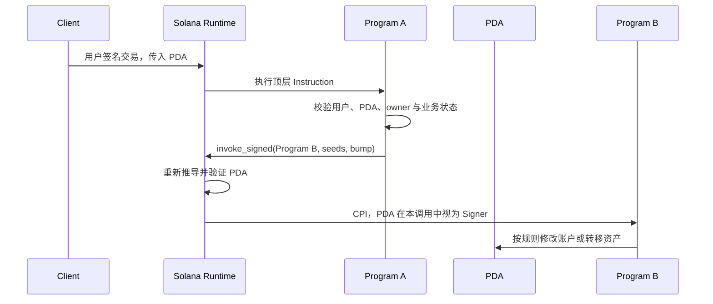
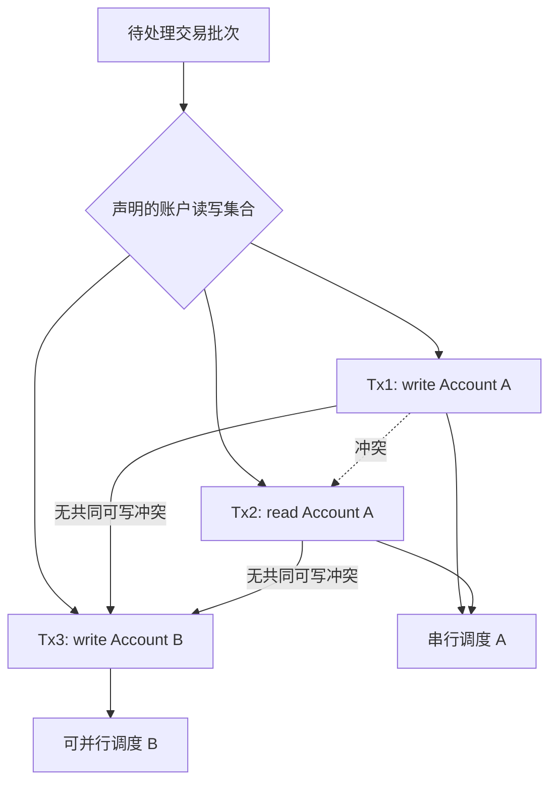
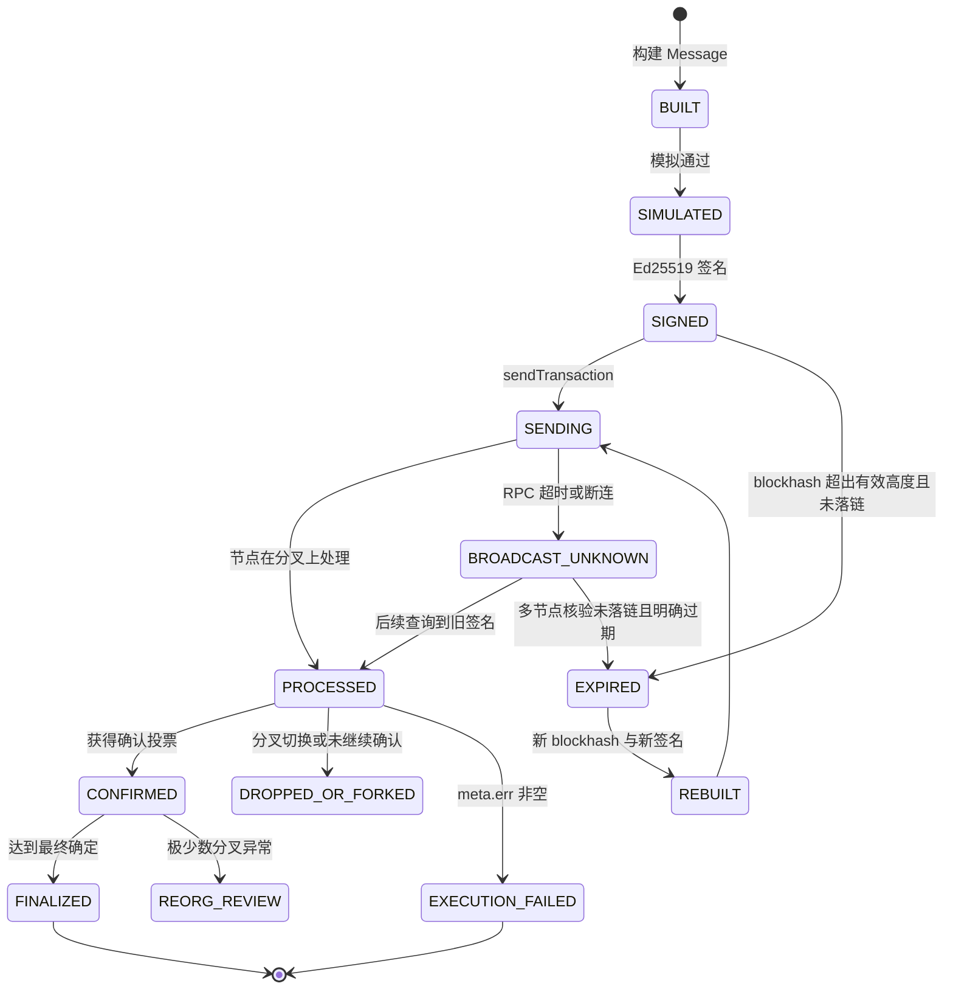

# Day 10：Solana 账户、Program 与交易模型

> 学习目标：掌握 Solana Account、Program、Instruction、Transaction、PDA、Recent Blockhash、账户锁、Compute Unit 与 Commitment；能够正确解析 Legacy 和 v0 Versioned Transaction，并从托管钱包角度比较 Solana 与 EVM 的构建、并发、失败和确认模型。  
> 建议用时：4～5 小时  
> 完成标准：仅使用 Devnet、Testnet、`solana-test-validator` 或公开脱敏数据；完成一笔交易的签名、账户、指令和执行结果解析，画出交易生命周期，完成 ETH/Solana 对比表，并闭卷回答文末恰好 7 道面试题。

## 安全边界与版本说明

- 只使用无价值测试密钥，不提交助记词、私钥、RPC API Key、生产地址映射或签名服务凭证。
- 不在文档中伪造“已上链”的交易签名。网络不可用时保存 RPC 请求模板和确定性夹具，并把待验证字段明确标为“实验记录”。
- Solana 的 RPC、运行时限制、费用市场和客户端行为会演进。生产配置必须来自目标集群当前能力与实测，不能把本文示例数字当作永久常量。
- “账户 owner”是链上字段，不等于业务用户或私钥持有人；“交易签名成功”也不等于链上执行成功。
- `processed`、`confirmed`、`finalized` 是节点对分叉与确认程度的承诺，不是托管账本可以忽略重组风险的绝对保证。
- 普通 Recent Blockhash 过期后的重建和重签可能生成新的合法交易；广播结果未知时必须先查询旧签名，避免重复支付。

---

## 一、Solana 的核心对象

### 1. Account：统一状态容器

Solana 把持久状态都放在 Account 中。一个账户通常包含：

| 字段 | 含义 | 钱包工程关注点 |
|---|---|---|
| `pubkey` | 32 字节公钥作为地址 | Base58 只是展示编码，解析后应校验 32 字节 |
| `lamports` | 原生币最小单位余额 | $1\ SOL=10^9$ lamports；金额使用整数 |
| `owner` | 有权解释和修改该账户数据的 Program ID | 不是“谁拥有私钥” |
| `data` | 任意字节状态 | 需按 owner 对应的协议布局解码 |
| `executable` | 是否可执行 | Program 相关账户由 Loader 管理 |
| `rentEpoch` | 与租金机制相关的 RPC 字段 | 不应据此单独判断账户可长期存在 |

账户可大致分为：

- **系统账户**：通常由 System Program 管理，可持有 SOL；
- **程序数据账户**：由特定 Program 拥有，数据布局由该 Program 定义；
- **可执行程序账户**：代码由 Loader 体系管理；
- **Sysvar 账户**：向程序暴露时钟、租金等运行时信息；
- **Token/Mint 等账户**：由 SPL Token Program 或 Token-2022 Program 管理；
- **PDA 账户**：地址由 Program ID 和 seeds 确定，通常由程序通过运行时授权操作。

重要边界：某用户能为地址签名，不代表他可以随意改写该地址的 `data`；程序也不能任意修改不归自己所有的账户数据。运行时根据 owner、Signer、可写标记和调用规则执行检查。

### 2. Program：无共享内存的链上逻辑

Program 是可执行代码。它接收：

```text
program_id
accounts[]
instruction_data
```

Program 本身通常不把业务状态保存在进程内，而是读取和修改交易显式传入的账户。这样运行时能在执行前知道潜在读写集合，为并行调度和访问控制提供基础。

常见内置或生态 Program：

| Program | 典型职责 |
|---|---|
| System Program | 创建账户、转移 SOL、分配空间等 |
| Compute Budget Program | 请求 Compute Unit 限额和设置 CU 单价 |
| SPL Token Program | Mint、Token Account、转账、授权等 |
| Associated Token Account Program | 确定性创建 ATA |
| Address Lookup Table Program | 管理地址查找表 |
| Loader Program | 部署和升级可执行程序 |

Program ID 必须来自链配置或官方可信来源。只看浏览器显示名会受到同名假程序、错误集群和错误地址影响。

### 3. Instruction：一次程序调用描述

一条编译后指令包含：

```text
programIdIndex       // Program 在账户键列表中的索引
accountIndexes[]     // 传给 Program 的账户索引及顺序
opaqueData           // Program 自定义字节
```

在构建阶段，SDK 常使用更直观的 `AccountMeta`：

```text
pubkey
isSigner
isWritable
```

运行时并不会根据字段名猜账户用途，Program 必须按协议规定的顺序解释账户和 data。例如 System Program 的 SOL 转账通常需要来源账户、目标账户和转账金额；来源需要签名且可写，目标也需要可写。

### 4. Transaction：原子指令集合

一笔交易包含一个或多个签名和一个 Message：

```text
Transaction
├─ signatures[]
└─ message
   ├─ header
   ├─ account keys / address table lookups
   ├─ recentBlockhash
   └─ compiledInstructions[]
```

默认语义是交易内指令按顺序执行，并形成原子状态变更：任何指令失败，交易整体业务状态修改不会提交，但交易本身仍可被链记录，费用仍可能收取。后续指令不会继续执行。

Program 可以通过 Cross-Program Invocation（CPI）调用其他 Program。外层解析时不能只看顶层指令；内部调用、日志、余额变化和错误位置也很重要。

---

## 二、账户权限：owner、Signer、Writable 与 PDA

### 1. 四个容易混淆的概念

| 概念 | 谁决定/证明 | 解决的问题 |
|---|---|---|
| Account `owner` | 链上账户字段与运行时规则 | 哪个 Program 可管理该账户数据 |
| Signer | 对 Message 的 Ed25519 有效签名 | 某公钥是否授权本次交易 |
| Writable | Message 编译结果 | 本次执行是否声明可能修改该账户 |
| Fee Payer | 静态账户键第一个账户，且必须签名、可写 | 谁支付本次交易费 |

一个账户可以同时是 Signer 和 Writable，也可以只读不签名。Program ID 通常是只读且不签名。Writable 只是必要声明，不会自动赋予修改权限；运行时仍检查 owner、签名和程序规则。

### 2. 为什么必须提前列出账户

Solana Message 在执行前给出账户访问集合及读写权限，因此运行时可以：

1. 验证签名与静态账户键关系；
2. 为可写账户加排他锁；
3. 为只读账户允许共享访问；
4. 提前发现同批交易的冲突；
5. 并行调度访问集合不冲突的交易；
6. 限制 Program 只能访问显式传入的账户。

代价是构建方必须预先知道所有账户。漏传账户、顺序错误、只读误标为可写或地址错误都会导致模拟/执行失败。CPI 也不能凭空访问未提供给调用链的普通账户。

### 3. PDA 的推导

Program Derived Address 由 seeds 与 Program ID 确定性推导：

```text
PDA = findProgramAddress(seeds, programId)
```

概念上，运行时寻找一个 `bump`，使派生出的 32 字节值不落在 Ed25519 曲线上。因此 PDA 没有对应的普通 Ed25519 私钥，不能像普通 Keypair 一样在链外产生签名。

常见 seeds：

```text
["vault", user_pubkey]
["position", market_pubkey, user_pubkey]
```

约束与风险：

- seeds 顺序和字节编码必须固定；
- 单个 seed、seed 数量和总长度受运行时限制，使用当前 SDK 校验；
- 不把低熵敏感信息直接当作“秘密 seed”，PDA 是可公开推导的；
- 必须校验 canonical bump，避免同一业务接受非预期派生地址；
- 还要校验传入账户的 owner、data discriminator 和业务字段，不能只验证地址。

### 4. PDA 如何“签名”

PDA 不在交易的 Ed25519 `signatures[]` 中产生普通签名。其所属 Program 在 CPI 时提供相同 seeds 和 bump，运行时通过 `invoke_signed` 验证推导关系，并在该 CPI 调用上下文中把 PDA 视作 Signer。

```text
链外用户签名 -> 调用 Program A
Program A -> invoke_signed(seeds, bump) -> Program B
运行时验证 seeds + Program A ID == PDA
Program B 在本次 CPI 中看到 PDA is_signer = true
```

只有派生它的 Program 能以对应 Program ID 和 seeds 获得这种运行时授权。PDA 可以作为金库权限、账户地址或协议身份，但安全性仍取决于 Program 的访问控制和升级权限。



---

## 三、Ed25519 签名与 Message

### 1. 签名对象

Solana 的普通交易签名使用 Ed25519，对**序列化后的 Message bytes**签名，而不是对浏览器展示 JSON 签名。任何以下变化都会改变 Message 和签名：

- 账户键或权限；
- 指令 data 或账户索引；
- Recent Blockhash；
- Address Lookup Table 引用；
- Compute Budget 指令；
- Fee Payer。

签名数组顺序与 Message 中前 `numRequiredSignatures` 个静态账户键对应。交易第一个签名通常称为 transaction signature，可作为 RPC 查询标识，但不能仅凭签名存在判断执行成功。

### 2. Message Header

Header 有三个核心计数：

```text
numRequiredSignatures
numReadonlySignedAccounts
numReadonlyUnsignedAccounts
```

Legacy/v0 的静态账户键按权限分组，概念顺序为：

1. 可写 Signer（第一个通常是 Fee Payer）；
2. 只读 Signer；
3. 可写非 Signer；
4. 只读非 Signer。

解析器不能只凭位置猜全部业务含义，但可以据 Header 和索引恢复签名/读写权限。对于 v0 Message，地址查找表加载的账户只会作为非 Signer；交易所所需 Signer 必须位于静态账户键中。

### 3. 多签与部分签名

一笔交易可能要求多个 Signer。构建服务必须固定同一份 Message bytes，再让各签名方分别签名并按账户顺序合并。若某一方更新了 Recent Blockhash，已有签名全部失效。

生产要求：

- 签名前独立解码 Message；
- 校验集群、Fee Payer、Program 白名单、账户权限、金额和费用上限；
- 绑定 `businessId + messageHash + blockhash + attempt`；
- 不接受“只给一个 hash、不解释交易语义”的盲签；
- 日志记录 Message 摘要和策略证据，不记录私钥。

---

## 四、Recent Blockhash、有效期与重复保护

### 1. Recent Blockhash 的作用

普通交易 Message 包含一个 Recent Blockhash。它主要提供：

- **时效窗口**：验证节点只接受仍在近期 blockhash 队列中的交易；
- **重复处理保护**：相同签名交易不会被无限重复执行；
- **新尝试标识**：更换 blockhash 会改变 Message 和签名。

它不是 EVM nonce，也不是保证交易已执行的序号。不同交易可以共享同一个 Recent Blockhash，只要签名和 Message 不同。

### 2. 获取 blockhash

常用 RPC：

```json
{
  "jsonrpc": "2.0",
  "id": 1,
  "method": "getLatestBlockhash",
  "params": [{ "commitment": "confirmed" }]
}
```

典型响应核心字段：

```json
{
  "blockhash": "<base58-blockhash>",
  "lastValidBlockHeight": 123456789
}
```

应把 `blockhash` 与 `lastValidBlockHeight` 一起持久化。不要用固定“约 60/90 秒”作为唯一过期判据；集群出块速度会变化，应通过节点当前 block height 与有效高度判断，并保留安全余量。

### 3. 过期判断

可使用：

```text
getBlockHeight(commitment)
isBlockhashValid(blockhash, commitment)
```

当当前有效 block height 超过 `lastValidBlockHeight`，且在所选查询策略下仍找不到旧签名时，才可把普通交易归类为过期候选。节点分歧或 RPC 超时期间不能只凭墙钟猜测。

### 4. 过期后怎么办

技术上需要：

1. 获取新的 blockhash 与 `lastValidBlockHeight`；
2. 使用相同业务语义重新构建 Message；
3. 重新进行费用、账户、Program 和金额校验；
4. 重新签名，得到**新的 transaction signature**；
5. 广播新交易，同时保留旧/新尝试关联。

资金系统额外要求：先证明旧尝试没有落链。若广播请求未知、节点落后或不同 RPC 结果不一致，旧交易可能仍在有效窗口内或已被处理。不能看到一次 `not found` 就立刻重签。

### 5. 广播未知与安全重试

```text
sendTransaction 超时
        ↓
结果未知，而不是失败
        ↓
按旧 signature 查询多个节点
        ↓
仍有效：重播同一 signed bytes
明确过期且未落链：新 blockhash + 重建 + 重签
```

同一 signed bytes 重播是网络层幂等；新 blockhash 重签是新的链上尝试。业务层必须用唯一 `withdrawalId` 把所有 attempts 关联起来，并保证至多一个成功尝试被账务结算。

---

## 五、Legacy 与 Versioned Transaction

### 1. Legacy Transaction

Legacy Message 直接在交易中携带完整账户键列表。优点是结构简单、生态兼容广；缺点是交易总大小受限制，复杂交易能携带的账户数量有限。

解析重点：

- `signatures[]`；
- `message.header`；
- `message.accountKeys[]`；
- `recentBlockhash`；
- `instructions[].programIdIndex/accounts/data`。

### 2. v0 Versioned Transaction

Versioned Transaction 在 wire format 中引入版本化 Message。当前广泛使用的是 v0，它允许 Message 引用 Address Lookup Table（ALT），把部分 32 字节地址替换成表索引，从而在固定交易大小内引用更多账户。

v0 Message 包含：

```text
staticAccountKeys[]
addressTableLookups[]
  ├─ accountKey          // ALT 账户地址
  ├─ writableIndexes[]
  └─ readonlyIndexes[]
```

节点加载 ALT 后形成完整账户地址空间。概念拼接顺序为：

```text
static keys
+ all loaded writable addresses
+ all loaded readonly addresses
```

编译指令中的索引基于这份完整地址空间。解析 RPC `jsonParsed`/JSON 响应时，应关注 `meta.loadedAddresses`；原始解析器则必须读取对应 ALT 账户并按索引恢复地址。

### 3. ALT 解决什么、不解决什么

ALT 解决的是**地址列表压缩和复杂交易账户容量**，不是：

- 提高交易字节上限；
- 降低所有计算消耗；
- 让加载地址成为 Signer；
- 自动保证 ALT 内容可信；
- 消除账户锁冲突；
- 让旧客户端自动支持 v0。

构建前要确认 ALT 已在目标集群可用且状态满足当前规则；解析和签名服务要验证表地址及解析后的实际账户，而不是只批准 ALT 的地址。

### 4. RPC 版本兼容

查询可能返回 v0 的 RPC 时，应显式声明客户端支持的最大交易版本：

```json
{
  "jsonrpc": "2.0",
  "id": 1,
  "method": "getTransaction",
  "params": [
    "<transaction-signature>",
    {
      "commitment": "confirmed",
      "encoding": "jsonParsed",
      "maxSupportedTransactionVersion": 0
    }
  ]
}
```

若忽略该参数，客户端可能无法读取版本化交易。生产索引器应把“未知版本”作为显式不支持状态并告警，不要静默漏扫。

### 5. 对比表

| 维度 | Legacy | v0 Versioned |
|---|---|---|
| 地址来源 | 全部直接放入 Message | 静态键 + ALT 加载地址 |
| Signer | 来自静态账户键 | 仍必须来自静态账户键 |
| 复杂交易容量 | 更容易受账户地址数量限制 | 可压缩非 Signer 地址引用 |
| 解析复杂度 | 较低 | 需解析 lookup 与 loaded addresses |
| 客户端兼容 | 最广 | RPC/SDK 必须支持版本 0 |
| 锁与执行语义 | 基于账户读写集合 | 相同，ALT 不消除锁冲突 |

---

## 六、并行执行与账户锁

### 1. Sealevel 并行模型

Solana 能并行执行账户访问集合不冲突的交易。简化规则：

```text
只读 A + 只读 A：可并行
可写 A + 只读 A：冲突
可写 A + 可写 A：冲突
访问 A 与访问 B：若无其他冲突，可并行
```

运行时在调度前已知道每笔交易的读写集合，因此可在多核上安排不冲突的交易。并行不是“同一账户可并发修改”，热点可写账户仍会串行化或导致竞争。



### 2. 热点账户

常见热点：

- 单一全局状态账户；
- 高频共享金库；
- 热门市场状态；
- 同一 Fee Payer 或同一源 Token Account；
- 被大量交易标记为可写但实际不需要写的账户。

优化方向：

- 只在确实修改时标为 Writable；
- 把全局状态按市场、用户或业务分片；
- 多 Fee Payer/源账户分片，但保持资金与业务幂等；
- 通过队列和限流减少锁冲突重试风暴；
- 模拟只用于预检，不能证明随后一定无冲突。

不能为了并行随意拆分必须原子一致的状态。吞吐优化不能破坏权限、账务和业务不变量。

### 3. 账户锁错误与重试

账户锁冲突通常是暂态调度/发送问题，但重试必须区分：

- 已签名交易仍有有效 blockhash：重播同一 bytes；
- blockhash 已过期且旧交易未落链：重建、重签；
- 指令本身确定性失败：修复输入，不能盲目重试；
- 广播结果未知：先按 signature 对账。

生产监控应按 Program、Writable Account、Fee Payer 和错误码统计锁冲突，识别错误设计导致的热点。

---

## 七、Compute Unit 与费用

### 1. Compute Unit

Compute Unit（CU）衡量交易执行消耗。交易受 CU limit 约束，程序还受调用深度、堆栈、账户数据和交易大小等运行时限制。超过预算会失败，状态回滚但费用不一定退还。

可在交易开头加入 Compute Budget Program 指令：

```text
SetComputeUnitLimit(units)
SetComputeUnitPrice(microLamportsPerCU)
```

优先费用概念上与请求的 CU limit 和 CU price 相关。具体计费、调度和舍入以当前集群实现为准，不能用浏览器某次展示反推永久公式。

### 2. 估算流程

```text
构建候选 Message
  -> simulateTransaction
  -> 读取 unitsConsumed、logs、err
  -> 加安全余量得到 CU limit
  -> 根据拥堵和目标确认时间选择 CU price
  -> 校验最大费用与业务限额
  -> 固定 Message 并签名
```

不要把 CU limit 无上限调高：

- 可能提高费用上界或优先费成本；
- 会占用调度资源；
- 掩盖程序性能回归；
- 仍无法解决账户锁、错误权限和业务校验失败。

### 3. 模拟的边界

模拟可发现：

- 账户缺失或权限错误；
- Program 自定义错误；
- CU 不足；
- 日志和返回数据；
- 某些余额、owner、租金和状态约束问题。

模拟成功不保证实际执行成功，因为模拟与上链之间：

- 账户状态可能变化；
- blockhash 可能过期；
- 费用市场和 leader 变化；
- 账户锁竞争变化；
- 使用的 commitment、替换 blockhash 或签名验证配置可能不同。

---

## 八、Commitment 与交易生命周期

### 1. 三种 Commitment

| Commitment | 含义（概念） | 延迟 | 分叉风险 | 建议用途 |
|---|---|---:|---:|---|
| `processed` | 节点已处理其当前分叉中的区块/交易 | 最低 | 最高 | 实时 UI、预警，不作为最终入账 |
| `confirmed` | 所在区块获得集群投票确认 | 中 | 较低但非零 | 普通业务待确认、较快可用策略 |
| `finalized` | 所在区块已达到更强的最终确定条件 | 最高 | 最低 | 大额充值、最终结算或高风险动作 |

Commitment 是查询视角。节点可能落后、切换分叉或实现不同缓存行为，所以交易所还应检查：

- `meta.err`；
- 交易 slot；
- 多节点健康与 slot 差；
- 资产、金额、收款账户和 Program；
- 充值唯一键与账务状态；
- 风险策略要求的最终性。

### 2. 生命周期



### 3. 充值确认策略

建议按风险分层，而不是全站一个固定状态：

```text
发现 processed：建立观察记录，不增加可用余额
达到 confirmed 且 meta.err=null：普通小额可按策略入账或进入待释放
达到 finalized：大额或高风险充值完成最终入账
```

更严格方案可先在 confirmed 记入冻结余额，finalized 后转可用。具体策略还应考虑金额、资产风险、账户类型、合约/Program 白名单、节点健康和业务可补偿能力。

如果已在 confirmed 给用户可用余额，必须有分叉回退策略：冻结未消费余额、暂停关联提币、回滚或生成补偿账务，并保留不可变审计。不能直接删除原充值记录。

### 4. 查询 API

常用 RPC：

```text
getSignatureStatuses
getTransaction
getBlock
getSlot
getBlockHeight
```

`getSignatureStatuses` 适合批量跟踪签名；历史较久时是否搜索交易历史、节点是否保留数据以及供应商限制都要显式配置。`confirmationStatus` 与 `err` 必须一起判断：已 finalized 的失败交易仍是失败交易。

---

## 九、解析一笔 Solana 测试网交易

> 本节提供可复现解析模板。把实验得到的真实 Devnet/Testnet signature 填入本地记录；网络不可用时不要编造结果。

### 1. 获取交易

请求：

```json
{
  "jsonrpc": "2.0",
  "id": 1,
  "method": "getTransaction",
  "params": [
    "<DEVNET_OR_TESTNET_SIGNATURE>",
    {
      "commitment": "confirmed",
      "encoding": "jsonParsed",
      "maxSupportedTransactionVersion": 0
    }
  ]
}
```

先确认 RPC URL 对应正确集群。相同地址形式可存在于多个集群，transaction signature 的业务记录必须同时绑定 network/cluster 标识。

### 2. 第一层：交易身份与版本

记录：

```text
cluster                 = devnet / testnet / localnet
transaction signature   = transaction.signatures[0]
version                  = legacy / 0
slot                     = result.slot
blockTime                = result.blockTime
recentBlockhash          = transaction.message.recentBlockhash
```

验证：

- `signatures` 数量应等于 Header 要求签名数；
- 第一签名可用于后续状态查询；
- `version=0` 时必须解析 loaded addresses；
- `blockTime` 可为空，不能替代 slot 或最终性；
- 交易被查到不代表 `meta.err` 为空。

### 3. 第二层：静态账户与加载账户

对 `jsonParsed` 响应，记录每个 account key：

```text
pubkey
signer
writable
source = transaction | lookupTable
```

若是原始 JSON 编译形式，则根据 Header 和地址列表重建权限。v0 还要处理：

```text
meta.loadedAddresses.writable[]
meta.loadedAddresses.readonly[]
```

至少标出：

- Fee Payer；
- 所有 Signer；
- 所有 Writable 账户；
- Program ID；
- 来源与目标账户；
- ALT 及其加载地址（若有）。

### 4. 第三层：Instruction

对每条顶层指令记录：

```text
index
program / programId
accounts
parsed.type 或 raw data
业务语义
```

原始编译指令的解析步骤：

```text
program = resolvedAccountKeys[programIdIndex]
accounts = accountKeyIndexes.map(i -> resolvedAccountKeys[i])
dataBytes = base58Decode(data)
decodeByKnownProgram(program, dataBytes)
```

不能对未知 Program 猜 data 含义。正确做法是使用锁定版本的官方布局、IDL 或经过审计的解码器；未知指令进入 `UNSUPPORTED_PROGRAM`，不可自动入账。

### 5. 第四层：内部指令和日志

检查：

```text
meta.innerInstructions
meta.logMessages
meta.returnData
```

顶层指令可能通过 CPI 完成真正的 SOL/Token 转移。`innerInstructions` 是按顶层指令索引组织的执行痕迹；日志可帮助定位失败 Program 与自定义错误，但日志是诊断证据，不应取代余额变化、账户状态和协议语义校验。

### 6. 第五层：执行结果和费用

必须读取：

```text
meta.err
meta.fee
meta.computeUnitsConsumed
meta.preBalances / postBalances
meta.preTokenBalances / postTokenBalances
meta.rewards
```

SOL 余额变化需结合：

- Fee Payer 支付的 `meta.fee`；
- 账户创建或关闭；
- 租金相关资金变化；
- 多条指令和内部调用；
- 奖励或其他特殊上下文。

不能简单把 `postBalances[to] - preBalances[to]` 全部认作用户充值。SPL Token 解析将在 Day 11 深入。

### 7. System Program SOL Transfer 示例解码模板

假设解析器确认指令属于 System Program 且类型为 transfer：

```text
Program: System Program
Type: transfer
Source: <source pubkey>    signer=true, writable=true
Destination: <dest pubkey> writable=true
Lamports: <integer>
SOL: lamports / 1_000_000_000
```

验证清单：

- `meta.err == null`；
- 目标地址属于交易所且网络匹配；
- 指令确实由官方 System Program 解析；
- 来源签名与权限满足规则；
- 目标余额变化与整笔交易其他动作一致；
- signature + 指令位置作为业务唯一键的一部分；
- 当前 Commitment 达到资产和金额策略。

### 8. 实验记录表

| 字段 | 实验值 |
|---|---|
| Cluster |  |
| Signature |  |
| Version |  |
| Slot / Block Time |  |
| Commitment |  |
| Fee Payer |  |
| Signers |  |
| Writable Accounts |  |
| Recent Blockhash |  |
| Program IDs |  |
| Top-level Instructions |  |
| Inner Instructions |  |
| `meta.err` |  |
| Fee / CU Consumed |  |
| Pre/Post SOL Balance |  |
| 最终业务结论 |  |

---

## 十、Solana 交易解析伪代码

```text
function parseSolanaTransaction(cluster, signature):
    tx = rpc.getTransaction(
        signature,
        commitment="confirmed",
        encoding="jsonParsed",
        maxSupportedTransactionVersion=0)

    if tx == null:
        return NOT_FOUND_AT_THIS_NODE

    assert tx.transaction.signatures[0] == signature
    resolvedKeys = resolveStaticAndLoadedKeys(tx)
    header = tx.transaction.message.header
    verifySignatureAndPrivilegeLayout(header, resolvedKeys)

    topLevel = []
    for (index, ix) in tx.transaction.message.instructions:
        programId = resolveProgramId(ix, resolvedKeys)
        decoder = decoderRegistry.find(cluster, programId)
        if decoder == null:
            topLevel.add(UNSUPPORTED_PROGRAM)
            continue
        topLevel.add(decoder.decode(ix, resolvedKeys))

    inner = parseInnerInstructions(
        tx.meta.innerInstructions,
        resolvedKeys,
        decoderRegistry)

    execution = {
        error: tx.meta.err,
        fee: tx.meta.fee,
        computeUnits: tx.meta.computeUnitsConsumed,
        solDeltas: diff(tx.meta.preBalances, tx.meta.postBalances),
        tokenDeltas: diffTokenBalances(
            tx.meta.preTokenBalances,
            tx.meta.postTokenBalances)
    }

    if execution.error != null:
        businessResult = EXECUTION_FAILED
    else:
        businessResult = matchExpectedTransfer(
            cluster, signature, topLevel, inner, execution)

    return persistIdempotently(
        uniqueKey=(cluster, signature, instructionPath),
        slot=tx.slot,
        blockTime=tx.blockTime,
        version=tx.version,
        resolvedKeys=resolvedKeys,
        execution=execution,
        businessResult=businessResult)
```

解析器版本也要持久化。Program 升级、IDL 变化或 Token-2022 扩展可能改变解码结果，历史重扫必须能审计“当时使用了哪个规则版本”。

---

## 十一、Solana 与 EVM 执行模型对比

| 维度 | EVM / Ethereum | Solana | 钱包架构影响 |
|---|---|---|---|
| 核心状态 | 全局账户与合约 Storage | 独立 Account 持有 lamports/data/owner | Solana 必须显式解析账户及 owner |
| 执行入口 | 交易调用 `to`，合约运行时访问状态 | Instruction 指定 Program、账户和 data | Solana 构建方需提前准备账户集合 |
| 状态访问 | 合约可按地址读取/写入允许的全局状态 | 主要访问交易显式传入的账户 | Solana 更利于静态冲突分析 |
| 并发控制 | 同一 EOA nonce 串行；区块执行模型通常顺序语义 | 基于只读/可写账户锁并行调度 | 热点 Writable Account 会限制吞吐 |
| 防重放/时效 | Chain ID + sender nonce；交易可长期 pending | Recent Blockhash + signatures；普通交易有有效窗口 | Solana 过期重签会产生新 signature |
| 签名算法 | EOA 通常 secp256k1 ECDSA | 普通账户通常 Ed25519 | 签名服务需支持不同曲线和编码 |
| 地址/授权 | EOA 私钥；合约权限自定义 | Keypair Signer + PDA 运行时签名 | PDA 没有普通私钥，需校验 seeds/Program |
| 交易身份 | transaction hash | 第一 transaction signature | 都必须绑定链/网络，存在不代表成功 |
| 费用资源 | Gas、EIP-1559 Base/Priority Fee | Base fee/签名费用 + CU 优先费等 | Solana 需模拟 CU、管理 CU limit/price |
| 失败状态 | Receipt `status=0`，状态回滚，nonce 消耗且付 Gas | `meta.err` 非空，交易状态修改回滚，费用仍收取 | 两者都不能按“有 hash/signature”入账 |
| 失败后的顺序 | nonce 已消耗，后续 nonce 可继续 | 无普通 EOA nonce；失败不形成同类序号阻塞 | Solana 重试重点是 blockhash、签名和业务幂等 |
| 多调用 | 合约内部 call/delegatecall | 多 Instruction + CPI | 解析都不能只看最外层入口 |
| 原子性 | 单交易调用栈状态原子提交/回滚 | 一笔交易内多指令原子提交/回滚 | 批处理失败需整体判断，不按单条成功入账 |
| 账户创建 | 地址可先存在语义，合约创建有专门机制 | 创建账户需分配 lamports、space、owner | 提币可能同时创建 ATA/账户，费用与锁增加 |
| 交易格式扩展 | Typed Transaction | Legacy 与 Versioned v0 + ALT | RPC 查询需声明支持的版本 |
| 确认视角 | latest/safe/finalized、确认数 | processed/confirmed/finalized | 两者都需按风险配置最终性 |
| 加速方式 | 同 sender+nonce 提高费用替换 | 普通交易常在有效期内重播；过期后新 blockhash 重签 | Solana 不照搬 EVM replacement 语义 |
| 节点未知结果 | 按 hash 查询并重播相同 raw tx | 按 signature 查询并重播相同 signed bytes | 未知不等于失败，禁止独立重复支付 |

### 关键结论

- EVM 的 nonce 是发送方全局顺序资源；Solana 普通交易没有同等的发送方 nonce 队列。
- Solana 的并发边界主要是账户读写锁，EVM 钱包并发边界常见于 EOA nonce。
- EVM 同 nonce 替换与 Solana blockhash 过期重签不是同一机制。
- 两者交易执行失败通常都回滚业务状态并收取费用，但 EVM 失败交易仍消耗 nonce；Solana 失败交易不会形成这种发送方连续 nonce 消耗。
- 两者都必须把“链上记录存在”和“业务转账成功”分开判断。

---

## 十二、失败语义与异常矩阵

### 1. 失败层次

| 层次 | 示例 | 是否可能有 signature | 是否可能收费 | 处理 |
|---|---|---:|---:|---|
| 构建失败 | 缺账户、序列化超限 | 否 | 否 | 修复构建，不广播 |
| 签名失败 | 缺 Signer、Message 被修改 | 部分 | 否 | 固定 Message 后重新收集签名 |
| 预检失败 | 模拟发现余额/CU/权限错误 | 是 | 通常未上链 | 分类错误，确定性错误不盲重试 |
| 广播未知 | RPC 超时/断连 | 是 | 未知 | 查旧 signature，重播同 bytes |
| Blockhash 过期 | 超过有效 block height | 是 | 未落链则不收费 | 确认旧尝试未落链后重建重签 |
| 链上执行失败 | `meta.err != null` | 是 | 是 | 状态回滚；记录失败与费用 |
| processed 分叉丢失 | 交易只在被放弃分叉出现 | 是 | 需按最终规范链判断 | 回退观察状态并对账 |
| confirmed/finalized 成功 | `meta.err == null` 且达到策略 | 是 | 是 | 幂等入账或结算 |

### 2. 常见异常与恢复

| 异常 | 可能原因 | 安全恢复 |
|---|---|---|
| `BlockhashNotFound` | blockhash 太旧或节点分叉视图不同 | 查有效高度和旧 signature；明确未落链后换 blockhash 重签 |
| `TransactionExpiredBlockheightExceeded` | 超过 `lastValidBlockHeight` | 多节点核验旧签名，再建立关联的新 attempt |
| `AccountInUse`/锁冲突 | 热点可写账户并发 | 有效期内重播同 bytes，退避限流，长期则重构分片 |
| `ComputationalBudgetExceeded` | CU limit 不足或程序回归 | 根据模拟/历史调整预算并重新审批重签 |
| `InsufficientFundsForFee` | Fee Payer lamports 不足 | 暂停新任务，补充并对账；不要无限换 Fee Payer |
| `InstructionError` | Program 校验、权限或数据错误 | 解码错误位置和日志；确定性错误不自动重试 |
| `InvalidAccountForFee` | Fee Payer 不满足规则 | 修复账户选择并重建 |
| RPC 返回 signature 后查不到 | 尚未传播、分叉、节点落后或丢包 | 多节点查询；blockhash 有效时重播原 bytes |
| v0 查询失败 | 客户端没声明支持版本 | 设置 `maxSupportedTransactionVersion=0` 并升级解析器 |
| ALT 解析失败 | 表未可用、索引或集群错误 | 校验 ALT 状态与集群，不猜账户地址 |
| 模拟成功、执行失败 | 状态变化、锁、blockhash、竞争 | 按链上 `meta.err` 为准，评估是否可安全新 attempt |
| processed 成功后消失 | 节点切换分叉 | 回退充值状态，等待 confirmed/finalized |
| 重签后两个签名均被观察 | 旧交易曾落在分叉或状态查询延迟 | 按规范链与业务效果对账，保持 attempts 关联 |

---

## 十三、托管钱包的数据模型

### 1. `solana_transaction_attempt`

| 字段 | 含义 |
|---|---|
| `business_id` | 业务唯一 ID |
| `cluster` | devnet/testnet/mainnet-beta/localnet |
| `attempt_no` | blockhash 重建代次 |
| `signature` | 第一交易签名 |
| `message_hash` | Message bytes 摘要 |
| `recent_blockhash` | 本次 blockhash |
| `last_valid_block_height` | 有效高度边界 |
| `fee_payer` | 支付费用账户 |
| `version` | legacy/0 |
| `raw_tx_reference` | 受控保存的 signed bytes 引用 |
| `status` | BUILT/SIGNED/UNKNOWN/PROCESSED 等 |
| `slot` | 被观察到的 slot |
| `meta_err` | 链上执行错误 |
| `fee/compute_units` | 实际费用与 CU |
| `parent_attempt_id` | 过期重建关系 |
| timestamps | 构建、广播、处理、最终化时间 |

约束示例：

```text
UNIQUE(cluster, signature)
UNIQUE(business_id, attempt_no)
UNIQUE(business_id, message_hash)
```

最后一个约束是否适用取决于是否允许同一 Message 重收集签名，应按签名方案设计；核心是不允许不同业务单复用同一付款意图。

### 2. `solana_instruction_record`

保存：

```text
attempt_id
instruction_path       // 例如 0、0.1、2.0
program_id
parsed_type
account_roles
amount_base_units
asset_id
raw_data_hash
decoder_name/version
business_match_status
```

充值唯一键不能只用 signature，因为一笔交易可包含多个转账。可使用：

```text
(cluster, signature, instruction_path, asset_id, destination)
```

实际方案需稳定定义顶层与内部指令路径，并处理同一 CPI 路径下的多事件/余额变化。

### 3. 状态迁移原则

- Message 一旦签名，不可修改；
- 广播超时进入 `BROADCAST_UNKNOWN`，不标失败；
- 旧 attempt 明确过期且未落链后，才创建新 blockhash attempt；
- 任一 attempt 成功后，业务单进入成功候选，其他 attempt 禁止继续重建；
- `meta.err != null` 是链上失败，不等于 RPC 失败；
- Commitment 回退必须触发账务补偿或冻结；
- finalized 后仍保留完整 attempts 与审计证据。

---

## 十四、监控与排障

### 1. 关键指标

- RPC 节点当前 slot、block height 和相互差值；
- `sendTransaction` 延迟、错误率、未知结果率；
- processed/confirmed/finalized 各阶段 P50/P95/P99 延迟；
- blockhash 剩余有效高度和过期率；
- 同一业务 attempt 数量、重签率和重复效果告警；
- `meta.err` 按 Program ID、错误类型和指令索引分布；
- CU limit、实际 consumed、利用率和优先费；
- Account lock 冲突按 Writable Account 聚合；
- Fee Payer 余额、消耗速率和补充水位；
- Legacy/v0 比例、ALT 解析失败和未知版本；
- processed 后未 confirmed、confirmed 后异常回退数量；
- 扫描最高 slot、根 slot、节点差距和漏扫修复量。

### 2. 单笔交易排障顺序

```text
1. 确认 cluster + businessId + signature
2. 查询多个健康节点的 signature status
3. 检查 blockhash 与 lastValidBlockHeight
4. 获取 getTransaction(version support = 0)
5. 检查 meta.err、slot、commitment
6. 恢复静态键、loaded addresses、Signer/Writable
7. 解码顶层和 inner instructions
8. 检查 logs、fee、CU、pre/post balances
9. 与签名前 Message 摘要和业务意图对比
10. 与账本、广播 attempts 和幂等记录对账
```

不能仅凭浏览器状态关闭事故。浏览器可辅助展示，但资金结论应来自节点/索引器、内部签名前快照、规范化解析和账本证据。

---

## 十五、口头面试题参考答案

> 本节严格包含计划中的 7 道题。先闭卷口述，再按“结论 → 原理 → 生产实现 → 异常与风险 → 监控和恢复”补全。

### 1. Solana 为什么需要在交易中提前列出账户？

**参考回答：**

Solana Program 的持久状态位于独立 Account 中，交易必须提前声明指令可能访问的账户以及 Signer/Writable 权限。运行时据此做权限校验和账户锁：只读账户可共享，涉及同一可写账户的交易冲突，无冲突交易可并行调度。这也是 Sealevel 高并发的基础之一。

代价是客户端必须准确准备账户集合、顺序和权限。漏账户、错误 owner、把应写账户标只读都会失败；多标 Writable 又会扩大锁冲突。CPI 也不能任意访问未传入调用链的账户。生产中应在模拟和签名前独立解码，校验 Program 白名单、账户 owner、地址和最小权限。

### 2. Recent Blockhash 有什么作用？过期后怎么办？

**参考回答：**

Recent Blockhash 为普通交易提供有限有效窗口和重复处理保护，它不是 EVM nonce。获取 blockhash 时要同时保存 `lastValidBlockHeight`，通过当前 block height 或 `isBlockhashValid` 判断，不能只按固定秒数猜过期。

明确过期且旧交易未落链后，需要获取新 blockhash、重建 Message、重新校验和签名，因此产生新 signature。若广播超时或节点查不到，先向多节点查询旧 signature；仍有效时重播同一 signed bytes。只有证明旧 attempt 未执行且已过期，才创建关联的新 attempt，否则存在重复支付风险。

### 3. PDA 是什么？它为什么没有普通私钥？

**参考回答：**

PDA 是由 seeds、bump 和 Program ID 确定性派生的地址。运行时选择落在 Ed25519 曲线之外的结果，因此没有可用于普通 Ed25519 签名的私钥。它常用作协议状态地址、金库权限或确定性用户账户。

PDA 所属 Program 在 CPI 中使用相同 seeds 和 bump 调用 `invoke_signed`，运行时重新推导并临时把 PDA 视为 Signer。它不是链外签名。安全实现还要校验 canonical bump、账户 owner、数据类型和业务字段；seeds 可公开推导，不能当秘密。

### 4. Solana 如何实现并行执行？

**参考回答：**

交易在 Message 中提前声明账户读写集合。调度器允许访问集合无冲突的交易并行执行：共同只读通常可并行，只要其中一笔写同一账户就冲突。交易内多条指令仍按顺序执行并保持原子状态提交。

因此吞吐取决于状态设计，不只是机器性能。单一全局可写状态、共享金库或同一源账户会成为热点。优化可采用最小 Writable 权限、状态分片、多个资金/付费账户和队列限流，但不能拆坏业务原子性。应按 Writable Account 统计锁冲突和延迟。

### 5. 三种 Commitment 应如何用于充值确认？

**参考回答：**

`processed` 表示节点在当前分叉已处理，延迟最低但分叉风险最高，适合展示“已发现”；`confirmed` 获得投票确认，可用于普通小额的待确认或按风险快速入账；`finalized` 最终性最强，适合大额和高风险最终结算。

无论哪种状态，都必须同时检查 `meta.err == null`、目标账户、Program、资产、金额和节点健康。若 confirmed 就释放可用余额，必须准备分叉回退、冻结和补偿账务。更稳妥的分层是 processed 建观察记录、confirmed 记冻结/待释放、finalized 转可用，并按金额和资产动态配置。

### 6. Versioned Transaction 解决了什么问题？

**参考回答：**

v0 Versioned Transaction 配合 Address Lookup Table，把部分完整账户地址替换成查找表索引，使固定交易大小内能引用更多非 Signer 账户，适合复杂组合交易。Signer 仍必须在静态账户键中，ALT 不提高计算预算，也不消除账户锁冲突。

解析时要组合 static keys、`loadedAddresses.writable` 和 `loadedAddresses.readonly`，再解析指令索引；RPC 查询要声明 `maxSupportedTransactionVersion=0`。签名服务必须验证 ALT 和最终解析出的真实账户，未知版本或解析失败应显式拒绝，不能静默漏扫。

### 7. Solana 与 EVM 的交易失败语义有什么不同？

**参考回答：**

两者的单笔交易在执行失败时通常都会回滚业务状态修改并收取执行费用，且仅有 hash/signature 不能证明成功。EVM 要看 Receipt `status`；Solana 要看 `meta.err`。Solana 一笔交易内多 Instruction 默认原子，某条失败后整体状态不提交。

关键差异是 EVM 失败交易仍消耗发送方 nonce，后续 nonce 可继续；Solana 普通交易没有同等的发送方连续 nonce，主要由 Recent Blockhash 提供时效和重复保护。Solana 过期后换 blockhash 重签会得到新 signature，必须关联业务 attempts 并先排除旧尝试；EVM 加速通常是同 nonce 替换，不能把两套恢复逻辑混用。

---

## 十六、当天任务

### 任务 1：核心对象与权限（45 分钟）

- [ ] 用自己的话解释 Account、Program、Instruction 和 Transaction。
- [ ] 画出 owner、Signer、Writable、Fee Payer 的关系。
- [ ] 推导一个测试 PDA，记录 seeds、bump 和 Program ID。
- [ ] 解释 PDA 的 `invoke_signed` 与普通 Ed25519 签名差异。

### 任务 2：解析一笔测试网交易（60～90 分钟）

- [ ] 选择一笔 Devnet/Testnet SOL 转账并记录真实 signature。
- [ ] 使用 `getTransaction`，显式设置 `maxSupportedTransactionVersion=0`。
- [ ] 标出版本、Fee Payer、Signer、Writable、Program 和 Recent Blockhash。
- [ ] 解码顶层/内部指令，并检查 `meta.err`、fee、CU 和余额变化。
- [ ] 不可联网时使用保存的夹具完成解析，不伪造链上证据。

### 任务 3：生命周期与过期恢复（45 分钟）

- [ ] 完成 built 到 finalized 的生命周期图。
- [ ] 记录 `blockhash + lastValidBlockHeight`，推演有效期。
- [ ] 推演广播超时、旧签名查不到和 blockhash 过期。
- [ ] 解释何时重播相同 bytes，何时重建和重签。

### 任务 4：Legacy、v0 与 ALT（40 分钟）

- [ ] 比较一笔 Legacy 和一笔 v0 交易。
- [ ] 恢复 static、loaded writable、loaded readonly 的完整地址空间。
- [ ] 说明为何 ALT 地址不能成为 Signer。
- [ ] 推演客户端不支持 v0 导致的漏扫风险。

### 任务 5：并行、锁与 CU（45 分钟）

- [ ] 设计三笔账户访问集合，判断哪些可并行。
- [ ] 找出一个全局 Writable Account 热点并提出分片方案。
- [ ] 用模拟结果估算 CU limit，并设置费用上限。
- [ ] 推演账户锁冲突、CU 超限和 Fee Payer 余额不足。

### 任务 6：对比与口述（30～45 分钟）

- [ ] 完成 ETH/Solana 执行模型对比表。
- [ ] 不看资料回答本节恰好 7 道题并录音。
- [ ] 用 5 分钟讲清账户锁、blockhash 和 Commitment。
- [ ] 将薄弱点写入 `progress.md`。

---

## 十七、闭卷验收

- [ ] 能解释 Solana Account 各字段及 owner 的真实含义。
- [ ] 能说明 Program、Instruction、Transaction 和 CPI 的关系。
- [ ] 能区分 owner、Signer、Writable 和 Fee Payer。
- [ ] 能解释提前列出账户如何支持权限校验和并行调度。
- [ ] 能推导 PDA，并解释它为何没有普通私钥。
- [ ] 能说明 `invoke_signed` 的授权边界。
- [ ] 能解释 Ed25519 签名覆盖的是 Message bytes。
- [ ] 能从 Header 恢复静态账户签名和读写权限。
- [ ] 能说明 Recent Blockhash 的时效和重复保护作用。
- [ ] 能安全处理广播未知、blockhash 过期和重新签名。
- [ ] 能比较 Legacy 与 v0，并正确恢复 ALT 加载地址。
- [ ] 能说明 ALT 不解决计算预算、Signer 和锁冲突问题。
- [ ] 能判断三组账户访问是否可以并行执行。
- [ ] 能识别 Writable Account 热点及优化代价。
- [ ] 能解释 Compute Unit、limit、price 和模拟边界。
- [ ] 能区分 processed、confirmed、finalized 并设计充值策略。
- [ ] 能完整解析 signature、账户、顶层/内部指令和 `meta.err`。
- [ ] 能比较 Solana 与 EVM 的并发、防重放和失败语义。
- [ ] 闭卷回答恰好 7 道面试题，覆盖异常、安全和恢复。

## 十八、Day 10 验收清单

- [ ] 全部实验仅使用 Devnet、Testnet、本地验证器或确定性夹具。
- [ ] 已完成一笔真实或明确标注夹具的交易解析。
- [ ] 已记录 Cluster、Signature、Version、Slot 和 Commitment。
- [ ] 已标出 Fee Payer、Signer、Writable、Program 和 Instruction。
- [ ] 已检查 inner instructions、日志、fee、CU 和余额变化。
- [ ] 已完成 Solana 交易生命周期图。
- [ ] 已完成 ETH/Solana 执行模型对比表。
- [ ] 已演练 Recent Blockhash 过期后的安全重建流程。
- [ ] 已解释 Legacy、v0 和 ALT 的边界。
- [ ] 已推演账户锁冲突与 Compute Budget 异常。
- [ ] 已设计 processed/confirmed/finalized 分层充值策略。
- [ ] 已录音回答 7 道题并更新薄弱项。
- [ ] Git 中没有私钥、助记词、API Key 或生产敏感数据。

## 十九、30 分自评分

| 能力 | 1 分 | 3 分 | 5 分 | 今日得分 |
|---|---|---|---|---|
| 账户与权限 | 只会说 Account | 能区分 owner/Signer/Writable | 能解释运行时权限、PDA 与 CPI |  |
| 交易解析 | 只看浏览器 | 能解析账户和顶层指令 | 能处理 v0、inner instruction、错误与余额证据 |  |
| Blockhash 与重试 | 过期就直接重签 | 能判断有效高度 | 能处理广播未知、attempt 关联和重复支付风险 |  |
| 并行与 CU | 只知道“Solana 快” | 能解释账户锁和 CU | 能识别热点、分片并设计费用/重试边界 |  |
| Commitment | 只知道三个名词 | 能按状态确认 | 能按金额风险分层并处理分叉补偿 |  |
| 链间对比 | 只比较 TPS | 能比较账户与交易 | 能比较并发、防重放、失败和钱包恢复 |  |

**当日总分：** ____ / 30  
**实验 Cluster：** ______________________________  
**实验交易 Signature：** ______________________________  
**交易 Version / Slot：** ______________________________  
**Recent Blockhash / Last Valid Block Height：** ______________________________  
**最薄弱的三个知识点：** 1. __________ 2. __________ 3. __________  
**明日优先补强：** ______________________________
