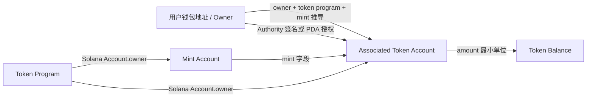
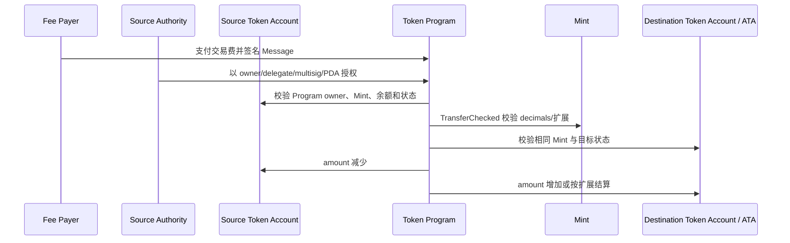
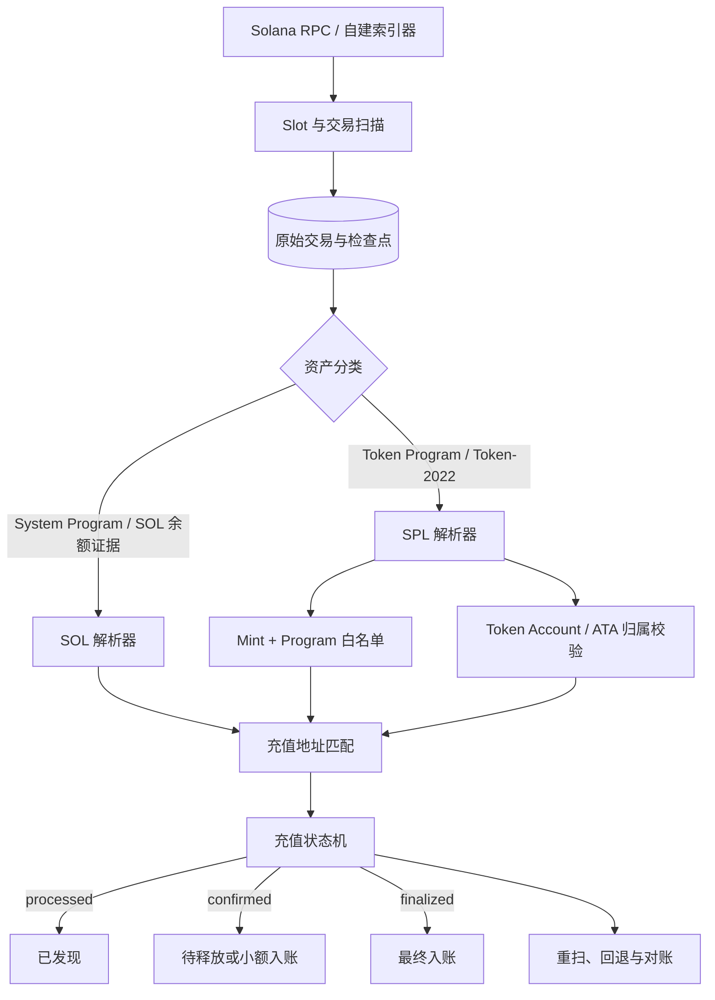
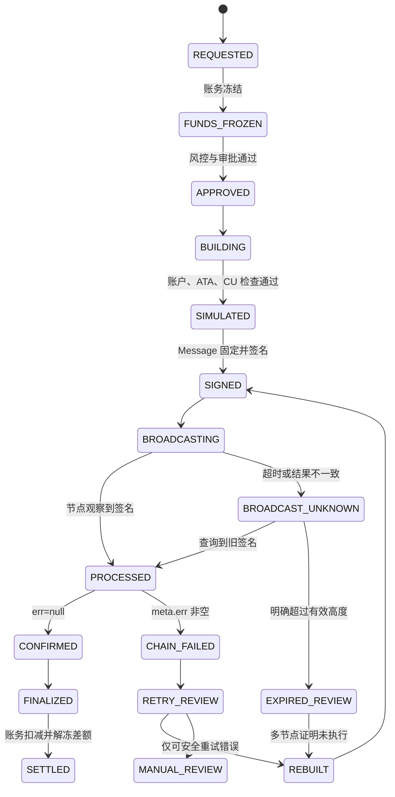

# Day 11：SPL Token、ATA 与 Solana 钱包工程

> 学习目标：掌握 Mint、Token Account、Associated Token Account（ATA）及 SPL Token 转账模型；能够解析 Token Balance 变化，设计 SOL/SPL 充值识别与 Solana 提币恢复流程；理解账户创建与关闭、精度、Compute Budget、Durable Nonce、RPC 限流和多节点容灾。  
> 建议用时：4～5 小时  
> 完成标准：仅使用 Devnet、Testnet、本地验证器或确定性夹具；解析一笔 SPL Token 转账并标出 Mint、源 Token Account、目标 Token Account、Authority 和实际数量；完成 SOL/SPL 充值流程与提币异常矩阵，并闭卷回答文末恰好 7 道面试题。

## 安全边界与版本说明

- 只使用无价值测试密钥，不提交助记词、私钥、RPC API Key、生产地址映射或原始签名材料。
- 不伪造测试网交易签名。网络不可用时使用明确标注的 RPC 模板或固定夹具，实验记录留空等待真实验证。
- “SPL Token”可能由经典 Token Program 或 Token-2022 Program 管理。生产解析必须按实际 Program ID 和扩展字段处理，不能假设所有 Mint 都遵循最简单布局。
- 资产身份必须绑定 `cluster + tokenProgramId + mint`。名称、Symbol、Logo、浏览器标签和 decimals 都不能单独证明资产真实性。
- ATA 是规范化 Token Account 地址，不代表某 owner 对某 Mint 只能有一个 Token Account；充值扫描不能只看用户钱包地址。
- RPC 返回 signature 或单节点暂时查不到交易都不是最终业务结论；广播未知时先查询和重播同一签名交易，不能直接重签付款。
- Durable Nonce 不是业务幂等键，也不是提高吞吐的通用方案。Nonce Account 是可变共享状态，错误并发会导致旧 nonce 或账户锁问题。

---

## 一、SPL Token 的账户模型

### 1. Mint Account

Mint Account 描述一种 Token 的发行规则和基础元数据。核心字段通常包括：

| 字段 | 含义 | 钱包工程关注点 |
|---|---|---|
| `mintAuthority` | 可增发 Token 的权限，可为空 | 高风险权限是否仍存在 |
| `supply` | 当前总供应量，使用最小单位整数 | 不使用浮点数 |
| `decimals` | UI 展示精度 | 只能来自可信 Mint 链上状态/配置 |
| `isInitialized` | 是否初始化 | 未初始化不能作为支持资产 |
| `freezeAuthority` | 可冻结 Token Account 的权限，可为空 | 存在冻结与运营风险 |
| extensions | Token-2022 扩展 | 转账费、不可转移、永久代理等可能改变语义 |

Mint Account 的地址就是资产身份的重要部分，但仍需同时校验：

```text
cluster
mint address
account owner == expected token program
supported token program
asset configuration status
risk review version
```

两个 Mint 即使 Symbol、名称和 decimals 完全相同，也是不同资产。交易所必须使用 Mint 白名单，不按文本元数据识别充值。

### 2. Token Account

Token Account 保存“某个 owner 对某个 Mint 的余额与权限状态”。经典字段包括：

| 字段 | 含义 |
|---|---|
| `mint` | 该账户存放哪一种 Token |
| `owner` | Token 所有者/Authority，而非账户数据的 Program owner |
| `amount` | 最小单位余额 |
| `delegate` | 可选委托者 |
| `state` | Uninitialized、Initialized、Frozen |
| `isNative` | 是否为 wrapped SOL 相关账户 |
| `delegatedAmount` | 委托可使用额度 |
| `closeAuthority` | 可选关闭权限 |

这里有两个不同的 owner：

```text
Solana Account.owner = Token Program / Token-2022 Program
Token Account data.owner = 用户、公钥、PDA 或其他 Authority
```

前者表示哪个 Program 能解释和修改账户数据，后者表示 Token Program 在执行业务指令时认可的余额控制者。解析器必须区分。

### 3. Associated Token Account（ATA）

ATA 是由 owner、Mint 和 Token Program 确定性推导出的规范 Token Account。概念 seeds 为：

```text
[owner, tokenProgramId, mint]
```

并以 Associated Token Account Program 为派生 Program。可表示为：

```text
ATA = derive(owner, tokenProgramId, mint, associatedTokenProgramId)
```

因此同一个 owner 和 Mint，在经典 Token Program 与 Token-2022 Program 下推导结果可能不同；不能漏掉 Token Program 维度。

ATA 的价值：

- 收款方无需链外协商随机 Token Account 地址；
- 客户端可确定性计算标准收款账户；
- 可由付款方或第三方支付创建费用；
- 便于钱包展示默认余额。

但 ATA 不是“用户地址本身”，也不是唯一合法 Token Account。用户还可以拥有多个普通 Token Account；托管钱包可明确只接受指定 ATA，也可扫描所有已登记 Token Account，但策略必须清晰。

### 4. 三者关系



示例关系：

```text
User A
├─ Mint USDC-like / Token Program
│  ├─ 标准 ATA
│  └─ 可选普通 Token Account 1..N
└─ Mint TEST / Token-2022 Program
   └─ 另一条标准 ATA
```

---

## 二、ATA 创建、租金与关闭

### 1. 为什么收款前可能要创建 ATA

SOL 可以直接转到系统账户，但 SPL Token 必须存放在属于相应 Token Program、且 `mint` 和 Token Authority 正确的 Token Account 中。如果目标 ATA 尚不存在，普通 Token 转账不会自动把任意钱包地址变成 Token Account。

常见处理：

1. 收款方提前创建 ATA；
2. 发送方在同一交易中先幂等创建 ATA，再执行转账；
3. 交易所地址服务预创建支持资产的 ATA；
4. 对长尾资产按需创建，但必须先通过资产白名单和成本控制。

Associated Token Account Program 支持幂等创建流程时，应优先使用当前 SDK 提供的 idempotent 指令，避免并发创建导致整笔交易失败。但仍需检查实际 Token Program、Mint 和 owner。

### 2. 创建 ATA 的账户和资金

创建流程通常涉及：

- Payer：支付账户所需 lamports，必须签名且可写；
- ATA：待创建的 PDA，可写；
- Wallet Owner：最终 Token Authority，通常不必为“创建 ATA”签名；
- Mint；
- System Program；
- Token Program；
- Associated Token Account Program。

创建方支付的 lamports 不代表创建方拥有 Token。ATA 内部 authority 仍是指定 owner。

### 3. 租金豁免余额

账户占用链上存储，需要满足当前集群的最低余额要求。创建前可调用：

```text
getMinimumBalanceForRentExemption(accountDataLength)
```

不要硬编码租金金额；Token-2022 扩展会改变账户长度。应按目标 Program 与扩展计算实际空间，再从节点获取当前最低余额。

日常语言常说“租金”，但生产实现应理解为账户需要维持租金豁免所需余额。关闭 Token Account 时，可回收其 lamports 到指定 destination。

### 4. 关闭 Token Account

经典 Token Account 通常要求 Token 余额为 0 后才能关闭；wrapped SOL 等场景有特殊语义，应按 Program 规则处理。关闭指令需要有效 Authority，并把账户中的 lamports 转给关闭目标。

关闭风险：

- 关闭后向旧地址转 Token 可能失败，除非重新创建兼容账户；
- 交易所若公开充值 ATA 后关闭，会影响后续用户充值体验；
- 创建与关闭反复执行会消耗交易费并增加状态复杂度；
- `closeAuthority` 可能不同于 Token Account owner；
- Token-2022 扩展可能增加额外限制。

托管钱包通常不会仅因余额归零就立即关闭所有公开充值 ATA。应根据地址复用、预计后续充值、存储成本和运营策略决定。

### 5. 并发创建

两个实例同时发现 ATA 不存在并发送创建交易：

```text
实例 A：create ATA + transfer
实例 B：create ATA + transfer
```

若使用非幂等创建，其中一笔可能因账户已存在失败，并导致同交易后续转账不执行。安全设计：

- 业务单有唯一幂等键；
- 优先使用幂等 ATA 创建指令；
- 广播未知时按 signature 查询，不立即构建独立付款；
- 解析链上结果确认 ATA 的 owner、mint、authority；
- 创建费用由明确的 Payer 预算与限额控制。

---

## 三、SPL Token 转账指令

### 1. `Transfer` 与 `TransferChecked`

经典 Token Program 常见两种转账：

```text
Transfer(source, destination, authority, amount)
TransferChecked(source, mint, destination, authority, amount, decimals)
```

`TransferChecked` 显式携带 Mint 和 decimals，由 Program 校验 decimals 与 Mint 一致，更适合客户端避免精度配置错误。无论使用哪一种，链上金额最终都是整数最小单位。

授权者可以是：

- Token Account owner；
- 已授权 delegate，且不超过 delegated amount；
- 多签账户满足阈值的签名集合；
- PDA 在 CPI 中通过 `invoke_signed` 授权。

不能仅凭交易 Fee Payer 推断 Token 的实际发送方。

### 2. 金额与精度

链上原始数量：

```text
rawAmount = integer
```

UI 数量：

$$
uiAmount = \frac{rawAmount}{10^{decimals}}
$$

例如 `rawAmount=1234567`、`decimals=6`：

$$
uiAmount=1.234567
$$

Java 实现原则：

```text
rawAmount: BigInteger
uiAmount: BigDecimal(rawAmount).movePointLeft(decimals)
```

反向转换必须要求输入小数位不超过 decimals，并精确转换：

```text
raw = uiAmount.movePointRight(decimals).toBigIntegerExact()
```

禁止使用 `double`，禁止按前端展示字符串进行资金入账，也不能信任指令中声称的 decimals 而不校验 Mint。

### 3. Token-2022 对转账语义的影响

Token-2022 可启用扩展，例如转账费、Transfer Hook、Memo Transfer、Default Account State、Permanent Delegate、NonTransferable 等。影响包括：

- 发送金额不一定等于目标可用增加量；
- 一部分数量可能成为 withheld fee；
- 转账可能要求额外账户或 Memo；
- 账户可能默认冻结；
- 实际调用会触发额外 Program。

因此资产接入必须保存：

```text
mint
programId
extensions snapshot
supported behavior version
risk status
```

充值以经验证的 Token Balance 实际变化和协议规则为准，不仅依赖一条“transfer”指令的 amount。

### 4. 一笔转账的参与者



Fee Payer、Source Authority 和 Source Token Account 可以是三个不同地址。解析时必须分别标注。

---

## 四、解析一笔 SPL Token 测试网转账

> 使用真实 Devnet/Testnet signature 填写实验记录。网络不可用时只执行固定夹具解析，不得虚构交易证据。

### 1. 获取交易

```json
{
  "jsonrpc": "2.0",
  "id": 1,
  "method": "getTransaction",
  "params": [
    "<DEVNET_OR_TESTNET_SIGNATURE>",
    {
      "commitment": "confirmed",
      "encoding": "jsonParsed",
      "maxSupportedTransactionVersion": 0
    }
  ]
}
```

必须记录 `cluster`。资产配置和充值唯一键都应绑定集群，避免把 Devnet Mint 当成 Mainnet 资产。

### 2. 基础交易检查

记录：

```text
signature
slot
blockTime
version
fee payer
recentBlockhash
meta.err
meta.fee
computeUnitsConsumed
```

只有 `meta.err == null` 才可能存在成功的 Token 状态变更。仍需验证 Program、Mint、Token Account 和实际余额变化。

### 3. 找出 Token 指令

检查：

```text
transaction.message.instructions
meta.innerInstructions
```

Token 转账可能是：

- 顶层 `transfer` / `transferChecked`；
- 某 Program CPI 产生的内部 Token 转账；
- 带 ATA 创建、Compute Budget、Memo 的组合交易；
- Token-2022 Program 指令。

不能只扫描顶层 parsed instruction。DeFi、支付和自定义程序经常通过 CPI 转移 Token。

对每条候选转账标出：

| 字段 | 内容 |
|---|---|
| `instructionPath` | 顶层/内部稳定路径，如 `2`、`2.1` |
| `programId` | Token Program 或 Token-2022 Program |
| `type` | transfer / transferChecked / 其他扩展转账 |
| `source` | 源 Token Account |
| `destination` | 目标 Token Account |
| `authority` | owner/delegate/multisig/PDA |
| `mint` | 从指令或账户状态解析 |
| `rawAmount` | 指令声明的最小单位数量 |
| `decimals` | Mint 链上值 |

### 4. 从 Token Balance 数组恢复实际变化

RPC `meta` 常提供：

```text
preTokenBalances[]
postTokenBalances[]
```

常见字段：

```text
accountIndex
mint
owner
programId
uiTokenAmount.amount
uiTokenAmount.decimals
uiTokenAmount.uiAmountString
```

推荐使用：

```text
uiTokenAmount.amount      // 字符串形式的原始整数
uiTokenAmount.decimals    // 校验用
```

不要使用浮点 `uiAmount` 做资金计算。

按完整解析后的 `accountIndex` 关联账户地址：

```text
resolvedAccountKeys = static keys
                    + loaded writable addresses
                    + loaded readonly addresses
```

变化量：

$$
\Delta_i=postRawAmount_i-preRawAmount_i
$$

对目标 Token Account：

```text
destinationDelta > 0
```

才表示该账户实际增加。对于关闭或新建账户，一侧余额记录可能缺失，应把缺失解释为 0 的前提建立在账户生命周期证据和 Program 解析之上，而不是无条件填零。

### 5. 为什么不能只看指令 amount

以下情况会让“指令 amount”与“用户实际到账量”不同或不足以证明充值：

- Token-2022 转账费；
- 多条 Token 转账在同一交易中抵消或组合；
- CPI 中发生实际转账；
- 交易最终 `meta.err != null`，所有状态回滚；
- 目标 Token Account 的 Mint/Authority 不符合交易所配置；
- source 使用 delegate，Fee Payer 并非实际发送者；
- 解析器识别了错误 Program 或错误指令布局。

业务入账应综合：成功状态、白名单 Program+Mint、目标 Token Account 归属、pre/post 实际增量和稳定的指令/余额证据。

### 6. 解析伪代码

```text
function parseSplTransfer(cluster, signature):
    tx = getTransaction(signature, confirmed, jsonParsed, version=0)
    if tx == null:
        return NOT_FOUND_AT_NODE
    if tx.meta.err != null:
        return EXECUTION_FAILED(tx.meta.err)

    keys = resolveStaticAndLoadedKeys(tx)
    tokenInstructions = decodeTopLevelAndInnerInstructions(tx, keys)
        .filter(programId in supportedTokenPrograms)

    pre = indexTokenBalances(tx.meta.preTokenBalances, keys)
    post = indexTokenBalances(tx.meta.postTokenBalances, keys)
    deltas = diffTokenBalances(pre, post)

    results = []
    for ix in tokenInstructions:
        source = loadTokenAccountEvidence(ix.source, pre, post)
        destination = loadTokenAccountEvidence(ix.destination, pre, post)
        mint = resolveAndVerifyMint(ix, source, destination)
        asset = assetRegistry.find(cluster, ix.programId, mint)

        if asset == null or asset.status != ENABLED:
            results.add(UNSUPPORTED_ASSET)
            continue
        if destination.address not in registeredDepositAccounts(asset):
            continue
        if destination.authority != expectedWalletOwner(destination.address):
            results.add(OWNERSHIP_MISMATCH)
            continue

        actualDelta = deltas[destination.address, mint, ix.programId]
        results.add({
            instructionPath: ix.path,
            sourceTokenAccount: ix.source,
            destinationTokenAccount: ix.destination,
            authority: ix.authority,
            mint: mint,
            rawInstructionAmount: ix.amount,
            actualDestinationDelta: actualDelta,
            decimals: asset.decimals
        })

    return persistIdempotently(
        uniqueKey=(cluster, signature, instructionPath,
                   tokenProgramId, mint, destinationTokenAccount),
        results=results,
        slot=tx.slot,
        commitment=observedCommitment)
```

一笔交易可能有多次相同 Mint 到同一目标的转账。若只使用聚合 balance delta，可能无法精确映射每条指令；业务唯一键和解析器必须定义稳定策略，必要时结合指令路径、内部调用和整体净变化人工审查。

### 7. 实验记录

| 字段 | 实验值 |
|---|---|
| Cluster |  |
| Signature / Slot |  |
| Version / Commitment |  |
| Fee Payer |  |
| Token Program ID |  |
| Mint |  |
| Mint decimals / extensions |  |
| Source Token Account |  |
| Source Authority |  |
| Destination Token Account |  |
| Destination Authority |  |
| Destination 是否标准 ATA |  |
| Instruction path / type |  |
| Raw instruction amount |  |
| Pre/Post raw amount |  |
| Actual destination delta |  |
| `meta.err` / fee / CU |  |
| 最终业务结论 |  |

---

## 五、SOL 与 SPL Token 充值识别

### 1. 统一架构



统一的是扫描、幂等、Commitment 状态和账务接口；不可强行统一的是资产识别证据：SOL 看 lamports 和 System/程序语义，SPL 看 Token Program、Mint、Token Account 与 token balance delta。

### 2. SOL 充值识别

对于简单 System Program transfer，可验证：

- `meta.err == null`；
- Program ID 为可信 System Program；
- 目标系统账户属于交易所；
- lamports 指令金额与余额变化相符；
- 排除 Fee Payer 费用、创建账户、关闭账户、奖励和多指令影响；
- 达到配置的 Commitment。

复杂 Program 可能通过 CPI 转移 SOL，因此只看顶层 System transfer 会漏扫；只看目标余额净增又可能把租金回收或内部资金调度误判为用户充值。生产规则需定义支持的来源语义和人工兜底。

### 3. SPL Token 充值识别

必须验证：

```text
cluster == asset.cluster
programId == asset.tokenProgramId
mint == asset.mint
destinationTokenAccount in registered accounts
destination token authority matches exchange mapping
meta.err == null
actual destination raw delta > 0
commitment >= policy
```

不能只匹配 owner 的主钱包地址，因为 Token 实际进入 Token Account。若交易所为每用户维护独立 ATA，应建立：

```text
(userId, cluster, mint, tokenProgramId, owner, tokenAccount)
```

并在绑定时验证 tokenAccount 确实是期望 ATA 或已批准的普通 Token Account。

### 4. 充值唯一键

建议候选：

```text
(cluster, signature, instructionPath,
 tokenProgramId, mint, destinationTokenAccount)
```

但必须根据解析证据测试：

- 多条相同指令；
- 内部 CPI；
- 一笔交易多个目标；
- 新建/关闭 Token Account；
- Token-2022 fee 与 hook；
- 历史重扫解析器升级。

账务入账再使用独立 `depositId` 唯一键。扫链至少一次、数据库唯一约束和不可变账务流水共同实现业务幂等。

### 5. 状态机

```text
DISCOVERED_PROCESSED
    -> CONFIRMED_VALIDATED
    -> CREDIT_PENDING / CREDITED
    -> FINALIZED

任一阶段发现：
    meta.err / mint 不支持 / 归属不匹配
    -> REJECTED_OR_REVIEW

Commitment 回退或规范链证据消失：
    -> REORG_REVIEW
    -> 冻结、回滚或补偿
```

不要删除已入账记录。分叉补偿应使用反向账务流水，并保留原 signature、slot、解析版本和状态迁移审计。

### 6. 假币与错误网络

攻击者可创建同名、同 Symbol、同 decimals 的 Mint，甚至伪造 Logo。防护：

- 后台白名单固定 `cluster + tokenProgramId + mint`；
- 双人审核资产配置与变更；
- 启动和定期任务读取 Mint owner、decimals、authority、扩展并对账；
- 配置漂移立即暂停该资产自动入账；
- 未知 Mint 只保存观察记录，不给用户记账。

---

## 六、Solana 提币构建流程

### 1. SPL Token 提币步骤

```text
1. 业务幂等、余额冻结、风控审批
2. 选择资产配置与源 Token Account
3. 校验目标 owner 地址与目标 ATA
4. 判断 ATA 是否存在且 owner/mint/program 正确
5. 必要时加入幂等创建 ATA 指令
6. 加入 Compute Budget 指令
7. 加入 transferChecked 或支持的扩展转账指令
8. 获取 blockhash + lastValidBlockHeight
9. simulateTransaction
10. 独立签名策略解码与审批
11. 签名并持久化完整 signed bytes
12. 多节点广播相同 bytes
13. 按 signature 跟踪 processed/confirmed/finalized 与 meta.err
14. 更新账务和对账
```

### 2. 发送地址与账户资源

一次 SPL 提币至少涉及：

- Fee Payer SOL 余额；
- 源 Token Account Token 余额；
- Source Authority 签名或 PDA 授权；
- 目标 Token Account/ATA；
- Mint 和 Token Program；
- 可选 ATA Program、System Program、Memo、Compute Budget；
- Recent Blockhash 或 Durable Nonce Account。

因此“Token 余额足够”不代表可发送。还可能缺 SOL 交易费、创建 ATA 的租金豁免余额、额外签名或扩展所需账户。

### 3. 业务幂等与 attempt

一个提币业务可有多个链上 attempt，但只能形成一次成功业务效果：

```text
withdrawalId
├─ attempt 0: signature A, blockhash A
├─ attempt 1: signature B, blockhash B
└─ final winning attempt
```

关键约束：

```text
UNIQUE(withdrawal_id)
UNIQUE(cluster, signature)
UNIQUE(withdrawal_id, attempt_no)
```

新 attempt 只能由恢复协调器创建，并记录创建依据：旧 blockhash 已过期、多个节点未发现成功、账务仍冻结。不能让普通 MQ 重试自行获取新 blockhash 和签名。

---

## 七、交易模拟、Compute Budget 与 Priority Fee

### 1. 模拟前后顺序

推荐流程：

```text
构建候选交易
 -> 初次模拟，获取 err/logs/unitsConsumed
 -> 计算 CU limit 安全余量
 -> 获取优先费参考
 -> 加入最终 Compute Budget 指令
 -> 再次模拟最终 Message
 -> 校验费用上限
 -> 签名
```

加入或修改 Compute Budget 指令会改变 Message，签名后不能再改。

### 2. 模拟可发现什么

- 源 Token 余额不足；
- 目标 ATA 不存在或账户类型错误；
- Mint、decimals、Token Program 不匹配；
- Authority 未签名、delegate 额度不足；
- Token Account Frozen；
- Compute Unit 不足；
- Program 自定义错误与日志；
- Token-2022 扩展要求的额外账户/Memo/Hook；
- Fee Payer 余额或账户状态问题；
- 交易大小、账户数量和部分运行时限制。

模拟成功不能保证上链成功：账户状态、余额、blockhash、账户锁和 leader/费用市场会变化。模拟是预检，不是承诺。

### 3. Compute Unit Limit

可按实测消耗增加有上限的余量：

```text
estimated = simulation.unitsConsumed
limit = min(policyMax, ceil(estimated * safetyFactor) + fixedBuffer)
```

`safetyFactor` 和上限必须按业务与 Program 历史分布配置，不应复制固定互联网参数。监控实际 `consumed / requested`，过低会失败，过高可能增加优先费成本和调度资源占用。

### 4. Priority Fee

Compute Budget Program 可设置每 CU 价格，常以 micro-lamports/CU 表示。费用选择应结合：

- 当前可写账户集合对应的本地费用市场；
- 节点/供应商的优先费估算；
- 历史确认延迟；
- 业务等级；
- 最大 CU price 与最大总费用；
- blockhash 剩余有效高度。

不要把 EVM 的 gas replacement 逻辑直接搬到 Solana。已签名交易的费用不能修改；要调高费用必须构建新 Message 并重签。旧交易可能仍有效，因此只有在受控恢复策略下才能生成新 attempt。

### 5. 重试分类

| 类型 | 示例 | 动作 |
|---|---|---|
| 网络暂态 | 429、超时、连接重置 | 退避、抖动、切节点；重播同一 bytes |
| 节点落后 | blockhash 未知、slot 明显落后 | 熔断节点，选择同步节点，先查 signature |
| 锁冲突 | AccountInUse | 有效期内重播/短退避，分析热点 |
| 费用不足 | 拥堵导致迟迟未处理 | 评估旧 attempt 和有效期，再受控重建 |
| 确定性业务错误 | 余额不足、账户冻结、Mint 错 | 停止自动重试，修复或人工处理 |
| Blockhash 过期 | 超有效高度且未落链 | 新 blockhash、新签名、新 attempt |
| 广播未知 | 已返回前连接断开 | 先查旧 signature，禁止立即重签 |

重试必须有次数、时间、总费用和并发上限，防止 429 或链拥堵被重试放大。

---

## 八、Durable Nonce

### 1. 它解决什么问题

普通 Recent Blockhash 有较短有效窗口，不适合签名收集、离线审批或冷签耗时很长的流程。Durable Nonce 使用一个链上 Nonce Account 保存 nonce 值，让交易在普通 blockhash 窗口之外仍可保持可用，直到 nonce 被推进或交易被处理。

典型场景：

- 冷钱包离线签名；
- 多人审批或多签收集时间不可预测；
- 需要预先签名并延后广播的受控运维；
- 灾备流程中无法保证普通 blockhash 有效期。

普通在线热钱包高频提币一般优先使用 Recent Blockhash；Durable Nonce 带来共享状态、串行和恢复复杂度，不是默认优化。

### 2. Nonce Account

Nonce Account 由 System Program 管理，包含：

- 当前 durable nonce 值；
- nonce authority；
- 维持账户所需 lamports；
- 当前版本要求的相关状态。

使用 durable nonce 的交易需要包含推进 nonce 的 System Program 指令，并满足运行时对指令位置和 authority 的规则。实现必须使用当前 SDK 生成，不手工猜编码。

### 3. 核心语义

成功处理 durable nonce 交易时，Nonce Account 被推进到新值，旧签名交易无法再次成功使用旧值。即使后续业务指令失败，也不能想当然认为 nonce 未推进；必须查询链上 Nonce Account、交易 `meta.err` 和实际执行规则再恢复。

生产上将每个 Nonce Account 视作独占资源：

```text
AVAILABLE
 -> RESERVED
 -> SIGNED
 -> BROADCAST_UNKNOWN / PROCESSED
 -> ADVANCED
 -> AVAILABLE_WITH_NEW_NONCE
```

数据库必须绑定：

```text
nonceAccount
nonceValue
businessId
attemptId
signedTransaction
reservationVersion
status
```

### 4. 限制与风险

- 一个 Nonce Account 同一 nonce 值只能安全绑定一个业务 attempt；
- 并发复用会让交易竞争，先推进者使其他签名失效；
- Nonce Account 是可写热点，会带来账户锁和吞吐瓶颈；
- authority 丢失或权限错误会使恢复困难；
- 推进 nonce 的交易仍需支付费用并满足账户规则；
- 不能把 durable nonce 当用户提现幂等键；
- 需要池化时，每个账户必须数据库独占预留和链上对账；
- 广播未知后不能立即把 Nonce Account 分配给新业务。

### 5. Durable Nonce 恢复

```text
function reconcileDurableNonce(attempt):
    onChain = getNonceAccount(attempt.nonceAccount)
    status = querySignatureAcrossHealthyNodes(attempt.signature)

    if status.found:
        updateFromChain(status)
        return

    if onChain.nonceValue == attempt.nonceValue:
        // 旧交易可能仍有效
        rebroadcastSameSignedBytes()
        keepReservation()
        return

    if onChain.nonceValue != attempt.nonceValue:
        // nonce 已推进，必须查明由哪笔交易推进
        scanNonceAccountTransactions()
        if expectedAttemptConsumedNonce:
            classifyByMetaErrAndBusinessEffect()
        else:
            pausePoolAndRaiseSecurityIncident()
```

仅看到 signature 查不到不够；还要看 Nonce Account 当前值是否已变化。

---

## 九、RPC 限流与多节点容灾

### 1. 请求分类

| 请求类型 | 典型 RPC | 特点 | 策略 |
|---|---|---|---|
| 链头/健康 | `getSlot`、`getBlockHeight`、`getHealth` | 高频轻量 | 多节点探测、短缓存 |
| 构建 | `getLatestBlockhash`、账户查询 | 要求新鲜一致 | 选择同步节点，绑定返回节点/上下文 |
| 模拟 | `simulateTransaction` | 资源较重 | 限流、隔离线程池、按业务优先级 |
| 广播 | `sendTransaction` | 非幂等结果语义敏感 | 多写节点发送同一 bytes，记录逐节点结果 |
| 状态跟踪 | `getSignatureStatuses` | 可批量 | 合并签名、指数退避、分层轮询 |
| 历史解析 | `getTransaction`、`getBlock` | 数据大/可能裁剪 | 历史节点或索引器、并发配额 |
| 账户扫描 | `getProgramAccounts` | 重型 | 避免在线高频全量调用，使用索引器 |

### 2. 429 与退避

收到限流时：

- 遵守 `Retry-After`（若提供）；
- 指数退避 + 随机抖动；
- 对相同 signature 状态查询做批量合并；
- 区分用户实时查询与后台历史回补；
- 每节点独立令牌桶和熔断；
- 设置全局重试预算，避免切节点后把所有供应商打挂；
- 不把 RPC 429 误判为链上交易失败。

### 3. 节点健康评分

至少观察：

```text
latest slot lag
block height lag
RPC latency/error rate
429 rate
getTransaction availability
send acceptance/unknown rate
WebSocket reconnect rate
version/capability support
```

节点池可分为：

- **Read-head pool**：读取链头、blockhash、账户；
- **Broadcast pool**：发送已签名交易；
- **History pool**：查询历史交易/区块；
- **Archive/indexer**：长期扫描与复杂检索。

读写分离不意味着可以忽略一致性。构建使用的 blockhash 必须被广播节点识别；若节点 slot 落后或分叉不同，应熔断并重新评估，而不是把 `BlockhashNotFound` 一律当交易过期。

### 4. 多节点广播

向多个节点发送的是**完全相同的 signed bytes**：

```text
Node A -> 返回 signature
Node B -> already processed / duplicate
Node C -> timeout
```

只要至少一个健康节点明确接受，进入跟踪状态；全部超时则为 `BROADCAST_UNKNOWN`。重复广播相同 bytes 不会创建新 signature，但新 blockhash 重签会创建新 attempt。

### 5. WebSocket 与轮询

WebSocket `signatureSubscribe` 可降低确认延迟，但连接可能断开、漏通知或供应商重置。资金系统必须有轮询兜底：

```text
WebSocket 负责低延迟通知
getSignatureStatuses 负责批量真值核验
getTransaction 负责执行结果与业务解析
slot 扫描/索引器负责漏单修复
```

不能只依赖订阅回调完成入账或提币结算。

---

## 十、签名状态查询与未知结果

### 1. 查询层次

`getSignatureStatuses` 可批量查询：

```text
slot
confirmations
err
confirmationStatus
```

判断顺序：

1. 返回非空：检查 `err`，再看 commitment；
2. 返回空：只是该节点当前查不到；
3. 若交易仍在 blockhash 有效期：重播同一 bytes 并继续查询；
4. 若节点落后：切换健康节点；
5. 若明确过期且多节点未处理：才允许新 attempt；
6. 历史交易需要配置历史搜索或历史节点，但需注意成本与供应商能力。

### 2. RPC 返回 signature 后查询不到

可能原因：

- RPC 在转发前/后响应时连接异常；
- 接收节点尚未向网络传播；
- 查询节点未见到该交易；
- 节点落后或处于不同分叉；
- blockhash 已接近过期，交易未被 leader 接收；
- 交易曾在短分叉 processed 后消失；
- 历史数据被裁剪或查询未启用历史搜索；
- signature 记录/cluster 使用错误。

安全流程：

```text
校验 cluster + signature + signed bytes
 -> 查询多个健康节点
 -> 查询 blockhash / lastValidBlockHeight
 -> 有效期内重播相同 bytes
 -> 持续查询 processed/confirmed/finalized 和 meta.err
 -> 明确过期且未执行，创建新 attempt
 -> 任一 attempt 成功，停止其他重签并完成幂等结算
```

### 3. 不安全做法

- 一次查不到就标失败并解冻；
- 立刻换 blockhash 重签；
- 更换源 Token Account 或 Fee Payer 后当作普通网络重试；
- 每个节点独立构建交易；
- 只看 `sendTransaction` HTTP 200，不查 `meta.err`；
- 只查新 signature，忘记旧 attempt；
- 过期依赖墙钟而不是 last valid block height；
- 让 MQ 重复消息绕过业务幂等创建多个提币。

---

## 十一、Solana 提币状态机



关键状态要求：

- `BROADCAST_UNKNOWN` 保持资金冻结；
- `CHAIN_FAILED` 仍可能已支付交易费；
- 新 attempt 不覆盖旧 signature；
- `CONFIRMED` 是否结算由金额/风险策略决定；
- Durable Nonce attempt 还要跟踪 Nonce Account 是否推进；
- 目标 ATA 创建成功但后续转账失败时，若不在同一原子交易中，需单独对账创建费用和账户状态。

---

## 十二、异常状态与恢复矩阵

| 异常状态 | 可能原因 | 关键证据 | 恢复动作 |
|---|---|---|---|
| `ATA_NOT_FOUND` | 目标 ATA 未创建 | `getAccountInfo`、派生地址 | 加入幂等创建 ATA 后重新模拟 |
| `ATA_MISMATCH` | 地址对应错误 Mint/owner/program | 账户 data、Program owner | 停止，禁止向错误账户付款 |
| `INVALID_MINT` | 假币或资产配置错误 | Mint+Program+cluster 白名单 | 拒绝自动处理并人工审核 |
| `DECIMALS_MISMATCH` | 配置或指令精度错误 | Mint decimals | 修复配置，使用精确整数重建 |
| `INSUFFICIENT_TOKEN` | 源 Token Account 余额不足 | 链上 amount 与内部预留 | 暂停该源账户，调度资金并对账 |
| `INSUFFICIENT_SOL` | Fee/ATA 创建资金不足 | Fee Payer lamports | 补充 SOL，检查水位和重复补充 |
| `ACCOUNT_FROZEN` | freeze authority 冻结 | Token Account state | 停止自动重试，资产/合规审查 |
| `DELEGATE_LIMIT` | 委托额度不足 | delegate/delegatedAmount | 改用合法 authority 或重新审批 |
| `TRANSFER_HOOK_FAILED` | Token-2022 Hook 拒绝/缺账户 | extensions、logs | 按已支持扩展补充账户，否则暂停资产 |
| `COMPUTE_EXCEEDED` | CU limit 不足 | 模拟和链上 consumed/logs | 有界提高 limit，重建并重签 |
| `ACCOUNT_IN_USE` | 热点账户锁冲突 | 错误、Writable 集合 | 退避重播；长期分片/限流 |
| `BLOCKHASH_NOT_FOUND` | 节点落后或 blockhash 过期 | 节点 slot、有效高度 | 先切健康节点和查旧签名，再决定重建 |
| `BROADCAST_UNKNOWN` | timeout/5xx/断连 | 广播尝试、signed bytes | 多节点查签名并重播同一 bytes |
| `SIGNATURE_NOT_FOUND` | 未传播、分叉、节点裁剪 | 多节点状态、有效高度 | 保持未知；明确过期后新 attempt |
| `CHAIN_FAILED` | `meta.err != null` | getTransaction、logs | 分类确定性/暂态；记录已付 fee |
| `PROCESSED_DROPPED` | 短分叉被放弃 | slot/多节点 commitment | 回退状态并继续查询或过期恢复 |
| `RPC_429` | 供应商限流 | HTTP 与节点指标 | Retry-After、退避抖动、批量与切池 |
| `RPC_DIVERGENCE` | 节点落后/分叉/裁剪 | 节点 slot、blockhash、status | 隔离异常节点，基于健康多数和链证据 |
| `DURABLE_NONCE_STALE` | Nonce 已被推进 | Nonce Account 当前值 | 查推进交易，不重播旧 nonce |
| `DURABLE_NONCE_CONFLICT` | 同 nonce 绑定多个业务 | DB 预留与链记录 | 暂停 Nonce 池，安全事件与账务对账 |
| `SETTLEMENT_MISMATCH` | 链成功内部未扣/重复扣 | signature、业务幂等、账本 | 以不可变流水补偿，禁止直接改余额 |

### 自动重试分类

**允许自动重播相同 bytes：**

- RPC timeout；
- 连接重置；
- 部分节点查不到；
- 暂态传播失败；
- signed transaction 仍在有效期内。

**需要重建和重签：**

- blockhash 明确过期且旧 attempt 未执行；
- 可安全修复的 Compute Budget；
- 经审批变更目标 ATA 创建组合或费用配置。

**禁止自动重试：**

- Mint/Program/目标归属不匹配；
- 未知业务效果；
- Durable Nonce 被未知交易推进；
- 账户冻结或合规拒绝；
- 多个 attempt 可能已成功；
- 账务状态不一致。

---

## 十三、数据库模型与幂等

### 1. `solana_asset`

| 字段 | 含义 |
|---|---|
| `cluster` | 集群 |
| `token_program_id` | Token Program / Token-2022 |
| `mint` | Mint 地址 |
| `symbol/display_name` | 仅展示 |
| `decimals` | 已核验精度 |
| `extensions_json/hash` | 扩展快照 |
| `deposit/withdraw_status` | 充提开关 |
| `min_deposit/max_withdraw` | 风险配置 |
| `config_version` | 审计版本 |

唯一约束：

```text
UNIQUE(cluster, token_program_id, mint)
```

### 2. `solana_token_account_binding`

保存：

```text
user_id
cluster
asset_id
wallet_owner
 token_account
is_associated
status
verified_slot
binding_version
```

约束：

```text
UNIQUE(cluster, token_account)
UNIQUE(user_id, asset_id, token_account)
```

若策略规定每用户每资产只有一个有效充值 ATA，可增加条件唯一约束或在事务中保证；不要误认为协议天然只允许一个 Token Account。

### 3. `solana_withdrawal_attempt`

保存：

```text
withdrawal_id
attempt_no
signature
message_hash
signed_tx_reference
blockhash
last_valid_block_height
nonce_account / nonce_value
source_token_account
destination_token_account
mint / token_program_id
raw_amount / decimals
fee_payer
cu_limit / cu_price
status / meta_err
slot / commitment
```

约束：

```text
UNIQUE(cluster, signature)
UNIQUE(withdrawal_id, attempt_no)
```

业务主表 `withdrawal_id` 必须唯一，账务冻结、审批、attempt 创建和 Outbox 事件通过事务/唯一索引关联。

### 4. `solana_deposit`

保存：

```text
cluster
signature
instruction_path
asset_id
mint
token_program_id
destination_token_account
wallet_owner
raw_amount
decimals
slot
commitment
status
parser_version
ledger_entry_id
```

唯一键根据解析器规则固定，例如：

```text
UNIQUE(cluster, signature, instruction_path,
       asset_id, destination_token_account)
```

扫描重复、WebSocket 重复通知和历史重扫都必须命中同一记录，账务再通过 `deposit_id` 做第二层幂等。

---

## 十四、故障演练与监控

### 1. 演练场景

#### 场景 A：创建 ATA 后广播超时

- 保留 signed bytes 和 signature；
- 查询多个节点；
- blockhash 有效时重播同一 bytes；
- 不再单独创建第二个 ATA/转账业务；
- 若整笔交易原子包含创建+转账，检查 `meta.err` 决定二者是否提交；
- 明确过期未执行后才重建。

#### 场景 B：RPC 返回 signature，但 30 秒查不到

- 确认 cluster、signature 和节点 slot；
- 查询广播节点与独立节点；
- 检查 lastValidBlockHeight；
- 仍有效则重播相同 bytes；
- 不解冻、不重签；
- 超有效高度且多节点无记录后进入过期恢复。

#### 场景 C：Token-2022 目标增加小于指令 amount

- 核验 Mint 扩展与 transfer fee；
- 读取 pre/post Token Balance 和 withheld fee 状态；
- 按资产接入规则决定入账净额；
- 若解析器不支持扩展，暂停自动入账；
- 不能按指令 amount 多记账。

#### 场景 D：Durable Nonce signature 查不到

- 查询 Nonce Account 当前 nonce；
- 若未变化，旧交易仍可能有效，保持预留并重播；
- 若已变化，查谁推进了 nonce；
- expected attempt 则按 `meta.err` 和业务效果处理；
- 未知交易推进则暂停整个 Nonce 池。

#### 场景 E：多节点状态不一致

- 比较各节点 slot、block height 和版本能力；
- 隔离明显落后节点；
- 不用“任意一个 null”覆盖其他节点成功证据；
- 以更强 commitment 的链上记录和 `getTransaction` 结果对账；
- 证据不足保持未知，禁止重复付款。

### 2. 关键指标

- SOL/SPL 扫描 slot 差与 finalized root 差；
- 支持 Mint 的充值数量、金额和未知 Mint 次数；
- ATA 创建成功率、重复创建率与创建成本；
- Token Account owner/mint/program 不匹配告警；
- pre/post delta 与指令 amount 不一致率；
- Token-2022 各扩展交易量与解析失败率；
- 模拟失败按 Program/Error 分类；
- CU 估算误差、CU 利用率和优先费分布；
- blockhash 剩余高度、过期率和重签率；
- broadcast unknown、signature not found 和最终恢复时长；
- RPC P95/P99、429、5xx、slot lag 与节点分歧；
- WebSocket 重连、漏通知补扫数量；
- Durable Nonce 池 available/reserved/unknown 数量；
- 提币 attempt 数量、重复业务效果和账务差异；
- Fee Payer SOL 水位、源 Token Account 余额水位。

### 3. 高优先级告警

- 支持资产 Mint 或 Token Program 配置漂移；
- 同一业务观察到多个成功 attempt；
- Durable Nonce 被未知交易推进；
- 链成功但账务未结算，或账务成功但链证据缺失；
- 充值目标 Token Account 归属不匹配；
- 解析器遇到未知交易版本/Token-2022 扩展；
- 所有 RPC 同时限流或 slot 明显落后；
- Fee Payer 或源 Token Account 低于安全水位；
- confirmed 充值大规模回退或节点分叉异常。

---

## 十五、口头面试题参考答案

> 本节严格包含计划中的 7 道题。先闭卷口述，再按“结论 → 原理 → 生产实现 → 异常与风险 → 监控和恢复”补全。

### 1. 用户地址、ATA 和 Mint 之间是什么关系？

**参考回答：**

Mint 表示一种 Token；Token Account 保存该 Mint 的余额；用户地址通常作为 Token Account 内部的 authority。ATA 是由用户 owner、Token Program 和 Mint 确定性派生的标准 Token Account，因此同一用户对不同 Mint 有不同 ATA，同一 Mint 在经典 Token Program 与 Token-2022 下也要区分 Program。

ATA 不是用户主地址本身，也不是唯一合法 Token Account。用户可以拥有多个普通 Token Account。交易所应保存 `cluster + programId + mint + walletOwner + tokenAccount` 绑定，并验证账户链上 Program owner、内部 mint 和 authority，不能只按钱包地址或 Symbol 入账。

### 2. 为什么 SPL Token 收款前可能需要创建 ATA？

**参考回答：**

SPL Token 必须存入由相应 Token Program 管理、且 Mint 和 Authority 正确的 Token Account。普通钱包系统账户不能直接保存任意 Token 余额。如果收款人的标准 ATA 不存在，需要先创建并为账户存储提供租金豁免 lamports；Payer 可以是发送方或第三方，但 ATA authority 仍是收款 owner。

生产中可预创建或在转账交易中使用幂等 ATA 创建指令。创建后必须验证地址推导、Token Program、Mint 和 owner。并发创建、创建成本、Token-2022 账户长度以及公开充值 ATA 是否允许关闭都要纳入策略。

### 3. 如何判断 SPL Token 实际转账数量？

**参考回答：**

先确认交易 `meta.err == null`，解析顶层和内部 Token 指令，识别可信 Token Program、Mint、源/目标 Token Account 和 Authority。然后按完整账户索引关联 `preTokenBalances` 与 `postTokenBalances`，使用字符串 `amount` 的原始整数计算目标净增量，decimals 只用于精确展示，不能使用浮点 `uiAmount`。

不能只信指令 amount。Token-2022 转账费、CPI、多次转账、新建/关闭账户等会影响实际变化。资产身份必须匹配 `cluster + programId + mint` 白名单，目标账户还要属于交易所。对于无法精确归因的聚合变化应人工审核，不能猜测入账。

### 4. Blockhash 过期后直接重签有什么重复支付风险？

**参考回答：**

换新 blockhash 会改变 Message，因此产生新的合法 signature。若旧交易实际上已被某节点接受、落在仍可能确认的分叉，或只是当前查询节点暂时看不到，新旧交易都可能形成业务付款效果。Solana 没有 EVM 同 nonce 替换来保证只执行一笔。

所以广播未知后先按旧 signature 查询多个健康节点，并在有效期内重播相同 signed bytes。只有当前 block height 超过 `lastValidBlockHeight`，且多节点和链上证据证明旧 attempt 未执行，才创建关联的新 attempt。账务以 `withdrawalId` 幂等，并持续跟踪所有历史 signature。

### 5. 什么时候需要 Durable Nonce？

**参考回答：**

当签名或审批时间可能超过 Recent Blockhash 有效窗口，例如冷钱包离线签名、多人审批或受控延迟广播时，可使用 Durable Nonce。它把 nonce 保存在链上 Nonce Account，由 authority 授权推进，使预签交易无需依赖短 blockhash 窗口。

它不适合默认用于高频热钱包：Nonce Account 是可写共享状态，同一 nonce 值只能安全绑定一个业务，会产生串行、锁冲突和恢复复杂度。必须数据库独占预留 nonce 值，保存签名交易，广播未知时同时查询 signature 和 Nonce Account；未知交易推进 nonce 要立即暂停。

### 6. Solana 交易模拟可以发现哪些问题？

**参考回答：**

模拟可发现账户缺失、owner/Mint/Program 不匹配、Authority 或签名不足、Token 余额不足、账户冻结、delegate 额度不足、ATA 问题、Token-2022 扩展要求、Compute Unit 超限及 Program 自定义错误，并返回日志和 `unitsConsumed`，用于设置 CU limit 和费用上限。

模拟成功不保证上链成功，因为签名广播前后账户状态、余额、blockhash、账户锁和费用市场可能变化。最终 Compute Budget 指令加入后应再次模拟最终 Message；签名后不能修改。链上结果仍以 `getTransaction.meta.err`、余额变化和目标 Commitment 为准。

### 7. RPC 已返回签名但查询不到交易时应该怎么办？

**参考回答：**

返回 signature 只说明客户端获得了交易标识，不能证明已处理。先校验 cluster、signature 与本地保存的 signed bytes，查询广播节点和多个同步节点的 `getSignatureStatuses`，比较节点 slot，并检查 blockhash 与 `lastValidBlockHeight`。仍在有效期内就重播同一 bytes，不重新签名、不解冻资金。

只有明确过期且多节点证明旧交易未执行，才能创建新 blockhash attempt。还要持续跟踪旧 signature，防止分叉或延迟数据。WebSocket 只做低延迟通知，批量轮询、`getTransaction` 和 slot 扫描负责兜底；证据不足时保持 `BROADCAST_UNKNOWN` 并人工处理。

---

## 十六、当天任务

### 任务 1：Mint、Token Account 与 ATA（45 分钟）

- [ ] 用自己的话解释 Mint 和 Token Account 两层 owner。
- [ ] 为同一 owner 的两个 Mint 推导 ATA，并记录 Token Program。
- [ ] 证明 ATA 是标准账户而不是唯一合法 Token Account。
- [ ] 列出创建和关闭 ATA 的资金、权限与运营风险。

### 任务 2：解析 SPL Token 转账（60～90 分钟）

- [ ] 选择一笔 Devnet/Testnet SPL Token 转账并记录真实 signature。
- [ ] 标出 Token Program、Mint、源 Token Account、目标 Token Account 和 Authority。
- [ ] 解析顶层及内部指令，确认 `meta.err`。
- [ ] 用 pre/post 原始整数计算目标实际增量。
- [ ] 核对 decimals，并避免使用浮点 `uiAmount`。

### 任务 3：SOL/SPL 充值识别（45～60 分钟）

- [ ] 画出统一扫描与分资产解析流程。
- [ ] 定义 SOL 与 SPL 各自的业务证据。
- [ ] 设计 Token Account 绑定表和充值唯一键。
- [ ] 推演假 Mint、错误 Program、重复扫描和 Commitment 回退。

### 任务 4：提币、模拟与费用（60 分钟）

- [ ] 画出 SPL 提币从冻结到 finalized 的状态机。
- [ ] 构建“幂等创建 ATA + transferChecked”候选交易。
- [ ] 模拟并记录 logs、err、unitsConsumed。
- [ ] 设置有上限的 CU limit、CU price 与最大总费用。
- [ ] 推演账户锁、Token/SOL 余额不足和扩展错误。

### 任务 5：重试与 Durable Nonce（45 分钟）

- [ ] 推演 RPC 返回 signature 后查询不到的全过程。
- [ ] 区分重播相同 bytes 和换 blockhash 重签。
- [ ] 画出 Durable Nonce Account 独占预留状态。
- [ ] 推演 nonce 未变化、已被预期交易推进和被未知交易推进。

### 任务 6：RPC 容灾与口述（30～45 分钟）

- [ ] 设计读取、广播、历史查询三个节点池。
- [ ] 为 429、超时、节点落后和 WebSocket 断线设计降级。
- [ ] 不看资料回答本节恰好 7 道题并录音。
- [ ] 将薄弱点写入 `progress.md`。

---

## 十七、闭卷验收

- [ ] 能解释 Mint、Token Account、ATA 之间的关系。
- [ ] 能区分 Solana Account owner 与 Token Authority。
- [ ] 能说明 ATA seeds 中 Token Program 的作用。
- [ ] 能解释为什么一个 owner 可有多个同 Mint Token Account。
- [ ] 能说明 ATA 创建、租金豁免、幂等创建和关闭风险。
- [ ] 能区分 `transfer` 与 `transferChecked`。
- [ ] 能用整数和 decimals 精确转换 Token 金额。
- [ ] 能识别 Token-2022 扩展可能改变转账语义。
- [ ] 能解析顶层和内部 SPL Token 指令。
- [ ] 能从 pre/post Token Balance 计算实际目标净增量。
- [ ] 能设计 `cluster + programId + mint` 资产白名单。
- [ ] 能设计 SOL 与 SPL Token 的统一充值流程和差异证据。
- [ ] 能定义支持 CPI 和多转账的充值唯一键。
- [ ] 能构建并模拟带 ATA、Compute Budget 的提币交易。
- [ ] 能解释模拟成功为何不保证链上成功。
- [ ] 能设置 CU limit、Priority Fee 和费用上限。
- [ ] 能区分网络暂态、可重建错误和禁止自动重试错误。
- [ ] 能说明 Durable Nonce 的适用场景和吞吐限制。
- [ ] 能从 signature 与 Nonce Account 两侧恢复 Durable Nonce。
- [ ] 能处理 429、多节点分歧、WebSocket 漏通知与广播未知。
- [ ] 能在 blockhash 过期后避免重复支付。
- [ ] 闭卷回答恰好 7 道面试题，覆盖异常、安全和恢复。

## 十八、Day 11 验收清单

- [ ] 全部实验仅使用 Devnet、Testnet、本地验证器或确定性夹具。
- [ ] 已完成一笔真实或明确标注夹具的 SPL Token 转账解析。
- [ ] 已标出 Mint、Token Program、源 ATA/账户、目标 ATA/账户和 Authority。
- [ ] 已核对 `meta.err`、顶层/内部指令和 pre/post Token Balance。
- [ ] 已使用原始整数计算实际转账量，没有使用浮点资金计算。
- [ ] 已完成 SOL/SPL Token 充值识别流程图。
- [ ] 已设计资产白名单、Token Account 绑定和充值唯一键。
- [ ] 已完成 Solana 提币状态机与异常恢复矩阵。
- [ ] 已推演 ATA 创建、关闭、租金和并发创建。
- [ ] 已完成模拟、Compute Budget 和 Priority Fee 策略。
- [ ] 已推演 Recent Blockhash 与 Durable Nonce 的恢复差异。
- [ ] 已设计 RPC 限流、多节点和 WebSocket 兜底方案。
- [ ] 已录音回答 7 道题并更新薄弱项。
- [ ] Git 中没有私钥、助记词、API Key 或生产敏感数据。

## 十九、30 分自评分

| 能力 | 1 分 | 3 分 | 5 分 | 今日得分 |
|---|---|---|---|---|
| Token 账户模型 | 只会说 ATA | 能区分 Mint/Token Account/ATA | 能处理权限、Program 与 Token-2022 扩展 |  |
| 转账解析 | 只看 parsed amount | 能标出源、目标和 Mint | 能结合 CPI、pre/post 和实际净变化 |  |
| 充值设计 | 只匹配地址 | 能做 Mint 白名单和幂等 | 能处理假币、分叉、重扫和复杂转账 |  |
| 提币与费用 | 只会调用 transfer | 能模拟和设置 CU | 能处理 ATA、费用上限、锁与状态恢复 |  |
| Blockhash/Nonce | 过期直接重签 | 能区分两类 nonce | 能处理未知结果、attempt 和 nonce 账户对账 |  |
| RPC 容灾 | 只会切节点 | 能退避和批量查询 | 能设计节点池、分歧判断和漏单兜底 |  |

**当日总分：** ____ / 30  
**实验 Cluster：** ______________________________  
**实验交易 Signature / Slot：** ______________________________  
**Mint / Token Program：** ______________________________  
**源 Token Account / 目标 Token Account：** ______________________________  
**Raw Amount / Actual Delta / Decimals：** ______________________________  
**最薄弱的三个知识点：** 1. __________ 2. __________ 3. __________  
**明日优先补强：** ______________________________
