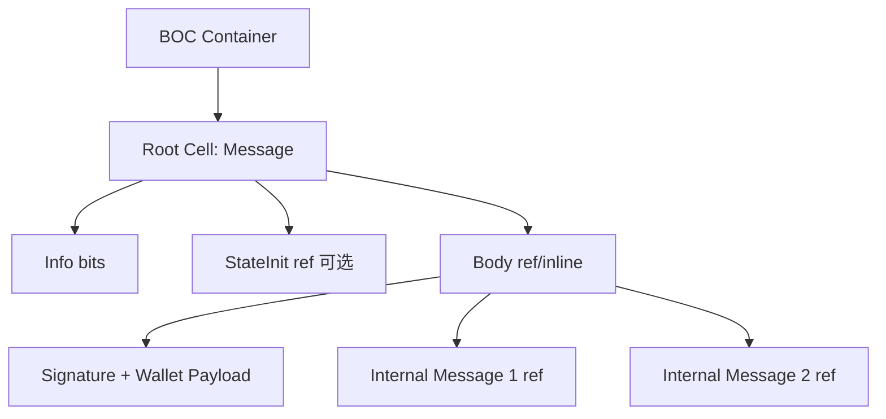
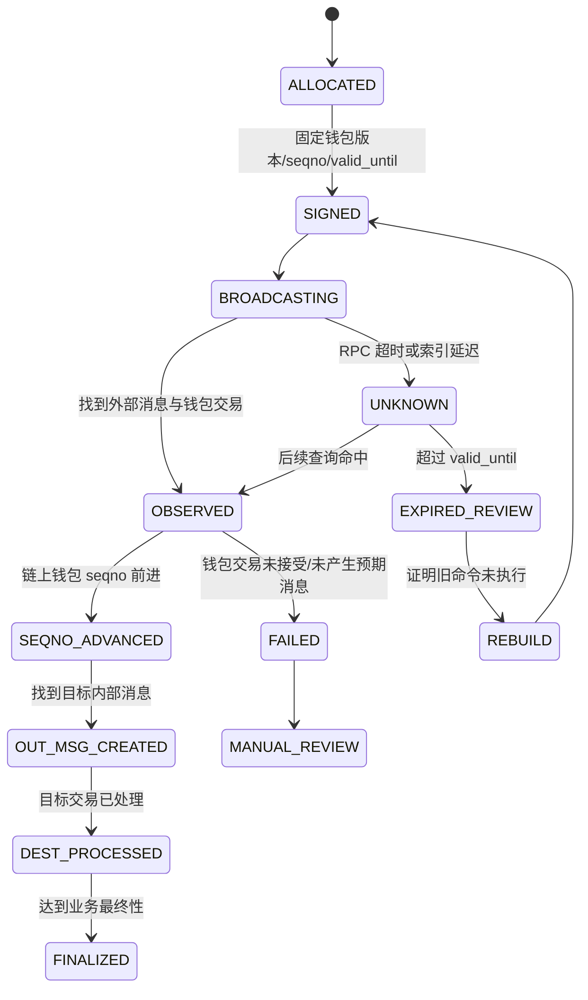
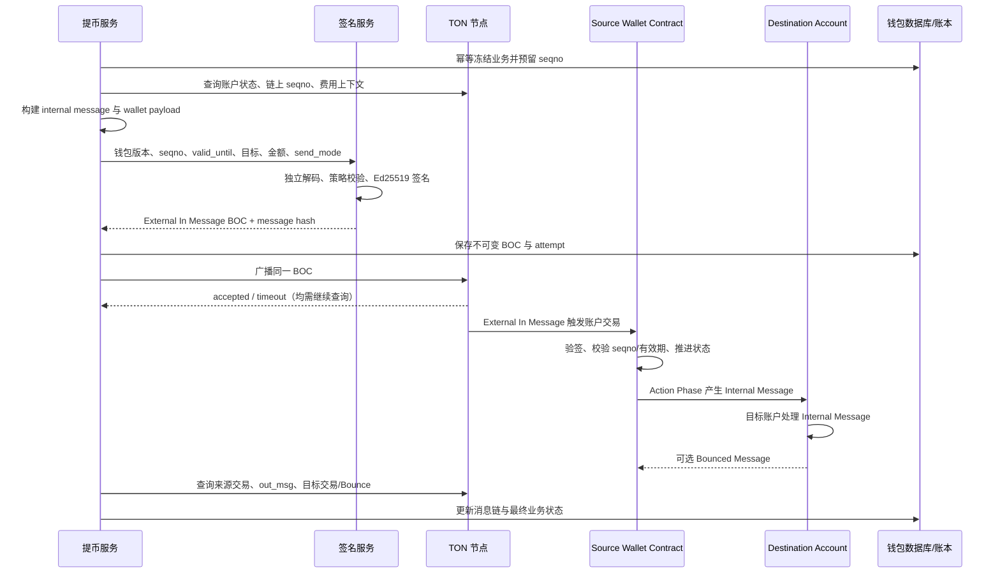

# Day 12：TON Cell、Message 与钱包合约

> 学习目标：掌握 TON Account、Cell、BOC、External/Internal Message 与 Wallet Contract；理解 `seqno`、有效期、Ed25519 签名、地址格式、异步消息链、交易阶段和失败语义；能够解析一笔测试网 TON 原生币转账并设计托管钱包的确认、并发和恢复流程。  
> 建议用时：4～5 小时  
> 完成标准：仅使用 TON Testnet、本地沙箱或确定性夹具；画出外部消息驱动钱包合约并产生内部消息的流程，完成 TON/EVM 对比表，解析一笔测试网转账的账户、消息、金额、费用、`seqno` 与执行阶段，并闭卷回答文末恰好 7 道面试题。

## 安全边界与版本说明

- 只使用无价值测试密钥，不提交助记词、私钥、API Key、生产钱包地址映射或签名材料。
- 不伪造测试网交易哈希、Message Hash、Logical Time（LT）或区块证明。网络不可用时使用明确标注的夹具，并将实验值留空。
- TON 钱包是链上合约，钱包版本决定签名 payload、`seqno`、`valid_until`、发送模式和批量消息格式。构建与解析必须绑定钱包版本和代码哈希。
- “外部消息已发送”“节点返回成功”“目标交易存在”是不同层次；TON 异步消息可能在后续账户交易中失败或 Bounce。
- Bounceable/Non-bounceable 是 user-friendly 地址标志，不改变底层 `workchain:account_id`。错误使用可能导致新账户无法接收、资金退回或难以恢复。
- TON API 供应商的字段名、索引能力和确认描述可能不同。资金结论应来自受信节点/索引器、多源核验、消息链和内部账务，而不是浏览器展示。
- TON 主链历史通常具有快速确定性，但生产系统仍应按节点健康、主链/分片链证明、索引延迟、金额和风险配置确认策略，不能把一次 API 命中当作绝对最终结论。

---

## 一、TON Account 模型

### 1. 账户由什么组成

TON 账户以地址标识，状态可概括为：

```text
Account
├─ address = workchain_id + account_id
├─ balance
├─ status
├─ code
├─ data
└─ last transaction reference: lt + hash
```

常见状态：

| 状态 | 含义 | 钱包工程关注点 |
|---|---|---|
| `nonexist` | 当前不存在 | 不能假设目标已部署 |
| `uninit` | 有余额但尚未初始化代码 | 可由合适 StateInit 激活 |
| `active` | 有代码和数据，可执行 | 钱包合约正常状态 |
| `frozen` | 账户冻结，仅保留状态哈希等信息 | 不能按普通钱包继续发送 |

与 EVM EOA 不同，TON 普通用户“钱包地址”通常是 Wallet Contract 地址。私钥不直接代表协议内置 EOA，而是钱包合约根据其 data 中保存的公钥和规则验证外部消息签名。

### 2. 地址与 StateInit

账户地址通常由 `StateInit` 的哈希与 Workchain 共同确定。`StateInit` 可包含：

```text
code
 data
library
split_depth / special（按结构可选）
```

因此同一公钥使用不同钱包版本、Wallet ID/Subwallet ID 或初始化数据，可能得到不同地址。托管钱包必须保存：

```text
network
workchain
wallet version
wallet/subwallet id
public key
code hash
raw address
user-friendly address
```

只保存公钥或展示地址不足以完整恢复构建规则。

### 3. 交易挂在账户上

TON Transaction 是“某个账户处理一条入站消息”的状态转换。它可能产生零个或多个出站消息：

```text
in_msg -> Account Transaction -> out_msgs[0..N]
```

跨账户业务不是一笔同步全局交易，而是消息驱动的异步链。钱包 A 的交易成功产生内部消息，不等于钱包 B 已成功处理该消息。

---

## 二、Cell、Slice、Builder 与 BOC

### 1. Cell 是基础数据结构

Cell 是 TON 的基础序列化与 Merkle DAG 单元。普通 Cell 最多存储：

```text
1023 bits
4 references to other cells
```

数据通过 bits 和 refs 组成树或 DAG。交易、消息、账户状态和区块数据最终都可表示为 Cell 图。

### 2. Builder 与 Slice

| 对象 | 用途 |
|---|---|
| Builder | 按位写入整数、地址、Coins、refs，最终生成 Cell |
| Slice | 从 Cell 按协议顺序读取 bits 和 refs |
| Cell | 不可变数据节点，可计算哈希并引用其他 Cell |

解析必须严格遵循 TL-B Schema。字段位宽、Maybe/Either 标志、引用层级和 VarUInteger 编码任何一个错误，都会得到不同 Cell 与哈希。

### 3. BOC

BOC（Bag of Cells）是把一个或多个根 Cell 及其引用图序列化为字节的容器格式，常以 Base64 或十六进制传输。

```text
结构化对象
 -> Builder/TL-B 编码
 -> Cell DAG
 -> BOC bytes
 -> Base64/hex 传输
```

BOC 不是单个 Cell 的同义词：

- Cell 是图中的节点；
- BOC 是序列化容器；
- 一个 BOC 可包含多个根；
- 相同逻辑 Cell 图应通过规范实现产生可验证哈希；
- BOC 解析后仍需按具体 Schema 解码。

### 4. 哈希与身份

TON 中常见多种哈希：

- Cell hash；
- External/Internal Message hash；
- Transaction hash；
- Block ID 相关 root/file hash。

它们不可混用。广播外部消息时通常先对外部消息 Cell/BOC 计算 Message Hash；钱包合约处理后形成账户 Transaction，其 Transaction Hash 是另一对象。数据库字段必须明确 `external_message_hash`、`internal_message_hash` 和 `transaction_hash`。

### 5. Cell 图示



---

## 三、Message 模型

### 1. Message 的一般组成

概念结构：

```text
Message
├─ info       // 消息头
├─ init?      // 可选 StateInit
└─ body       // 消息体
```

TON 主要关心三类消息：

| 类型 | 来源 → 目标 | 价值 | 典型用途 |
|---|---|---:|---|
| External In | 链外 → 链上账户 | 本身不携带普通内部转账价值 | 调用钱包合约、部署合约 |
| Internal | 链上账户 → 链上账户 | 可携带 TON 与 body | 转账、合约间通信 |
| External Out | 链上账户 → 链外 | 不作为普通 TON 收款 | 日志式对外消息，钱包较少使用 |

### 2. External In Message

用户钱包构建并签名 payload，封装成 External In Message 发给 Wallet Contract。典型 body 包含：

```text
signature
wallet/subwallet id
valid_until
seqno
send mode
one or more internal messages
```

具体字段顺序和能力取决于钱包版本。节点接受 BOC 只代表收到广播请求；必须继续查找该 External Message 对应的账户交易及其阶段。

### 3. Internal Message

Wallet Contract 验证外部消息后，Action Phase 可创建 Internal Message。常见字段：

```text
src / dest
value
bounce
bounced
ihr_disabled
fees
created_lt / created_at
init?
body
```

Internal Message 到达目标账户后，会触发目标账户的另一笔 Transaction。因此跨账户调用是异步的。

### 4. Bounce

若 Internal Message 设置 `bounce=true`，且目标无法成功处理到可接收状态，协议可生成 Bounced Message 返回来源，扣除已消耗的转发/处理费用后返还剩余价值。Bounced Message 通常带 `bounced=true`，业务应解析并关联原消息。

注意：

- Bounce 不是原子回滚来源钱包交易；
- 已消耗费用不会全部返还；
- 源合约必须有处理退回消息的逻辑；
- 是否 Bounce 取决于消息标志、目标状态和失败阶段；
- 不能只见来源 `out_msg` 就把提币标记为最终成功。

---

## 四、Wallet Contract、签名、`seqno` 与有效期

### 1. 为什么钱包是合约

TON 将账户逻辑统一交给智能合约。Wallet Contract 可自行定义：

- 公钥和签名验证；
- 防重放状态；
- 有效期；
- 批量发送多个内部消息；
- 多签、插件、限制或扩展能力；
- 发送模式与费用承担方式。

这提供了可扩展性，但也意味着构建服务必须准确识别钱包版本。不能用 V3/V4 的 payload 规则签名未知 Wallet V5 或自定义合约。

### 2. Ed25519 签名边界

常见钱包使用 Ed25519 签名钱包 payload 的哈希或规定 Cell 内容，而不是直接对浏览器 JSON 签名。签名服务应独立解析并校验：

```text
network/global context（按钱包规则）
wallet address and code hash
wallet/subwallet id
seqno
valid_until
send mode
internal message destinations
amounts
message bodies
StateInit
```

签名覆盖字段必须按目标钱包版本的正式实现确定。任何修改都要求重新签名。

### 3. `seqno`

许多标准 Wallet Contract 在 data 中维护 `seqno`，用于防止同一外部命令重复执行和控制顺序。典型流程：

```text
读取链上 seqno = N
构建 payload(seqno=N)
签名并广播
钱包验证 seqno == N
成功接受后推进到 N+1
```

`seqno` 与 EVM nonce 类似于“钱包级顺序与重放保护”，但实现属于 Wallet Contract，具体更新时点、错误行为和并发能力必须按钱包版本核验。

### 4. 多实例并发

不安全流程：

```text
实例 A 读取 seqno=20
实例 B 读取 seqno=20
A、B 为两个业务分别签名
```

两条命令竞争同一 `seqno`，通常只能有一条被标准钱包接受，另一条失败或需重建；更严重的是内部系统可能错误认为两笔都已付款。

安全分配：

```text
begin transaction
  existing = find withdrawal by business_id for update
  if existing: return existing

  wallet = select wallet_state for update
  assert wallet.status == ACTIVE
  seqno = wallet.next_seqno

  insert wallet_seqno_slot(wallet, seqno, business_id)
  update wallet_state set next_seqno = next_seqno + 1
commit
```

约束：

```text
UNIQUE(network, wallet_address, seqno)
UNIQUE(business_id)
```

数据库只做本地预留；启动恢复仍要对账链上钱包 data 中的真实 `seqno`、External Message、交易和出站消息。

### 5. `valid_until`

标准钱包 payload 通常带有效截止时间，以 Unix 时间限制签名命令长期有效。它可以降低泄露签名长期重放风险，但不是业务幂等键。

策略：

- 签名前校验节点时间、系统时钟和允许窗口；
- 不设置过短导致正常广播来不及，也不设置无限长；
- 持久化 `valid_until` 与签名 BOC；
- 超时后不能直接为同一业务创建新签名，先确认旧命令是否已执行；
- 新签名 attempt 仍绑定同一业务，并跟踪所有 Message Hash。

### 6. `seqno` 状态机



---

## 五、地址：Raw、User-friendly、Bounceable

### 1. Raw Address

Raw 地址表示：

```text
workchain_id:account_id
```

`account_id` 通常是 256 位哈希。主工作链常用 Workchain `0`，Masterchain 使用 `-1`。业务系统必须保存 Workchain，不要只保存哈希部分。

### 2. User-friendly Address

User-friendly 地址是在底层地址之外加入标志和校验的编码，通常使用 Base64/Base64URL 展示。它携带：

- Bounceable 或 Non-bounceable 标志；
- Test-only 标志；
- Workchain；
- Account ID；
- CRC16 校验。

大小写、URL-safe 字符和校验都应由成熟库处理，禁止手写字符串替换后直接转账。

### 3. Bounceable 与 Non-bounceable

两种形式可指向同一个底层账户：

| 形式 | 建议场景 | 风险 |
|---|---|---|
| Bounceable | 目标合约已 active，处理失败希望退回剩余价值 | 未初始化目标可能无法按预期部署/接收 |
| Non-bounceable | 首次向未初始化账户转账或需要允许入账而不 Bounce | 目标错误时缺少 Bounce 保护，资金可能滞留 |

常见操作原则：

- 先解析为 raw address 并查询账户状态；
- 目标 `active` 且业务要求失败退回时，通常使用 Bounceable；
- 首次给 `uninit/nonexist` 钱包充值时，可能需要 Non-bounceable；
- 合约交互必须按目标协议要求选择；
- 用户输入 Non-bounceable 不代表任何目标都应强制 `bounce=false`，需结合账户状态和业务策略。

### 4. Test-only 标志

Testnet user-friendly 地址应带正确 test-only 语义。生产地址校验必须绑定 network：

```text
parse + checksum
 -> inspect test-only flag
 -> compare configured network
 -> obtain raw workchain:account_id
 -> query account status/code hash
 -> decide bounce behavior
```

Testnet/Mainnet 地址底层格式可能相似，单靠字符串外观无法安全区分。

---

## 六、TON 交易阶段与失败语义

### 1. 典型阶段

TON 普通交易可包含以下阶段，是否存在及顺序受交易类型影响：

| 阶段 | 作用 | 关键字段/结论 |
|---|---|---|
| Storage Phase | 收取存储费，可能影响账户状态 | `storage_fees_collected`、status change |
| Credit Phase | 将入站内部消息价值记入账户 | `credit` |
| Compute Phase | 执行 TVM 合约代码 | `success`、`exit_code`、gas |
| Action Phase | 执行合约生成的动作，如发消息 | `success`、`result_code`、消息数量 |
| Bounce Phase | 入站可 Bounce 且失败时生成退回 | bounce 类型、费用 |

不能只看 Compute Phase `success=true`：Action Phase 仍可能失败，预期出站消息可能未生成。也不能仅看 Transaction 存在：外部消息可能因签名、`seqno` 或有效期问题未产生预期业务效果。

### 2. 常见结果组合

| Compute | Action | 出站消息 | 业务判断 |
|---|---|---|---|
| 成功 | 成功 | 有预期消息 | 来源钱包已发出，继续追踪目标 |
| 成功 | 失败 | 无/部分 | 来源交易业务失败或部分动作异常，人工核验 |
| 失败 | 无有效 Action | 通常无预期消息 | 执行失败，检查 exit code |
| 成功 | 成功 | 消息随后 Bounce | 来源成功发送，但目标处理失败 |
| 来源成功 | 目标成功 | 目标状态变化符合预期 | 可进入确认/结算 |

### 3. Send Mode

钱包 Action Phase 发送内部消息时会使用 `send_mode`。不同位标志影响费用从余额还是消息价值中扣除、错误是否忽略、是否携带剩余余额、是否销毁账户等。

资金系统不能把 `send_mode` 当作无关参数：

- 错误模式可能导致到账金额偏差；
- `IGNORE_ERRORS` 类行为可能让钱包交易成功但某个发送动作失败；
- 携带全部余额可能造成严重资金风险；
- 销毁账户标志只应在明确流程中使用。

签名服务必须按钱包版本解码并白名单允许的 send mode。

### 4. 费用

TON 费用可能包括：

```text
storage fee
compute gas fee
action fee
forwarding fee
import fee（按消息类型/实现体现）
```

消息 value、实际目标到账和来源余额减少可能不同。所有金额使用 nanotons 整数：

$$
1\ TON = 10^9\ nanotons
$$

Java 使用 `BigInteger` 保存 nanotons，展示时使用 `BigDecimal.movePointLeft(9)`，禁止 `double`。

---

## 七、外部消息到内部转账的完整流程



### 关键检查点

1. **签名前**：钱包版本、代码哈希、链上 `seqno`、余额、目标状态、bounce、金额、body、send mode；
2. **广播后**：External Message Hash 是否被来源钱包交易消费；
3. **来源交易**：Compute/Action 是否成功、`seqno` 是否推进、是否产生预期 out message；
4. **目标链路**：Internal Message 是否被目标交易消费、是否 Bounce；
5. **结算**：实际 value、费用、目标状态与内部账务一致。

---

## 八、解析一笔 TON Testnet 原生币转账

> 选择一笔真实 Testnet 转账，记录来源钱包 Transaction、Internal Message 和目标 Transaction。不要只复制浏览器的单页摘要。

### 1. 需要的标识

至少记录：

```text
network = testnet
source wallet raw address
source transaction: account + lt + hash
external message hash（若由钱包外部命令发起）
internal message hash
 destination raw address
destination transaction: account + lt + hash
```

TON 中交易自然定位常使用账户地址与 LT/Hash。单独 `lt` 不是全网唯一业务键；Message Hash 与 Transaction Hash 也不是同一值。

### 2. 来源账户与钱包版本

查询并记录：

```text
account status
balance
code hash
wallet version
public key（若接口和钱包版本支持解析）
seqno before / after
last transaction lt/hash
```

钱包版本应通过可信代码哈希映射与 data 解析确认，不能仅相信浏览器标签。

### 3. External In Message

解析：

```text
message hash
src = none/external
dest = source wallet
import fee
StateInit（如部署）
body BOC
signature
wallet/subwallet id
valid_until
seqno
```

签名字段与 payload 布局依 Wallet Contract 版本。未知代码哈希应进入 `UNSUPPORTED_WALLET_VERSION`，禁止按猜测规则签名或解析。

### 4. 来源 Transaction

记录阶段：

```text
transaction type
total fees
storage phase
credit phase
compute phase: success, exit_code, gas_used
 action phase: success, result_code, total_actions, messages_created
aborted / destroyed（如 API 提供）
out_msgs[]
```

成功标准不是单字段。至少要求钱包验证与执行满足版本语义、Action 成功并找到与签名前意图匹配的 Internal Message。

### 5. Internal Message

解析并核对：

| 字段 | 说明 |
|---|---|
| `hash` | 消息身份，用于串联来源与目标交易 |
| `src` | 来源 Wallet Contract |
| `dest` | 目标 raw address |
| `value` | 携带 nanotons |
| `bounce` | 是否请求 Bounce |
| `bounced` | 是否为退回消息 |
| `ihr_disabled` | 消息路由相关标志 |
| `created_lt/at` | 创建逻辑时间/时间 |
| `fwd_fee/ihr_fee` | 转发相关费用 |
| `init` | 可选 StateInit |
| `body` | Comment、op code 或合约 payload |

若是普通带 Comment 的 TON 转账，body 可能按约定包含 32 位 `op=0` 后跟文本。必须按协议解码字节，限制长度和编码；不能把任意 body 都当用户 Memo。

### 6. 目标 Transaction 与 Bounce

继续查 Internal Message 的消费方：

- 目标是否产生 Transaction；
- Compute/Action 结果；
- 目标余额变化；
- 是否产生 Bounced Message；
- 消息 value 与实际到账的费用差异；
- 达到何种确认/主链锚定程度。

对简单钱包收款，目标可能只接收价值而无复杂代码；对合约地址，必须检查目标执行结果。来源 out message 存在不能替代目标结果。

### 7. 解析伪代码

```text
function parseTonTransfer(network, sourceAccount, sourceLt, sourceTxHash):
    sourceTx = tonApi.getTransaction(sourceAccount, sourceLt, sourceTxHash)
    require sourceTx != null

    ext = sourceTx.inMessage
    wallet = detectWalletByCodeHash(sourceAccount)
    command = wallet.decodeExternalBody(ext.body)

    require verifyExpectedWalletCommand(command)
    require sourceTx.compute.success
    require sourceTx.action.success

    expected = findOutMessage(sourceTx.outMessages, message ->
        message.src == sourceAccount &&
        message.dest == command.destination &&
        message.value matches approved policy &&
        message.bodyHash == command.bodyHash)

    if expected == null:
        return SOURCE_ACCEPTED_BUT_EXPECTED_MESSAGE_MISSING

    destinationTx = tonApi.findTransactionByInMessageHash(expected.hash)
    if destinationTx == null:
        return INTERNAL_MESSAGE_IN_FLIGHT

    if expected.bounced or destinationTx.producedBounceFor(expected.hash):
        return BOUNCED

    destinationResult = inspectAllTransactionPhases(destinationTx)
    return persistMessageChainIdempotently(
        network,
        sourceTx.account, sourceTx.lt, sourceTx.hash,
        ext.hash,
        expected.hash,
        destinationTx.account, destinationTx.lt, destinationTx.hash,
        destinationResult)
```

实际 API 可能不能直接按 Message Hash 查目标交易，需自建索引器、按账户交易历史扫描或使用可信索引服务。

### 8. 实验记录表

| 字段 | 实验值 |
|---|---|
| Network |  |
| Source raw/user-friendly address |  |
| Wallet version / code hash |  |
| Source transaction LT/hash |  |
| External Message Hash |  |
| `seqno` / `valid_until` |  |
| Compute success / exit code |  |
| Action success / result code |  |
| Internal Message Hash |  |
| Destination raw address |  |
| Bounce / Bounced |  |
| Value nanotons / TON |  |
| Send mode / body |  |
| Fees |  |
| Destination transaction LT/hash |  |
| 最终业务结论 |  |

---

## 九、TON 与 EVM 对比

| 维度 | TON | EVM / Ethereum | 钱包工程影响 |
|---|---|---|---|
| 用户钱包 | 通常是 Wallet Contract | 常见为协议原生 EOA | TON 必须识别钱包版本/代码哈希 |
| 状态 | Account 的 balance/code/data | EOA/合约余额、nonce、storage | 都需区分链上状态与业务账本 |
| 数据编码 | Cell、TL-B、BOC | RLP、ABI、Typed Transaction | 解析器完全不同，不能共用字节模型 |
| 签名 | Wallet Contract 常验证 Ed25519 | EOA 常用 secp256k1 ECDSA | 签名 payload 与验签位置不同 |
| 重放控制 | 钱包合约 `seqno`、有效期等 | 协议层 sender nonce + Chain ID | TON 规则依钱包版本 |
| 调用模型 | Message 驱动、跨账户异步 | 单交易同步调用栈 | TON 必须追踪消息链与 Bounce |
| 单账户交易 | 入站消息触发账户状态转换 | 外部交易触发全局调用 | TON Transaction 归属于账户 |
| 跨合约原子性 | 多个账户交易通常非全局原子 | 一笔交易调用栈整体原子回滚 | TON 来源成功不代表目标成功 |
| 多输出 | 钱包 Action 可产生多条消息 | 一笔交易可执行多次内部 call | 两者都需解析内部效果 |
| 失败 | 分 Compute/Action/Bounce 等阶段 | Receipt status/revert | TON 不能用单一 success 粗略映射 |
| 费用 | 存储、计算、Action、Forward 等 | Gas × effective gas price | TON 实际到账需考虑消息费用 |
| 地址 | Workchain+Account ID；友好标志 | 20 字节地址+可选 checksum | TON 需校验 network/bounce/workchain |
| 并发 | 标准钱包常由 `seqno` 串行 | EOA nonce 串行 | 都需数据库预留和链上恢复 |
| 替换/重试 | 依 `seqno`、有效期与钱包逻辑 | 同 nonce 可费用替换 | 不可照搬 EVM replacement |
| 交易身份 | account + LT + tx hash；消息另有 hash | transaction hash | TON 数据模型需分离消息和交易 |
| 充值确认 | 追踪 Internal Message 与目标交易 | 交易/Log + Receipt | TON 还需判断 Bounce 和异步后续 |
| 最终性 | 主链/分片链与节点证明、索引延迟 | 区块确认、safe/finalized | 都需风险分层与节点交叉验证 |

### 统一状态建议

| 统一状态 | TON 映射 | EVM 映射 |
|---|---|---|
| `SIGNED` | External Message BOC 已签名 | Raw Transaction 已签名 |
| `BROADCAST_UNKNOWN` | BOC 广播结果未知 | RPC 广播结果未知 |
| `SOURCE_ACCEPTED` | 钱包交易验证命令并推进 `seqno` | 交易进入区块 |
| `OUTBOUND_CREATED` | 预期 Internal Message 已生成 | 预期 internal call/log 已出现 |
| `DESTINATION_PROCESSED` | 目标交易消费消息 | 同交易内目标调用已完成 |
| `BUSINESS_SUCCESS` | 目标成功、未 Bounce、金额匹配 | Receipt 成功且业务效果匹配 |
| `BUSINESS_FAILED` | Compute/Action 失败或 Bounce | Receipt Revert/业务校验失败 |
| `FINALIZED` | 达到 TON 风险确认策略 | 达到确认/safe/finalized 策略 |
| `MANUAL_REVIEW` | 消息链缺失或阶段矛盾 | 节点/Log/Receipt 矛盾 |

不要强行把 TON 的来源钱包成功直接映射成 EVM Receipt success。统一层应保留链特有 `chain_detail_status`。

---

## 十、节点 API、扫描与最终性

### 1. 常用能力

不同 TON API 实现命名不同，但钱包系统需要这些能力：

```text
获取账户状态、余额、code/data
运行 get-method（如 seqno，须确认钱包版本）
发送 External Message BOC
按账户分页查询交易历史
获取交易、入站/出站消息和阶段描述
按 Message Hash 建立消息链索引
查询主链/分片链区块与证明
```

节点原生 API 未必提供高效“按 Message Hash 反查整条链”。生产通常需要自建索引器或经过验证的第三方索引服务，但不能让第三方浏览器成为唯一资金真值。

### 2. 交易扫描游标

TON 账户交易链常通过前一交易引用连接。扫描记录至少保存：

```text
network
account
last_processed_lt
last_processed_tx_hash
masterchain reference / shard block identity
scanner version
```

只保存时间戳会因同秒多笔、索引延迟或分页变化漏扫。使用 `(account, lt, hash)` 校验连续性，并设计历史回补。

### 3. 分片与主链

业务交易位于分片链，主链记录分片状态。确认策略应结合：

- 交易所在分片区块；
- 对应主链引用/锚定；
- 后续主链进展；
- 节点是否同步；
- 多节点/索引器是否一致；
- 金额和资产风险。

不要用固定“等待 N 秒”替代链上证据。具体确认阈值需按当前 TON 网络和所用证明能力配置。

### 4. 多节点容灾

- 广播同一 External Message BOC 到多个写节点；
- 查询节点按同步高度、延迟、错误率评分；
- 历史索引与实时节点分池；
- 对同一账户的交易分页保持确定性游标；
- 429/5xx 使用退避、抖动和全局预算；
- 节点返回不一致时保留证据，不用“任意成功/任意空”草率覆盖；
- Webhook/订阅只做加速，账户交易扫描负责兜底。

### 5. 幂等键

候选设计：

```text
Transaction: (network, account, lt, tx_hash)
Message:     (network, message_hash)
Deposit:     (network, internal_message_hash, destination_account)
Withdrawal:  business_id + wallet + seqno + attempt_no
```

Message Hash 是否在特定上下文绝对唯一仍应由实现与网络维度保护。账务入账使用独立 `deposit_id` 唯一键。

---

## 十一、广播未知、过期与恢复

### 1. 广播超时

安全动作：

```text
保存原始 BOC + External Message Hash
 -> 多节点重播同一 BOC
 -> 按来源钱包交易历史查 in_msg hash
 -> 查询链上 seqno 是否推进
 -> 若找到来源交易，继续跟踪 out_msg
 -> 证据不足保持 UNKNOWN
```

不能因单节点查不到就构建同业务的新签名。

### 2. `valid_until` 已过

过期不自动证明未执行。恢复前核对：

- 链上钱包 `seqno`；
- 原 External Message Hash；
- 该 `seqno` 对应的来源账户交易；
- 是否产生预期 Internal Message；
- 数据库是否存在其他 attempt。

若链上 `seqno` 已大于本地值但找不到预期交易，可能有未知命令消费了序号，必须暂停钱包并安全调查，不能把新业务塞入旧槽位。

### 3. 服务重启恢复

```text
function reconcileWallet(wallet):
    pauseNewAllocation(wallet)
    chainSeqno = runGetMethod(wallet, "seqno")
    localSlots = loadNonFinalSeqnoSlots(wallet)

    for slot in localSlots ordered by seqno:
        find source transaction by externalMessageHash
        if found:
            inspect compute/action and expected out message
            trace destination transaction and bounce
        else:
            scan account transaction range around allocation time
            compare chainSeqno with slot.seqno

    if unknown seqno consumption or missing signed BOC:
        keep PAUSED and raise incident
    else:
        nextSeqno = max(chainSeqno, highestAllocatedSeqno + 1)
        resume only when sequence and ledger are consistent
```

与 EVM 一样，不能简单 `next=max(db,chain)` 后继续；必须解释每个被链上消耗的 `seqno`。

### 4. 多消息批量钱包命令

一个 External Message 可让钱包生成多条 Internal Message。批量可节省固定开销，但扩大故障面：

- 每个子业务需要独立 message intent；
- Action Phase 结果与 send mode 可能影响部分发送；
- 来源交易成功不代表所有目标都成功；
- 每条 out message 必须映射业务 ID；
- Bounce 要逐条处理；
- 账务不能按批次单一布尔值结算。

---

## 十二、异常与恢复矩阵

| 异常 | 可能原因 | 关键证据 | 安全动作 |
|---|---|---|---|
| 地址校验失败 | CRC、Base64、Workchain 错误 | 成熟库解析结果 | 拒绝请求，不猜测修复 |
| Test-only 不匹配 | Testnet 地址用于 Mainnet | 地址标志+网络配置 | 拒绝并提示网络错误 |
| 目标 `nonexist/uninit` 且 bounce | 地址尚未部署 | account state | 按策略改 Non-bounceable 或要求部署，重新审批 |
| 未知钱包代码哈希 | 自定义/升级钱包 | code hash | 禁止自动签名，新增适配器后灰度 |
| `seqno` 不匹配 | 并发、旧状态、未知交易 | 链上 data+交易历史 | 暂停分配并逐槽位对账 |
| 签名无效 | payload/version/key 错 | Compute exit code、body | 修复构建，不盲重播新业务 |
| `valid_until` 过期 | 广播延迟/时钟问题 | payload+链上时间/交易 | 先证明旧命令未执行，再新 attempt |
| 广播超时 | 节点已收但响应丢失 | BOC hash、多节点查询 | 重播同一 BOC，保持资金冻结 |
| External Message 查不到 | 索引延迟/未传播 | 来源账户历史、seqno | 多节点查询；证据不足保持 UNKNOWN |
| Compute 失败 | 合约校验/余额/gas | exit code、gas | 分类错误；无预期 out_msg 不标成功 |
| Action 失败 | send mode/余额/消息创建失败 | result code、out_msgs | 核验是否有部分动作，人工处理 |
| Internal Message 在途 | 分片异步/索引延迟 | message hash | 继续跟踪，不提前结算 |
| 目标处理失败 | 目标合约错误 | 目标交易阶段 | 等待/解析 Bounce，按业务补偿 |
| Bounced | bounce=true 且目标失败 | bounced message chain | 扣除费用后对账，提币失败/人工审核 |
| Non-bounceable 发错 | 无自动退回 | 目标账户状态 | 冻结业务，人工追回评估 |
| 金额不符 | send mode/fees/解析错误 | message value、余额差 | 使用 nanotons 对账，不按展示值结算 |
| 节点数据分歧 | 落后、索引延迟、分片视图 | 区块/主链引用 | 隔离节点，多源核验 |
| 分页漏扫 | 游标只有时间/分页变化 | LT+hash 连续性 | 回退安全点，至少一次重扫 |
| 链成功账务未更新 | DB/MQ 故障 | Message/Tx+Outbox | 幂等补账，不修改历史记录 |
| 重复 External Message | MQ 重试/广播重试 | 相同 hash/seqno | 相同 BOC 可重播；禁止创建第二业务 |
| 批量部分异常 | 多 out_msg 处理结果不同 | 每条消息链 | 按子业务逐条结算与补偿 |

---

## 十三、数据库模型

### 1. `ton_wallet`

| 字段 | 含义 |
|---|---|
| `network/workchain/address` | 钱包唯一身份 |
| `wallet_version/code_hash` | 构建与解析版本 |
| `wallet_id/public_key` | 初始化与签名信息 |
| `next_seqno` | 本地下一预留值 |
| `chain_seqno` | 最近对账链上值 |
| `status` | ACTIVE/PAUSED/RECONCILING |
| `last_tx_lt/hash` | 账户扫描锚点 |
| `version` | 乐观锁 |

约束：

```text
UNIQUE(network, workchain, raw_address)
```

### 2. `ton_seqno_slot`

保存：

```text
wallet_id
seqno
business_id
status
active_attempt_id
winning_attempt_id
allocated_at
version
```

约束：

```text
UNIQUE(wallet_id, seqno)
UNIQUE(business_id)
```

### 3. `ton_message_attempt`

保存：

```text
slot_id / attempt_no
wallet_version
valid_until
external_message_hash
boc_reference
signature_reference
send_mode
intent_hash
source_transaction_lt/hash
status
```

签名 BOC 必须不可变保存或存储受控引用。日志不记录私钥和完整敏感 payload，但审计系统要能重新解码交易意图。

### 4. `ton_message_edge`

用于消息链：

```text
message_hash
message_type
source_account / source_tx_lt/hash
destination_account / destination_tx_lt/hash
value_nanotons
bounce / bounced
body_hash / op_code
created_lt
status
parent_message_hash
```

### 5. `ton_transaction`

保存账户、LT、Hash、入站 Message、总费用、阶段状态、区块/分片/主链引用和解析器版本。唯一键：

```text
UNIQUE(network, account, lt, tx_hash)
```

---

## 十四、监控与排障

### 1. 关键指标

- 每个钱包链上 `seqno`、本地 next、差值和最老未完成槽位；
- External Message 广播成功率、未知率、过期率；
- 来源交易发现延迟、Internal Message 目标消费延迟；
- Compute/Action 失败按钱包版本和 exit/result code 分布；
- Bounce 数量、金额、原因和恢复耗时；
- 不同 send mode 使用量与异常；
- Test-only/network/address 校验拒绝量；
- 未知钱包代码哈希和账户状态变化；
- 节点 Masterchain 高度/seqno 差、分片索引延迟、429/5xx；
- 扫描账户 LT 连续性、回补数量和重复率；
- 来源余额、费用消耗、实际目标到账差；
- 链成功但账务未结算、账务成功但消息链不完整；
- 同一业务多 attempt、多成功消息和未知 `seqno` 消费。

### 2. 单笔提币排障顺序

```text
1. businessId -> wallet + seqno + all attempts
2. 校验 network、wallet version、code hash
3. 计算/核对 External Message Hash 与 BOC
4. 查询来源账户链上 seqno 和交易历史
5. 找消费该 External Message 的来源 Transaction
6. 检查 Compute/Action、exit/result code、fees
7. 匹配预期 Internal Message（目标、value、body、send mode）
8. 查目标 Transaction 与 Bounced Message
9. 核对主链/分片确认与节点一致性
10. 对账冻结、扣减、手续费和补偿流水
```

### 3. 高优先级告警

- 链上 `seqno` 被内部未知消息推进；
- 同一 `seqno` 对应不同业务签名；
- 未知钱包代码哈希仍发起签名；
- 来源 Action 成功但预期 out message 缺失；
- 目标大额消息 Bounce 或长期在途；
- Mainnet/Testnet 地址标志不匹配；
- 批量提币出现多子消息状态矛盾；
- 所有节点落后或索引链断裂；
- 链与账务存在金额差异。

---

## 十五、口头面试题参考答案

> 本节严格包含计划中的 7 道题。先闭卷口述，再按“结论 → 原理 → 生产实现 → 异常与风险 → 监控和恢复”补全。

### 1. TON 为什么使用钱包合约，而不是像 ETH EOA 一样直接转账？

**参考回答：**

TON 将账户行为统一为合约执行。普通用户地址通常部署 Wallet Contract，合约在收到 External Message 后验证 Ed25519 签名、钱包 ID、`seqno` 和有效期，再通过 Action Phase 发送 Internal Message。协议无需固定一种 EOA 逻辑，钱包可实现批量发送、多签和扩展能力。

代价是构建和签名必须绑定钱包版本与代码哈希。相同公钥配不同初始化数据可能得到不同地址；未知钱包不能套用标准 payload。生产签名服务要独立解码目标、金额、body、send mode、`seqno` 和 `valid_until`，并持续跟踪来源交易与目标消息链。

### 2. `seqno` 的作用是什么？如何管理并发？

**参考回答：**

许多标准 Wallet Contract 用 `seqno` 防止外部命令重放并控制顺序：命令携带当前值，钱包验证后推进。两个实例读取同一 `seqno` 为不同业务签名会竞争，通常只能有一个被接受，内部却可能错误结算两笔。

应按钱包地址在数据库事务中预留 `(wallet, seqno)`，用业务 ID 和唯一索引保证一个槽位只绑定一个业务，保存每个签名 BOC。Redis 锁只能辅助。启动或超时恢复时对账链上 `seqno`、来源账户交易、External Message 和 out messages；任何未知 `seqno` 消费都应暂停钱包。

### 3. External Message 和 Internal Message 有什么区别？

**参考回答：**

External In Message 从链外进入链上账户，常用于调用钱包合约，本身不是普通链内价值转账；其 body 携带签名和钱包命令。钱包交易验证后创建 Internal Message，后者在链上账户间传递 TON 和 body，并触发目标账户的另一笔 Transaction。

因此钱包接受 External Message 只证明来源命令被处理，不能证明收款方成功。必须从外部消息追到来源交易、预期 Internal Message、目标交易和可选 Bounce。数据库应分别保存 External Message Hash、Internal Message Hash 与 Transaction Hash。

### 4. Bounceable 地址表示什么？使用错误会有什么风险？

**参考回答：**

Bounceable 是 user-friendly 地址中的标志，表示发送 Internal Message 时通常希望目标处理失败后退回剩余价值；Non-bounceable 常用于首次给未初始化账户入账。两种字符串可指向相同 `workchain:account_id`，不是两个账户。

若向未初始化目标错误使用 Bounceable，消息可能退回而无法完成首次入账；若对错误或失败合约使用 Non-bounceable，资金可能不会自动退回。系统应解析校验 CRC 和 test-only 标志，转为 raw 地址，查询账户状态与代码哈希，再按业务选择 bounce，而不是机械照搬用户输入格式。

### 5. BOC 和 Cell 分别是什么？

**参考回答：**

Cell 是 TON 的基础不可变数据节点，普通 Cell 最多容纳 1023 bits 和 4 个引用，多个 Cell 组成树或 DAG。Builder 用于写入生成 Cell，Slice 按 TL-B Schema 读取。Message、Transaction、StateInit 和区块数据都由 Cell 表达。

BOC 是 Bag of Cells，是把一个或多个根 Cell 及引用图序列化成字节的容器，常用 Base64 传输。BOC 不等于一个 Cell，也不能脱离 Schema 直接理解业务。签名前后应使用成熟库解析、计算 Cell/Message Hash，并严格区分 Message Hash 与 Transaction Hash。

### 6. 为什么 TON 中消息发送成功不一定代表最终业务成功？

**参考回答：**

TON 跨账户调用是异步消息链。来源 Wallet Transaction 成功可能只表示 Action Phase 已生成 Internal Message；目标账户之后才在另一笔 Transaction 中处理。目标 Compute/Action 可能失败，消息可能 Bounce，且费用已部分消耗。批量命令的不同 out message 还可能有不同后续结果。

所以提币状态至少区分外部消息广播、来源接受、内部消息创建、目标处理、Bounce 和最终确认。需要核对 Compute/Action 阶段、目标/value/body、目标交易和 Bounced Message，最后与账务对账，不能见到来源交易或 out message 就通知成功。

### 7. TON 与 EVM 的交易状态应如何映射到统一钱包状态？

**参考回答：**

统一层可提供 `SIGNED`、`BROADCAST_UNKNOWN`、`BUSINESS_SUCCESS/FAILED`、`FINALIZED` 和 `MANUAL_REVIEW`，但必须保留链特有明细。EVM 通常在一笔交易同步调用栈中通过 Receipt status 和业务 Log 判断；TON 要分来源 Wallet Transaction、Internal Message、目标 Transaction 与 Bounce。

TON 的 `SOURCE_ACCEPTED` 不能直接等于 EVM Receipt success，应继续到 `OUTBOUND_CREATED` 和 `DESTINATION_PROCESSED`。两链广播未知都不能直接重建付款；EVM 对账 nonce 和 hash，TON 对账钱包 `seqno`、Message Hash、LT/Transaction Hash。统一的是业务语义和幂等，不是抹平执行模型。

---

## 十六、当天任务

### 任务 1：Account、Cell 与 BOC（45 分钟）

- [ ] 解释账户状态、code/data、LT 与 Transaction 的关系。
- [ ] 用 Builder 构造一个小 Cell，序列化为 BOC 再解析。
- [ ] 区分 Cell Hash、Message Hash 和 Transaction Hash。
- [ ] 画出 Message Cell 引用结构。

### 任务 2：消息与钱包合约（60 分钟）

- [ ] 画出 External Message → Wallet Transaction → Internal Message → 目标 Transaction。
- [ ] 选择一种标准钱包版本，记录 code hash、payload 字段和 send mode。
- [ ] 解释 Ed25519 签名覆盖内容。
- [ ] 推演签名错误、`seqno` 冲突和 `valid_until` 过期。

### 任务 3：地址与 Bounce（40 分钟）

- [ ] 将测试网 user-friendly 地址解析为 raw address。
- [ ] 检查 CRC、test-only、Workchain 和 Bounceable 标志。
- [ ] 推演 active、uninit、nonexist 三种目标状态。
- [ ] 说明 Bounce 后费用与业务状态如何处理。

### 任务 4：解析测试网转账（60～90 分钟）

- [ ] 选择真实 Testnet 转账并记录来源账户 LT/Hash。
- [ ] 解码 External Message 的 `seqno`、有效期和签名 payload。
- [ ] 检查来源 Compute/Action 阶段和费用。
- [ ] 标出 Internal Message 目标、nanotons、bounce、body。
- [ ] 找到目标 Transaction 或 Bounced Message。

### 任务 5：TON/EVM 对比与恢复（45 分钟）

- [ ] 完成账户、签名、并发、执行、费用和确认对比表。
- [ ] 推演广播超时后服务重启恢复。
- [ ] 推演链上 `seqno` 大于本地但未知谁消费。
- [ ] 为批量 out messages 设计逐子业务状态。

### 任务 6：口述（30～45 分钟）

- [ ] 不看资料回答本节恰好 7 道题并录音。
- [ ] 用 5 分钟讲清 TON 异步消息与 Bounce。
- [ ] 用 5 分钟讲清 `seqno` 并发和未知结果恢复。
- [ ] 将薄弱点写入 `progress.md`。

---

## 十七、闭卷验收

- [ ] 能解释 TON Account 状态、code、data 和交易链。
- [ ] 能说明同一公钥为何可能对应多个 Wallet Contract 地址。
- [ ] 能区分 Cell、Builder、Slice 和 BOC。
- [ ] 能说明普通 Cell 的 bits/ref 边界及 TL-B 解码要求。
- [ ] 能区分 External In、Internal 和 External Out Message。
- [ ] 能区分 Message Hash、Transaction Hash、LT 和地址。
- [ ] 能解释 Wallet Contract 的签名与版本边界。
- [ ] 能用数据库事务和唯一约束管理 `seqno` 并发。
- [ ] 能处理 `valid_until` 过期而不重复付款。
- [ ] 能解析 Raw 与 User-friendly 地址及 test-only 标志。
- [ ] 能根据目标状态说明 Bounceable/Non-bounceable 选择。
- [ ] 能解释 Storage、Credit、Compute、Action、Bounce 阶段。
- [ ] 能说明 Compute 成功为何仍可能业务失败。
- [ ] 能解释 send mode 对费用和错误处理的影响。
- [ ] 能从来源交易追踪 Internal Message、目标交易与 Bounce。
- [ ] 能解析一笔测试网 TON 转账的关键字段和费用。
- [ ] 能设计基于账户 LT/Hash 的至少一次扫描。
- [ ] 能说明分片链、主链引用和节点/索引延迟的确认影响。
- [ ] 能从 DB、链上 `seqno`、BOC 和消息链恢复钱包。
- [ ] 能比较 TON 与 EVM 的原子性、失败和状态映射。
- [ ] 闭卷回答恰好 7 道面试题，覆盖异常、安全和恢复。

## 十八、Day 12 验收清单

- [ ] 所有实验仅使用 Testnet、本地沙箱或确定性夹具。
- [ ] 已完成 External → Wallet → Internal → Destination 流程图。
- [ ] 已完成 TON/EVM 账户与交易模型对比表。
- [ ] 已解析一笔真实或明确标注夹具的 TON 转账。
- [ ] 已记录 Wallet Version、Code Hash、`seqno` 和 `valid_until`。
- [ ] 已检查来源 Compute/Action 和目标交易/Bounce。
- [ ] 已区分 External/Internal Message Hash 与 Transaction Hash。
- [ ] 已解析地址 Workchain、CRC、test-only 和 Bounce 标志。
- [ ] 已使用 nanotons 整数核对金额与费用。
- [ ] 已完成 `seqno` 表、唯一约束和恢复流程。
- [ ] 已推演广播未知、过期、节点分歧和索引延迟。
- [ ] 已设计消息链、扫描游标和业务幂等键。
- [ ] 已录音回答 7 道题并更新薄弱项。
- [ ] Git 中没有私钥、助记词、API Key 或生产敏感数据。

## 十九、30 分自评分

| 能力 | 1 分 | 3 分 | 5 分 | 今日得分 |
|---|---|---|---|---|
| Cell 与消息 | 只知道 BOC 名词 | 能解析 Cell/Message | 能处理 TL-B、哈希和完整消息链 |  |
| 钱包与 `seqno` | 只会读取 seqno | 能构建签名命令 | 能处理并发、过期、未知消费和恢复 |  |
| 地址与 Bounce | 只会复制地址 | 能解析友好地址 | 能按账户状态、安全策略和网络选择 |  |
| 交易解析 | 只看浏览器成功 | 能看 Compute/Action | 能追踪目标交易、费用、Bounce 与业务效果 |  |
| 扫描与容灾 | 只调单个 API | 能按账户 LT 扫描 | 能处理分片、节点分歧、回补和幂等 |  |
| 链间对比 | 只比较性能 | 能比较账户/签名 | 能比较异步原子性、失败和统一状态边界 |  |

**当日总分：** ____ / 30  
**实验 Network：** ______________________________  
**Source Wallet / Version / Code Hash：** ______________________________  
**Source Transaction LT / Hash：** ______________________________  
**External / Internal Message Hash：** ______________________________  
**Destination Transaction LT / Hash：** ______________________________  
**Value / Fees / Bounce Result：** ______________________________  
**最薄弱的三个知识点：** 1. __________ 2. __________ 3. __________  
**明日优先补强：** ______________________________
