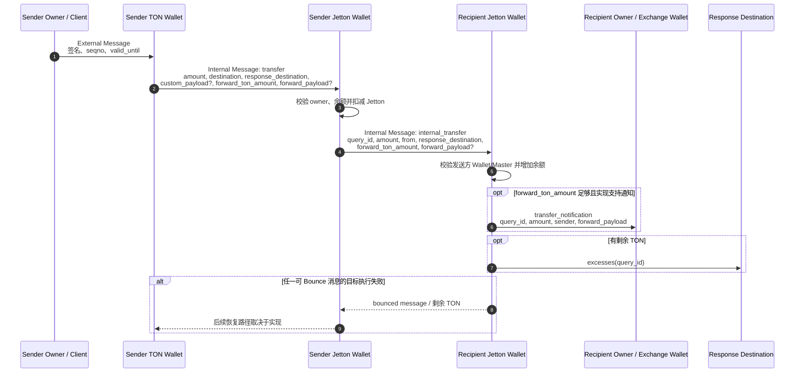
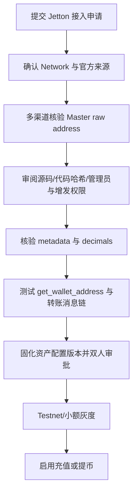
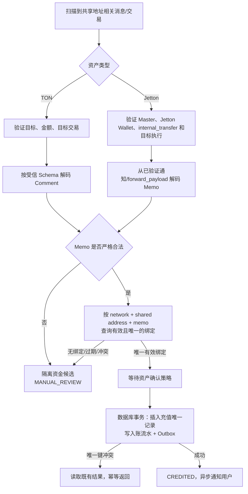
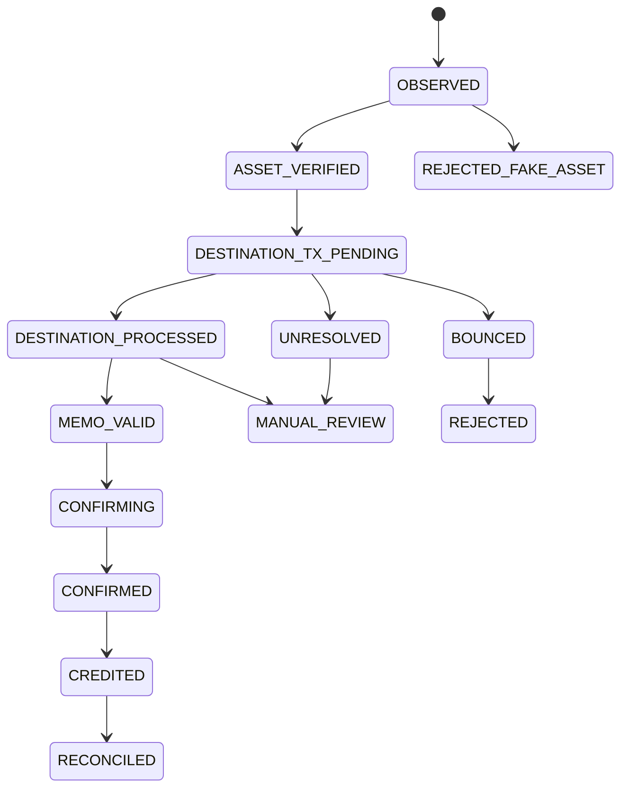

# Day 13：Jetton、Memo 充值与 TON 钱包工程

> 学习目标：掌握 Jetton Master、Jetton Wallet 与标准转账消息链；能够按可信 Master 识别资产、追踪 Jetton 实际到账、设计“共用地址 + Memo/Comment”充值流程，并处理 TON/Jetton 归集费用、Bounce、部分执行、`query_id` 与资金幂等。  
> 建议用时：4～5 小时  
> 完成标准：仅使用 TON Testnet、本地沙箱或确定性夹具；完成 Jetton 消息链图、Memo 充值入账流程和异常清单；追踪一笔 Jetton 转账的来源/目标交易与消息；闭卷回答文末恰好 7 道面试题。

## 安全边界与版本说明

- 只使用无价值测试密钥，不提交助记词、私钥、API Key、生产地址映射或签名 BOC。
- 不伪造 Testnet 交易哈希、Message Hash、Logical Time（LT）或余额变化。网络不可用时使用明确标注的本地夹具，并将实验值留空。
- Jetton 是合约标准，不是协议内置资产。不同实现可能扩展字段、使用不同代码或产生不同通知行为；解析必须绑定已审核的 Master、标准版本和代码配置。
- 名称、Symbol、Logo、Decimals 都是可伪造的展示元数据，不能作为资产身份。资产身份必须锚定 Network + 受信 Jetton Master 地址。
- `transfer_notification` 是常见到账证据，但可能因 `forward_ton_amount`、接收方能力或后续执行失败而缺失。不能把“有通知”或“无通知”单独当作最终资金结论。
- TON 跨账户调用是异步消息链。发送方交易成功不代表接收方 Jetton Wallet 已完成记账；Bounce 也不是整条链的原子回滚。
- `query_id` 由业务/合约用于关联消息，不保证全网唯一，也不保证实现方永不复用，不能单独承担资金幂等。
- 以下字段名以主流 Jetton 标准语义为基准。实现前应以当前标准、目标合约源码/代码哈希和所用 SDK 的 Cell Schema 为准，不应手写未经核验的 opcode 常量。

---

## 一、Jetton 账户模型

### 1. Jetton Master 是什么

Jetton Master（也称 Jetton Minter）代表一种 Jetton 资产的全局定义。它通常保存或提供：

```text
Jetton Master
├─ total_supply
├─ mintable / admin authority（取决于实现）
├─ content / metadata
├─ jetton_wallet_code
└─ get_wallet_address(owner)
```

Master 的职责通常包括：

- 定义该资产对应的唯一 Master 合约地址；
- 保存总供应量和元数据；
- 按 owner 推导该资产的 Jetton Wallet 地址；
- 在允许增发的实现中控制 Mint 权限；
- 提供 Jetton Wallet 的代码模板或相关配置。

生产资产注册表至少应保存：

```text
network
asset_id                 # 内部不可变资产 ID
master_raw_address       # 规范化后的可信 Master
master_code_hash
wallet_code_hash / accepted hashes
decimals                 # 审核后固化，不在每次入账时盲信链上元数据
symbol / display_name    # 仅展示
mintable / admin policy
min_deposit_atomic
confirmation_policy
status                   # ENABLED / DEPOSIT_PAUSED / DISABLED
config_version
```

### 2. Jetton Wallet 是什么

Jetton Wallet 是某个 owner 持有某种 Jetton 的链上合约账户。它不是交易所数据库中的用户余额，也不是普通 TON Wallet Contract 的别名。

可把一个 Jetton Wallet 的逻辑身份理解为：

$$
\text{JettonWalletIdentity} = (\text{network}, \text{master}, \text{owner})
$$

常见数据关系：

```text
Owner TON Address
      │
      │ owns
      ▼
Jetton Wallet Contract ───── belongs to ─────> Jetton Master
      │
      └─ jetton balance (integer atomic units)
```

同一个 owner 持有 3 种 Jetton，通常对应 3 个不同的 Jetton Wallet。不同 owner 持有同一种 Jetton，也对应不同的 Jetton Wallet。

### 3. Master、Owner 与 Wallet 的验证

不能因为某个合约自称“USDT Wallet”就接受它。对候选 Jetton Wallet，至少双向校验：

1. 候选 Wallet 的数据或 getter 声明的 Master 等于资产注册表中的可信 Master。
2. 候选 Wallet 声明的 owner 等于预期交易所 owner 地址。
3. 通过可信 Master 的 `get_wallet_address(owner)` 得到的地址与候选 Wallet 地址一致。
4. Wallet code hash 属于该资产审核通过的集合。
5. 地址、Workchain、Network 和账户状态正确。

伪代码：

```text
verifyJettonWallet(asset, candidateWallet, expectedOwner):
    require asset.status == ENABLED
    require normalize(candidateWallet.network) == asset.network

    walletData = trustedNode.runGetMethod(candidateWallet, "get_wallet_data")
    require normalize(walletData.master) == asset.master_raw_address
    require normalize(walletData.owner) == normalize(expectedOwner)

    expectedWallet = trustedNode.runGetMethod(
        asset.master_raw_address,
        "get_wallet_address",
        expectedOwner
    )
    require normalize(expectedWallet) == normalize(candidateWallet)
    require walletData.codeHash in asset.accepted_wallet_code_hashes

    return VERIFIED
```

getter 返回值来自当前链状态，仍需绑定区块/LT并处理节点分歧。高价值资产应通过两个独立数据源或自建节点复核。

---

## 二、标准 Jetton 转账消息链

### 1. 为什么一次转账涉及多个账户

用户通常不能直接修改 Jetton Wallet 余额。owner 先让自己的 TON Wallet Contract 发出内部消息，调用发送方 Jetton Wallet；发送方 Jetton Wallet 扣减余额，再向接收方 Jetton Wallet 发出 `internal_transfer`。接收方完成加账后，可能向接收 owner 发出 `transfer_notification`，并向指定地址返回 `excesses`。

### 2. 完整消息链图



### 3. 各消息的业务角色

| 消息 | 发出方 → 接收方 | 主要作用 | 不能证明什么 |
|---|---|---|---|
| `transfer` | owner 的 TON Wallet → 发送方 Jetton Wallet | 请求转出 Jetton | 不能证明接收方已到账 |
| `internal_transfer` | 发送方 Jetton Wallet → 接收方 Jetton Wallet | 在 Jetton Wallet 间移动余额 | 仅出现消息不等于目标执行成功 |
| `transfer_notification` | 接收方 Jetton Wallet → 接收 owner | 告知到账并携带 payload | 缺失不必然等于未到账 |
| `excesses` | 接收方链路 → response destination | 返还未使用的 TON | 不是 Jetton 入账凭证 |
| bounced message | 失败目标 → 上游账户 | 退回剩余消息价值并通知失败 | 不保证所有费用或所有状态自动恢复 |

### 4. `transfer` 中应关注的字段

```text
query_id
amount                    # Jetton atomic units
 destination              # recipient owner address
response_destination
custom_payload?           # 可选 Cell
forward_ton_amount
forward_payload?          # 可含 comment/memo 或业务数据
```

注意 `destination` 通常表达接收 owner，而真正接收 `internal_transfer` 的是该 owner 对应的 Jetton Wallet。解析器不得把两者混为同一地址。

### 5. `internal_transfer` 与通知

接收方 Jetton Wallet 应验证 `internal_transfer` 来自与同一 Master 关联的合法发送方 Jetton Wallet。完成余额增加后，根据附带 TON、`forward_ton_amount` 和 payload 触发通知。

对交易所充值，可靠证据强度从弱到强可概括为：

```text
看到发送方 transfer 请求
  < 找到 internal_transfer 消息
  < 目标 Jetton Wallet 交易成功且余额变化正确
  < 目标执行 + 消息链 + Master/Owner 验证 + 确认策略全部通过
```

通知可以帮助实时发现和解析 Memo，但最终入账仍应复核目标 Jetton Wallet 交易、资产身份、金额和确认状态。

---

## 三、Jetton 金额与精度

Jetton 数量必须使用最小单位整数：

$$
\text{atomicAmount} = \text{displayAmount} \times 10^{\text{decimals}}
$$

示例：若某受信资产审核后的 `decimals = 6`，则展示数量 `12.345678` 对应：

$$
12.345678 \times 10^6 = 12{,}345{,}678
$$

工程规则：

- Java 使用 `BigInteger` 保存链上最小单位，展示换算使用 `BigDecimal`。
- 数据库使用足够宽的整数/定点字符串字段，不使用 `double`。
- `decimals` 只控制展示，不改变链上整数本身。
- 资产注册时审核 decimals；运行时链上元数据变化应告警，不能静默改变历史金额解释。
- 对账以 atomic amount 为准，不以格式化字符串为准。

Java 风格伪代码：

```java
BigInteger atomic = new BigDecimal(displayAmount)
    .movePointRight(assetDecimals)
    .toBigIntegerExact();

BigDecimal display = new BigDecimal(atomic)
    .movePointLeft(assetDecimals);
```

`toBigIntegerExact()` 可拒绝超过资产精度的输入，避免无声舍入。

---

## 四、假 Jetton 识别

### 1. 常见攻击方式

攻击者可部署同名、同 Symbol、同 Logo、同 decimals 的 Master，并向交易所地址发送代币，诱导系统按高价值资产入账。还可能：

- 构造伪造的 Jetton Wallet；
- 伪造 `transfer_notification` body；
- 使用相似字符或不可见字符冒充名称；
- 让恶意合约对 getter 返回误导数据；
- 使用旧版、代理或非标准代码绕过单一 code-hash 判断；
- 发送极小数量制造数据库和告警噪声。

### 2. 资产身份判定顺序

```text
Network
  → Trusted Master raw address
  → Expected Jetton Wallet(master, owner)
  → Wallet-reported master and owner
  → Approved code/configuration
  → Message-chain sender relation
  → Atomic amount and business policy
```

名称、Symbol、Logo 只能在身份确认后用于展示。

### 3. 推荐资产注册流程



Master code hash 不是唯一身份：合法资产可能升级或采用不同实现，恶意资产也可能复制公开代码。决定性锚点仍是已审核的 Master 地址，code hash 用于发现配置漂移。

### 4. 入账拒绝条件

任一条件满足即不得自动入账：

- Master 不在对应 Network 的资产白名单；
- 候选 Jetton Wallet 推导地址不一致；
- Wallet 声明的 Master 或 owner 不匹配；
- 目标交易未成功或仍无法确认；
- 消息 amount 非法、为零或低于最小充值额；
- body 无法按受信版本解码；
- 多节点对账户状态、交易或消息链结果冲突；
- Memo 模式下 Memo 缺失、无效、过期或归属冲突。

未知资产可以记录为链上观察事件，但不能创建用户资金流水。

---

## 五、如何确认 Jetton 真正到账

### 1. 追踪对象

至少保存并关联：

```text
source owner / source TON wallet
source Jetton wallet
recipient owner / exchange address
expected recipient Jetton wallet
trusted Jetton master
source account + transaction LT + hash
transfer message hash
internal_transfer message hash
destination account + transaction LT + hash
notification message hash (optional)
bounced message hash (optional)
query_id
atomic amount
forward_ton_amount
forward_payload / normalized memo
```

### 2. 到账判定算法

```text
confirmJettonDeposit(candidate):
    asset = registry.findByMaster(candidate.network, candidate.master)
    require asset is enabled

    expectedWallet = deriveOrQueryWallet(asset.master, exchangeOwner)
    require candidate.destinationWallet == expectedWallet
    verifyJettonWallet(asset, expectedWallet, exchangeOwner)

    incoming = loadMessage(candidate.internalTransferHash)
    require incoming.destination == expectedWallet
    require decode(incoming.body).role == INTERNAL_TRANSFER
    require decode(incoming.body).amount > 0

    destinationTx = findConsumingTransaction(expectedWallet, incoming.hash)
    require destinationTx exists
    require destinationTx.compute_success
    require destinationTx.action_result acceptable
    require not destinationTx.aborted

    verify sender wallet belongs to same trusted Master
    verify destination wallet balance/state delta matches standard semantics
    require no contradictory bounce/reversal evidence
    require chain confirmation policy satisfied

    return BUSINESS_ARRIVED
```

具体交易字段名由节点 API 决定，不能只依赖供应商的单一 `success=true`。应保留原始 BOC/响应摘要、解析器版本与证据区块。

### 3. 为什么不能只看通知

`transfer_notification` 可能因为以下原因缺失：

- `forward_ton_amount = 0`；
- 附带 TON 不足以完成后续通知；
- 接收 owner 合约不处理或处理失败；
- 索引器尚未索引下游消息；
- Jetton 实现与预期标准不同。

反过来，攻击者也可以直接给交易所地址发送一个形似通知的消息。因此通知只能在验证发送方确为预期接收 Jetton Wallet、Master/owner 关系正确后使用。

### 4. 余额差值的边界

目标 Jetton Wallet 的余额增加是强证据，但只比较两个任意时间点也可能混入并发转账。生产系统应优先按目标交易和输入消息归因，再用余额变化做交叉验证和日终对账，而不是只用余额差生成多笔充值。

---

## 六、Testnet 消息链解析模板

> 网络不可用时不要填造数据。将本节作为实验记录，保留真实 RPC/索引器响应或本地沙箱夹具来源。

### 1. 实验记录

| 字段 | 实验值 |
|---|---|
| Network | Testnet / Local Sandbox |
| 数据来源与版本 |  |
| Trusted Master raw address |  |
| Master code hash |  |
| Sender owner |  |
| Sender Jetton Wallet |  |
| Recipient owner |  |
| Expected recipient Jetton Wallet |  |
| Source transaction LT / hash |  |
| `transfer` message hash |  |
| `internal_transfer` message hash |  |
| Destination transaction LT / hash |  |
| Notification / excesses / bounce hash |  |
| `query_id` |  |
| Atomic amount / decimals |  |
| Forward TON / payload |  |
| 最终结论 |  |

### 2. 解析步骤

1. 从官方/已审核来源确定 Testnet Master，不依据 Symbol 搜索结果认币。
2. 查询 Master 数据和 `get_wallet_address(recipientOwner)`。
3. 查询接收 Jetton Wallet，核对 owner、Master、code hash 与账户状态。
4. 从发送方 TON Wallet 交易找到调用发送方 Jetton Wallet 的 `transfer`。
5. 解码 amount、destination、response destination、forward TON 和 payload。
6. 找到发送方 Jetton Wallet 产生的 `internal_transfer`。
7. 以 Message Hash 找到接收 Jetton Wallet 消费该消息的交易。
8. 检查目标交易的 Compute/Action/Bounce 语义与余额变化。
9. 继续追踪可选通知、excesses 和 bounced message。
10. 等待配置的确认条件，再将链上候选记录推进为可入账状态。

### 3. 原始证据保存

建议保存：

```json
{
  "network": "testnet",
  "provider": "<provider-name>",
  "observed_at": "<ISO-8601>",
  "account": "<raw-address>",
  "lt": "<logical-time-as-string>",
  "transaction_hash": "<real-hash>",
  "in_message_hash": "<real-hash>",
  "out_message_hashes": [],
  "raw_boc_reference": "<secure-object-reference>",
  "parser_version": "<version>",
  "asset_config_version": "<version>"
}
```

大整数和 LT 使用字符串，防止 JSON/JavaScript 数值精度损失。

---

## 七、“共用地址 + Memo/Comment”充值模型

### 1. 适用场景

交易所可以让多个用户向同一个 TON owner 地址充值，再通过 Memo/Comment 区分用户。这减少地址管理数量，但把正确入账高度依赖于 payload 解析、映射完整性和人工恢复。

```text
Shared Deposit Owner: EQ...
User A memo: 80419327
User B memo: 61502488
User C memo: 97033641
```

Memo 不是用户身份认证，也不是链上唯一键；它只是充值路由标识。

### 2. Memo 生命周期

推荐状态：

```text
ALLOCATED → ACTIVE → EXPIRED → QUARANTINED → REUSABLE(optional)
```

更稳妥的资金系统可选择永久不复用 Memo。若必须复用，应满足：

- 超过最长链上延迟、历史重扫窗口和人工处理窗口；
- 已进入隔离期；
- 不存在待确认、未知或争议充值；
- 复用策略经过风险审批并带 allocation version；
- 历史映射永久保留，不能覆盖更新。

### 3. Memo 规范化

先定义唯一规范，再分配和解析。示例规则：

```text
encoding: UTF-8
allowed format: ASCII digits only
length: 8..12
leading zero: preserved
trim: forbidden (or explicitly defined once)
case folding: not applicable
Unicode normalization: reject non-ASCII
empty / malformed: manual review
```

不要在解析时“聪明纠错”：自动去空格、转全角数字、模糊匹配或猜测最接近用户，可能把资金记给错误账户。

### 4. TON Comment 与 Jetton payload

TON 原生币的 Comment 通常位于内部消息 body；Jetton 的用户业务 payload 常沿着 `forward_payload` 到达 `transfer_notification`。解析必须：

- 先确认消息角色和可信发送方；
- 按 Cell/标准 Schema 解码，不对任意字节全文搜索 Memo；
- 限制 payload 大小、Cell 深度和解析时间；
- 保留原始 payload hash 与规范化结果；
- 区分“没有 payload”“非文本 payload”“文本但格式非法”。

### 5. 识别与入账流程



### 6. 数据表设计

```sql
CREATE TABLE deposit_memo_assignment (
    id                  BIGINT PRIMARY KEY,
    network             VARCHAR(32) NOT NULL,
    shared_owner        VARCHAR(128) NOT NULL,
    memo_normalized     VARCHAR(64) NOT NULL,
    user_id             BIGINT NOT NULL,
    allocation_version  BIGINT NOT NULL,
    status              VARCHAR(24) NOT NULL,
    active_from          TIMESTAMP NOT NULL,
    expires_at           TIMESTAMP NULL,
    created_at           TIMESTAMP NOT NULL,
    UNIQUE KEY uk_active_identity
      (network, shared_owner, memo_normalized, allocation_version)
);
```

历史映射不可覆盖。若数据库无法用普通唯一索引表达“同一 Memo 只能有一个 ACTIVE”，可引入独立占用表，在事务中以 `(network, shared_owner, memo)` 为主键占用。

充值候选记录：

```sql
CREATE TABLE ton_deposit (
    id                         BIGINT PRIMARY KEY,
    network                    VARCHAR(32) NOT NULL,
    asset_id                   BIGINT NOT NULL,
    jetton_master              VARCHAR(128) NULL,
    recipient_owner            VARCHAR(128) NOT NULL,
    recipient_jetton_wallet    VARCHAR(128) NULL,
    source_tx_account          VARCHAR(128) NOT NULL,
    source_tx_lt               DECIMAL(40, 0) NOT NULL,
    source_tx_hash             VARCHAR(128) NOT NULL,
    internal_message_hash      VARCHAR(128) NOT NULL,
    destination_tx_account     VARCHAR(128) NULL,
    destination_tx_lt          DECIMAL(40, 0) NULL,
    destination_tx_hash        VARCHAR(128) NULL,
    message_role               VARCHAR(32) NOT NULL,
    query_id                   DECIMAL(20, 0) NULL,
    amount_atomic              VARCHAR(128) NOT NULL,
    memo_raw_hash              VARCHAR(128) NULL,
    memo_normalized            VARCHAR(64) NULL,
    memo_assignment_id         BIGINT NULL,
    status                     VARCHAR(32) NOT NULL,
    parser_version             VARCHAR(32) NOT NULL,
    asset_config_version       BIGINT NOT NULL,
    created_at                 TIMESTAMP NOT NULL,
    UNIQUE KEY uk_chain_message
      (network, asset_id, recipient_jetton_wallet,
       internal_message_hash, message_role)
);
```

TON 原生币可使用独立表或允许 `recipient_jetton_wallet`/Master 为空，并为其定义不同的唯一键。不要为了表面统一而让唯一约束失去语义。

### 7. 原子入账

```text
creditDeposit(depositId):
    BEGIN
      deposit = SELECT ... FOR UPDATE
      require deposit.status == CONFIRMED
      require deposit.memo_assignment_id != null

      INSERT ledger_entry(..., idempotency_key = depositId)
      UPDATE user_balance ...
      UPDATE ton_deposit SET status = CREDITED
      INSERT outbox_event(type = DEPOSIT_CREDITED, aggregate_id = depositId)
    COMMIT
```

数据库唯一约束把至少一次扫描和至少一次 MQ 投递转化为一次资金效果。Redis 去重只能减压，不能替代账本唯一约束。

---

## 八、漏填、错填和重复 Memo

### 1. 处理原则

- **漏填：** 不猜用户，进入 `MEMO_MISSING/MANUAL_REVIEW`。
- **格式错误：** 保存原始 payload hash，进入 `MEMO_INVALID`。
- **不存在或过期：** 进入 `MEMO_UNASSIGNED`，不得自动匹配历史“相似用户”。
- **填成其他用户的有效 Memo：** 自动流程无法知道发送者真实意图，应冻结该笔入账或进入争议流程，禁止直接人工改数据库余额。
- **重复使用同一 Memo：** 每笔链上充值仍用 Message Hash 等链上身份区分，可以都归同一用户；Memo 不是交易唯一键。

### 2. 人工认领证据

人工处理可要求用户提供：

- Network、资产、金额和大致时间；
- 发送地址与真实 Transaction/Message Hash；
- 平台账户身份和合规验证；
- 必要时通过原发送地址发起可验证的小额操作或签名证明（按平台政策）。

客服截图、浏览器链接或 Symbol 不能单独证明所有权。审核应双人复核，留下工单、证据摘要、审批人和不可变补账流水。

### 3. 错账恢复

若错误 Memo 已导致给错误用户入账：

1. 暂停同类自动入账或冻结争议金额。
2. 保存链上与内部账本证据，禁止直接改余额。
3. 创建冲正/调整分录，并按审批流程处理负余额风险。
4. 修复解析或绑定规则，历史重放验证影响范围。
5. 对所有同版本解析结果执行差异扫描。

---

## 九、TON 与 Jetton 归集费用

### 1. TON 原生币归集

TON Wallet Contract 发出内部转账需要支付 Storage、Compute、Forwarding 等费用。归集时不能把账户余额机械全部填入 `value`；要根据钱包版本和 send mode 正确处理费用，并保留必要余额，避免交易失败或账户状态异常。

粗略成本模型：

$$
\text{NetCollectedTON} = \text{WalletBalance} - \text{StorageFeeReserve} - \text{ComputeFee} - \text{ForwardFee} - \text{SafetyReserve}
$$

实际费用由链状态、消息大小、Cell 数量、路由和合约执行决定，应通过 SDK/仿真/近期费率估算并设置上限。

### 2. Jetton 归集

Jetton 本身不能支付 TON 网络费用。要从某个 owner 的 Jetton Wallet 归集 Jetton，owner 的 TON Wallet 通常需向其 Jetton Wallet 发送带 TON value 的 `transfer` 调用；这笔 TON 要覆盖：

- owner Wallet 执行与出站消息费用；
- sender Jetton Wallet 执行费用；
- `internal_transfer` 转发费；
- 接收方 Jetton Wallet 执行费用；
- 可选通知、excesses 与安全余量。

因此“Jetton 余额大于零”不代表可立即归集。

### 3. 补充 TON 的策略

```text
if jettonBalance < asset.minCollect:
    skip
if ownerTonBalance >= estimatedCollectCost + reserve:
    scheduleCollect
else if subsidyPolicyAllows(owner, asset):
    scheduleTonTopUp(idempotencyKey)
else:
    manualReviewOrWait
```

防止无限补费：

- 每地址、资产、时间窗设置补费次数和总额上限；
- 只对已验证有可归集 Jetton 的 owner 补费；
- 补费与归集任务绑定唯一业务 ID；
- 补费后必须对账，不因 RPC 超时立即再补；
- 识别 dust 攻击，不为低于阈值的陌生资产补 TON；
- 归集失败达到阈值后熔断并人工检查代码/余额/消息链。

### 4. 归集状态机

```text
DISCOVERED
  → COST_ESTIMATED
  → TOPUP_REQUIRED → TOPUP_BROADCAST_UNKNOWN → TOPUP_CONFIRMED
  → COLLECT_BUILDING
  → COLLECT_SOURCE_ACCEPTED
  → INTERNAL_TRANSFER_CREATED
  → DESTINATION_PROCESSED
  → RECONCILED

任一步骤可进入 RETRYABLE / BOUNCED / MANUAL_REVIEW
```

归集目标地址也必须按可信 Master 推导 Jetton Wallet，不能把 Jetton 直接发送到一个未验证的任意合约地址。

---

## 十、Bounce 与部分执行

### 1. Bounce 不是原子回滚

TON 每个账户处理一条消息形成独立 Transaction。若下游可 Bounce 消息失败，可能产生返回上游的 bounced message，但：

- 已消耗的 Gas/转发费用不会完整退回；
- 上游合约已发生的状态变更是否恢复，取决于标准实现如何处理 bounced message；
- 更下游已成功执行的动作不会因另一条分支失败而全局回滚；
- Non-bounceable 消息或特定 send mode 可能没有预期退回；
- bounced message 本身还需要后续交易处理。

因此应按每条 message edge 记录状态，而不是给整条链一个过早的 `SUCCESS`。

### 2. 消息边状态

```text
CREATED
DISPATCHED
CONSUMED_SUCCESS
CONSUMED_FAILED
BOUNCE_CREATED
BOUNCE_CONSUMED
EXPIRED_OR_UNRESOLVED
```

推荐数据模型：

```text
message_edge
├─ network
├─ message_hash (unique)
├─ parent_message_hash
├─ source_account
├─ source_tx_lt/hash
├─ destination_account
├─ destination_tx_lt/hash
├─ role
├─ query_id
├─ value_nanotons
├─ body_hash
├─ bounced
├─ processing_state
└─ first_seen_at / last_checked_at
```

### 3. 部分执行示例

| 场景 | 已发生事实 | 业务结论 |
|---|---|---|
| owner Wallet 成功，发送方 Jetton Wallet 失败 | TON 调用消息已发出并消耗费用 | Jetton 未必扣减，提币不能成功 |
| 发送方扣减成功，`internal_transfer` 在途 | 来源已接受，目标未确认 | 保持处理中，不能重复构建新付款 |
| 接收方 Jetton Wallet 加账成功，通知失败 | Jetton 可能已到账 | 以目标状态和消息链确认，不因无通知直接失败 |
| `internal_transfer` Bounce | 目标未完成，可能触发发送方恢复余额 | 跟踪 Bounce 被消费及余额恢复，未完成前人工/在途 |
| excesses 失败 | 主 Jetton 转账可能已成功 | 不能把辅助退款失败等同主转账失败 |
| 批量消息部分成功 | 不同子消息有不同结果 | 每个 withdrawal/deposit 独立结算 |

### 4. Bounce 处理伪代码

```text
onBouncedMessage(message):
    edge = findOriginalEdge(message.body/originalHash, message.source, message.destination)
    if edge is unknown:
        quarantine(message)
        alert("unmatched bounce")
        return

    recordBounceImmutable(message, edge)
    destinationState = queryDestination(edge)
    sourceState = querySourceAfterBounce(edge)

    if jettonBalanceRestoredAndNoDestinationCredit(sourceState, destinationState):
        markBusinessFailedRecoverable(edge.businessId)
    else if destinationCreditExists:
        markContradictionForManualReview(edge.businessId)
    else:
        keepUnresolvedAndRetryReconciliation(edge.businessId)
```

不能看到 bounce 标志就立即重发；必须证明原业务没有在目标生效且发送方余额已恢复，否则可能重复支付。

---

## 十一、`query_id`、关联与幂等

### 1. `query_id` 的用途

`query_id` 常作为 64 位无符号值在 `transfer`、`internal_transfer`、通知和 `excesses` 之间传递，帮助合约或业务关联同一操作的消息。它适合：

- 将消息链中的多个角色关联起来；
- 调试通知和 excesses；
- 将链上消息映射到候选业务任务；
- 在受控发送端减少重复命令歧义。

### 2. 为什么不能单独幂等

`query_id` 可能：

- 由不同发送者生成相同值；
- 在不同 Master、Wallet、Network 上重复；
- 被第三方固定为 0 或循环复用；
- 在恶意消息中任意伪造；
- 因服务恢复或错误生成器发生碰撞。

因此以下唯一键是错误的：

```sql
UNIQUE (query_id)
```

更可靠的链上观察唯一键示例：

```text
(network,
 trusted_master,
 recipient_jetton_wallet,
 internal_message_hash,
 message_role)
```

业务发送幂等则以平台生成的 `withdrawal_id`/`collection_id` 为根，保存它与已签名 BOC、来源钱包 `seqno`、各 Message Hash、`query_id` 的映射。

### 3. 三层 ID

| 层次 | 典型 ID | 作用 |
|---|---|---|
| 业务层 | `deposit_id`、`withdrawal_id`、`collection_id` | 账务和请求幂等根 |
| 协议关联层 | `query_id`、wallet `seqno` | 特定合约/消息的关联与顺序 |
| 链上事实层 | Message Hash、account + LT + Transaction Hash | 定位不可变链上证据 |

三者不可互换。

### 4. 发送端生成建议

平台控制的 `query_id` 可由时间、有序序列或业务 ID 的受控映射生成，但必须：

- 明确定义 64 位无符号编码和溢出行为；
- 在发送 Wallet/资产作用域内做唯一约束；
- 永久保存映射，不通过 `query_id` 反推全部业务信息；
- 冲突时拒绝构建，而不是覆盖旧记录。

---

## 十二、充值与提币状态机

### 1. Jetton 充值状态



关键约束：

- `OBSERVED` 只代表扫描到候选消息。
- `ASSET_VERIFIED` 完成 Master、Wallet、owner 关系校验。
- `DESTINATION_PROCESSED` 代表接收 Jetton Wallet 已处理，而非仅来源请求成功。
- `CONFIRMED` 与 `CREDITED` 分离；前者是链上结论，后者是内部账务效果。
- `CREDITED` 只能由数据库事务和唯一账本键产生一次。

### 2. Jetton 提币状态

```text
REQUESTED
→ RISK_APPROVED
→ FUNDS_FROZEN
→ SOURCE_RESOURCE_RESERVED       # wallet seqno / business slot
→ SIGNED
→ BROADCAST_UNKNOWN / BROADCASTED
→ SOURCE_WALLET_ACCEPTED
→ TRANSFER_REQUEST_CREATED
→ SENDER_JETTON_WALLET_ACCEPTED
→ INTERNAL_TRANSFER_CREATED
→ DESTINATION_PROCESSED
→ FINALIZED
→ RECONCILED
```

失败分支至少包括：

```text
SIGN_REJECTED
SOURCE_REJECTED
BOUNCED_PENDING_RECONCILIATION
FAILED_FUNDS_RESTORED
PARTIAL_EXECUTION
MANUAL_REVIEW
```

广播超时后应查询 External Message、来源 Wallet Transaction、`seqno` 和保存的签名 BOC，并优先重播同一 BOC；不能直接使用新 `seqno` 构建第二笔业务付款。

---

## 十三、扫描、持久化与一致性

### 1. 扫描入口

可组合使用：

- 按受控 owner/Jetton Wallet 的账户交易链扫描；
- 按区块/分片索引消息；
- 订阅 Webhook 作为低延迟提示；
- 周期性余额与消息链对账。

Webhook 和浏览器 API 不是资金权威。Scanner 应持久化 account + LT + hash 游标，允许至少一次重扫。

### 2. 两阶段解析

```text
Stage A: immutable ingestion
  保存交易、消息哈希、BOC 引用、账户、LT、观测区块和提供商

Stage B: versioned business interpretation
  使用 asset config version + parser version
  解析 Master、Wallet、amount、Memo、Bounce 和业务状态
```

这样标准升级或解析器修复后可重放 Stage B，而不修改原始链上证据。

### 3. 并发控制

```text
BEGIN
  INSERT chain_message ... ON DUPLICATE KEY NO-OP
  INSERT/SELECT deposit candidate by durable unique key
  lock candidate row
  apply monotonic state transition
  append state history
  append outbox if business event newly created
COMMIT
```

状态迁移应检查前置状态和版本号。迟到的通知不能把 `CREDITED` 降回 `OBSERVED`；迟到的 Bounce 若与已入账事实冲突，应触发冻结与人工处置，而不是静默覆盖。

### 4. 数据保留

至少保留：

- 原始链上证据或可验证对象存储引用；
- 标准/解析器/资产配置版本；
- 每次状态迁移及操作者；
- 节点响应差异和重试记录；
- Memo 原文的安全摘要与规范化结果；
- 人工审核工单和账本调整 ID。

Memo 可能包含隐私或恶意内容。日志中应限制长度并转义，不把未经清洗的 payload 直接输出到日志、SQL 或告警页面。

---

## 十四、TON/Jetton 充值异常清单

| 异常 | 检测信号 | 自动处理 | 人工/告警 |
|---|---|---|---|
| 同名假 Jetton | Master 不在白名单 | 记录观察，拒绝入账 | 攻击量异常时告警 |
| 伪造 Jetton Wallet | Master/owner/推导地址不一致 | 隔离 | 高优先级安全告警 |
| Wallet code 漂移 | code hash 不在审核集合 | 暂停该资产 | 重新审核实现/升级 |
| 非标准消息 body | Schema 解码失败 | 保存原始证据，不入账 | 按资产统计错误率 |
| `transfer` 存在但无目标交易 | 消息仍在途或索引延迟 | 保持 pending、重查 | 超时告警 |
| 目标 Compute/Action 失败 | 目标交易阶段失败 | 查 Bounce 和余额恢复 | 未恢复则人工 |
| Jetton 到账但通知缺失 | 目标余额/交易成功，无通知 | 按目标事实继续核验 | 监控通知缺失率 |
| 伪造通知 | 通知 sender 非预期 Wallet | 拒绝 | 安全告警 |
| `internal_transfer` Bounce | bounced edge 出现 | 等待上游消费并对账 | 长期未恢复告警 |
| excesses 失败 | 主转账成功，退款边失败 | 主业务独立结算 | 记录费用差异 |
| Memo 缺失 | payload 为空 | `MANUAL_REVIEW` | 用户申诉流程 |
| Memo 格式非法 | 不符合严格规范 | 不猜测、不入账 | 保留摘要 |
| Memo 无绑定/过期 | 查询不到唯一 ACTIVE 绑定 | 隔离 | 人工认领 |
| Memo 指向其他用户 | 链上无法证明真实意图 | 冻结争议资金 | 双人审核 |
| 相同 Memo 多笔充值 | 不同 Message Hash | 每笔独立幂等入账 | 正常监控 |
| 相同 Message 重复扫描 | 唯一键冲突 | 返回既有记录 | 无需人工 |
| `query_id` 重复 | 同作用域出现多个链上事实 | 不作为唯一键 | 发送端冲突则告警 |
| 小额/dust 攻击 | 低于最小充值额或高频 | 不入账/汇总展示 | 限流与容量告警 |
| 金额溢出/精度错误 | 超范围或小数换算失败 | 拒绝解析 | 解析器告警 |
| 资产 decimals 改变 | 链上元数据与配置不同 | 不改历史解释 | 暂停并审核 |
| 共享地址错误网络 | test-only/workchain/network 不符 | 拒绝 | 用户提示 |
| 节点结果冲突 | LT/hash/状态不一致 | 换节点并延后确认 | 超阈值暂停充值 |
| 索引器延迟 | 账户链已存在、API 未返回 | 回源节点、稍后重试 | 延迟 SLO 告警 |
| 历史重扫解析版本变化 | 同消息得出不同业务结果 | 保留版本并隔离差异 | 发布回滚/修复 |
| 入账事务成功、通知失败 | Outbox 未投递 | 重发 Outbox | 积压告警 |
| 已入账后发现矛盾 Bounce | 链证据与账务冲突 | 冻结相关额度 | 事故响应 |
| TON 余额不足无法归集 | 费用估算高于可用余额 | 受控补费或等待 | 达上限后人工 |
| 重复补 TON | 广播未知却创建新补费 | 查询/重播相同 BOC | 风险告警 |
| 归集部分成功 | 主转账与通知/退款状态不同 | 按边对账 | 未决超时人工 |

---

## 十五、监控与 Runbook

### 1. 关键指标

```text
jetton_candidate_total{master,status}
jetton_untrusted_master_total
jetton_wallet_verification_failure_total{reason}
jetton_destination_pending_age_seconds
jetton_notification_missing_total
jetton_bounce_total{asset,edge_role}
jetton_unresolved_message_chain_total
memo_missing_total
memo_invalid_total
memo_unassigned_total
memo_manual_review_age_seconds
query_id_collision_total
collection_ton_topup_total
collection_cost_nanotons
collection_failure_total{stage}
scanner_account_lt_lag
provider_result_conflict_total
credited_vs_onchain_delta_atomic
```

不要把用户原始 Memo、完整 payload 或敏感地址映射作为低基数标签。

### 2. 告警分级

| 级别 | 示例 | 动作 |
|---|---|---|
| P0 | 疑似重复入账、已入账后目标事实消失、错误用户入账 | 暂停相关资产充值/出账，冻结影响范围，启动事故响应 |
| P1 | 受信 Master/Wallet code 漂移、大量 Bounce、节点结论冲突 | 暂停自动入账或归集，切换数据源并审核 |
| P2 | 通知缺失率升高、Memo 人工队列积压、归集成本异常 | 降速、扩容或调整阈值，安排处理 |
| P3 | 单笔 dust、短时索引延迟 | 自动重试并观察 |

### 3. 单笔充值排障 Runbook

1. 以内部 `deposit_id` 查询业务记录，避免只凭 `query_id`。
2. 核对 Network、可信 Master 和资产配置版本。
3. 校验目标 Jetton Wallet 的 owner/Master/推导地址/code hash。
4. 从 `internal_transfer` Message Hash 找目标消费交易。
5. 检查目标 Compute/Action、aborted、Bounce 和余额状态。
6. 追踪来源交易、通知、excesses 与 bounced message。
7. 检查 Memo 原始摘要、规范化结果和当时有效绑定。
8. 比较两个节点/索引器，确认是否仅为索引延迟。
9. 核对充值状态、账本流水、Outbox 和用户余额。
10. 只有证据闭环后执行带审批的补账、冲正或恢复。

### 4. 暂停条件

出现以下情况应暂停相关资产自动充值或归集：

- Master 或 Wallet code/config 出现未经批准变化；
- 解析器对相同 BOC 给出不一致结果；
- 多节点持续冲突且无法建立可信链视图；
- Bounce/部分执行比例显著异常；
- 账本与受控 Jetton Wallet 余额无法解释；
- Memo 映射唯一性损坏或疑似跨用户错账；
- 补 TON/归集任务出现疑似重复支付。

---

## 十六、TON 原生币与 Jetton 充值对比

| 维度 | TON 原生币 | Jetton |
|---|---|---|
| 资产身份 | Network + 原生资产配置 | Network + 可信 Master |
| 接收账户 | TON Wallet/合约账户 | owner 对应的 Jetton Wallet |
| 金额位置 | Internal Message value | Jetton 消息 body 的 amount |
| 费用资产 | TON | 消息仍需 TON，Jetton 不能付 Gas |
| 到账证据 | 目标账户消费消息与余额/阶段 | 接收 Jetton Wallet 目标交易、Master/owner 与余额语义 |
| Memo 位置 | 常见为消息 Comment | 常沿 `forward_payload`/通知传递 |
| 假币风险 | 主要是网络/地址混淆 | 同名 Master、伪 Wallet、伪通知 |
| Bounce | 目标失败可能退剩余 TON | 多段消息可部分执行，需跟踪 Jetton 恢复 |
| 归集前置 | 留足执行/转发费 | owner 需有足够 TON 调用 Jetton Wallet |
| 幂等主键 | Message Hash + 目标语义 | Master + recipient wallet + internal Message Hash + role |

---

## 十七、口头面试题参考答案

> 本节严格包含计划中的 7 道题。先闭卷口述，再按“结论 → 原理 → 生产实现 → 异常与风险 → 监控和恢复”补全。

### 1. Jetton Master 和 Jetton Wallet 分别是什么？

**参考回答：**

Jetton Master 是一种 Jetton 的全局定义合约，通常维护总供应量、元数据、管理员/增发规则和 Jetton Wallet 代码，并可根据 owner 返回对应 Wallet 地址。Jetton Wallet 是某个 owner 针对该 Master 的持币合约，保存该 owner 的 Jetton 余额并处理转出、`internal_transfer`、通知和 Bounce。

同一个 owner 持有不同 Jetton 会有不同 Wallet；同一 Jetton 的不同 owner 也各有 Wallet。生产系统应以 Network + 已审核 Master 标识资产，并验证候选 Wallet 的 Master、owner、由 Master 推导出的地址和代码配置，不能把 Jetton Wallet 当作资产身份，也不能只看名称。

### 2. 如何防止同名假 Jetton 被识别为交易所支持资产？

**参考回答：**

资产身份必须锚定 Network + 受信 Jetton Master raw address，名称、Symbol、Logo 和 decimals 只用于展示。接入时从官方多渠道核验 Master，审核代码、管理员、增发权限、wallet code 和 metadata，配置版本经双人审批后再灰度。

入账时从受信 Master 推导接收 owner 的预期 Jetton Wallet，并反向检查候选 Wallet 声明的 Master、owner 与 code hash。消息还要真正进入该 Wallet 并成功执行。未知 Master 或伪造通知只能记录为观察事件，绝不创建用户账本流水；配置漂移应暂停资产并告警。

### 3. 用户漏填或填错 Memo 时如何处理？

**参考回答：**

不能猜测、模糊匹配或直接按发送地址自动归属。漏填、格式错误、无绑定、过期或冲突 Memo 都进入隔离/人工审核，资金链上事实与用户入账分离。Memo 映射要有严格规范、唯一占用、有效期、隔离期和不可覆盖的历史版本。

用户申诉时核对 Network、Master、金额、真实 Transaction/Message Hash、发送地址和身份，必要时要求可验证的地址控制证明；双人审批后通过不可变补账流水处理。若错填成另一用户有效 Memo，应冻结争议金额并走合规流程，不能直接修改数据库余额。

### 4. 如何确认一笔 Jetton 转账真正到达目标账户？

**参考回答：**

不能只看发送方 `transfer`、来源交易成功或一条通知。先确认 Master 在白名单，按 Master + recipient owner 得到预期 Jetton Wallet并验证 Wallet 的 Master、owner 和代码；再找到发往它的 `internal_transfer`，定位消费该消息的目标交易，检查 Compute/Action、aborted、Bounce 和 Jetton 余额语义，最后满足确认策略。

`transfer_notification` 是辅助证据，可能因 `forward_ton_amount` 不足等原因缺失，也可能被攻击者伪造。系统应保存来源/目标 Transaction Hash、LT、各 Message Hash、amount、`query_id` 和解析版本，并通过多源查询和余额对账闭环。

### 5. Bounce 后资金和消息状态如何处理？

**参考回答：**

Bounce 表示某条可 Bounce 的下游消息处理失败并产生返回消息，不是整条调用链原子回滚。已消耗费用通常不会退回，上游状态是否恢复取决于合约收到 bounced message 后的逻辑，且 Bounce 自己还要在后续交易中被消费。

系统应按消息边保存 created、consumed、bounce created、bounce consumed 等状态，追踪接收方是否加账、发送方 Jetton 余额是否恢复和剩余 TON 去向。在证明目标未生效且来源已恢复前，不能重发或给用户解冻；出现目标已到账又有矛盾 Bounce 时进入人工审核和资金冻结。

### 6. TON 的异步消息如何影响充值和提币状态机？

**参考回答：**

一次业务跨越多个账户和多笔 Transaction，所以状态机必须表达来源接受、出站消息创建、目标处理、通知/Bounce 和最终对账，不能用一个链上 `SUCCESS` 覆盖全过程。Jetton 还多了 owner Wallet、发送方 Jetton Wallet 和接收方 Jetton Wallet 等节点。

充值先记录候选，再验证资产和目标执行，确认后才用账本事务入账。提币在来源成功后仍保持处理中，直到目标 Jetton Wallet 成功；广播未知时查询保存的 BOC、`seqno` 和消息链，不能直接构造第二笔。每个子消息独立状态和超时，部分执行进入恢复或人工流程。

### 7. `query_id` 能否单独作为资金操作的幂等依据？

**参考回答：**

不能。`query_id` 主要用于关联 Jetton 消息链，通常只有固定宽度，可由不同发送者、不同 Master、不同 Network 重复，也可能被第三方设为 0、循环复用或恶意伪造。全局 `UNIQUE(query_id)` 会误合并不同资金事实。

充值幂等应基于 Network、可信 Master、接收 Jetton Wallet、`internal_transfer` Message Hash 和消息角色等不可变链上身份；内部账务以 `deposit_id` 为唯一根。提币以平台 `withdrawal_id` 为业务幂等根，持久化其与 `query_id`、`seqno`、签名 BOC、Message/Transaction Hash 的映射。`query_id` 是关联线索，不是资金主键。

---

## 十八、当天任务

### 任务 1：Jetton 模型与真假校验（50 分钟）

- [ ] 解释 Master、owner、Jetton Wallet 三者关系。
- [ ] 选择一个 Testnet Jetton，记录可信来源、Master、code hash 和 decimals。
- [ ] 调用/模拟 `get_wallet_address(owner)`，核对 Wallet 数据中的 Master 与 owner。
- [ ] 写出同名假 Jetton 的拒绝路径。

### 任务 2：消息链追踪（60～90 分钟）

- [ ] 画出 `transfer → internal_transfer → notification → excesses/Bounce`。
- [ ] 找到真实 Testnet 交易或明确标注的本地夹具。
- [ ] 记录来源与目标 Transaction LT/Hash 以及每条 Message Hash。
- [ ] 核对 amount、destination、response destination、forward TON 与 payload。
- [ ] 证明目标 Jetton Wallet 已处理，而非只看到来源请求。

### 任务 3：Memo 充值设计（60 分钟）

- [ ] 定义 Memo 字符集、长度、规范化和唯一分配规则。
- [ ] 完成共享地址 + Memo 识别与入账流程图。
- [ ] 设计 Memo 绑定、链上充值、账本与 Outbox 的关键字段。
- [ ] 推演漏填、错填、过期、重复和跨用户争议。

### 任务 4：归集费用与 Bounce（45 分钟）

- [ ] 比较 TON 和 Jetton 归集的费用前置条件。
- [ ] 设计 TON 补费额度、次数、时间窗和幂等规则。
- [ ] 推演接收 Wallet 成功但通知失败。
- [ ] 推演 `internal_transfer` Bounce 后余额恢复与费用损失。

### 任务 5：异常与监控（40 分钟）

- [ ] 逐项复核本文异常清单并补充本地系统负责人。
- [ ] 为未决消息链、假币、Memo 人工队列和归集成本定义告警。
- [ ] 写一份单笔 Jetton 充值排障记录。
- [ ] 说明何时暂停自动充值、提币或归集。

### 任务 6：口述（30～45 分钟）

- [ ] 不看资料回答本节恰好 7 道题并录音。
- [ ] 用 5 分钟讲清假 Jetton 防护。
- [ ] 用 5 分钟讲清异步消息、Bounce 与部分执行。
- [ ] 将薄弱点写入 `progress.md`。

---

## 十九、闭卷验收

- [ ] 能解释 Jetton Master、Jetton Wallet 和 owner 的关系。
- [ ] 能说明同一 owner 为何对不同 Master 有不同 Wallet。
- [ ] 能以 Network + Master 标识资产，而不是名称/Symbol。
- [ ] 能双向验证 Jetton Wallet 的 Master、owner、推导地址和代码。
- [ ] 能画出 `transfer`、`internal_transfer`、通知与 excesses 链路。
- [ ] 能区分 owner 地址与 recipient Jetton Wallet 地址。
- [ ] 能使用整数处理 Jetton amount 和 decimals。
- [ ] 能说明通知存在/缺失分别不能单独证明什么。
- [ ] 能从 Message Hash 找到目标 Jetton Wallet 交易。
- [ ] 能检查目标执行阶段、余额语义与 Bounce。
- [ ] 能设计严格 Memo 规范和不可覆盖的分配历史。
- [ ] 能处理漏填、错填、过期和重复 Memo。
- [ ] 能解释为什么不能根据“相似 Memo”猜用户。
- [ ] 能用数据库事务、账本唯一键和 Outbox 完成一次入账。
- [ ] 能解释 Jetton 归集为什么需要 TON。
- [ ] 能设计有限额、可对账、防重复的 TON 补费。
- [ ] 能说明 Bounce 不是跨账户原子回滚。
- [ ] 能按消息边处理部分成功与费用损失。
- [ ] 能区分业务 ID、`query_id`、`seqno`、Message Hash 和 Transaction Hash。
- [ ] 能设计 Jetton 充值与提币的异步状态机。
- [ ] 能按 Runbook 排查一笔未到账充值。
- [ ] 闭卷回答恰好 7 道面试题，覆盖异常、安全、监控和恢复。

## 二十、Day 13 验收清单

- [ ] 所有实验仅使用 Testnet、本地沙箱或确定性夹具。
- [ ] 已完成 Jetton 从发送方到接收方的消息链图。
- [ ] 已完成共享地址 + Memo 识别与入账流程图。
- [ ] 已整理 TON/Jetton 充值异常清单。
- [ ] 已核验受信 Master，不依赖名称、Symbol 或 Logo。
- [ ] 已验证接收 Jetton Wallet 的 Master、owner、地址和代码。
- [ ] 已追踪来源/目标 Transaction 与全部关键 Message Hash。
- [ ] 已检查目标执行、通知、excesses 和 Bounce。
- [ ] 已使用整数核对 Jetton amount 与 decimals。
- [ ] 已定义 Memo 规范、唯一分配、过期和人工认领规则。
- [ ] 已设计链上充值唯一键、账本幂等键和 Outbox。
- [ ] 已证明 `query_id` 不作为唯一资金依据。
- [ ] 已设计 TON/Jetton 归集费用与补费限制。
- [ ] 已推演部分执行、广播未知和节点分歧。
- [ ] 已录音回答 7 道题并在 `progress.md` 记录薄弱项。
- [ ] Git 中没有私钥、助记词、API Key 或生产敏感数据。

## 二十一、30 分自评分

| 能力 | 1 分 | 3 分 | 5 分 | 今日得分 |
|---|---|---|---|---|
| Jetton 模型 | 只知道 Token 名词 | 能区分 Master/Wallet | 能验证 owner、地址、代码与升级边界 |  |
| 交易追踪 | 只看来源交易 | 能找到目标交易 | 能追踪通知、Bounce、余额和部分执行 |  |
| 假币防护 | 只看名称/Symbol | 能校验 Master | 能完成资产审核、配置版本和运行时漂移处置 |  |
| Memo 入账 | 能读取 Comment | 能唯一映射用户 | 能处理过期、错填、争议、幂等与审计 |  |
| 归集与费用 | 知道需要 TON | 能估算并补费 | 能限额、防循环、处理未知结果和对账 |  |
| 状态与恢复 | 只有成功/失败 | 能表达异步阶段 | 能按消息边恢复、监控并处理账务矛盾 |  |

**当日总分：** ____ / 30  
**实验 Network：** ______________________________  
**Trusted Master / Config Version：** ______________________________  
**Sender / Recipient Jetton Wallet：** ______________________________  
**Source Transaction LT / Hash：** ______________________________  
**Internal Message Hash：** ______________________________  
**Destination Transaction LT / Hash：** ______________________________  
**`query_id` / Amount / Memo Result：** ______________________________  
**Notification / Excesses / Bounce Result：** ______________________________  
**最薄弱的三个知识点：** 1. __________ 2. __________ 3. __________  
**明日优先补强：** ______________________________
