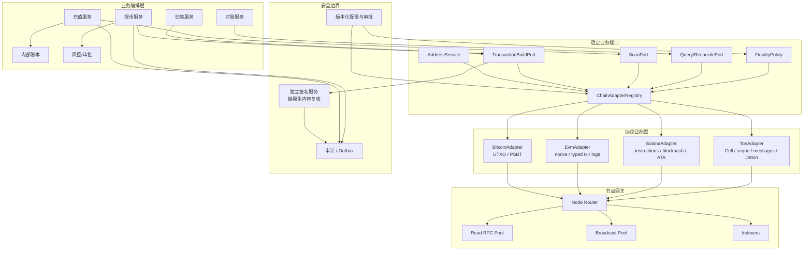
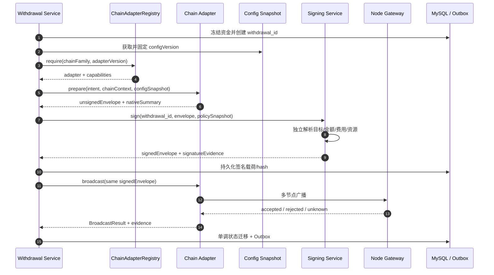
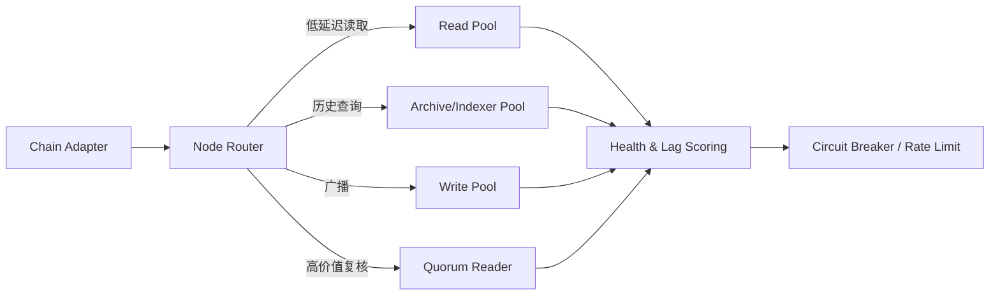
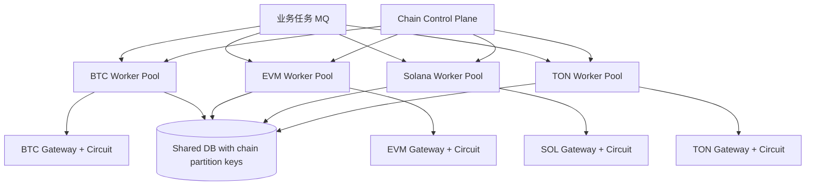
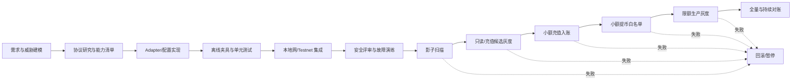
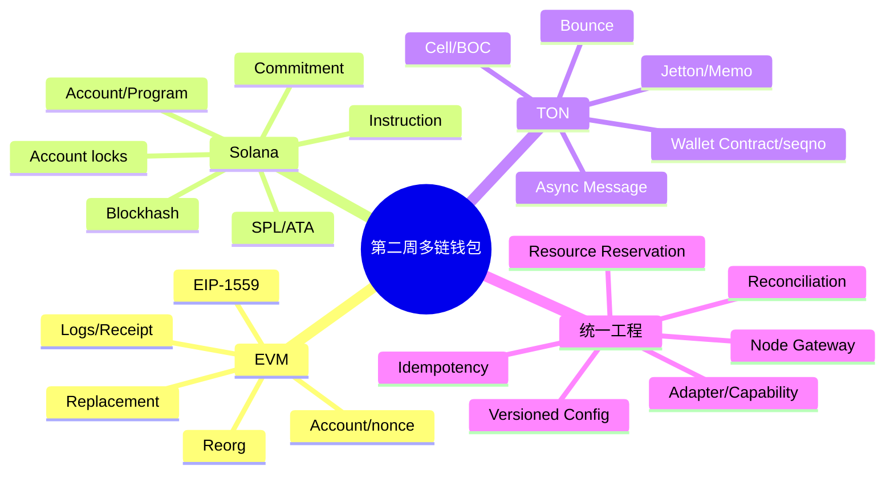

# Day 14：多链适配架构与第二周复盘

> 学习目标：系统比较 BTC、EVM、Solana、TON 的状态、交易、签名、并发与最终性模型；掌握 Adapter、Strategy、Factory 在多链钱包中的职责；设计只统一稳定业务语义、同时保留链特有模型的 Java 适配接口；能够制定新链接入、测试、灰度、回滚与资金安全验证方案。  
> 建议用时：5～6 小时  
> 完成标准：完成 BTC/ETH/SOL/TON 四链对比总表、多链适配层架构图和一版 Java 接口草图；接口必须显式暴露能力、配置版本和链特有上下文，不用一个万能 DTO 抹平 UTXO、nonce、Instruction、Message；闭卷回答文末恰好 7 道面试题。

## 安全边界与设计原则

- 所有构建、签名和广播练习仅使用 Regtest、Devnet、Testnet、本地沙箱或确定性夹具，不提交私钥、助记词、API Key、签名原文或生产地址映射。
- 不伪造链上哈希、确认状态或压测结果。网络不可用时使用明确标注的夹具，并记录测试条件。
- “统一接口”不是把四条链伪装成同一种链。统一业务编排，保留链特有资源、交易结构、失败证据和恢复动作。
- 签名服务不能只接收不透明哈希；必须能够独立解析链、网络、资产、目标、金额、费用、资源版本和原始交易语义。
- Redis 锁、单节点 RPC、浏览器 API、Webhook 和内存状态都不能单独作为资金正确性的最终依据。
- 广播超时统一表示 `UNKNOWN`，但恢复依据不同：BTC 查 inputs/txid，EVM 查 nonce/hash，Solana 查 signature/blockhash，TON 查 BOC/`seqno`/消息链。
- 链配置和资产配置属于资金控制面。变更必须版本化、审批、审计、灰度且可回滚；运行中的业务应绑定构建时配置版本。

---

## 一、先统一语言：业务层、协议层与基础设施层

多链钱包最常见的架构错误有两个极端：

1. 每条链从 Controller 到数据库完全复制，业务规则漂移且难以治理。
2. 用一个包含几百个可空字段的 `TransactionDTO` 强行统一，最终到处 `if (chain == ...)` 和类型强转。

更稳妥的边界是三层：

```text
业务层：充值、提币、归集、账本、风控、审批、对账
  ↓ 使用稳定端口
协议适配层：BTC / EVM / Solana / TON Adapter
  ↓ 使用节点端口与成熟 SDK
基础设施层：RPC 节点、索引器、签名设备、数据库、MQ、配置中心
```

### 1. 可统一的是业务语义

例如所有链都需要：

- 验证地址是否适用于指定网络和用途；
- 查询账户、UTXO 或 Token Account 等可用资金事实；
- 估算费用并给出有效期/置信度；
- 根据业务意图构建待签名载荷；
- 独立解析并校验待签名内容；
- 广播确定的签名载荷；
- 查询链上状态并返回证据；
- 扫描充值候选并产生稳定事件；
- 根据链特性评估确认或最终性；
- 对未知结果执行对账恢复。

### 2. 不可统一的是协议资源

| 链 | 必须保留的特有模型 |
|---|---|
| BTC | UTXO、OutPoint、Script、Witness、PSBT、SIGHASH、RBF/CPFP、找零 |
| EVM | account nonce、typed transaction、gas/EIP-1559、call data、Receipt/Log、replacement |
| Solana | Account Meta、Instruction、Program、Recent Blockhash、ALT、CU、Token Account/ATA |
| TON | Cell/BOC、Wallet Contract version、`seqno`、Message、send mode、LT、Bounce、Jetton Wallet |

抽象边界应像翻译器：业务层表达“向谁转什么、多少、为何转”，Adapter 把它变成链的真实模型；Adapter 再把链证据翻译为统一状态，同时附带不可丢失的原生证据。

---

## 二、BTC/ETH/SOL/TON 四链对比总表

### 1. 状态、交易与签名

| 维度 | BTC | ETH/EVM | Solana | TON |
|---|---|---|---|---|
| 核心状态模型 | UTXO 集 | Account + 合约 Storage | Account 数据由 Program 解释 | Account code/data + 异步消息 |
| 原生余额 | 地址相关未花费输出之和 | 账户 balance | System Account lamports | Account TON balance |
| 代币模型 | 协议外扩展/资产协议 | ERC-20 合约账本 | Mint + Token Account/ATA | Jetton Master + Jetton Wallet |
| 交易主要输入 | 一组 OutPoint | sender + nonce + call | Account Meta + Instructions | External/Internal Messages |
| 顺序/重放资源 | UTXO 只能消费一次 | sender nonce | Recent Blockhash/签名；Durable Nonce 可选 | Wallet Contract `seqno` + valid until |
| 签名算法 | ECDSA/secp256k1；Taproot Schnorr | ECDSA/secp256k1 | Ed25519 | 常见 Wallet Contract 使用 Ed25519 |
| 签名容器 | raw tx / PSBT | RLP/typed tx envelope | serialized transaction | Cell/BOC wallet payload |
| 费用依据 | sat/vB × virtual size | gas used × effective gas price | base fee + priority/CU 相关费用 | Storage/Compute/Forwarding 等消息费用 |
| 批量发送 | 多输入多输出 | 合约批量或多 nonce 交易 | 多 Instruction/交易 | Wallet 多 out messages，逐消息追踪 |
| 失败基本语义 | 有效交易通常整体消费/创建 UTXO | 同步调用栈 revert，Gas 已消耗 | 交易内 Instructions 原子，费用可能消耗 | 跨账户异步，多个 Transaction 可部分成功/Bounce |
| 主要链上标识 | txid + vout | tx hash + log index | signature + instruction/token account | account + LT + tx hash；Message Hash |

### 2. 扫描、确认与最终性

| 维度 | BTC | ETH/EVM | Solana | TON |
|---|---|---|---|---|
| 扫描入口 | 区块交易/UTXO | 区块交易、Logs、Trace | Blocks/Signatures/Transactions | 账户交易链、分片/消息索引 |
| 充值唯一身份 | network + txid + vout | chain + tx hash + log index/原生转账角色 | cluster + signature + instruction/账户变化角色 | network + 目标 + Message Hash + role，辅以 LT/hash |
| 待确认依据 | 区块深度 | block confirmations 或 safe/finalized | commitment：processed/confirmed/finalized | 目标交易、主链/分片证明、消息链与索引状态 |
| 重组/回滚 | 显式链重组，UTXO 可能恢复 | block/log removed，状态回滚 | Commitment 提升前可能分叉/丢弃 | 通常快速确定，但需处理节点/索引延迟及完整消息链 |
| 业务成功证据 | 目标 UTXO 存在且未被重组 | Receipt + status + 预期 Log/余额语义 | meta.err、指令/Token Balance 变化 | 目标 Transaction 阶段 + Message 链 + Bounce/余额语义 |
| 节点历史限制 | pruned 节点可能缺历史 | archive 才有完整历史状态 | RPC 历史保留/索引限制 | API/indexer 字段与历史能力不同 |
| 确认策略重点 | 金额、费率、双花风险 | 链最终性、合约风险、Log | Commitment、区块高度、RPC 一致性 | 异步目标完成、消息链、节点/索引一致性 |

### 3. 并发、广播与恢复

| 维度 | BTC | ETH/EVM | Solana | TON |
|---|---|---|---|---|
| 并发冲突点 | 同一 UTXO 被重复选中 | 同一地址 nonce 冲突/gap | 可写账户锁、Blockhash 过期、Durable Nonce 争用 | 同 Wallet `seqno`，同消息链未决 |
| DB 预留键 | `(network, txid, vout)` | `(chain, sender, nonce)` | 业务 ID + signature；Durable Nonce account 需独占 | `(network, wallet, seqno)` |
| 广播幂等材料 | 完全相同 raw tx | 完全相同 signed tx | 完全相同 serialized tx/signature | 完全相同 BOC/External Message |
| 超时后不能做什么 | 立即释放 inputs 重花 | 立即用相同/新 nonce 再付一次 | 仅因查不到就直接重签业务 | 立即用新 `seqno` 构建第二笔 |
| 恢复核对 | txid、inputs、mempool、链上 spend | tx hash、confirmed/pending nonce、replacement lineage | signature、lastValidBlockHeight、账户效果 | `seqno`、External/Internal Message、来源/目标交易、Bounce |
| 加速方式 | RBF 或 CPFP | 同 nonce 提高费用替换 | 通常在未生效且 blockhash 过期后按规则重建 | 依钱包/消息模型；不能套用 EVM replacement |
| 水平扩展方式 | 地址/UTXO 池分片 | 多热地址/nonce manager | fee payer/可写账户维度隔离 | 多 Wallet Contract 分片 |

### 4. 地址与资产身份

| 维度 | BTC | ETH/EVM | Solana | TON |
|---|---|---|---|---|
| 地址网络信息 | Base58/Bech32 前缀与 HRP | 地址本身通常不含 chain id | 公钥 Base58 通常不含 cluster | user-friendly 可含 test-only/bounce 标志，底层 raw address |
| 合约/程序资产身份 | 协议具体资产标识 | chain id + token contract | cluster + Mint + Token Program | network + Jetton Master |
| 接收代币账户 | 脚本地址/协议定义 | EOA/合约地址 | Token Account/ATA，不等于 owner | Jetton Wallet，不等于 owner Wallet |
| 常见假币风险 | 伪资产协议/错误网络 | 同名恶意合约 | 同名恶意 Mint/错误 Token Program | 同名 Master/伪 Jetton Wallet/伪通知 |
| 校验重点 | network、script type、checksum | chain、checksum、合约代码/白名单 | owner、Mint、Token Program、ATA | Master、owner、推导 Wallet、code hash |

### 5. 钱包工程影响总结

```text
BTC：先锁定 UTXO，再构建；恢复核心是“这些 inputs 最终被谁花了”。
EVM：先分配 nonce，再构建；恢复核心是“该 nonce 最终对应哪条交易”。
Solana：交易绑定近期 Blockhash 与账户集合；恢复核心是“签名是否落链、是否过期、账户效果是什么”。
TON：命令经 Wallet Contract 产生异步消息；恢复核心是“seqno 被谁消费、消息链最终在哪个账户成功或 Bounce”。
```

---

## 三、Adapter、Strategy 与 Factory 的职责

### 1. Adapter：翻译协议差异

Adapter 把平台的业务意图翻译成链原生交易，把节点返回翻译成平台证据。它应负责：

- 地址/资产格式和语义校验；
- 链原生构建与解析；
- 使用成熟 SDK 编解码和计算哈希；
- 将链上状态映射到统一状态；
- 保留原生上下文供恢复、审计和签名复核；
- 声明能力与版本。

Adapter 不应负责：

- 用户余额扣减；
- 风控审批；
- 全局业务重试策略；
- 私钥托管；
- 用节点结果直接修改账本；
- 跨链通用业务状态机的最终决策。

### 2. Strategy：选择可替换策略

Strategy 适合“同一链内可替换、输入输出稳定”的算法：

```text
FeeStrategy
ConfirmationStrategy
UtxoSelectionStrategy
EvmNonceAllocationStrategy
SolanaComputeBudgetStrategy
TonSendModeStrategy
NodeRoutingStrategy
RetryStrategy
```

例如 BTC 选币可以有 Branch and Bound、最大优先、最小优先；它们都接收 UTXO 集与支付意图，返回选择结果和费用估算，因此适合 Strategy。

不要把链本身做成到处传递的 `if/switch` Strategy。链协议翻译应由明确 Adapter 承担。

### 3. Factory/Registry：按稳定键解析实现

Factory 负责根据 `(chainFamily, protocolVersion)` 获取 Adapter，而不是包含业务逻辑：

```text
adapter = registry.require(ChainFamily.BITCOIN, "bitcoin-core-v1")
```

生产环境更推荐启动时构建不可变 Registry，并拒绝重复 key。运行时动态脚本替换 Adapter 会扩大供应链与资金风险。

### 4. Policy：业务策略与协议实现分离

“充值 6 确认”“大额暂停”“资产最小充值额”不是 Adapter 的硬编码常量，而是版本化 Policy：

```text
Chain Adapter: 解释链事实
Asset Policy: 资产白名单、精度、最小金额
Risk Policy: 金额/地址/用户风险
Confirmation Policy: 将链事实评估为业务确认
```

Adapter 返回证据，Policy 决定能否推进业务状态。

---

## 四、多链适配层架构图



### 1. 依赖方向

```text
业务模块 → 端口接口 ← 链 Adapter → SDK/节点网关
```

业务层不直接依赖 BitcoinJ/Web3j/Solana SDK/TON SDK 的 RPC DTO。否则 SDK 升级会穿透全部服务，测试也难以构造稳定夹具。

### 2. 数据流



签名后的字节必须先持久化再广播。超时后只能重播相同载荷或进入链特有恢复，不能丢弃证据后重建。

---

## 五、能力模型：拒绝“所有链都支持一切”

### 1. Capability 列表

```java
public enum ChainCapability {
    ADDRESS_VALIDATION,
    NATIVE_TRANSFER,
    TOKEN_TRANSFER,
    FEE_ESTIMATION,
    OFFLINE_SIGNING,
    BATCH_TRANSFER,
    TRANSACTION_REPLACEMENT,
    CONTRACT_SIMULATION,
    MEMO,
    SHARED_ADDRESS_DEPOSIT,
    ACCOUNT_TRANSACTION_SCAN,
    BLOCK_SCAN,
    EVENT_LOG_SCAN,
    FINALITY_QUERY,
    DURABLE_NONCE,
    ASYNC_MESSAGE_TRACE
}
```

Capability 不能只做文档。调用前必须检查，不支持时返回稳定错误：

```text
UNSUPPORTED_CAPABILITY
UNSUPPORTED_ASSET_STANDARD
UNSUPPORTED_PROTOCOL_VERSION
CONFIG_VERSION_RETIRED
```

### 2. 能力矩阵示例

| 能力 | BTC | EVM | Solana | TON |
|---|---:|---:|---:|---:|
| 原生币转账 | 是 | 是 | 是 | 是 |
| 标准代币转账 | 取决于资产协议 | ERC-20 等 | SPL Token/Token-2022 | Jetton |
| Memo/共享地址 | 协议/业务约定 | 通常不建议依赖普通转账 memo | Memo Program/业务约定 | Comment/forward payload |
| 交易替换 | RBF（需满足条件） | 同 nonce replacement | 非 EVM 式替换 | 非 EVM 式替换 |
| 合约模拟 | Script/策略级验证 | `eth_call`/estimate | simulateTransaction | sandbox/get-method/消息仿真能力依工具 |
| Block 扫描 | 是 | 是 | 可用但 RPC 模型不同 | 分片/索引模型不同 |
| Event Log 扫描 | 否 | 是 | 非 EVM Log 模型 | 非 EVM Log 模型 |
| 异步消息追踪 | 否 | 同步调用栈为主 | 交易内原子为主 | 是，核心能力 |

Capability 还应带约束和版本，而不是只有布尔值：

```java
public record CapabilityDescriptor(
        ChainCapability capability,
        String version,
        Set<String> supportedAssetStandards,
        Map<String, String> limits) {
}
```

---

## 六、Java 适配接口设计

> 下面是架构草图，不绑定具体 SDK。重点是依赖方向、类型边界、不可变数据和链特有扩展点。

### 1. 稳定标识与金额

```java
public enum ChainFamily {
    BITCOIN,
    EVM,
    SOLANA,
    TON
}

public record NetworkId(ChainFamily family, String value) {
    public NetworkId {
        Objects.requireNonNull(family);
        if (value == null || value.isBlank()) {
            throw new IllegalArgumentException("network value is required");
        }
    }
}

public record AssetId(String value) {
    public AssetId {
        if (value == null || value.isBlank()) {
            throw new IllegalArgumentException("asset id is required");
        }
    }
}

public record AtomicAmount(AssetId assetId, BigInteger value) {
    public AtomicAmount {
        Objects.requireNonNull(assetId);
        Objects.requireNonNull(value);
        if (value.signum() < 0) {
            throw new IllegalArgumentException("amount must not be negative");
        }
    }
}
```

统一金额只保存最小单位整数和内部资产 ID。Decimals 属于版本化资产配置，不应在金额对象内随链上元数据漂移。

### 2. 地址验证

```java
public record AddressValidationRequest(
        NetworkId network,
        String address,
        AddressPurpose purpose,
        Optional<AssetId> assetId) {
}

public enum AddressPurpose {
    DEPOSIT,
    WITHDRAWAL,
    CHANGE,
    FEE_PAYER,
    CONTRACT_OWNER
}

public record AddressValidationResult(
        boolean valid,
        Optional<String> normalizedAddress,
        Optional<String> addressType,
        Set<String> warnings,
        Optional<NativeAddressDetails> nativeDetails) {
}

public sealed interface NativeAddressDetails
        permits BitcoinAddressDetails, EvmAddressDetails,
                SolanaAddressDetails, TonAddressDetails {
}
```

`TonAddressDetails` 可保留 workchain、raw、bounceable、test-only；`BitcoinAddressDetails` 保留 script type/network；这些字段不应塞入通用对象的可空属性。

### 3. 业务意图

```java
public record TransferIntent(
        String businessId,
        NetworkId network,
        AssetId assetId,
        String fromWalletId,
        String destination,
        AtomicAmount amount,
        Optional<String> memo,
        FeePreference feePreference,
        String configVersion) {
}

public enum FeePreference {
    ECONOMY,
    STANDARD,
    FAST,
    CUSTOM_POLICY
}
```

`TransferIntent` 表达业务请求，不试图表达 OutPoint、nonce 或 Instruction。链资源由专用 Context 给出。

### 4. 密封的链特有构建上下文

```java
public sealed interface BuildContext
        permits BitcoinBuildContext, EvmBuildContext,
                SolanaBuildContext, TonBuildContext {

    NetworkId network();
    String resourceReservationId();
}

public record BitcoinBuildContext(
        NetworkId network,
        String resourceReservationId,
        List<ReservedUtxo> inputs,
        String changeAddress,
        long feeRateSatPerVbyte,
        boolean rbfEnabled) implements BuildContext {
}

public record EvmBuildContext(
        NetworkId network,
        String resourceReservationId,
        String sender,
        BigInteger nonce,
        BigInteger gasLimit,
        BigInteger maxFeePerGas,
        BigInteger maxPriorityFeePerGas,
        Optional<String> accessListVersion) implements BuildContext {
}

public record SolanaBuildContext(
        NetworkId network,
        String resourceReservationId,
        String feePayer,
        String recentBlockhash,
        long lastValidBlockHeight,
        List<String> addressLookupTables,
        long computeUnitLimit,
        long computeUnitPrice) implements BuildContext {
}

public record TonBuildContext(
        NetworkId network,
        String resourceReservationId,
        String walletAddress,
        String walletVersion,
        long seqno,
        long validUntilEpochSeconds,
        int sendMode) implements BuildContext {
}
```

调用者通过链资源服务得到正确 Context。Adapter 必须验证 `intent.network()` 与 `context.network()` 一致，并验证 Context 类型，否则拒绝构建。

### 5. 待签名封装

```java
public record UnsignedEnvelope(
        ChainFamily chainFamily,
        NetworkId network,
        String adapterVersion,
        String configVersion,
        String businessId,
        byte[] signingPayload,
        byte[] canonicalUnsignedTransaction,
        TransactionSummary summary,
        NativeUnsignedDetails nativeDetails) {

    public UnsignedEnvelope {
        signingPayload = signingPayload.clone();
        canonicalUnsignedTransaction = canonicalUnsignedTransaction.clone();
    }
}

public record TransactionSummary(
        String source,
        List<TransferOutput> outputs,
        BigInteger maximumFeeAtomic,
        OptionalLong expiresAtEpochSeconds,
        Set<String> riskFlags) {
}

public sealed interface NativeUnsignedDetails
        permits BitcoinUnsignedDetails, EvmUnsignedDetails,
                SolanaUnsignedDetails, TonUnsignedDetails {
}
```

签名服务读取 `summary` 只是便利，仍应从 `canonicalUnsignedTransaction` 独立解析并比对，防止上游伪造摘要。

### 6. 构建与解析接口

```java
public interface TransactionBuilder<C extends BuildContext> {
    UnsignedEnvelope prepare(TransferIntent intent, C context);
}

public interface TransactionInspector {
    InspectedTransaction inspectUnsigned(UnsignedEnvelope envelope);

    InspectedTransaction inspectSigned(SignedEnvelope envelope);
}

public record InspectedTransaction(
        NetworkId network,
        String source,
        List<TransferOutput> outputs,
        BigInteger maximumFeeAtomic,
        Optional<String> replayResource,
        OptionalLong expiresAtEpochSeconds,
        NativeInspectionEvidence nativeEvidence) {
}
```

构建和解析都属于 Adapter 能力，但签名服务应持有独立 Inspector 实现或独立版本校验路径，避免同一个被攻陷组件既构建又自证正确。

### 7. 签名与广播边界

```java
public record SignedEnvelope(
        ChainFamily chainFamily,
        NetworkId network,
        String adapterVersion,
        String configVersion,
        String businessId,
        byte[] signedTransaction,
        String deterministicHash,
        NativeSignedDetails nativeDetails) {

    public SignedEnvelope {
        signedTransaction = signedTransaction.clone();
    }
}

public interface Broadcaster {
    BroadcastResult broadcast(SignedEnvelope envelope);
}

public enum BroadcastDisposition {
    ACCEPTED,
    ALREADY_KNOWN,
    REJECTED_DETERMINISTIC,
    UNKNOWN
}

public record BroadcastResult(
        BroadcastDisposition disposition,
        Optional<String> chainReference,
        List<NodeAttemptEvidence> attempts,
        Instant observedAt) {
}
```

网络超时、连接中断、节点 5xx 通常不能映射为 `FAILED`，而应为 `UNKNOWN`。只有可验证的确定性拒绝才能进入可安全修复的失败分支。

### 8. 查询与确认

```java
public interface TransactionQuery {
    ChainTransactionObservation query(TransactionLocator locator);
}

public record TransactionLocator(
        NetworkId network,
        Optional<String> transactionHash,
        Optional<String> messageHash,
        Optional<String> account,
        Optional<String> replayResource,
        Optional<String> businessId) {
}

public enum UnifiedChainState {
    NOT_FOUND,
    PENDING,
    SOURCE_ACCEPTED,
    DESTINATION_PENDING,
    BUSINESS_SUCCEEDED,
    BUSINESS_FAILED,
    REPLACED,
    DROPPED_OR_EXPIRED,
    CONFLICTING_EVIDENCE,
    FINALIZED
}

public record ChainTransactionObservation(
        UnifiedChainState state,
        int confidenceLevel,
        List<ChainEvidence> evidence,
        NativeTransactionState nativeState,
        Instant observedAt) {
}
```

`NOT_FOUND` 不是“从未广播”，`SOURCE_ACCEPTED` 也不是所有链的业务成功。TON Adapter 可返回目标消息仍 pending；EVM Adapter 可返回 Receipt 成功但预期 Token Log 缺失。

### 9. 扫描接口

```java
public interface ChainScanner<C extends ScanCursor> {
    ScanBatch scan(C cursor, ScanLimit limit);
}

public sealed interface ScanCursor
        permits BitcoinBlockCursor, EvmBlockCursor,
                SolanaSignatureCursor, TonAccountLtCursor {

    NetworkId network();
}

public record ScanBatch(
        List<ChainEvent> events,
        ScanCursor nextCursor,
        List<ChainAnchor> anchors,
        boolean caughtUp) {
}

public sealed interface ChainEvent
        permits NativeDepositObserved, TokenDepositObserved,
                ChainReorganizationObserved, MessageBounceObserved {
}
```

不要强制四链都用 `blockHeight` 游标。BTC/EVM 常按高度+哈希，Solana 可按 slot/signature，TON 可按 account LT/hash 或索引器锚点。

### 10. 最终 Adapter 聚合接口

```java
public interface ChainAdapter<C extends BuildContext, S extends ScanCursor> {
    ChainFamily family();

    String adapterVersion();

    Set<CapabilityDescriptor> capabilities();

    AddressValidationResult validateAddress(AddressValidationRequest request);

    FeeQuote estimateFee(TransferIntent intent, C context);

    UnsignedEnvelope prepare(TransferIntent intent, C context);

    InspectedTransaction inspectUnsigned(UnsignedEnvelope envelope);

    InspectedTransaction inspectSigned(SignedEnvelope envelope);

    BroadcastResult broadcast(SignedEnvelope envelope);

    ChainTransactionObservation query(TransactionLocator locator);

    ScanBatch scan(S cursor, ScanLimit limit);
}
```

实际工程可将大接口拆成细粒度端口，避免只需要扫描的服务依赖广播能力。这里聚合展示完整能力，Registry 应返回所需端口或 capability，而不是让调用者假设所有方法可用。

### 11. Registry/Factory

```java
public final class ChainAdapterRegistry {
    private final Map<AdapterKey, ChainAdapter<?, ?>> adapters;

    public ChainAdapterRegistry(Collection<ChainAdapter<?, ?>> candidates) {
        Map<AdapterKey, ChainAdapter<?, ?>> registered = new HashMap<>();
        for (ChainAdapter<?, ?> adapter : candidates) {
            AdapterKey key = new AdapterKey(adapter.family(), adapter.adapterVersion());
            if (registered.putIfAbsent(key, adapter) != null) {
                throw new IllegalStateException("duplicate adapter: " + key);
            }
        }
        this.adapters = Map.copyOf(registered);
    }

    public ChainAdapter<?, ?> require(AdapterKey key, ChainCapability capability) {
        ChainAdapter<?, ?> adapter = Optional.ofNullable(adapters.get(key))
            .orElseThrow(() -> new UnsupportedOperationException("adapter not found"));

        boolean supported = adapter.capabilities().stream()
            .anyMatch(item -> item.capability() == capability);
        if (!supported) {
            throw new UnsupportedOperationException("capability not supported: " + capability);
        }
        return adapter;
    }
}
```

业务代码不应拿到 `ChainAdapter<?, ?>` 后自行强转。更完整的实现应让 Registry 按端口返回类型安全的 `BitcoinTransferPort`、`EvmTransferPort`，或由链编排器在内部完成 Context 配对。

---

## 七、为什么不用万能 DTO

错误示例：

```java
public class UniversalTransaction {
    String chain;
    String from;
    String to;
    String amount;
    Long nonce;
    List<String> utxos;
    String recentBlockhash;
    Long seqno;
    List<Object> instructions;
    String boc;
    Map<String, Object> extras;
}
```

问题包括：

- 大多数字段长期为空，组合合法性无法由类型系统表达；
- `extras` 失去 Schema、版本和审计能力；
- 很容易同时填 nonce 和 UTXO，运行时才发现；
- 签名服务难以证明它理解所有字段；
- 新链字段不断污染所有调用方；
- 序列化变更可能悄悄改变签名内容。

推荐方式：

```text
稳定 Command/Result
+ sealed native context
+ versioned canonical bytes
+ capability declaration
+ 原生证据引用
```

抽象目标不是减少类数量，而是让错误组合尽早失败、资金语义可审计。

---

## 八、链配置、资产配置与节点路由

### 1. 链配置

```yaml
chainConfig:
  id: evm-sepolia
  family: EVM
  networkIdentity:
    chainId: "11155111"
  adapterVersion: evm-adapter-v3
  nativeAssetId: eth-sepolia
  confirmationPolicyVersion: evm-test-v2
  feePolicyVersion: evm-fee-v4
  addressCodecVersion: evm-address-v1
  enabledCapabilities:
    - NATIVE_TRANSFER
    - TOKEN_TRANSFER
    - EVENT_LOG_SCAN
  configVersion: 42
  status: DEPOSIT_AND_WITHDRAWAL_ENABLED
```

不同链的网络身份字段不同：

| 链 | 网络身份至少校验 |
|---|---|
| BTC | genesis hash、network magic、地址前缀/HRP |
| EVM | chain ID、genesis hash、关键系统合约（如适用） |
| Solana | genesis hash/cluster identity、关键 Program ID |
| TON | global/network config、workchain、test-only 规则、关键代码配置 |

只检查 RPC URL 或 EVM `chainId` 不足以防止连错链和恶意代理。

### 2. 资产配置

```text
asset_id                  # 内部不可变 ID
network_id
asset_standard            # NATIVE/ERC20/SPL/JETTON...
contract_or_mint_or_master
program_id / code_hash
symbol / display_name     # 仅展示
decimals                  # 审核后固化
min_deposit_atomic
min_withdrawal_atomic
withdrawal_fee_policy
confirmation_policy
scanner_parser_version
status
config_version
```

资产身份：

```text
BTC native: network + native asset config
ERC-20: chain + contract
SPL: cluster + Mint + Token Program
Jetton: network + Master
```

### 3. 节点路由



路由维度：

- chain/network；
- read、archive、simulation、broadcast 等用途；
- 节点高度/slot/LT 延迟；
- 错误率、P95 延迟、限流余量；
- 供应商故障域和地域；
- 方法白名单与数据完整性能力；
- 请求是否需要 quorum。

广播可同时发给多个节点，但不能把多次广播当多次业务执行。读取重试应有预算和退避，避免节点故障时形成重试风暴。

### 4. 配置发布流程

```text
DRAFT
→ VALIDATED
→ SECURITY_REVIEWED
→ APPROVED
→ CANARY
→ ACTIVE
→ DEPRECATED
→ RETIRED
```

每笔业务保存：

```text
chain_config_version
asset_config_version
adapter_version
fee_policy_version
confirmation_policy_version
signing_policy_version
```

配置更新不能改变已签名交易的解释。恢复时必须加载原版本；若原版本已下线，应使用只读兼容解析器，而不是用新规则猜测。

---

## 九、四链并发资源管理

### 1. 统一资源预留语义

可统一为：

```java
public interface ChainResourceReservationService<C extends BuildContext> {
    C reserve(TransferIntent intent);

    void markSigned(String reservationId, String signedHash);

    void markBroadcastUnknown(String reservationId);

    void releaseAfterProof(String reservationId, ReleaseEvidence evidence);
}
```

但实现必须链特有。

### 2. BTC：锁 UTXO

```text
BEGIN
  SELECT eligible_utxo ... FOR UPDATE SKIP LOCKED
  choose inputs
  INSERT reservations with UNIQUE(network, txid, vout)
  create withdrawal binding
COMMIT
```

只有证明交易未广播/未在链上且 inputs 仍未花费，或按明确 replacement lineage 恢复后，才能释放。

### 3. EVM：分配 nonce

```text
BEGIN
  SELECT wallet_nonce_state FOR UPDATE
  reconcile confirmed/pending/local policy
  allocate next nonce
  INSERT UNIQUE(chain, sender, nonce)
COMMIT
```

同 nonce 的加速/取消属于同一 replacement lineage，不能创建新的业务付款记录。

### 4. Solana：Blockhash 与账户冲突

Recent Blockhash 不是长期锁，但交易签名绑定它。系统保存 `lastValidBlockHeight`，在未确认且确实过期后才能按业务规则重建；重建前仍要查旧 signature 和账户效果。Durable Nonce Account 则需要独占并核对其推进状态。

高并发还要考虑可写账户锁和共享 Fee Payer/ATA 创建竞争。账户冲突通常重试，但必须限制预算并避免重复业务效果。

### 5. TON：预留 `seqno`

```text
BEGIN
  SELECT ton_wallet_state FOR UPDATE
  allocate seqno
  INSERT UNIQUE(network, wallet_address, seqno)
  bind wallet version + valid_until + business id
COMMIT
```

来源 Wallet Transaction 接受后还需追踪每条 Internal Message。`seqno` 已推进不代表目标业务成功，也不代表可直接给用户扣款完成。

### 6. 资源恢复总表

| 链 | 释放/重建前必须证明 |
|---|---|
| BTC | inputs 未被旧交易或冲突交易消费 |
| EVM | nonce 的链上/pending 使用情况和 replacement lineage 明确 |
| Solana | 旧 signature 未生效且 blockhash 已过期，账户效果无重复 |
| TON | 旧 BOC/External Message、`seqno` 消费与下游 Message 结果明确 |

---

## 十、统一状态机与链特有子状态

### 1. 业务主状态

```text
REQUESTED
→ APPROVED
→ RESOURCE_RESERVED
→ BUILT
→ SIGNED
→ BROADCASTED_OR_UNKNOWN
→ CHAIN_ACCEPTED
→ BUSINESS_EFFECT_CONFIRMED
→ FINALIZED
→ RECONCILED
```

异常状态：

```text
REJECTED
RETRYABLE
REPLACED
EXPIRED
PARTIAL_EXECUTION
CONFLICTING_EVIDENCE
MANUAL_REVIEW
```

### 2. 不要直接映射

错误映射：

```text
RPC success = 提币成功
tx hash exists = 提币成功
source transaction success = TON 提币成功
Solana signature returned = finalized
```

正确映射需要链特有证据：

```java
public interface BusinessEffectEvaluator {
    BusinessEffect evaluate(
        TransferIntent intent,
        ChainTransactionObservation observation,
        ConfirmationPolicySnapshot policy);
}
```

### 3. 链特有子状态

| 统一状态 | BTC 子状态 | EVM 子状态 | Solana 子状态 | TON 子状态 |
|---|---|---|---|---|
| RESOURCE_RESERVED | inputs locked | nonce allocated | blockhash/context fixed | seqno allocated |
| CHAIN_ACCEPTED | tx in block | receipt exists | signature landed | source Wallet accepted |
| BUSINESS_EFFECT_CONFIRMED | target output exists | Receipt + expected transfer/log | meta + balance/instruction effect | destination message processed |
| PARTIAL_EXECUTION | 通常批次输出需逐业务核对 | 合约批处理可能部分业务语义 | 程序可表达业务子结果 | 多 out messages/通知/Bounce 分支 |
| FINALIZED | depth policy met | safe/finalized/confirmations | finalized commitment | 消息链与确认策略完成 |

---

## 十一、错误模型与故障隔离

### 1. 稳定错误分类

```java
public enum ChainErrorCategory {
    INVALID_REQUEST,
    UNSUPPORTED_CAPABILITY,
    CONFIGURATION_ERROR,
    INSUFFICIENT_FUNDS,
    RESOURCE_CONFLICT,
    FEE_TOO_LOW,
    TRANSACTION_EXPIRED,
    DETERMINISTIC_REJECTION,
    TRANSIENT_NODE_FAILURE,
    RATE_LIMITED,
    BROADCAST_UNKNOWN,
    DATA_INCONSISTENCY,
    CHAIN_HALTED_OR_LAGGING,
    MANUAL_REVIEW_REQUIRED
}
```

Adapter 需保留原始错误码/响应摘要，但业务层只根据稳定分类决定状态迁移。未知错误默认不能被归类为“安全重试付款”。

### 2. 隔离维度

- 每个 chain/network 独立线程池、连接池、限流器和熔断器；
- 扫描、查询、模拟、广播使用不同 bulkhead；
- 每个供应商独立健康分和熔断状态；
- 链级 MQ topic/partition 与积压上限；
- 链级数据库任务租约，避免一条链慢查询占满全局 worker；
- 链级暂停开关：deposit detect、credit、withdrawal build、broadcast、collection 分开控制；
- 资源配额预留给对账和紧急查询，不能被普通扫描耗尽。

### 3. 故障隔离架构



共享数据库仍可能成为共同故障域。应设置链维度查询索引、连接/并发配额和任务批量上限，避免单链回扫拖垮账本事务。

### 4. 重试预算

```text
retry only if:
  operation is read-only
  OR same immutable signed payload is rebroadcast
  OR chain-specific proof allows rebuild

always apply:
  exponential backoff + jitter
  per-request deadline
  per-provider budget
  per-chain circuit breaker
  queue backpressure
```

---

## 十二、新链接入生命周期

### 1. 阶段总览



### 2. 协议研究清单

- 网络身份、地址格式、签名算法和重放域；
- 状态模型、交易模型、费用模型和最小单位；
- 原生币/代币标准及资产真实性；
- 并发资源与重复支付风险；
- 最终性、重组/回滚、失败和部分执行；
- 节点 RPC、历史保留、限流、订阅与索引能力；
- 交易构建、签名、广播、查询、加速/取消/过期规则；
- 充值、提币、归集和 Gas/租金前置条件；
- 已知协议漏洞、SDK 风险、升级与硬分叉机制。

### 3. 开发阶段

```text
1. 定义 ChainCapability 和不支持项。
2. 固化 NetworkId 与资产身份规则。
3. 实现地址 codec 与测试向量。
4. 实现原生解析器，再实现构建器。
5. 建立 chain-specific BuildContext 和 ScanCursor。
6. 接入独立签名 Inspector。
7. 实现节点 Gateway、错误映射、超时和限流。
8. 实现不可变扫描与版本化业务解析。
9. 实现资源预留、状态机、恢复和对账。
10. 配置监控、暂停开关和 Runbook。
```

先解析后构建有助于让签名复核、扫描和测试共用经过验证的协议理解。

### 4. 测试金字塔

| 层级 | 测试内容 | 关键证据 |
|---|---|---|
| 单元 | 地址、金额、序列化、错误映射 | 官方向量、边界值、golden files |
| 属性/模糊 | 编解码、随机 payload、畸形输入 | 不崩溃、不越界、round-trip 约束 |
| 合约测试 | Adapter Port 与 Node Gateway | 固定请求/响应夹具 |
| 本地链 | 构建、签名、广播、失败恢复 | 可重复区块/账户状态 |
| Testnet | 节点差异、真实费用和确认 | 真实但无价值交易证据 |
| 故障注入 | 超时、重复、乱序、节点分歧、崩溃 | 状态单调且不重复支付 |
| 影子验证 | 与现有数据源/实现对比 | 差异报告，不产生资金效果 |
| 生产灰度 | 白名单、小额、限速 | 实时对账与自动熔断 |

### 5. 灰度顺序

推荐权限逐级开放：

```text
READ_ONLY
→ SHADOW_SCAN
→ DEPOSIT_DETECT_NO_CREDIT
→ SMALL_DEPOSIT_AUTO_CREDIT
→ WITHDRAWAL_BUILD_NO_SIGN
→ SIGNED_BUT_MANUAL_BROADCAST
→ WHITELIST_SMALL_WITHDRAWAL
→ LIMITED_PRODUCTION
→ FULL_PRODUCTION
```

每一级都有独立通过标准和回滚开关。不要同一天同时开放充值、提币、归集和大额额度。

### 6. 回滚原则

代码可回滚，链上已广播交易不可回滚。回滚计划必须区分：

- 停止创建新业务；
- 停止签名；
- 停止广播；
- 保留查询、扫描和对账；
- 继续追踪已广播未知结果；
- 将未决业务迁移到兼容解析器；
- 对错误入账使用账本冲正/冻结，而不是删记录。

配置回滚不得让旧版本 Adapter 无法解析已签名载荷。至少保留 N/N-1 只读解析和恢复能力，直到所有旧版本业务终态化。

---

## 十三、新链接入安全检查表

### 1. 密钥与签名

- [ ] 使用成熟签名库，不自创密码算法或序列化。
- [ ] 明确签名算法、域隔离、网络重放保护和 SIGHASH/签名模式。
- [ ] 签名服务独立解析目标、金额、费用和链特有资源。
- [ ] 私钥只在批准的 HSM/KMS/MPC/隔离环境中使用。
- [ ] 签名请求绑定 business ID、config version、有效期和防重放值。
- [ ] 日志、Trace、异常和夹具不包含密钥或完整敏感签名材料。

### 2. 地址与资产

- [ ] 校验网络、checksum、地址类型和目标账户状态。
- [ ] 主网/Testnet/Devnet 不能只靠字符串环境变量区分。
- [ ] Token 合约/Mint/Master 来自审核白名单。
- [ ] 校验 decimals、Token Program/code hash、管理员/增发/冻结权限。
- [ ] 代币接收账户关系正确：ATA/Token Account/Jetton Wallet。
- [ ] 不依据名称、Symbol、Logo 自动识别资产。

### 3. 交易与费用

- [ ] 金额全程使用最小单位整数。
- [ ] 构建器和独立解析器对同一交易结论一致。
- [ ] 手续费估算有置信度、过期时间、上限和异常熔断。
- [ ] 余额不足、dust、rent、Gas 补充和部分执行已覆盖。
- [ ] 批量交易按每个业务输出/消息建立状态。
- [ ] 广播超时进入 unknown，不自动创建第二笔付款。

### 4. 扫描、最终性与账务

- [ ] 扫描游标包含高度/slot/LT 与哈希等链锚点。
- [ ] 至少一次扫描通过数据库唯一键变成一次资金效果。
- [ ] 充值成功证据覆盖原生币和代币实际业务效果。
- [ ] 重组、removed log、Commitment、Bounce 等链特性已演练。
- [ ] 链上记录、业务记录和内部账本严格分离。
- [ ] Outbox、重扫、冲正、冻结和人工补账流程可审计。

### 5. 节点与供应链

- [ ] 至少两个独立节点/供应商，关键查询支持交叉验证。
- [ ] 校验节点真实网络身份和同步状态。
- [ ] SDK/依赖固定版本、校验来源并完成漏洞扫描。
- [ ] 解析器对恶意/超大输入有大小、深度和时间限制。
- [ ] 读、写、历史和索引节点能力明确。
- [ ] 节点全故障时默认安全暂停，不绕过签名/确认策略。

---

## 十四、如何证明新链接入没有资金风险

不能数学上证明“绝对没有风险”，但可以用独立证据显著降低残余风险，并明确上线门槛。

### 1. 安全不变量

```text
I1: 同一业务 ID 最多产生一次不可逆账务效果。
I2: 同一链资源（UTXO/nonce/Durable Nonce/seqno）不会绑定两个独立付款业务。
I3: 签名内容的链、资产、目标、金额和费用必须与审批快照一致。
I4: 未证明链上业务效果前，不把提币标记最终成功。
I5: 未通过资产身份、目标和确认策略前，不给充值入账。
I6: 广播未知不会触发无证据的第二笔付款。
I7: 配置变化不会重新解释历史已签名交易或历史金额。
I8: 任何人工补账/冲正都有双人审批和不可变流水。
```

### 2. 证据矩阵

| 不变量 | 自动化验证 | 运行时保护 | 对账证据 |
|---|---|---|---|
| I1 | 重复扫描/MQ/请求测试 | 唯一索引 + DB 事务 | 账本 idempotency key |
| I2 | 并发与崩溃测试 | 资源唯一约束 | 链状态与 reservation 对账 |
| I3 | golden transaction + 双解析器 | 签名策略引擎 | 签名审计摘要 |
| I4 | 失败/部分执行夹具 | 状态机前置条件 | 目标效果证据 |
| I5 | 假币/错地址/重组测试 | 白名单 + confirmation policy | 链上资产与账本对账 |
| I6 | 广播超时故障注入 | UNKNOWN 状态 + 重播同载荷 | hash/signature/message 查询 |
| I7 | 配置升级兼容测试 | 配置版本绑定 | 历史重放差异报告 |
| I8 | 权限与流程测试 | 双人审批/RBAC | 不可变调整流水 |

### 3. 影子扫描与双轨对比

新 Scanner 上线时先不入账：

```text
新 Adapter 扫描结果
        ↘
          Difference Engine → 缺失 / 多报 / 金额差 / 身份差 / 状态差
        ↗
参考节点、旧实现或独立索引结果
```

差异必须逐类解释，不能只看总数量相等。重点比较：

- 链上唯一键；
- 目标地址/账户；
- 资产身份；
- atomic amount；
- 区块/slot/LT 锚点；
- 成功、失败、重组/Bounce；
- 最终入账候选集合。

### 4. 资金对账

灰度期间至少执行：

$$
\text{受控链上资产变化}
=
\text{充值} - \text{提币} - \text{网络费用} \pm \text{归集内部转移} \pm \text{可解释调整}
$$

并核对：

- 用户总负债；
- 热/温/冷地址资产；
- 在途提币和待入账充值；
- 网络费用与 Token Gas 补充；
- 失败/替换/Bounce 的余额恢复；
- 未识别链上资产或 dust。

### 5. 上线门槛示例

```text
0 个未解释的重复入账/重复支付
0 个未解释的资产身份差异
100% golden vectors 通过
100% P0/P1 故障演练通过
连续 7 天影子扫描无资金语义差异
连续 3 天 Testnet/小额灰度对账差异为 0
所有暂停开关和 Runbook 完成演练
安全、钱包、账务、SRE 双人以上签字
```

门槛应结合真实规模制定，不能把示例数字包装成未经验证的生产成果。

---

## 十五、新增一条 EVM 链示例

### 1. 接入清单

```text
Network identity
  chainId + genesis hash + native symbol/decimals

Address
  EIP-55 policy + contract account handling

Transaction
  supported typed tx + EIP-1559 availability + access list

Concurrency
  confirmed/pending/local nonce + DB allocator + replacement lineage

Token
  official contract allowlist + decimals + proxy/code/admin risk

Scan
  block cursor height/hash + native tx + logs + removed handling

Finality
  latest/safe/finalized availability + chain-specific confirmation policy

Node
  read/write/archive providers + method support + limits

Security
  replay protection + signing inspector + fee/contract/function allowlist

Operations
  pause switches + metrics + reorg/unknown broadcast Runbooks
```

### 2. 不可照搬 Ethereum Mainnet 的部分

- 目标链是否真正支持 EIP-1559；
- `safe`/`finalized` 标签是否可靠；
- 区块时间、重组深度和 sequencer 风险；
- Gas Token 与资产桥接身份；
- RPC 方法、Trace、archive 可用性；
- L2 的批次提交、挑战期或强制退出语义；
- 预部署系统合约、手续费模型和升级权限。

“EVM compatible”只表示部分执行/API 兼容，不表示资金和最终性风险相同。

### 3. 灰度演练

1. 校验所有节点 chain ID 与 genesis。
2. 用官方向量测试地址、typed tx 和签名恢复。
3. 本地/测试网覆盖 nonce 冲突、gap、replacement、revert。
4. 影子扫描原生币和白名单 Token，比较区块/Log。
5. 关闭自动入账观察重组与节点差异。
6. 开放内部白名单小额充值并日内对账。
7. 构建但不签名提币，人工核对 Inspector 输出。
8. 开放白名单小额提币，注入广播超时并恢复。
9. 达成门槛后逐步提升额度，保留一键暂停。

---

## 十六、监控、告警与 Runbook

### 1. 关键指标

```text
chain_adapter_request_total{chain,operation,result}
chain_adapter_latency_seconds{chain,operation}
chain_capability_rejection_total{chain,capability}
node_height_or_slot_lag{chain,provider}
node_result_conflict_total{chain,method}
scan_cursor_lag{chain,scanner}
scan_duplicate_event_total{chain}
broadcast_unknown_total{chain}
resource_reservation_age_seconds{chain,type}
withdrawal_state_age_seconds{chain,state}
deposit_confirmation_age_seconds{chain,asset}
config_version_inflight_total{chain,version}
reconciliation_difference_atomic{chain,asset}
worker_queue_depth{chain,operation}
circuit_breaker_state{chain,provider,operation}
```

不要把地址、tx hash 或 business ID 放进指标标签；它们进入结构化日志和 Trace。

### 2. 链级降级矩阵

| 故障 | 充值扫描 | 自动入账 | 提币构建 | 广播 | 查询/对账 |
|---|---|---|---|---|---|
| 单节点故障 | 切换节点 | 正常但加强核验 | 可继续 | 切换广播池 | 继续 |
| 多节点数据冲突 | 可采集原始事实 | 暂停 | 谨慎暂停 | 可暂停新广播 | 高优先级复核 |
| Scanner 严重落后 | 限速回补 | 延迟 | 可独立运行 | 可独立运行 | 继续 |
| 配置身份异常 | 暂停对应资产 | 暂停 | 暂停 | 暂停 | 保留只读 |
| 签名服务故障 | 正常 | 正常 | 可构建待处理 | 无新签名广播 | 正常 |
| 广播池故障 | 正常 | 正常 | 可排队 | 暂停/unknown 对账 | 正常 |
| 账本故障 | 只保存链事实或背压 | 暂停 | 暂停新请求 | 仅追踪已签名任务 | 对账优先 |

### 3. 新链异常 Runbook

1. 根据 chain/network/adapter/config version 确定影响面。
2. 停止对应能力，不先关闭查询与对账。
3. 固化 MQ offset、扫描游标、节点响应和签名载荷证据。
4. 区分节点故障、Adapter 解析错误、配置错误和链本身异常。
5. 对未决业务按 UTXO/nonce/signature/`seqno` 分别核对。
6. 执行链上资产、业务记录与账本三方对账。
7. 修复后用历史证据重放，输出新旧解析差异。
8. Canary 恢复只读，再恢复入账，最后恢复签名和广播。
9. 复盘根因、检测缺口、最大风险敞口和预防措施。

---

## 十七、第二周知识地图



### 1. 四条链的一句话模型

- **BTC：** 一组不可重复消费的 UTXO 被交易转换成新的 UTXO。
- **EVM：** 带 nonce 的账户交易在同步调用栈中改变全局状态并生成 Receipt/Logs。
- **Solana：** 交易预声明账户和 Instructions，运行时通过账户锁并行执行并受 Blockhash 有效期约束。
- **TON：** Wallet Contract 接受外部命令并产生异步内部消息，跨账户业务需追踪多笔 Transaction。

### 2. 复盘自测矩阵

| 主题 | BTC | EVM | Solana | TON |
|---|---|---|---|---|
| 我能解释状态模型 | □ | □ | □ | □ |
| 我能手工定位一笔充值 | □ | □ | □ | □ |
| 我能说明签名覆盖内容 | □ | □ | □ | □ |
| 我能处理并发冲突 | □ | □ | □ | □ |
| 我能判断业务成功 | □ | □ | □ | □ |
| 我能处理广播未知 | □ | □ | □ | □ |
| 我能说明最终性/回滚 | □ | □ | □ | □ |
| 我能设计唯一键与对账 | □ | □ | □ | □ |

### 3. 薄弱项定位

每条链从以下维度自评 1～5：

```text
协议原理
交易解析
构建与签名
扫描与确认
并发与恢复
代币工程
节点容灾
口头表达
```

选择最低的 3 个维度写入 `progress.md`。补弱顺序优先：业务成功证据 → 重复支付/入账风险 → 恢复 → 正常构建，不要只补名词。

---

## 十八、口头面试题参考答案

> 本节严格包含计划中的 7 道题。先闭卷口述，再按“结论 → 原理 → 生产实现 → 异常与风险 → 监控和恢复”补全。

### 1. 如何设计支持多条链的钱包适配层？

**参考回答：**

我会分为业务编排、稳定端口、链 Adapter 和节点/SDK 基础设施。业务层统一充值、提币、归集、账本和风控语义；Adapter 负责地址、构建、解析、广播、查询和扫描的协议翻译，并返回统一状态加链原生证据。Registry 按 chain family、adapter version 和 capability 解析实现。

接口不使用万能 DTO，而用稳定的 `TransferIntent` 加密封的 BTC/EVM/Solana/TON BuildContext、ScanCursor 和 NativeEvidence。签名服务独立解析 canonical bytes；配置和 Adapter 版本绑定每笔业务。数据库唯一约束保证幂等，节点网关做多供应商、限流、熔断，广播未知进入链特有恢复。

### 2. 哪些能力可以抽象，哪些不能强行统一？

**参考回答：**

可抽象的是稳定业务动作和结果：地址校验、费用报价、构建、独立解析、签名封装、广播、查询、扫描、确认评估以及 accepted/rejected/unknown 等错误语义。金额可统一为资产 ID 加最小单位整数，业务请求可统一为来源钱包、目标、金额和配置版本。

不能强行统一的是协议资源和证据：BTC 的 UTXO/PSBT，EVM 的 nonce/gas/Receipt/Log，Solana 的 Account Meta/Instruction/Blockhash/ATA，TON 的 Cell/BOC/`seqno`/Message/Bounce。它们应放在类型安全的链特有 Context 和 Evidence 中，而不是可空字段或 `Map<String,Object>`。

### 3. 新增一条链前需要完成哪些安全检查？

**参考回答：**

先完成威胁建模和协议研究：网络身份、地址、签名与重放保护、费用、资产标准、并发资源、失败语义、最终性和节点能力。使用成熟 SDK 与官方测试向量，签名服务独立复核链、目标、金额、费用和资源；Token 必须按合约/Mint/Master 白名单验证，不能按名称认币。

工程上验证数据库幂等、广播未知、重组/过期/Bounce、节点分歧、解析恶意输入和配置回滚。先离线、本地链、Testnet、故障注入和影子扫描，再按只读、充值、小额提币逐级灰度。上线前演练暂停开关、对账和 Runbook，并完成钱包、安全、账务、SRE 审批。

### 4. 如何隔离某条链故障，避免拖垮整个钱包？

**参考回答：**

按 chain/network 隔离 worker、MQ、线程池、连接池、限流器和熔断器；扫描、查询、广播再分 bulkhead。节点供应商分别健康评分，设置重试预算、退避和背压。数据库查询带链分区键和并发配额，避免单链历史回扫占满公共资源。

控制面提供充值检测、自动入账、提币构建、签名、广播、归集的独立开关。某链节点冲突时暂停该链资金效果但保留只读扫描和对账；签名服务故障不影响充值扫描。监控链级队列、游标延迟、unknown、资源预留时长和对账差异，恢复时先只读再逐级开放。

### 5. 如何管理节点、链参数和资产合约地址配置？

**参考回答：**

它们属于版本化资金控制面，不能散落在代码或仅靠环境变量。链配置保存真实网络身份、Adapter、能力、费用和确认策略；资产配置保存内部资产 ID、contract/Mint/Master、Program/code hash、decimals 和状态；节点配置按读、写、历史、索引用途管理供应商、限流和健康检查。

配置经过校验、双人审批、Canary、Active、Deprecated 生命周期，每笔业务固化链、资产、Adapter、费用、确认和签名策略版本。发布时核验节点 genesis/chain identity 和资产官方来源；异常可暂停或回滚，但旧版本只读解析器要保留到所有在途业务终态化。

### 6. 四条链的并发冲突点分别是什么？

**参考回答：**

BTC 的核心冲突是两个任务消费同一 UTXO，需数据库唯一预留 OutPoint；EVM 是同一 sender 的 nonce 冲突和 gap，需事务分配并维护 replacement lineage；Solana 是 Recent Blockhash 过期、Durable Nonce Account 争用和可写账户锁；TON 是同一 Wallet Contract 的 `seqno`，且来源接受后还有下游异步消息未决。

共同原则是先在数据库绑定业务与链资源，签名后保存不可变载荷，unknown 时先查链再释放或重建。Redis 锁只能优化。恢复分别检查 input spend、nonce 使用、signature/blockhash/账户效果、`seqno` 与完整消息链，不能用一种重试规则覆盖四条链。

### 7. 如何验证一条新链接入没有造成资金风险？

**参考回答：**

不能承诺绝对零风险，但可定义并验证资金不变量：业务最多一次账务效果、链资源不绑定两个付款、签名内容匹配审批、未确认业务效果不结算、未知广播不产生第二笔、配置不重解释历史。每条不变量都要有自动化测试、运行时约束和对账证据。

使用官方 golden vectors、模糊测试、本地链/Testnet、并发崩溃和节点故障注入；影子扫描逐笔比较唯一键、资产、金额和状态。生产先白名单小额，实时核对链上资产、在途业务和内部负债，任何未解释差异自动熔断。通过安全评审、Runbook 演练和连续稳定观察后才逐步提高额度。

---

## 十九、当天任务

### 任务 1：四链总表（60 分钟）

- [ ] 不看本文重画 BTC/EVM/Solana/TON 状态、交易、签名、费用、确认表。
- [ ] 为每条链写出充值唯一键、并发资源和 unknown 恢复证据。
- [ ] 比较原生币与 Token 的接收账户和资产身份。
- [ ] 为每条链补充一个最危险的误判场景。

### 任务 2：适配架构（60 分钟）

- [ ] 重画业务层、端口、Adapter、签名、配置和节点网关架构。
- [ ] 标注信任边界与依赖方向。
- [ ] 解释 Adapter、Strategy、Factory/Registry 和 Policy 的职责。
- [ ] 指出至少 5 个不应进入 Adapter 的业务职责。

### 任务 3：Java 接口草图（60～90 分钟）

- [ ] 实现 `NetworkId`、`AtomicAmount`、`TransferIntent`。
- [ ] 为四链分别定义 `BuildContext` 和 `ScanCursor`。
- [ ] 定义 capability、prepare、inspect、broadcast、query、scan 端口。
- [ ] 编写一个错误 Context 被拒绝的测试。
- [ ] 编写 Registry 重复 key 和不支持 capability 的测试。

### 任务 4：新增 EVM 链演练（45 分钟）

- [ ] 列出 network identity、资产、节点、最终性和 nonce 配置。
- [ ] 设计影子扫描、充值和提币灰度顺序。
- [ ] 推演节点返回错误 chain ID、广播超时和深度重组。
- [ ] 写出回滚时已签名、已广播、待确认任务的处理。

### 任务 5：第二周复盘（45 分钟）

- [ ] 完成四链 8 维自评分矩阵。
- [ ] 选择最低 3 项写入 `progress.md`。
- [ ] 用白板在 15 分钟内讲完多链适配架构。
- [ ] 进行 45 分钟模拟面试并记录追问失分点。

### 任务 6：口述（30～45 分钟）

- [ ] 不看资料回答本节恰好 7 道题并录音。
- [ ] 每题包含一个链特有异常和恢复证据。
- [ ] 不使用“都一样”“直接重试”“RPC 成功就是成功”等模糊结论。
- [ ] 将新的薄弱点加入下一周学习优先级。

---

## 二十、闭卷验收

- [ ] 能用一句话分别解释四链核心状态模型。
- [ ] 能比较四链交易、签名、费用和业务成功证据。
- [ ] 能比较四链扫描游标、唯一键和最终性。
- [ ] 能说清 UTXO、nonce、Blockhash/账户锁、`seqno` 的并发差异。
- [ ] 能解释 Adapter、Strategy、Factory/Registry 和 Policy 的职责。
- [ ] 能列出至少 8 个可统一能力。
- [ ] 能列出四链不可强行统一的原生模型。
- [ ] 能解释万能 DTO 为什么制造非法状态和审计风险。
- [ ] 能用 capability 拒绝不支持的链操作。
- [ ] 能定义最小单位整数金额和稳定资产 ID。
- [ ] 能设计密封的链特有 BuildContext 与 ScanCursor。
- [ ] 能说明签名服务为什么必须独立解析 canonical bytes。
- [ ] 能将广播超时表示为 unknown 并执行链特有恢复。
- [ ] 能设计版本化链、资产、节点、Adapter 和策略配置。
- [ ] 能校验四链的真实网络身份。
- [ ] 能设计多供应商节点路由、限流、熔断和 quorum。
- [ ] 能按链/操作隔离线程池、队列和暂停开关。
- [ ] 能设计统一业务状态与链特有子状态。
- [ ] 能制定新链开发、测试、影子扫描、灰度和回滚流程。
- [ ] 能写出至少 8 条资金安全不变量。
- [ ] 能说明链上已广播操作为何不能靠代码回滚。
- [ ] 能完成第二周四链知识地图和薄弱项清单。
- [ ] 闭卷回答恰好 7 道面试题，覆盖异常、监控和恢复。

## 二十一、Day 14 验收清单

- [ ] 已完成 BTC/ETH/SOL/TON 四链对比总表。
- [ ] 已完成多链适配层架构图和依赖方向。
- [ ] 已定义保留链特有模型的 Java 接口草图。
- [ ] Java 接口未使用万能可空 DTO 或无 Schema 的 `extras` 作为核心模型。
- [ ] 已定义 capability、Adapter version 和 config version。
- [ ] 已定义四链 BuildContext、ScanCursor 和 NativeEvidence。
- [ ] 已明确签名服务独立解析与策略校验。
- [ ] 已完成四链并发资源和 unknown 恢复对比。
- [ ] 已设计链配置、资产配置和节点路由。
- [ ] 已设计按链和操作隔离的限流、熔断、队列与开关。
- [ ] 已完成新增 EVM 链接入清单。
- [ ] 已定义开发、测试、影子扫描、小额灰度和回滚流程。
- [ ] 已完成安全检查表和资金不变量。
- [ ] 已完成链上资产、业务记录与内部账本对账方案。
- [ ] 已进行 45 分钟第二周模拟面试。
- [ ] 已将最低 3 个能力项写入 `progress.md`。
- [ ] Git 中没有私钥、助记词、API Key 或生产敏感数据。

## 二十二、30 分自评分

| 能力 | 1 分 | 3 分 | 5 分 | 今日得分 |
|---|---|---|---|---|
| 四链比较 | 只能列名词 | 能比较状态和交易 | 能比较签名、并发、最终性、失败和恢复 |  |
| 抽象边界 | 所有链一个 DTO | 能分 Adapter | 能统一业务语义并保留类型安全原生模型 |  |
| Java 接口 | 只有 switch chain | 有基础端口 | 有 capability、版本、Context、Evidence 和独立解析 |  |
| 配置与节点 | 配置写死 | 能配置多节点 | 能版本化审批、身份核验、路由、熔断和回滚 |  |
| 新链接入 | 直接开发上线 | 有 Testnet 测试 | 有威胁建模、影子扫描、分级灰度和门槛 |  |
| 资金验证 | 只看测试通过 | 能做链上查询 | 能用不变量、故障注入、账本对账和事故演练证明 |  |

**当日总分：** ____ / 30  
**最熟悉的链 / 得分：** ______________________________  
**最薄弱的链 / 得分：** ______________________________  
**Adapter 草图版本：** ______________________________  
**Chain/Asset Config Version：** ______________________________  
**完成的故障演练：** ______________________________  
**影子扫描差异：** ______________________________  
**第二周最低三个能力项：** 1. __________ 2. __________ 3. __________  
**第三周优先补强：** ______________________________
