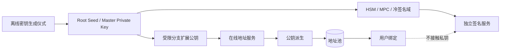
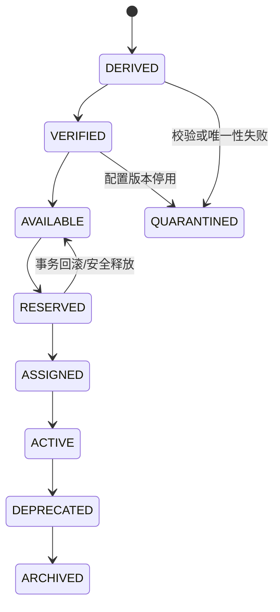
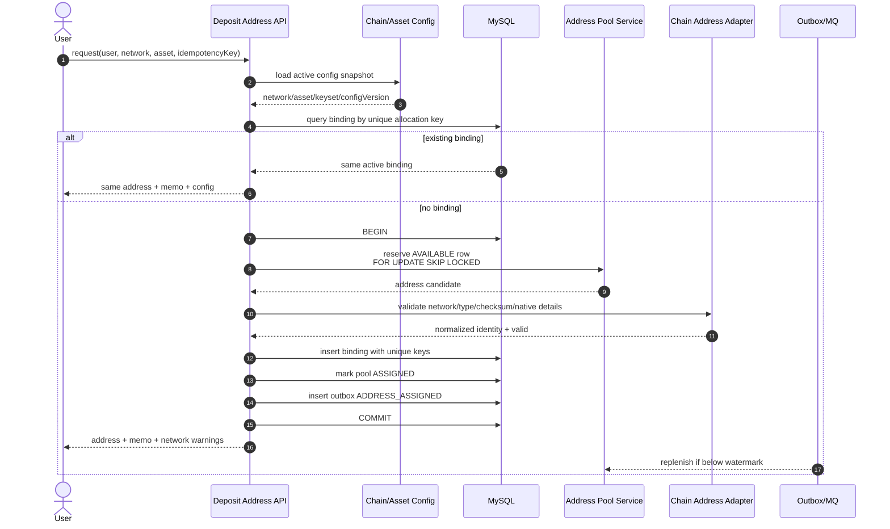
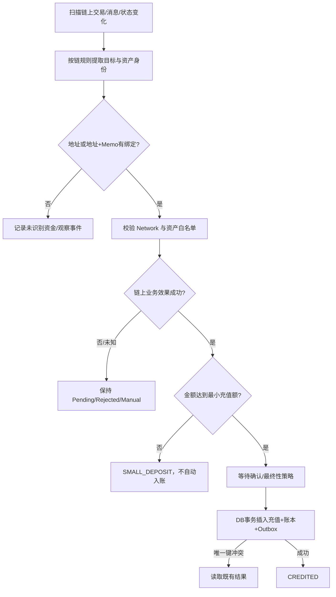

# Day 15：地址生成、分配与充值识别

> 学习目标：掌握独立地址、共享地址 + Memo 和合约地址三类充值模式；理解地址预生成、只用公钥派生、地址池分配与充值归属；能够设计地址池、用户绑定、派生批次表，完成 BTC/EVM/Solana/TON 地址校验，并处理幂等、隐私、地址污染和映射恢复。  
> 建议用时：4～5 小时  
> 完成标准：完成地址数据模型、用户申请充值地址时序图和四链地址测试清单；推演并发申请、数据库故障、错误网络、假 Token、Memo 缺失和映射重建；闭卷回答文末恰好 7 道面试题。

## 安全边界与关键结论

- 所有练习只使用 Regtest、Devnet、Testnet、本地沙箱或确定性夹具，不提交助记词、私钥、API Key、生产 xpub、公钥清单或用户地址映射。
- 地址服务原则上只持有满足派生所需的受限公钥材料，不应持有私钥或调用签名接口。
- 扩展公钥不是“公开无害数据”。泄露会暴露整个派生分支的地址、交易活动和业务规模；在部分非硬化派生场景下，与某个子私钥同时泄露还可能扩大密钥风险。
- 地址字符串合法不等于适合当前网络、资产和业务。必须同时校验 Network、地址类型、Checksum、Token 合约/Mint/Master、目标账户关系和平台策略。
- 地址分配的最终正确性依赖 MySQL 事务、唯一约束和不可变派生记录；Redis 只能缓存或减少争用。
- 充值地址归属与链上充值事实分离。扫到地址不自动等于可入账，还要验证资产白名单、实际转账效果、确认策略和最小充值金额。
- 不能根据名称、Symbol、Logo 或用户截图识别 Token；资产身份分别锚定 EVM contract、Solana Mint + Token Program、TON Jetton Master。
- 恢复能力必须在上线前演练。只备份数据库而不备份派生版本、网络、根公钥指纹和路径规则，不能证明可恢复。

---

## 一、三种充值地址模式

### 1. 独立地址

平台为用户或用户-链组合分配唯一链上地址：

```text
User A → Address A
User B → Address B
User C → Address C
```

优点：

- 扫描匹配直观，通常不依赖 Memo；
- 用户漏填附加字段的风险低；
- 争议时链上地址归属证据更清晰；
- 可按地址进行风控、归集和统计。

代价：

- 地址数量、扫描索引和归集任务增加；
- Token 归集可能需要补充原生币手续费；
- 地址复用暴露用户历史，影响隐私；
- 某些链上 Token 接收账户需创建或维护额外状态。

独立地址不一定代表独立私钥。HD Wallet 可由一个受控根密钥派生大量地址，在线服务仅使用扩展公钥派生可观察地址。

### 2. 共享地址 + Memo/Tag/Comment

多个用户共用一个链上收款地址，通过附加标识路由：

```text
Shared Address + Memo 100001 → User A
Shared Address + Memo 100002 → User B
```

优点：

- 减少地址和链上账户数量；
- 资产集中，通常减少后续归集；
- 适合原生支持 Memo/Tag 或消息 payload 的链路。

风险：

- 漏填、错填、过期或被钱包截断会进入人工处理；
- Memo 被填成另一用户有效值可能造成错账争议；
- 不同钱包/交易所对编码、长度和 Comment 支持不一致；
- 不能从发送地址可靠推断用户；
- 共享地址成为高价值集中目标和容量热点。

Memo 必须有严格字符集、长度、规范化、唯一性、生命周期和人工认领规则。不能模糊匹配或“智能纠错”。

### 3. 合约地址模式

平台使用智能合约或程序账户接收/路由充值，例如：

- EVM 充值合约为用户创建唯一 deposit address 或在调用中携带业务 ID；
- Solana Program/PDA 管理特定业务账户；
- TON 合约解析 Internal Message body 或 Jetton notification；
- 多签/智能钱包作为资金控制账户。

优势是可编程路由、事件和权限；代价是：

- 合约漏洞、升级权限、暂停和管理员密钥风险；
- 调用失败、事件缺失或部分执行；
- 用户若用普通转账而非指定函数，可能无法识别；
- 合约部署和调用增加 Gas/租金/消息费用；
- 充值地址看似合法，但平台未必支持向该合约直接转账。

### 4. 模式选择矩阵

| 维度 | 独立地址 | 共享地址 + Memo | 合约地址 |
|---|---|---|---|
| 识别依据 | 地址绑定 | 地址 + 严格 Memo | 合约调用/事件/状态 |
| 用户操作复杂度 | 低 | 中，高度依赖 Memo | 中，依赖钱包兼容 |
| 隐私 | 地址复用时较差 | 多用户混合但平台集中 | 取决于合约设计 |
| 归集成本 | 通常较高 | 通常较低 | 取决于合约与批处理 |
| 人工异常 | 地址/网络错误 | 漏填、错填最多 | 错函数、失败、事件异常 |
| 开发风险 | 派生与映射 | Memo 解析与争议 | 合约和升级安全 |
| 适用原则 | 默认优先，链支持时 | 有成熟运营流程时 | 有明确收益且审计充分时 |

---

## 二、地址生成不等于私钥在线

### 1. HD Wallet 角色分离



推荐分工：

| 组件 | 持有内容 | 允许动作 |
|---|---|---|
| 密钥仪式/备份 | Seed、主私钥备份 | 生成、恢复、轮换，严格审批 |
| HSM/MPC/签名域 | 私钥或份额 | 策略校验后签名，不分配用户地址 |
| 地址服务 | 受限 xpub/公钥、派生元数据 | 派生、校验、分配，不签名 |
| 扫链服务 | 规范化地址和绑定快照 | 匹配链上充值，不接触密钥 |
| 账本 | 用户/资产/流水 | 入账和对账，不推导密钥 |

### 2. 公钥派生的边界

BTC/EVM 等基于 secp256k1 的 HD 体系常可从扩展公钥派生非硬化子公钥。生产设计必须明确：

```text
purpose / coin_type / account' / change / address_index
```

BIP-44 常见结构为：

$$
m / purpose' / coin\_type' / account' / change / address\_index
$$

但不能机械将一个路径套到所有链和所有 SDK。Solana 常使用 Ed25519 且主流路径多为硬化派生，普通 xpub 在线子公钥派生能力与 secp256k1 不同；TON Wallet 地址又受钱包版本、workchain、subwallet/wallet ID、代码和 StateInit 影响。应采用链经审核的派生方案，必要时预先生成公钥/地址批次，而不是把 Seed 放在线上。

### 3. xpub 泄露的风险

- 可推导该分支全部地址，破坏用户和平台资金流隐私；
- 可识别地址增长速度、活跃用户和归集规律；
- 被攻击者用于针对性 dust、钓鱼或勒索；
- 若路径或网络隔离不当，可能跨环境关联地址；
- 某些非硬化模型中，xpub 与一个子私钥同时泄露可能推导上级私钥。

防护：

- 每链、每网络、每用途使用独立 account 分支；
- 地址服务只取得最小范围公钥材料；
- xpub 加密存储、访问审计，不写日志和普通配置中心；
- Dev/Test/Prod 根密钥完全隔离；
- 不把 xpub 发送给第三方节点或前端；
- 制定泄露后的地址迁移、监控和资金转移计划。

---

## 三、地址池与预生成

### 1. 为什么预生成

地址申请接口位于用户主路径，若每次请求实时访问远程密钥设施或复杂链上程序，延迟和故障面较大。地址池提前完成：

```text
派生 → 格式校验 → 唯一性检查 → 入池 → 分配
```

优点：低延迟、可提前审计、可在 HSM/离线批量输出公钥的链上工作。代价是需要库存水位、批次追踪和未使用地址保护。

### 2. 地址状态机



状态含义：

- `DERIVED`：已计算但尚未通过独立校验。
- `VERIFIED`：地址、网络、路径、根指纹和配置一致。
- `AVAILABLE`：可被事务领取。
- `RESERVED`：短事务内预留，不应长期停留。
- `ASSIGNED/ACTIVE`：已绑定用户，历史归属不可删除或转给其他用户。
- `DEPRECATED`：不再展示，但仍必须扫描历史充值。
- `QUARANTINED`：冲突、规则异常或批次问题，禁止分配。

### 3. 地址通常不复用给其他用户

即使用户关闭账户，历史地址仍可能收到延迟充值、退款或误转。如果将地址重新分给其他用户，会产生无法可靠判定归属的资金争议。因此：

```text
地址可停止展示，但历史绑定通常永久保留；
一个链上地址不应跨用户重新分配。
```

共享 Memo 若必须复用，也应有长隔离期、不可覆盖的历史版本和争议检查；更稳妥的是永久不复用。

### 4. 地址池水位

```text
available_count < low_watermark  → 创建派生批次
available_count > high_watermark → 暂停批次
oldest_available_age > threshold → 检查需求和配置漂移
```

监控按 `(network, address_scheme, keyset_version)` 分桶，避免旧 keyset 的地址库存被新配置错误消费。

---

## 四、地址数据模型

### 1. 密钥集合元数据

```sql
CREATE TABLE wallet_keyset (
    id                    BIGINT PRIMARY KEY,
    keyset_code           VARCHAR(64) NOT NULL,
    chain_family          VARCHAR(32) NOT NULL,
    network_id            VARCHAR(64) NOT NULL,
    purpose               VARCHAR(32) NOT NULL,
    public_material_ref   VARCHAR(256) NOT NULL,
    root_fingerprint      VARCHAR(32) NOT NULL,
    derivation_scheme     VARCHAR(64) NOT NULL,
    scheme_version        VARCHAR(32) NOT NULL,
    address_codec_version VARCHAR(32) NOT NULL,
    status                VARCHAR(24) NOT NULL,
    activated_at          TIMESTAMP NULL,
    retired_at            TIMESTAMP NULL,
    created_at            TIMESTAMP NOT NULL,
    UNIQUE KEY uk_keyset_code (keyset_code),
    UNIQUE KEY uk_keyset_scope
      (chain_family, network_id, purpose, keyset_code)
);
```

`public_material_ref` 应引用受控密钥存储，不直接存裸 xpub。表中不保存私钥。

### 2. 派生批次表

```sql
CREATE TABLE address_derivation_batch (
    id                    BIGINT PRIMARY KEY,
    batch_no              VARCHAR(64) NOT NULL,
    keyset_id             BIGINT NOT NULL,
    network_id            VARCHAR(64) NOT NULL,
    address_scheme        VARCHAR(32) NOT NULL,
    start_index           BIGINT NOT NULL,
    end_index             BIGINT NOT NULL,
    derivation_path_tpl   VARCHAR(128) NOT NULL,
    derivation_version    VARCHAR(32) NOT NULL,
    expected_count        BIGINT NOT NULL,
    generated_count       BIGINT NOT NULL DEFAULT 0,
    verified_count        BIGINT NOT NULL DEFAULT 0,
    status                VARCHAR(24) NOT NULL,
    checksum              VARCHAR(128) NULL,
    created_by            VARCHAR(64) NOT NULL,
    approved_by           VARCHAR(64) NULL,
    created_at            TIMESTAMP NOT NULL,
    completed_at          TIMESTAMP NULL,
    UNIQUE KEY uk_batch_no (batch_no),
    UNIQUE KEY uk_keyset_range
      (keyset_id, address_scheme, start_index, end_index)
);
```

仅靠 `(start_index, end_index)` 唯一键不能阻止区间部分重叠。分配索引时还需对 keyset 计数器行加锁，或为每个 index 在地址池中设置 `(keyset_id, derivation_index)` 唯一约束。

### 3. 地址池表

```sql
CREATE TABLE deposit_address_pool (
    id                    BIGINT PRIMARY KEY,
    network_id            VARCHAR(64) NOT NULL,
    chain_family          VARCHAR(32) NOT NULL,
    keyset_id             BIGINT NOT NULL,
    batch_id              BIGINT NOT NULL,
    derivation_index      BIGINT NOT NULL,
    derivation_path       VARCHAR(128) NOT NULL,
    address_scheme        VARCHAR(32) NOT NULL,
    address_display       VARCHAR(256) NOT NULL,
    address_normalized    VARCHAR(256) NOT NULL,
    address_hash          BINARY(32) NOT NULL,
    native_details_json   JSON NOT NULL,
    status                VARCHAR(24) NOT NULL,
    config_version        BIGINT NOT NULL,
    assigned_at           TIMESTAMP NULL,
    created_at            TIMESTAMP NOT NULL,
    version               BIGINT NOT NULL DEFAULT 0,
    UNIQUE KEY uk_derivation
      (keyset_id, derivation_index, address_scheme),
    UNIQUE KEY uk_network_address
      (network_id, address_hash)
);
```

`address_normalized` 用于协议正确比较，`address_display` 用于展示。不要统一做 lowercase：BTC Base58/Bech32、EVM checksum、Solana Base58、TON user-friendly 地址规则不同，应由链 Adapter 返回规范化形式和二进制 identity。

### 4. 用户地址绑定表

```sql
CREATE TABLE user_deposit_address_binding (
    id                    BIGINT PRIMARY KEY,
    user_id               BIGINT NOT NULL,
    account_id            BIGINT NOT NULL,
    network_id            VARCHAR(64) NOT NULL,
    asset_scope           VARCHAR(64) NOT NULL,
    allocation_key        VARCHAR(128) NOT NULL,
    address_pool_id       BIGINT NOT NULL,
    address_normalized    VARCHAR(256) NOT NULL,
    memo_normalized       VARCHAR(128) NULL,
    binding_version       BIGINT NOT NULL,
    status                VARCHAR(24) NOT NULL,
    valid_from            TIMESTAMP NOT NULL,
    valid_to              TIMESTAMP NULL,
    created_at            TIMESTAMP NOT NULL,
    UNIQUE KEY uk_allocation_request
      (user_id, network_id, asset_scope, allocation_key),
    UNIQUE KEY uk_pool_binding (address_pool_id),
    UNIQUE KEY uk_address_memo_version
      (network_id, address_normalized, memo_normalized, binding_version)
);
```

`asset_scope` 决定同一链地址是否可被多个受支持资产共用。例如 EVM EOA 可接收 ETH 和多个 ERC-20，但产品可能仍按 Network 分配；Solana Token 充值实际识别还涉及 owner、Mint 和 Token Account；TON Jetton 需要 owner 与 Jetton Wallet 关系。

### 5. 共享 Memo 占用表

```sql
CREATE TABLE shared_memo_lease (
    id                    BIGINT PRIMARY KEY,
    network_id            VARCHAR(64) NOT NULL,
    shared_address        VARCHAR(256) NOT NULL,
    memo_normalized       VARCHAR(128) NOT NULL,
    user_id               BIGINT NOT NULL,
    allocation_key        VARCHAR(128) NOT NULL,
    status                VARCHAR(24) NOT NULL,
    valid_from            TIMESTAMP NOT NULL,
    expires_at            TIMESTAMP NULL,
    quarantine_until      TIMESTAMP NULL,
    created_at            TIMESTAMP NOT NULL,
    UNIQUE KEY uk_memo_current
      (network_id, shared_address, memo_normalized),
    UNIQUE KEY uk_memo_request
      (user_id, network_id, shared_address, allocation_key)
);
```

若要保留多版本历史，不应更新覆盖此表；可将当前占用和历史表分开，释放时先归档，再经过隔离审批。资金系统更推荐 Memo 永不复用。

### 6. 为什么保存根指纹、路径和版本

从地址反推路径通常不可行。恢复必须知道：

```text
network
keyset/root fingerprint
public material reference
derivation scheme + version
exact path/index
wallet/codec/program version
address normalized identity
user binding history
```

只保存展示地址会导致无法证明签名端是否控制该地址，也无法确定用哪个分支恢复。

---

## 五、用户申请充值地址时序图



### 1. 分配事务伪代码

```text
allocateDepositAddress(request):
    validate idempotencyKey and user authorization
    config = loadVersionedConfig(request.network, request.asset)

    BEGIN
      existing = findBinding(
          userId, network, assetScope, idempotencyKey
      )
      if existing exists:
          COMMIT
          return existing

      candidate = SELECT * FROM deposit_address_pool
          WHERE network_id = config.network
            AND keyset_id = config.keyset
            AND status = 'AVAILABLE'
          ORDER BY id
          LIMIT 1
          FOR UPDATE SKIP LOCKED

      require candidate exists
      verified = chainAdapter.validate(candidate, config)
      require verified.normalized == candidate.address_normalized

      INSERT binding(...)
      UPDATE pool SET status='ASSIGNED', assigned_at=now()
          WHERE id=candidate.id AND status='AVAILABLE'
      require affectedRows == 1
      INSERT outbox(...)
    COMMIT

    return binding
```

### 2. 并发重试的结果

两个实例同时处理同一 `idempotencyKey`：

- 都可能先读到“无绑定”；
- 各自锁到不同地址；
- 只有一个能插入 `uk_allocation_request`；
- 另一个事务因唯一键冲突回滚，候选地址恢复 `AVAILABLE`；
- 冲突实例重新读取已存在绑定并返回同一结果。

这就是数据库约束兜底。仅使用 Redis `SETNX` 时，锁过期或主从切换可能产生双绑定。

### 3. 地址池耗尽

不要在无地址时绕过审核临时派生：

```text
POOL_EXHAUSTED
→ 返回可重试业务错误
→ 触发水位 P1 告警
→ 检查批次、keyset、配置和派生服务
→ 补池完成后重试同一 idempotencyKey
```

不能退回其他网络、旧 keyset 或未经验证地址。

---

## 六、地址归属与充值识别

### 1. 两阶段处理

```text
Stage A：链上事实摄取
  保存交易/消息、目标、资产身份、金额、区块锚点和原始证据

Stage B：业务识别
  匹配地址/地址+Memo绑定
  校验资产白名单、实际业务效果、确认和最小金额
  生成充值记录并幂等入账
```

地址绑定表不能直接充当账本。它只回答“在某个时间和配置下，这个接收标识属于谁”。

### 2. 充值识别流程



### 3. 时间语义

如果链上交易发生在绑定创建之前怎么办？必须有明确策略：

- 独立地址未曾分配前收到资金，默认不得猜用户；
- 地址分配后扫描到更早区块，需比较链上时间/高度和 `valid_from`；
- 区块时间可能被矿工/验证者影响，不应作为唯一顺序依据；
- 以不可变绑定历史、分配事务时间和链锚点综合判断；
- 历史地址不重新分配能显著简化此问题。

### 4. 资产白名单

```text
BTC native: network + native asset
EVM token: chain ID + contract address
Solana token: cluster + Mint + Token Program
TON Jetton: network + Master + expected Jetton Wallet relationship
```

同名 Token、错误合约、错误 Mint/Master 不得入账。资产 Registry 应版本化并保存审核来源、decimals、代码/Program 和状态。

### 5. 最小充值金额

最小充值额解决：

- 入账/归集费用高于资产价值；
- dust 攻击造成海量数据库和通知事件；
- 合规、风控和对账容量压力。

策略必须以 atomic units 保存：

```text
if amountAtomic < asset.minDepositAtomic:
    status = BELOW_MINIMUM
    do not credit automatically
```

产品应明确“小额不入账”是永久不入账、累计后入账还是可人工申请。不能让前端文案与账本逻辑不一致。

---

## 七、地址格式、网络和 Checksum

### 1. 校验分层

```text
L1 字符串：空值、长度、字符集、前后空白、控制字符
L2 编码：Base58/Base58Check/Bech32/hex/CRC 等
L3 网络：mainnet/testnet、chain/cluster/workchain
L4 类型：P2WPKH/EOA/Token Account/Wallet Contract 等
L5 资产：contract/Mint/Master 与接收账户关系
L6 业务：平台是否支持、Memo、黑白名单、风险策略
L7 动态状态：合约代码、账户 owner、初始化状态（需要节点）
```

纯格式校验与需要 RPC 的动态校验分开。节点不可用时不能把“无法动态验证”降级成“验证通过”。

### 2. 规范化原则

- 保留用户原始输入用于审计，但日志需转义和脱敏。
- 去除首尾空格只能作为显式产品规则；更安全的是提示用户确认，而非静默修改。
- Unicode 同形字符、零宽字符和换行应拒绝。
- EVM 比较可使用解析后的 20 字节；展示保留/生成 EIP-55 checksum。
- BTC Bech32 有大小写规则，不能通用 lowercase 后再验证；Base58 大小写敏感。
- Solana Base58 公钥大小写敏感，解码后必须为正确长度。
- TON 应解析 user-friendly CRC、test-only/bounceable 标志并转换 raw identity。

---

## 八、BTC 地址校验测试清单

### 1. 必测维度

- Network：Mainnet、Testnet、Regtest；
- 类型：P2PKH、P2SH、P2WPKH、P2WSH、P2TR；
- 编码：Base58Check、Bech32、Bech32m；
- witness version 与 checksum variant 对应关系；
- HRP：`bc`、`tb`、`bcrt` 等；
- 大小写、混合大小写、非法字符、截断、checksum 修改；
- Script type 是否被平台支持；
- 地址是否被错误网络接受；
- 输出 Script 能否从地址确定性生成并往返解析。

### 2. 测试表

| 用例 | 输入特征 | 预期 |
|---|---|---|
| Mainnet P2WPKH | 正确 `bc1...` 与 Bech32 | 仅 Mainnet 有效 |
| Testnet P2TR | 正确 `tb1p...` 与 Bech32m | 仅 Testnet 有效 |
| Regtest 地址 | `bcrt...` | 不得在生产网络通过 |
| HRP 错误 | Mainnet 配置收到 `tb...` | `NETWORK_MISMATCH` |
| checksum 单字符改变 | 任意类型 | 拒绝 |
| Bech32 混合大小写 | 同时含大小写 | 拒绝 |
| Base58 非法字符 | 包含 `0/O/I/l` 等 | 拒绝 |
| witness version/长度异常 | 可解码但程序不合法 | 拒绝 |
| 平台禁用 Legacy | 合法 P2PKH | 格式有效，业务不支持 |
| 前后空白/换行 | 正确地址外带字符 | 拒绝或显式确认，不静默放行 |

### 3. BTC 特有提醒

BTC 地址通常不能仅凭字符串判断“属于某个人”。平台充值归属来自地址池绑定；提币地址校验只能证明格式、网络和脚本类型，不证明收款人身份或地址仍由对方控制。

---

## 九、EVM 地址校验测试清单

### 1. 必测维度

- `0x` 前缀、40 个 hex 字符和解析后 20 字节；
- 全小写/全大写地址策略；
- 混合大小写必须满足 EIP-55；
- Chain ID 不编码在普通地址中，必须从请求上下文校验；
- 零地址、预编译地址、系统/黑洞地址策略；
- EOA 与合约地址动态检测及其局限；
- 合约在不同区块的 code、代理和自毁/重部署边界；
- Token contract 白名单与 decimals/code/admin；
- ENS 等名称不得在签名后再次解析，解析结果需固定；
- EIP-3770 等带链前缀格式若支持，应严格校验前缀映射。

### 2. 测试表

| 用例 | 输入特征 | 预期 |
|---|---|---|
| 正确 EIP-55 | 20 字节、checksum 正确 | 通过并返回 checksum 展示 |
| 错误混合大小写 | checksum 不匹配 | 拒绝 |
| 全小写 | 格式有效 | 按平台策略接受并规范展示 |
| 少/多一位 hex | 长度错误 | 拒绝 |
| 非 hex 字符 | 含 `g` 等 | 拒绝 |
| 零地址 | 格式可解码 | 业务策略拒绝 |
| 另一条 EVM 链上的同字符串 | 地址相同 | 不能推断网络，必须绑定 chain ID |
| 合约地址普通转账 | `eth_getCode` 非空 | 根据资产/业务能力判断，不自动拒绝或接受 |
| 未部署 CREATE2 目标 | 当前 code 为空 | 不能断言永远是 EOA |
| 假 ERC-20 | Symbol 相同、contract 不同 | 资产白名单拒绝 |

### 3. EOA/合约判断的边界

`eth_getCode(address, blockTag)` 返回空不等于永远是 EOA：合约可能尚未部署，代理/CREATE2 场景复杂，不同节点区块也可能不同。平台如果不支持合约收款，应把“动态 code 检查 + 风险提示 + 白名单例外”作为策略，而不是把它当密码学证明。

---

## 十、Solana 地址校验测试清单

### 1. 必测维度

- Base58 解码后为 32 字节公钥；
- 大小写敏感、非法字符、前后空白、截断；
- 普通地址字符串通常不编码 Mainnet/Devnet/Testnet，Network 来自请求上下文；
- Account 是否存在、owner Program、executable、数据长度；
- SOL 收款通常是系统账户/可接收 lamports 的公钥，但业务策略需明确；
- SPL Token 验证 Mint、Token Program、Token Account owner、authority；
- ATA 应按 owner + Mint + Token Program 正确推导；
- Token-2022 与经典 Token Program 不可混淆；
- PDA 可为合法程序地址，但没有普通私钥；
- Off-curve 地址不能被简单判为非法，取决于用途。

### 2. 测试表

| 用例 | 输入特征 | 预期 |
|---|---|---|
| 正确 32 字节 Base58 | 可解析公钥 | 格式通过 |
| 长度不是 32 字节 | Base58 可解码 | 拒绝 |
| 非法 Base58 字符 | 含 `0/O/I/l` | 拒绝 |
| Devnet/Mainnet 同字符串 | 公钥相同 | 必须由 cluster 上下文区分 |
| PDA 作为普通签名人 | off-curve | 用途校验拒绝签名人角色 |
| PDA 作为 Program 目标 | 合法 PDA | 可按 Program 规则接受 |
| 错误 ATA | owner/Mint 正确但地址不匹配 | 拒绝或创建正确 ATA |
| 假 Mint | 名称相同、Mint 不同 | 白名单拒绝 |
| Token Program 错误 | Mint 属于 Token-2022 却按经典解析 | 拒绝/使用正确 Adapter |
| 冻结/关闭 Token Account | 动态状态异常 | 暂停转账并提示 |

### 3. 用户地址与 Token Account

用户提供的通常是 owner 公钥，不一定是具体 Token Account。提币服务应根据受信 Mint 和正确 Token Program 推导/查询 ATA；不能把任意 Token Account 的地址当用户 owner，也不能只看账户有同名 Token。

---

## 十一、TON 地址校验测试清单

### 1. 必测维度

- raw address：`workchain:account_id`；
- user-friendly Base64/Base64URL 编码、长度和 CRC16；
- bounceable/non-bounceable 标志；
- test-only 标志与 Network；
- workchain 是否被业务支持；
- 转换 raw 后 identity 是否一致；
- Account 状态：nonexist、uninit、active、frozen；
- Wallet Contract version、code hash、StateInit；
- 首次转账时 bounce 选择；
- Jetton：Master、owner、预期 Jetton Wallet 与 code hash；
- Memo/Comment 的格式和共享地址绑定。

### 2. 测试表

| 用例 | 输入特征 | 预期 |
|---|---|---|
| 正确 Testnet user-friendly | test-only + CRC 正确 | 仅 Testnet 通过 |
| Testnet 地址用于 Mainnet | test-only 标志 | 拒绝 |
| CRC 单字符修改 | 可见字符近似 | 拒绝 |
| Bounceable active Wallet | code/state 正确 | 按业务通过 |
| Bounceable uninit 首次收款 | 目标未初始化 | 风险提示或按策略改用 non-bounceable |
| Non-bounceable 错误合约 | active 但目标不可信 | 不因 flag 合法而接受 |
| raw 与 friendly 同账户 | identity 相同 | 规范化为同一 raw identity |
| unsupported workchain | 格式正确 | 业务拒绝 |
| frozen account | 状态 frozen | 暂停并人工审核 |
| 假 Jetton Wallet | Master/owner/推导地址不匹配 | 拒绝 |

### 3. Bounceable 不是另一个账户

Bounceable 和 non-bounceable user-friendly 地址可指向同一 raw address。它们表达发送建议/标志，不是两个资金账户。数据库唯一性应基于规范化 raw identity 和 Network，而非展示字符串。

---

## 十二、统一地址校验接口

```java
public record AddressValidationRequest(
        NetworkId network,
        String address,
        AddressPurpose purpose,
        Optional<AssetId> assetId,
        Optional<String> memo,
        String configVersion) {
}

public record AddressValidationResult(
        ValidationStatus status,
        Optional<String> normalizedIdentity,
        Optional<String> displayAddress,
        Optional<String> addressType,
        Set<ValidationWarning> warnings,
        Optional<NativeAddressDetails> nativeDetails,
        String configVersion) {
}

public enum ValidationStatus {
    VALID,
    INVALID_FORMAT,
    CHECKSUM_FAILED,
    NETWORK_MISMATCH,
    UNSUPPORTED_TYPE,
    ASSET_MISMATCH,
    DYNAMIC_CHECK_REQUIRED,
    DYNAMIC_CHECK_FAILED,
    MANUAL_REVIEW
}
```

接口原则：

- `VALID` 必须对应明确 Network 和用途；
- 静态与动态校验结果可区分；
- 返回规范 identity，但不丢失展示形式；
- 链特有详情使用密封类型，不用无 Schema Map；
- 结果绑定配置版本和节点观测时刻；
- 地址验证不替代 AML、制裁名单和用户二次确认。

Java 风格调用：

```java
AddressValidationResult result = addressAdapter.validate(request);
if (result.status() != ValidationStatus.VALID) {
    throw new WithdrawalAddressRejected(result.status());
}

withdrawal.bindDestination(
    result.normalizedIdentity().orElseThrow(),
    result.displayAddress().orElseThrow(),
    result.configVersion()
);
```

签名服务还要从待签名交易独立解析目标并与已绑定 identity 比较，防止验证后到签名前被替换。

---

## 十三、地址复用、污染与隐私

### 1. 地址复用的影响

- 链上观察者可关联同一用户的多次充值；
- 可推测平台用户、余额和行为；
- BTC 地址复用会降低隐私，特定脚本场景还扩大公钥暴露面；
- 用户可能长期保存旧地址，导致迁移困难；
- 风险标签会沿历史交易传播，产生误报。

平台通常应为 BTC 等链按用户或周期提供独立地址；是否轮换需兼顾历史地址永久扫描、归集成本和用户体验。轮换不是删除旧地址。

### 2. 地址污染

地址污染包括：

- dust 攻击向地址发送微量资产；
- 同名假 Token 空投；
- 地址投毒：攻击者制造首尾相似地址，诱导用户复制错误历史地址；
- 恶意 Memo、超大 payload 或控制字符污染日志；
- 高风险来源资金导致 AML 命中；
- 向不支持的 Token Account/合约发送资产。

处理原则：

```text
链上收到 ≠ 平台支持 ≠ 自动入账
```

未知资产进入观察/隔离，不创建用户余额；前端展示完整校验后的地址，不只展示首尾；复制按钮从当前已认证请求返回值生成，不从交易历史猜地址。

### 3. 隐私与可恢复性的权衡

地址越分散，链上关联难度可能提高，但数据库映射和归集复杂度增加。平台应：

- 将用户身份与链地址映射放在受控数据域；
- 最小化服务访问范围，日志不直接记录 user + full address；
- 分离扫描用 address hash 与客服展示权限；
- 备份映射时加密并审计恢复操作；
- 对数据导出、分析和第三方标签服务做隐私评审。

---

## 十四、派生路径与用户映射恢复

### 1. 恢复所需材料

```text
1. Root/Keyset fingerprint 和安全备份
2. 每链每网络的 derivation scheme/version
3. account/change 分支与 index 范围
4. 地址 codec、Wallet/Program 版本
5. 派生批次与 checksum
6. 地址池 address identity ↔ path/index
7. 用户绑定不可变历史
8. Memo lease 历史
9. 扫描游标、充值记录和账本流水
10. 配置与 Adapter 历史版本
```

### 2. 恢复优先级

```text
先暂停新分配和自动入账
→ 恢复只读数据库副本
→ 验证 keyset fingerprint 与配置版本
→ 重派生地址并逐条比对
→ 重建地址索引，不立即绑定用户
→ 通过不可变绑定历史恢复用户关系
→ 链上扫描与账本三方对账
→ 影子模式观察
→ 恢复入账
→ 最后恢复新地址分配
```

### 3. 确定性重派生

```text
for each derivation batch:
    load approved keyset and exact scheme version
    for index in [startIndex, endIndex]:
        derived = derivePublicAddress(keyset, path(index), codecVersion)
        stored = findPoolAddress(keyset, index)
        require derived.normalizedIdentity == stored.normalizedIdentity

compare batch checksum and counts
```

任何不一致都停止恢复，不能自动“修正”为新地址。可能原因包括错误 xpub、路径模板、coin type、change 分支、钱包版本或 codec 变化。

### 4. 映射表丢失但地址池仍在

地址本身不能证明属于哪个用户。可从以下证据恢复：

- 数据库备份、binlog、CDC、只读副本；
- Outbox/MQ 审计事件；
- 地址申请 API 的安全审计日志；
- 加密离线映射快照；
- 用户历史展示记录只作为辅助，不能单独成为权威。

如果权威绑定证据无法恢复，应暂停自动入账并进入人工认领，不能按充值金额、时间或发送地址猜用户。

### 5. 灾备演练验收

- 从空数据库恢复地址、路径和绑定；
- 重派生结果 100% 与地址池一致；
- 每个 assigned 地址恰好一个用户历史归属；
- 每个 path/index 恰好一个地址；
- Memo 当前占用无重复，历史不覆盖；
- 扫描充值与账本逐笔可关联；
- 恢复环境不接触生产私钥明文；
- 演练输出 RTO、RPO、差异和审批记录。

---

## 十五、异常矩阵

| 异常 | 风险 | 自动处理 | 人工/告警 |
|---|---|---|---|
| 同一请求并发分配 | 一个用户得到两个地址 | 唯一键冲突后返回既有绑定 | 冲突率异常告警 |
| 同一地址绑定两个用户 | 错账 | `uk_pool_binding` 拒绝 | P0 安全告警 |
| 派生 index 重复 | 地址重复/路径冲突 | 唯一键拒绝并隔离批次 | 暂停 keyset |
| 派生区间重叠 | 批次冲突 | 计数器行锁 + index 唯一键 | 批次审核 |
| 地址池耗尽 | 申请失败 | 返回可重试，不降级错网络 | P1 水位告警 |
| xpub/keyset 配错 | 全批地址错误 | 独立重派生校验、隔离 | 暂停分配 |
| codec 版本漂移 | 地址解释变化 | 绑定原版本 | 配置审查 |
| Mainnet/Testnet 混用 | 资金丢失 | Network 校验拒绝 | P0/P1 |
| Checksum 错误 | 发往错误地址 | 拒绝 | 用户提示 |
| EVM 地址 checksum 不符 | 输入错误或污染 | 按策略拒绝混合大小写 | 记录原因 |
| Solana ATA/Mint 错配 | Token 到错误账户 | 推导并验证 ATA | 暂停提币 |
| TON test-only/bounce 错误 | 错网或 Bounce | 解析 flag/state | 人工审核 |
| 合约地址不支持直充 | 充值无法识别 | 动态检查/提示 | 人工找回流程 |
| 假 Token 空投 | 错误入账 | 资产白名单拒绝 | 攻击量告警 |
| Memo 缺失/错误 | 无法归属或错账 | 隔离，不猜用户 | 认领工单 |
| 小于最小充值额 | 成本/容量攻击 | `BELOW_MINIMUM` | 按产品规则处理 |
| 地址绑定后删除 | 历史充值丢失 | 禁止物理删除 | 审计告警 |
| 旧地址被重新分配 | 延迟充值错账 | 永不跨用户复用 | P0 |
| Scanner 规范化错误 | 漏匹配/错匹配 | 使用链二进制 identity | 回放差异 |
| 节点动态校验超时 | 错把未知当有效 | `DYNAMIC_CHECK_REQUIRED` | 降级或暂停 |
| 数据库提交后响应超时 | 客户端重试 | 同 idempotencyKey 返回既有绑定 | 正常监控 |
| Outbox 发送失败 | 下游缓存未更新 | Outbox 重发 | 积压告警 |
| 映射备份损坏 | 无法归属充值 | 暂停入账、从多源恢复 | 灾难响应 |
| xpub 泄露 | 隐私/组合密钥风险 | 停止新分配、迁移 keyset | 安全事件 |
| dust/地址投毒 | 噪声与误复制 | 最小金额、完整地址展示 | 风控告警 |

---

## 十六、监控与 Runbook

### 1. 关键指标

```text
address_pool_available{network,keyset,scheme}
address_pool_oldest_available_age_seconds
address_derivation_batch_total{status}
address_derivation_verification_failure_total{reason}
address_allocation_total{network,result}
address_allocation_conflict_total
address_allocation_latency_seconds
address_binding_invariant_violation_total
address_validation_total{chain,result,reason}
memo_missing_or_invalid_total{network}
unrecognized_deposit_total{chain,asset}
below_minimum_deposit_total{asset}
unsupported_asset_observed_total{chain}
address_mapping_recovery_difference_total
historical_address_scan_lag
outbox_backlog{event=address_assigned}
```

地址、xpub、用户 ID 和 Memo 不应作为指标标签。

### 2. 告警分级

| 级别 | 示例 | 动作 |
|---|---|---|
| P0 | 地址跨用户重复绑定、主测试网混用、映射错账 | 暂停分配与入账，冻结影响范围 |
| P1 | keyset/批次校验失败、地址池耗尽、xpub 泄露 | 停止该 keyset，启动安全/恢复流程 |
| P2 | 水位低、动态校验失败率高、Memo 工单积压 | 补池、切节点、扩容审核 |
| P3 | 单笔格式错误、dust、小额充值 | 自动策略处理并统计 |

### 3. 单笔充值未识别 Runbook

1. 获取 Network、真实 tx/signature/Message Hash，不以截图为证据。
2. 按链解析真实目标 identity、资产身份和 atomic amount。
3. 查询目标地址/地址 + Memo 的完整绑定历史。
4. 核对交易锚点与绑定 `valid_from`，检查是否为旧地址。
5. 校验 EVM contract、Solana Mint/Token Program、TON Master/Wallet。
6. 检查实际业务效果、重组/Commitment/Bounce 和确认策略。
7. 检查最小充值额、Memo 规范和平台支持状态。
8. 对比 Scanner 原始事件、解析版本、充值表和账本。
9. 有唯一权威归属才可走审批补账；否则保持隔离。
10. 修复后历史回放，验证没有其他漏扫或错账。

### 4. 地址映射故障 Runbook

1. 暂停新地址分配和自动入账，保留链上事实采集。
2. 固化数据库、binlog、CDC、Outbox 和配置版本。
3. 验证 keyset fingerprint，不导出私钥到在线环境。
4. 在隔离环境重派生并比较批次 checksum。
5. 从权威备份恢复绑定，检查唯一性不变量。
6. 重扫受影响区间并与账本对账。
7. 影子运行无差异后先恢复入账，再恢复分配。

---

## 十七、口头面试题参考答案

> 本节严格包含计划中的 7 道题。先闭卷口述，再按“结论 → 原理 → 生产实现 → 异常与风险 → 监控和恢复”补全。

### 1. 交易所为什么通常为用户分配独立充值地址？

**参考回答：**

独立地址让链上目标与用户绑定关系清晰，充值识别通常不依赖 Memo，可降低漏填、错填和跨用户争议，也便于按地址进行风控、归集和审计。它不代表每个地址都有独立 Seed，通常由受控 HD 分支批量派生。

代价是地址池、扫描索引和归集成本增加，Token 地址还可能需要原生币补费。生产系统应永久保留历史绑定，不把旧地址重分给其他用户；使用数据库唯一约束保证分配幂等，并通过归集阈值、地址轮换和隐私访问控制平衡成本。

### 2. 在线地址服务是否必须接触私钥？

**参考回答：**

通常不需要。secp256k1 等支持的方案可让在线服务持有受限扩展公钥并派生子公钥和地址，私钥留在 HSM、MPC 或冷签名域。对于不适合普通 xpub 在线派生的链，如常见 Ed25519 硬化路径，可在离线/受控环境预生成公钥或地址批次再导入地址池。

在线服务只做派生、校验和绑定，不提供签名。扩展公钥仍是敏感资产，会暴露整条地址分支；应按链、网络、用途隔离，加密存储和审计，绝不写日志。签名服务根据路径和审批独立重建/验证地址后签名。

### 3. 如何避免把主公钥泄露风险扩大为资产风险？

**参考回答：**

首先不把 master xpub 直接给所有服务，而是按链、网络、账户和用途切分最小范围的受限分支公钥；生产、测试完全隔离。公钥材料放受控密钥存储，地址服务最小权限访问，不进入日志、配置中心、前端或第三方节点，并监控异常批量派生和导出。

还要避免危险派生组合：明确 hardened/non-hardened 边界，防止 xpub 与子私钥同时泄露导致上级密钥风险。签名端独立验证路径、根指纹和地址，设置额度和白名单。xpub 泄露后停止新分配、迁移 keyset、加强旧地址监控并逐步转移资金。

### 4. 共用地址 + Memo 模式有哪些运营风险？

**参考回答：**

主要风险是用户漏填、错填、钱包不支持或编码被修改，导致无法归属；若误填成另一用户有效 Memo，还可能错账。共享地址也是资金和性能热点，Memo 解析规则、有效期、复用以及客服认领都会带来长期运营成本。

生产上要限定 ASCII/长度等规范，地址 + Memo 唯一绑定并保存不可变历史，最好不复用。漏填或错误时隔离，不能按发送地址或相似 Memo 猜用户；人工认领需要真实链上哈希、身份和地址控制证据，双人审批后用账本调整流水处理，并监控异常率和工单积压。

### 5. 如何校验用户输入的提币地址和网络？

**参考回答：**

分层校验字符串、编码/Checksum、Network、地址类型、资产关系、平台策略和动态账户状态。BTC 检查 Base58Check/Bech32(m)、HRP 和 Script；EVM 检查 20 字节和 EIP-55，但普通地址本身不含 chain ID；Solana 检查 32 字节公钥并核验 Mint、Token Program、ATA；TON 检查 CRC、test-only、workchain、账户状态和 bounce 标志。

Token 还要按白名单 contract/Mint/Master 识别，不能看 Symbol。规范化后固定二进制 identity、配置版本并让用户二次确认；签名服务从最终交易独立解析目标再比对。节点动态校验不可用时返回未知或暂停，不能默认通过。

### 6. 地址分配请求重试时如何保证幂等？

**参考回答：**

客户端为一次申请提供稳定 idempotency key，服务在 MySQL 事务中先按 `(user, network, assetScope, allocationKey)` 查询绑定，再使用 `FOR UPDATE SKIP LOCKED` 领取地址，插入绑定、更新地址状态和写 Outbox。请求唯一键与 `address_pool_id` 唯一键共同保证一个请求一个结果、一个地址一个用户。

两个实例并发时即使各自领取不同地址，也只有一个能插入请求唯一键，另一个回滚后读取并返回已存在绑定。数据库提交后响应超时，客户端用同一 key 重试仍得到同一地址。Redis 可减少争用，但锁过期时唯一约束才是资金正确性底线。

### 7. 派生路径和用户映射丢失后如何恢复？

**参考回答：**

先暂停新分配和自动入账，保留只读扫链。恢复需要 keyset/root fingerprint、安全公钥/密钥备份、精确派生方案与版本、批次 index 范围、codec/钱包版本、地址池、不可变用户绑定、Memo 历史、扫描游标和账本，而不只是 Seed 或地址列表。

在隔离环境按原版本确定性重派生，逐个比较 normalized identity 和批次 checksum，再从数据库备份、binlog、CDC、Outbox 和加密快照恢复用户绑定。地址本身不能反推出用户；权威映射无法恢复的资金进入人工认领，不能按金额或发送地址猜测。完成链上、业务记录和账本对账并影子运行无差异后逐级恢复。

---

## 十八、当天任务

### 任务 1：充值模式与边界（40 分钟）

- [ ] 比较独立地址、共享地址 + Memo、合约地址。
- [ ] 为 BTC/EVM/Solana/TON 选择默认模式并说明理由。
- [ ] 列出每种模式一个错账场景和恢复动作。
- [ ] 解释“链上收到”和“平台支持入账”的区别。

### 任务 2：地址池与表结构（60～90 分钟）

- [ ] 完成 keyset、派生批次、地址池、用户绑定和 Memo 表。
- [ ] 为 request、address、path/index 设计唯一约束。
- [ ] 推演两个实例同时处理同一申请。
- [ ] 推演地址池低水位、耗尽和错误批次。

### 任务 3：用户申请时序图（45 分钟）

- [ ] 重画 Config、API、DB、Pool、Adapter 和 Outbox 时序。
- [ ] 标注事务边界、行锁和唯一键冲突路径。
- [ ] 推演数据库提交成功但 API 响应超时。
- [ ] 证明重试返回相同地址和 Memo。

### 任务 4：四链地址测试（60～90 分钟）

- [ ] BTC 覆盖 Mainnet/Testnet、Base58Check、Bech32(m) 和 Script type。
- [ ] EVM 覆盖 EIP-55、chain ID、零地址、EOA/合约边界和假 Token。
- [ ] Solana 覆盖 32 字节、cluster、PDA、ATA、Mint 和 Token Program。
- [ ] TON 覆盖 CRC、test-only、workchain、bounce、账户状态和 Jetton Wallet。
- [ ] 每条链至少准备 5 个正常/异常夹具，注明来源，不伪造链上结果。

### 任务 5：恢复与隐私（45 分钟）

- [ ] 列出恢复地址和用户映射的全部材料。
- [ ] 设计从空库重派生与恢复的演练步骤。
- [ ] 列出 xpub 泄露、地址投毒和 dust 的响应动作。
- [ ] 将地址访问权限和日志脱敏规则写入检查表。

### 任务 6：口述（30～45 分钟）

- [ ] 不看资料回答本节恰好 7 道题并录音。
- [ ] 每题覆盖一个异常、监控或恢复场景。
- [ ] 用 5 分钟讲清“在线派生不等于在线私钥”。
- [ ] 将薄弱点写入 `progress.md`。

---

## 十九、闭卷验收

- [ ] 能比较独立地址、共享地址 + Memo 和合约地址。
- [ ] 能解释独立地址为何不等于独立 Seed。
- [ ] 能说明在线地址服务不接触私钥的方案与链差异。
- [ ] 能解释 xpub 的隐私和组合密钥风险。
- [ ] 能设计按链、网络、用途隔离的 keyset。
- [ ] 能画出地址池状态机并说明地址不跨用户复用。
- [ ] 能设计 keyset、派生批次、地址池和绑定表。
- [ ] 能用唯一约束防止 path/index 和地址重复。
- [ ] 能处理派生区间部分重叠风险。
- [ ] 能画出用户申请地址时序和事务边界。
- [ ] 能证明并发重试只返回一个绑定。
- [ ] 能处理地址池低水位和耗尽，不降级到错误地址。
- [ ] 能区分展示地址、规范化 identity 和 address hash。
- [ ] 能分层校验格式、网络、类型、资产和动态状态。
- [ ] 能完成 BTC Base58Check/Bech32(m) 地址测试。
- [ ] 能完成 EVM EIP-55、chain ID 和合约边界测试。
- [ ] 能完成 Solana 公钥、PDA、ATA、Mint/Program 测试。
- [ ] 能完成 TON CRC、test-only、bounce、状态和 Jetton 测试。
- [ ] 能说明 Token 资产身份不能依赖名称和 Symbol。
- [ ] 能设计充值识别、最小金额和幂等入账流程。
- [ ] 能解释地址复用、dust、地址投毒和隐私风险。
- [ ] 能从 keyset、批次和绑定历史恢复映射。
- [ ] 能在映射无法恢复时安全进入人工认领。
- [ ] 闭卷回答恰好 7 道面试题，覆盖异常、安全和恢复。

## 二十、Day 15 验收清单

- [ ] 已完成地址池、用户绑定和派生批次表设计。
- [ ] 已完成用户申请充值地址时序图。
- [ ] 已完成 BTC/EVM/Solana/TON 地址校验测试清单。
- [ ] 已定义独立地址、共享 Memo 和合约地址使用边界。
- [ ] 地址服务不持有私钥，公钥材料按最小权限管理。
- [ ] 已记录 keyset fingerprint、派生方案、路径和 codec 版本。
- [ ] 已为 request、pool address、path/index 设置唯一约束。
- [ ] 已推演并发申请和响应超时重试。
- [ ] 已定义地址池状态、水位、补池和耗尽策略。
- [ ] 历史地址和 Memo 映射不可覆盖，地址不跨用户复用。
- [ ] 已完成资产白名单和最小充值额策略。
- [ ] 已区分静态格式校验和节点动态校验。
- [ ] 已推演假 Token、dust、地址投毒和合约不支持直充。
- [ ] 已设计 xpub 泄露响应和地址迁移策略。
- [ ] 已完成映射丢失后的恢复与三方对账流程。
- [ ] 已录音回答 7 道题并更新 `progress.md`。
- [ ] Git 中没有私钥、助记词、xpub、API Key 或生产地址映射。

## 二十一、30 分自评分

| 能力 | 1 分 | 3 分 | 5 分 | 今日得分 |
|---|---|---|---|---|
| 充值模式 | 只知道独立地址 | 能比较 Memo/合约 | 能按风险、成本、隐私和恢复选择模式 |  |
| 派生与密钥边界 | 认为生成地址要私钥 | 会用公钥派生 | 能处理链差异、xpub 风险、版本和迁移 |  |
| 地址池与幂等 | 只会 insert 地址 | 有状态和事务 | 能处理并发、唯一约束、水位、耗尽和审计 |  |
| 四链校验 | 只做正则 | 能校验编码/网络 | 能校验类型、资产关系、动态状态与策略 |  |
| 充值识别 | 地址命中即入账 | 能校验资产/金额 | 能处理链效果、确认、假币、幂等和异常 |  |
| 恢复与隐私 | 只备份数据库 | 能重派生地址 | 能恢复映射、三方对账并处置泄露/污染 |  |

**当日总分：** ____ / 30  
**Keyset / Root Fingerprint：** ______________________________  
**Derivation Scheme / Version：** ______________________________  
**Address Codec Version：** ______________________________  
**Pool Low / High Watermark：** ______________________________  
**完成的并发或恢复演练：** ______________________________  
**四链校验失败样例数：** BTC ___ / EVM ___ / SOL ___ / TON ___  
**最薄弱的三个知识点：** 1. __________ 2. __________ 3. __________  
**明日优先补强：** ______________________________
