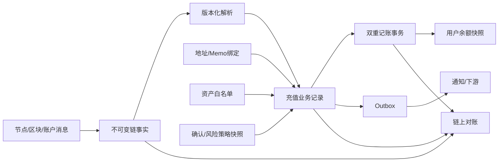
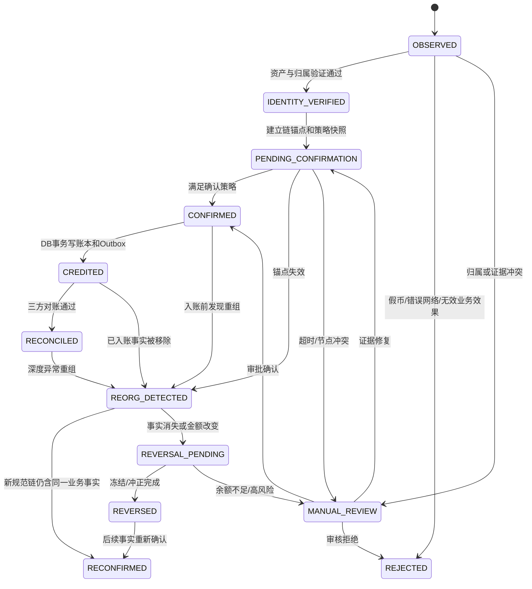
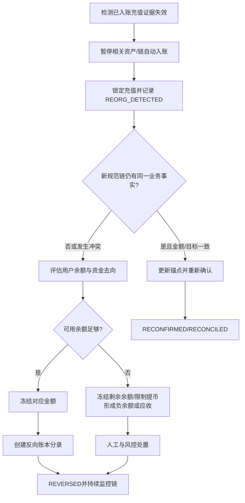
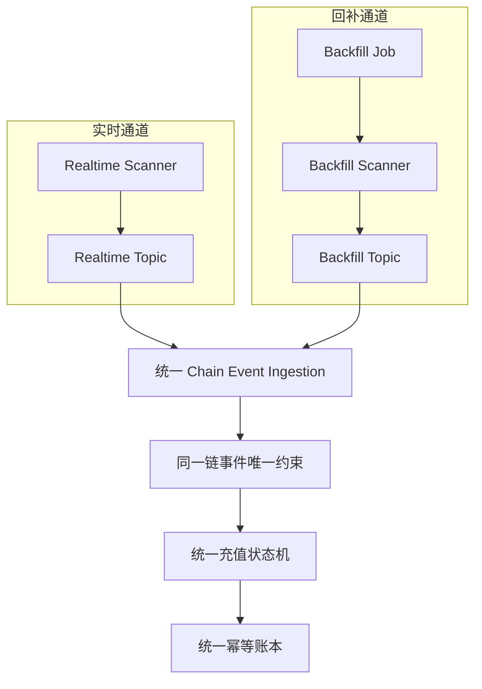

# Day 16：充值状态机、确认策略与重组补偿

> 学习目标：设计支持 BTC、EVM、Solana、TON 的统一充值状态机；掌握链上事实、充值业务记录和内部账本的职责边界；使用业务唯一键、MySQL 事务、唯一约束与 Outbox 实现重复扫描下的幂等入账；能够按链、资产、金额与风险制定确认策略，并处理重组、负余额、冻结、漏扫和历史重扫。  
> 建议用时：5～6 小时  
> 完成标准：完成统一充值状态机、充值/账本/幂等表结构以及重复扫描、重组、漏扫三类故障演练；为每次状态迁移写出前置条件、链上证据和补偿动作；闭卷回答文末恰好 7 道面试题。

## 安全边界与核心不变量

- 所有实验只使用 Regtest、Devnet、Testnet、本地沙箱或确定性夹具，不伪造交易哈希、确认状态、重组结果或生产数据。
- 扫描服务允许重复发现同一链上事实，但同一充值只能产生一次正向账本效果。
- 链上交易记录、充值业务记录、账本流水必须分表、分职责；不能更新或删除历史记录来“修复余额”。
- 区块高度、交易哈希、节点返回 `success` 都不是跨链通用的最终成功证据。必须保留链特有身份、业务效果和确认依据。
- 已入账充值被重组移除时，不删除原流水；通过冻结、反向分录、负余额控制和人工审批修正。
- Redis 锁、Webhook、MQ 去重、单节点 RPC 和浏览器 API 都不是资金幂等的最终防线。最终防线是数据库唯一约束、事务和可对账账本。
- 历史重扫与实时扫描必须隔离资源、游标和速率，但写入同一套唯一约束与状态机，不能建立第二套“快速入账”路径。
- 任一证据冲突、资产身份不明、地址归属不明、Memo 错误或链状态无法确认时，优先进入 `MANUAL_REVIEW`，不能猜测入账。

资金不变量：

```text
I1. 一个不可变链上充值事实最多对应一条充值业务记录。
I2. 一条充值业务记录最多产生一次正向入账分录。
I3. 链上事实未通过资产、归属、业务效果和确认策略前，不得入账。
I4. 状态迁移必须单调；迟到事件不能把终态静默覆盖为早期状态。
I5. 重组补偿保留原始正向流水，并产生可审计反向流水。
I6. 充值记录、账本流水和用户余额可通过唯一 ID 双向追溯。
I7. 扫描游标推进与链事实保存具备可恢复边界，崩溃后允许重扫而不丢资金。
I8. 人工补账、冲正和解冻均需审批、幂等键和不可变审计记录。
```

---

## 一、充值系统的三层事实

### 1. 链上事实层

回答“链上观察到了什么”：

```text
network / chain identity
block, slot, account LT or other chain anchor
transaction / signature / message identity
input/output/log/instruction/message role
source and destination
asset contract / Mint / Master
atomic amount
execution result
observed confirmation/finality
raw evidence reference
parser version
```

特点：尽量不可变、允许重复摄取、支持解析器重放。节点字段变化不应直接改变用户余额。

### 2. 充值业务层

回答“平台是否把该链上事实认作某用户某资产的一笔充值”：

```text
deposit_id
chain_event_id
user/account
asset_id
address or address+memo binding
amount_atomic
risk and confirmation policy snapshot
business status
credited ledger transaction id
rollback relation
manual review case
```

充值记录是链事实到业务资金效果的桥梁，不是余额本身。

### 3. 内部账本层

回答“平台对用户负债发生了什么变化”：

```text
ledger_transaction_id
idempotency_key
accounts
balanced debit/credit entries
amount_atomic
reference_type / reference_id
reversal_of
created_at
```

账本应不可变。余额是分录聚合或经过校验的快照，不是充值表某个状态字段的别名。

### 4. 三层关系图



不要让 Scanner 直接执行 `UPDATE user_balance`。否则解析修复、重复扫描、重组和审计都难以安全处理。

---

## 二、统一充值状态机

### 1. 主状态定义

| 状态 | 含义 | 是否产生可用余额 |
|---|---|---:|
| `OBSERVED` | 扫描到候选链上事实 | 否 |
| `IDENTITY_VERIFIED` | Network、资产、目标地址/Memo 归属已验证 | 否 |
| `PENDING_CONFIRMATION` | 业务效果成立，等待确认/最终性 | 否 |
| `CONFIRMED` | 满足当前策略，可进入账务事务 | 否 |
| `CREDITED` | 正向账本事务已提交 | 是 |
| `RECONCILED` | 链上、充值和账本对账闭环 | 是 |
| `REORG_DETECTED` | 原链锚点不再属于规范链或事实失效 | 视补偿进度 |
| `REVERSAL_PENDING` | 等待冻结、冲正或人工决策 | 可能冻结 |
| `REVERSED` | 反向分录已提交 | 否/形成负余额 |
| `RECONFIRMED` | 重组后同一业务事实在新规范链重新成立 | 取决于原处理 |
| `REJECTED` | 非支持资产、错误目标、失败执行、小额策略等 | 否 |
| `MANUAL_REVIEW` | 证据冲突、Memo/归属或补偿不能自动决定 | 受控 |

### 2. 状态机图



### 3. 为什么 `CONFIRMED` 与 `CREDITED` 分开

`CONFIRMED` 是链与策略结论，`CREDITED` 是内部账务结论。两者之间可能出现：

- 账本服务不可用；
- 数据库死锁/超时；
- 风控二次冻结；
- 重组恰好发生；
- 服务在事务前后崩溃。

将它们分开才能监控“链已确认但未入账”的积压，也能安全重试账务事务。

### 4. 单调迁移与版本控制

```sql
UPDATE deposit
SET status = :nextStatus,
    version = version + 1,
    updated_at = NOW()
WHERE id = :depositId
  AND status = :expectedStatus
  AND version = :expectedVersion;
```

`affected_rows = 0` 时重新读取，不盲目覆盖。状态历史另表追加保存，不能只保留当前状态。

### 5. 链特有子状态

统一主状态不抹平链差异：

| 链 | `PENDING_CONFIRMATION` 内部证据 |
|---|---|
| BTC | tx 所在 block height/hash、目标 `txid:vout`、后续深度、inputs 冲突情况 |
| EVM | block number/hash、Receipt status、原生转账或 Log identity、`removed`、safe/finalized |
| Solana | signature、slot、`meta.err`、Instruction/Token Balance、Commitment |
| TON | source/destination transaction LT/hash、Internal Message Hash、目标执行、Bounce、消息链 |

---

## 三、状态迁移规则

### 1. `OBSERVED → IDENTITY_VERIFIED`

前置条件：

- 节点 Network 身份正确；
- 链上唯一身份可构造；
- 目标地址或地址 + Memo 有唯一有效绑定；
- 资产在白名单，contract/Mint/Master 正确；
- atomic amount 大于零且解析无溢出；
- 链特有业务效果可验证。

失败路径：假 Token、无绑定、错误 Memo、执行失败、小于最小金额分别进入 `REJECTED` 或 `MANUAL_REVIEW`，不得静默丢弃。

### 2. `IDENTITY_VERIFIED → PENDING_CONFIRMATION`

保存不可变策略快照：

```text
confirmation_policy_version
required_depth / commitment / finality target
risk_tier
amount_tier
address_risk_snapshot
asset_config_version
parser_version
first_seen_anchor
```

策略后来变化不应静默重解释已入账历史。对仍 pending 的充值是否升级策略，要有明确的向上兼容规则并记录版本。

### 3. `PENDING_CONFIRMATION → CONFIRMED`

```text
confirm only if:
  chain anchor remains canonical
  business effect still exists
  current evidence satisfies saved policy
  no conflicting node evidence
  asset and address binding remain valid for event time
  deposit is not compliance-frozen
```

“确认数达到”只是 BTC/EVM 某类策略的一部分，不适合直接替代 Solana Commitment 和 TON 消息链完成状态。

### 4. `CONFIRMED → CREDITED`

必须在一个本地数据库事务中：

1. 锁定充值记录；
2. 验证状态与版本；
3. 创建唯一账本事务；
4. 插入平衡分录并更新余额快照；
5. 更新充值为 `CREDITED`；
6. 写入 Outbox。

任何一步失败全部回滚。

### 5. `CREDITED/RECONCILED → REORG_DETECTED`

触发条件：

- 原 block hash 不再是该高度规范块；
- EVM Log 标记 `removed` 或交易 Receipt 消失；
- Solana 低 Commitment 交易未进入更高 Commitment 并从规范视图消失；
- 链特有事实、消息目标或金额与已入账证据矛盾；
- 多节点达到冲突阈值。

状态改变只表示检测到风险，不能立即删除账本流水。

---

## 四、跨链充值唯一键

### 1. 唯一键的目标

唯一键应标识“不可变链上业务效果”，而不是方便字段。错误示例：

```text
transaction_hash only
user_id + amount
address + amount + time
query_id only
block_height + transaction_index only
```

同一交易可含多个输出、Logs、Instructions 或 Messages；同金额可重复出现；区块位置在重组后会改变。

### 2. 推荐身份

| 链/资产 | 链上充值身份示例 |
|---|---|
| BTC | `(network, txid, vout)` |
| EVM 原生币 | `(chain_id, tx_hash, transfer_role, trace_path?)`，明确是否支持内部转账 |
| ERC-20 | `(chain_id, tx_hash, log_index, token_contract)` |
| Solana SOL | `(cluster, signature, instruction_path/account_change_role, destination)` |
| SPL Token | `(cluster, signature, instruction_path, mint, destination_token_account)` |
| TON 原生币 | `(network, destination_account, internal_message_hash, message_role)` |
| Jetton | `(network, master, recipient_jetton_wallet, internal_message_hash, message_role)` |

具体 identity 必须由链 Adapter 版本化定义。内部统一可计算：

$$
\text{eventKey} = H(\text{canonical chain identity fields})
$$

但数据库仍应保存组成字段，便于审计和迁移，不能只存不可解释哈希。

### 3. 重组时身份是否变化

- BTC `txid:vout` 在交易被重新打包时通常保持相同，可更新 block anchor；若被冲突交易替换则原事实失效。
- EVM 同一 tx hash 可进入新块，但 Log 的 block anchor 变化；业务 identity 仍可保持，需更新规范锚点历史。
- Solana signature 通常是重要身份，但必须结合业务 role；过期重签可能产生新 signature，应由更高层关联而非合并不同链事实。
- TON Message Hash 与 Transaction Hash 不同；消息可能跨账户，目标业务 identity 应锚定正确消息角色。

“同一业务事实重新进入规范链”与“出现另一笔经济上相似的转账”必须区分。

---

## 五、充值记录、账本与幂等表

### 1. 链事件表

```sql
CREATE TABLE chain_event (
    id                    BIGINT PRIMARY KEY,
    network_id            VARCHAR(64) NOT NULL,
    chain_family          VARCHAR(32) NOT NULL,
    event_key             BINARY(32) NOT NULL,
    event_type            VARCHAR(48) NOT NULL,
    transaction_ref       VARCHAR(256) NOT NULL,
    event_position        VARCHAR(256) NOT NULL,
    source_identity       VARCHAR(256) NULL,
    destination_identity  VARCHAR(256) NOT NULL,
    asset_native_identity VARCHAR(256) NOT NULL,
    amount_atomic         VARCHAR(128) NOT NULL,
    block_height_or_slot  DECIMAL(40, 0) NULL,
    block_hash            VARCHAR(256) NULL,
    canonical_status      VARCHAR(32) NOT NULL,
    execution_status      VARCHAR(32) NOT NULL,
    raw_evidence_ref      VARCHAR(512) NOT NULL,
    parser_version        VARCHAR(32) NOT NULL,
    first_seen_at         TIMESTAMP NOT NULL,
    last_seen_at          TIMESTAMP NOT NULL,
    UNIQUE KEY uk_chain_event (network_id, event_key)
);
```

`amount_atomic` 使用可容纳超大整数的十进制字符串或足够宽 DECIMAL，不使用 `double`。

### 2. 充值业务表

```sql
CREATE TABLE deposit (
    id                         BIGINT PRIMARY KEY,
    deposit_no                 VARCHAR(64) NOT NULL,
    chain_event_id             BIGINT NOT NULL,
    network_id                 VARCHAR(64) NOT NULL,
    user_id                    BIGINT NOT NULL,
    account_id                 BIGINT NOT NULL,
    asset_id                   BIGINT NOT NULL,
    address_binding_id         BIGINT NULL,
    memo_binding_id            BIGINT NULL,
    amount_atomic              VARCHAR(128) NOT NULL,
    status                     VARCHAR(32) NOT NULL,
    risk_tier                  VARCHAR(24) NOT NULL,
    confirmation_policy_ver    VARCHAR(32) NOT NULL,
    required_confirmation_json JSON NOT NULL,
    asset_config_version       BIGINT NOT NULL,
    credited_ledger_tx_id      BIGINT NULL,
    reversal_ledger_tx_id      BIGINT NULL,
    manual_case_id             BIGINT NULL,
    version                    BIGINT NOT NULL DEFAULT 0,
    observed_at                TIMESTAMP NOT NULL,
    confirmed_at               TIMESTAMP NULL,
    credited_at                TIMESTAMP NULL,
    updated_at                 TIMESTAMP NOT NULL,
    UNIQUE KEY uk_deposit_no (deposit_no),
    UNIQUE KEY uk_event_business (chain_event_id, asset_id)
);
```

若一个链事件可能按业务拆成多个用户效果，`uk_event_business` 需加入明确 `business_effect_index`，不能简单放宽唯一性。

### 3. 状态历史表

```sql
CREATE TABLE deposit_state_history (
    id                    BIGINT PRIMARY KEY,
    deposit_id            BIGINT NOT NULL,
    from_status           VARCHAR(32) NULL,
    to_status             VARCHAR(32) NOT NULL,
    reason_code           VARCHAR(64) NOT NULL,
    evidence_ref          VARCHAR(512) NULL,
    operator_type         VARCHAR(32) NOT NULL,
    operator_id           VARCHAR(64) NOT NULL,
    transition_key        VARCHAR(128) NOT NULL,
    created_at            TIMESTAMP NOT NULL,
    UNIQUE KEY uk_transition (deposit_id, transition_key)
);
```

### 4. 账本事务与分录

```sql
CREATE TABLE ledger_transaction (
    id                    BIGINT PRIMARY KEY,
    ledger_tx_no          VARCHAR(64) NOT NULL,
    idempotency_key       VARCHAR(128) NOT NULL,
    reference_type        VARCHAR(32) NOT NULL,
    reference_id          BIGINT NOT NULL,
    transaction_type      VARCHAR(32) NOT NULL,
    reversal_of           BIGINT NULL,
    status                VARCHAR(24) NOT NULL,
    created_at            TIMESTAMP NOT NULL,
    UNIQUE KEY uk_ledger_tx_no (ledger_tx_no),
    UNIQUE KEY uk_ledger_idempotency (idempotency_key),
    UNIQUE KEY uk_reference_type
      (reference_type, reference_id, transaction_type)
);

CREATE TABLE ledger_entry (
    id                    BIGINT PRIMARY KEY,
    ledger_transaction_id BIGINT NOT NULL,
    ledger_account_id     BIGINT NOT NULL,
    asset_id              BIGINT NOT NULL,
    direction             VARCHAR(8) NOT NULL,
    amount_atomic         VARCHAR(128) NOT NULL,
    created_at            TIMESTAMP NOT NULL,
    KEY idx_ledger_tx (ledger_transaction_id),
    KEY idx_account_asset (ledger_account_id, asset_id)
);
```

每个 `ledger_transaction` 的借贷必须平衡。数据库无法仅靠普通 CHECK 跨行验证，可由账本服务在事务内验证，并有周期性不平衡扫描。

### 5. 幂等请求记录

账本唯一键已经是最终幂等依据；如需记录消费者执行，可增加：

```sql
CREATE TABLE idempotent_operation (
    id                    BIGINT PRIMARY KEY,
    operation_scope       VARCHAR(64) NOT NULL,
    idempotency_key       VARCHAR(128) NOT NULL,
    request_hash          BINARY(32) NOT NULL,
    result_reference      VARCHAR(128) NULL,
    status                VARCHAR(24) NOT NULL,
    created_at            TIMESTAMP NOT NULL,
    updated_at            TIMESTAMP NOT NULL,
    UNIQUE KEY uk_operation_key (operation_scope, idempotency_key)
);
```

同一个 key 携带不同 `request_hash` 必须拒绝并告警，不能返回第一次结果掩盖调用错误。

### 6. 重组关系表

```sql
CREATE TABLE deposit_reorganization (
    id                    BIGINT PRIMARY KEY,
    deposit_id            BIGINT NOT NULL,
    old_anchor            VARCHAR(512) NOT NULL,
    new_anchor            VARCHAR(512) NULL,
    detection_source      VARCHAR(64) NOT NULL,
    disposition           VARCHAR(32) NOT NULL,
    compensation_case_id  BIGINT NULL,
    detected_at           TIMESTAMP NOT NULL,
    resolved_at           TIMESTAMP NULL,
    UNIQUE KEY uk_deposit_old_anchor (deposit_id, old_anchor)
);
```

---

## 六、幂等入账事务

### 1. 正向入账伪代码

```text
creditDeposit(depositId):
    BEGIN
      deposit = SELECT * FROM deposit WHERE id=? FOR UPDATE

      if deposit.status == CREDITED or RECONCILED:
          COMMIT
          return existing ledger transaction

      require deposit.status == CONFIRMED
      require latest canonical evidence still valid
      require no active compliance freeze

      idempotencyKey = "DEPOSIT_CREDIT:" + deposit.deposit_no

      ledgerTx = INSERT ledger_transaction(
          idempotency_key=idempotencyKey,
          reference_type="DEPOSIT",
          reference_id=deposit.id,
          transaction_type="CREDIT"
      )

      INSERT balanced ledger entries
      UPDATE balance snapshot with optimistic version
      UPDATE deposit
          SET status=CREDITED,
              credited_ledger_tx_id=ledgerTx.id,
              credited_at=now(),
              version=version+1
          WHERE id=? AND status=CONFIRMED
      require affectedRows == 1

      INSERT deposit_state_history with unique transition key
      INSERT outbox_event with unique aggregate event key
    COMMIT
```

### 2. 服务崩溃点分析

| 崩溃点 | 数据状态 | 重启动作 |
|---|---|---|
| 事务开始前 | 无变化 | 重新执行 |
| 插入账本后、事务提交前 | 全部回滚 | 重新执行 |
| 事务提交后、响应前 | 已入账 | 唯一键冲突后读取既有结果 |
| 事务提交后、MQ 发送前 | 账本和 Outbox 已提交 | Outbox Publisher 重发 |
| MQ 发送后、标记 sent 前 | 下游可能重复收到 | 消费者按事件 ID 幂等 |

不存在“账本提交了但同一事务里的充值状态没提交”的中间状态。MQ 不与数据库做脆弱双写。

### 3. Outbox

```sql
CREATE TABLE outbox_event (
    id                    BIGINT PRIMARY KEY,
    event_id              VARCHAR(64) NOT NULL,
    aggregate_type        VARCHAR(32) NOT NULL,
    aggregate_id          BIGINT NOT NULL,
    event_type            VARCHAR(64) NOT NULL,
    payload_json          JSON NOT NULL,
    status                VARCHAR(24) NOT NULL,
    retry_count           INT NOT NULL DEFAULT 0,
    next_retry_at         TIMESTAMP NULL,
    created_at            TIMESTAMP NOT NULL,
    sent_at               TIMESTAMP NULL,
    UNIQUE KEY uk_event_id (event_id),
    UNIQUE KEY uk_aggregate_event
      (aggregate_type, aggregate_id, event_type)
);
```

通知、活动积分、报表等下游重复消费不能再次修改资金余额。

---

## 七、确认策略设计

### 1. 不是一个全局确认数

确认策略至少取决于：

```text
chain/network finality model
native/token asset risk
amount tier
source/destination address risk
user/account risk
node agreement and chain health
execution/business effect confidence
reorg history and network congestion
compliance policy
```

可表达为：

$$
\text{RequiredSecurity} = f(\text{chain},\text{asset},\text{amount},\text{addressRisk},\text{chainHealth})
$$

不是简单线性公式，而是版本化规则矩阵。

### 2. 策略快照示例

```json
{
  "policyVersion": "btc-mainnet-v7",
  "amountTier": "HIGH",
  "addressRiskTier": "MEDIUM",
  "required": {
    "minimumDepth": 12,
    "requireNoMempoolConflict": true,
    "requireTwoIndependentNodes": true
  },
  "evaluatedAt": "<ISO-8601>"
}
```

示例只表达结构，不是生产阈值建议。真实阈值需基于链特性、损失承受能力和历史数据审批。

### 3. BTC

关注：

- 交易是否进入规范块；
- 区块深度；
- inputs 是否存在冲突/double-spend 信号；
- 费率、RBF 标志和大额风险；
- 多节点 tip 和 block hash 是否一致。

大额充值通常提高深度并加强节点交叉验证。零确认不适合一般托管资金入账。

### 4. EVM

关注：

- block number + block hash；
- Receipt status；
- ERC-20 的正确 contract + log index + amount；
- Log 是否 `removed`；
- `safe`/`finalized` 标签是否由目标链可靠支持；
- L2 sequencer、批次提交和挑战/最终性语义。

不能把所有 EVM 链照搬 Ethereum Mainnet 的确认数。

### 5. Solana

关注：

- signature 和 slot；
- `meta.err`；
- 实际 SOL/SPL 余额变化和正确 Mint/Token Program；
- `processed`、`confirmed`、`finalized` Commitment；
- `minContextSlot` 等查询一致性；
- RPC 历史或索引延迟。

一般资金入账不会仅依赖 `processed`。

### 6. TON

关注：

- 目标账户 Transaction，而非仅来源 Wallet 接受；
- Internal Message Hash、目标执行阶段和 Bounce；
- Jetton Master/Wallet/owner 关系；
- 分片链/主链相关证明和节点/indexer 一致性；
- 异步消息链是否完成。

来源交易 `success` 不能直接映射成充值确认。

### 7. 动态加严而非动态放宽

当节点冲突、链停止、重组率上升或资产风险升高时，可将 pending 充值策略升级得更严格。自动放宽需要更高审批，因为它扩大资金风险。策略变更必须记录：

```text
old policy version
new policy version
reason
scope
approver
inflight handling rule
rollback condition
```

---

## 八、重组检测

### 1. 游标必须保存高度和哈希

仅保存 `last_height = 100` 无法判断原先的 100 号块是否仍在规范链。至少保存连续锚点：

```text
height/slot/account position
block hash / parent hash / chain-specific anchor
processed_at
provider set
```

### 2. 检测算法

```text
onNewCanonicalHead(newHead):
    localTip = loadScannerTip()

    if newHead.parentHash == localTip.blockHash:
        process normally
        return

    mark scanner as REORG_CHECKING
    commonAncestor = walkBackAndCompare(local anchors, node headers)

    affectedAnchors = local anchors after commonAncestor
    affectedEvents = deposits linked to affectedAnchors

    for event in affectedEvents:
        current = queryCanonicalChainByStableIdentity(event)
        if same business fact exists:
            update anchor history and re-evaluate confirmations
        else:
            mark REORG_DETECTED

    rewind cursor to commonAncestor
    rescan canonical blocks with normal unique constraints
```

必须限制最大自动回退深度。超过阈值说明节点错误、配置错误或严重链事件，应暂停自动入账。

### 3. 多节点判断

- 校验真实 Network/genesis；
- 比较 head height/slot、hash 和 finalized/safe 视图；
- 不按简单“两个供应商多数票”替代链协议验证；
- 自建节点和独立供应商分故障域；
- 冲突期间延迟入账，不选择对业务最有利结果。

### 4. 重组不只发生在 BTC/EVM

统一架构需容纳：

- BTC 规范链替换；
- EVM block/log removed；
- Solana 低 Commitment fork 未提升；
- TON 的主要风险更多体现为异步消息未完成、索引延迟和证据冲突，不能机械使用“确认块数”处理。

---

## 九、已入账重组补偿

### 1. 决策流程



### 2. 不删除原账本

假设原充值正向分录：

```text
Debit  链上资产清算账户   10 BTC
Credit 用户负债账户       10 BTC
```

重组事实消失后创建反向分录：

```text
Debit  用户负债账户       10 BTC
Credit 链上资产清算账户   10 BTC
reversal_of = original_ledger_transaction_id
```

具体会计科目由平台账务设计决定，关键是金额平衡、引用原流水和不可变审计。

### 3. 用户已使用余额

若用户已提走或交易掉充值：

- 立即冻结账户剩余可用余额；
- 暂停提币和内部转出；
- 形成负余额、应收或风险损失记录；
- 关联来源地址、账户和相关业务进行风控调查；
- 按用户协议、合规和审批流程追偿或核销；
- 不能为了让余额非负而篡改历史流水。

大额充值等待更严格确认的价值就在于降低此信用敞口。

### 4. 重组后交易重新出现

若同一稳定 identity 在新规范链重新出现：

- 原充值已冲正：等待新确认后创建“重确认恢复”分录，使用不同且唯一的 transaction type；
- 原充值尚未冲正：更新锚点历史、重新进入 pending；
- 金额/目标/资产不同：不是同一业务事实，进入人工审核；
- 冲突交易花掉 BTC inputs：原充值不能恢复。

所有路径必须防止“原入账 + 恢复入账”双重增加余额。

---

## 十、重复扫描故障演练

### 1. 场景

同一区块因 Scanner 崩溃、MQ 重投、Webhook 重复和历史重扫被处理 5 次；两个消费者并发执行。

### 2. 注入步骤

```text
1. 固定一条测试链充值夹具和 eventKey。
2. 同时发布 5 条完全相同事件。
3. 在 chain_event insert 后让一个进程崩溃。
4. 在 deposit 创建后让另一个消费者超时重试。
5. 在账本事务提交后、响应前终止进程。
6. 让 Outbox 同一事件重复投递 3 次。
```

### 3. 期望不变量

- `chain_event` 恰好 1 条；
- `deposit` 恰好 1 条；
- 正向 `ledger_transaction` 恰好 1 条；
- 用户余额只增加一次；
- Outbox 业务事件逻辑上一个，物理投递可多次；
- 重启后状态为 `CREDITED/RECONCILED`；
- Scanner 游标可重新推进。

### 4. 验证 SQL 思路

```sql
SELECT network_id, event_key, COUNT(*)
FROM chain_event
GROUP BY network_id, event_key
HAVING COUNT(*) > 1;

SELECT reference_id, transaction_type, COUNT(*)
FROM ledger_transaction
WHERE reference_type = 'DEPOSIT'
GROUP BY reference_id, transaction_type
HAVING COUNT(*) > 1;
```

结果应为空。还要核对余额变化等于唯一账本分录，而不是只看行数。

### 5. 常见失败

- 先查再插但没有唯一键，发生 TOCTOU；
- Redis 锁过期，两个消费者都入账；
- 充值状态与余额分两个事务更新；
- MQ 消费 ack 早于数据库提交；
- 重扫使用另一套表或跳过幂等服务。

---

## 十一、重组故障演练

### 1. 场景 A：入账前重组

```text
1. 充值进入 block H，状态 PENDING_CONFIRMATION。
2. 构造另一条更优链替换 H。
3. 原 tx/event 不在新规范链。
4. Scanner 发现 parent/hash 不连续并回退。
```

预期：状态转为 `REORG_DETECTED → REJECTED/等待`，无账本分录，无用户余额变化。

### 2. 场景 B：入账后重组

```text
1. 测试策略设为较低确认，仅用于演练。
2. 充值达到策略并 CREDITED。
3. 用户消费一部分内部余额。
4. 注入深度重组使链上事实消失。
5. 触发冻结、冲正和负余额路径。
```

预期：

- 原正向流水保留；
- 只创建一条反向流水；
- 可用余额优先冻结；
- 不足部分形成明确负余额/应收；
- 提币受限，产生 P0/P1 告警；
- 重复 Reorg 事件不重复冲正。

### 3. 场景 C：同一交易重新打包

原交易从 block A 移除后进入 block B，稳定 identity 和业务效果不变。

预期：更新锚点历史并重新计算确认，不创建第二个 deposit；若已冲正，待重新确认后通过唯一恢复分录恢复一次。

### 4. 演练证据

```text
old/new canonical headers
common ancestor
受影响 event/deposit 列表
原/反向/恢复 ledger transaction
冻结和负余额变化
告警时间线
自动与人工动作
最终三方对账结果
```

---

## 十二、漏扫故障演练

### 1. 漏扫原因

- Scanner 游标越过未提交区块；
- 节点返回空/部分结果却被当成功；
- EVM `eth_getLogs` 范围过大被截断；
- Solana/TON 索引器延迟或分页遗漏；
- 地址绑定缓存未刷新；
- 解析器不支持新 Token/Program/消息版本；
- 数据库事务失败但游标单独提交；
- 地址/Memo 规范化错误；
- 节点裁剪导致历史不可查。

### 2. 发现机制

- Scanner 高度/slot/LT 与多节点比较；
- 区块交易数、Log 数、分页数量完整性校验；
- 地址余额变化与已识别充值求和差异；
- 热/归集地址资产与账本负债对账；
- Webhook 与块扫描候选集合差异；
- 用户申诉作为信号，不作为直接补账证据；
- 周期性历史抽样和全量重扫。

### 3. 演练步骤

```text
1. 准备连续 100 个链锚点和多笔夹具充值。
2. 人为让 Scanner 跳过一个区块/分页/账户交易范围。
3. 推进实时游标，确认监控发现 gap 或对账差异。
4. 创建 backfill job，范围只覆盖缺口及安全重叠窗口。
5. 用同一解析器接口和唯一键写入。
6. 验证漏掉的充值补入，已有充值不重复。
7. 对补入充值重新执行绑定、资产、确认和风控策略。
8. 输出差异关闭证据。
```

### 4. 期望结果

- 实时 Scanner 不被长时间阻塞；
- Backfill 找回全部故意遗漏事件；
- 重叠范围内无重复账本效果；
- 游标 gap 和对账差异归零；
- 不因“交易很老”跳过确认、资产或 AML 检查；
- 补入事件保留 `discovery_source=BACKFILL` 和任务 ID。

---

## 十三、历史重扫设计

### 1. 实时扫描与重扫隔离



隔离：线程池、RPC 配额、MQ topic、批量大小、数据库并发。统一：解析语义、唯一键、状态机、账本和审计。

### 2. 回补任务表

```sql
CREATE TABLE chain_backfill_job (
    id                    BIGINT PRIMARY KEY,
    job_no                VARCHAR(64) NOT NULL,
    network_id            VARCHAR(64) NOT NULL,
    range_start           VARCHAR(128) NOT NULL,
    range_end             VARCHAR(128) NOT NULL,
    current_cursor        VARCHAR(256) NULL,
    reason                VARCHAR(64) NOT NULL,
    parser_version        VARCHAR(32) NOT NULL,
    priority              INT NOT NULL,
    max_rps               INT NOT NULL,
    status                VARCHAR(24) NOT NULL,
    discovered_count      BIGINT NOT NULL DEFAULT 0,
    new_event_count       BIGINT NOT NULL DEFAULT 0,
    conflict_count        BIGINT NOT NULL DEFAULT 0,
    created_by            VARCHAR(64) NOT NULL,
    approved_by           VARCHAR(64) NULL,
    created_at            TIMESTAMP NOT NULL,
    completed_at          TIMESTAMP NULL,
    UNIQUE KEY uk_job_no (job_no)
);
```

### 3. 防止影响实时扫描

- 回补使用独立低优先级 RPC key/pool；
- 每链令牌桶限制 RPS 和并发；
- 数据库小批提交，避免长事务和大范围锁；
- 队列积压或节点健康下降时自动暂停 Backfill；
- 实时 Scanner 保留连接、线程和数据库配额；
- 按范围分片但避免同一账户/顺序语义乱序；
- 监控新增事件率和冲突率，异常立即熔断。

### 4. 解析器升级重扫

旧原始证据用新 Parser 重放时，不直接覆盖旧结论：

```text
old interpretation
new interpretation
semantic diff
risk classification
approval decision
```

若新版本发现历史漏账，按 Backfill 流程补入；若发现历史错账，进入人工审查和账本调整，不能自动大规模冲正而没有影响评估。

---

## 十四、延迟到账排查

### 1. 延迟分段

$$
T_{total}=T_{chain}+T_{scan}+T_{parse}+T_{confirm}+T_{risk}+T_{ledger}+T_{notify}
$$

| 阶段 | 常见原因 | 证据 |
|---|---|---|
| 链上产生 | 发送方未广播、费用低、交易失败 | mempool/transaction/signature/message |
| Scanner 发现 | 节点落后、游标卡住、分页遗漏 | chain tip、scanner cursor、RPC logs |
| 解析识别 | 假币、ABI/Program/Message 版本、地址/Memo | raw evidence、parser result |
| 确认 | 确认数、Commitment、TON 目标消息未完成 | policy snapshot、chain evidence |
| 风控/合规 | 高风险地址、大额、服务超时 | case/rule version |
| 账本 | DB 锁、死锁、队列积压、状态冲突 | deposit/ledger/outbox metrics |
| 通知 | Outbox/MQ/推送失败 | event status；余额可能已正确 |

### 2. 单笔 Runbook

1. 先确认用户提供的 Network、资产和真实链上 identity。
2. 检查链上是否有真实业务效果，不只看浏览器“成功”。
3. 对比节点 tip 与 Scanner 游标，查询原始 `chain_event`。
4. 核对资产白名单、地址/Memo 绑定和 atomic amount。
5. 检查 `deposit` 当前状态、状态历史和策略版本。
6. 核对确认/Commitment/目标消息/Bounce/重组证据。
7. 检查风控、AML、最小金额和人工工单。
8. 核对账本事务、余额快照和 Outbox。
9. 若漏扫，创建有范围和审批的 Backfill job，不直接补余额。
10. 三方证据闭环后才执行补账、解冻或冲正。

### 3. 延迟 SLO

按链和资产分位数监控：

```text
first_seen_delay_seconds
time_in_pending_confirmation
time_confirmed_to_credited
time_credited_to_notified
manual_review_age
```

不同链确认模型不同，不能使用一个绝对阈值评价所有链。

---

## 十五、风险分层与大额充值

### 1. 金额层级

金额阈值使用资产最小单位或统一法币风险快照，记录价格来源和版本。示例：

```text
SMALL  → 基础确认策略
MEDIUM → 更高最终性或双节点复核
HIGH   → 更严格确认 + 地址风险 + 人工/合规检查
CRITICAL → 暂缓自动入账 + 多人审批 + 专项监控
```

### 2. 为什么大额更严格

- 重组/双花一次损失更大；
- 用户可在回滚前提走或交易，形成信用风险；
- 节点错误、假 Token 或解析 Bug 的影响放大；
- 合规和来源审查要求更高；
- 少量延迟成本通常低于潜在资金损失。

### 3. 地址风险

来源地址风险不能单独判定链上事实真假，但可影响：

- 是否冻结而非直接可用；
- AML 是否人工审核；
- 确认后是否进入延迟释放；
- 是否限制后续提币。

第三方风险服务不可用时，高风险/大额充值应安全暂停或冻结，不能默认低风险。

### 4. 动态确认矩阵

| 链健康 | 金额 | 地址风险 | 动作示例 |
|---|---|---|---|
| 正常 | 小 | 低 | 基础策略 |
| 正常 | 大 | 低 | 更高最终性/多节点复核 |
| 正常 | 任意 | 高 | 确认后冻结 + AML |
| 重组率异常 | 任意 | 任意 | 全面加严或暂停入账 |
| 节点冲突 | 任意 | 任意 | 不确认，进入观察 |
| 资产配置漂移 | 任意 | 任意 | 暂停对应资产 |

---

## 十六、补偿、冻结与人工处理

### 1. 补偿不是重试原操作

补偿是一条新的、可审计业务动作：

```text
original credit ledger tx
→ compensation case
→ freeze/reversal/receivable
→ approval
→ compensating ledger tx
```

不能把 `deposit.status = REJECTED` 当作余额已经撤回。

### 2. 冻结顺序

```text
检测异常
→ 阻止新增资金流出
→ 冻结可用余额
→ 计算已使用金额
→ 建立反向账本/应收
→ 调查和审批
→ 解冻、追偿或核销
```

冻结和账本是不同概念。冻结限制使用，反向分录改变平台负债；两者要分别记录。

### 3. 人工处理要求

- case ID 与原因码；
- 链上证据、节点来源和策略版本；
- 受影响用户、资产和最大风险敞口；
- 双人审批和职责分离；
- 调整账本幂等键；
- 操作前后余额和分录；
- 用户沟通与合规结论；
- 关闭前完成链、充值、账本三方对账。

### 4. 手工 SQL 禁止项

```text
禁止直接 UPDATE user_balance 加钱
禁止 DELETE 原充值或原账本流水
禁止修改 transaction hash 伪装另一笔充值
禁止跳过资产和用户归属验证
禁止只凭截图或区块浏览器页面补账
```

应通过受控补账 API、审批工作流和不可变分录完成。

---

## 十七、监控、告警与对账

### 1. 核心指标

```text
scanner_chain_lag{chain,network}
scanner_cursor_stalled_seconds{chain}
chain_event_ingested_total{chain,type}
chain_event_duplicate_total{chain}
deposit_total{chain,asset,status}
deposit_state_age_seconds{chain,status}
deposit_confirmed_to_credited_seconds
ledger_idempotency_conflict_total{scope}
reorg_detected_total{chain,depth}
credited_reorg_amount_atomic{asset}
reversal_pending_age_seconds
negative_balance_total{asset}
manual_review_queue_age_seconds{reason}
backfill_job_total{chain,status}
backfill_new_event_total{chain}
backfill_conflict_total{chain}
outbox_backlog{event_type}
reconciliation_difference_atomic{chain,asset}
```

高基数交易哈希、用户 ID 和地址放结构化日志/Trace，不放指标标签。

### 2. 告警分级

| 级别 | 示例 | 动作 |
|---|---|---|
| P0 | 重复入账、跨用户错账、已入账深度重组、大额负余额 | 暂停相关资产入账/提币，事故响应 |
| P1 | 节点规范链冲突、Scanner 大范围漏扫、账本对账差异 | 暂停自动入账，启动回补/对账 |
| P2 | 确认积压、Outbox 积压、Backfill 冲突率升高 | 限流、扩容、修复 |
| P3 | 单笔小额、短时索引延迟、可自动恢复重复事件 | 观察和自动处理 |

### 3. 每日三方对账

```text
链上受控资产变化
↔ 充值/提币/归集业务记录
↔ 内部账本资产与用户负债
```

差异分类：

- 链上有、充值无：漏扫/不支持资产/未识别地址；
- 充值有、账本无：确认后入账失败；
- 账本有、链上无：重组、错账或解析错误；
- 金额不同：精度、fee-on-transfer、解析或配置错误；
- 用户不同：地址/Memo 映射错误；
- 状态不同：延迟、乱序或补偿未完成。

### 4. 发布保护

解析器、资产配置和确认策略发布前：

- 历史夹具回放；
- 新旧结果语义 diff；
- 影子扫描；
- 小额 Canary；
- 回滚保留旧解析器；
- 对入账数量、金额和拒绝原因设置变更告警。

---

## 十八、三类故障演练总表

| 演练 | 注入点 | 必验不变量 | 恢复完成标志 |
|---|---|---|---|
| 重复扫描 | 重复块、MQ 重投、提交后超时 | 1 event、1 deposit、1 credit | 余额一次变化，Outbox 可重复消费 |
| 重组 | pending/credited 后替换规范链 | 不删历史、不重复冲正/恢复 | 新链证据与账本对账为零差异 |
| 漏扫 | 跳块、分页截断、游标错误 | 实时不被拖垮，Backfill 同一唯一键 | 缺口补齐且已有充值不重复 |

### 1. 演练报告模板

```text
演练编号：
链/网络/资产：
夹具或本地链版本：
故障注入点：
预期不变量：
实际时间线：
数据库证据：
链上证据：
账本证据：
告警是否触发：
自动恢复耗时：
人工动作：
最终差异：
发现的问题与改进：
```

### 2. 通过标准

- 无重复资金效果；
- 无未经审批的余额修改；
- 状态历史完整；
- 告警和暂停开关按预期工作；
- 实时扫描在 Backfill 期间满足资源目标；
- 最终链、充值、账本差异为零或有审批解释；
- 演练证据不包含私钥、生产地址映射或敏感凭据。

---

## 十九、口头面试题参考答案

> 本节严格包含计划中的 7 道题。先闭卷口述，再按“结论 → 原理 → 生产实现 → 异常与风险 → 监控和恢复”补全。

### 1. 如何保证充值不重不漏？

**参考回答：**

“不重”靠稳定链上业务唯一键、MySQL 唯一约束和账本幂等键：BTC 用 `txid:vout`，ERC-20 用 tx hash + log index + contract，Solana 和 TON保留 Instruction/Message 角色。扫描允许至少一次，重复事件在链事件、充值和账本三层分别被唯一约束收敛。

“不漏”靠高度/哈希或链特有游标、分页完整性、多节点健康、余额与账本对账、Webhook 差异和历史 Backfill。实时与回补隔离资源，但共用解析、唯一键和状态机。异常先记录链事实，不能直接补余额；最终通过链上、充值记录和账本三方对账证明闭环。

### 2. 数据库事务提交后服务崩溃，如何避免重复入账？

**参考回答：**

把账本事务、平衡分录、余额快照、充值 `CREDITED` 状态和 Outbox 写入同一个本地数据库事务，并以 `DEPOSIT_CREDIT:<deposit_no>` 建立唯一账本幂等键。提交后即使响应丢失，重试插入会遇到唯一键，服务读取并返回原账本结果，不再增加余额。

MQ 不与数据库双写，而由 Outbox 异步发送；发送后标记前崩溃可能重复投递，因此消费者也按 event ID 幂等。Redis 锁或 MQ exactly-once 不能替代数据库约束。监控 confirmed-to-credited 延迟、幂等冲突和 Outbox 积压。

### 3. 已入账充值被链重组移除后怎么办？

**参考回答：**

先暂停相关链/资产自动入账，记录 `REORG_DETECTED` 并核验新规范链。如果同一稳定业务事实重新打包，更新锚点并重新确认；如果事实消失，则冻结用户可用余额并创建引用原流水的反向账本分录，绝不删除原充值或直接改余额。

若余额已被使用，冻结剩余资产、限制提币并形成负余额/应收，进入风控和人工审批。重复重组事件不能重复冲正；若交易以后重新确认，使用唯一恢复分录恢复一次。全程监控风险敞口，最后做链、充值和账本三方对账。

### 4. 为什么充值记录不能直接等同于账户流水？

**参考回答：**

充值记录表达链上事实的业务识别和状态，包括发现、确认、重组和人工审核；账户流水表达平台对用户负债的不可变账务变化。一个充值在确认前可多次变更状态但不应影响余额，入账后重组则需要原正向流水加反向流水，不能把充值状态改成失败就当余额自动消失。

职责分离后 Scanner 无权直接改余额，账本可以双重记账、幂等和审计，充值可重放解析。两者通过 `deposit_id`、ledger transaction 和 reversal relation 关联，并与链上事实三方对账。

### 5. 历史重扫如何避免影响正常扫描？

**参考回答：**

实时和 Backfill 使用独立任务、游标、MQ、线程池、RPC 配额和数据库并发，Backfill 低优先级、小批提交、限速且可暂停；节点或实时队列压力升高时自动让路。范围、Parser 版本、原因和审批保存在回补任务表。

两条通道最终进入同一 chain-event ingestion、唯一约束、充值状态机和账本服务，所以重叠扫描不会重复入账。监控实时 lag、回补 RPS、新增事件率和冲突率，完成后对缺口范围与账本做差异验证。

### 6. 大额充值为什么应采用更严格确认策略？

**参考回答：**

大额充值一旦因重组、双花、假 Token、节点错误或解析 Bug 被错误入账，用户可能在补偿前提走资金，损失和信用敞口远高于等待成本。因此通常提高链最终性要求、使用多节点复核，并加强来源地址、资产身份和合规审核。

策略不能只是全局确认数，要按链模型、资产、金额、地址风险和链健康版本化。BTC 看深度与冲突，EVM 看 Receipt/Log 和 safe/finalized，Solana 看 Commitment 与余额效果，TON 看目标消息链与 Bounce。异常时动态加严或暂停，并监控大额 pending 时长和风险敞口。

### 7. 充值到账很慢时从哪些环节排查？

**参考回答：**

按链上产生、Scanner、解析、确认、风控、账本和通知七段定位。先验证真实 Network、资产和链上业务效果；再比较节点 tip 与扫描游标，检查原始事件；随后核对地址/Memo 绑定、Token contract/Mint/Master、金额和 Parser 版本。

继续查看确认策略、重组/Commitment/TON 消息链、AML 工单、最小充值额、deposit 状态历史、账本幂等事务和 Outbox。若是漏扫，创建受控 Backfill，不直接手工加余额。使用各阶段延迟指标和 Trace 定位，证据闭环后再补账或解冻。

---

## 二十、当天任务

### 任务 1：统一状态机（60 分钟）

- [ ] 不看资料重画 `OBSERVED → CONFIRMED → CREDITED → RECONCILED`。
- [ ] 加入 `REORG_DETECTED`、`REVERSAL_PENDING`、`REVERSED` 和 `MANUAL_REVIEW`。
- [ ] 为每条迁移写前置状态、链证据、唯一 transition key 和失败路径。
- [ ] 为 BTC/EVM/Solana/TON 标注链特有子状态。

### 任务 2：表结构与事务（60～90 分钟）

- [ ] 完成 chain event、deposit、state history、ledger、idempotency 和 reorg 表。
- [ ] 为四链分别写出充值业务唯一键。
- [ ] 写出确认 + 入账 + Outbox 的事务伪代码。
- [ ] 推演提交前、提交后、MQ 发送前后的崩溃。

### 任务 3：动态确认策略（45 分钟）

- [ ] 为四链分别定义基础确认证据。
- [ ] 增加资产、金额、地址风险和节点健康维度。
- [ ] 设计 pending 充值策略升级规则和版本审计。
- [ ] 解释为何不能套用统一确认数。

### 任务 4：重复扫描演练（45 分钟）

- [ ] 同一夹具并发投递至少 5 次。
- [ ] 在数据库提交后、响应前注入进程崩溃。
- [ ] 验证链事件、充值、正向账本各恰好一条。
- [ ] 重复投递 Outbox 并验证下游幂等。

### 任务 5：重组演练（60 分钟）

- [ ] 演练 pending 状态下事实消失。
- [ ] 演练 credited 后事实消失且余额足够。
- [ ] 演练 credited 后用户已消费，形成负余额路径。
- [ ] 演练同一业务事实重新打包并只恢复一次。

### 任务 6：漏扫与重扫（45～60 分钟）

- [ ] 人为跳过一个区块、分页或账户交易范围。
- [ ] 用游标/对账指标发现缺口。
- [ ] 创建限速 Backfill 并验证实时扫描不受明显影响。
- [ ] 验证补回事件不重复入账并输出差异报告。

### 任务 7：口述（30～45 分钟）

- [ ] 不看资料回答本节恰好 7 道题并录音。
- [ ] 每题包含数据库不变量、异常和恢复证据。
- [ ] 用 10 分钟白板讲清重组后的冻结、冲正和负余额。
- [ ] 将薄弱点写入 `progress.md`。

---

## 二十一、闭卷验收

- [ ] 能区分链上事实、充值业务和内部账本。
- [ ] 能画出包含确认、入账、重组、冲正和人工处理的状态机。
- [ ] 能解释 `CONFIRMED` 与 `CREDITED` 为什么分开。
- [ ] 能为每次状态迁移定义前置条件和证据。
- [ ] 能使用乐观版本和状态条件防止乱序覆盖。
- [ ] 能为 BTC、EVM、Solana、TON 定义业务唯一键。
- [ ] 能解释交易哈希为何不总是足够。
- [ ] 能设计 chain event、deposit 和 state history 表。
- [ ] 能设计不可变账本事务、分录和 reversal relation。
- [ ] 能用数据库事务与唯一键实现一次入账。
- [ ] 能解释提交成功响应失败后的幂等恢复。
- [ ] 能使用 Outbox 解决数据库与 MQ 双写。
- [ ] 能按链、资产、金额、地址风险和链健康制定确认策略。
- [ ] 能说明大额充值更严格确认的资金逻辑。
- [ ] 能保存高度/哈希或链特有锚点检测重组。
- [ ] 能区分同一交易重新打包与冲突交易。
- [ ] 能在重组后保留原流水并创建反向分录。
- [ ] 能处理用户已使用余额后的冻结和负余额。
- [ ] 能证明重复 Reorg 事件不重复冲正。
- [ ] 能设计实时扫描与 Backfill 的资源隔离。
- [ ] 能使用同一唯一约束处理历史重扫。
- [ ] 能从游标、分页和资产对账发现漏扫。
- [ ] 能按七阶段排查充值延迟。
- [ ] 能完成重复扫描、重组、漏扫三类故障演练。
- [ ] 闭卷回答恰好 7 道面试题，覆盖监控、补偿和恢复。

## 二十二、Day 16 验收清单

- [ ] 已完成统一充值状态机。
- [ ] 已定义各状态的进入条件、退出条件和终态语义。
- [ ] 已完成充值记录、入账流水和幂等记录关键字段。
- [ ] 已为四链定义链上充值唯一身份。
- [ ] 已将充值状态和内部账本职责分离。
- [ ] 已实现/推演确认、账本、余额和 Outbox 同一事务。
- [ ] 已验证数据库提交后崩溃不会重复入账。
- [ ] 已完成按链、资产、金额和地址风险的确认策略。
- [ ] 已记录确认策略和资产配置版本。
- [ ] 已完成重组检测、游标回退和规范链重扫。
- [ ] 已设计已入账后的冻结、反向分录和负余额流程。
- [ ] 已验证重组重新确认不会重复恢复余额。
- [ ] 已完成重复扫描故障演练。
- [ ] 已完成重组故障演练。
- [ ] 已完成漏扫和历史重扫故障演练。
- [ ] Backfill 与实时扫描资源隔离但共用资金幂等路径。
- [ ] 已完成监控、告警、延迟排查和三方对账。
- [ ] 已录音回答 7 道题并更新 `progress.md`。
- [ ] Git 中没有私钥、助记词、API Key 或生产敏感数据。

## 二十三、30 分自评分

| 能力 | 1 分 | 3 分 | 5 分 | 今日得分 |
|---|---|---|---|---|
| 状态机 | 只有成功/失败 | 能表达发现到入账 | 能处理重组、乱序、人工和链特有证据 |  |
| 幂等入账 | 依赖 Redis/MQ | 有业务唯一键 | 能用事务、账本唯一键、Outbox 和崩溃恢复 |  |
| 确认策略 | 全链固定确认数 | 能按链区分 | 能按资产、金额、风险、链健康版本化调整 |  |
| 重组补偿 | 删除充值记录 | 能回滚状态 | 能冻结、反向分录、负余额、重确认和审计 |  |
| 漏扫重扫 | 等用户投诉 | 能回退重扫 | 能主动发现、隔离资源、版本重放和三方对账 |  |
| 排障与监控 | 只查交易哈希 | 能查 Scanner/确认 | 能定位七阶段、量化 SLO 并按 Runbook 恢复 |  |

**当日总分：** ____ / 30  
**演练 Chain / Network：** ______________________________  
**充值唯一键：** ______________________________  
**Confirmation Policy Version：** ______________________________  
**重复扫描演练结果：** ______________________________  
**重组深度 / 补偿结果：** ______________________________  
**Backfill 范围 / 新增事件：** ______________________________  
**最终对账差异：** ______________________________  
**最薄弱的三个知识点：** 1. __________ 2. __________ 3. __________  
**明日优先补强：** ______________________________
