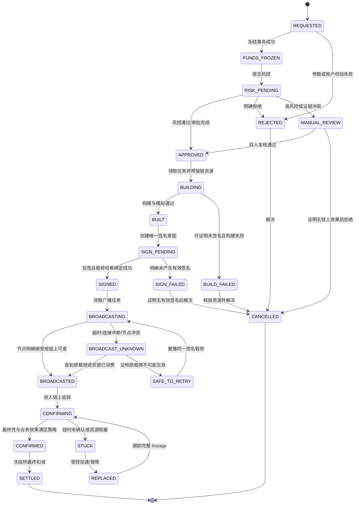
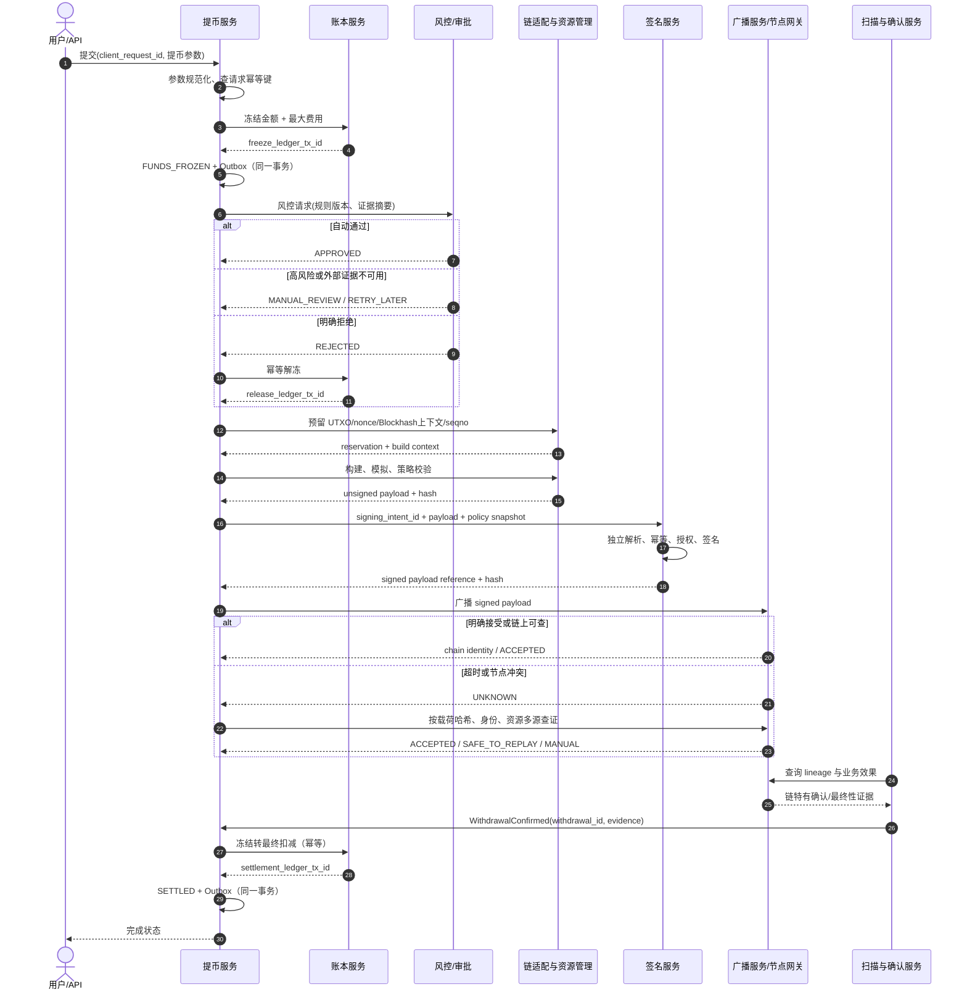
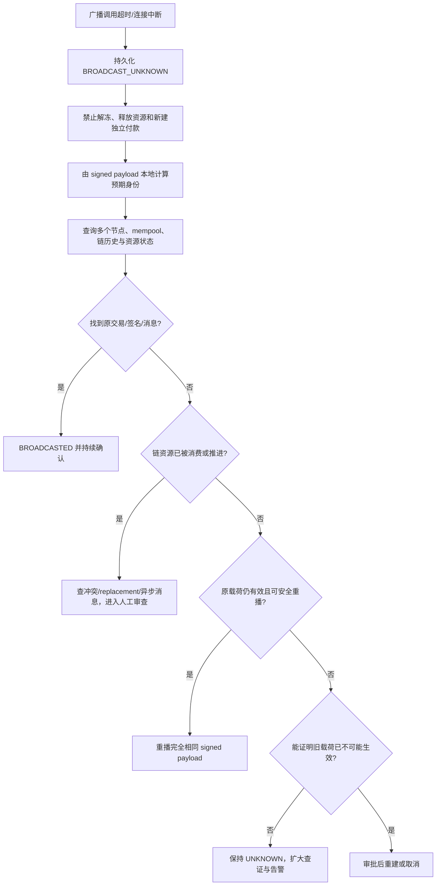

# Day 17：提币状态机、风控与异常恢复

> 学习目标：设计支持 BTC、EVM、Solana、TON 的统一提币状态机；掌握余额冻结、风险审核、交易构建、签名、广播与确认的职责边界；使用数据库事务、唯一约束、链资源预留和不可变账本防止重复付款；能够处理广播未知、交易卡住、替换、过期、链上成功但内部未更新等生产异常。  
> 建议用时：5～6 小时  
> 完成标准：完成统一提币状态机并标注四链差异，画出提币服务、账本、风控、签名和广播服务时序图，制作异常与补偿动作矩阵，并闭卷回答文末恰好 7 道面试题。

## 安全边界与核心结论

- 所有实验只使用 Regtest、Devnet、Testnet、本地沙箱或确定性夹具；不得使用真实私钥、生产地址、API Key 或有价值资产。
- `withdrawal_id` 是一次业务付款意图的根标识。客户端重试、MQ 重投、服务重启和人工操作都不能创建第二次资金效果。
- 用户提交申请后先把 `available` 转为 `frozen`；链上效果最终确认后，再把冻结负债转为最终扣减。只有证明没有链上付款效果时才能解冻。
- 已签名不等于已广播，已广播不等于链上成功，RPC 返回交易标识也不等于目标账户已收到预期资产。
- 广播超时或节点结果冲突必须进入 `BROADCAST_UNKNOWN`。先按已签名载荷哈希、交易身份和链资源查证，不能直接重建、重签或重新付款。
- 同一业务只能绑定一个当前签名意图。加速或替换必须属于同一 `withdrawal_id`，记录前后交易的 lineage，并证明旧交易与新交易不会产生两次业务付款。
- UTXO、nonce、Blockhash/Durable Nonce、`seqno` 的冲突模型不同。统一的是“资源必须持久化预留”，不是统一锁字段或释放规则。
- 风控、签名策略或关键链上证据不可用时默认 Fail Closed：停止自动推进，保留冻结，进入重试或人工审核。
- 账本流水不可删除或覆盖。冻结、最终扣减、解冻和补偿都通过不可变分录表达，并以业务效果唯一键防重。
- Redis 锁、进程内锁、MQ 去重、多节点广播都只是优化；资金正确性的最终防线是 MySQL 事务、唯一约束、条件更新、签名策略和链上对账。

资金不变量：

```text
I1. 同一 user_id + client_request_id 最多创建一个 withdrawal_id。
I2. 同一 withdrawal_id 最多产生一次冻结、一次最终扣减或一次解冻效果。
I3. available + frozen 的变化必须由平衡且不可变的账本分录解释。
I4. 未通过风控、审批和签名策略的业务不得进入可广播状态。
I5. 同一当前签名意图最多产生一个被接受的 signed_payload_hash。
I6. 广播结果未知时，不得释放链资源、解冻余额或创建独立付款意图。
I7. replacement 必须继承原 withdrawal_id、业务收款目标和资源 lineage。
I8. 链上成功必须最终收敛为内部确认和扣减；内部失败不能抹掉链上事实。
I9. 只有能证明所有候选交易均未生效且不可能再生效时，才允许解冻。
I10. 人工操作必须经过授权、双人复核、幂等键和不可变审计。
```

---

## 一、先划清五个职责边界

### 1. 提币业务记录

回答“用户请求什么、平台当前处理到哪里”：

```text
withdrawal_id
user_id / account_id
client_request_id
chain / network / asset_id
normalized_destination / memo_or_tag
amount_atomic / fee_policy
status / status_version
risk_snapshot_id / approval_id
current_signing_intent_id
current_chain_attempt_id
created_at / updated_at
```

它是流程协调根，不是余额，也不应保存可覆盖的“最终余额”。

### 2. 内部账本

回答“平台对用户负债发生了什么变化”：

```text
FREEZE:         available -> withdrawal_frozen
FINAL_DEBIT:    withdrawal_frozen -> platform_settlement
RELEASE:        withdrawal_frozen -> available
FEE_DEBIT:      withdrawal_frozen/available -> fee_revenue_or_expense
CORRECTION:     通过审批后的反向或调整分录表达
```

金额使用链最小单位整数。账本事务必须平衡、不可变、可按 `withdrawal_id` 追溯。

### 3. 风控与审批

回答“这笔请求是否允许继续”：

- 身份、账户状态与二次验证；
- 地址格式、网络、Memo/Tag 和资产匹配；
- 地址白名单及冷静期；
- 单笔、日累计、滚动窗口额度；
- 设备、IP、登录、改密和行为异常；
- 地址风险、制裁名单与资金来源规则；
- 热钱包水位、链健康和系统级暂停开关；
- 自动通过、自动拒绝、人工审核或等待外部证据。

风控结果必须保存规则版本、输入摘要、命中规则、决策和证据引用，不能只保存一个 `passed=true`。

### 4. 签名意图与签名服务

回答“密钥系统被授权签什么”：

```text
signing_intent_id
withdrawal_id
unsigned_payload_hash
canonical business summary
chain resource identity
policy_snapshot_hash
attempt_no
status
signed_payload_hash
signer_key_version
```

签名服务必须独立解析交易并核对链、网络、资产、目标、金额、费用上限、资源和有效期，不能只接收一个不透明哈希就签名。

### 5. 链交易尝试与广播

回答“哪些载荷被发给哪些节点，链上观察到了什么”：

```text
chain_attempt_id
withdrawal_id
attempt_type: ORIGINAL / REPLACEMENT / ACCELERATION
parent_attempt_id
signed_payload_hash
chain_transaction_identity
broadcast_attempt_no / node_id
request_started_at / response_code / response_body_hash
status: READY / BROADCASTING / UNKNOWN / ACCEPTED / CONFIRMED / FAILED / EXPIRED
chain_evidence
```

业务单、签名意图、签名载荷、广播调用和链交易身份必须分开建模。一次业务可以有多个广播调用，也可能有多个 replacement 尝试，但只能有一次业务付款效果。

---

## 二、统一提币状态机

### 1. 主状态图



### 2. 为什么不能只有“成功、失败、取消”

提币包含不可逆外部副作用。`FAILED` 如果不说明失败发生在哪一层，会掩盖危险差异：

- 构建失败：通常未接触密钥，也未产生链上效果，可以安全重建；
- 签名响应丢失：签名可能已产生，不能假设失败；
- 广播超时：节点可能已接收，必须视为未知；
- 链上执行失败：EVM 可能仍消耗 nonce 和 Gas；TON 可能外部消息成功但后续内部消息 Bounce；
- 内部结算失败：链上可能已付款，必须补内部账，不能重付。

因此生产状态要表达“已知事实”和“下一步是否安全”，而不是只表达某个 API 调用的返回值。

### 3. 状态迁移守卫

每次迁移至少检查：

```text
current_status in allowed_from_states
status_version == expected_version
transition_key globally unique
required evidence exists and is valid
operator/service has permission
policy/config version is recorded
chain resource ownership is unchanged
ledger effect is absent or already matches
```

条件更新示例：

```sql
UPDATE withdrawal
SET status = :to_status,
    status_version = status_version + 1,
    updated_at = CURRENT_TIMESTAMP
WHERE withdrawal_id = :withdrawal_id
  AND status = :expected_status
  AND status_version = :expected_version;
```

影响行数为 0 时必须读取现状并判断“幂等成功、迟到事件或真实冲突”，不能无条件覆盖。

### 4. 终态与非终态

| 状态 | 是否业务终态 | 资金语义 | 允许动作 |
|---|---:|---|---|
| `SETTLED` | 是 | 已最终扣减 | 对账、审计；发现错误走独立补偿 |
| `CANCELLED` | 是 | 已安全解冻 | 不得复活原业务；新请求使用新 ID |
| `REJECTED` | 否 | 仍冻结，等待取消事务 | 执行幂等解冻后转 `CANCELLED` |
| `BUILD_FAILED` | 否 | 冻结保留 | 安全重建或取消 |
| `SIGN_FAILED` | 否 | 冻结保留 | 先确认无有效签名，再重试/取消 |
| `BROADCAST_UNKNOWN` | 否 | 冻结和资源均保留 | 查证、重播相同载荷或人工处理 |
| `STUCK` | 否 | 冻结保留 | 加速、替换、等待或人工处理 |
| `MANUAL_REVIEW` | 否 | 冻结保留 | 双人审批，不得直接改终态 |

---

## 三、余额冻结、扣减与解冻

### 1. 推荐账务时机

假设用户可用余额为 10 ETH，申请提币 2 ETH，用户承担费用 0.01 ETH：

```text
申请并通过基础校验时：
available          -2.01 ETH
withdrawal_frozen  +2.01 ETH

链上业务效果最终确认时：
withdrawal_frozen  -2.01 ETH
platform_settlement +2.00 ETH
fee_settlement      +0.01 ETH

明确拒绝/合法取消且证明未付款时：
withdrawal_frozen  -2.01 ETH
available          +2.01 ETH
```

冻结应与创建提币业务在同一本地事务中完成。这样两个并发请求不能都看到同一份可用余额。

### 2. 冻结事务伪代码

```java
@Transactional
Withdrawal requestWithdrawal(Command command) {
    Withdrawal existing = repository.findByUserAndClientRequestId(
        command.userId(), command.clientRequestId());
    if (existing != null) {
        assertSameRequest(existing, command);
        return existing;
    }

    validateAddressNetworkAsset(command);
    Withdrawal withdrawal = Withdrawal.requested(command);
    repository.insert(withdrawal); // unique(user_id, client_request_id)

    ledger.freeze(
        "WITHDRAWAL_FREEZE:" + withdrawal.id(),
        command.accountId(),
        command.amountAtomic() + command.maxFeeAtomic());

    repository.move(withdrawal.id(), REQUESTED, FUNDS_FROZEN);
    outbox.append("WithdrawalFundsFrozen", withdrawal.id());
    return repository.get(withdrawal.id());
}
```

若重复请求的参数摘要不同，必须返回幂等键冲突，不能静默返回旧订单或创建新订单。

### 3. 为什么不等广播或确认才冻结

- 等广播才冻结：审核、构建、签名期间用户仍可消费余额，造成超卖；
- 等确认才冻结：链上已经付款但内部余额可能不足，平台形成直接损失；
- 申请时直接永久扣减：审核拒绝或构建失败时退款语义复杂，且无法区分冻结负债和已完成付款；
- 申请时冻结、确认时转扣减：既阻止重复消费，又能清楚表达处理中负债和合法解冻。

### 4. 费用差异

| 链 | 费用处理重点 |
|---|---|
| BTC | 费用来自输入减输出；批量提币需定义用户费用与实际矿工费分摊 |
| EVM | Gas 由发送地址支付；Token 提币冻结 Token，平台还需独立管理原生币 Gas |
| Solana | Fee payer 可能与资产源账户不同；ATA 创建和优先费需计入策略 |
| TON | 钱包消息费、转发费和 Jetton 附带 TON 不等于用户收到的 Jetton 数量 |

费用估算与最终费用可能不同。应保存最大冻结额、实际费用和差额释放规则，不能用浮点数计算。

---

## 四、请求、审批、签名与广播幂等

### 1. 四层幂等键

| 层次 | 推荐唯一键 | 防止的问题 |
|---|---|---|
| 请求 | `(user_id, client_request_id)` | 用户双击、客户端超时重试 |
| 账本 | `(withdrawal_id, ledger_effect_type)` | 重复冻结、扣减、解冻 |
| 审批 | `(withdrawal_id, approval_stage, policy_version)` | MQ 重投或审批按钮重复点击 |
| 签名 | `(withdrawal_id, signing_generation)`、`signed_payload_hash` | 同一意图重复签名或载荷漂移 |
| 广播 | `(signed_payload_hash, node_id, attempt_no)` | 记录每次 RPC；业务上按 payload 收敛 |
| 结算 | `WITHDRAWAL_SETTLE:<withdrawal_id>` | 重复确认事件导致二次扣减 |

签名接口重试时，若 `unsigned_payload_hash` 相同，应返回已存在签名；若不同，则拒绝并进入安全审查。不能让相同业务 ID 对应两个未解释的收款载荷。

### 2. 防重复签名流程

```text
1. 提币服务创建 signing_intent，绑定 withdrawal_id 和 unsigned_payload_hash。
2. 数据库唯一约束只允许一个 ACTIVE generation。
3. 签名服务读取业务摘要并独立解析原始交易。
4. 签名服务按 request_id + payload_hash 幂等。
5. 返回后本地验签，计算 signed_payload_hash。
6. CAS 将 SIGN_PENDING 更新为 SIGNED，并保存签名证据。
7. 响应丢失时先按 signing_intent_id 查询，不创建新 generation。
8. 只有旧意图被证明作废，且有审批时，才能创建 replacement generation。
```

### 3. 防重复广播不是“不重复调用 RPC”

同一签名载荷向多个节点广播通常不会造成第二次付款，因为链交易身份相同；真正危险的是未知后重新构建并签署不同的有效付款载荷。因此：

- 保存完整或安全引用的 signed payload，先重播同一字节；
- 计算并验证本地预期交易身份，不完全依赖节点响应；
- 每次 RPC 调用单独记录，但业务状态按签名载荷和链上证据收敛；
- replacement 必须经过链特有安全规则和 lineage 约束；
- 不以“某个节点查不到”作为允许新付款的充分条件。

---

## 五、四链资源锁与差异

### 1. 对比总表

| 维度 | BTC | EVM | Solana | TON |
|---|---|---|---|---|
| 冲突资源 | 一组 OutPoint | sender + nonce | Recent Blockhash 有效期；或 Nonce Account；可写账户锁 | Wallet Contract + `seqno` |
| 预留单位 | 每个 UTXO | 单个 nonce | 构建上下文；Durable Nonce 时锁 Nonce Account | 单个 `seqno` |
| 并发特征 | 不相交 UTXO 可并行 | 同 sender nonce 有序，gap 阻塞后续 | 普通 blockhash 不等于顺序号；同可写账户可能竞争 | 同钱包 `seqno` 通常串行推进 |
| 已签名后变化 | 改输入/输出/费率需重签 | 改费率或内容需同 nonce 重签 | Blockhash 过期需新消息并重签 | 有效期/`seqno` 改变需重签 |
| 卡住恢复 | RBF 或 CPFP | 同 nonce 提高费率 replacement | 查原签名；过期后确认未落链再重建 | 查钱包 `seqno` 与消息链，再决定重发/重建 |
| 资源释放证据 | UTXO 未花且所有候选交易不可再生效 | nonce 链状态与所有候选 tx 收敛 | 签名未落链且 blockhash 已安全过期，或 Durable Nonce 状态已核验 | 当前 `seqno`、有效期和消息执行结果已核验 |

### 2. BTC：UTXO 预留

```sql
UPDATE wallet_utxo
SET reservation_status = 'RESERVED',
    reserved_by = :withdrawal_or_batch_id,
    reserved_until = :lease_hint
WHERE outpoint = :outpoint
  AND spend_status = 'UNSPENT'
  AND reservation_status = 'FREE';
```

`reserved_until` 只能用于告警或触发核验，不能到期就盲目释放。已签名或可能广播后，必须查询每个 UTXO 是否被原交易、replacement 或冲突交易消费。

批量提币时一个 BTC 交易可对应多个 `withdrawal_id`。需要单独的 batch、输出映射和费用分摊表；某个业务取消不能在交易已签名后直接删除输出。

### 3. EVM：nonce 分配

发送地址维度持久化：

```text
next_allocatable_nonce
last_confirmed_nonce
highest_observed_pending_nonce
version
recovery_status
```

在数据库事务中锁定 sender 行、分配 nonce、创建 chain attempt，再提交。Redis 锁过期不能导致同 nonce 分给两个独立业务。replacement 使用相同 sender + nonce，目标和金额必须与原业务策略一致；取消交易本质上也是可能成功的链上交易，不是数据库取消。

### 4. Solana：Blockhash 与 Durable Nonce

Recent Blockhash 是交易新鲜度与过期边界，不是 EVM nonce。相同 message + blockhash 的签名可按 signature 查询；Blockhash 过期后重建会得到新签名，因此必须先确认旧签名未落链且已不可能落链。

Durable Nonce 使用链上 Nonce Account，消费后 nonce 前进。它适合较长签名流程，但要求对 Nonce Account 做排他预留并核验 advance 状态。交易还可能因可写账户锁冲突、Compute Budget、ATA 状态变化而失败。

### 5. TON：`seqno` 与异步消息

Wallet Contract 接收 External Message，通过 `seqno` 防重放，再产生 Internal Message。外部消息被钱包接受并不保证目标转账业务完成：

- 钱包交易可能执行成功；
- 内部消息可能继续路由；
- 目标合约可能拒绝或 Bounce；
- Jetton 还需跟踪 Jetton Wallet 消息链和实际余额效果。

因此不能只看 `seqno` 增加就结算用户提币。要同时验证目标消息、资产、金额、Bounce 状态和最终业务效果。

### 6. 统一资源预留接口应保留链特有证据

```java
sealed interface ChainReservation permits UtxoReservation,
    EvmNonceReservation, SolanaLifetimeReservation, TonSeqnoReservation {
    String reservationId();
    String ownerWithdrawalId();
    ReservationStatus status();
}
```

不要把四条链压成 `long nonce`。统一生命周期可以是 `FREE -> RESERVED -> SIGNED -> CONSUMED/RELEASED`，但资源身份、冲突检查和释放证明必须由链适配器实现。

---

## 六、端到端服务时序图



关键事务边界：

1. 创建业务 + 冻结账本 + Outbox 尽量在同一本地事务；
2. 风控、签名和广播都是跨服务步骤，靠状态机、幂等和可查询协议恢复；
3. 链上确认 + 最终账本扣减 + `SETTLED` + Outbox 在同一本地事务；
4. 每个服务都必须支持按稳定 ID 查询上一次结果，不能只支持命令式重试。

---

## 七、广播未知结果的判定流程



### 1. 查证维度

- **数据库**：签名意图、payload hash、广播调用、节点响应、replacement lineage；
- **链上身份**：BTC txid/wtxid、EVM tx hash、Solana signature、TON external/internal message identity；
- **资源状态**：OutPoint、sender nonce、Blockhash/Nonce Account、wallet `seqno`；
- **业务效果**：目标、资产、原子金额、Token/Instruction/Message 执行结果；
- **有效性边界**：交易是否仍可能被接受，旧载荷是否已过期或被链状态排除；
- **多源一致性**：读节点、广播节点、归档/索引节点的高度与结果是否可比。

### 2. “查不到”不是“没广播”

节点可能不同步、mempool 不共享、索引延迟、交易被暂时驱逐，或者 TON 内部消息仍在传播。只有满足链特有安全证明，才能转为 `SAFE_TO_RETRY`。在证明完成前保持冻结与资源占用。

---

## 八、交易卡住、替换、加速与过期

### 1. 统一 lineage

```text
withdrawal_id W1
  chain_attempt A1 ORIGINAL
    signed_payload_hash H1
  chain_attempt A2 REPLACEMENT parent=A1
    signed_payload_hash H2
  chain_attempt A3 REPLACEMENT parent=A2
    signed_payload_hash H3
```

确认服务不能只查 `current_tx_hash`。它必须跟踪整个 lineage；任何候选交易生效，都要把同一业务收敛为一次结算并停止不兼容操作。

### 2. 各链恢复策略

| 场景 | 可用动作 | 关键限制 |
|---|---|---|
| BTC 费率过低 | opt-in RBF 替换；或由可控输出 CPFP | 所有用户输出语义不变；检查旧/新 tx 任一确认 |
| EVM pending | 同 sender + nonce 提高 EIP-1559 费用 | 不创建新 nonce 重付；跟踪所有同 nonce hash |
| Solana blockhash 将过期 | 优先重播同签名；过期后核验旧签名未落链再重建 | 新 blockhash 会产生新签名；严防双付 |
| Solana Durable Nonce | 核验 Nonce Account 是否 advance | Nonce 已消费时不能按旧状态重建 |
| TON 消息未完成 | 查 wallet `seqno`、外部消息、内部消息和 Bounce | `seqno` 前进不等于收款成功 |

### 3. 已广播取消的真实含义

- 数据库把状态改为 `CANCELLED` 不会撤回链上交易；
- BTC/EVM 的替换取消本身也是链上竞争交易，原交易仍可能先确认；
- Solana 过期前不能保证原交易不会落链；
- TON 需要按钱包合约能力和消息状态判断，不能通用撤销。

所以“用户取消”只应在签名前或证明无链上效果后自动完成；之后最多是发起受控替换、暂停后续或人工处置。

---

## 九、风控、白名单、额度与速度限制

### 1. 分层决策

| 层次 | 示例 | 典型结果 |
|---|---|---|
| 静态校验 | 链、网络、地址、Memo、资产状态 | 拒绝或继续 |
| 账户安全 | 改密、换设备、2FA、登录异常 | 冷静期或人工审核 |
| 地址策略 | 白名单、加入时间、地址风险标签 | 放行、延迟、拒绝 |
| 金额策略 | 单笔、日累计、滚动 24h、资产等值 | 自动通过或升级审批 |
| 速度策略 | 分钟/小时频次、失败密度、关联账户 | 限速或暂停 |
| 链上合规 | 制裁、混币、盗币、风险评分 | 人工审核、拒绝、报告 |
| 运营策略 | 热钱包水位、链拥堵、节点分叉 | 排队、降低额度、暂停 |

### 2. 白名单不是一个布尔值

应记录：

```text
user_id
chain / network
normalized_address / memo_or_tag
label
verification_method
created_at
activation_at
status
version
approved_by
risk_evidence_ref
```

新增或修改白名单后设置冷静期；提现时保存命中的白名单版本。地址规范化必须由链适配器完成，不能随意转小写 BTC、Solana 或 TON 地址。

### 3. 限额与速度限制

- 数据库保存资金级累计事实，Redis 可做低延迟预筛和热点限流；
- 规则应覆盖单笔、自然日、滚动窗口、币种等值和全账户聚合；
- Redis 丢失或锁过期不能绕过数据库额度；
- 并发请求要在冻结事务内检查并占用额度，避免先查后写竞态；
- 风控规则升级应保存版本，旧业务不得被无审计地重新解释。

### 4. 风控不可用时的降级

默认暂停自动提币，保持资金冻结，并将请求置于 `RISK_PENDING` 或 `MANUAL_REVIEW`。可以允许：

- 查询既有状态；
- 处理已确认交易的内部结算；
- 重播完全相同且已批准的签名载荷（需既定策略允许）；
- 经独立权限和双人复核的极少量应急操作。

不能因为可用性目标而绕过 AML、额度或签名策略。应告警积压、展示可解释状态，并在恢复后按原规则版本重放。

---

## 十、核心数据表与唯一约束

### 1. 提币主表

```sql
CREATE TABLE withdrawal (
    id BIGINT PRIMARY KEY,
    withdrawal_no VARCHAR(64) NOT NULL,
    user_id BIGINT NOT NULL,
    account_id BIGINT NOT NULL,
    client_request_id VARCHAR(128) NOT NULL,
    request_hash CHAR(64) NOT NULL,
    chain_code VARCHAR(32) NOT NULL,
    network_code VARCHAR(32) NOT NULL,
    asset_id BIGINT NOT NULL,
    destination VARCHAR(256) NOT NULL,
    memo_tag VARCHAR(256) NULL,
    amount_atomic DECIMAL(65, 0) NOT NULL,
    max_fee_atomic DECIMAL(65, 0) NOT NULL,
    status VARCHAR(32) NOT NULL,
    status_version BIGINT NOT NULL DEFAULT 0,
    risk_snapshot_id BIGINT NULL,
    current_signing_intent_id BIGINT NULL,
    current_chain_attempt_id BIGINT NULL,
    created_at TIMESTAMP NOT NULL,
    updated_at TIMESTAMP NOT NULL,
    UNIQUE KEY uk_withdrawal_no (withdrawal_no),
    UNIQUE KEY uk_user_client_request (user_id, client_request_id)
);
```

`request_hash` 用于发现调用方复用幂等键却改变金额、地址或网络。

### 2. 状态历史与迁移幂等

```sql
CREATE TABLE withdrawal_state_history (
    id BIGINT PRIMARY KEY,
    withdrawal_id BIGINT NOT NULL,
    transition_key VARCHAR(128) NOT NULL,
    from_status VARCHAR(32) NOT NULL,
    to_status VARCHAR(32) NOT NULL,
    evidence_type VARCHAR(64) NOT NULL,
    evidence_ref VARCHAR(256) NOT NULL,
    operator_type VARCHAR(32) NOT NULL,
    operator_id VARCHAR(128) NOT NULL,
    created_at TIMESTAMP NOT NULL,
    UNIQUE KEY uk_transition_key (transition_key),
    KEY idx_withdrawal_history (withdrawal_id, id)
);
```

### 3. 链资源预留

```sql
CREATE TABLE chain_resource_reservation (
    id BIGINT PRIMARY KEY,
    chain_code VARCHAR(32) NOT NULL,
    network_code VARCHAR(32) NOT NULL,
    resource_type VARCHAR(32) NOT NULL,
    resource_identity VARCHAR(512) NOT NULL,
    owner_type VARCHAR(32) NOT NULL,
    owner_id VARCHAR(64) NOT NULL,
    status VARCHAR(32) NOT NULL,
    version BIGINT NOT NULL DEFAULT 0,
    reserved_at TIMESTAMP NOT NULL,
    consumed_at TIMESTAMP NULL,
    released_at TIMESTAMP NULL,
    evidence_ref VARCHAR(256) NULL,
    UNIQUE KEY uk_chain_resource
      (chain_code, network_code, resource_type, resource_identity)
);
```

BTC 一笔交易会预留多个 OutPoint，应每个 OutPoint 一行；EVM/TON 的身份需包含发送钱包；Solana Durable Nonce 应包含 Nonce Account 和其当时值。

### 4. 签名意图

```sql
CREATE TABLE signing_intent (
    id BIGINT PRIMARY KEY,
    withdrawal_id BIGINT NOT NULL,
    generation INT NOT NULL,
    unsigned_payload_hash CHAR(64) NOT NULL,
    policy_snapshot_hash CHAR(64) NOT NULL,
    resource_snapshot_hash CHAR(64) NOT NULL,
    status VARCHAR(32) NOT NULL,
    signed_payload_hash CHAR(64) NULL,
    signer_key_version VARCHAR(64) NULL,
    created_at TIMESTAMP NOT NULL,
    signed_at TIMESTAMP NULL,
    UNIQUE KEY uk_withdrawal_generation (withdrawal_id, generation),
    UNIQUE KEY uk_signed_payload_hash (signed_payload_hash)
);
```

### 5. 链尝试和广播调用

```sql
CREATE TABLE chain_attempt (
    id BIGINT PRIMARY KEY,
    withdrawal_id BIGINT NOT NULL,
    signing_intent_id BIGINT NOT NULL,
    attempt_type VARCHAR(32) NOT NULL,
    parent_attempt_id BIGINT NULL,
    signed_payload_hash CHAR(64) NOT NULL,
    chain_tx_identity VARCHAR(256) NULL,
    status VARCHAR(32) NOT NULL,
    created_at TIMESTAMP NOT NULL,
    UNIQUE KEY uk_attempt_payload (signed_payload_hash),
    KEY idx_withdrawal_lineage (withdrawal_id, id)
);

CREATE TABLE broadcast_call (
    id BIGINT PRIMARY KEY,
    chain_attempt_id BIGINT NOT NULL,
    node_id VARCHAR(64) NOT NULL,
    call_no INT NOT NULL,
    result VARCHAR(32) NOT NULL,
    response_hash CHAR(64) NULL,
    started_at TIMESTAMP NOT NULL,
    finished_at TIMESTAMP NULL,
    UNIQUE KEY uk_attempt_node_call (chain_attempt_id, node_id, call_no)
);
```

### 6. 账本效果唯一性

```text
UNIQUE(reference_type, reference_id, effect_type)

WITHDRAWAL + withdrawal_id + FREEZE
WITHDRAWAL + withdrawal_id + FINAL_DEBIT
WITHDRAWAL + withdrawal_id + RELEASE
WITHDRAWAL + withdrawal_id + FEE_ADJUSTMENT:<version>
```

数据库约束应与账本服务接口共同保证幂等。不能依赖先 `SELECT` 再 `INSERT` 而没有唯一索引。

---

## 十一、确认与内部结算

### 1. 四链成功证据

| 链 | 不充分证据 | 结算前至少验证 |
|---|---|---|
| BTC | 节点返回 txid、进入 mempool | 规范链确认深度、目标输出、金额、完整 replacement lineage |
| EVM | tx hash 存在 | Receipt success、链身份、目标/调用效果、Token Log/余额效果、最终性策略 |
| Solana | RPC 返回 signature | 指定 Commitment、交易无执行错误、Instruction 与 Token Balance 效果 |
| TON | wallet `seqno` 增加 | 钱包交易、目标 Internal Message、资产金额、Bounce/后续消息效果 |

### 2. 结算事务

```java
@Transactional
void settle(ConfirmationEvidence evidence) {
    Withdrawal withdrawal = repository.lock(evidence.withdrawalId());
    if (withdrawal.status() == SETTLED) {
        return;
    }
    assertStatusIn(withdrawal, BROADCASTED, CONFIRMING, STUCK, REPLACED);
    chainPolicy.verifyBusinessEffect(withdrawal, evidence);

    ledger.finalDebit(
        "WITHDRAWAL_SETTLE:" + withdrawal.id(),
        withdrawal.accountId(),
        withdrawal.amountAtomic(),
        evidence.actualFeeAtomic());

    repository.markSettled(withdrawal.id(), evidence.hash());
    outbox.append("WithdrawalSettled", withdrawal.id());
}
```

如果链上成功但该事务失败，确认事件可重复投递。唯一结算键确保只执行一次；对账任务也能发现 `chain success + status not settled` 并重放同一事务。

### 3. 失败后的解冻守卫

```text
canRelease =
  no valid signed payload exists
  OR (
    every signed candidate is identified
    AND every candidate is proven invalid/expired/non-effective
    AND reserved chain resources cannot later authorize the payment
  )
```

任何一个条件无法证明，就保持冻结并进入人工审核。资金安全优先于立即恢复可用余额。

---

## 十二、提币异常与补偿动作矩阵

| 异常 | 可能已付款 | 自动动作 | 禁止动作 | 恢复与证据 |
|---|---:|---|---|---|
| 客户端重复提交 | 否 | 返回相同 `withdrawal_id` | 创建新业务 | 比对 request hash 与唯一键 |
| 冻结事务响应丢失 | 否 | 按幂等键查询冻结结果 | 再扣一次余额 | 主表、账本效果、事务记录一致 |
| 风控超时/不可用 | 否 | 保持冻结，停在 `RISK_PENDING` | 默认放行 | 恢复后按原规则版本重试或人工审查 |
| 审批重复点击 | 否 | 审批唯一键返回原结果 | 重复推进构建 | 审批记录、状态版本和操作者审计 |
| 构建失败 | 否 | 释放未签名资源或受控重建 | 伪造广播失败 | 无签名意图/有效载荷证据 |
| 交易模拟失败 | 否 | 保持冻结，修复参数后重新审批/构建 | 绕过模拟直接签名 | 模拟上下文、链状态和策略版本 |
| 签名服务超时 | 不确定 | 查询 signing intent 和 payload hash | 直接创建第二签名意图 | 签名服务幂等记录、验签和审计 |
| 签名完成后服务崩溃 | 可能 | 恢复已签载荷，CAS 到 `SIGNED` | 重建另一笔付款 | `signed_payload_hash`、签名服务查询结果 |
| 广播前服务崩溃 | 否或未知 | 查 broadcast call 后广播原载荷 | 改内容重签 | Outbox/任务租约、payload hash |
| 广播超时 | 是 | `BROADCAST_UNKNOWN`，多源查证 | 解冻、释放资源、新建付款 | 链身份、资源状态、多个节点、有效期 |
| 某节点返回拒绝 | 可能 | 分类永久/临时/已知交易并交叉查询 | 把单节点错误当全网结论 | 错误码、节点高度、其他节点结果 |
| BTC 交易卡住 | 是 | 追踪原 tx；受控 RBF/CPFP | 新选 UTXO 独立付款 | 输入消费、mempool、replacement lineage |
| EVM 交易卡住 | 是 | 同 nonce 提费 replacement | 新 nonce 重付 | confirmed/pending nonce、同 nonce hashes |
| Solana Blockhash 过期 | 不确定 | 查原 signature；确认不可能落链后重建 | 仅因单节点查不到就重签 | lastValidBlockHeight、签名状态、多节点 |
| TON `seqno` 已推进 | 是或部分 | 跟踪外部与内部消息链 | 仅按 `seqno` 认定收款成功 | 目标消息、Bounce、资产余额效果 |
| 链上执行明确失败 | 通常业务未付款 | 按链资源语义恢复/重建 | 直接假设所有费用也未发生 | Receipt/Instruction/Message 失败证据 |
| replacement 与原交易竞争 | 是 | 同时追踪全部候选，首个业务效果收敛 | 只覆盖 `current_tx_hash` | lineage、资源冲突和最终规范链 |
| 链上成功但内部未更新 | 是 | 对账发现并重放幂等结算事务 | 再广播或手改余额 | 链证据、冻结分录、结算唯一键 |
| 内部已结算但链证据被重组 | 不确定 | 暂停、重新确认、独立补偿审批 | 删除账本流水 | 规范链、lineage、反向/调整分录 |
| 用户请求取消但已签名 | 可能 | 按链查证，保持冻结 | 直接改 `CANCELLED` | 所有载荷已失效且资源安全的证明 |
| 热钱包余额不足 | 否 | 排队、调度补充、重新估费 | 改用未审批钱包签名 | 水位、调度审批和新资源上下文 |
| 数据库与节点身份不一致 | 是 | 暂停该钱包，进入人工审查 | 自动选一个结果覆盖 | 原始载荷、本地计算身份、节点交叉验证 |

补偿不是“把状态改回来”，而是新增可审计动作。任何涉及链上效果的不确定性都不能用数据库回滚消除。

---

## 十三、关键故障演练

### 演练 A：签名完成后服务崩溃

注入点：签名服务持久化签名并返回前，让调用连接断开。

预期步骤：

1. 提币停留在 `SIGN_PENDING`，余额和链资源保持占用；
2. 重试按相同 `signing_intent_id` 查询；
3. 签名服务返回已有 `signed_payload_hash`；
4. 提币服务本地验签并以 CAS 更新到 `SIGNED`；
5. 全程只有一个 ACTIVE generation 和一个接受的签名载荷；
6. 后续广播原始字节，不重新构建。

验收 SQL 思路：

```sql
SELECT withdrawal_id, generation, status, unsigned_payload_hash,
       signed_payload_hash, COUNT(*)
FROM signing_intent
WHERE withdrawal_id = :withdrawal_id
GROUP BY withdrawal_id, generation, status,
         unsigned_payload_hash, signed_payload_hash;
```

### 演练 B：广播超时且节点返回不一致

1. 节点 A 接收载荷但响应连接中断；
2. 节点 B 暂时查不到，节点 C 返回已知交易；
3. 服务进入 `BROADCAST_UNKNOWN`，不解冻、不释放资源；
4. 本地计算链交易身份并交叉查询；
5. 重播完全相同载荷到健康节点；
6. 扫描服务发现交易后转 `BROADCASTED/CONFIRMING`；
7. 确认后仅执行一次最终扣减。

必须验证“节点 B 查不到”没有触发新载荷或新业务付款。

### 演练 C：链上成功但结算事务失败

1. 确认服务取得充分链上成功证据；
2. 在最终账本事务提交前注入数据库错误；
3. 提币仍保持冻结，状态未变成 `SETTLED`；
4. MQ 重投或对账任务再次调用相同 settlement key；
5. 事务成功后生成一次最终扣减和 Outbox；
6. 再重复事件时幂等返回，不重复扣减。

### 演练 D：用户在签名后要求取消

1. 拒绝直接取消；
2. 列出全部签名载荷和 chain attempt；
3. 查证是否广播、是否仍有效、资源是否消费；
4. 若任一候选可能生效，保持冻结并继续跟踪；
5. 只有所有候选都被证明不可能生效，才审批解冻；
6. 保存取消证据和操作者审计。

---

## 十四、监控、告警与 SLO

### 1. 流程指标

```text
withdrawal_requests_total{chain,asset,result}
withdrawal_state_count{chain,status}
withdrawal_state_age_seconds{chain,status}
withdrawal_freeze_latency_seconds
withdrawal_risk_latency_seconds
withdrawal_sign_latency_seconds
withdrawal_broadcast_latency_seconds
withdrawal_confirmation_latency_seconds
withdrawal_settlement_latency_seconds
```

### 2. 安全与幂等指标

```text
withdrawal_idempotency_conflict_total
ledger_effect_conflict_total{effect_type}
signing_payload_mismatch_total
multiple_active_signing_intent_total
broadcast_unknown_total{chain,node}
chain_resource_conflict_total{chain,resource_type}
replacement_lineage_depth{chain}
manual_override_total{action,operator_role}
```

### 3. 对账指标

```text
chain_success_internal_unsettled_count
internal_settled_chain_unconfirmed_count
frozen_without_active_workflow_count
active_workflow_without_frozen_funds_count
reserved_resource_without_active_attempt_count
withdrawal_amount_mismatch_count
hot_wallet_available_atomic{chain,asset,wallet}
```

### 4. 告警建议

| 告警 | 示例触发条件 | 首要动作 |
|---|---|---|
| 广播未知激增 | 5 分钟超过基线且多节点出现 | 暂停新广播，检查节点网关与网络 |
| 多签名意图 | 任一业务存在多个 ACTIVE generation | 立即暂停相关钱包签名 |
| 链成功未结算 | 超过内部结算 SLO | 重放幂等结算并检查数据库/Outbox |
| 长时间冻结 | 超过状态对应 SLO | 按阶段定位，禁止直接批量解冻 |
| 资源冲突 | UTXO/nonce/seqno 唯一冲突 | 暂停该发送钱包并恢复资源管理器 |
| 风控不可用 | 连续超时或错误率越阈 | 暂停自动提币，保留查询与结算 |
| 热钱包低水位 | 低于安全阈值 | 停止新构建或限额，启动资金调度 |
| 账链差异 | 任意不可解释差异 | 暂停相关链/资产，启动对账 Runbook |

---

## 十五、Runbook：一笔提币卡住如何排查

### 1. 先止损

- 根据影响范围暂停用户、资产、发送钱包、链或全局自动提币；
- 保持现有冻结和资源预留；
- 禁止人工重复签名、重复付款和直接改终态；
- 固化时间线、配置版本、节点响应和审计证据。

### 2. 沿阶段定位

```text
请求幂等
  -> 冻结账本
  -> 风控/审批
  -> 链资源预留
  -> 构建/模拟
  -> 签名意图
  -> 签名载荷
  -> 广播调用
  -> 链上确认与业务效果
  -> 最终账本结算
  -> Outbox/通知
```

### 3. 最小查询清单

- 提币主表状态、版本、当前 intent 和 attempt；
- 冻结、最终扣减、解冻分录是否互斥且平衡；
- 风控规则版本、命中证据和审批链；
- 所有签名 generation、payload hash 和密钥版本；
- 所有广播节点调用及原始响应摘要；
- 完整 replacement lineage；
- 链资源当前状态；
- 多节点链上证据、节点高度和网络身份；
- 确认事件、结算事务和 Outbox 状态。

### 4. 恢复前证明

恢复自动提币前至少确认：

- 业务、账本、签名、广播和链上身份能双向追溯；
- 没有一个业务绑定未解释的多个付款载荷；
- 所有未知广播已收敛或被隔离；
- UTXO/nonce/Nonce Account/`seqno` 本地状态与链一致；
- 链成功未结算和内部结算无链证据的差异为零或有审批解释；
- 暂停期间积压将按限速、原规则版本和原幂等键恢复。

---

## 十六、架构取舍与常见错误

### 1. 为什么不使用全局分布式事务

链、HSM、RPC 节点和外部风控无法参与数据库两阶段提交。正确方向是：

- 本地强事务保护业务与账本；
- 状态机记录跨服务事实；
- 每个外部步骤可查询、可幂等；
- Outbox 保证事件最终发送；
- 对账发现未收敛差异；
- 补偿动作遵守链上不可逆性。

### 2. 常见错误清单

| 错误 | 风险 | 正确做法 |
|---|---|---|
| 只用 Redis 锁防重复提币 | 过期、主从切换后双执行 | 数据库唯一键、账本幂等、状态 CAS |
| 广播超时立即新建交易 | 双付 | 保存载荷并进入 UNKNOWN 查证 |
| 签名服务只签哈希 | 无法验证收款语义 | 独立解析和策略校验 |
| `current_tx_hash` 覆盖旧哈希 | 丢失 replacement 证据 | 保存完整 lineage |
| 用户取消就解冻 | 已签/已广播交易仍可能生效 | 链特有无效果证明后解冻 |
| EVM 失败就释放 nonce | nonce 已消费或 pending 冲突 | 按链上 nonce 和候选交易恢复 |
| Solana 查不到就重签 | 旧签名可能仍落链 | 等安全过期并多源核验 |
| TON `seqno` 增加即成功 | 内部消息可能 Bounce | 跟踪目标消息和业务效果 |
| 手工改余额修复差异 | 无审计且可能二次修复 | 审批后的不可变调整分录 |
| 风控故障默认放行 | 绕过安全和合规边界 | Fail Closed，暂停自动提币 |

---

## 十七、实践设计模板

### 1. 状态迁移表模板

| From | To | 触发者 | 前置条件 | 幂等键 | 外部证据 | 失败状态 | 补偿 |
|---|---|---|---|---|---|---|---|
| `REQUESTED` | `FUNDS_FROZEN` | 提币服务 | 参数有效、余额充足 | freeze key | 无 | 保持/拒绝 | 无 |
| `RISK_PENDING` | `APPROVED` | 风控/审批 | 规则完成 | approval key | risk snapshot | 人工审核 | 保持冻结 |
| `SIGN_PENDING` | `SIGNED` | 签名回调/恢复器 | payload 完全匹配 | intent id | 签名与验签 | 签名未知 | 查询签名服务 |
| `BROADCASTING` | `BROADCASTED` | 广播/扫描 | 找到原载荷 | payload hash | chain identity | `UNKNOWN` | 查证/重播 |
| `CONFIRMING` | `SETTLED` | 确认服务 | 最终性与业务效果 | settle key | chain evidence | 保持确认中 | 重放结算 |

练习时补全每个状态，不要只写 Happy Path。

### 2. 四链资源恢复模板

```text
Chain / Network:
Wallet identity:
Resource type and identity:
Owning withdrawal/batch:
Unsigned payload hash:
Signed payload hash:
All chain attempts:
Current chain observation:
Can old payload still become effective:
Release/rebuild decision:
Required approvals:
Evidence references:
```

### 3. 故障演练记录模板

```text
演练编号：
测试网络/本地夹具：
withdrawal_id：
故障注入点：
预期不变量：
状态时间线：
账本证据：
签名证据：
广播证据：
链资源证据：
链上业务效果：
告警是否触发：
自动恢复耗时：
人工动作：
最终对账差异：
发现的问题与改进：
```

---

## 十八、口头面试题参考答案

> 本节严格包含计划中的 7 道题。先闭卷口述，再按“结论 → 原理 → 生产实现 → 异常与风险 → 监控和恢复”补全。

### 1. 如何防止用户重复提币？

**参考回答：**

以 `withdrawal_id` 作为业务根，入口使用 `(user_id, client_request_id)` 唯一约束，并保存请求摘要，重复键参数一致时返回原业务，不一致时拒绝。创建业务、冻结账本和 Outbox 在同一本地事务；冻结、最终扣减、解冻分别使用唯一账本效果键，状态迁移使用 CAS 和唯一 transition key。

跨服务还要对审批、签名和广播分别幂等。一个业务只能有一个 ACTIVE 签名 generation；响应丢失先查询原 intent。广播保存 signed payload hash，未知时重播相同字节而不是新建付款。replacement 继承同一业务并记录 lineage。最终用链、业务、账本对账发现未收敛差异，Redis 和 MQ 去重不能替代数据库与签名策略。

### 2. 余额应在申请、广播还是确认时扣减？为什么？

**参考回答：**

推荐申请受理时把可用余额转为提币冻结，链上业务效果达到确认策略后再把冻结转为最终扣减；明确拒绝或取消且证明没有链上效果后才解冻。申请时冻结可防止审核和签名期间余额被再次消费，确认时结算则能区分处理中负债与已完成付款。

等广播或确认才冻结会超卖；申请时直接永久扣减又会把拒绝、构建失败与已付款混在一起。冻结、扣减、解冻必须是不可变平衡分录，并各有唯一幂等键。广播未知、交易卡住或已签名待查证时保持冻结，不能为了用户体验提前释放。

### 3. 广播超时后如何判断能否重试？

**参考回答：**

先进入 `BROADCAST_UNKNOWN`，保存并校验 signed payload，禁止解冻、释放资源或创建新付款。由载荷本地计算预期交易身份，查询多个同步节点、mempool/链历史、完整 replacement lineage 和链资源状态，同时核对目标、资产与金额业务效果。

找到原交易就继续确认；原载荷仍有效且重播不会改变身份时，可以重播完全相同字节。只有证明旧载荷不可能再生效，才能审批后重建：BTC 看 UTXO 与候选交易，EVM 看 sender nonce，Solana 看签名与 Blockhash/Nonce Account，TON 看 `seqno` 和消息链。单个节点“查不到”不是安全重试依据。

### 4. 如何避免同一业务单被签名两次？

**参考回答：**

为每个 `withdrawal_id` 创建带 generation 的 signing intent，唯一约束只允许一个 ACTIVE generation，并绑定 unsigned payload hash、业务摘要、链资源和策略快照。签名服务按 intent ID + payload hash 幂等，独立解析目标、资产、金额、费用和有效期；相同请求返回已有签名，不同 payload 直接拒绝。

提币服务收到结果后本地验签并保存唯一 signed payload hash。超时先查询签名服务，不能新建 intent。确需 replacement 时，必须先使旧 intent 进入可审计状态、经过审批并创建新的 generation，同时保存 parent lineage。监控一个业务的多 ACTIVE intent、payload 漂移和异常签名次数。

### 5. UTXO、nonce、Blockhash 和 `seqno` 的并发控制有何差异？

**参考回答：**

BTC 锁的是离散 OutPoint，不相交 UTXO 可并行；签名或广播后释放必须确认所有候选交易都不会消费它。EVM 锁的是发送地址下的 nonce，nonce 有顺序，gap 会阻塞后续，同 nonce replacement 是加速而不是第二业务。

Solana Recent Blockhash 是有效期和防重放上下文，不是顺序号；同一签名可重播，过期重建会生成新签名，需先证明旧签名不能落链。Durable Nonce 则要排他锁链上 Nonce Account，还要考虑可写账户竞争。TON 的 wallet `seqno` 防止外部消息重放，通常同钱包串行，但 `seqno` 前进只说明钱包接受消息，不代表后续内部转账成功。统一预留生命周期可以复用，资源身份和释放证明不能强行统一。

### 6. 链上成功但内部状态未更新怎么办？

**参考回答：**

绝不能再次广播，也不能手工直接改余额。确认扫描和独立对账应按所有 chain attempt lineage 找到链上业务效果，关联 `withdrawal_id`，生成可重复投递的确认事件。最终扣减、提币 `SETTLED` 状态和 Outbox 在同一本地事务中，以 `WITHDRAWAL_SETTLE:<id>` 唯一键保证重放只结算一次。

若关联缺失或金额、目标不一致，先暂停相关钱包并进入人工审核，保留原始链证据、签名载荷和广播记录。修复映射后仍通过正式结算接口处理。监控 chain-success/internal-unsettled 的数量和年龄，并在恢复后做链、业务、账本三方对账。

### 7. 风控系统不可用时应放行还是暂停提币？

**参考回答：**

默认 Fail Closed，暂停自动提币并保持余额冻结，因为提币是不可逆外部付款，放行可能绕过账户安全、额度、制裁名单或地址风险规则。请求停在 `RISK_PENDING` 或 `MANUAL_REVIEW`，对用户展示处理中状态，并告警风控错误率和队列积压。

可以继续状态查询、已确认交易的内部结算，以及策略预先允许的相同载荷恢复，但不能绕过新请求审核。极端业务连续性场景只能走独立权限、双人复核、严格小额和完整审计的应急通道。风控恢复后按原规则版本和原幂等键限速重放，避免规则漂移和洪峰。

---

## 十九、当天任务

### 任务 1：统一状态机（60 分钟）

- [ ] 不看资料画出从 `REQUESTED` 到 `SETTLED` 的主路径。
- [ ] 加入 `MANUAL_REVIEW`、`BROADCAST_UNKNOWN`、`STUCK` 和 `REPLACED`。
- [ ] 为每条迁移写前置状态、证据、transition key 和补偿动作。
- [ ] 明确哪些状态允许解冻，哪些状态必须保留冻结。

### 任务 2：账本与幂等（45～60 分钟）

- [ ] 写出冻结、最终扣减、解冻和费用差额的分录。
- [ ] 设计请求、账本、审批、签名、广播和结算唯一键。
- [ ] 推演冻结事务提交后响应丢失。
- [ ] 验证同一客户端请求并发 5 次只产生一次冻结。

### 任务 3：四链资源锁（60 分钟）

- [ ] 为 BTC 推演两个任务争用同一 UTXO。
- [ ] 为 EVM 推演同 sender 的 10 个并发 nonce 分配。
- [ ] 为 Solana 推演签名后 Blockhash 过期。
- [ ] 为 TON 推演两个任务争用同一 `seqno` 且内部消息 Bounce。

### 任务 4：签名与广播恢复（60 分钟）

- [ ] 在签名完成、响应返回前注入崩溃。
- [ ] 验证恢复时查询原 signing intent，不创建第二 intent。
- [ ] 在广播已被节点接收、响应返回前注入超时。
- [ ] 验证只重播相同载荷，不创建独立付款。

### 任务 5：异常矩阵与 Runbook（45 分钟）

- [ ] 为矩阵中每种异常补充本地实现的指标和负责人。
- [ ] 选择 BTC/EVM/Solana/TON 各一个卡住场景执行桌面演练。
- [ ] 写出暂停范围、查证步骤、恢复条件和复盘证据。
- [ ] 验证所有人工动作都有审批与审计。

### 任务 6：链上成功但内部失败（45 分钟）

- [ ] 在结算事务提交前注入故障。
- [ ] 用确认事件重投恢复。
- [ ] 用独立对账任务再次发现并幂等收敛。
- [ ] 验证最终扣减和 Outbox 各只有一次。

### 任务 7：口述（30～45 分钟）

- [ ] 不看资料回答本节恰好 7 道题并录音。
- [ ] 每题覆盖结论、原理、实现、异常、监控与恢复。
- [ ] 用 10 分钟白板讲清广播未知和四链资源锁。
- [ ] 将薄弱点写入 `progress.md`。

---

## 二十、闭卷验收

- [ ] 能区分提币业务、账本、风控、签名、广播和链上事实。
- [ ] 能画出包含冻结、审核、构建、签名、广播、确认和结算的状态机。
- [ ] 能解释 `BROADCAST_UNKNOWN` 为什么不是失败终态。
- [ ] 能说明已广播后为何不能直接取消和解冻。
- [ ] 能写出冻结、最终扣减和解冻的不可变分录。
- [ ] 能用唯一约束和事务防止重复冻结与重复结算。
- [ ] 能处理客户端复用幂等键但改变请求参数。
- [ ] 能设计审批记录和规则版本审计。
- [ ] 能说明签名服务为何必须解析交易内容。
- [ ] 能证明同一业务不会产生两个未解释的签名意图。
- [ ] 能区分业务 ID、签名载荷、广播调用和链交易身份。
- [ ] 能保存并查询完整 replacement lineage。
- [ ] 能说明多节点广播为何不等于多次付款。
- [ ] 能按链判断何时可以重播相同载荷。
- [ ] 能比较 UTXO、nonce、Blockhash/Durable Nonce 和 `seqno`。
- [ ] 能解释每条链的资源释放安全证据。
- [ ] 能设计 BTC RBF/CPFP 和 EVM 同 nonce replacement。
- [ ] 能处理 Solana Blockhash 过期后的重复支付风险。
- [ ] 能跟踪 TON 外部消息、内部消息和 Bounce。
- [ ] 能设计地址白名单冷静期与版本审计。
- [ ] 能设计单笔、累计和速度限制，并说明 Redis 边界。
- [ ] 能解释风控不可用时为何 Fail Closed。
- [ ] 能通过重复确认事件修复链上成功、内部未结算。
- [ ] 能使用对账指标发现长时间冻结和资源泄漏。
- [ ] 能按 Runbook 完成止损、定位、恢复和证明。
- [ ] 闭卷回答恰好 7 道面试题，覆盖四链差异和异常恢复。

## 二十一、Day 17 验收清单

- [ ] 已完成统一提币状态机并标注四链差异。
- [ ] 已完成提币、账本、风控、签名和广播服务时序图。
- [ ] 已完成提币异常与补偿动作矩阵。
- [ ] 已定义所有状态的进入条件、退出条件和资金语义。
- [ ] 已明确申请冻结、确认扣减和安全失败解冻。
- [ ] 已设计请求、审批、签名、广播和结算幂等。
- [ ] 已为一个业务限制唯一 ACTIVE 签名意图。
- [ ] 已保存 signed payload hash 和 replacement lineage。
- [ ] 已定义 `BROADCAST_UNKNOWN` 查证流程。
- [ ] 已验证广播超时不会直接生成第二付款。
- [ ] 已完成 UTXO 预留与释放规则。
- [ ] 已完成 EVM nonce 分配与 replacement 规则。
- [ ] 已完成 Solana Blockhash/Durable Nonce 恢复规则。
- [ ] 已完成 TON `seqno` 和异步消息跟踪规则。
- [ ] 已设计人工审核、白名单、额度和速度限制。
- [ ] 已明确风控故障时暂停自动提币。
- [ ] 已演练签名完成后服务崩溃。
- [ ] 已演练广播超时且节点结果不一致。
- [ ] 已演练链上成功但内部状态未更新。
- [ ] 已完成监控、告警、对账和恢复 Runbook。
- [ ] 已录音回答 7 道题并更新 `progress.md`。
- [ ] Git 中没有私钥、助记词、API Key 或生产敏感数据。

## 二十二、30 分自评分

| 能力 | 1 分 | 3 分 | 5 分 | 今日得分 |
|---|---|---|---|---|
| 状态机 | 只有成功/失败 | 能画正常提币路径 | 能处理未知、卡住、替换、人工和链差异 |  |
| 账本语义 | 直接修改余额 | 能冻结与解冻 | 能用不可变分录、唯一效果和费用差额收敛 |  |
| 幂等与签名 | 依赖 Redis 锁 | 有请求唯一键 | 覆盖审批、签名 intent、payload 和 lineage |  |
| 四链资源 | 统一当 nonce | 能说出资源名称 | 能定义预留、冲突、消费和安全释放证据 |  |
| 风控与恢复 | 故障默认放行 | 能人工审核 | 能 Fail Closed、版本审计、限速恢复和双人复核 |  |
| 对账与排障 | 只查交易哈希 | 能按状态排查 | 能用链/业务/账本证据修复且证明无双付 |  |

**当日总分：** ____ / 30  
**演练 Chain / Network：** ______________________________  
**withdrawal_id / client_request_id：** ______________________________  
**链资源身份：** ______________________________  
**signed_payload_hash：** ______________________________  
**广播未知演练结果：** ______________________________  
**replacement lineage：** ______________________________  
**最终账链差异：** ______________________________  
**最薄弱的三个知识点：** 1. __________ 2. __________ 3. __________  
**明日优先补强：** ______________________________
