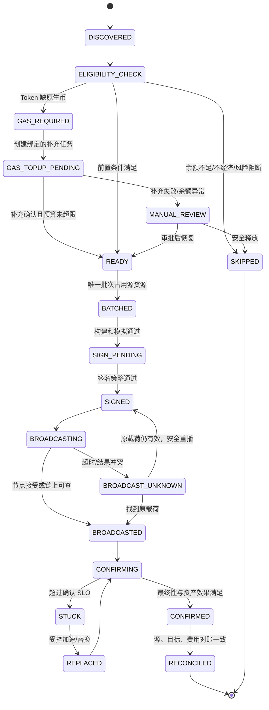
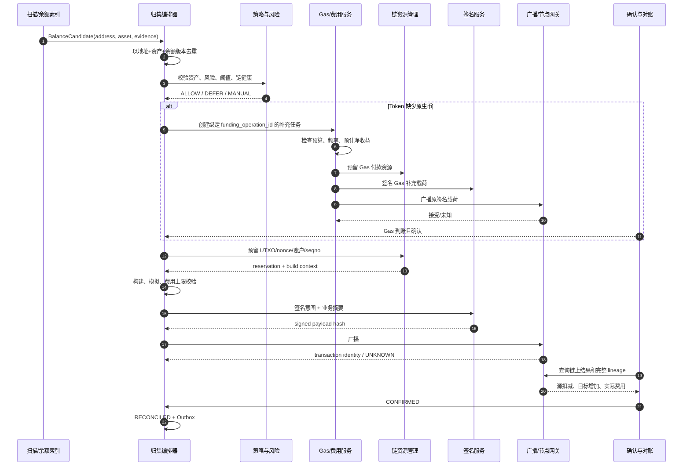
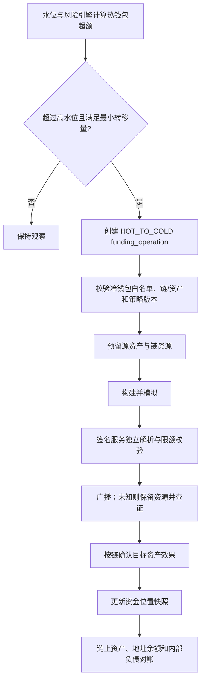

# Day 18：归集、热转冷与资金调度

> 学习目标：掌握定时、阈值和风险驱动归集；能够设计 BTC、EVM/ERC-20、Solana/SPL Token、TON/Jetton 的归集前置条件、成本模型与恢复策略；建立热钱包水位、冷转热审批、Gas 补充和资金调度体系，并用批次、签名载荷、链上证据和对账保证失败重试不重复支付。  
> 建议用时：5～6 小时  
> 完成标准：画出充值地址归集、热转冷和冷转热流程；完成热钱包水位告警与自动调度规则；制作四链归集成本及前置条件对比表；闭卷回答文末恰好 7 道面试题。

## 安全边界与核心结论

- 所有实验只使用 Regtest、Devnet、Testnet、本地沙箱或确定性夹具，不使用生产私钥、有价值资产或真实 API Key。
- 归集是平台自有地址之间的链上资产移动，不直接改变用户内部负债；链上资产位置变化与用户账本变化必须分开记录和对账。
- 充值“已入账”不等于资产“已归集”。充值确认服务负责用户负债，归集服务负责资金可用性、风险暴露和链上成本。
- 归集不是余额全部转走。必须保留手续费、租金、粉尘、在途交易和并发任务所需的安全余量。
- 同一归集意图只能有一次业务资金效果。任务重试优先查询或重播原签名载荷，广播未知时不得立即重新构建另一笔转账。
- Gas 补充是独立资金操作，必须绑定目标归集任务、设置单地址与全局预算、频率限制、过期时间和回收策略，禁止无上限递归补充。
- 热钱包水位不能用固定常数拍脑袋，应由提币预测、链上确认时延、补充提前期、手续费波动和风险上限共同决定。
- 冷转热会扩大在线资产暴露，通常需要预测触发、双人审批、离线或受控签名、分批执行和对账，不能由单一在线服务完全自动完成。
- Redis 可用于调度、缓存和限流，但数据库唯一约束、状态机、签名策略与链上对账才是资金安全边界。
- 成本优化不能破坏安全：不能为了省手续费合并不可信资产、跳过模拟、释放未知交易资源或把热钱包水位推到无法履约。

资金与调度不变量：

```text
I1. 每个 funding_operation_id 只能表达一个确定的源、目标、资产和业务目的。
I2. 同一批次中的源资产不能被两个并发任务重复占用。
I3. 广播结果未知时，源资源和业务状态保持占用，不创建独立付款。
I4. 归集、热转冷和冷转热不直接增减用户总负债。
I5. 链上资产位置变化必须能由已确认资金操作解释。
I6. Gas 补充总额、次数和有效期均有上限，且只能服务已批准归集任务。
I7. 热钱包可用资产必须覆盖安全水位，同时不得突破风险暴露上限。
I8. 冷转热必须经过职责分离审批，任何单一在线组件不能独立完成。
I9. 批次部分成功时按子项收敛，不能整批盲目重发。
I10. 人工调账、释放、重签和跳过规则都必须审批并保留不可变审计证据。
```

---

## 一、归集与资金调度解决什么问题

### 1. 四类资产位置

```text
充值地址：接收用户链上充值，数量多、余额分散、私钥使用应受限
热钱包：满足日常提币，在线签名能力强，暴露风险最高
温钱包：承担缓冲、审批后补充和较低频调度
冷钱包：保存大部分储备，离线或高门槛签名，响应最慢
```

平台内部用户余额是负债视角，以上地址余额是资产位置视角。归集只是把分散资产移动到受控资金池，热转冷降低在线暴露，冷转热恢复履约能力。

### 2. 为什么充值到账后还要归集

- 分散充值地址不适合直接承担高并发提币；
- 大量私钥或账户在线使用会扩大攻击面；
- 余额集中后更易管理水位、签名权限和对账；
- BTC 可通过合理归集减少未来提币输入数量，但也要避免无意义碎片整理；
- Token 地址通常缺少原生币手续费，需按策略补充后归集；
- 热转冷把超过运营需求的资产移出在线环境；
- 资金调度保证各链、资产和钱包池在安全范围内可履约。

代价是链上手续费、签名次数、隐私关联、链资源占用和额外失败面，因此归集频率不是越高越好。

### 3. 三类归集触发策略

| 策略 | 触发条件 | 优点 | 风险与适用场景 |
|---|---|---|---|
| 定时归集 | 每小时、每日或低费率窗口 | 易规划批次和容量 | 小余额也可能被扫描，浪费手续费 |
| 阈值归集 | 可归集净额超过最小值 | 避免负经济价值交易 | 低余额长期分散，恢复速度受阈值影响 |
| 风险归集 | 高风险地址、大额到账、热暴露变化 | 快速降低暴露 | 可能在高费率时执行，需更严审批 |
| 混合策略 | 时间 + 净额 + 风险 + 链健康 | 平衡时效、成本和安全 | 规则复杂，必须版本化和可解释 |

推荐用混合策略：风险优先，经济性约束，定时任务兜底。

---

## 二、统一资金操作模型

### 1. 三种操作类型

```text
DEPOSIT_SWEEP   充值地址 -> 热/中转钱包
HOT_TO_COLD     热钱包 -> 冷钱包
COLD_TO_HOT     冷钱包 -> 热钱包
GAS_TOPUP       Gas 钱包 -> Token 充值地址
REBALANCE       热钱包池/网络之间的受控再平衡
```

每个操作拥有不可变 `funding_operation_id`，批量执行时再由 `batch_id` 聚合。不要只用定时任务执行时间作为幂等键。

### 2. 状态机



### 3. 状态语义

| 状态 | 资金事实 | 是否释放源资源 |
|---|---|---:|
| `DISCOVERED` | 只发现余额候选 | 是 |
| `READY` | 前置条件满足，尚未占用 | 是 |
| `BATCHED` | 源资产或链资源已预留 | 否 |
| `SIGNED` | 已存在可能生效的载荷 | 否 |
| `BROADCAST_UNKNOWN` | 是否被链接受未知 | 否 |
| `CONFIRMED` | 链上移动已成立 | 不释放，转为已消费 |
| `RECONCILED` | 源、目标、费用和内部记录闭环 | 已按链状态收敛 |
| `SKIPPED` | 未产生链上资金效果 | 是，但需保存理由 |

`FAILED` 不能作为模糊终态。必须区分构建失败、签名未知、广播未知、链上失败、部分成功和内部对账失败。

### 4. 状态迁移守卫

```text
current_status == expected_status
status_version == expected_version
transition_key unique
source ownership still valid
chain resource reservation unchanged
policy/config snapshot recorded
required approval exists
signed payload hash unchanged
chain evidence satisfies adapter policy
```

跨服务任务可重复投递，但条件更新和唯一键必须让重复执行收敛到同一结果。

---

## 三、充值地址归集流程



### 1. 候选余额不是节点 `balance` 的一个数字

归集前至少需要：

```text
chain / network / asset identity
source address and ownership
spendable atomic amount
pending outgoing amount
reserved amount
fee/rent reserve
minimum retained balance
latest trusted chain anchor
risk status
last sweep time
balance observation version
```

Token 余额和原生币余额必须分开。EVM ERC-20、Solana SPL Token、TON Jetton 都可能“Token 有余额但原生币不足”。

### 2. 可归集净额

统一表达可写为：

$$
A_{sweepable} = A_{confirmed} - A_{reserved} - A_{pending} - A_{retained} - A_{safety}
$$

只有当：

$$
V(A_{sweepable}) > C_{network} + C_{operations} + M_{risk}
$$

才具备经济性。其中 $V$ 是统一计价价值，$C_{network}$ 是链上成本，$C_{operations}$ 是签名与运维成本，$M_{risk}$ 是风险缓冲。价格源异常时应延迟或采用保守阈值，不能假设成本为零。

### 3. 归集目标选择

- 日常可用资金不足时，可归集到热钱包；
- 热钱包达到目标水位后，新增归集可直接进入温钱包或热转冷队列；
- 高风险或待审查资产不得与正常资金混合；
- 非标准 Token、冻结风险资产和来源异常地址应进入隔离钱包；
- 目标钱包必须匹配链、网络、资产能力和签名策略版本。

---

## 四、BTC UTXO 归集与碎片整理

### 1. BTC 的归集对象

BTC 不是“地址余额转账”，而是选择一组可花费 OutPoint，创建一个或多个目标输出和找零输出。归集要考虑：

- UTXO 确认数、Coinbase maturity 与脚本类型；
- 输入数量、输出数量和预计虚拟字节；
- 当前及预测费率；
- 粉尘阈值与未来花费成本；
- 隐私和地址聚类风险；
- UTXO 是否被提币、其他归集或替换交易预留；
- RBF/CPFP 能力及硬件签名输入上限。

### 2. 碎片的代价

UTXO 太碎会导致：

- 提币需要更多输入，交易体积和手续费升高；
- 高峰时小 UTXO 价值可能低于未来花费成本，形成经济粉尘；
- PSBT 变大，冷签名和硬件设备处理时间增长；
- 节点、数据库、选币和签名服务压力增加；
- 同时消耗多个充值地址会暴露地址关联关系；
- 批量交易更容易触碰标准性、策略或硬件限制。

但高费率时盲目整理更贵。应在低费率窗口、有明确未来需求且隐私策略允许时执行。

### 3. 经济性判断

某 UTXO 是否值得归集，可估算：

$$
C_{spend} = vbytes_{input} \times feerate
$$

若 UTXO 金额接近或低于当前/预测花费成本加安全边际，就不应自动归集。不同脚本类型输入大小不同，不能统一按固定字节估算。

### 4. BTC 批次策略

```text
1. 过滤未确认、冻结、争议、已预留和经济粉尘 UTXO。
2. 按脚本类型、确认深度、风险域和签名钱包分组。
3. 限制单批输入数、总 vbytes、总金额和地址数。
4. 事务内逐 OutPoint 建立唯一预留。
5. 构建 PSBT，固定目标、找零、费率范围和 RBF 标志。
6. 签名服务独立解析全部输入输出。
7. 广播未知时保留 UTXO 预留并查询原 txid。
8. 确认后把输入标记 SPENT，新输出登记为新 UTXO。
```

### 5. RBF 与 CPFP

- RBF：用相同输入构造更高费率替换交易，必须保留原交易和替换 lineage；
- CPFP：花费归集交易的可控输出，提高父子包总费率；
- 非 RBF 且无可控输出时通常只能等待或与矿池/节点策略协调；
- 任一候选确认后，其他候选不得触发第二次业务归集；
- 加速成本要计入批次实际成本，不能重复向业务分摊。

---

## 五、EVM 与 ERC-20 归集

### 1. 原生币归集

EVM 原生币归集需保留 Gas：

$$
A_{send} = A_{balance} - gasLimit \times maxFeePerGas - A_{reserve}
$$

实际费用通常低于上限，但构建时必须保证余额能覆盖最坏费用。不能使用 `balance - estimatedFee` 后又在广播前提高 `maxFeePerGas`，否则可能余额不足。

同一地址的多个任务争用 sender nonce。应在数据库事务中分配 nonce，并把余额快照、Gas 参数和 chain ID 绑定到构建上下文。

### 2. ERC-20 归集前置条件

- Token contract 必须在资产白名单，且网络正确；
- Token 余额达到最小归集阈值；
- 源地址有足够原生币支付 Gas，或满足 Gas 补充规则；
- `eth_call`/模拟成功，处理暂停、黑名单、手续费 Token 等特性；
- sender nonce 已预留；
- 目标钱包支持该 Token，合约升级和资产配置版本已记录；
- 预计 Token 价值明显高于 Gas 补充和归集总成本。

### 3. ERC-20 地址没有 ETH 时怎么办

不能从 Token 余额直接支付普通 EVM Gas。典型流程：

```text
Token sweep operation S1 发现 GAS_REQUIRED
  -> 创建唯一 Gas top-up operation G1，绑定 S1
  -> G1 从专用 Gas 钱包发送最小充足 ETH
  -> 等待 G1 达到策略确认
  -> 再次模拟 S1 并检查 Token/ETH 余额
  -> S1 使用地址自身 nonce 执行 transfer
  -> 归集后评估并回收剩余 ETH，或保留受控最小值
```

可替代方案包括 EIP-4337 Paymaster、Meta-Transaction 或专用归集合约，但会引入合约、授权、赞助策略和重放风险，必须单独评审，不能默认比直接补 Gas 更安全。

### 4. Gas 补充的防滥用规则

```text
unique(target_chain, target_address, bound_operation_id, purpose)
单次补充上限
单地址日累计上限
资产/网络全局预算
最大补充次数（通常 1，特殊情况审批）
补充有效期
只对受支持 Token 与可信余额证据开放
预计净归集价值必须覆盖总成本
补充后 Token 状态变化则停止并审查
禁止 Gas 补充任务再次触发 Gas 补充
```

Gas 到账不代表归集必然成功。若 Token 被转走、冻结、合约暂停或模拟失败，应停止继续补充，记录沉没成本并进入人工处理。

### 5. 非标准 Token

- Fee-on-transfer：目标实际到账可能小于调用金额；
- Rebase：余额可能在构建和执行间变化；
- Blacklist/Pausable：源或目标可能被限制；
- 无标准返回值：适配器需按已审计兼容策略处理；
- 代理升级：实现变化可能使旧模拟结论失效；
- 恶意 Token：不能因地址存在陌生 Token 就自动补 Gas 或调用合约。

资产白名单必须基于 chain ID + contract address，而不是名称或符号。

---

## 六、Solana 与 SPL Token 归集

### 1. SOL 归集

SOL 账户需要考虑：

- Fee payer 是否为源地址或专用费用账户；
- 交易费、优先费和账户最低余额要求；
- Recent Blockhash 有效期；
- 可写账户冲突与 Compute Unit；
- Commitment 和交易签名查询；
- 归集后账户是否仍需保留以接收后续资金。

若 Fee Payer 独立，可减少向每个地址补 SOL，但签名和权限模型更复杂；源账户仍需按指令要求签名。

### 2. SPL Token 前置条件

```text
官方 Mint 身份已确认
源 Token Account 的 owner 属于平台
源 Token Account/Mint/Token Program 匹配
目标 ATA 正确且存在，或在同一交易中安全创建
Token decimals 来自可信资产配置
Fee payer 有足够 SOL
源账户未冻结且余额可用
Recent Blockhash 仍在有效窗口
```

用户主地址、Token Account 和 Mint 是不同对象。不能读取用户地址的 SOL 余额来代替 Token Account 余额。

### 3. ATA 创建与账户关闭

- 目标 ATA 不存在时可由平台创建，但要计入租金和交易大小；
- 清空源 Token Account 后，可在策略允许时关闭并回收租金；
- 关闭前确认没有待处理入账、冻结余额或并发归集；
- 账户关闭后用户再次充值可能需要重新创建，影响用户体验和费用；
- Token-2022 扩展可能改变转账费、权限和账户要求，必须按 Program 与扩展解析。

### 4. Blockhash 过期恢复

广播未知时先按原 signature 查询。原 Blockhash 仍有效时可重播相同交易；确认超过 last valid block height 且多个节点均无原交易后，才允许重新获取 Blockhash、重建并重签。新签名必须关联原 `funding_operation_id`，避免两笔都被当作独立归集。

使用 Durable Nonce 时，应排他预留 Nonce Account，并核验其链上值是否已 advance；不能套用普通 Blockhash 的过期判断。

---

## 七、TON 与 Jetton 归集

### 1. TON 原生币归集

TON 通过 Wallet Contract 发送 External Message，再产生 Internal Message。归集需考虑：

- Wallet Contract 版本和地址格式；
- 当前 `seqno`、消息有效期和签名；
- 存储费、Gas、转发费和保留余额；
- Bounceable/Non-bounceable 目标策略；
- 外部消息接受、钱包交易和目标内部消息的完整链路；
- 高负载钱包的并发串行和 `seqno` 恢复。

不能把钱包 `seqno` 增加直接当作目标到账。

### 2. Jetton 归集

Jetton 余额位于所属人的 Jetton Wallet，而非 Owner 主账户本身。归集前要验证：

- Jetton Master 在资产白名单；
- 源 Jetton Wallet 的 Master 和 Owner 关系正确；
- 目标 Owner 对应的 Jetton Wallet 身份正确；
- 源主钱包有足够 TON 支付消息与转发费用；
- `query_id` 与 `funding_operation_id` 关联，但不单独承担资金幂等；
- 消息体、forward amount、response destination 和 Bounce 策略正确；
- 最终跟踪目标 Jetton Wallet 的实际余额效果。

### 3. TON 补费与失败语义

Jetton 地址缺 TON 时也可能需要补充，但必须使用与 EVM Gas 补充相同的预算和用途绑定原则。由于 TON 是异步消息链，应区分：

```text
补充 TON 的消息是否到达
钱包是否接受 Jetton transfer 请求
内部 transfer 是否到达目标 Jetton Wallet
notification/excess 消息是否返回
是否发生 Bounce 或部分执行
目标 Jetton 余额是否实际增加
```

部分阶段成功后不能简单重发整条链路，否则可能重复归集或重复支付消息费用。

---

## 八、四链归集成本及前置条件对比表

| 维度 | BTC | EVM/ERC-20 | Solana/SPL Token | TON/Jetton |
|---|---|---|---|---|
| 资产模型 | UTXO | Account + Contract | Account + Token Account | Wallet Contract + Message + Jetton Wallet |
| 核心前置条件 | 可花费 UTXO、确认数、无预留冲突 | nonce、原生币 Gas、合约白名单、模拟 | Fee payer、ATA、Blockhash、账户权限 | `seqno`、TON 费用、钱包/Jetton 身份、消息参数 |
| 原生币归集成本 | 输入/输出 vbytes × fee rate | gasUsed × effectiveGasPrice | 基础费 + 优先费 | Gas + 存储费 + 转发费 |
| Token 额外成本 | 不适用 | 地址需 ETH；合约调用 Gas | ATA 创建/租金、Fee payer、Token 扩展 | 地址需 TON；多段消息与转发费 |
| 批量能力 | 多输入多输出，适合批量但隐私关联 | 合约批量需审计，EOA 仍逐 nonce | 多 Instruction 受交易大小/CU 限制 | 钱包批量消息受版本和消息限制 |
| 并发资源 | OutPoint | sender nonce | Blockhash/Nonce Account、可写账户 | wallet `seqno` |
| 小额处理 | 经济粉尘，可能永不归集 | 价值需覆盖 Gas/补 Gas | 价值需覆盖费和 ATA/租金 | 价值需覆盖消息链费用 |
| 加速方式 | RBF / CPFP | 同 nonce replacement | 优先费或过期后安全重建 | 按消息状态与钱包能力处理 |
| 到账证明 | 目标 UTXO 在规范链确认 | 原生余额或 Token 执行效果 | 指令成功与 Token Balance | 目标内部消息/Jetton 余额效果 |
| 主要风险 | 碎片、费率、隐私聚类 | Gas 循环、恶意 Token、nonce gap | ATA/账户锁、Blockhash 过期 | 假 Jetton、Bounce、部分执行 |

### 1. 成本归属

平台应区分：

```text
network_fee_actual
network_fee_reserved
fee_topup_cost
account_creation_or_rent_cost
acceleration_cost
signing_and_operational_cost
user_charged_fee（若适用）
```

内部调拨成本通常是平台运营成本，不应混入用户充值金额或凭空修改用户负债。费用归属和会计科目将在 Day 19 进一步展开。

### 2. 成本优化顺序

1. 先保证资产身份、权限、幂等和恢复正确；
2. 再通过阈值、低费率窗口和合理批次减少交易数；
3. 通过钱包分层和预测减少紧急冷转热；
4. 对 Token 补费做净收益判断和预算；
5. 最后评估批量合约、赞助交易等复杂方案。

---

## 九、热转冷流程



### 1. 热转冷触发因素

- 热钱包余额超过高水位；
- 在线资产价值超过风险限额；
- 大额充值归集后需要迅速降低暴露；
- 市场波动使同数量资产的法币风险上升；
- 密钥、主机或权限出现安全事件；
- 提币预测下降，长期闲置资金增加。

### 2. 热转冷也不能“全部转空”

要保留：

- 预测窗口内提币需求；
- pending/unknown 交易可能消耗的资金；
- Gas、优先费、账户租金和加速预算；
- 节点故障和冷钱包补充提前期的安全缓冲；
- 避免频繁冷热往返的滞回区间。

### 3. 冷钱包目标控制

冷钱包地址必须来自独立配置与白名单，变更需双人复核和生效冷静期。签名服务应核对目标地址、网络、资产、金额上限和操作类型，不能接受普通提币模板冒充热转冷。

---

## 十、冷转热流程

### 1. 为什么通常不能完全自动化

冷钱包的价值正是降低在线系统单点失陷后的最大损失。若在线预测服务能够自行决定、签名并广播冷转热，冷钱包就退化成高延迟热钱包。

典型流程：

```text
水位预测触发补充建议
  -> 生成不可变资金调度申请
  -> 独立人员核对链、资产、目标和金额
  -> 风险/财务双人审批
  -> 冷环境导入经校验的签名请求
  -> 离线或隔离设备再次解析并签名
  -> 单独广播服务提交
  -> 目标热钱包确认到账
  -> 更新可用水位并完成对账
```

### 2. 自动化边界

可以自动：预测、告警、生成建议、构建待审材料、校验地址、确认和对账。

通常不应单点自动：批准大额冷转热、导出私钥、绕过限额、修改冷钱包白名单、在证据不完整时重签。

某些 MPC 或策略化托管方案可实现受限自动补充，但仍需阈值签名、多主体授权、额度、时间窗、目的地址白名单和紧急停止机制。

### 3. 分批与验证

首次使用新地址、新网络或新签名流程时先小额测试，确认到账与对账后再分批执行。每批有独立 ID 和额度，后续批次不能因前一批广播超时而自动开始。

---

## 十一、热钱包水位模型

### 1. 四个水位

| 水位 | 含义 | 动作 |
|---|---|---|
| `EMERGENCY_LOW` | 即将无法履约或支付手续费 | 暂停部分提币、最高优先级补充 |
| `LOW` | 低于目标安全库存 | 创建冷/温转热申请 |
| `TARGET` | 可覆盖预测需求和缓冲 | 正常运营 |
| `HIGH` | 在线暴露超过需要 | 创建热转冷任务 |

低水位和高水位之间应有滞回，避免价格或请求轻微波动导致频繁往返。

### 2. 动态目标

可使用简化模型：

$$
H_{target} = Q_{p}(W) + D_{pending} + F_{reserve} + S_{incident}
$$

其中：

- $Q_{p}(W)$：未来窗口 $W$ 内提币需求的高分位预测；
- $D_{pending}$：已批准但未完成提币；
- $F_{reserve}$：网络费、Token Gas、加速与账户成本；
- $S_{incident}$：节点故障、补充延迟和预测误差缓冲。

同时受风险上限约束：

$$
H_{target} \leq H_{risk\_cap}
$$

若履约需求高于风险上限，不能偷偷提高热钱包余额，应触发管理决策：降低提币额度、增加钱包分片、缩短补充提前期或提高审批能力。

### 3. 时间维度

- 预测窗口至少覆盖冷转热审批、签名、广播和确认的 P95/P99 时间；
- 按工作日、周末、活动、市场波动和链拥堵调整；
- Token 与原生 Gas 水位分别计算；
- 法币计价和原子数量双重监控，价格源异常时采用保守值；
- 模型输出必须可解释并记录版本，不能只留下一个阈值。

### 4. 自动调度规则示例

```text
IF hot_available < emergency_low:
  pause low-priority withdrawals
  alert P1
  create replenishment proposal with capped amount

ELSE IF projected_available_at_lead_time < low:
  create COLD_TO_HOT proposal
  require approvals according to amount tier

ELSE IF hot_exposure > high:
  create HOT_TO_COLD operation
  retain pending withdrawals + fee reserve + incident buffer

IF chain_health != HEALTHY OR reconciliation_diff != 0:
  do not start new automatic movement
  keep monitoring and require manual decision
```

### 5. 钱包池而非单地址

生产系统通常按链、资产、业务和风险域管理钱包池。水位计算要覆盖：

- 单钱包可用余额；
- 整个热钱包池可用余额；
- nonce/UTXO/账户锁导致的暂时不可用资产；
- 签名服务容量和单密钥限额；
- 单地址失败时的流量切换能力；
- 资产总风险暴露，而不只是链上数量。

---

## 十二、归集批次设计

### 1. 批次与子项

```text
sweep_batch
  batch_id
  chain/network/asset
  source_wallet_scope
  target_wallet
  policy_version
  status/version
  estimated_cost / actual_cost
  created_by / approved_by

sweep_item
  item_id
  funding_operation_id
  source address/account/outpoint
  expected amount
  actual amount
  status
  chain evidence
```

批次是调度和签名单位，子项是资产来源与对账单位。一笔 BTC 交易可承载多个 UTXO 子项；EVM 普通 EOA 往往每个源地址各自占用 nonce；不能强求四链具有相同批次拓扑。

### 2. 批次边界

按以下维度分组：

- chain、network、asset contract/Mint/Master；
- 签名钱包和密钥策略；
- 风险域与资金来源；
- 脚本/账户/Program/Wallet Contract 能力；
- 费用策略和优先级；
- 最大输入数、交易大小、Compute Unit、消息数；
- 审批额度和单批风险上限。

### 3. 部分成功

批次不能只有一个布尔状态。若 100 个子项中 80 个确认、10 个失败、10 个未知：

- 80 个按链证据标记确认并对账；
- 10 个明确失败按资源语义安全重建或跳过；
- 10 个未知保持占用并查证；
- 不重新发送整个批次；
- 汇总状态可为 `PARTIALLY_COMPLETED`，但每个子项拥有独立证据。

### 4. 调度并发

使用数据库唯一约束占用资金来源：

```text
BTC: unique(chain, network, txid, vout)
EVM: unique(chain, network, sender, nonce)
Solana: unique(chain, network, durable_nonce_account, nonce_value)
TON: unique(chain, network, wallet_address, seqno)
业务: unique(funding_operation_id, generation)
签名: unique(signed_payload_hash)
```

租约过期只能触发恢复检查，不能自动认为链资源未被消费。

---

## 十三、失败重试与防重复手续费

### 1. 重试分类

| 失败位置 | 是否产生链上费 | 重试方式 |
|---|---:|---|
| 候选发现/策略校验 | 否 | 使用相同 operation ID 重新评估 |
| 构建失败 | 否 | 修复上下文后重建，保持审计版本 |
| 签名明确拒绝 | 否 | 修复审批/策略；不得绕过签名策略 |
| 签名响应未知 | 未广播则否，但签名可能存在 | 查询原 intent，不新建签名 |
| 广播响应未知 | 可能 | 查询并重播相同 signed payload |
| 链上明确失败 | 常常已付费 | 按链资源和失败原因决定新 generation |
| 交易卡住 | 可能最终付费 | 使用 RBF/replacement/优先费并保存 lineage |
| 内部确认失败 | 链上已付费 | 重放内部幂等更新，绝不重发链交易 |

### 2. 为什么“任务失败就重试”会重复付费

工作队列看到的超时只是本地调用状态，不是链上状态。若节点已接收而响应丢失，新建交易可能：

- BTC 使用另一组 UTXO，再次向归集目标转账；
- EVM 使用新 nonce，再转一次 Token；
- Solana 使用新 Blockhash 和新签名，再执行一次；
- TON 使用新 `seqno`，再次发送内部转账。

正确做法是保存构建结果、签名载荷、预期链身份、资源和所有广播尝试。先重播同一载荷或查证，只有旧载荷不可能生效时才创建新 generation。

### 3. 手续费预算

每个批次保存：

```text
estimated_fee_atomic
max_fee_atomic
actual_fee_atomic
acceleration_budget_atomic
gas_topup_budget_atomic
cost_policy_version
```

达到预算上限后进入人工审核，不能自动无限提费。费用异常还可能意味着节点估算错误、合约行为变化、攻击或配置单位错误。

---

## 十四、数据表与唯一约束

### 1. 资金操作表

```sql
CREATE TABLE funding_operation (
    id BIGINT PRIMARY KEY,
    operation_no VARCHAR(64) NOT NULL,
    operation_type VARCHAR(32) NOT NULL,
    chain_code VARCHAR(32) NOT NULL,
    network_code VARCHAR(32) NOT NULL,
    asset_id BIGINT NOT NULL,
    source_identity VARCHAR(512) NOT NULL,
    target_identity VARCHAR(512) NOT NULL,
    amount_atomic DECIMAL(65, 0) NOT NULL,
    status VARCHAR(32) NOT NULL,
    status_version BIGINT NOT NULL DEFAULT 0,
    policy_version VARCHAR(64) NOT NULL,
    parent_operation_id BIGINT NULL,
    current_attempt_id BIGINT NULL,
    created_at TIMESTAMP NOT NULL,
    updated_at TIMESTAMP NOT NULL,
    UNIQUE KEY uk_operation_no (operation_no)
);
```

### 2. 余额观察与候选去重

```sql
CREATE TABLE sweep_candidate (
    id BIGINT PRIMARY KEY,
    chain_code VARCHAR(32) NOT NULL,
    network_code VARCHAR(32) NOT NULL,
    asset_id BIGINT NOT NULL,
    source_identity VARCHAR(512) NOT NULL,
    balance_anchor VARCHAR(256) NOT NULL,
    observed_amount_atomic DECIMAL(65, 0) NOT NULL,
    sweepable_amount_atomic DECIMAL(65, 0) NOT NULL,
    decision VARCHAR(32) NOT NULL,
    reason_code VARCHAR(64) NOT NULL,
    policy_version VARCHAR(64) NOT NULL,
    observed_at TIMESTAMP NOT NULL,
    UNIQUE KEY uk_candidate_version
      (chain_code, network_code, asset_id, source_identity, balance_anchor)
);
```

### 3. Gas 补充约束

```sql
CREATE TABLE gas_topup (
    id BIGINT PRIMARY KEY,
    topup_no VARCHAR(64) NOT NULL,
    bound_operation_id BIGINT NOT NULL,
    chain_code VARCHAR(32) NOT NULL,
    target_address VARCHAR(256) NOT NULL,
    amount_atomic DECIMAL(65, 0) NOT NULL,
    attempt_no INT NOT NULL,
    status VARCHAR(32) NOT NULL,
    expires_at TIMESTAMP NOT NULL,
    budget_policy_version VARCHAR(64) NOT NULL,
    created_at TIMESTAMP NOT NULL,
    UNIQUE KEY uk_topup_no (topup_no),
    UNIQUE KEY uk_bound_topup_attempt (bound_operation_id, attempt_no)
);
```

全局和单地址累计额度还需在数据库事务内占用预算。不能只依赖 Redis 计数器。

### 4. 水位策略与快照

```text
liquidity_policy:
  chain/network/asset/wallet_pool
  emergency_low / low / target / high
  prediction_window
  risk_cap
  approval_tier
  effective_from / version

liquidity_snapshot:
  confirmed_balance
  pending_inbound / pending_outbound
  reserved_fee
  projected_demand
  available_for_withdrawal
  price_snapshot
  chain_health
  calculated_at / policy_version
```

保存输入快照才能解释为何某时刻触发热转冷或冷转热。

---

## 十五、监控、告警与对账

### 1. 归集指标

```text
sweep_candidate_count{chain,asset,decision}
sweepable_value{chain,asset}
sweep_success_total{chain,asset}
sweep_confirmation_seconds{chain}
sweep_cost_ratio{chain,asset}
sweep_unknown_count{chain}
sweep_stuck_age_seconds{chain}
sweep_batch_partial_count{chain}
```

### 2. Gas 与账户成本指标

```text
gas_topup_total{chain,asset,result}
gas_topup_atomic{chain,target}
gas_topup_without_sweep_count
gas_topup_repeat_count{target}
token_value_to_total_cost_ratio
ata_creation_cost_total
account_rent_recovered_total
```

### 3. 水位指标

```text
hot_wallet_available{chain,asset,wallet_pool}
hot_wallet_exposure_value{chain,asset}
projected_withdrawal_demand{window}
time_to_low_watermark_seconds
cold_to_hot_lead_time_seconds
pending_replenishment_value
liquidity_policy_breach_total{level}
```

### 4. 对账等式

某资产在观察窗口内：

$$
Opening + ConfirmedInbound - ConfirmedOutbound - NetworkFees = Closing + ExplainedDifference
$$

归集要同时核对：

- 源地址实际减少；
- 目标地址实际增加；
- 网络费与附加账户成本；
- pending、replacement 和部分成功；
- 用户总负债未因内部调拨改变；
- 地址资产之和与资金位置账一致。

### 5. 关键告警

| 告警 | 条件示例 | 首要动作 |
|---|---|---|
| 热钱包紧急低水位 | 预计可用量不足以覆盖补充提前期 | 限制低优先级提币，发起最高级补充 |
| 热钱包超风险上限 | 在线价值超过 cap | 暂停新增归集到热钱包，热转冷 |
| Gas 补充无后续归集 | 超过有效期仍无 sweep | 停止该地址补充，检查 Token 与任务 |
| 广播未知积压 | 数量或年龄超过阈值 | 暂停相同源钱包新任务并查证 |
| 资源预留泄漏 | 无活跃任务但长期 RESERVED | 核验链状态，禁止直接释放 |
| 批次部分成功 | 子项状态长期不收敛 | 分项恢复，禁止整批重发 |
| 账链差异 | 无法由费用和在途解释 | 暂停对应链/资产并启动对账 Runbook |
| 冷转热超时 | 超过审批/签名/确认 SLO | 启动备用流程但不得绕过审批 |

---

## 十六、异常与补偿动作矩阵

| 异常 | 链上效果可能性 | 自动动作 | 禁止动作 | 恢复证据 |
|---|---:|---|---|---|
| 重复发现同一余额 | 否 | 候选唯一键收敛 | 创建多个归集业务 | balance anchor、source、asset |
| 两批争用同一 UTXO | 否 | 唯一预留只允许一方成功 | 依赖进程锁继续签名 | OutPoint reservation |
| EVM nonce 冲突 | 可能 | 暂停 sender，重建 nonce 视图 | 为不同业务复用 nonce | DB 分配、链上 pending/confirmed nonce |
| Token 无原生 Gas | 否 | 创建绑定且限额的补充任务 | 无限循环补 Gas | 预算、次数、净收益、Token 状态 |
| Gas 已补但 Token 被转走 | Gas 已支付 | 停止归集与再次补充 | 为“追回成本”继续补 | 补充 tx、余额变化、风险审查 |
| 构建后余额变化 | 否 | 作废未签载荷并重新评估 | 按旧金额签名 | 新链锚点与余额快照 |
| 签名响应超时 | 未知 | 查询原 signing intent | 新建独立签名 | payload hash、签名服务审计 |
| 广播超时 | 是 | 保持资源，查证并重播原载荷 | 重建第二笔资金移动 | tx identity、资源状态、多节点 |
| BTC 费率过低 | 是 | RBF/CPFP，保存 lineage | 新 UTXO 再归集相同目标金额 | 所有输入和候选 tx |
| EVM replacement underpriced | 是 | 按策略提高同 nonce 费用 | 使用新 nonce 重付 | 同 nonce hashes 与费用策略 |
| Solana Blockhash 过期 | 未知 | 证明旧签名不可能落链后重建 | 单节点查不到即重签 | lastValidBlockHeight、多节点状态 |
| TON `seqno` 前进但 Jetton 未达 | 部分 | 跟踪内部消息和 Bounce | 仅看 seqno 标记完成 | 消息链、目标余额效果 |
| 批次部分成功 | 是 | 按子项收敛失败和未知 | 整批重发 | item 级链证据与资源 |
| 热钱包低水位 | 否 | 限额、排队、创建补充建议 | 绕过冷签审批 | 预测、水位快照、审批 SLA |
| 冷转热审批超时 | 否 | 降低提币能力、升级响应 | 在线系统自行签冷钱包 | 审批审计与应急策略 |
| 链上成功但内部未确认 | 是 | 对账发现并重放内部幂等更新 | 再发链交易 | 链证据、operation ID、目标到账 |
| 内部标记成功但目标未到账 | 未知 | 暂停并核查 replacement/异步效果 | 用状态覆盖差异 | 源、目标、费用、规范链证据 |
| 价格源异常 | 否 | 使用保守阈值或暂停经济性任务 | 将未知 Token 当高价值归集 | 多源价格、策略版本 |
| 签名密钥或目标白名单异常 | 否/未知 | 全局暂停相关资金流 | 临时手工换地址继续 | 配置签名、审批和链上查证 |

补偿原则：未产生链上效果时可以安全释放；可能产生效果时保持占用并查证；已经产生效果时补内部状态和对账，不能重发或假装数据库回滚能撤销链上交易。

---

## 十七、故障演练与 Runbook

### 演练 A：ERC-20 Gas 补充后归集失败

1. 创建 Token 归集任务并绑定唯一 Gas 补充；
2. Gas 到账后模拟 Token 合约进入暂停状态；
3. 验证系统不进行第二次补 Gas；
4. 任务进入 `MANUAL_REVIEW`，保留剩余 ETH 和 Token 证据；
5. 合约恢复后沿用原 operation，重新分配安全 nonce；
6. 归集确认后记录补充成本和剩余 Gas；
7. 对账证明只有一次有效 Token 归集。

### 演练 B：BTC 批次广播未知

1. 预留 20 个 UTXO 并构建 PSBT；
2. 节点接收后断开连接；
3. 验证 20 个 OutPoint 均未被租约自动释放；
4. 根据原始交易计算 txid，向多个节点查询；
5. 必要时重播同一原始交易；
6. 确认后登记找零 UTXO 和实际矿工费；
7. 验证未生成第二笔使用其他 UTXO 的重复归集。

### 演练 C：Solana Blockhash 过期

1. 构建并签名 SPL Token 归集，但阻断广播响应；
2. 在有效期内按 signature 查证并重播原字节；
3. 等待超过 last valid block height；
4. 用多个节点确认旧签名未落链；
5. 新建 generation，获取新 Blockhash 并重签；
6. 跟踪两个 signature，只允许一次业务效果；
7. 核对目标 ATA 实际余额变化和费用。

### 演练 D：冷转热审批延迟导致低水位

1. 注入提币需求突增和审批人不可用；
2. 水位从 `LOW` 降至 `EMERGENCY_LOW`；
3. 验证系统限速低优先级提币并触发 P1 告警；
4. 启动预先批准的备用审批路径，不绕过阈值签名；
5. 分批冷转热并逐批确认；
6. 水位恢复到 `TARGET` 后逐步恢复提币；
7. 复盘预测误差、审批 SLA 和备用资金池。

### 排障顺序

```text
候选发现
  -> 策略与经济性
  -> Gas/账户前置条件
  -> 批次与源资源预留
  -> 构建和模拟
  -> 签名意图
  -> 广播及未知结果
  -> 链上确认和目标效果
  -> 地址资金位置更新
  -> 用户负债与链上资产对账
```

恢复服务前必须证明：未知广播已收敛或隔离、源资源与链一致、Gas 补充没有孤儿任务、冷转热审批链完整、热钱包水位满足恢复后的积压需求、账链差异为零或有审批解释。

---

## 十八、口头面试题参考答案

> 本节严格包含计划中的 7 道题。先闭卷口述，再按“结论 → 原理 → 生产实现 → 异常与风险 → 监控和恢复”补全。

### 1. 为什么充值到账后还需要归集？

**参考回答：**

充值到账解决的是用户负债确认，归集解决的是平台链上资产位置、可用性和风险。充值地址数量多且余额分散，直接用它们提币会扩大密钥暴露、增加签名和调度复杂度；归集到受控钱包池后，才能统一管理热钱包水位、提币流动性、热转冷和对账。

归集也有手续费、隐私聚类和链资源成本，所以不能每笔到账就机械执行。生产上按时间、净额、风险和链健康混合触发，只有可归集价值覆盖网络与运营成本时才执行。归集不改变用户总负债，链上成功后通过源地址、目标地址、费用和资金位置账对账。

### 2. ERC-20 地址没有 ETH 时如何归集？

**参考回答：**

普通 ERC-20 转账需要源地址支付 ETH Gas，因此先创建绑定原 Token 归集任务的 Gas 补充操作，从专用 Gas 钱包发送满足费用上限的最小 ETH。补充确认后重新检查 Token 余额、nonce、合约状态并模拟，再执行 Token `transfer`。

补充必须有业务唯一键、单次和累计上限、次数、有效期与净收益门槛。若 Token 被转走、合约暂停或模拟失败，停止继续补充并人工处理。也可评估 Paymaster、Meta-Transaction 或归集合约，但需额外审计授权、重放和合约风险，不能作为无条件捷径。

### 3. Gas 补充如何避免形成无限循环或被恶意消耗？

**参考回答：**

Gas 补充只能由已批准、资产白名单内且有可信余额证据的归集任务触发，并以 `bound_operation_id` 唯一绑定；补充任务本身绝不能再次触发补充。设置单次金额、单地址日累计、资产和网络全局预算、最大次数和过期时间，要求预计可归集价值显著覆盖总成本。

补充到账后必须重新模拟和核对 Token 余额。若资产被转走、合约冻结、nonce 异常或第一次补充未带来归集，立即停止而不是追加。监控补充无归集、重复补充、成本价值比和异常地址聚类，达到阈值自动隔离并审计。

### 4. BTC UTXO 太碎会产生什么问题？

**参考回答：**

碎片会让未来提币需要更多输入，增加虚拟字节和矿工费；PSBT、选币、签名和硬件设备处理也更慢。极小 UTXO 在高费率下可能低于自身花费成本，形成经济粉尘。合并大量充值地址还会暴露地址关联，并增大批次失败影响。

生产上按脚本类型、金额、确认深度、费率预测和隐私域筛选，在低费率且有未来需求时整理，限制单批输入数和总价值。每个 OutPoint 用数据库唯一约束预留；广播未知不释放，卡住时用受控 RBF/CPFP。监控 UTXO 数量、价值分布和未来花费成本，而不是盲目清空地址。

### 5. 热钱包保留多少余额合理？

**参考回答：**

没有适用于所有平台的固定比例。目标水位应覆盖冷转热提前期内提币需求的高分位预测、已批准未完成提币、网络费和加速预算、节点或审批故障缓冲，同时不得超过在线资产风险上限。Token 数量和原生 Gas 还要分别计算。

设置 emergency low、low、target、high 四档并加入滞回，低水位触发补充建议，高水位触发热转冷，紧急低水位限制低优先级提币。按链、资产、钱包池、时段和市场波动动态配置并保存模型版本。持续监控预测误差、补充 P95/P99 时间、在线暴露和履约率。

### 6. 冷转热为什么通常不能完全自动化？

**参考回答：**

冷钱包的目标是让在线系统被攻陷时攻击者仍不能独立转走大部分资产。若一个在线服务能自动决定金额、修改目标并完成签名，冷钱包就失去隔离价值。冷转热通常需要不可变申请、目标白名单、分级额度、财务或安全双人审批、离线或隔离签名、分批广播和到账对账。

预测、告警、材料生成和确认可以自动化；最终授权不能由单点控制。MPC 可以做受限自动补充，但仍需多主体阈值、时间窗、额度、固定热钱包目标和紧急停止。审批延迟时应限速提币和启用预先批准的备用流程，不能临时绕过控制。

### 7. 归集失败时如何避免重复支付手续费？

**参考回答：**

先区分本地失败、签名未知、广播未知、链上明确失败和内部更新失败。为每次归集保存稳定 operation ID、资源预留、unsigned/signed payload hash、预期链身份和所有 attempt。签名或广播超时先查询原结果；原载荷仍有效时只重播相同字节，不重新构建独立交易。

交易卡住时使用同一业务 lineage 的 RBF、同 nonce replacement、Solana 安全过期后重建或 TON 消息链恢复。链上已成功但内部失败只重放幂等确认和对账，不再广播。每批设置费用与加速预算，达到上限转人工；批次部分成功按子项恢复，绝不能整批盲目重发。

---

## 十九、当天任务

### 任务 1：三类资金流（60 分钟）

- [ ] 画出充值地址归集、热转冷和冷转热三条流程。
- [ ] 为每条流程标出审批、签名、广播、确认和对账边界。
- [ ] 明确哪些步骤可自动化，哪些必须人工或多方授权。
- [ ] 说明三类操作为何不直接改变用户总负债。

### 任务 2：四链归集对比（60 分钟）

- [ ] 完成 BTC UTXO 筛选、批次和费用计算。
- [ ] 完成 EVM 原生币与 ERC-20 归集前置条件。
- [ ] 完成 Solana ATA、Fee Payer 和 Blockhash 处理。
- [ ] 完成 TON/Jetton Wallet、`seqno` 和消息链处理。

### 任务 3：Gas 补充（45～60 分钟）

- [ ] 设计 Gas 补充表、唯一键、预算和次数限制。
- [ ] 推演补充成功但 Token 被转走。
- [ ] 推演节点超时导致补充结果未知。
- [ ] 验证 Gas 补充不能递归触发自身。

### 任务 4：热钱包水位（45 分钟）

- [ ] 为一种资产定义四档水位和风险上限。
- [ ] 估算冷转热 P95/P99 提前期与预测窗口。
- [ ] 加入 pending 提币、费用和事故缓冲。
- [ ] 推演需求突增、价格暴涨和链拥堵。

### 任务 5：批次与异常恢复（60 分钟）

- [ ] 设计 funding operation、batch、item 和 attempt 表。
- [ ] 推演 100 个子项中 20 个未成功的恢复。
- [ ] 演练一次广播未知并验证不产生第二付款。
- [ ] 为每条链写出资源安全释放证据。

### 任务 6：冷热调度演练（45～60 分钟）

- [ ] 推演热钱包超过高水位后的热转冷。
- [ ] 推演冷转热审批超时和紧急低水位。
- [ ] 验证备用流程不绕过双人审批和签名门槛。
- [ ] 输出最终地址资金位置与用户负债对账结果。

### 任务 7：口述（30～45 分钟）

- [ ] 不看资料回答本节恰好 7 道题并录音。
- [ ] 每题包含成本、安全、异常、监控和恢复。
- [ ] 用 10 分钟白板讲清 Gas 补充和动态水位。
- [ ] 将薄弱点写入 `progress.md`。

---

## 二十、闭卷验收

- [ ] 能解释充值入账与链上归集的职责差异。
- [ ] 能比较定时、阈值、风险和混合归集策略。
- [ ] 能计算可归集净额并判断经济性。
- [ ] 能画出充值地址归集完整时序图。
- [ ] 能画出热转冷流程并说明保留余额。
- [ ] 能画出冷转热流程和职责分离。
- [ ] 能解释内部调拨为何不改变用户总负债。
- [ ] 能为每个资金操作定义稳定业务 ID。
- [ ] 能设计批次、子项和 chain attempt。
- [ ] 能处理批次部分成功而不整批重发。
- [ ] 能解释 BTC 碎片的费用、性能和隐私影响。
- [ ] 能设计 UTXO 预留、RBF 和 CPFP。
- [ ] 能计算 EVM 原生币归集的 Gas 保留。
- [ ] 能设计 ERC-20 Gas 补充的停止条件。
- [ ] 能防止 Gas 补充递归和恶意消耗。
- [ ] 能验证 EVM Token 合约身份和模拟结果。
- [ ] 能区分 Solana 主地址、Token Account、ATA 和 Mint。
- [ ] 能处理 ATA 成本、账户关闭和 Blockhash 过期。
- [ ] 能解释 TON Wallet、Jetton Wallet 和异步消息链。
- [ ] 能追踪 Bounce 和目标 Jetton 实际余额效果。
- [ ] 能制作四链归集成本及前置条件对比表。
- [ ] 能建立 emergency low、low、target、high 四档水位。
- [ ] 能按预测、pending、费用、提前期和风险上限计算目标水位。
- [ ] 能说明冷转热为何不能由单点在线服务完成。
- [ ] 能处理签名、广播未知和链上成功内部失败。
- [ ] 能完成归集成本、地址资金位置和用户负债对账。
- [ ] 闭卷回答恰好 7 道面试题。

## 二十一、Day 18 验收清单

- [ ] 已完成充值地址归集流程图。
- [ ] 已完成热转冷流程图。
- [ ] 已完成冷转热审批、签名与确认流程。
- [ ] 已完成四链归集成本及前置条件对比表。
- [ ] 已定义定时、阈值、风险和混合触发规则。
- [ ] 已完成 BTC UTXO 碎片与批次策略。
- [ ] 已完成 EVM/ERC-20 归集和 Gas 补充策略。
- [ ] 已完成 Solana/SPL Token 归集差异。
- [ ] 已完成 TON/Jetton 归集与消息追踪规则。
- [ ] 已为 Gas 补充设置用途绑定、预算、次数和停止条件。
- [ ] 已定义四档热钱包水位与动态目标模型。
- [ ] 已设计低水位告警、提币限速和补充建议。
- [ ] 已设计高水位热转冷和在线风险上限。
- [ ] 已明确冷转热的职责分离和双人审批。
- [ ] 已设计 funding operation、batch、item 和 attempt。
- [ ] 已处理部分成功、广播未知和交易卡住。
- [ ] 已定义四链资源预留与安全释放证据。
- [ ] 已完成费用预算、加速上限和成本归属。
- [ ] 已完成链上资产位置、网络费用和用户负债对账。
- [ ] 已完成四类故障演练和恢复 Runbook。
- [ ] 已录音回答 7 道题并更新 `progress.md`。
- [ ] Git 中没有私钥、助记词、API Key 或生产敏感数据。

## 二十二、30 分自评分

| 能力 | 1 分 | 3 分 | 5 分 | 今日得分 |
|---|---|---|---|---|
| 归集策略 | 只会定时全转 | 能按阈值执行 | 能结合风险、经济性、链健康和可解释版本 |  |
| 四链差异 | 只知道余额转账 | 能列出前置条件 | 能处理资源、Token、费用、异步效果和恢复 |  |
| Gas 补充 | 缺 Gas 就一直补 | 有单次上限 | 有用途绑定、总预算、停止条件和异常监控 |  |
| 水位调度 | 使用固定比例 | 有高低阈值 | 能结合预测、提前期、风险 cap 和滞回 |  |
| 冷热安全 | 在线自动搬运 | 有人工审批 | 有职责分离、分批、隔离签名和应急路径 |  |
| 幂等与对账 | 失败整批重发 | 能查交易状态 | 能按子项、载荷、lineage 和账链证据收敛 |  |

**当日总分：** ____ / 30  
**演练 Chain / Network：** ______________________________  
**funding_operation_id / batch_id：** ______________________________  
**Gas 补充预算与结果：** ______________________________  
**热钱包四档水位：** ______________________________  
**冷转热提前期 P95/P99：** ______________________________  
**广播未知或部分成功恢复结果：** ______________________________  
**最终账链差异：** ______________________________  
**最薄弱的三个知识点：** 1. __________ 2. __________ 3. __________  
**明日优先补强：** ______________________________
