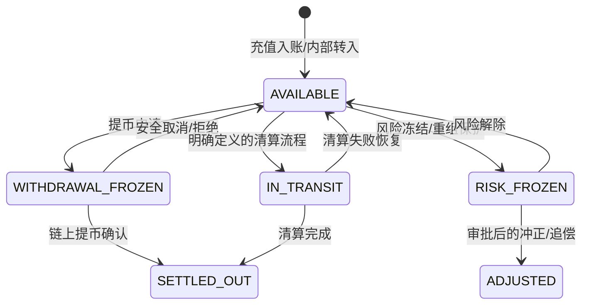
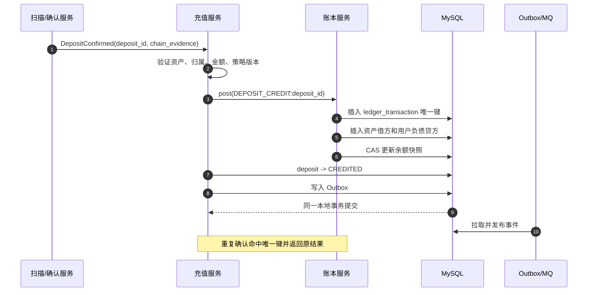
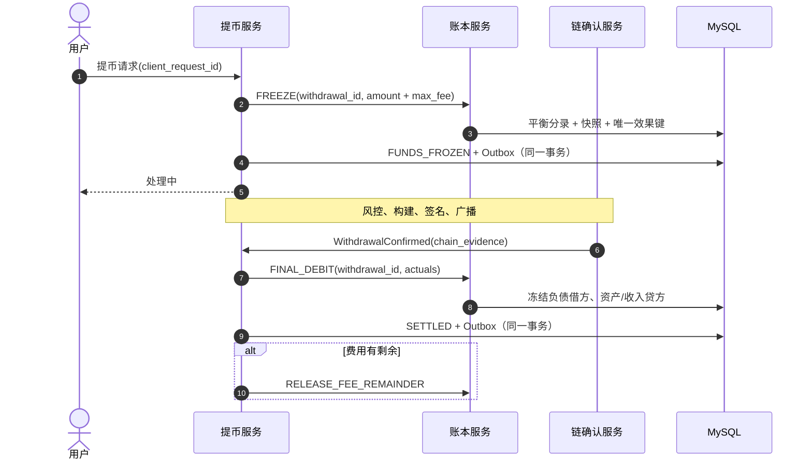
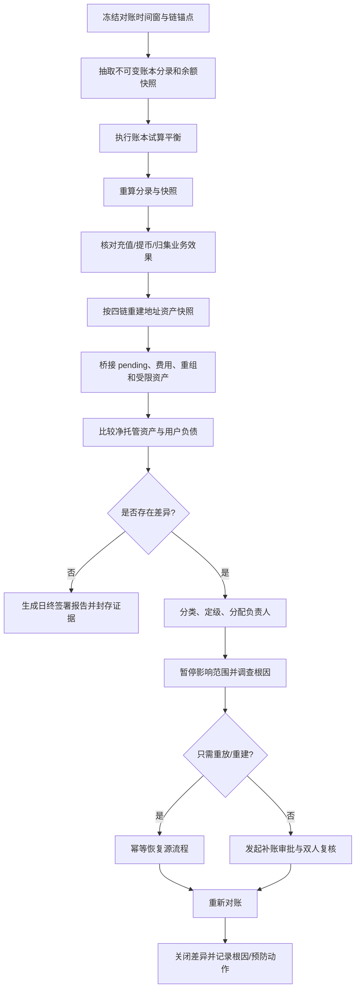

# Day 19：内部账本、余额与对账

> 学习目标：划清链上记录、钱包业务记录和用户资产账本的边界；掌握可用、冻结、在途等余额维度、双重记账、不可变流水与余额快照；使用最小单位整数和资产精度配置避免金额错误；能够设计链上资产、钱包地址余额、冷热钱包与内部负债的每日对账、差异分类、补账审批和审计流程。  
> 建议用时：5～6 小时  
> 完成标准：画出充值和提币账务分录，设计账户、余额、流水、分录和对账差异表，写出每日对账流程与差异处理规则，并闭卷回答文末恰好 7 道面试题。

## 安全边界与核心结论

- 所有练习只使用测试数据、最小单位整数和确定性夹具，不导入生产余额、地址映射或凭据。
- 链上记录回答“区块链发生了什么”，钱包业务记录回答“平台如何处理这件事”，内部账本回答“平台对谁拥有多少资产或负债”。三者必须关联但不能合并成一张表。
- 用户看到的余额是平台负债，不是某个链上地址余额。充值地址、热钱包和冷钱包是平台资产位置，不能按用户直接一一对应。
- 双重记账要求每笔账务事务借贷平衡；这里的“借/贷”是账户方向，不等同于数据库表的增减符号。
- 已过账分录不可修改或删除。业务错误通过引用原交易的冲正或调整交易修复，不能执行 `UPDATE balance = ...` 掩盖历史。
- 余额快照是分录聚合后的性能优化，必须可从分录重建，并通过版本、事务和定期校验防止漂移。
- 金额在持久化、计算、消息和接口边界都使用资产最小单位整数。不得使用 `double`，不得依赖隐式舍入或前端小数精度。
- 充值入账、提币冻结、最终扣减、解冻和手续费必须各有稳定业务幂等键，并与业务状态和 Outbox 在明确事务边界内提交。
- Redis 只用于缓存、限流和读加速；MySQL 中不可变分录、唯一约束和可重建快照才是余额最终依据。
- 对账发现差异时先隔离影响、保存证据和查根因。补账必须审批、职责分离、限额和审计，且不能替代源系统修复。

账本不变量：

```text
I1. 每个 ledger_transaction 内，同一资产的借方总额等于贷方总额。
I2. 每条 entry 的 amount_atomic 必须为正整数，方向由借贷和账户类型决定。
I3. 已过账 transaction 和 entry 不可修改、删除或重复过账。
I4. 同一业务事件与 effect_type 最多产生一次账务效果。
I5. 余额快照必须等于截至快照版本的有效分录聚合。
I6. 充值、提币、归集和手续费记录可双向追溯到账务与链上证据。
I7. 用户总负债变化必须由业务账务交易解释；内部地址调拨不改变用户总负债。
I8. 链上资产变化必须由充值、提币、归集、费用或已审批差异解释。
I9. 任何补账都引用差异、原业务和审批记录，且仍满足借贷平衡。
I10. Redis、报表、搜索索引和节点余额都不能单独覆盖账本真相。
```

---

## 一、三层事实与两类余额

### 1. 链上事实层

记录原始且可验证的外部事实：

```text
chain / network
block, slot, LT or other anchor
transaction / signature / message identity
source and destination
asset contract / Mint / Master
amount in atomic unit
fee and execution result
confirmation/finality
raw evidence reference
parser version
```

节点返回可能重复、延迟、重组或彼此冲突，因此链上事实不能直接执行 `user_balance += amount`。

### 2. 钱包业务层

记录平台流程和状态：

```text
deposit_id / withdrawal_id / funding_operation_id
user/account/asset mapping
business amount and fee policy
risk and confirmation policy snapshot
status and status history
chain attempt lineage
ledger_transaction_id
manual review case
```

业务状态允许从待确认推进到确认、失败、人工处理等状态，但状态变化不天然等于账务变化。

### 3. 内部账本层

记录平台经济权益：

```text
ledger_transaction
ledger_entry
account and account type
asset_id
debit / credit
amount_atomic
business reference and idempotency key
reversal relation
posting version and audit metadata
```

账本是用户余额和平台内部资金科目的最终依据，不负责判断区块链最终性，也不负责构建或广播交易。

### 4. 资产与负债

```text
平台链上地址控制的币：平台资产
平台欠用户可提取的币：平台负债
平台收取的手续费：收入或费用抵减
平台支付的网络费：费用
待查明差异：清算/悬挂账户，不是凭空利润
```

核心偿付关系可简化为：

$$
Coverage = CustodiedAssets - UserLiabilities - RestrictedReserves
$$

`Coverage < 0` 表示资产不足或数据差异，必须立即调查；`Coverage > 0` 也不能直接视为利润，可能是漏记负债、未识别充值或精度错误。

### 5. 链上余额与账本余额不能混用

| 维度 | 链上余额 | 内部账本余额 |
|---|---|---|
| 来源 | 区块链状态与节点 | 已过账账务分录 |
| 主体 | 地址、UTXO、Account、Token Account、Wallet | 用户、平台资产、费用、清算账户 |
| 最终性 | 受确认、重组和链模型影响 | 受数据库事务与冲正控制 |
| 更新方式 | 链上交易 | 平衡账务交易 |
| 主要用途 | 证明资产位置与可花费性 | 证明平台权益和用户余额 |
| 可否直接相等 | 通常不能 | 需通过聚合、在途和费用桥接 |

---

## 二、账户科目与余额维度

### 1. 最小科目结构

```text
ASSET:CUSTODY:ONCHAIN:<wallet_pool>      平台链上托管资产
ASSET:SETTLEMENT:INBOUND                 已观察/确认但尚未完成归属的资产
ASSET:SETTLEMENT:OUTBOUND                已扣账但链上流程尚未最终收敛
LIABILITY:USER:AVAILABLE:<user>          用户可用负债
LIABILITY:USER:WITHDRAWAL_FROZEN:<user>  提币冻结负债
LIABILITY:USER:RISK_FROZEN:<user>        风控冻结负债
LIABILITY:USER:IN_TRANSIT:<user>          需要展示的业务在途负债
EXPENSE:NETWORK_FEE                       网络费用
REVENUE:WITHDRAWAL_FEE                    用户提币手续费收入
EQUITY/CONTROL:RECON_SUSPENSE              对账悬挂控制科目
```

具体会计科目应与财务制度一致。本教程重点是资金系统子账：账户类型稳定、分录平衡、业务可追溯。

### 2. 可用、冻结、在途

| 余额 | 含义 | 可以提币/交易 | 典型来源 |
|---|---|---:|---|
| `AVAILABLE` | 用户可立即使用的负债 | 是 | 已入账充值、解冻、内部转入 |
| `WITHDRAWAL_FROZEN` | 已为提币占用 | 否 | 提币申请冻结 |
| `RISK_FROZEN` | 因合规、重组或风险限制 | 否 | 风控冻结、充值冲正保护 |
| `IN_TRANSIT` | 业务已发生但尚未最终收敛的展示维度 | 通常否 | 某些跨系统转账或清算 |
| `TOTAL_USER` | 各用户负债子账户之和 | 不直接操作 | 报表与对账聚合 |

推荐总负债关系：

$$
UserTotal = Available + WithdrawalFrozen + RiskFrozen + InTransit
$$

冻结通常是用户负债子科目之间的转移，不应使用户总负债凭空减少。

### 3. 在途余额的边界

“在途”容易变成垃圾桶。只有业务确实需要向用户展示或隔离清算阶段时才设置，并明确：

- 谁创建、何时转入；
- 什么证据允许转出；
- 最大停留时间；
- 是否计入用户可用和平台总负债；
- 对账时如何与链上 pending、业务状态关联。

仅为了让报表对平而把未知差异放入在途，是错误做法。

### 4. 余额状态转换



图表示业务余额维度，不是通过更新一个 `status` 字段完成。每条箭头都必须对应一笔平衡账务交易。

---

## 三、双重记账基础

### 1. 借贷规则

常见方向：

| 账户类型 | 增加 | 减少 |
|---|---|---|
| 资产 Asset | 借记 Debit | 贷记 Credit |
| 负债 Liability | 贷记 Credit | 借记 Debit |
| 收入 Revenue | 贷记 Credit | 借记 Debit |
| 费用 Expense | 借记 Debit | 贷记 Credit |

每笔账务交易满足：

$$
\sum Debit_{asset} = \sum Credit_{asset}
$$

不同资产不能直接互相平衡。BTC 借方不能与 ETH 贷方相抵；兑换需要使用各资产独立平衡的清算科目和明确价格/成交记录。

### 2. 为什么双重记账更安全

- 每个变化都说明“从哪里来、到哪里去”；
- 单边加余额会因借贷不平而被拒绝；
- 可分别统计资产、负债、收入和费用；
- 冲正保留原交易和修复链路；
- 可从业务、账户、分录、链上证据多个方向审计；
- 日终试算平衡能快速发现结构性错误。

双重记账不能自动证明链上事实正确，但能阻止和暴露大量内部资金错误。

### 3. 账务事务与业务事件

```text
Business event
  -> validate effect and idempotency
  -> create ledger_transaction
  -> create 2..N ledger_entries
  -> update balance snapshots with version checks
  -> update business state
  -> append Outbox event
  -> commit one local database transaction
```

账务事务 `ledger_transaction` 是一个原子经济事件，分录 `ledger_entry` 是该事件对各账户的影响。不要把每条分录当成独立可提交操作。

---

## 四、充值账务分录

### 1. 充值确认并入账

假设用户充值 1 BTC，链上托管资产已经达到确认策略：

```text
Dr  ASSET:CUSTODY:ONCHAIN:BTC_HOT       1 BTC
Cr  LIABILITY:USER:AVAILABLE:U100       1 BTC
```

经济含义：平台控制资产增加，同时欠用户的可用负债增加。

### 2. 充值先确认、后归属

若链上资产已确认，但因 Memo 或用户归属待处理：

```text
首次识别平台资产：
Dr  ASSET:CUSTODY:ONCHAIN               1,000 USDT
Cr  LIABILITY/CONTROL:UNALLOCATED       1,000 USDT

人工确认归属后：
Dr  LIABILITY/CONTROL:UNALLOCATED       1,000 USDT
Cr  LIABILITY:USER:AVAILABLE            1,000 USDT
```

是否在钱包子账确认链上资产取决于组织会计边界，但不能在归属未知时直接猜用户，也不能让差异永远悬挂。

### 3. 充值手续费或净额入账

若产品规则对 100 USDT 充值收取 1 USDT 服务费：

```text
Dr  ASSET:CUSTODY:ONCHAIN               100 USDT
Cr  LIABILITY:USER:AVAILABLE             99 USDT
Cr  REVENUE:DEPOSIT_FEE                    1 USDT
```

必须由明确产品规则、用户协议和精度策略支持，不能把链上网络费臆测为用户充值扣费。

### 4. 已入账充值被重组移除

不删除原入账。先冻结风险敞口：

```text
Dr  LIABILITY:USER:AVAILABLE             1 BTC
Cr  LIABILITY:USER:RISK_FROZEN           1 BTC
```

确认链上资产确实消失并经审批后，创建引用原充值交易的冲正：

```text
Dr  LIABILITY:USER:RISK_FROZEN           1 BTC
Cr  ASSET:CUSTODY:ONCHAIN                1 BTC
```

若用户可用不足，则冻结剩余资产并形成负余额/应收路径，不能让数据库余额变成无解释数值。

### 5. 充值入账时序



---

## 五、提币账务分录

### 1. 申请时冻结

用户申请提币 2 ETH，最大用户费用 0.01 ETH：

```text
Dr  LIABILITY:USER:AVAILABLE             2.01 ETH
Cr  LIABILITY:USER:WITHDRAWAL_FROZEN     2.01 ETH
```

这是负债内部转移，用户总负债不变，但不能再次消费该金额。

### 2. 确认后最终扣减

假设用户实际收到 2 ETH，平台向用户收取 0.01 ETH 提币费：

```text
Dr  LIABILITY:USER:WITHDRAWAL_FROZEN     2.01 ETH
Cr  ASSET:CUSTODY:ONCHAIN                2.00 ETH
Cr  REVENUE:WITHDRAWAL_FEE               0.01 ETH
```

如果平台实际链上网络费是 0.006 ETH，还应记录平台费用：

```text
Dr  EXPENSE:NETWORK_FEE                  0.006 ETH
Cr  ASSET:CUSTODY:ONCHAIN               0.006 ETH
```

用户收费和实际网络费是不同概念，不应强行相等。

### 3. 安全取消和解冻

只有证明所有签名候选都未付款且不可能再付款时：

```text
Dr  LIABILITY:USER:WITHDRAWAL_FROZEN     2.01 ETH
Cr  LIABILITY:USER:AVAILABLE             2.01 ETH
```

广播未知、交易卡住或 TON 内部消息仍在传播时不能执行该分录。

### 4. 费用差额释放

若预冻结 0.01 ETH 费用，最终只向用户收取 0.008 ETH：

```text
最终扣减：
Dr  LIABILITY:USER:WITHDRAWAL_FROZEN     2.008 ETH
Cr  ASSET:CUSTODY:ONCHAIN                2.000 ETH
Cr  REVENUE:WITHDRAWAL_FEE               0.008 ETH

释放差额：
Dr  LIABILITY:USER:WITHDRAWAL_FROZEN     0.002 ETH
Cr  LIABILITY:USER:AVAILABLE             0.002 ETH
```

两笔效果分别幂等，最终冻结余额必须归零。

### 5. 提币账务时序



### 6. 链上成功但内部少扣款

对账发现链上已支付 2 ETH，但内部仍只有冻结：

1. 暂停该发送钱包的新资金动作；
2. 用 signed payload、交易 lineage 和目标效果确认业务；
3. 查找 `WITHDRAWAL_FINAL_DEBIT:<withdrawal_id>`；
4. 若不存在，重放正式结算接口；
5. 事务创建一次最终扣减并更新业务状态；
6. 若已存在但快照错误，从分录重建快照，不重复过账；
7. 完成链、业务、账本三方复核。

---

## 六、归集、冷热调拨与手续费

### 1. 内部链上调拨

充值地址归集到热钱包、热转冷和冷转热只改变资产位置：

```text
Dr  ASSET:CUSTODY:ONCHAIN:COLD           10 BTC
Cr  ASSET:CUSTODY:ONCHAIN:HOT            10 BTC
```

若账本只按链/资产维护一个总托管资产科目，可在资金位置子账记录地址变化，而总账不产生资产内部分录。无论采用哪种模型，用户总负债都不应变化。

### 2. 网络费用

```text
Dr  EXPENSE:NETWORK_FEE                   0.001 BTC
Cr  ASSET:CUSTODY:ONCHAIN:HOT             0.001 BTC
```

BTC 费用是输入减输出；EVM 看 Receipt 实际 Gas；Solana 看交易元数据；TON 要汇总相关消息费用。费用不能只使用广播前估算值。

### 3. Gas 补充

Gas 钱包向 Token 充值地址补 ETH 是资产位置转移：

```text
Dr  ASSET:CUSTODY:ONCHAIN:DEPOSIT_ADDR    0.003 ETH
Cr  ASSET:CUSTODY:ONCHAIN:GAS_WALLET      0.003 ETH
```

该补充的链上费用另记费用科目。后续 Token 归集失败也不能把补充 ETH 当作用户负债变化。

---

## 七、金额、精度与舍入

### 1. 为什么不能使用 `double`

IEEE 754 二进制浮点无法精确表示许多十进制小数。例如 $0.1 + 0.2$ 不一定精确等于 $0.3$。在高并发聚合、比较阈值和序列化时，微小误差会累积为对账差异。

资金系统使用：

```text
数据库：DECIMAL(65, 0) 或足够宽的整数最小单位
Java：BigInteger 表示链上原子数量；BigDecimal 只用于有明确 scale 的展示/计价
消息：十进制整数字符串 + asset_id，不传 JSON number 浮点
前端：字符串格式化，不回传展示值作为记账值
```

### 2. 原子单位转换

若资产精度为 $d$：

$$
Atomic = Human \times 10^d
$$

转入最小单位时必须验证小数位不超过配置，不得静默截断。转回展示值：

$$
Human = \frac{Atomic}{10^d}
$$

展示末尾零可以省略，但底层整数不变。

### 3. 资产精度配置

```text
asset_id
chain / network
contract / Mint / Master identity
symbol（仅展示）
chain_decimals
ledger_decimals
display_decimals
rounding_mode
minimum_deposit / withdrawal
effective_from / config_version
```

不能以 symbol 作为资产身份，也不能在 Token 合约升级或错误配置时静默改历史精度。历史业务保存使用的资产配置版本。

### 4. 舍入原则

- 链上原子数量不舍入；
- 用户扣款不能使用有利于平台的隐式舍入；
- 法币估值和费用报价必须指定 scale 与 `RoundingMode`；
- 汇率换算产生的余数进入明确的舍入差额科目；
- 批量费用分摊后，各子项之和必须精确等于总费用；
- 任何 `setScale` 都应在代码审查中说明业务理由。

### 5. Java 示例

```java
record AssetAmount(long assetId, BigInteger atomic) {
    AssetAmount {
        if (atomic.signum() < 0) {
            throw new IllegalArgumentException("amount must be non-negative");
        }
    }
}

static BigInteger toAtomic(BigDecimal human, int decimals) {
    return human.movePointRight(decimals).toBigIntegerExact();
}

static BigDecimal toHuman(BigInteger atomic, int decimals) {
    return new BigDecimal(atomic, decimals);
}
```

金额对象应同时绑定 `assetId`，防止把相同整数的 BTC 与 ETH 相加。

---

## 八、不可变流水与余额快照

### 1. 两层写模型

```text
ledger_transaction：业务账务事务头，定义原因、幂等和状态
ledger_entry：不可变分录，定义账户借贷变化
account_balance：按账户/资产维护的当前快照
```

分录是真相，快照用于低延迟查询。快照不能脱离分录单独写入。

### 2. 快照更新

在同一数据库事务中：

```sql
UPDATE account_balance
SET debit_atomic = debit_atomic + :debit,
    credit_atomic = credit_atomic + :credit,
    balance_atomic = :new_balance,
    version = version + 1,
    last_entry_id = :entry_id
WHERE account_id = :account_id
  AND asset_id = :asset_id
  AND version = :expected_version;
```

并发冲突时重读后重算，不能覆盖其他事务。账户锁顺序应稳定，例如按 `account_id` 排序，降低死锁。

### 3. 快照重建

```text
1. 固定重建截止 entry_id 或 posting sequence。
2. 从可信期初快照开始聚合后续分录。
3. 按账户类型应用借贷方向。
4. 与在线快照比较，不立即覆盖。
5. 输出差异并确认无迟到事务。
6. 审批后切换或修复快照。
7. 记录重建范围、版本、校验和与操作者。
```

### 4. 不可修改不是永不修复

错误分录通过冲正：

```text
original ledger_transaction T100
reversal ledger_transaction T101, reversal_of=T100
corrected ledger_transaction T102, correction_of=T100
```

T100 保留；T101 的借贷方向与原交易相反；T102 使用正确业务参数。三者均有独立幂等键、审批和审计。

---

## 九、核心表设计

### 1. 账户表

```sql
CREATE TABLE ledger_account (
    id BIGINT PRIMARY KEY,
    account_no VARCHAR(96) NOT NULL,
    owner_type VARCHAR(32) NOT NULL,
    owner_id VARCHAR(64) NOT NULL,
    account_type VARCHAR(32) NOT NULL,
    balance_category VARCHAR(32) NOT NULL,
    status VARCHAR(16) NOT NULL,
    created_at TIMESTAMP NOT NULL,
    UNIQUE KEY uk_account_no (account_no),
    UNIQUE KEY uk_owner_account
      (owner_type, owner_id, account_type, balance_category)
);
```

### 2. 账务事务表

```sql
CREATE TABLE ledger_transaction (
    id BIGINT PRIMARY KEY,
    transaction_no VARCHAR(64) NOT NULL,
    idempotency_key VARCHAR(160) NOT NULL,
    transaction_type VARCHAR(48) NOT NULL,
    reference_type VARCHAR(32) NOT NULL,
    reference_id VARCHAR(64) NOT NULL,
    effect_type VARCHAR(48) NOT NULL,
    status VARCHAR(16) NOT NULL,
    reversal_of BIGINT NULL,
    config_version VARCHAR(64) NOT NULL,
    created_at TIMESTAMP NOT NULL,
    posted_at TIMESTAMP NULL,
    UNIQUE KEY uk_transaction_no (transaction_no),
    UNIQUE KEY uk_idempotency (idempotency_key),
    UNIQUE KEY uk_business_effect
      (reference_type, reference_id, effect_type)
);
```

### 3. 分录表

```sql
CREATE TABLE ledger_entry (
    id BIGINT PRIMARY KEY,
    ledger_transaction_id BIGINT NOT NULL,
    line_no INT NOT NULL,
    account_id BIGINT NOT NULL,
    asset_id BIGINT NOT NULL,
    direction VARCHAR(8) NOT NULL,
    amount_atomic DECIMAL(65, 0) NOT NULL,
    created_at TIMESTAMP NOT NULL,
    UNIQUE KEY uk_transaction_line (ledger_transaction_id, line_no),
    KEY idx_account_asset_entry (account_id, asset_id, id),
    CONSTRAINT chk_positive_amount CHECK (amount_atomic > 0)
);
```

数据库 Check 约束不能单独验证跨行借贷平衡；账本服务应在事务提交前聚合校验，并禁止其他服务直写表。

### 4. 余额快照表

```sql
CREATE TABLE account_balance (
    account_id BIGINT NOT NULL,
    asset_id BIGINT NOT NULL,
    balance_atomic DECIMAL(65, 0) NOT NULL,
    debit_atomic DECIMAL(65, 0) NOT NULL,
    credit_atomic DECIMAL(65, 0) NOT NULL,
    version BIGINT NOT NULL,
    last_entry_id BIGINT NOT NULL,
    updated_at TIMESTAMP NOT NULL,
    PRIMARY KEY (account_id, asset_id)
);
```

### 5. 账户流水视图

用户流水不是第二套资金真相，而是交易、分录和业务摘要的只读投影：

```text
transaction_no
business type and reference
occurred_at / posted_at
available_before / change / after
frozen_before / change / after
asset and display amount
business status link
```

若流水投影重建，不应再次过账。

### 6. 对账差异表

```sql
CREATE TABLE reconciliation_difference (
    id BIGINT PRIMARY KEY,
    reconciliation_run_id BIGINT NOT NULL,
    difference_no VARCHAR(64) NOT NULL,
    scope_type VARCHAR(32) NOT NULL,
    scope_identity VARCHAR(256) NOT NULL,
    asset_id BIGINT NOT NULL,
    difference_type VARCHAR(48) NOT NULL,
    expected_atomic DECIMAL(65, 0) NOT NULL,
    actual_atomic DECIMAL(65, 0) NOT NULL,
    delta_atomic DECIMAL(65, 0) NOT NULL,
    status VARCHAR(24) NOT NULL,
    severity VARCHAR(16) NOT NULL,
    evidence_ref VARCHAR(256) NOT NULL,
    root_cause_code VARCHAR(64) NULL,
    resolution_ref VARCHAR(128) NULL,
    owner VARCHAR(64) NULL,
    detected_at TIMESTAMP NOT NULL,
    resolved_at TIMESTAMP NULL,
    UNIQUE KEY uk_difference_no (difference_no),
    UNIQUE KEY uk_run_scope_type
      (reconciliation_run_id, scope_type, scope_identity, asset_id, difference_type)
);
```

---

## 十、五层对账体系

### 1. 层一：账本试算平衡

检查每笔交易、每个资产：

```text
sum(debit) == sum(credit)
transaction status == POSTED
entry count >= 2
amount > 0
business effect unique
reversal relation valid
```

任何不平衡分录都是 P0/P1 级内部完整性问题。

### 2. 层二：分录与余额快照

```text
recomputed balance from entries == account_balance.balance
last_entry_id continuous within defined sequence
debit/credit cumulative totals match
no snapshot without account
no entry after snapshot boundary omitted
```

### 3. 层三：业务与账本

| 业务状态 | 预期账务效果 |
|---|---|
| 充值 `CREDITED` | 恰好一次 `DEPOSIT_CREDIT` |
| 提币 `FUNDS_FROZEN` | 恰好一次 `WITHDRAWAL_FREEZE` |
| 提币 `SETTLED` | 冻结 + 最终扣减，冻结余量已释放 |
| 提币 `CANCELLED` | 冻结 + 解冻，无最终扣减 |
| 归集/冷热调拨确认 | 只影响资产位置与费用，不改变用户负债 |
| 重组补偿完成 | 原入账保留，存在一次冲正/调整关系 |

### 4. 层四：地址资产与链上

按链建立可信快照：

- BTC：规范链上的可控 UTXO 集合，排除已花费并处理 pending；
- EVM：指定区块高度的原生余额与白名单 Token `balanceOf`；
- Solana：指定 Commitment 下的 SOL 与 Token Account 余额；
- TON：账户余额、Jetton Wallet 身份与异步消息在途影响。

地址索引余额必须与节点/独立扫描重算结果一致。单节点结果不应成为大额差异的唯一证据。

### 5. 层五：资产与负债偿付对账

```text
Custodied on-chain assets
+ confirmed receivable / recoverable（按严格规则）
- pending outbound and known network fees
- restricted or inaccessible assets
------------------------------------------
= net available custody assets

compare with:

user available
+ user withdrawal frozen
+ user risk frozen
+ user in transit
+ other customer liabilities
```

不能把“链上总余额大于用户负债”简单视为无风险，还要扣除未知广播、受限资产、错误 Token、费用和无法签名的钱包。

---

## 十一、每日对账流程



### 1. 固定切点

日终不是简单取“当前值”。必须固定：

```text
ledger posting sequence / cutoff time
BTC block height + hash
EVM block number + hash/finality tag
Solana slot + blockhash + Commitment
TON masterchain anchor / account transaction boundary
asset config version
address ownership version
price snapshot（只用于估值，不改变原子数量）
```

没有共同切点，链上和内部系统持续变化会产生伪差异。

### 2. 日终步骤

1. 创建唯一 `reconciliation_run_id`，记录范围与版本；
2. 检查上一日未关闭差异和系统暂停状态；
3. 固定账本序列与各链可信锚点；
4. 执行试算平衡和快照重算；
5. 核对充值、提币、归集、Gas 补充和费用业务；
6. 重建地址、钱包池、冷热层的链上资产；
7. 桥接 pending、unknown、重组和跨日交易；
8. 按资产比较托管资产与用户负债；
9. 生成差异、定级、告警和责任人；
10. 修复后使用同一 run 的新 revision 复核；
11. 财务/运营/技术按权限签署报告；
12. 封存输入校验和、查询版本和审计记录。

### 3. 盘中与日终

日终不是唯一防线。生产应同时有：

- 实时业务-账本一致性告警；
- 分钟级热钱包和未知广播监控；
- 小时级地址资产差异；
- 日终完整轧账；
- 周期性全量 UTXO/Token/Jetton 重建；
- 定期储备与负债证明或独立审计。

---

## 十二、差异分类与处理规则

### 1. 差异矩阵

| 差异类型 | 示例 | 风险 | 首要动作 | 正确恢复 |
|---|---|---|---|---|
| 账本不平 | 单笔借方不等于贷方 | 极高 | 停止过账，隔离版本 | 修复代码；冲正/正确重过账 |
| 快照漂移 | 分录聚合 10，快照 9 | 高 | 切换只读或降级查询 | 从分录重建快照，不补账 |
| 重复入账 | 一笔充值两个 credit | 极高 | 冻结影响账户 | 识别重复效果并审批冲正 |
| 漏入账 | 链上充值确认但无账本交易 | 高 | 核验归属和最终性 | 重放正式幂等入账流程 |
| 提币少扣 | 链上成功但冻结未结算 | 极高 | 暂停源钱包 | 重放最终扣减，不重发交易 |
| 提币多扣 | 链上只付一次但扣两次 | 极高 | 限制相关服务 | 冲正重复扣减并修复幂等 |
| 长期冻结 | 业务终态但冻结未归零 | 中/高 | 查 unknown/lineage | 安全证明后解冻或结算 |
| 地址漏管 | 平台地址有资产但未纳入索引 | 高 | 锁定地址配置变更 | 恢复归属映射并补资产位置记录 |
| 链上资产短缺 | 净资产小于用户负债 | 极高 | 暂停相关提币 | 查私钥、漏扫、费用、盗损；升级事故 |
| 链上资产盈余 | 资产大于已知负债 | 中/高 | 不得认作收入 | 查未识别充值、错误资产和切点 |
| 手续费差异 | 估算费与实际费不符 | 中 | 查 Receipt/交易元数据 | 记录实际费用并修复估算/分摊 |
| 精度差异 | decimals 配错 6/18 | 极高 | 暂停资产充提 | 恢复配置版本，逐笔重算并审批调整 |
| 重组差异 | 已入账链事实消失 | 极高 | 冻结风险敞口 | 按重组冲正流程处理 |
| 非法 Token | 同名假币计入资产 | 极高 | 隔离资产和地址 | 按 contract/Mint/Master 纠正，不补用户真币 |
| 切点差异 | 链和账本取数时间不同 | 低/中 | 重新对齐锚点 | 重跑，不做资金补账 |
| 在途超时 | pending 长期未收敛 | 高 | 查广播和资源 | 沿原 lineage 恢复，禁止盲重发 |

### 2. 差异定级

| 等级 | 条件 | 响应 |
|---|---|---|
| P0 | 可能持续重复过账、资产被盗、全局账本不平 | 立即停止相关资金写入，事故指挥 |
| P1 | 单资产偿付缺口、大额少扣/多扣、精度错误 | 分钟级响应，暂停相关资产充提 |
| P2 | 可控快照漂移、长时间冻结、费用异常 | 当班处理，限制影响范围 |
| P3 | 报表延迟、切点伪差异、低额已解释问题 | 工单跟踪，不做无必要资金动作 |

金额阈值不能是唯一标准。即使差额很小，若根因是可无限复制的幂等漏洞，也应按最高风险处理。

### 3. 处理顺序

```text
发现 -> 固化证据 -> 确定影响范围 -> 止损
-> 复现与根因 -> 判断重放/重建/冲正/补账
-> 审批执行 -> 独立复核 -> 重跑对账
-> 关闭差异 -> 修复控制 -> 复盘
```

不要先补到数字相等再调查，否则会掩盖仍在持续发生的错误。

---

## 十三、补账审批与审计

### 1. 补账的定义

补账是源业务无法通过正常幂等恢复、且证据证明需要新增经济调整时，创建的受控账务交易。以下通常不需要补账：

- MQ 消息丢失：重放 Outbox；
- 余额快照漂移：从分录重建；
- 链上成功、内部事务未提交：重放原结算；
- 报表索引延迟：重建投影；
- 切点不一致：对齐后重跑。

### 2. 审批材料

```text
adjustment_request_id
linked_difference_no
original business and ledger references
chain evidence and cutoff
root cause
affected users/accounts/assets
proposed debit/credit entries
amount and valuation
reversal/rollback plan
requester / reviewer / approver
attachments hash
expiration and execution window
```

### 3. 职责分离

- 调查人提出方案，但不能独自执行；
- 审批人核对业务、金额和分录方向；
- 高额或敏感资产需财务、安全、合规多方批准；
- 执行由受控账本接口完成，禁止 DBA 手工改余额；
- 对账人员独立验证结果；
- 审计记录不能由申请人删除。

### 4. 补账分录示例

确认用户应获得但正常业务无法恢复的 100 USDT：

```text
Dr  EQUITY/CONTROL:APPROVED_ADJUSTMENT   100 USDT
Cr  LIABILITY:USER:AVAILABLE             100 USDT
```

控制科目最终由财务根据真实资产来源重分类。不能为了平衡随便使用“系统账户”，每个悬挂余额都有负责人和关闭期限。

### 5. 审计日志不应包含什么

应记录 ID、金额、资产、分录、策略版本、审批人、证据哈希和时间；不应记录私钥、助记词、完整签名密钥材料、敏感认证令牌或无必要的个人信息。

---

## 十四、Redis、MQ 与数据库边界

### 1. Redis 可以做什么

- 缓存用户余额用于读接口；
- 维护短期限流和热点保护；
- 缓存资产配置与只读报表；
- 协助任务调度和租约；
- 保存可丢失、可重建的聚合值。

### 2. Redis 不能做什么

- 作为余额唯一持久化来源；
- 用分布式锁替代账本唯一约束；
- 用 TTL 幂等键决定资金能否再次过账；
- Redis 与 MySQL 双写但无恢复协议；
- 缓存丢失后从用户请求猜余额。

正确读路径：优先读缓存，缓存未命中或版本落后时从 MySQL 快照加载；高风险操作必须在数据库事务内读取并校验权威余额。

### 3. MQ 边界

MQ 至少一次投递意味着消费者必须按业务效果幂等。账本提交与业务状态/Outbox 在一个本地事务，Outbox 异步发布；消费者按 event ID 去重，但最终资金防线仍是账本唯一键。

---

## 十五、监控、告警与 SLO

### 1. 账本完整性指标

```text
ledger_unbalanced_transaction_total
ledger_posting_failure_total{type}
ledger_idempotency_conflict_total{effect_type}
ledger_snapshot_drift_atomic{asset}
ledger_rebuild_lag_entries
ledger_reversal_total{reason}
```

### 2. 业务一致性指标

```text
confirmed_deposit_without_credit_count
settled_withdrawal_without_debit_count
cancelled_withdrawal_with_frozen_balance_count
chain_success_internal_pending_count
business_ledger_amount_mismatch_count{type,asset}
long_frozen_balance_count{reason}
```

### 3. 偿付与对账指标

```text
custody_asset_atomic{chain,asset,wallet_tier}
user_liability_atomic{asset,balance_category}
coverage_delta_atomic{asset}
reconciliation_open_difference_count{type,severity}
reconciliation_oldest_difference_seconds
unallocated_asset_atomic{asset}
restricted_asset_atomic{asset}
```

### 4. 告警原则

| 告警 | 级别 | 首要动作 |
|---|---|---|
| 任一账务事务不平 | P0 | 停止账本写入，保全日志 |
| 同一业务出现重复效果 | P0/P1 | 暂停对应消费者与业务入口 |
| 资产小于负债且无法解释 | P0/P1 | 暂停相关提币，启动事故响应 |
| 精度配置变化导致差异 | P1 | 暂停该资产充提，冻结配置发布 |
| 快照与分录漂移 | P1/P2 | 高风险操作改读重算结果，执行重建 |
| 链成功未结算超 SLO | P1 | 重放幂等结算并查 Outbox/DB |
| 对账差异长期未关闭 | P2 | 升级负责人和审批链 |

---

## 十六、故障演练与 Runbook

### 演练 A：数据库提交后响应丢失

1. 充值账务事务成功提交；
2. 在服务返回前断开连接；
3. 上游重投同一 `DEPOSIT_CREDIT:<deposit_id>`；
4. 唯一键返回原 transaction；
5. 验证只有两条原始平衡分录和一次用户余额增加；
6. Outbox 可重复发布，下游仍幂等。

### 演练 B：余额快照少更新

1. 用夹具制造分录总额 100、快照 99 的差异；
2. 实时校验触发 snapshot drift 告警；
3. 验证系统不创建补账分录；
4. 固定 entry cutoff，从分录重建新快照；
5. 独立比较后切换；
6. 修复导致快照遗漏的事务或代码路径。

### 演练 C：链上成功、内部少扣款

1. 提币已在链上确认；
2. 在最终扣减事务前注入失败；
3. 对账发现 chain success/internal pending；
4. 核验完整 chain attempt lineage 与用户收款效果；
5. 重放 `WITHDRAWAL_FINAL_DEBIT:<withdrawal_id>`；
6. 验证冻结转扣减一次、业务转 `SETTLED`；
7. 再次重放无额外资金效果。

### 演练 D：资产精度从 6 错配为 18

1. 立即暂停该资产充值、提币和归集；
2. 冻结配置版本并确定生效时间窗；
3. 按合约身份和历史配置逐笔重算；
4. 区分只影响展示、业务金额还是已过账分录；
5. 对需要经济修复的账户生成差异和审批调整；
6. 独立复核总资产与总负债；
7. 增加配置双人审批、链上 decimals 校验和金丝雀验证。

### Runbook：资产负债不一致

```text
1. 确认资产身份、网络、单位和共同切点。
2. 固定账本 posting sequence 与链锚点。
3. 执行账本试算平衡和快照重算。
4. 按充值、提币、归集、费用聚合业务桥接项。
5. 重建四链地址资产，交叉验证关键节点结果。
6. 排除 pending、unknown、重组、受限资产与未识别充值。
7. 按差异类型和根因缩小到业务/地址/账户。
8. 先重放或重建，确有经济差额才发起补账。
9. 修复后重新运行全层对账并独立签署。
10. 恢复服务前证明差异为零或有批准的明确解释。
```

---

## 十七、口头面试题参考答案

> 本节严格包含计划中的 7 道题。先闭卷口述，再按“结论 → 原理 → 生产实现 → 异常与风险 → 监控和恢复”补全。

### 1. 钱包系统为什么需要独立账本？

**参考回答：**

链上记录只能证明地址、交易和资产效果，不能直接表达交易所欠哪个用户多少钱；充值和提币业务表又主要表达流程状态。独立账本用账户、平衡分录和不可变交易记录平台资产、用户负债、冻结、费用与收入，是用户余额和财务审计的权威依据。

生产上每个业务效果有唯一幂等键，分录借贷平衡，余额快照可从分录重建，业务状态与账本通过本地事务和 Outbox 收敛。重组或错误不删除历史，而是冲正。再通过链、业务、账本三方对账发现少记、重复和资产缺口。

### 2. 可用余额、冻结余额和链上余额有何区别？

**参考回答：**

可用余额是平台允许用户立即交易或提币的负债；冻结余额仍属于用户总负债，但因提币、风控或重组风险暂不可使用；链上余额是某地址、UTXO 或 Token Account 上的平台资产位置。三者主体和更新机制不同，不能直接等同。

提币申请通常把用户负债从可用转到提币冻结，链上确认后再最终扣减；安全取消则转回可用。充值确认使平台链上资产和用户负债同时增加。对账时聚合所有用户负债，与扣除在途、费用、受限资产后的净托管资产比较，而不是拿单个用户对单个地址。

### 3. 为什么不能使用 `double` 保存币种金额？

**参考回答：**

`double` 是二进制浮点，很多十进制小数无法精确表示，聚合、比较和序列化后会出现不可预测尾差。资金系统的小误差会累积成余额漂移、阈值判断错误和无法解释的对账差异。

链上和账本使用最小单位整数，Java 使用 `BigInteger`，数据库使用足够宽的整数或 `DECIMAL(...,0)`；展示与法币估值使用指定 scale 和舍入模式的 `BigDecimal`。消息传整数字符串和 `asset_id`，资产配置保存 decimals 版本，转换时使用 `toBigIntegerExact` 拒绝静默截断。

### 4. 双重记账如何帮助发现资金错误？

**参考回答：**

双重记账要求每笔交易说明资金从哪个账户到哪个账户，并保证同一资产借方总额等于贷方总额。单边增加余额、少记费用或冻结去向不明会破坏平衡或业务效果规则，因此更容易在提交时和日终试算中发现。

它还把资产、用户负债、收入和费用分开，支持不可变冲正、余额重建和多维审计。但借贷平衡不证明链上事实一定正确，两边同时记错仍可能平衡，所以还要做业务-账本和链上资产-内部负债对账，并监控重复效果与金额不匹配。

### 5. 链上总资产与用户总负债不一致时如何排查？

**参考回答：**

先暂停受影响资产的高风险资金动作，固定同一账本序列和链锚点，确认网络、资产身份与最小单位一致。先做账本试算和平衡快照重算，再核对充值、提币、归集、Gas 补充和费用，最后按四链模型重建所有受控地址资产。

差异桥接要考虑 pending/unknown 提币、重组、未识别充值、网络费、受限资产、遗漏地址和切点。定位后优先重放原幂等流程或重建快照，只有真实经济差额才审批补账。修复后重新全量对账并独立复核；资产多也不能直接当利润，资产少则通常暂停提币并升级事故。

### 6. 补账为什么必须走审批和审计流程？

**参考回答：**

补账能直接改变用户负债或平台权益，是绕过正常业务流程的高权限操作。若单人可手工改余额，既可能误操作，也可能被用于盗取资产或掩盖事故；补到数字相等还会隐藏持续发生的根因。

因此补账必须绑定差异和原业务，提供链上与账本证据、拟议借贷分录、影响范围和回滚方案，经过职责分离与金额分级审批，再由受控账本接口执行。执行后独立重跑对账并保留不可变审计。MQ 重放、快照重建等技术恢复不应伪装成补账。

### 7. Redis 能否作为用户余额的最终数据源？为什么？

**参考回答：**

不能。Redis 适合缓存、限流和热点读，但可能因过期、淘汰、主从切换、异步复制或运维操作丢失和回退数据，也难以单独提供不可变分录、跨账户平衡、唯一业务效果和完整审计。

权威余额应来自 MySQL 中同一事务提交的账务交易、分录、唯一约束和余额快照，快照还能从分录重建。Redis 缓存带账本版本，失效时从数据库恢复；提币冻结等高风险写操作必须进入数据库事务。即使使用 Redis 锁，也不能替代数据库幂等和账本对账。

---

## 十八、当天任务

### 任务 1：账户与分录（60 分钟）

- [ ] 设计资产、用户可用、提币冻结、风险冻结、收入和费用科目。
- [ ] 画出充值入账、提币冻结、最终扣减和解冻分录。
- [ ] 补充充值重组、提币手续费和网络费分录。
- [ ] 验证每个示例同资产借贷平衡。

### 任务 2：表结构与事务（60～90 分钟）

- [ ] 完成 account、transaction、entry、balance 和 difference 表。
- [ ] 为充值、提币和补账设计业务效果唯一键。
- [ ] 写出分录、快照、业务状态和 Outbox 同事务伪代码。
- [ ] 推演数据库提交后响应丢失与重复消息。

### 任务 3：金额精度（45 分钟）

- [ ] 使用 `BigInteger` 编写原子金额对象和加减测试。
- [ ] 为 6、8、9、18 decimals 各准备转换边界用例。
- [ ] 验证多余小数位被拒绝而非截断。
- [ ] 设计资产精度配置版本和变更审批。

### 任务 4：余额快照（45 分钟）

- [ ] 从分录聚合重建一组账户余额。
- [ ] 注入快照少更新、重复更新和版本冲突。
- [ ] 验证修复快照不会新增经济分录。
- [ ] 输出 cutoff、校验和和重建差异。

### 任务 5：每日对账（60 分钟）

- [ ] 为 BTC/EVM/Solana/TON 分别定义链锚点。
- [ ] 完成五层对账流程和共同切点。
- [ ] 设计至少 6 类差异、级别、负责人和处理规则。
- [ ] 生成一份日终轧账报告模板。

### 任务 6：少扣款与补账演练（45～60 分钟）

- [ ] 演练链上提币成功但内部少扣款。
- [ ] 先重放原最终扣减，不创建新提币或随意补账。
- [ ] 演练一个确需调整的案例并走双人审批。
- [ ] 重跑链、业务、账本对账并证明差异关闭。

### 任务 7：口述（30～45 分钟）

- [ ] 不看资料回答本节恰好 7 道题并录音。
- [ ] 每题覆盖不变量、生产事务、异常和恢复。
- [ ] 用 10 分钟白板讲清资产负债对账。
- [ ] 将薄弱点写入 `progress.md`。

---

## 十九、闭卷验收

- [ ] 能区分链上事实、钱包业务和内部账本。
- [ ] 能解释平台链上资产与用户负债。
- [ ] 能区分可用、提币冻结、风险冻结和在途余额。
- [ ] 能说明冻结为何不减少用户总负债。
- [ ] 能为资产、负债、收入和费用判断借贷方向。
- [ ] 能证明每笔账务交易同资产借贷平衡。
- [ ] 能画出充值入账分录和时序。
- [ ] 能处理归属未知充值和重组冲正。
- [ ] 能画出提币冻结、扣减、解冻和费用差额分录。
- [ ] 能区分用户提币费与平台实际网络费。
- [ ] 能说明归集与冷热调拨不改变用户负债。
- [ ] 能使用不可变冲正而不是修改历史分录。
- [ ] 能设计账户、账务事务、分录和余额快照表。
- [ ] 能用唯一约束保证业务效果幂等。
- [ ] 能在同一事务更新分录、快照、业务状态和 Outbox。
- [ ] 能从分录按固定切点重建余额快照。
- [ ] 能解释为何不能使用 `double`。
- [ ] 能使用最小单位整数和 `BigInteger`。
- [ ] 能处理 decimals、展示精度和舍入差额。
- [ ] 能完成账本试算、快照、业务、地址和偿付五层对账。
- [ ] 能为四链选择可复现链锚点。
- [ ] 能写出完整每日对账流程。
- [ ] 能分类至少 6 种差异并确定优先级。
- [ ] 能区分重放、重建、冲正和补账。
- [ ] 能设计补账的职责分离与审计材料。
- [ ] 能处理链上成功、内部少扣款而不重复广播。
- [ ] 能解释 Redis 和 MQ 的正确边界。
- [ ] 闭卷回答恰好 7 道面试题。

## 二十、Day 19 验收清单

- [ ] 已完成充值与提币账务分录图。
- [ ] 已设计账户、余额、流水、分录和对账差异表。
- [ ] 已写出每日对账流程和差异处理规则。
- [ ] 已划清链上记录、钱包业务和用户账本边界。
- [ ] 已定义可用、冻结、在途及总负债关系。
- [ ] 已完成双重记账方向和试算平衡规则。
- [ ] 已实现/推演不可变分录与冲正关系。
- [ ] 已为每种业务效果设置唯一幂等键。
- [ ] 已完成充值、提币、手续费和内部调拨分录。
- [ ] 已区分提币收费与实际网络费用。
- [ ] 已使用最小单位整数和资产配置版本。
- [ ] 已验证不使用 `double` 或隐式舍入。
- [ ] 已设计可从分录重建的余额快照。
- [ ] 已演练快照漂移且未错误补账。
- [ ] 已完成账本、业务、地址资产和偿付对账。
- [ ] 已定义 BTC/EVM/Solana/TON 日终切点。
- [ ] 已设计至少 6 类差异和处理规则。
- [ ] 已演练链上成功、内部少扣款。
- [ ] 已设计补账申请、双人审批和独立复核。
- [ ] 已完成监控、告警和资产负债 Runbook。
- [ ] 已录音回答 7 道题并更新 `progress.md`。
- [ ] Git 中没有私钥、助记词、API Key 或生产敏感数据。

## 二十一、30 分自评分

| 能力 | 1 分 | 3 分 | 5 分 | 今日得分 |
|---|---|---|---|---|
| 边界与科目 | 把链上余额当用户余额 | 能区分资产负债 | 能设计稳定科目、控制账户和业务桥接 |  |
| 双重记账 | 直接改 balance | 能写借贷分录 | 能实现平衡、幂等、冲正和事务收敛 |  |
| 金额精度 | 使用 `double` | 使用 BigDecimal | 能用原子整数、版本化精度和明确舍入 |  |
| 余额快照 | 快照即真相 | 知道分录聚合 | 能固定切点重建、校验和安全切换 |  |
| 多层对账 | 只比两个总数 | 能查业务差异 | 能完成五层对账、共同切点和四链桥接 |  |
| 差异治理 | 手工改余额 | 能分类工单 | 能止损、根因、审批补账、复核和防复发 |  |

**当日总分：** ____ / 30  
**测试资产与 decimals：** ______________________________  
**账本 posting cutoff：** ______________________________  
**链上对账锚点：** ______________________________  
**试算平衡结果：** ______________________________  
**资产 / 负债 / 差异：** ______________________________  
**少扣款演练结果：** ______________________________  
**补账审批编号（如有）：** ______________________________  
**最薄弱的三个知识点：** 1. __________ 2. __________ 3. __________  
**明日优先补强：** ______________________________