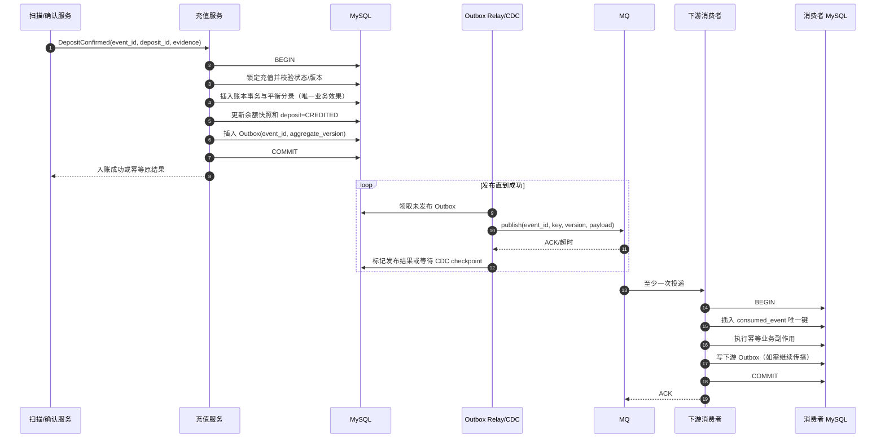
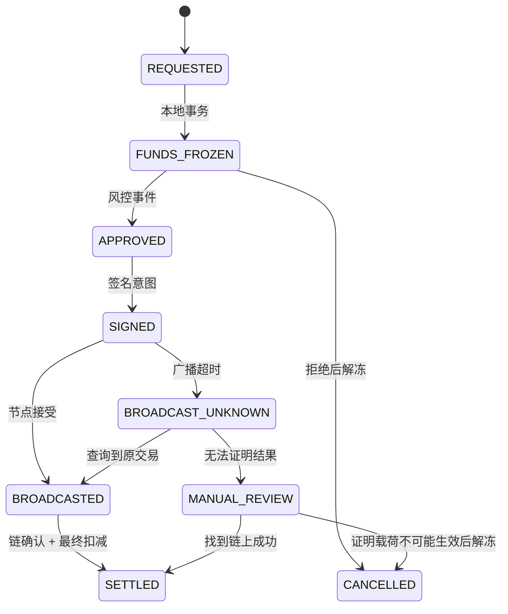

# Day 20：MySQL、Redis、MQ 与分布式一致性

> 学习目标：掌握 MySQL 唯一索引、事务、隔离级别、行锁和乐观锁在资金场景中的正确用法；理解 Redis 幂等、缓存、限流和分布式锁的边界；设计 MQ 至少一次投递下的幂等、顺序、重试与死信方案；使用本地事务、Outbox 和 CDC 可靠传播事件，并通过状态机、补偿和对账实现跨服务最终一致。  
> 建议用时：5～6 小时  
> 完成标准：画出“充值入账 + Outbox + MQ 消费”一致性流程，完成至少一次投递下的消费幂等方案，制作 MySQL、Redis、MQ 职责边界表，并闭卷回答文末恰好 7 道面试题。

## 安全边界与核心结论

- 所有实验只使用本地数据库、测试消息和无价值夹具；不要连接生产钱包、真实密钥或生产 Broker。
- MySQL 保存资金权威事实：业务状态、不可变账本、余额快照、幂等约束和 Outbox。Redis 与 MQ 都不能覆盖已提交账本。
- “Exactly once”通常不是端到端承诺。生产系统接受消息可能重复，通过稳定业务键、数据库唯一约束和事务把多次处理收敛为一次资金效果。
- 数据库提交和直接发送 MQ 是双写：无论先后顺序都存在一边成功、一边失败。应把业务变化与 Outbox 写入同一本地事务，再异步发布。
- Outbox 解决“已提交事件最终可发送”，不保证消费者只收到一次，也不自动保证全局顺序。消费者仍需幂等、版本检查和乱序处理。
- Redis 锁会过期、误释放、发生主从切换或网络分区。锁只能减少竞争，最终正确性必须由数据库状态条件、唯一索引和链资源证据保护。
- 资金操作不应使用无界自动重试。超时可能代表结果未知，必须区分安全重试、查询恢复、人工审查和禁止重试。
- 顺序只在明确业务键内维护，例如账户、发送钱包或 `withdrawal_id`。要求全局顺序会牺牲吞吐且通常没有业务必要。
- 消息积压时优先保护数据库、节点、签名和账本；通过暂停入口、限速、隔离、批量和降级逐步恢复，不能盲目扩容消费者压垮下游。
- Saga 补偿是新的业务动作，不是跨系统回滚。链上已发生的付款无法由数据库状态回滚撤销。

分布式一致性不变量：

```text
I1. 同一业务效果由 MySQL 唯一约束保证最多过账一次。
I2. 业务状态、账本分录、余额快照和 Outbox 在一个本地事务提交。
I3. 事件可重复发布和消费，但重复不得产生第二次资金效果。
I4. 消费确认只能发生在本地事务成功之后。
I5. 迟到事件不能把终态覆盖成早期状态。
I6. Redis 丢失、锁过期或缓存回退不得改变资金正确性。
I7. Outbox 未发布、重复发布和发布后崩溃都能自动恢复。
I8. DLQ 中的资金事件必须可追踪、可重放、可审计，不能静默丢弃。
I9. 链上未知结果保持资源占用，不能因消息重试创建新付款。
I10. 对账能够发现业务、账本、事件和链上事实未收敛的差异。
```

---

## 一、先理解一致性边界

### 1. 三种一致性范围

| 范围 | 典型数据 | 推荐保证 |
|---|---|---|
| 单数据库事务 | 充值状态、账本、余额、Outbox | 强原子性 |
| 跨服务消息 | 账本事件、通知、风控、报表 | 至少一次 + 幂等 + 最终一致 |
| 外部区块链 | 广播、确认、重组、异步消息 | 状态机 + 查询恢复 + 对账 |

不要把所有系统塞进一个“分布式事务”。区块链节点、HSM、第三方风控和 MQ 无法可靠参与 MySQL 两阶段提交，即使能参与，长事务与锁也会使钱包不可用。

### 2. 强一致放在哪里

资金不可拆开的事实应放在同一数据库事务：

```text
充值 CREDITED 状态
账本 transaction 与平衡 entries
用户余额快照
业务效果幂等键
待发布 Outbox event
```

通知、报表、搜索索引、缓存失效可异步完成。它们延迟不应导致用户重复入账。

### 3. 最终一致不是“以后再说”

最终一致必须回答：

- 谁负责重试；
- 使用什么幂等键；
- 如何查询当前事实；
- 顺序和版本如何判断；
- 多久未收敛会告警；
- 什么条件进入 DLQ 或人工处理；
- 如何通过对账证明最终一致。

没有恢复协议和 SLO 的“最终一致”只是数据丢失的别名。

---

## 二、MySQL：资金正确性的最后防线

### 1. 唯一索引先于业务代码

应用层“先查再写”存在竞态：两个线程都查不到，然后都插入。正确做法是将业务不变量编码进唯一索引：

```sql
UNIQUE (user_id, client_request_id)
UNIQUE (reference_type, reference_id, effect_type)
UNIQUE (chain, network, tx_hash, event_index)
UNIQUE (chain, network, sender_address, nonce)
UNIQUE (chain, network, txid, vout)
UNIQUE (consumer_group, event_id)
```

发生唯一键冲突后读取原记录：参数一致则视为幂等成功，参数不同则报告冲突并审计，不能简单吞掉所有 `DuplicateKeyException`。

### 2. 充值入账事务

```java
@Transactional
public CreditResult credit(DepositConfirmed event) {
    Deposit deposit = depositRepository.lock(event.depositId());
    if (deposit.isCredited()) {
        return CreditResult.existing(deposit.ledgerTransactionId());
    }
    deposit.assertConfirmable(event.evidenceHash());

    LedgerTransaction ledger = ledgerService.post(
        "DEPOSIT_CREDIT:" + deposit.id(),
        deposit.creditEntries());

    deposit.markCredited(ledger.id());
    outboxRepository.insert(OutboxEvent.depositCredited(deposit, ledger));
    return CreditResult.created(ledger.id());
}
```

事务中任一步失败都整体回滚。提交后响应丢失，重试命中唯一业务效果并返回原结果。

### 3. 隔离级别

| 隔离级别 | 特点 | 钱包使用建议 |
|---|---|---|
| Read Uncommitted | 可脏读 | 不用于资金业务 |
| Read Committed | 每次读已提交版本 | 适合明确行锁和条件更新的短事务 |
| Repeatable Read | MySQL 默认，快照读可重复 | 注意快照读与当前读差异、Gap Lock |
| Serializable | 最强但并发代价高 | 极少数低吞吐场景，不作为默认解法 |

隔离级别不能替代业务唯一约束。即使 Serializable，也要处理事务重试、死锁与外部副作用。

### 4. 快照读与当前读

普通 `SELECT` 在 InnoDB 中通常是 MVCC 快照读；`SELECT ... FOR UPDATE` 是当前读并加锁。分配 nonce、冻结余额、领取 Outbox 时，需要读取最新可修改状态，而不是旧快照。

```sql
SELECT available_atomic, frozen_atomic, version
FROM account_balance
WHERE account_id = ? AND asset_id = ?
FOR UPDATE;
```

锁定后再次校验余额与状态。事务必须短，锁内不能调用 RPC、签名服务或 MQ。

### 5. 悲观锁与乐观锁

悲观锁适合高冲突、必须串行的资源：

- 同一用户余额冻结；
- 同一 EVM sender nonce 分配；
- 同一 TON wallet `seqno` 预留；
- Outbox worker 领取任务。

乐观锁适合冲突较低、可快速重试的状态迁移：

```sql
UPDATE withdrawal
SET status = ?, version = version + 1
WHERE id = ? AND status = ? AND version = ?;
```

影响行数为 0 时读取现状，判断幂等成功、迟到消息或真实冲突。不要无限重试。

### 6. 死锁不是数据库 Bug

并发事务以不同顺序锁账户会死锁。控制方式：

```text
按稳定 account_id/resource_id 排序加锁
缩短事务，禁止事务中远程调用
为查询建立正确索引，避免扩大锁范围
捕获 deadlock/lock timeout 后有限退避重试
使用相同业务幂等键重试整个事务
监控死锁图和热点账户
```

### 7. 事务重试边界

只有纯数据库、幂等且无未知外部副作用的事务可自动重试。若事务外已调用签名或广播，必须先查询外部结果，不能把整个流程从头重跑。

---

## 三、Redis：加速器，不是资金账本

### 1. Redis 的正确职责

```text
余额和配置读缓存
API 限流与热点保护
短期请求去重提示
任务调度租约
节点健康与路由缓存
防缓存穿透的空值/布隆过滤器
可重建的统计聚合
```

### 2. Redis 幂等键的边界

常见写法：

```text
SET idempotency:{key} PROCESSING NX PX 30000
```

它可以减少并发请求，但不能证明资金只处理一次：

- TTL 到期时原任务可能仍在运行；
- Redis 故障或淘汰后键消失；
- 主从异步复制可能丢失最近写入；
- 客户端超时不知道命令是否成功；
- 业务处理成功但结果未写回 Redis；
- 恶意或错误调用方可能复用/改变请求参数。

最终应在 MySQL 保存请求键、请求摘要、业务结果和唯一约束。Redis 只做快速挡板。

### 3. 分布式锁为什么不够

即使使用带随机 token 的锁：

```text
SET lock:nonce:walletA token NX PX 10000
```

仍可能发生：持锁线程 STW 或网络暂停超过 TTL，锁被另一实例获取，旧线程恢复后继续写。若数据库没有 `(wallet, nonce)` 唯一约束和状态条件，两方都可能成功。

安全组合：

```text
Redis lock（减少竞争，可选）
  + MySQL row lock/version（串行化本地事实）
  + unique constraint（最终拒绝重复资源）
  + fencing token/version（拒绝旧持有者写入）
  + chain reconciliation（恢复外部事实）
```

释放锁必须比较 token 后删除，不能无条件 `DEL` 他人的新锁。

### 4. 限流

钱包常见维度：

- 用户、IP、设备、API Key；
- 链、资产、地址、钱包池；
- 风控、签名、广播、节点供应商；
- 单秒突发与滚动窗口累计。

Redis 令牌桶/滑动窗口适合实时保护，但资金额度必须在 MySQL 事务中再次检查并占用。Redis 清空不能让用户突破日提币限额。

### 5. 缓存一致性

推荐 Cache-Aside：

```text
读：查缓存 -> miss 查 MySQL -> 写入带版本缓存
写：只提交 MySQL 权威事务 -> 通过 Outbox 失效/刷新缓存
```

缓存值带 `ledger_version`。高风险写操作不依赖缓存余额；读到旧版本可返回短暂旧展示，但冻结必须查数据库。

### 6. 穿透、击穿、雪崩

| 问题 | 表现 | 防护 |
|---|---|---|
| 穿透 | 不存在的地址/资产持续查 DB | 参数校验、空值短缓存、布隆过滤器 |
| 击穿 | 热点 key 过期，大量请求同时回源 | 逻辑过期、single flight、互斥重建 |
| 雪崩 | 大量 key 同时过期或 Redis 故障 | TTL 抖动、多级缓存、限流、降级、容量预案 |

降级时优先保护账本数据库。非关键报表可拒绝或返回稍旧数据，不能让所有缓存 miss 无限制回源。

---

## 四、MQ：至少一次是常态

### 1. 为什么会重复

- 消费者事务成功后、ACK 前崩溃；
- Broker 未收到 ACK 并重新投递；
- 消费超时触发再平衡；
- 生产者发送超时后重发；
- Outbox relay 发布成功但未标记完成；
- 运维主动重放 Topic 或 DLQ。

重复是恢复机制的自然结果，不应被视为偶发异常。

### 2. 消费幂等表

```sql
CREATE TABLE consumed_event (
    consumer_group VARCHAR(64) NOT NULL,
    event_id VARCHAR(64) NOT NULL,
    aggregate_type VARCHAR(32) NOT NULL,
    aggregate_id VARCHAR(64) NOT NULL,
    event_version BIGINT NOT NULL,
    payload_hash CHAR(64) NOT NULL,
    result_ref VARCHAR(128) NULL,
    consumed_at TIMESTAMP NOT NULL,
    PRIMARY KEY (consumer_group, event_id)
);
```

消费记录与业务副作用必须在同一数据库事务。若先写去重表再处理业务，业务失败会永久跳过；若业务与去重分开提交，崩溃会重复副作用。

### 3. 至少一次消费伪代码

```java
@Transactional
public void consume(DepositConfirmed event) {
    boolean inserted = consumedEventRepository.tryInsert(
        GROUP, event.eventId(), event.aggregateId(),
        event.version(), event.payloadHash());
    if (!inserted) {
        consumedEventRepository.assertSamePayload(GROUP, event);
        return;
    }

    depositApplication.creditIdempotently(event);
    outboxRepository.insert(OutboxEvent.depositCredited(event));
}
```

事务提交后才 ACK。若 ACK 丢失，重复消息命中 `consumed_event` 与账本业务效果唯一键，不再入账。

### 4. 两层幂等

只靠 `event_id` 去重仍不够。上游 Bug 可能为同一业务效果生成两个不同 event ID。因此至少两层：

```text
传输层：unique(consumer_group, event_id)
业务层：unique(reference_type, reference_id, effect_type)
```

第一层减少重复执行，第二层保护资金不变量。

### 5. Payload 不一致

同一 event ID 收到不同 payload hash 是严重协议错误，不能返回“已处理”。应暂停该生产者/消费者路径、保留两份摘要并告警。

---

## 五、充值入账 + Outbox + MQ 一致性流程



### 1. 五个崩溃点

| 崩溃点 | 结果 | 恢复 |
|---|---|---|
| 业务事务提交前 | 业务、账本、Outbox 全回滚 | 上游重试同一业务键 |
| 提交后、返回前 | 事实已完成但响应丢失 | 查询/重试命中唯一键 |
| MQ 发布前 | Outbox 仍待发布 | Relay/CDC 后续发送 |
| 发布后、标记前 | MQ 已有消息，Outbox 看似未发 | 再发，消费者幂等 |
| 消费事务后、ACK 前 | 下游已完成但 Broker 未知 | 重新投递，消费幂等 |

该设计选择“可能重复，不会丢失”，再把重复收敛为一次资金效果。

---

## 六、Outbox 数据模型与发布

### 1. Outbox 表

```sql
CREATE TABLE outbox_event (
    id BIGINT PRIMARY KEY,
    event_id VARCHAR(64) NOT NULL,
    aggregate_type VARCHAR(32) NOT NULL,
    aggregate_id VARCHAR(64) NOT NULL,
    aggregate_version BIGINT NOT NULL,
    event_type VARCHAR(64) NOT NULL,
    partition_key VARCHAR(128) NOT NULL,
    payload JSON NOT NULL,
    payload_hash CHAR(64) NOT NULL,
    status VARCHAR(16) NOT NULL,
    available_at TIMESTAMP NOT NULL,
    published_at TIMESTAMP NULL,
    retry_count INT NOT NULL DEFAULT 0,
    last_error_code VARCHAR(64) NULL,
    created_at TIMESTAMP NOT NULL,
    UNIQUE KEY uk_event_id (event_id),
    UNIQUE KEY uk_aggregate_version
      (aggregate_type, aggregate_id, aggregate_version),
    KEY idx_relay (status, available_at, id)
);
```

Payload 不应包含私钥、助记词、认证令牌或不必要的个人信息。大型原始链数据保存引用与校验和，不塞入每条消息。

### 2. Polling Publisher

```sql
SELECT id
FROM outbox_event
WHERE status = 'PENDING' AND available_at <= NOW()
ORDER BY id
LIMIT 100
FOR UPDATE SKIP LOCKED;
```

多 worker 可并行领取，但要注意 MySQL 版本与隔离行为。不要持有数据库锁等待 MQ ACK；可先短事务标记租约，发布后再更新结果。租约过期会重复发布，因此消费者必须幂等。

### 3. CDC 发布

CDC 读取 binlog，把 Outbox 插入转换为 MQ 事件。优点是应用无需轮询、延迟低且按日志位置恢复；代价是部署 Connector、Schema 演进、权限、checkpoint、重放和运维复杂度。

CDC 仍不提供端到端一次：Connector 可能重放，MQ 和消费者仍需幂等。不能直接把所有业务表 binlog 暴露为公共事件契约，Outbox 提供更稳定的语义边界。

### 4. Polling 与 CDC 对比

| 维度 | Polling Relay | CDC |
|---|---|---|
| 实现 | 简单，应用可控 | 组件更多 |
| 延迟 | 取决于轮询间隔 | 通常更低 |
| DB 压力 | 有查询和更新 | 读取 binlog，但仍有 Outbox 写入 |
| 顺序 | 需按 ID/聚合键设计 | 可利用日志顺序，但跨分区仍需规则 |
| 恢复 | 租约与状态扫描 | checkpoint 与日志保留 |
| 适用 | 中小规模、快速落地 | 高吞吐、成熟数据平台 |

### 5. Outbox 清理

已发布事件不能立即删除。按审计和重放要求归档，分区表按时间清理，并保留：event ID、聚合版本、payload hash、发布时间和 Broker metadata。清理延迟应大于最大恢复与重放窗口。

---

## 七、顺序、乱序与版本控制

### 1. 哪些事件需要顺序

| 业务 | 顺序键 | 原因 |
|---|---|---|
| 用户账户账本投影 | account_id | 余额版本单调 |
| 单笔充值状态 | deposit_id | CONFIRMED 不能被 OBSERVED 覆盖 |
| 单笔提币状态 | withdrawal_id | SIGNED/BROADCASTED/SETTLED 单调 |
| EVM nonce 管理 | chain + sender | nonce 分配与确认有序 |
| TON wallet 调度 | chain + wallet | `seqno` 有序 |
| BTC UTXO 状态 | outpoint | FREE/RESERVED/SPENT 单调 |
| Outbox 聚合事件 | aggregate_id | aggregate_version 单调 |

不同用户或不同钱包通常不要求全局顺序，可以分区并行。

### 2. 分区键

生产者使用稳定 `partition_key`，例如 `account_id` 或 `withdrawal_id`。增加 Topic 分区通常保留同 key 在一个分区，但扩容、重试 Topic、DLQ 回放和多生产者仍可能导致业务乱序，因此消费者必须验证版本。

### 3. 版本策略

```text
event.version == current.version + 1  -> 正常应用
event.version <= current.version      -> 重复或迟到，幂等忽略
event.version > current.version + 1   -> 发现 gap，暂停该 aggregate 并回补
```

某些事件是事实集合而非严格序列，可用状态机优先级和证据合并；不要简单按消息时间戳覆盖。

### 4. 乱序例子

消费者先收到 `WithdrawalSettled v8`，后收到 `WithdrawalBroadcasted v7`。正确行为是保留 `SETTLED`，记录 v7 为迟到消息；错误行为是把状态回退到 `BROADCASTED`。

### 5. Gap 恢复

发现版本缺口时：

1. 暂停该 aggregate，不阻塞整个分区过久；
2. 查询权威服务当前快照和事件历史；
3. 补回缺失版本或用受验证快照前进；
4. 重放暂存事件；
5. 记录 gap 指标与生产者根因。

---

## 八、重试、退避与死信队列

### 1. 错误分类

| 类型 | 示例 | 动作 |
|---|---|---|
| 可瞬时重试 | 网络抖动、DB deadlock、短期限流 | 指数退避 + 抖动 + 上限 |
| 等待依赖 | 前置版本缺失、配置未同步 | 延迟队列/停车场 |
| 永久业务错误 | 资产不支持、Schema 无法解析 | DLQ + 告警，不循环重试 |
| 结果未知 | 广播超时、签名响应中断 | 查询原结果，禁止盲重做 |
| 数据冲突 | 同 event ID 不同 payload | 立即隔离生产者路径 |

### 2. 指数退避

可用：

$$
delay_n = \min(cap, base \times 2^n) + jitter
$$

退避避免所有消费者同时重试。资金任务还应设置最大自动次数、最大年龄和升级人工条件。

### 3. DLQ 不是垃圾桶

DLQ 消息必须保留：

```text
original topic/partition/offset
event_id and business reference
payload hash and schema version
consumer group
error code and stack trace reference
retry count and first/last failure time
owner and resolution status
```

重放前修复根因、验证幂等键、限定范围和速率。重放后确认源 DLQ 工单与业务状态收敛，不能直接清空队列。

### 4. Poison Message

一条永久失败消息不能阻塞整个顺序分区。可转入停车场并暂停同 aggregate，继续处理其他 key；若业务必须严格顺序，则隔离该 key，避免拖住所有账户。

---

## 九、消息积压与下游保护

### 1. 积压原因

- 上游流量突增或历史重放；
- 消费者变慢、频繁 Full GC 或线程池阻塞；
- 数据库锁竞争、慢 SQL、连接池耗尽；
- RPC 节点限流或链停止出块；
- 重试风暴与 Poison Message；
- 分区热点或错误 partition key；
- Schema/配置发布不兼容。

### 2. 保护顺序

```text
1. 判断资金正确性是否受影响。
2. 限制或暂停非关键生产者。
3. 隔离实时流量、历史重放和低优先级任务。
4. 对消费者限并发，保护 DB/RPC/HSM。
5. 批量读取与批量写入，但保持单项幂等。
6. 修复热点、慢 SQL、分区和下游容量。
7. 按年龄和业务优先级逐步清理积压。
8. 完成后对账，不以 lag 归零作为唯一成功标准。
```

### 3. 背压与隔离

- 充值确认、提币结算优先于通知和报表；
- 实时扫描与历史 Backfill 使用独立 Topic/消费者池；
- 不同链、节点供应商和资产可用隔离舱；
- 设置数据库并发、QPS、连接池和 RPC token bucket；
- 下游错误率高时熔断，避免重试放大；
- 必要时暂停新提币，但继续处理已确认结算。

### 4. 扩容并非总是答案

若瓶颈是 MySQL 行锁或单钱包 nonce，增加消费者会加剧冲突。先找串行资源与热点 key，再决定扩分区、分片钱包、批处理或优化 SQL。

### 5. 关键指标

```text
consumer_lag{topic,partition,group}
oldest_message_age_seconds
consume_rate / produce_rate
handler_latency_seconds{event_type}
retry_rate / dlq_rate
db_pool_active / lock_wait / deadlock
rpc_error_rate / rate_limit
outbox_pending_count / oldest_outbox_age
```

---

## 十、Saga 与状态机补偿

### 1. 为什么不用全局分布式事务

提币流程跨越风控、账本、签名、广播和区块链，持续几分钟到几小时。长期持锁或两阶段提交不现实，也无法让链上交易回滚。

### 2. Saga 状态示例



### 3. 补偿不是回滚

| 已完成步骤 | 可用补偿 | 不能做的事 |
|---|---|---|
| 冻结余额 | 安全失败后创建解冻分录 | 删除冻结历史 |
| 风控批准 | 记录撤销/过期 | 假装批准从未发生 |
| 资源预留 | 证明未消费后释放 | TTL 到期盲目释放 |
| 已签名 | 作废意图并保留载荷证据 | 删除签名审计 |
| 已广播 | 查询、等待、替换或人工处置 | 数据库“回滚”链上交易 |
| 已确认付款 | 最终扣减与对账 | 解冻后再次付款 |

### 4. 编排与协同

- Orchestration：中央状态机决定下一步，易观察和控制资金流程；
- Choreography：服务监听事件自治，耦合低但流程容易隐蔽和循环。

资金主流程通常适合显式编排，通知、报表等旁路可事件协同。无论哪种，都需要业务状态历史、幂等与超时恢复。

---

## 十一、MySQL、Redis、MQ 职责边界表

| 能力 | MySQL | Redis | MQ |
|---|---|---|---|
| 用户余额最终依据 | 是，账本分录与快照 | 否，只缓存 | 否 |
| 业务幂等最终约束 | 是，唯一索引 | 否，快速挡板 | 否，可能重复 |
| 跨账户资金事务 | 是 | 不应承担 | 不应承担 |
| 状态 CAS/版本 | 是 | 可缓存版本 | 携带版本，不裁决真相 |
| 请求限流 | 可做但成本高 | 主要实现 | 可通过背压辅助 |
| 分布式锁 | 行锁/条件更新是最终保护 | 可减少竞争 | 不适用 |
| 异步解耦 | Outbox 保存事实 | 不适合作事件总线 | 主要职责 |
| 顺序处理 | 保存版本与校验 | 临时协调 | 分区内顺序 + key |
| 重试 | 数据库事务有限重试 | 短期计数/退避辅助 | 延迟、重投、DLQ |
| 缓存 | 不需要 | 主要职责 | 不适用 |
| 审计与恢复 | 权威历史 | 可丢失、可重建 | 保留窗口内事件 |
| 消息可靠发布 | Outbox/CDC 源 | 不作为权威源 | 承载传播 |
| 资金对账 | 权威内部数据 | 不参与最终裁决 | 提供传播线索 |

一句话：MySQL 决定资金事实，Redis 提速和保护流量，MQ 可靠传播变化；三者不可互相冒充。

---

## 十二、关键表设计

### 1. Inbox/消费幂等

```sql
CREATE TABLE consumer_inbox (
    consumer_group VARCHAR(64) NOT NULL,
    event_id VARCHAR(64) NOT NULL,
    aggregate_id VARCHAR(64) NOT NULL,
    aggregate_version BIGINT NOT NULL,
    payload_hash CHAR(64) NOT NULL,
    status VARCHAR(16) NOT NULL,
    result_ref VARCHAR(128) NULL,
    first_seen_at TIMESTAMP NOT NULL,
    processed_at TIMESTAMP NULL,
    PRIMARY KEY (consumer_group, event_id),
    KEY idx_aggregate_version
      (consumer_group, aggregate_id, aggregate_version)
);
```

对于同数据库事务，插入 Inbox 后直接完成业务并提交。不要让 `PROCESSING` 永久存在；事务回滚时 Inbox 也回滚。

### 2. 聚合版本

```sql
CREATE TABLE aggregate_projection (
    consumer_group VARCHAR(64) NOT NULL,
    aggregate_type VARCHAR(32) NOT NULL,
    aggregate_id VARCHAR(64) NOT NULL,
    applied_version BIGINT NOT NULL,
    state_json JSON NOT NULL,
    updated_at TIMESTAMP NOT NULL,
    PRIMARY KEY (consumer_group, aggregate_type, aggregate_id)
);
```

### 3. DLQ 工单

```sql
CREATE TABLE message_failure_case (
    id BIGINT PRIMARY KEY,
    case_no VARCHAR(64) NOT NULL,
    consumer_group VARCHAR(64) NOT NULL,
    event_id VARCHAR(64) NOT NULL,
    business_ref VARCHAR(128) NOT NULL,
    error_code VARCHAR(64) NOT NULL,
    retry_count INT NOT NULL,
    status VARCHAR(24) NOT NULL,
    owner VARCHAR(64) NULL,
    evidence_ref VARCHAR(256) NOT NULL,
    created_at TIMESTAMP NOT NULL,
    resolved_at TIMESTAMP NULL,
    UNIQUE KEY uk_case_no (case_no),
    UNIQUE KEY uk_group_event (consumer_group, event_id)
);
```

---

## 十三、异常矩阵

| 异常 | 风险 | 自动动作 | 禁止动作 | 恢复证据 |
|---|---|---|---|---|
| MySQL 提交前崩溃 | 未完成 | 同业务键重试 | 假定已成功 | 事务回滚、无业务效果 |
| 提交后响应丢失 | 重复请求 | 查询唯一键并返回原结果 | 再创建资金效果 | ledger/outbox 已存在 |
| Outbox Relay 停止 | 事件延迟 | 重启后扫描 pending | 手工伪造新 event ID | Outbox 行与业务事务 |
| MQ 发布后 Relay 崩溃 | 重复发布 | 再发相同 event ID | 修改 payload 后重发 | payload hash、Broker metadata |
| 消费提交后 ACK 丢失 | 重复消费 | Inbox + 业务唯一键收敛 | 依赖内存去重 | consumer DB 事务 |
| 同 event ID 不同 payload | 协议损坏 | 隔离生产者并告警 | 当普通重复忽略 | 两个 payload hash |
| 两个 event ID 同一充值 | 重复入账 | 业务效果唯一键拒绝第二次 | 只依赖 event ID | deposit/effect unique key |
| 迟到状态事件 | 状态回退 | 版本/状态机忽略 | 按消息时间覆盖 | aggregate version |
| 版本 gap | 漏消息 | 暂停 aggregate 并回补 | 跳过缺失版本 | 权威快照/事件历史 |
| Redis 幂等键过期 | 并发重复 | MySQL 唯一约束裁决 | 认为可再次入账 | DB 业务记录 |
| Redis 锁过期 | 双执行 | fencing/version/唯一键拒绝旧写 | 仅续租后继续 | token、DB version |
| 缓存雪崩 | DB 过载 | 限流、TTL 抖动、降级 | 全量无限回源 | cache/DB 指标 |
| DB deadlock | 事务失败 | 有限退避重试同一幂等键 | 局部步骤重试 | deadlock graph |
| Poison Message | 分区阻塞 | 隔离 key、DLQ、告警 | 无限即时重试 | error code/schema |
| 消息积压 | 延迟与下游过载 | 背压、隔离、限并发 | 盲目扩消费者 | lag、DB/RPC 容量 |
| DLQ 重放 | 重复/洪峰 | 小批、限速、幂等验证 | 全量直接回灌 | 工单与重放批次 |
| 广播超时消息重试 | 双付 | 查询原载荷/交易 | 从流程开头重建付款 | signed payload/chain evidence |
| Outbox 表膨胀 | DB 性能下降 | 分区归档、受控清理 | 未过恢复窗直接删除 | checkpoint/审计保留 |
| CDC checkpoint 丢失 | 重放或缺口 | 从可信日志位置恢复并对账 | 猜 offset | binlog position/event ID |

---

## 十四、故障演练

### 演练 A：生产者提交后崩溃

1. 在充值账本和 Outbox 提交后、HTTP/MQ 响应前终止进程；
2. 重放相同 `deposit_id` 与 event；
3. 验证充值、账本效果和 Outbox 各只有一份；
4. Relay 最终发布 Outbox；
5. 下游收到事件并完成一次副作用；
6. 对账确认用户余额只增加一次。

### 演练 B：消费者重复

1. 同一事件并发投递 5 次；
2. 在消费者 DB 提交后、ACK 前断开；
3. 验证 Inbox 主键冲突被识别；
4. 验证业务效果唯一键进一步兜底；
5. 验证重复 payload 一致，返回原 result；
6. 发送同 ID 不同 payload，确认触发高优先级告警。

### 演练 C：消息乱序

1. 依次生成 withdrawal v5、v6、v7；
2. 按 v7、v5、v6 顺序投递；
3. v7 因 gap 暂存并查询权威状态；
4. 补齐版本后应用到 v7；
5. 重放 v5/v6 不回退终态；
6. 验证最终状态、历史和指标正确。

### 演练 D：Redis 锁过期

1. 实例 A 获得 3 秒锁并暂停 5 秒；
2. 实例 B 获得新锁并尝试分配同一 nonce；
3. A 恢复并继续写；
4. 验证 MySQL 行版本/唯一索引只允许一个资源所有者；
5. 旧 fencing token 被拒绝；
6. 两个实例都不能绕过数据库裁决。

### 演练 E：消息积压

1. 降低节点网关容量并制造消费延迟；
2. 观察 lag、oldest age、DB pool 与 RPC 错误率；
3. 暂停 Backfill 和通知消费者；
4. 限制生产入口和消费并发；
5. 修复瓶颈后按业务优先级逐步恢复；
6. lag 清零后执行账本与业务对账。

---

## 十五、监控、告警与 Runbook

### 1. MySQL 指标

```text
transaction_latency / rollback_rate
deadlock_total / lock_wait_seconds
unique_conflict_total{constraint}
connection_pool_active / pending
slow_query_total
replication_lag_seconds（只读副本）
```

资金写后立即读取不能盲目走延迟副本，否则可能误判“记录不存在”并重试。

### 2. Outbox 与 MQ 指标

```text
outbox_pending_count
outbox_oldest_pending_seconds
outbox_publish_retry_total
cdc_checkpoint_lag
consumer_lag / oldest_message_age
duplicate_event_total
version_gap_total
dlq_count / oldest_dlq_age
```

### 3. Redis 指标

```text
cache_hit_ratio
evicted_keys / expired_keys
memory_usage / fragmentation
command_latency
lock_contention / lock_expiry_while_running
rate_limit_rejected_total
fallback_to_db_rate
```

### 4. Runbook：Outbox 积压

```text
1. 确认业务事务仍正常提交，资金事实未丢失。
2. 比较最老 Outbox 年龄、产生速率和发布速率。
3. 检查 Relay/CDC、Broker、网络和权限。
4. 验证 event ID、Schema 和 payload 大小是否异常。
5. 限制非关键生产者，保护主库。
6. 恢复发布并控制批次与并发。
7. 预期重复发布，提前确认消费者幂等。
8. 清空后核对 Outbox、Broker、Inbox 和业务效果。
```

### 5. Runbook：消费者积压

```text
1. 按 Topic、partition、event type 和 key 定位热点。
2. 检查消费者 CPU/GC、DB、RPC、HSM 和线程池。
3. 区分实时、历史、重试和 Poison Message。
4. 隔离低优先级流量并设置下游并发上限。
5. 修复根因后小步扩容，不突破下游容量。
6. 按业务时间而非 offset 单独决定优先级。
7. 处理 DLQ 时使用新 replay batch ID，但保留原 event ID。
8. 完成后执行业务、账本、链上对账。
```

---

## 十六、口头面试题参考答案

> 本节严格包含计划中的 7 道题。先闭卷口述，再按“结论 → 原理 → 生产实现 → 异常与风险 → 监控和恢复”补全。

### 1. 数据库提交成功但 MQ 发送失败怎么办？

**参考回答：**

不要在业务事务提交后直接依赖一次 MQ 发送。把业务状态、账本、余额和 Outbox 事件写入同一个 MySQL 本地事务；提交成功后，由 Polling Relay 或 CDC 持续发布 Outbox。MQ 暂时失败只会造成传播延迟，不会丢失已提交资金事实。

Relay 发布成功但标记前崩溃可能再次发送，所以事件使用稳定 event ID，消费者用 Inbox 和业务效果唯一键幂等。监控最老 Outbox 年龄、发布失败和 CDC checkpoint；恢复后限速补发并核对 Outbox、Broker、消费者和业务结果。

### 2. MQ 重复投递为什么不能依靠 Broker 完全解决？

**参考回答：**

消费者本地事务成功后可能在 ACK 前崩溃，Broker 无法知道业务是否提交，只能重新投递。生产者超时、再平衡、Outbox 发布重试和人工回放也都会产生重复。Broker 的幂等生产或事务能力通常只覆盖部分链路，无法把消费者数据库和外部链上副作用纳入同一原子提交。

因此接受至少一次：消费者在同一数据库事务中插入 `(consumer_group,event_id)` Inbox 并执行业务；同时用 `(reference_id,effect_type)` 唯一键防止不同 event ID 表达同一资金效果。提交后才 ACK，同 ID 不同 payload 则隔离告警。

### 3. 如何利用唯一索引实现资金入账幂等？

**参考回答：**

先选稳定业务身份，例如充值使用 `deposit_id` 或链事件唯一键，账本效果使用 `(reference_type, reference_id, effect_type)`。在 MySQL 建唯一索引，并在一个事务中插入账本事务、平衡分录、更新余额和充值状态。并发请求只有一个能创建效果。

唯一冲突后读取原记录并比较请求摘要：完全一致则返回原 transaction，参数不同则报安全冲突，不能一律吞异常。MQ event ID 去重是传输层，业务唯一索引才是资金兜底。提交后响应丢失时使用相同键重试，余额不会再次增加。

### 4. Redis 分布式锁为什么不能单独保证资金安全？

**参考回答：**

锁会过期、主从切换可能丢锁、客户端可能暂停超过 TTL，网络分区还会让旧持有者在新持有者取得锁后继续执行。无条件解锁也可能删除别人的新锁。因此 Redis 锁只能减少竞争，不能证明业务只执行一次。

最终依靠 MySQL 行锁或状态版本、业务唯一索引和链资源约束；必要时使用 fencing token 拒绝旧持有者。释放 Redis 锁要比较 token。演练锁过期时，应证明两个实例即使同时运行，也只有一个数据库资金效果，外部广播未知还必须按链上证据恢复。

### 5. 消息积压时如何保护数据库和下游节点？

**参考回答：**

先判断积压来源和资金影响，不盲目增加消费者。暂停 Backfill、报表和通知等低优先级流量，把充值确认和提币结算隔离；对消费者设置数据库连接、并发、批次和 RPC 令牌桶，错误率上升时熔断并指数退避，防止重试风暴。

检查热点 partition、慢 SQL、行锁、节点限流和 Poison Message。修复后按消息年龄与业务优先级逐步恢复，监控 oldest age、处理速率、DB pool 和 RPC 错误。lag 归零后仍要对账，确认没有因乱序、DLQ 或超时造成资金状态未收敛。

### 6. 哪些钱包事件需要顺序消费？

**参考回答：**

需要顺序的是同一业务实体或冲突资源的状态变化：用户账户账本投影按 account ID，充值按 deposit ID，提币按 withdrawal ID，EVM nonce 按 sender，TON `seqno` 按 wallet，BTC UTXO 按 OutPoint。不同用户或钱包通常可并行，不需要全局顺序。

生产者用稳定 aggregate ID 作为分区键，事件携带单调 version。消费者只应用下一版本，重复/迟到不回退状态，发现 gap 则暂停该 aggregate 并从权威服务补快照或事件。分区顺序不能替代版本检查，因为重试 Topic、DLQ 回放和扩容仍可能乱序。

### 7. Outbox Pattern 的优点和代价是什么？

**参考回答：**

优点是把业务事实和待发布事件放入同一个本地事务，消除数据库与 MQ 直接双写导致的事件丢失；MQ 故障时业务事实仍安全，Relay/CDC 恢复后最终发布。事件有稳定 ID、聚合版本和审计记录，便于重放与排障。

代价是增加 Outbox 表写入、存储、清理、Relay/CDC 运维和可观测性；发布可能重复，消费者仍要幂等；跨聚合全局顺序也不会自动获得。高流量下要分区归档、控制 payload 和监控积压。它解决可靠传播，不替代状态机、消费者事务和链上对账。

---

## 十七、当天任务

### 任务 1：MySQL 并发控制（60 分钟）

- [ ] 为充值入账、提币请求和 nonce 分配设计唯一索引。
- [ ] 分别使用行锁和乐观版本实现一个状态迁移。
- [ ] 推演两个事务以不同顺序锁账户造成死锁。
- [ ] 编写有限退避重试并验证业务幂等。

### 任务 2：Outbox 一致性（60～90 分钟）

- [ ] 完成充值入账、账本、余额和 Outbox 同事务伪代码。
- [ ] 选择 Polling Relay 或 CDC 并说明取舍。
- [ ] 注入提交后崩溃、发布前崩溃和发布后崩溃。
- [ ] 验证事件不丢失且重复可收敛。

### 任务 3：消费幂等（60 分钟）

- [ ] 设计 Inbox 表和业务效果唯一键。
- [ ] 同一事件并发投递至少 5 次。
- [ ] 在消费事务提交后、ACK 前注入故障。
- [ ] 验证资金效果一次，并检测同 ID 不同 payload。

### 任务 4：顺序与乱序（45 分钟）

- [ ] 为账户、充值、提币和链资源选择 partition key。
- [ ] 构造重复、迟到和 version gap 三类事件。
- [ ] 验证终态不回退，gap 可从权威快照恢复。
- [ ] 说明哪些事件不需要全局顺序。

### 任务 5：Redis 边界（45 分钟）

- [ ] 实现请求快速去重，但保留 MySQL 最终唯一约束。
- [ ] 推演 Redis 锁过期后两个实例同时执行。
- [ ] 设计带 token 的安全释放和 fencing version。
- [ ] 推演缓存穿透、击穿和雪崩的降级。

### 任务 6：积压与 DLQ（45～60 分钟）

- [ ] 制造消费者低速和消息积压。
- [ ] 隔离实时、Backfill、通知和 Poison Message。
- [ ] 设计 DLQ 工单、小批限速重放和审计。
- [ ] 恢复后执行账本、业务和链上对账。

### 任务 7：口述（30～45 分钟）

- [ ] 不看资料回答本节恰好 7 道题并录音。
- [ ] 每题包含不变量、崩溃点、监控和恢复。
- [ ] 用 10 分钟白板讲清 Outbox 与至少一次消费。
- [ ] 将薄弱点写入 `progress.md`。

---

## 十八、闭卷验收

- [ ] 能区分本地强事务、消息最终一致和链上状态机。
- [ ] 能解释数据库与 MQ 直接双写的失败窗口。
- [ ] 能设计充值入账与 Outbox 同一本地事务。
- [ ] 能画出 Outbox、Relay/CDC、MQ 和消费者流程。
- [ ] 能处理提交后响应丢失而不重复入账。
- [ ] 能为资金业务设计稳定唯一索引。
- [ ] 能解释先查后写为何不能保证幂等。
- [ ] 能选择 MySQL 隔离级别并区分快照读与当前读。
- [ ] 能正确使用行锁、乐观锁和稳定加锁顺序。
- [ ] 能处理 deadlock 和 lock timeout 的有限重试。
- [ ] 能说明何时不能自动重试整个流程。
- [ ] 能列出 Redis 的缓存、限流和调度职责。
- [ ] 能证明 Redis 幂等键不是最终资金防线。
- [ ] 能解释分布式锁过期与旧持有者风险。
- [ ] 能使用 token、fencing、版本和唯一键组合保护。
- [ ] 能处理缓存穿透、击穿和雪崩。
- [ ] 能解释 MQ 至少一次为什么产生重复。
- [ ] 能把 Inbox 与业务副作用放在同一事务。
- [ ] 能设计传输层和业务层两级幂等。
- [ ] 能检测同 event ID 不同 payload。
- [ ] 能比较 Polling Relay 与 CDC。
- [ ] 能设计 Outbox 归档、清理和恢复窗口。
- [ ] 能为账户、业务和链资源选择顺序键。
- [ ] 能使用 aggregate version 处理重复、迟到和 gap。
- [ ] 能设计指数退避、DLQ 和 Poison Message 隔离。
- [ ] 能在消息积压时保护 MySQL、节点与签名服务。
- [ ] 能解释 Saga 补偿不是跨系统回滚。
- [ ] 能通过对账证明最终一致。
- [ ] 闭卷回答恰好 7 道面试题。

## 十九、Day 20 验收清单

- [ ] 已完成“充值入账 + Outbox + MQ 消费”一致性流程图。
- [ ] 已完成至少一次投递下的消费幂等方案。
- [ ] 已完成 MySQL、Redis、MQ 职责边界表。
- [ ] 已设计 MySQL 唯一索引、事务和锁策略。
- [ ] 已验证同一资金效果并发执行只有一次成功。
- [ ] 已演练数据库提交成功但响应丢失。
- [ ] 已设计 Outbox 表、Relay/CDC 和归档策略。
- [ ] 已演练 MQ 发布成功但 Outbox 未标记。
- [ ] 已设计 Inbox、业务唯一键和 payload hash 校验。
- [ ] 已演练消费者提交后 ACK 丢失。
- [ ] 已为账户、充值、提币和链资源定义顺序键。
- [ ] 已处理重复、迟到和 version gap。
- [ ] 已设计有限重试、指数退避和 DLQ。
- [ ] 已验证 DLQ 重放仍使用原业务幂等键。
- [ ] 已明确 Redis 幂等、缓存、限流和锁的边界。
- [ ] 已演练 Redis 锁过期后的数据库最终裁决。
- [ ] 已设计缓存穿透、击穿和雪崩保护。
- [ ] 已完成消息积压下的背压、隔离和恢复方案。
- [ ] 已区分 Saga 补偿、查询恢复和人工处置。
- [ ] 已完成 Outbox、MQ、Inbox、业务和账本对账。
- [ ] 已录音回答 7 道题并更新 `progress.md`。
- [ ] Git 中没有私钥、助记词、API Key 或生产敏感数据。

## 二十、30 分自评分

| 能力 | 1 分 | 3 分 | 5 分 | 今日得分 |
|---|---|---|---|---|
| MySQL 事务 | 只会 `@Transactional` | 能用唯一键和行锁 | 能处理隔离、乐观锁、死锁和崩溃恢复 |  |
| Redis 边界 | 把锁当最终保证 | 能做缓存限流 | 能用 DB/fencing 兜底并处理三类缓存故障 |  |
| MQ 幂等 | 期待不重复 | 有 event ID 去重 | 有 Inbox、业务唯一键、payload 校验和事务 ACK |  |
| Outbox/CDC | DB 后直接发 MQ | 能写 Outbox | 能处理五个崩溃点、归档、重放和监控 |  |
| 顺序与积压 | 要求全局顺序 | 能按 key 分区 | 能处理 version gap、DLQ、背压和热点瓶颈 |  |
| 最终一致 | 只会自动重试 | 能做状态机补偿 | 能区分未知结果、Saga、对账和人工恢复 |  |

**当日总分：** ____ / 30  
**MySQL 隔离级别与唯一键：** ______________________________  
**Outbox 发布方式：** ______________________________  
**消费幂等键：** ______________________________  
**顺序键 / aggregate version：** ______________________________  
**Redis 锁过期演练结果：** ______________________________  
**积压峰值 / 恢复耗时：** ______________________________  
**最终一致性对账结果：** ______________________________  
**最薄弱的三个知识点：** 1. __________ 2. __________ 3. __________  
**明日优先补强：** ______________________________