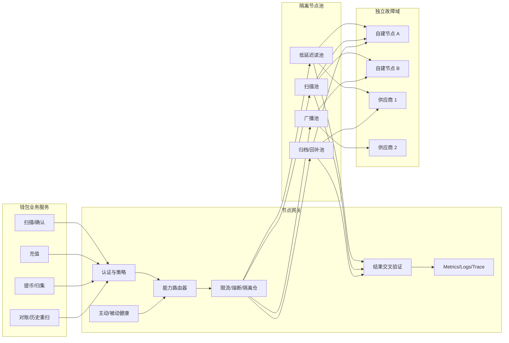
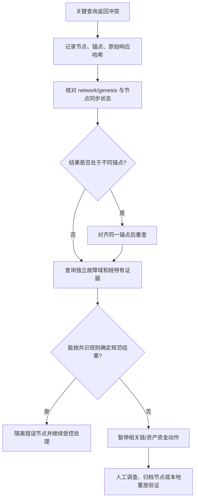
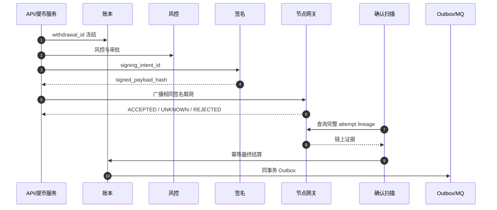
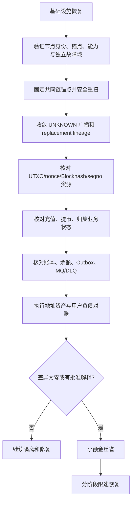

# Day 21：节点网关、可观测性与第三周复盘

> 学习目标：设计支持 BTC、EVM、Solana、TON 的多节点网关与故障切换；掌握自建节点、第三方 RPC、多供应商和读写节点隔离；建立节点健康、熔断、限流、重试与结果交叉验证机制；使用指标、结构化日志和 Trace 定位充值、提币、归集、账本与消息链路；能够执行链停止出块、节点落后和广播失败率升高的应急预案。  
> 建议用时：5～6 小时  
> 完成标准：画出多节点网关和故障切换架构，制作钱包监控指标与告警阈值清单，完成三份应急 Runbook，并闭卷回答文末恰好 7 道面试题。

## 安全边界与核心结论

- 所有实验只使用本地链、测试网或确定性节点夹具，不向生产网络广播，不记录私钥、助记词、签名原文或供应商密钥。
- RPC 节点是可失败、可落后、可返回错误或不一致数据的外部依赖，不是资金事实的唯一来源。
- 节点网关统一的是认证、路由、限流、观测和错误分类，不应抹平 BTC UTXO、EVM Receipt、Solana Commitment、TON 异步消息等证据差异。
- 读节点、扫描节点、广播节点和归档节点的目标不同，应使用独立池、独立配额和独立熔断，避免查询洪峰拖垮广播。
- 自动切换只能切换到满足网络身份、同步高度、功能能力和数据质量要求的节点。连接成功不等于健康。
- 重试必须基于操作语义。只读幂等查询可退避重试；广播超时是未知结果，应查询或重播相同签名载荷，不能重建付款。
- 多数票不是绝对真相。供应商可能共享上游或同时落后；关键结果需结合链规则、规范链锚点、业务效果和独立数据源判断。
- 可观测性必须贯穿 `business_id -> ledger_transaction_id -> signing_intent_id -> signed_payload_hash -> chain identity`，但日志中不得泄露秘密。
- 暂停充提是安全控制，不是失败。证据不可靠、账链差异、重复签名风险或节点全失效时应 Fail Closed。
- 恢复服务前必须证明游标、链资源、业务状态、账本、Outbox 和链上事实已收敛，不能只看错误率恢复。

运行不变量：

```text
I1. 每个请求明确指定 chain、network、能力、读写语义和一致性等级。
I2. 不健康节点不能参与资金关键读、广播或最终性判定。
I3. 广播未知不创建新的业务付款或释放链资源。
I4. 节点切换不改变业务幂等键、签名载荷和链资源归属。
I5. 扫描游标由高度与链特有锚点共同保护，切换后允许安全重扫。
I6. 单节点、单供应商和单区域故障不会静默改变资金结果。
I7. 指标、日志、Trace 和审计能从业务单定位到链上证据。
I8. 告警必须对应负责人、抑制规则、止损动作和恢复标准。
I9. 暂停期间允许安全查询、确认、对账和幂等内部收敛。
I10. 恢复前所有未知结果已收敛或被明确隔离。
```

---

## 一、节点网关的职责与非职责

### 1. 网关应负责

```text
链与网络身份校验
节点注册、能力和供应商元数据
读池/扫描池/广播池/归档池路由
请求超时、预算、限流、熔断和隔离仓
错误标准化与可重试性分类
高度、延迟、正确性和功能健康检查
关键结果交叉验证
请求日志、指标、Trace 和审计
供应商配额与成本治理
故障切换和灰度恢复
```

### 2. 网关不应负责

- 决定充值是否给用户入账；
- 绕过提币状态机重建交易；
- 把交易哈希存在直接映射为业务成功；
- 替代链适配器解析 Token、Instruction 或 Message；
- 替代账本、Outbox 和业务幂等；
- 在节点冲突时随意选择“看起来正常”的结果；
- 保存私钥或执行签名。

网关输出的是带来源、锚点、置信度和原始证据引用的节点观察，不是最终资金结论。

### 3. 四种节点来源

| 来源 | 优点 | 风险 | 推荐用途 |
|---|---|---|---|
| 自建全节点 | 配置可控、隐私较好、可深度诊断 | 运维重、同步与容量风险 | 主扫描、关键查询、广播之一 |
| 自建归档节点 | 历史状态完整 | 成本高、恢复慢 | 历史重扫、对账、调查 |
| 第三方 RPC | 快速扩容、多地域 | 限流、数据保留、共享上游、供应商风险 | 容灾读、广播扩散、交叉验证 |
| 专业索引服务 | 查询丰富、历史检索快 | 非共识源、解析规则不可控 | 发现与辅助，不做唯一资金依据 |

至少要跨供应商、跨区域，并尽量跨实现或跨上游，否则“三个 URL”可能仍是一个故障域。

---

## 二、多节点网关与故障切换架构



### 1. 请求上下文

每个网关请求至少携带：

```text
request_id / trace_id
business_id（可选但推荐）
chain / network / genesis identity
operation: READ / SCAN / BROADCAST / ARCHIVE
method and capability
consistency: FAST / VERIFIED / FINALITY_SENSITIVE
timeout budget and max attempts
required block/slot/LT range
sticky routing key
data sensitivity level
```

业务服务不能只传一个通用 JSON-RPC body，让网关猜测资金语义。

### 2. 节点注册元数据

```text
node_id / provider_id / region / failure_domain
chain / network / genesis hash
client implementation and version
roles and supported methods
archive/pruning/indexing capability
rate and concurrency limits
latest observed anchor and latency
health state / circuit state
credential reference（不记录密钥本身）
```

### 3. 路由原则

- 快速读：在健康低延迟池中加权选择；
- 最终性敏感读：至少一个主节点加独立供应商复核；
- 扫描：对游标使用粘性主节点，异常时从共同锚点切换和重扫；
- 广播：先向主广播节点提交，再按策略扩散相同签名载荷；
- 历史重扫：使用归档池，低优先级且不抢占实时配额；
- 调试查询：独立配额，禁止人工大查询拖垮资金流量。

---

## 三、读写节点为何隔离

### 1. 读请求特征

- 数量大，容易被扫描和回补放大；
- 可按方法缓存或批量；
- 多数为幂等，适合退避重试；
- 对历史范围、归档能力和一致性要求不同；
- 高峰时可降级非关键查询。

### 2. 广播请求特征

- QPS 较低，但资金风险和时延敏感；
- 载荷可能包含已签名交易，日志必须脱敏；
- 超时代表未知结果，不适合普通 HTTP 自动重试；
- 需要保存节点响应与本地预期交易身份；
- 必须保护不受扫描洪峰、归档查询和供应商限流影响。

### 3. 隔离维度

```text
独立连接池
独立线程池/异步执行器
独立并发与速率配额
独立熔断器和超时
独立供应商账户或 API Key
独立仪表盘和告警
必要时独立部署与网络出口
```

同一个物理节点可承担多个角色，但生产上仍应在网关层隔离预算；关键广播最好有独立故障域。

---

## 四、节点健康检查

### 1. 四层健康

| 层次 | 检查内容 | 典型失败 |
|---|---|---|
| 连通性 | DNS、TCP、TLS、认证 | 连接拒绝、证书过期 |
| 协议 | JSON-RPC 格式、方法支持、响应时延 | 错误码、版本不兼容 |
| 同步 | tip、finalized anchor、peer、sync 状态 | 节点落后、卡住、错误网络 |
| 正确性 | 已知锚点、区块哈希、交易/Receipt/账户结果 | 数据错误、索引缺失、分叉 |

健康状态建议：

```text
HEALTHY -> DEGRADED -> QUARANTINED -> RECOVERING -> HEALTHY
```

恢复需连续多个探测窗口通过，并先承接影子流量或低风险读，避免抖动。

### 2. 主动与被动健康

主动探测：固定周期查询网络身份、最新锚点、已知历史锚点和关键方法。

被动探测：从真实请求统计超时、错误码、空结果异常、延迟、限流和与其他节点冲突。

两者都需要。只做 `getBlockNumber` 可能发现不了 Token Log、历史查询或广播方法损坏。

### 3. 链特有检查

| 链 | 同步/身份 | 正确性与能力 |
|---|---|---|
| BTC | genesis、best block height/hash、verification progress | 指定区块哈希、UTXO/mempool、txindex/钱包能力 |
| EVM | chain ID、genesis、latest/safe/finalized | 指定 block hash、Receipt/Logs、archive state、txpool 能力 |
| Solana | genesis hash、slot、health、version | processed/confirmed/finalized slot、signature status、历史可用范围 |
| TON | network/config、masterchain seqno | masterchain block、account state、交易分页、消息链能力 |

### 4. 落后判定

不能只和单一参考节点比较。可维护健康节点群的中位/高分位锚点：

$$
Lag_n = ReferenceTip - NodeTip_n
$$

同时检查节点 tip 是否持续推进。链本身停止出块时，所有节点 tip 都不动，但这不等于每个节点落后。

---

## 五、结果交叉验证

### 1. 哪些结果需要复核

- 大额充值达到入账阈值；
- 重组、冲突交易或 Log removed；
- 提币广播未知、交易消失或 replacement；
- EVM Receipt success 与 Token 效果；
- Solana signature 在不同 Commitment 下不一致；
- TON 外部消息与内部消息/Bounce 结果；
- 地址资产与账本出现差异；
- 恢复服务前的链锚点和资源状态。

### 2. 规范化后比较

供应商响应字段可能不同。链适配器应转换为：

```text
network identity
canonical anchor
transaction/message identity
execution status
business effect
finality evidence
source node and observed_at
raw response hash
```

比较的是链事实，不是 JSON 字符串。

### 3. Quorum 的边界

可使用 $N$ 个独立故障域中至少 $K$ 个一致作为信号，但必须满足：

- 节点网络身份一致；
- 节点同步程度可比；
- 供应商上游尽量独立；
- 结果对应相同链锚点；
- 链规则允许该结论。

若多数节点都落后，少数同步节点可能才正确。出现冲突时优先暂停资金动作、扩大证据，而不是机械服从多数。

### 4. 冲突处理流程



---

## 六、超时、重试、限流与熔断

### 1. 超时预算

端到端请求预算要分配给排队、连接、服务端处理、验证和备用节点，不能每层各自设置 30 秒导致级联等待。

```text
deadline = caller supplied absolute deadline
gateway queue budget
per-attempt timeout
verification reserve
fallback reserve
```

### 2. 重试矩阵

| 操作 | 是否自动重试 | 规则 |
|---|---:|---|
| 读取区块/余额 | 是 | 指数退避 + jitter，切健康节点，受总 deadline 限制 |
| 历史范围扫描 | 是 | 分页 checkpoint，小批重试，不影响实时扫描 |
| 查询交易状态 | 是 | 同身份查询，允许多节点复核 |
| 广播相同签名载荷 | 有条件 | 先持久化 UNKNOWN；重播相同字节，不重建付款 |
| 分配 nonce/UTXO/seqno | 否 | 由业务数据库事务处理，不在 RPC 层重试分配 |
| 提交账本 | 否由网关处理 | 账本按业务幂等键恢复 |

### 3. 限流

按 `chain + provider + method + caller + priority` 限制：

- 预留广播与确认配额；
- 历史重扫低优先级，可暂停；
- 对昂贵方法单独限流；
- 限制单用户/单任务扇出；
- 供应商接近配额时提前降载，不等 429 风暴；
- 队列必须有界，满时快速拒绝非关键任务。

### 4. 熔断

熔断按节点与方法隔离。某节点 `eth_getLogs` 故障不一定代表 `eth_sendRawTransaction` 不可用，但资金关键路径应保守。

```text
CLOSED: 正常流量
OPEN: 快速失败，不再压垮节点
HALF_OPEN: 少量探测
QUARANTINED: 数据正确性问题，禁止自动恢复资金流量
```

数据错误比超时更危险，应进入隔离而非普通短熔断。

### 5. 隔离仓

扫描、充值确认、提币查询、广播、对账、历史重扫和运营查询使用独立线程池/队列。一个链拥堵不能耗尽全局工作线程。

---

## 七、结构化日志与 Trace

### 1. 关联标识

```text
trace_id / span_id
request_id / event_id
deposit_id / withdrawal_id / funding_operation_id
ledger_transaction_id
signing_intent_id
signed_payload_hash（可记录哈希）
chain_tx_hash / signature / message identity
replacement_parent_id
node_id / provider_id / region
chain anchor and config version
```

### 2. 日志字段示例

```json
{
  "event": "rpc_call_finished",
  "trace_id": "trace-test-001",
  "business_type": "WITHDRAWAL",
  "business_id": "wd-test-001",
  "chain": "EVM",
  "network": "testnet",
  "operation": "GET_RECEIPT",
  "node_id": "provider-a-read-1",
  "anchor": "block:123456",
  "latency_ms": 184,
  "result": "SUCCESS",
  "response_hash": "sha256:fixture",
  "retry_no": 0
}
```

示例只使用测试标识，不应复制生产交易或凭据。

### 3. 禁止记录

- 私钥、助记词、Seed、HSM/MPC 秘密；
- 完整 API Key、Authorization header；
- 未加密签名请求原文或完整敏感交易载荷；
- 无必要的用户个人信息；
- 可用于绕过白名单或审批的内部凭据。

### 4. Trace 关键 Span

```text
api.withdrawal.request
ledger.freeze
risk.evaluate
chain.reserve_resource
transaction.build
signing.request
rpc.broadcast
chain.confirm
ledger.settle
outbox.publish
notification.deliver
```

异步 MQ 使用 trace context 或 span link，不能因为跨队列就丢失业务关联。

### 5. 高基数控制

交易哈希、业务 ID 和用户 ID 不应作为 Prometheus label，否则会导致时序爆炸。它们放日志/Trace；指标 label 只用 chain、network、asset tier、node、status 等受控枚举。

---

## 八、钱包监控指标与告警阈值清单

阈值必须按链基线和 SLO 校准。下表是练习起点，不是可直接复制的生产常数。

### 1. 节点与网关

| 指标 | 建议告警起点 | 级别 | 动作 |
|---|---|---|---|
| RPC 可用率 | 5 分钟 < 99.5% | P1/P2 | 切流、检查供应商 |
| RPC P95 延迟 | 连续 10 分钟 > 基线 3 倍 | P2 | 降低权重、限流 |
| 超时率 | 5 分钟 > 2% | P1/P2 | 熔断故障方法/节点 |
| 429/限流率 | 5 分钟 > 1% | P2 | 降载、切配额 |
| 节点 tip lag | 超过链配置阈值 3 个窗口 | P1 | 从资金关键池隔离 |
| tip 不推进 | 超过预期出块窗口，且其他节点推进 | P1 | 判定节点卡住 |
| 节点结果冲突 | 任一资金关键结果冲突 | P1 | 暂停相关动作并复核 |
| 广播节点健康数 | < 2 个独立故障域 | P1 | 暂停新自动广播或降级 |
| 熔断器开启率 | 同链多数节点 OPEN | P1 | 启动供应商故障预案 |

### 2. 扫描与充值

| 指标 | 建议告警起点 | 级别 | 动作 |
|---|---|---|---|
| 扫描高度差 | 超过链配置 SLO | P1/P2 | 检查节点、队列、解析器 |
| 游标停滞 | 节点推进但游标 2 个窗口不动 | P1 | 停止入账，恢复扫描 |
| 充值发现延迟 | P95 超过链目标 2 倍 | P2 | 查扫描/解析积压 |
| 确认到入账延迟 | P95 超过内部 SLO | P1 | 查账本、Outbox、风控 |
| 重组事件 | 超过历史基线或深度阈值 | P1 | 动态加严确认/暂停 |
| 解析拒绝率 | 突增至基线 5 倍 | P1/P2 | 检查资产配置和升级 |

### 3. 提币与广播

| 指标 | 建议告警起点 | 级别 | 动作 |
|---|---|---|---|
| 广播明确接受率 | 5 分钟低于 98% 或基线 | P1 | 暂停新批次、查错误分类 |
| `BROADCAST_UNKNOWN` | 任一大额或数量持续增长 | P1 | 保留资源并多源查证 |
| 确认延迟 | P95 超过链/费用策略 SLO | P2 | 评估拥堵、replacement |
| 多 ACTIVE 签名意图 | 任一 | P0 | 立即暂停相关钱包 |
| chain success 未结算 | 超过内部 SLO | P1 | 重放幂等结算 |
| 长时间冻结 | 超过状态 SLO | P1/P2 | 沿状态机定位，禁止盲解冻 |

### 4. 资金、账本与消息

| 指标 | 建议告警起点 | 级别 | 动作 |
|---|---|---|---|
| 热钱包低水位 | 低于 `LOW`/`EMERGENCY_LOW` | P1/P0 | 补充、限额或暂停提币 |
| 对账差异 | 任一不可解释资金差异 | P0/P1 | 暂停相关资产资金动作 |
| 账本不平 | 任一 | P0 | 停止账本写入 |
| 快照漂移 | 任一超过最小单位容忍（通常 0） | P1 | 从分录重建 |
| Outbox 最老年龄 | 超过发布 SLO | P1/P2 | 查 CDC/Publisher |
| MQ backlog | 预计清空时间超过 SLO | P1/P2 | 入口限速、保护下游 |
| DLQ 资金事件 | 任一 | P1 | 阻止静默丢失，人工审查 |

### 5. 告警质量

每条告警必须包含：

```text
影响链/网络/资产/节点池
当前值、阈值、基线与持续时间
相关 dashboard 和 trace 查询
负责人、升级路径和 Runbook
自动止损动作
恢复条件
去重、抑制和维护窗口规则
```

告警过多会让真正资金风险被淹没。使用症状告警通知值班，原因指标用于诊断；不要为每个实例瞬时抖动都呼叫 P1。

---

## 九、快速定位一笔提币

### 1. 状态链



### 2. 排查查询顺序

1. 用 `withdrawal_id` 查业务状态和状态年龄；
2. 查冻结、最终扣减、解冻是否符合互斥关系；
3. 查风控规则版本和审批结果；
4. 查链资源预留：UTXO、nonce、Blockhash/Nonce Account、`seqno`；
5. 查所有 signing generation 和 payload hash；
6. 查所有广播调用、节点、错误码和响应时间；
7. 查完整 replacement lineage，不只查 current hash；
8. 多节点核验链上执行和目标业务效果；
9. 查确认事件、消费幂等、账本事务和 Outbox；
10. 用 Trace 确定耗时或中断在哪个 Span。

### 3. 阶段与首选证据

| 卡住阶段 | 首选证据 | 禁止做法 |
|---|---|---|
| 冻结 | 账本 effect key 与事务 | 直接再冻结 |
| 风控 | 规则版本、外部请求、审批 | 风控超时默认放行 |
| 构建 | 资源预留、模拟结果 | 释放可能已签资源 |
| 签名 | signing intent、payload hash | 超时后新建独立签名 |
| 广播 | 原始载荷哈希、节点响应、链身份 | 新建付款 |
| 确认 | 链锚点、Receipt/Instruction/Message | 只看 tx hash 存在 |
| 结算 | 账本唯一键、Outbox | 再次广播链交易 |

---

## 十、应急预案一：链停止出块

### 1. 识别

链停止出块的特征是多个独立、同步节点的规范链 tip 同时不推进，而 RPC 可能仍正常响应。先排除：

- 单节点卡住；
- 本地网络或时钟问题；
- 供应商共享故障；
- 链本身正常但出块间隔波动；
- EVM `latest` 停滞但 `safe/finalized` 的正常滞后；
- Solana/TON 特有网络状态。

### 2. 止损

```text
暂停自动充值入账或提高确认要求
暂停新提币广播，保留已冻结资金
暂停归集、热转冷等非必要链上动作
继续查询已广播交易，但不盲目重发
保护扫描游标和链资源预留
启动 P1/P0 事件沟通
```

是否暂停充值地址展示可按风险决定，但不得承诺到账时间。

### 3. 调查

1. 比较自建节点、多个供应商和官方/社区状态；
2. 核对最后共同区块/slot/masterchain 锚点；
3. 检查共识、peer、验证器/矿工和节点日志；
4. 统计 pending 充值、提币、归集和热钱包水位；
5. 评估链恢复后的重组深度风险；
6. 调整用户通知与运营限额，不发布未经证实原因。

### 4. 恢复

链重新推进后不能立即全量恢复：

- 连续观察多个出块窗口；
- 跨独立节点确认规范锚点一致；
- 从停止前共同锚点重扫，处理重组；
- 重新验证 pending 交易和链资源；
- 对充值加严确认，直至链稳定；
- 核对账本、业务、Outbox 和链上资产；
- 分阶段恢复查询、确认、充值入账、提币广播和归集。

---

## 十一、应急预案二：节点落后

### 1. 识别

节点相对健康参考群 tip 落后，或 tip 长时间不推进，而其他独立节点推进。还要检查历史数据、Receipt/Log、Commitment 或消息分页能力是否局部落后。

### 2. 自动动作

```text
节点标记 DEGRADED
从最终性敏感读和扫描池移除
停止提升其广播权重
保持少量诊断探测
扫描切换到健康节点，并回退到共同锚点重扫
```

不要让落后节点的“查不到交易”触发提币重建或余额解冻。

### 3. 调查与修复

- 检查磁盘、IO、CPU、内存、peer、数据库和客户端版本；
- 核对 pruning/archive 配置与索引任务；
- 检查链升级或供应商方法变更；
- 必要时从可信快照重同步，不边修复边承接资金关键流量；
- 对供应商节点保存工单、时间线和错误证据。

### 4. 恢复标准

- 网络/genesis 身份正确；
- tip 与 finalized anchor 连续多个窗口在阈值内；
- 已知历史锚点与独立节点一致；
- 关键方法合成测试通过；
- 影子流量结果无冲突；
- 先小比例只读流量，再扫描，最后才考虑广播。

---

## 十二、应急预案三：广播失败率升高

### 1. 先分类而不是统一重试

| 类别 | 示例 | 含义 |
|---|---|---|
| 节点/网络 | timeout、5xx、连接断开 | 结果可能未知 |
| 限流 | 429、配额耗尽 | 节点未必处理，需查证 |
| 已知交易 | already known | 通常已接收，进入查询 |
| 资源冲突 | missing inputs、nonce too low、seqno mismatch | 需恢复链资源视图 |
| 费用 | underpriced、fee too low | 受控 replacement/加速 |
| 载荷无效 | 签名、chain ID、Blockhash 过期 | 不可盲重播 |
| 链/合约执行 | simulation/revert/account error | 回到业务和链适配器分析 |

### 2. 止损

1. 暂停创建新广播批次，保留已签名任务；
2. 将超时任务置为 `BROADCAST_UNKNOWN`；
3. 保留 UTXO/nonce/Nonce Account/`seqno` 预留；
4. 禁止重新构建独立付款；
5. 隔离错误节点，保护健康广播池配额；
6. 按金额、链和钱包确定事件级别。

### 3. 查证与恢复

```text
由 signed payload 本地计算预期链身份
查询多个同步节点和完整 attempt lineage
核对链资源是否已消费/推进
若原载荷仍有效，重播完全相同字节
若交易已存在，进入确认
若费用不足，按原业务 lineage 受控替换
只有证明原载荷不可能生效，才允许重建
```

### 4. 恢复标准

- 广播节点至少两个独立故障域健康；
- 错误率和延迟连续多个窗口恢复；
- 所有 UNKNOWN 已找到、重播、证明失效或隔离；
- 链资源管理器与链上状态一致；
- 没有同一业务的多个未解释签名意图；
- 小额金丝雀广播、确认和账本结算完整；
- 再按限速逐步释放积压。

---

## 十三、供应商全部故障时的降级

### 1. 保留的能力

- 查询数据库中已知业务状态；
- 执行已获得充分链证据事件的幂等内部结算；
- 处理 Outbox、MQ 和账本内部收敛；
- 保存用户请求并冻结或排队，但不承诺链上完成；
- 使用本地缓存展示带时间戳的非权威信息；
- 对账内部账本，不伪造链上新事实。

### 2. 暂停的能力

- 基于新链事实的充值入账；
- 新提币和归集广播；
- 需要链状态才能安全分配的资源；
- 依赖实时模拟或余额的签名；
- 无证据的解冻、取消和补账。

### 3. 备用方案

自建节点、预签合同的备用供应商、跨区域出口和可验证离线数据可以缩短故障，但切换前仍需验证网络身份、同步状态和能力。浏览器 API 只能辅助调查，不能临时成为唯一资金源。

---

## 十四、恢复服务前的一致性证明



恢复清单：

- 节点链身份、版本和时间正确；
- 自建与供应商规范链锚点一致；
- 扫描游标已从共同锚点重放，无缺口；
- 所有链资源与链上状态匹配；
- 未知广播、卡住交易和替换链路已收敛或隔离；
- 充值业务与账本不存在少入/重入；
- 提币冻结、最终扣减和解冻互斥正确；
- 归集和冷热调拨资金位置正确；
- Outbox、MQ backlog、DLQ 在可控范围；
- 账本试算、快照和账链对账通过；
- 金丝雀覆盖读、扫描、广播、确认和结算；
- 恢复有审批、负责人、回滚阈值和用户沟通。

---

## 十五、第三周知识复盘

### 1. Day 15：地址与归属

```text
地址池与公钥派生
用户绑定和 Memo
链/网络/Checksum 校验
资产白名单
分配幂等与灾难恢复
```

节点网关为地址余额和充值事实提供观察，但地址服务不接触私钥，归属数据库不能由节点余额反推覆盖。

### 2. Day 16：充值

```text
至少一次扫描 + 数据库幂等
链事实、充值业务、账本分层
按链/资产/金额/风险确认
重组冻结与冲正
历史重扫与实时隔离
```

本日补充：扫描高度差、节点冲突和确认延迟必须可观测；切换节点后从共同锚点重扫。

### 3. Day 17：提币

```text
申请冻结、确认扣减、安全失败解冻
审批、签名和广播幂等
UTXO/nonce/Blockhash/seqno 资源锁
BROADCAST_UNKNOWN
replacement lineage
```

本日补充：广播池独立，超时不由 HTTP 客户端透明重试为新付款，Trace 串联业务到链证据。

### 4. Day 18：归集与调度

```text
定时/阈值/风险归集
四链费用和前置条件
Gas 补充预算与停止条件
热钱包动态水位
冷转热职责分离
```

本日补充：热钱包水位、归集卡住和节点费用估算都需要独立指标，节点全失效时暂停自动资金移动。

### 5. Day 19：账本与对账

```text
资产、负债、可用、冻结、在途
双重记账与不可变冲正
最小单位和精度版本
余额快照可重建
五层日终对账
```

本日补充：链上资产快照必须记录节点来源和共同锚点；对账差异是暂停和恢复的重要门禁。

### 6. Day 20：分布式一致性

```text
MySQL 唯一索引与本地事务
Redis 缓存/限流/锁边界
MQ 至少一次、幂等、顺序和 DLQ
Outbox + CDC
Saga 是补偿动作，不是链上回滚
积压时保护下游
```

本日补充：RPC 重试同样受语义约束；节点、MQ 和数据库积压要使用隔离仓和有界恢复。

### 7. 一条贯穿第三周的证明链

```text
链上证据
  -> 稳定业务唯一键
  -> 状态机与链资源
  -> MySQL 账本唯一效果
  -> Outbox/MQ 至少一次传播
  -> 指标/日志/Trace 定位
  -> 链、业务、账本、消息对账
  -> Runbook 止损与恢复证明
```

如果设计只能描述正常流程，不能证明重复、乱序、未知结果、重组和全依赖故障下资金仍安全，就还没达到生产标准。

---

## 十六、故障演练

### 演练 A：单节点静默落后

1. 让扫描主节点停在旧高度但继续返回 200；
2. 验证同步探测而非 HTTP 健康发现问题；
3. 节点从扫描和最终性敏感池隔离；
4. 从健康节点与最后共同锚点恢复扫描；
5. 重复事件被业务唯一键收敛；
6. 对账确认无漏扫、重复入账和游标跳跃。

### 演练 B：关键查询结果冲突

1. 两节点对同一 EVM Receipt 或 Solana signature 返回不同状态；
2. 保存节点、锚点、响应哈希和 Trace；
3. 核对是否处于不同高度/Commitment；
4. 用独立故障域和链规则复核；
5. 无法确定时暂停对应资金动作；
6. 结论明确后隔离错误节点并记录根因。

### 演练 C：广播节点响应丢失

1. 节点接收签名载荷后断开响应；
2. 业务进入 `BROADCAST_UNKNOWN`；
3. 验证资源不释放、余额不解冻；
4. 本地计算预期身份并多节点查证；
5. 只重播相同载荷；
6. 确认后账本只结算一次。

### 演练 D：MQ 积压叠加节点限流

1. 降低节点配额并制造确认消息积压；
2. 验证实时确认优先于历史重扫；
3. 入口限速、消费者有界扩容、RPC 调用不形成重试风暴；
4. 保留资金事件顺序和幂等；
5. backlog 清空时间恢复后逐步放量；
6. 对账验证没有少结算、重复结算或 DLQ 遗留。

---

## 十七、口头面试题参考答案

> 本节严格包含计划中的 7 道题。先闭卷口述，再按“结论 → 原理 → 生产实现 → 异常与风险 → 监控和恢复”补全。

### 1. 如何判断节点落后或返回错误数据？

**参考回答：**

不能只看 HTTP 200。先校验 chain ID/genesis 和客户端能力，再比较多个独立故障域的 tip、finalized anchor 与推进速度；节点相对参考群持续落后，或其他节点推进而它停滞，就应降级隔离。还要对已知历史锚点、Receipt/Log、signature、账户状态等关键方法做合成测试。

资金关键结果冲突时对齐同一锚点，结合链共识规则、业务效果和归档/独立节点复核，不机械服从多数。错误节点进入 `QUARANTINED`，恢复需连续健康窗口和影子流量验证。监控 lag、tip age、冲突率、方法错误和 P95 延迟。

### 2. 为什么读请求和广播请求可能使用不同节点池？

**参考回答：**

读请求量大、可缓存和退避重试，扫描与历史回补还可能制造洪峰；广播 QPS 低但资金风险和时延敏感，超时代表未知结果。共用连接、配额和熔断会让大查询或供应商 429 阻塞签名交易广播。

生产上使用独立节点角色、连接池、线程池、配额、API Key 和告警。读池按延迟与历史能力路由，广播池强调独立故障域和提交可靠性。广播失败先保存 UNKNOWN 并查证，只能重播相同签名载荷，不能像普通读请求那样透明重建交易。

### 3. 哪些情况必须暂停充值或提币？

**参考回答：**

必须暂停的典型情况包括链停止出块或深度异常重组、无可信同步节点、关键节点结果冲突、扫描游标无法证明连续、资产身份或精度错误、账本不平或账链差异、重复签名风险、广播未知大量积压、链资源管理器失配、签名/风控关键控制不可用和热钱包紧急水位。

暂停范围应最小化到链、资产、钱包或功能，但安全证据不足时 Fail Closed。暂停后仍可执行状态查询、已有充分证据的内部幂等结算、对账和调查。恢复前要重扫、收敛未知结果、核对资源和账本，再用小额金丝雀分阶段放量。

### 4. 钱包系统最关键的监控指标有哪些？

**参考回答：**

按链路看：节点可用率、延迟、错误率、tip lag 和结果冲突；扫描高度差、游标停滞、充值发现与确认入账延迟；提币各状态年龄、广播接受/未知率、确认延迟；热钱包水位；账本不平、快照漂移和账链差异；Outbox 年龄、MQ backlog 与 DLQ。

指标必须按链、网络、资产层级和节点池分组，并有 SLO、持续窗口和负责人。业务 ID/交易哈希放日志和 Trace 而非高基数 label。最重要的不是图表数量，而是告警能触发止损、定位和可验证恢复。

### 5. 如何快速定位一笔提币卡在哪个环节？

**参考回答：**

以 `withdrawal_id` 为入口，沿冻结账本、风控审批、链资源预留、构建模拟、signing intent、signed payload、广播调用、完整 replacement lineage、链上确认、最终账本结算和 Outbox 顺序检查。结构化日志与 Trace 应把这些 ID 串起来。

每阶段看权威证据而非单一状态字段：广播超时查原载荷和链资源，链上成功未结算查账本幂等键，长期冻结查所有候选交易。禁止为了排障直接重签、重播新付款或改余额。定位后按状态机恢复，并用链、业务、账本对账确认无双付。

### 6. 节点供应商全部故障时如何降级？

**参考回答：**

暂停依赖新链事实的充值入账、新提币/归集广播和链资源分配，不能临时把区块浏览器当唯一资金源。保留数据库状态查询、已具备充分证据事件的幂等内部结算、Outbox/MQ 收敛、账本检查和用户请求排队，并明确展示延迟。

通过自建节点、预配置备用供应商和跨区域故障域恢复，但切换前验证网络身份、同步、能力与已知锚点。恢复后从共同锚点重扫，收敛 UNKNOWN 和资源状态，完成账链对账与金丝雀，再限速恢复，不能因 RPC 恢复 200 就立即全开。

### 7. 如何在恢复服务前证明系统状态一致？

**参考回答：**

先验证至少两个独立故障域节点的网络身份、规范链锚点和关键能力，从故障前共同锚点重扫并确认游标连续。随后收敛所有广播未知和 replacement lineage，核对 UTXO、nonce、Blockhash/Durable Nonce 与 `seqno`，确保本地资源视图和链一致。

再核对充值、提币、归集业务与账本唯一效果，检查冻结/扣减/解冻关系、Outbox、MQ backlog 和 DLQ，执行链上资产与用户负债对账。差异为零或有批准解释后，使用小额金丝雀覆盖扫描、广播、确认和结算，设置回滚阈值并分阶段恢复。

---

## 十八、当天任务

### 任务 1：多节点架构（60 分钟）

- [ ] 画出自建节点、两个供应商和四类节点池。
- [ ] 标出读、扫描、广播、归档的连接池和配额。
- [ ] 为 BTC/EVM/Solana/TON 定义节点能力元数据。
- [ ] 说明单供应商、单区域和共享上游故障域。

### 任务 2：健康与交叉验证（45～60 分钟）

- [ ] 编写主动与被动健康检查清单。
- [ ] 为四链定义身份、tip、finality 和已知锚点检查。
- [ ] 推演两个节点返回冲突结果。
- [ ] 设计 `DEGRADED -> QUARANTINED -> RECOVERING` 门禁。

### 任务 3：可观测性（45 分钟）

- [ ] 完成指标、日志、Trace 三类信号设计。
- [ ] 从一个 `withdrawal_id` 串联账本、签名和链身份。
- [ ] 检查 Prometheus label，移除高基数业务 ID。
- [ ] 检查日志不含凭据和敏感签名材料。

### 任务 4：指标与告警（45 分钟）

- [ ] 为扫描、充值、提币、热钱包和对账设 SLO。
- [ ] 给每条告警配置持续窗口、负责人和 Runbook。
- [ ] 设计告警去重、抑制和维护窗口。
- [ ] 区分用户症状告警和内部原因指标。

### 任务 5：三份 Runbook（60～90 分钟）

- [ ] 演练链停止出块并分阶段恢复。
- [ ] 演练节点静默落后和扫描切换。
- [ ] 演练广播失败率升高与 UNKNOWN 收敛。
- [ ] 为每份预案写止损、证据、恢复条件和复盘项。

### 任务 6：第三周复盘（45～60 分钟）

- [ ] 重画 Day 15～20 的证明链。
- [ ] 各选一个充值、提币、归集、账本和 MQ 故障说明恢复。
- [ ] 做一次 45 分钟钱包系统设计模拟面试。
- [ ] 记录三个缺少异常处理或证据闭环的薄弱点。

### 任务 7：口述（30～45 分钟）

- [ ] 不看资料回答本节恰好 7 道题并录音。
- [ ] 每题包含指标、止损、证据和恢复标准。
- [ ] 用 10 分钟白板讲清节点全故障后的降级与恢复。
- [ ] 将薄弱点写入 `progress.md`。

---

## 十九、闭卷验收

- [ ] 能说明节点网关的职责与非职责。
- [ ] 能比较自建节点、第三方 RPC、归档和索引服务。
- [ ] 能画出多节点网关和故障切换架构。
- [ ] 能划分读、扫描、广播和归档节点池。
- [ ] 能解释读写隔离的容量与资金原因。
- [ ] 能定义请求一致性等级和超时预算。
- [ ] 能为节点记录网络身份、能力和故障域。
- [ ] 能设计主动和被动健康检查。
- [ ] 能区分节点落后与链停止出块。
- [ ] 能为四链定义同步和正确性证据。
- [ ] 能对关键结果做规范化交叉验证。
- [ ] 能说明多数票为何不总是真相。
- [ ] 能按语义决定查询和广播重试。
- [ ] 能设计限流、熔断与隔离仓。
- [ ] 能处理数据错误节点的隔离和灰度恢复。
- [ ] 能设计结构化日志和 Trace 关联标识。
- [ ] 能避免秘密泄露和指标高基数。
- [ ] 能列出扫描高度差与充值延迟指标。
- [ ] 能列出广播、确认和长冻结指标。
- [ ] 能列出热钱包、账本、对账与 MQ 指标。
- [ ] 能为关键告警定义阈值、负责人和动作。
- [ ] 能按业务 ID 快速定位提币阶段。
- [ ] 能执行链停止出块 Runbook。
- [ ] 能执行节点落后 Runbook。
- [ ] 能执行广播失败率升高 Runbook。
- [ ] 能说明节点全故障时保留和暂停哪些能力。
- [ ] 能证明恢复前链、业务、账本和消息一致。
- [ ] 能串联 Day 15～20 的资金正确性证明链。
- [ ] 闭卷回答恰好 7 道面试题。

## 二十、Day 21 验收清单

- [ ] 已完成多节点网关和故障切换架构图。
- [ ] 已完成钱包监控指标与告警阈值清单。
- [ ] 已完成链停止出块应急预案。
- [ ] 已完成节点落后应急预案。
- [ ] 已完成广播失败率升高应急预案。
- [ ] 已配置读、扫描、广播和归档节点池边界。
- [ ] 已记录节点供应商、区域、实现和故障域。
- [ ] 已设计链身份、同步、功能和正确性检查。
- [ ] 已设计结果冲突的交叉验证流程。
- [ ] 已明确读查询和广播重试语义。
- [ ] 已完成限流、熔断、隔离仓和恢复门禁。
- [ ] 已设计业务 ID、签名、链身份的日志关联。
- [ ] 已完成跨 MQ 的 Trace 传播方案。
- [ ] 已检查日志与指标无秘密和高基数问题。
- [ ] 已定义扫描、充值、提币和确认 SLO。
- [ ] 已定义热钱包、账本、Outbox、MQ 和对账告警。
- [ ] 已演练一笔提币的端到端定位。
- [ ] 已演练节点供应商全部故障的降级。
- [ ] 已设计恢复前重扫、资源核对和对账证明。
- [ ] 已使用小额金丝雀和分阶段恢复。
- [ ] 已完成 Day 15～20 第三周复盘。
- [ ] 已录音回答 7 道题并更新 `progress.md`。
- [ ] Git 中没有私钥、助记词、API Key 或生产敏感数据。

## 二十一、30 分自评分

| 能力 | 1 分 | 3 分 | 5 分 | 今日得分 |
|---|---|---|---|---|
| 节点架构 | 单节点直连 | 有主备节点 | 能按角色、能力、供应商和故障域隔离 |  |
| 健康验证 | 只看 HTTP 200 | 能看 tip 和延迟 | 能验证身份、能力、正确性和灰度恢复 |  |
| 路由与恢复 | 失败立即切换 | 有熔断和重试 | 能按语义路由、查证未知结果和保护资源 |  |
| 可观测性 | 只有错误日志 | 有基础指标 | 能用 Metrics/Logs/Trace 串联资金证明链 |  |
| 应急响应 | 重启节点 | 能暂停和切流 | 能止损、分链调查、对账证明和分阶段恢复 |  |
| 第三周复盘 | 只会正常流程 | 能解释各模块 | 能覆盖幂等、重组、未知、积压和全依赖故障 |  |

**当日总分：** ____ / 30  
**演练 Chain / Network：** ______________________________  
**节点故障域数量：** ______________________________  
**扫描高度差 / 充值延迟：** ______________________________  
**广播未知演练结果：** ______________________________  
**热钱包水位 / 对账差异：** ______________________________  
**恢复金丝雀结果：** ______________________________  
**第三周最薄弱的三个主题：** 1. __________ 2. __________ 3. __________  
**第四周优先补强：** ______________________________