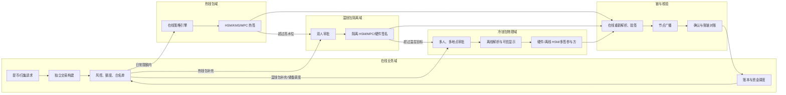
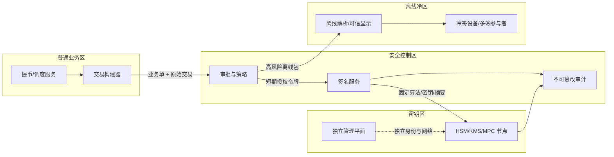
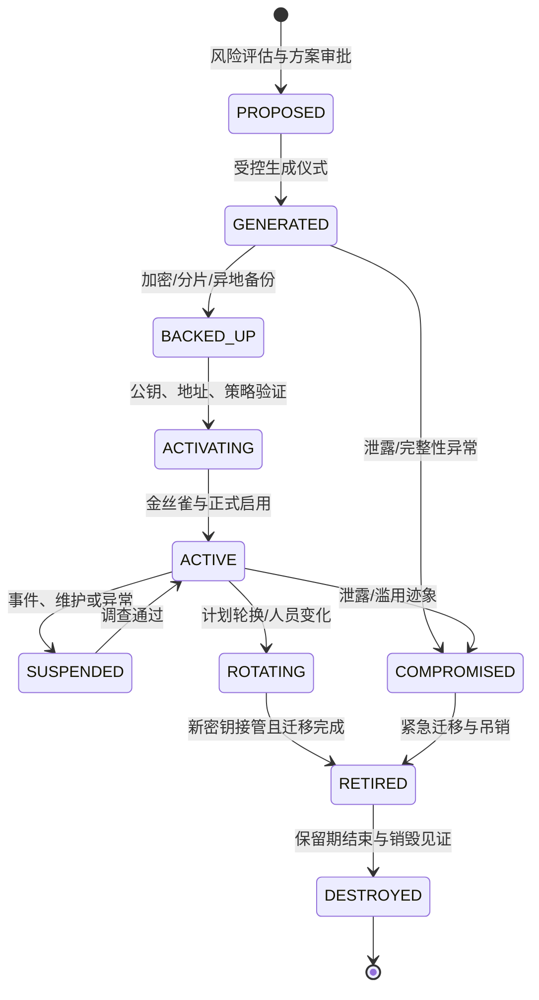
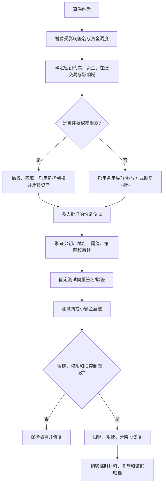

# Day 22：冷热分层、HSM、KMS、MPC 与多签

> 学习目标：掌握热、温、冷钱包的资金、密钥和业务边界；能够比较 HSM、云 KMS、MPC、链上多签与硬件冷钱包；建立密钥生成、导入、备份、恢复、轮换、销毁和审计的完整生命周期；理解阈值签名、职责分离、双人复核、环境隔离及 RTO/RPO；能够设计并演练不依赖单个人、单设备或单机房的灾难恢复方案。  
> 建议用时：5～6 小时  
> 完成标准：制作五种密钥方案对比表，画出热、温、冷钱包资金与审批流，完成密钥生命周期和灾难恢复检查表，并闭卷回答文末恰好 7 道面试题。

## 安全边界与核心结论

- 所有练习只使用测试网、模拟密钥、空设备和虚构人员角色；不要创建、导入、展示或提交任何真实资产密钥、助记词、分片、恢复码或生产凭据。
- “私钥不落盘”不等于安全。攻击者可以滥用签名接口、审批账号、策略配置、构建服务或恢复流程完成合法格式的恶意签名。
- HSM、KMS、MPC、多签和冷钱包解决的问题不同，通常组合使用；不存在替代治理、审计、监控和恢复演练的单一产品。
- 热、温、冷是业务可用性与风险分层，不只是设备温度或是否联网。每层必须定义资金上限、调用来源、审批人数、签名频率和恢复目标。
- 高风险操作必须至少满足职责分离和双人复核。请求人、审批人、密钥管理员、系统管理员和审计人不能由一个身份包办。
- 备份降低不可用风险，同时扩大泄露面。备份必须加密、分片、异地、离线、可盘点、可吊销，并通过恢复演练证明有效。
- MPC 不会消灭密钥风险，只会改变密钥材料和攻击面。终端、协调器、策略、身份系统、供应链及合谋仍可能失陷。
- 链上多签把授权规则放在链上并提供可验证性，但会引入合约、治理、Gas、升级和链兼容风险。
- 密钥轮换不是简单替换数据库字段。链地址、公钥、合约 owner、用户充值映射、白名单和在途交易都需要迁移计划。
- 灾备成功不是“找到了备份”，而是在隔离环境中恢复控制权、验证地址与策略、完成测试签名，并证明不会产生双控制面。

安全不变量：

```text
I1. 明文私钥、完整 Seed 或足以恢复控制权的材料不进入应用内存、日志、工单和代码仓库。
I2. 单个人、单服务、单设备、单云账号或单机房失陷不能独立转走高风险资金。
I3. 签名必须绑定业务单、链、网络、资产、金额、目的地址、费用、有效期和策略版本。
I4. 密钥权限仅授予明确身份和用途，默认拒绝，短期授权，到期自动回收。
I5. 密钥生成、导入、备份、恢复、轮换、停用和销毁都有不可篡改审计证据。
I6. 备份材料在地理、人员、供应商和介质上消除共同故障域。
I7. 恢复不会让旧环境和新环境同时拥有未受控的有效签名能力。
I8. 热钱包单次损失受余额、速率、地址和审批策略限制。
I9. 温冷资金移动需要独立证据、多人审批和链上确认后对账。
I10. RTO/RPO 由实际恢复演练和证据证明，而不是文档中的承诺。
```

---

## 一、先区分五类对象

讨论私钥安全时，经常把不同层次混在一起：

| 层次 | 例子 | 核心问题 |
|---|---|---|
| 密钥材料 | Seed、私钥、MPC share | 谁能恢复或参与控制 |
| 密钥执行环境 | HSM、硬件钱包、隔离签名机 | 私钥在哪里执行签名 |
| 授权协议 | 单签、阈值签名、链上多签 | 几个主体才能授权 |
| 业务治理 | 审批、限额、白名单、时间锁 | 哪些交易允许签名 |
| 资金分层 | 热、温、冷钱包 | 多少资金承担何种可用性风险 |

HSM 是执行边界，MPC 是密码学协作协议，多签是链上授权模型，冷钱包是运行和业务隔离方式。它们不能放在同一维度简单排名。

### 1. 控制权不只等于密钥文件

攻击者可能通过以下路径获得等效控制权：

```text
直接窃取完整私钥或足够阈值分片
控制签名 API 和调用凭据
篡改交易构建结果
接管审批账户或身份提供方
降低策略阈值或修改地址白名单
劫持恢复/轮换仪式
控制 HSM/KMS 管理平面
利用多签合约或升级管理员漏洞
```

因此架构审查应问“谁能导致资金移动”，而不只问“私钥存在哪里”。

---

## 二、热、温、冷钱包分层

### 1. 热钱包

热钱包在线、自动化程度高，用于日常提币、归集 Gas 和小额运营。

推荐边界：

- 只保留短期业务所需资金；
- 严格单笔、日累计、地址、速度和资产限额；
- 仅签名服务可以调用密钥设施；
- 支持快速停机、撤权和资金迁移；
- 交易由独立构建、风控和签名策略复核；
- 余额达到高水位自动热转冷，低水位触发补充。

热钱包追求分钟级或更低的可用性，但要假设在线系统最终可能失陷，并用资金上限限制最大损失。

### 2. 温钱包

温钱包用于补充热钱包、受控归集或中等频率资金调度。它通常在线可达，但签名不应完全自动化。

推荐边界：

- 余额高于热钱包、低于核心冷储备；
- 签名环境与业务生产网隔离；
- 每次操作需要多人审批或独立操作员；
- 使用短时开放网络、单向传输或专用管理通道；
- 按时间窗口和额度批量处理；
- 不接受普通提币服务直接调用。

温钱包的价值是吸收“热钱包必须快”和“冷钱包必须离线”之间的冲突，而不是模糊两者边界。

### 3. 冷钱包

冷钱包保存大部分长期储备，签名环境长期离线或物理隔离，只处理低频、大额、计划性操作。

推荐边界：

- 构建端和签名端物理/网络隔离；
- 交易通过二维码、只读介质或受控单向通道传递；
- 至少双人复核交易的链、网络、地址、金额和费用；
- 使用可信显示屏独立展示待签内容；
- 介质、设备和场地有封条、盘点、录像或见证记录；
- 恢复材料分散保管，任何单方不足以恢复；
- 签名后在在线环境重新解析、验签和广播。

“离线”不能防止恶意交易构建、被替换的固件、错误地址、内部合谋或恢复材料被盗。

### 4. 建议资金分层

| 层级 | 资金目标 | 签名频率 | 自动化 | 审批 | 典型 RTO |
|---|---|---|---|---|---|
| 热 | 数小时至 1～2 天净提币需求 | 高频 | 受策略约束自动化 | 小额自动，大额升级 | 分钟级 |
| 温 | 数天流动性缓冲 | 每日/每周 | 半自动 | 至少双人复核 | 小时级 |
| 冷 | 长期储备与极端风险缓冲 | 低频 | 人工仪式 | 多角色、多地点 | 小时至天级 |

具体比例应由净流出分布、补充耗时、链拥堵、周末值守和风险承受能力计算，而不是固定使用行业百分比。

---

## 三、热、温、冷资金与审批流



### 1. 冷转温/热

1. 资金调度系统基于预测与水位生成业务单；
2. 账本核对目标层余额和在途资金；
3. 风控验证链、资产、目标地址白名单和额度；
4. 多角色审批，冷层还需预约仪式；
5. 在线端构建未签交易及人类可读摘要；
6. 离线端独立解析原始交易并与审批单比对；
7. 达到签名阈值后回传签名交易；
8. 在线端重新解析、验签，确认未超时和地址未变；
9. 广播、确认、账本结算和对账；
10. 只有确认后才计入目标钱包可用水位。

### 2. 热转温/冷

热钱包超过高水位时可自动生成调度，但目标地址必须预先固化在高等级白名单中。自动化可以完成构建和提议，签名是否自动取决于金额与策略；不能因“资金流向冷钱包”就跳过核验。

### 3. 分层切换门禁

| 场景 | 门禁 |
|---|---|
| 热钱包日常提币 | 单笔/累计/速度/地址/链状态全部通过 |
| 温转热 | 水位证据 + 两人审批 + 目标地址固定 |
| 冷转温 | 多地点审批 + 离线签名仪式 + 回传验签 |
| 热转冷 | 固定冷地址 + 风险检查 + 确认后对账 |
| 新增目标地址 | 独立带外验证 + 冷静期 + 多人批准 |
| 紧急调拨 | 不降低密码学阈值，使用预定义应急角色与限额 |

---

## 四、HSM、云 KMS、MPC、多签、冷钱包对比表

| 方案 | 核心机制 | 优势 | 主要风险/限制 | 典型用途 |
|---|---|---|---|---|
| HSM | 密钥在防篡改硬件边界内生成和运算 | 强密钥隔离、细粒度权限、审计、性能稳定 | 设备/集群运维、备份和厂商依赖；API 被滥用仍可签恶意交易 | 热/温签名、根密钥、企业级密钥托管 |
| 云 KMS | 云托管密钥服务和 IAM 控制 | 部署快、高可用、日志与云权限集成 | 算法/曲线和原始签名格式可能不支持目标链；云账号与区域依赖 | 支持算法的热签、信封加密、非链密钥 |
| MPC/TSS | 多方持有 share，协作产生签名，通常不重组完整私钥 | 消除单点完整密钥、参与方可跨地域/云、策略灵活 | 协议实现复杂、协调/终端/供应链风险、活性与 share 备份困难 | 热/温/冷阈值签名、跨组织托管 |
| 链上多签 | 链或合约验证多个独立签名/阈值 | 授权规则可公开验证、参与方实现可异构 | 并非所有链原生支持；合约漏洞、Gas、升级和隐私风险 | 冷储备、DAO/机构金库、管理权限 |
| 硬件冷钱包 | 私钥在离线或专用硬件中签名，人工确认 | 攻击面小、可见确认、适合低频 | 人工错误、设备/固件/供应链、备份泄露、吞吐低 | 冷储备、多签参与者、灾备签名 |

### 1. HSM 的正确边界

HSM 可提供：

- 密钥不可导出或受控导出；
- 设备内生成、签名和密钥包装；
- 操作员卡、角色、集群和审计；
- 认证边界和一定物理防护；
- 高吞吐与标准接口。

HSM 通常不知道一串哈希代表“向陌生地址转出 100 BTC”。业务签名服务必须独立解析交易并执行策略，不能只把任意摘要交给 HSM。

### 2. 云 KMS 的适配检查

接入前逐项确认：

```text
目标曲线：secp256k1 / Ed25519 / 其他
签名算法和哈希模式
输出编码：DER / raw r,s / recovery id
公钥导出格式与地址派生
是否支持 Schnorr、Taproot、TON/Solana 所需语义
吞吐、延迟、配额和跨区域能力
BYOK/HYOK、备份、删除等待期
IAM、私有网络、审计和不可导出保证
```

“支持 ECDSA”不代表支持 secp256k1，也不代表能直接生成某条链要求的签名格式。

### 3. MPC/TSS 的正确边界

以 $t$-of-$n$ 阈值为例，少于 $t$ 个有效参与方不能完成签名：

$$
AvailableShares \ge t
$$

但生产安全还取决于参与方是否真正独立：

```text
独立身份和管理员
独立云/地域/网络
独立代码发布和供应链
独立设备可信根
独立策略确认
受控预计算材料
协议消息认证与防重放
```

若三个 share 都由同一 Kubernetes 管理员和同一 CI 凭据控制，密码学上的 2-of-3 仍可能是运维上的单点。

### 4. 链上多签的正确边界

BTC 可通过 Script/Miniscript/Taproot 策略实现多方授权；EVM 常使用 Safe 等合约；Solana 可用原生/程序化多签；TON 可使用钱包合约能力。具体安全依赖链、合约版本和配置，不能把“多签”当成统一能力。

检查项包括：

- owner/participant 列表与阈值；
- owner 变更和阈值降低权限；
- 合约升级、模块、Guard 和 fallback handler；
- nonce、重放域和链 ID；
- 时间锁与紧急暂停；
- 合约源代码、字节码和部署地址；
- 恢复一名参与方是否会绕过原阈值。

### 5. 冷钱包不是一种密码算法

冷钱包可能使用单签硬件钱包、离线 HSM、MPC 参与方或链上多签。它描述的是低频、隔离、人工仪式和物理治理。生产上通常将硬件隔离与多方授权组合，避免单设备丢失或单操作员作恶。

---

## 五、方案选择：按威胁和业务约束组合

### 1. 选择维度

| 维度 | 要问的问题 |
|---|---|
| 资产风险 | 单笔和累计最大损失是多少？ |
| 吞吐/延迟 | 每秒签名量和响应 SLO 是多少？ |
| 链兼容 | 是否支持目标曲线、格式、派生和链特有交易？ |
| 信任分布 | 需要跨团队、法人、云和地区吗？ |
| 可恢复性 | 允许丢失几个设备/share/人员？ |
| 运维成熟度 | 能否安全管理硬件、协议、固件和仪式？ |
| 合规审计 | 需要何种认证、日志、数据驻留和审批证据？ |
| 退出能力 | 供应商停服时能否迁移控制权？ |

### 2. 组合示例

```text
热钱包：2-of-3 MPC，参与方跨两个云与一个 HSM，在线策略限额
温钱包：HSM 集群 + 双人审批 + 短时开放签名窗口
冷钱包：链上 3-of-5 多签，参与者使用异地硬件冷钱包
信封加密：云 KMS 保护数据库非链上密钥
根恢复：离线分片、双重控制、跨地点保险库
```

这只是架构示例，不是所有组织的默认答案。小团队若无法正确运营复杂 MPC，成熟托管 HSM 配合严格资金上限可能比自研阈值协议更安全。

### 3. 构建还是购买

密码协议和硬件集成优先选择经过公开审计、广泛使用且有安全响应能力的产品。供应商评估至少覆盖：

- 协议与实现审计报告；
- 漏洞披露、补丁与事故历史；
- 管理员是否能降阈值或导出控制权；
- 密钥/share 所有权和退出流程；
- 数据驻留、制裁和账户冻结风险；
- API、SDK、固件与构建供应链；
- 灾备、RTO/RPO 和停止服务演练；
- 责任边界、取证日志和 SLA。

---

## 六、职责分离、双人复核与最小权限

### 1. 角色矩阵

| 角色 | 可以做 | 不可以独立做 |
|---|---|---|
| 业务请求人 | 创建调拨/提币业务单 | 审批自己的请求、改密钥策略 |
| 风控审批人 | 检查金额、地址、风险证据 | 构建或签名交易 |
| 交易构建服务 | 根据已批准参数构建交易 | 修改审批参数、调用任意密钥 |
| 签名服务 | 独立解析并按策略请求签名 | 自行生成资金业务单 |
| 密钥管理员 | 管理设备、角色、生命周期 | 批准业务转账 |
| 系统管理员 | 运维主机、网络和监控 | 读取密钥、降低签名阈值 |
| 审计人员 | 读取证据并复核 | 修改生产配置或签名 |
| 恢复保管人 | 在仪式中提供一份恢复材料 | 单独恢复完整控制权 |

### 2. 最小权限

- 使用工作负载身份和 mTLS，不用共享长期 API Key；
- 按钱包、链、网络和环境隔离密钥权限；
- 签名服务只有 `sign`，没有导出、删除和改策略权限；
- 管理权限使用 Just-In-Time 申请，短时有效并录像/审计；
- 生产与测试使用完全不同的密钥域和身份系统；
- Break-glass 账号离线保管，使用即告警并事后复核；
- 定期做权限再认证，自动回收长期未使用权限。

### 3. 双人复核不是“两个人点同一个按钮”

有效的双人复核要求：

- 独立身份与独立设备；
- 看见相同的规范化交易摘要；
- 审批内容与最终签名 payload 加密绑定；
- 第二人不能被第一人代理登录；
- 高风险操作使用不同组织汇报线；
- 审批后参数变化会使批准失效；
- 批准有有效期，不能无限复用。

---

## 七、环境与网络隔离

### 1. 信任区



### 2. 在线密钥区

- 默认无公网入站；
- 只允许签名服务的固定工作负载身份；
- 管理平面与数据平面分离；
- egress 白名单，防止 share/审计外泄；
- 主机、容器、固件和 SDK 版本固定并签名验证；
- 时间同步、证书和随机数源纳入监控；
- 调试、内存转储和核心转储默认关闭或受控。

### 3. 离线冷区

- 不接入企业办公网和生产网；
- 使用专用洁净设备和已验证启动介质；
- 输入介质只承载最小必要数据并做恶意内容检查；
- 离线端必须自行解析链与交易，而非盲签哈希；
- 输出只包含签名或 PSBT/交易容器，不返回秘密；
- 仪式后清理临时数据并记录设备/介质状态；
- 定期验证封条、设备序列号、固件哈希和时间线。

### 4. 数据二极管思路

理想流程是未签交易单向进入冷区、签名交易单向离开。若使用二维码或移动介质，也要限制数据格式和大小，双方重新解析并校验哈希，防止隐蔽通道与格式解析漏洞。

---

## 八、密钥生命周期总览



每个状态迁移都应有：

```text
key_id / wallet_id / purpose / chain scope
当前状态与版本
请求人、审批人、执行人、见证人
前置检查和证据哈希
设备/供应商/区域标识
策略与权限版本
开始、完成和有效时间
异常、补救和后续任务
审计记录位置
```

不要记录明文密钥、share、助记词或能还原秘密的截图。

---

## 九、密钥生成与导入仪式

### 1. 生成前

- 明确用途、链、网络、算法、派生和签名格式；
- 选择 HSM/KMS/MPC/多签及阈值；
- 建立 key ID、owner、custodian 和审批单；
- 验证设备来源、序列号、固件和防拆状态；
- 使用独立洁净环境、摄像/见证和人员清单；
- 验证随机数来源和供应商生成语义；
- 准备中止条件与异常介质处置方案。

### 2. 生成中

- 至少两名不同职责人员在场；
- 优先在目标安全边界内生成不可导出密钥；
- MPC DKG 参与方应跨故障域并认证协议消息；
- 不允许手机、普通摄像设备或无关人员进入；
- 只导出公钥、证明和备份密文；
- 对所有命令、设备和结果进行双人核对；
- 异常时废弃该次生成，不继续“凑合使用”。

### 3. 生成后验证

- 独立派生并比对公钥和地址；
- 用固定测试向量完成签名/验签；
- 验证 chain ID、算法、编码和低 S 等链特有规则；
- 检查访问策略、限额、审计和告警；
- 完成备份后才允许激活；
- 使用测试网或无价值金丝雀验证完整流程；
- 将地址/公钥纳入资产配置和链上白名单审批。

### 4. 导入的额外风险

导入意味着密钥可能曾在目标安全边界外存在。必须记录来源、暴露历史、包装算法、导入设备和销毁证明。能在安全边界内重新生成并迁移资产时，通常优先于长期信任外部导入密钥。

---

## 十、备份：可恢复性与防泄露的平衡

### 1. 备份设计原则

```text
任何单份备份不足以恢复高风险控制权
任何单地点灾难不会毁掉足够恢复材料
任何单管理员不能读取或替换全部材料
备份静态加密并有完整性与版本验证
保管记录不暴露材料内容
恢复必须经过独立审批和受控环境
旧备份在轮换后可识别、吊销并安全销毁
```

### 2. Shamir 分片与阈值签名 share 不相同

Shamir Secret Sharing 常用于把一个已有秘密拆成 $t$-of-$n$ 恢复片；阈值签名 share 用于直接参与协议而不重组完整私钥。两者的生命周期、刷新、验证与泄露影响不同，不应混用术语。

### 3. 备份故障域矩阵

| 维度 | 需要避免的共同故障 |
|---|---|
| 地理 | 洪水、火灾、停电、战争、司法扣押 |
| 人员 | 同一汇报线、共同出行、同一离职事件 |
| 技术 | 同一云租户、同一 HSM 集群、同一固件漏洞 |
| 供应商 | 停服、账号冻结、供应链后门 |
| 介质 | 同批次介质老化、相同读写设备缺失 |
| 身份 | 同一 IdP、邮箱或手机恢复路径 |

### 4. 备份介质管理

- 使用有编号、防拆封装和环境要求明确的介质；
- 建立入库、借出、归还、盘点和销毁台账；
- 定期检查可读性、腐蚀、磁性/电子介质寿命；
- 保留兼容读取设备和离线软件依赖；
- 备份密文与解密材料分离保管；
- 介质复制和迁移必须使用新的受控仪式；
- 丢失即按潜在泄露处理，而非只按可用性事件处理。

### 5. 恢复验证不暴露生产秘密

首选使用与生产同方案的演练密钥验证流程。生产备份确需验证时，应在经过批准的隔离环境中执行最小操作，控制参与者和输出，恢复后立即清理；不能把生产 Seed 输入普通测试工具。

---

## 十一、密钥轮换与迁移

### 1. 轮换触发

- 固定周期或加密政策变化；
- 员工离职、角色调整或供应商终止；
- 设备、固件、算法或协议漏洞；
- 权限、审计或完整性异常；
- share/备份介质丢失；
- 链升级、合约 owner 或地址架构迁移；
- 疑似泄露或签名滥用。

### 2. 轮换流程

```text
评估影响与冻结变更
生成新 key generation
完成备份、策略和恢复验证
注册新公钥/地址/owner
设置冷静期和小额金丝雀
迁移余额、权限和新请求流量
处理旧地址充值与在途交易
禁止旧密钥新签名
持续监听旧地址和审计事件
保留到法定/业务窗口结束
多人见证销毁旧材料
最终账链与权限对账
```

### 3. 链上轮换差异

| 场景 | 轮换含义 |
|---|---|
| 单签地址 | 生成新地址并把资产迁移，旧地址仍可能收到充值 |
| HD Wallet | 新 Seed/generation 与新派生域，旧地址映射长期保留 |
| BTC 多签 | 更新 descriptor/script 通常产生新地址和新 UTXO 策略 |
| EVM Safe | 链上 owner/threshold 交易，检查模块和升级权限 |
| Solana | 更新 authority 或迁移受控账户，核对 Program 规则 |
| TON | 按钱包合约能力更新控制权或部署新钱包并迁移 |
| MPC | share refresh 可不改变公钥；更换整组密钥则需要链上迁移 |

### 4. 紧急轮换

疑似泄露时优先停止签名、撤销身份、冻结策略变更并迁移可安全控制的资金。不要先销毁旧密钥再发现仍有资产、在途交易或合约权限依赖它。紧急流程也不能由单人绕过阈值。

---

## 十二、停用、销毁与审计

### 1. 停用门禁

- 新密钥已承担所有新业务；
- 旧地址资产和在途交易已清点；
- 合约 owner、白名单和派生服务已迁移；
- 历史验签和审计不依赖可签名能力；
- 旧备份、克隆、快照和灾备副本已清点；
- 法务、合规和取证保留要求已确认。

### 2. 销毁

HSM 使用受控零化和设备证明；KMS 使用计划删除并监控取消删除；介质按类型粉碎、消磁或加密擦除；MPC 要销毁各参与方 share、预计算材料和备份。销毁需要双人见证、资产台账更新和证据，但证据不能包含秘密本身。

### 3. 审计应回答

```text
谁在何时因什么业务请求使用哪一代密钥
批准的交易摘要与最终签名 payload 是否一致
使用了哪些策略、软件、设备和参与方版本
是否达到审批/阈值，是否有失败和绕过尝试
权限和策略由谁变更，何时生效
备份、恢复、轮换和销毁是否按流程完成
审计日志是否完整、时钟一致且不可篡改
```

日志记录 key ID、用途、公钥指纹、请求哈希和结果；不记录私钥、share、Seed、完整恢复材料或不必要的已签敏感载荷。

---

## 十三、RTO、RPO 与灾难恢复设计

### 1. 定义

恢复时间目标：

$$
RTO = \text{从服务中断到恢复可接受能力的最长目标时间}
$$

恢复点目标：

$$
RPO = \text{可接受丢失的状态变化时间窗口}
$$

私钥通常不能接受“丢失最近一天密钥变化”的模糊 RPO。要按对象定义：密钥/share、策略、审批、签名审计、业务状态和链上交易的 RPO 不同。

### 2. 分层目标示例

| 对象 | RTO 示例 | RPO 示例 | 说明 |
|---|---:|---:|---|
| 热签服务 | 15～30 分钟 | 已提交业务与审计近零丢失 | 可切备用参与方/集群 |
| 温签能力 | 2～4 小时 | 密钥与策略零丢失 | 允许人工启用 |
| 冷签能力 | 24～72 小时 | 控制权零丢失 | 强调安全，不追求秒级 |
| 签名审计 | 1 小时内可查询 | 近零丢失 | 异地不可篡改副本 |
| 地址/公钥映射 | 1 小时 | 零丢失 | 可从受控公钥和链证据校验 |

这些值仅用于练习。真实目标由业务影响分析、人员到场时间、链拥堵和合规要求批准。

### 3. 灾难场景

- 单 HSM 故障、整个集群或机房损失；
- 云区域、账号、IdP 或网络隔离；
- 一个或多个 MPC share 不可用/疑似泄露；
- 冷钱包设备损坏或保管人无法到场；
- 备份介质不可读或封条异常；
- 供应商停服、破产或禁止访问；
- 管理员误删密钥、策略或审计；
- 软件升级导致签名格式错误；
- 旧环境失联但可能仍有签名能力；
- 大范围人员离职或内部威胁。

### 4. 恢复优先级

```text
人员安全与事件隔离
停止潜在恶意签名和策略变更
保存审计与取证证据
确认链上资金和在途交易
建立唯一恢复指挥与批准路径
恢复最小可用签名能力
验证地址、公钥、策略和阈值
使用测试向量/测试网/小额金丝雀
恢复受限业务并持续对账
处理旧控制面与完整复盘
```

---

## 十四、灾难恢复流程



### 1. 恢复时必须防止双控制面

若主机房失联，不能假设旧 HSM/MPC 节点已销毁。恢复方案应使用 fencing：撤销证书、关闭网络、提高新策略代次、链上更换 owner 或将资金迁移到新地址。旧环境重新上线时必须因代次或权限失效而无法继续签名。

### 2. 最小恢复验证

1. 核对 key ID、generation、公钥指纹和链地址；
2. 核对参与方、阈值和管理员角色；
3. 核对交易解析、白名单、限额和审批策略；
4. 用固定无价值向量完成签名与验签；
5. 证明签名格式适配目标链；
6. 验证审计、告警、速率限制和紧急停机；
7. 使用测试网或最小金额执行端到端金丝雀；
8. 对账链上结果与内部业务、账本、Outbox；
9. 限额恢复，并为异常设置自动回滚门槛。

### 3. 不能在恢复中做的事

- 将生产备份复制到普通笔记本；
- 在聊天、工单或视频会议中展示分片；
- 为赶 RTO 临时降低多签/MPC 阈值；
- 由同一人获取全部保管材料；
- 跳过公钥和地址验证直接广播；
- 未撤销旧环境就启用完整新控制面；
- 用真实大额交易作为第一个验证样本。

---

## 十五、密钥生命周期检查表

### 1. 规划与选型

- [ ] 已定义钱包层级、用途、资金上限和签名 SLO。
- [ ] 已记录链、网络、算法、曲线、派生和签名格式。
- [ ] 已完成 HSM/KMS/MPC/多签/冷钱包威胁评估。
- [ ] 已定义参与方、阈值、职责和故障域。
- [ ] 已评估供应商管理员、退出和账号冻结风险。
- [ ] 已定义 RTO/RPO、监控、审计和销毁要求。

### 2. 生成与导入

- [ ] 已批准生成/导入仪式、人员和场地。
- [ ] 已验证设备、固件、软件和随机数来源。
- [ ] 已在目标安全边界内生成不可导出密钥。
- [ ] 已完成 DKG/导入过程的双人见证。
- [ ] 已独立核对公钥、地址和链参数。
- [ ] 已完成测试向量签名与验签。
- [ ] 已记录 key ID 和公钥指纹，未记录秘密。

### 3. 备份

- [ ] 已定义阈值、份数和恢复角色。
- [ ] 已跨地理、人员、云和供应商分散材料。
- [ ] 已将备份密文与解密材料分离。
- [ ] 已记录介质编号、封条和保管链。
- [ ] 已验证介质可读性、完整性和版本。
- [ ] 任意单份材料不足以恢复控制权。
- [ ] 已定义丢失、损坏和疑似复制的响应。

### 4. 激活与使用

- [ ] 已部署默认拒绝、最小权限和工作负载身份。
- [ ] 已绑定业务单、交易摘要、策略版本和有效期。
- [ ] 已配置单笔、累计、速率、地址和链状态策略。
- [ ] 已完成测试网/小额金丝雀。
- [ ] 已验证日志脱敏、告警和不可篡改审计。
- [ ] 已验证紧急停机不依赖单一管理员。
- [ ] 已完成生产启用审批和回滚标准。

### 5. 轮换与停用

- [ ] 已生成并验证新 generation 和备份。
- [ ] 已迁移地址、合约 owner、白名单和权限。
- [ ] 已处理旧地址充值和所有在途交易。
- [ ] 已停止旧密钥新签名并持续监控。
- [ ] 已清点旧 share、备份、克隆和预计算材料。
- [ ] 已完成资金、账本、权限和审计对账。

### 6. 销毁

- [ ] 已满足业务、法律、合规和取证保留要求。
- [ ] 已使用适合 HSM/KMS/share/介质的销毁方法。
- [ ] 已双人见证并记录资产状态。
- [ ] 已验证所有副本和灾备材料均在清单中。
- [ ] 已确认销毁不会影响历史验签和审计。

---

## 十六、灾难恢复检查表

### 1. 准备度

- [ ] 灾备方案覆盖单设备、单机房、单云、单人员和供应商退出。
- [ ] 热、温、冷层分别定义 RTO/RPO。
- [ ] 恢复联系人、替补、升级链和带外通信已验证。
- [ ] 恢复场地、设备、软件、介质和网络依赖可用。
- [ ] Break-glass 权限离线保管，使用即告警。
- [ ] 演练密钥与生产方案同构但无真实资产。
- [ ] 恢复过程有中止条件、回滚和证据模板。

### 2. 启动事件

- [ ] 已暂停受影响签名、审批和资金调度。
- [ ] 已确定资产、密钥代次、参与方和影响范围。
- [ ] 已保存审计、主机、供应商和链上证据。
- [ ] 已区分可用性故障与疑似泄露。
- [ ] 已撤销受影响身份、证书和网络路径。
- [ ] 已指定唯一事件指挥和决策记录。

### 3. 恢复执行

- [ ] 所需保管人和见证人满足职责分离。
- [ ] 介质封条、编号、完整性和保管链通过。
- [ ] 恢复在批准的隔离环境完成。
- [ ] 未在任何普通终端重组或展示生产秘密。
- [ ] 已验证 key generation、公钥、地址和阈值。
- [ ] 已验证策略、限额、白名单和管理员权限。
- [ ] 已处理旧环境 fencing，避免双控制面。

### 4. 恢复验证

- [ ] 固定测试向量签名和验签通过。
- [ ] 链特有签名编码和地址派生通过。
- [ ] 审批、日志、告警、速率限制和停机通过。
- [ ] 测试网或最小金额金丝雀端到端通过。
- [ ] 在途交易、链资源和业务状态已收敛。
- [ ] 链上资产、账本和地址余额对账通过。
- [ ] 已测量实际 RTO/RPO 并记录偏差。

### 5. 收尾

- [ ] 已限额、限速、分阶段恢复业务。
- [ ] 已回收临时权限、证书、设备和恢复材料。
- [ ] 已清理临时明文、内存、介质和日志风险。
- [ ] 已记录所有异常、人工决策和未完成项。
- [ ] 已更新 Runbook、联系人、容量和培训。
- [ ] 已为发现的问题指定负责人和截止时间。

---

## 十七、员工离职与权限撤销

### 1. 普通离职流程

```text
HR 事件提前触发 IAM 工作流
撤销 SSO、VPN、堡垒机、云、代码和工单权限
撤销 HSM/KMS/MPC 管理与签名角色
轮换个人证书、令牌和共享过的凭据
转移审批、值班、保管和恢复职责
归还设备、操作员卡、封条和介质
复核近期审批、策略变更和异常访问
更新多签 owner/share 或启动 share refresh
完成权限差异扫描和经理确认
```

### 2. 高风险或非正常离职

- 在通知前同步完成撤权和会话终止；
- 冻结其审批与恢复能力；
- 检查是否掌握备份位置、阈值组合或 Break-glass 信息；
- 视风险轮换密钥、MPC share、多签 owner 和恢复材料；
- 保全审计和设备用于取证；
- 监控异常签名、策略降低、白名单修改和数据导出；
- 不应因为“个人没有完整私钥”就跳过轮换评估。

### 3. 防止休眠权限

权限回收后执行负向测试：原账号、证书、API token、设备和缓存会话均不能访问。定期比较 HR、IAM、云、HSM、MPC、多签和物理保管台账，发现孤儿账号和职责冲突。

---

## 十八、监控与告警

| 信号 | 告警条件示例 | 动作 |
|---|---|---|
| 签名拒绝率 | 突增或同一调用方连续失败 | 检查攻击、策略和版本 |
| 超限/非白名单请求 | 任一高风险命中 | 阻断并升级安全事件 |
| 密钥管理操作 | 导入、导出、删除、阈值/策略变更 | 实时 P0/P1 通知 |
| 管理员登录 | 非维护窗口、异常地域/设备 | 撤权并调查 |
| 审计日志缺口 | 序列断裂、时间漂移、投递停止 | 暂停高风险签名 |
| MPC 参与方 | 可用数接近阈值或 share 完整性异常 | 切备用、暂停或刷新 |
| HSM/KMS 健康 | 集群容量不足、配额、证书将过期 | 扩容/切换，保护签名 |
| 冷钱包介质 | 盘点不符、封条异常、保管人失联 | 按潜在泄露响应 |
| 热钱包余额 | 超高水位或低于紧急水位 | 热转冷、补充或限提 |
| 恢复准备度 | 演练逾期、RTO 超标、依赖不可用 | 禁止扩大资金上限 |

交易哈希、业务单号和 key ID 进入结构化日志/Trace，不作为高基数指标标签。秘密、分片内容和完整签名载荷不得进入观测系统。

---

## 十九、故障演练

### 演练 A：一个 MPC 参与方丢失

1. 在演练环境下停止一个参与方；
2. 验证剩余参与方是否仍满足可用阈值；
3. 检查该 share 是不可用还是可能泄露；
4. 若可能泄露，执行 share refresh 或整组轮换；
5. 验证旧参与方重新上线不能加入当前 generation；
6. 测量恢复耗时并检查审计完整性。

### 演练 B：主 HSM 机房损失

1. 隔离主集群和管理平面；
2. 激活异地集群或恢复受包装密钥；
3. 验证公钥指纹、策略和签名格式；
4. 撤销旧集群证书，防止双控制面；
5. 测试网/小额金丝雀后限速恢复；
6. 核对实际 RTO/RPO 与资金影响。

### 演练 C：冷钱包设备损坏

1. 检查多签剩余参与方是否仍达到阈值；
2. 不尝试在非受控设备输入 Seed；
3. 按恢复仪式启用备用设备；
4. 比对公钥、地址、固件和策略；
5. 更换多签参与方或迁移到新钱包；
6. 销毁损坏设备并更新介质台账。

### 演练 D：离职人员是恢复保管人

1. 撤销所有逻辑和物理权限；
2. 清点其材料是否归还且未复制无法证明；
3. 按潜在泄露决定重新分片/share refresh/轮换；
4. 更新保管人和替补，保持阈值独立性；
5. 对恢复流程做负向权限测试；
6. 复核近期管理操作和签名审计。

### 演练 E：备份介质不可读

1. 保持生产签名不变，暂停破坏性操作；
2. 判断剩余介质是否仍满足恢复阈值；
3. 在批准仪式中从有效材料重建新备份集合；
4. 验证新介质、读取设备和软件兼容；
5. 安全销毁失效介质并更新台账；
6. 检查是否存在同批次老化的共同故障。

---

## 二十、口头面试题参考答案

> 本节严格包含计划中的 7 道题。先闭卷口述，再按“结论 → 原理 → 生产实现 → 异常与风险 → 监控和恢复”补全。

### 1. 私钥应该存在哪里？

**参考回答：**

生产私钥应在经过审计的安全边界内生成并使用，例如 HSM、支持目标链算法的 KMS、独立 MPC 参与方或离线硬件设备；原则上不可导出，不进入业务服务内存、数据库、配置、日志和代码仓库。冷储备通常再叠加物理隔离与链上多签。

但位置不是全部安全边界。签名服务必须独立解析交易，校验业务单、链、地址、金额、费用、有效期和策略；调用权限最小化并多人治理。备份采用阈值、异地和受控恢复，任何单份不足以控制资金。最终目标是没有单人、单系统或单地点能独立转走高风险资产。

### 2. HSM、KMS、MPC 和多签分别解决什么问题？

**参考回答：**

HSM 通过防篡改硬件提供密钥生成、不可导出运算、权限和审计；云 KMS 把类似能力托管化并与 IAM、高可用集成，但要验证曲线与签名格式；MPC/TSS 将控制权分成多个 share，通过阈值协议签名，减少完整私钥单点；多签由链或合约验证多个独立签名，把授权规则放到链上。

它们不能互相完全替代。HSM/KMS 仍可能被合法 API 滥用，MPC 有终端、协调器和合谋风险，多签有合约与治理风险。常见组合是热层 MPC/HSM 加在线策略，冷层异地硬件参与者加链上多签，并配合资金限额、职责分离、审计和灾备。

### 3. MPC 是否等同于绝对安全？

**参考回答：**

不等同。MPC 的价值是签名时通常不重组完整私钥，并要求达到阈值的 share 协作，从密码学上降低单点泄露风险；但如果多个参与方由同一管理员、同一云账号、同一 CI 或同一供应链控制，实际仍可能是单点。

攻击面还包括协议实现、预计算材料、终端内存、身份系统、协调器、策略篡改、恶意交易构建、参与方合谋和拒绝服务。生产上需跨故障域部署、设备绑定、协议消息认证、独立审批、限额、share 刷新、供应商审计和退出演练。安全来自系统控制组合，不来自“MPC”标签。

### 4. 冷钱包为什么仍需要安全流程和审计？

**参考回答：**

离线只减少网络攻击面，不能防止恶意未签交易、地址替换、固件供应链、设备丢失、备份泄露、操作失误和内部合谋。冷钱包通常持有最高价值资产，一次错误的影响更大，因此流程应比热钱包更严格。

生产上要有多人多地点审批、可信显示独立解析、介质和设备保管链、固件验证、交易摘要绑定、签后重新解析验签、广播确认与对账。审计记录参与者、设备、策略、业务单和结果而不记录秘密，使组织能证明操作合规、发现异常并在事故后取证。

### 5. 密钥备份如何兼顾可恢复性与防泄露？

**参考回答：**

使用阈值和故障域分散：任何单份备份、单保管人或单地点不足以恢复控制权，但在允许的设备、人员或地点损失后仍有至少 $t$ 份材料。备份静态加密，密文与解密材料分离，介质有编号、防拆、盘点、完整性和寿命管理。

恢复只能在隔离环境中由多人批准执行，并核对 key generation、公钥、地址和策略。定期用同构演练密钥验证流程，必要的生产验证严格限制输出。介质丢失既是可用性事件也是潜在泄露事件，需要重新分片、share refresh 或密钥轮换，不能只补刻一份。

### 6. 如何处理员工离职和权限撤销？

**参考回答：**

由 HR 事件驱动自动撤销 SSO、VPN、云、堡垒机、HSM/KMS/MPC、审批、多签和物理保管权限，终止会话并轮换个人证书与其接触过的共享凭据。转移值班、审批、备份保管和恢复职责，再做权限差异扫描与负向测试。

若离职人员持有 share、多签 owner、操作员卡或知道恢复材料位置，要评估其是否仍能与他人合谋达到控制阈值；必要时执行 share refresh、owner 变更、重新分片或整组密钥迁移。非正常离职应在通知前同步撤权、保全审计并检查近期异常，不能因其没有完整私钥就认为无需处置。

### 7. 恢复演练为什么必须定期执行？

**参考回答：**

未演练的备份只能证明介质存在，不能证明它可读、版本兼容、人员可到场、权限有效、依赖仍可获得，也不能证明承诺的 RTO/RPO。人员、设备、固件、供应商、链规则和组织职责都会变化，文档很容易失效。

演练应覆盖单设备、机房、云、参与方、介质和供应商故障，验证恢复后的公钥、地址、阈值、策略、签名格式、审计和旧控制面 fencing。使用演练密钥或最小风险金丝雀，测量实际 RTO/RPO，把偏差转为负责人和期限；未通过时不应扩大资金上限。

---

## 二十一、当天任务

### 任务 1：方案对比（45～60 分钟）

- [ ] 完成 HSM、KMS、MPC、多签和冷钱包对比表。
- [ ] 为 BTC/EVM/Solana/TON 核对算法与多签能力。
- [ ] 选择热、温、冷层方案并说明不选择其他方案的原因。
- [ ] 列出供应商退出、账号冻结和共同故障域。

### 任务 2：资金与审批流（45～60 分钟）

- [ ] 画出热、温、冷钱包资金与审批流。
- [ ] 定义每层资金上限、签名频率和自动化程度。
- [ ] 定义冷转温、温转热、热转冷的审批和确认门禁。
- [ ] 验证任何单一角色不能独立完成高风险调拨。

### 任务 3：密钥生命周期（60 分钟）

- [ ] 完成生成、备份、激活、轮换、停用和销毁检查表。
- [ ] 使用模拟密钥设计一次生成仪式。
- [ ] 为每个状态迁移定义审批、证据和中止条件。
- [ ] 设计链地址与合约 owner 的轮换迁移。

### 任务 4：备份与灾备（60～90 分钟）

- [ ] 定义备份阈值和地理、人员、供应商故障域。
- [ ] 为热、温、冷分别定义 RTO/RPO。
- [ ] 演练单个机房或一个 MPC share 丢失。
- [ ] 验证恢复后不存在旧/新双控制面。

### 任务 5：权限与人员（45 分钟）

- [ ] 制作请求、审批、签名、密钥管理、运维和审计 RACI。
- [ ] 设计 JIT 权限和 Break-glass 流程。
- [ ] 推演恢复保管人非正常离职。
- [ ] 对撤权结果执行负向权限测试。

### 任务 6：口述（30～45 分钟）

- [ ] 不看资料回答本节恰好 7 道题并录音。
- [ ] 每题说明方案边界、失效模式和恢复证据。
- [ ] 用 10 分钟白板讲清私钥管理架构。
- [ ] 将薄弱点写入 `progress.md`。

---

## 二十二、闭卷验收

- [ ] 能区分密钥材料、执行环境、授权协议、治理和资金分层。
- [ ] 能说明热、温、冷钱包的业务和安全边界。
- [ ] 能按净流出、补充时延和风险定义资金水位。
- [ ] 能画出热、温、冷资金与审批流。
- [ ] 能比较 HSM、KMS、MPC、多签和硬件冷钱包。
- [ ] 能说明 HSM 为何不能替代交易策略。
- [ ] 能检查 KMS 的曲线、格式和链兼容性。
- [ ] 能说明 MPC 的密码学阈值与运维独立性。
- [ ] 能识别 MPC 终端、协调器和供应链风险。
- [ ] 能检查链上多签 owner、阈值、模块和升级风险。
- [ ] 能说明冷钱包不是一种密码算法。
- [ ] 能设计跨人员、云、区域和供应商的控制权。
- [ ] 能建立请求、审批、构建、签名、运维和审计职责分离。
- [ ] 能解释有效双人复核如何绑定最终 payload。
- [ ] 能设计 JIT 权限、Break-glass 和权限再认证。
- [ ] 能划分普通业务区、安全控制区、密钥区和离线区。
- [ ] 能完成密钥生成与导入仪式。
- [ ] 能独立验证公钥、地址、签名格式和链参数。
- [ ] 能区分秘密分片和阈值签名 share。
- [ ] 能设计阈值、异地、加密和可盘点备份。
- [ ] 能管理备份介质寿命、读取依赖和保管链。
- [ ] 能完成单签、HD、多签和 MPC 的轮换计划。
- [ ] 能处理旧地址充值、在途交易和合约权限迁移。
- [ ] 能完成密钥停用、销毁和证据归档。
- [ ] 能分别定义热、温、冷层 RTO/RPO。
- [ ] 能防止灾备后的旧/新双控制面。
- [ ] 能用测试向量与金丝雀验证恢复结果。
- [ ] 能处理员工离职、share 和多签 owner 撤换。
- [ ] 能监控签名、管理操作、审计缺口和恢复准备度。
- [ ] 闭卷回答恰好 7 道面试题。

## 二十三、Day 22 验收清单

- [ ] 已完成五种密钥方案对比表。
- [ ] 已完成热、温、冷钱包资金与审批流。
- [ ] 已完成密钥生命周期检查表。
- [ ] 已完成灾难恢复检查表。
- [ ] 已定义三层资金上限、审批和 RTO/RPO。
- [ ] 已核验目标链算法和签名格式兼容性。
- [ ] 已标出设备、人员、云、区域和供应商故障域。
- [ ] 已定义任何单方不能独立控制高风险资金。
- [ ] 已完成最小权限和职责分离矩阵。
- [ ] 已完成双人复核和 payload 绑定设计。
- [ ] 已设计在线密钥区与冷钱包物理隔离。
- [ ] 已完成模拟生成/导入仪式。
- [ ] 已完成备份阈值和介质保管方案。
- [ ] 已设计计划轮换和紧急迁移方案。
- [ ] 已处理旧地址、在途交易和链上权限。
- [ ] 已设计停用、销毁和审计证据。
- [ ] 已演练一个 MPC 参与方丢失。
- [ ] 已演练单机房或 HSM 集群损失。
- [ ] 已演练冷钱包设备或备份介质故障。
- [ ] 已验证恢复后没有双控制面。
- [ ] 已通过测试向量和无价值金丝雀验证。
- [ ] 已测量实际 RTO/RPO 并记录偏差。
- [ ] 已推演员工非正常离职和权限负向测试。
- [ ] Git 中没有私钥、Seed、share、助记词、恢复码或生产凭据。
- [ ] 已录音回答 7 道题并更新 `progress.md`。

## 二十四、30 分自评分

| 能力 | 1 分 | 3 分 | 5 分 | 今日得分 |
|---|---|---|---|---|
| 冷热分层 | 只知道冷热概念 | 能定义三层用途 | 能按流动性、风险、审批和恢复量化分层 |  |
| 方案选型 | 会列产品名 | 能比较基础优缺点 | 能按链兼容、威胁、故障域和退出能力组合选型 |  |
| 密钥生命周期 | 只关注生成 | 有备份和轮换 | 能覆盖仪式、证据、迁移、销毁和异常响应 |  |
| 权限治理 | 使用管理员账号 | 有 RBAC 和审批 | 能实现职责分离、JIT、双人复核和负向验证 |  |
| 灾难恢复 | 有一份备份 | 能恢复测试密钥 | 能测量 RTO/RPO、防双控制面并分阶段恢复 |  |
| 安全表达 | 说“私钥不落盘” | 能解释技术边界 | 能覆盖恶意调用、内部人、供应链、监控和恢复 |  |

**当日总分：** ____ / 30  
**热/温/冷方案：** ______________________________  
**签名阈值与独立故障域：** ______________________________  
**备份阈值与保管地点：** ______________________________  
**热/温/冷 RTO：** ______________________________  
**关键对象 RPO：** ______________________________  
**恢复演练实际耗时：** ______________________________  
**发现的单点或双控制面风险：** ______________________________  
**明日优先补强：** ______________________________