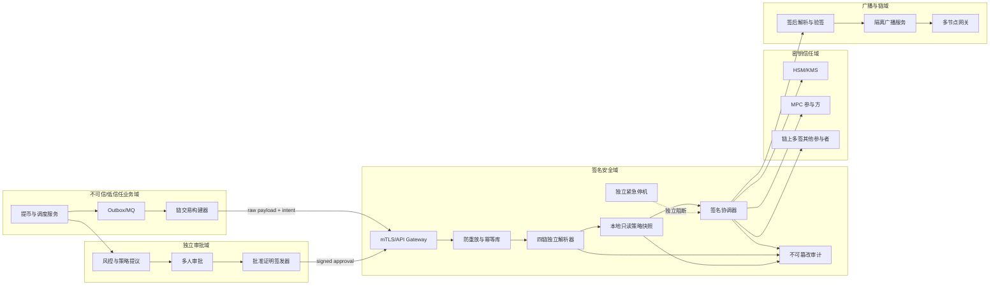
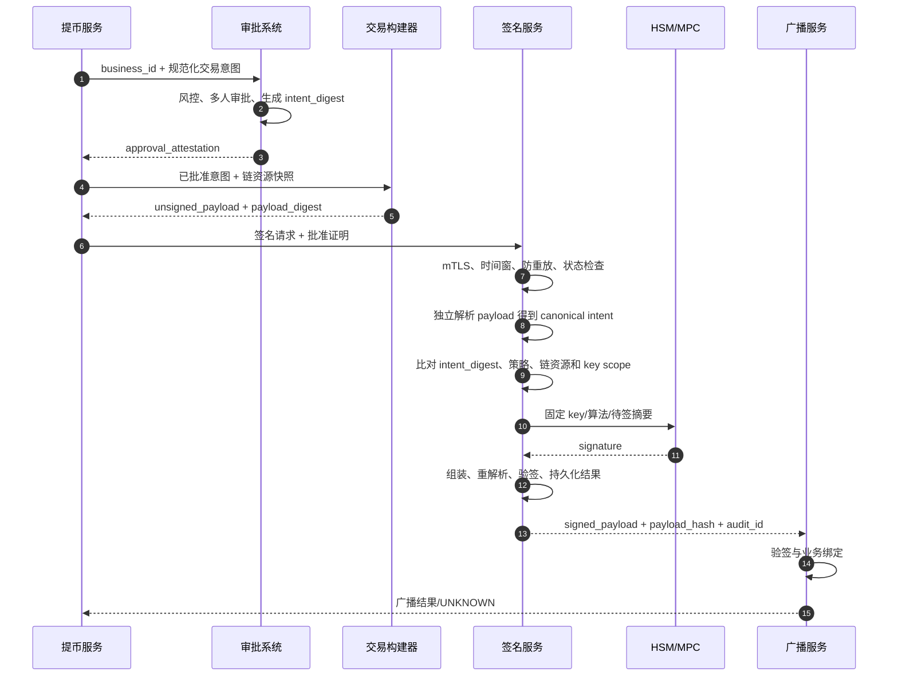
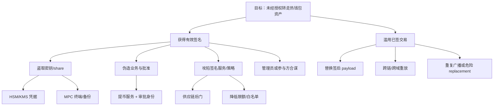

# Day 23：独立签名服务与威胁建模

> 学习目标：把业务申请、交易构建、审批、签名和广播划分为独立信任域；让签名服务自行解析 BTC、EVM、Solana、TON 交易并验证业务语义；使用 mTLS、短期工作负载身份、请求签名、Nonce、时间窗和业务绑定防止伪造与重放；建立金额、地址、资产、费用、合约和速率策略；用 STRIDE 与攻击树覆盖外部入侵、内部作恶和供应链风险；设计限额、熔断、紧急停机、密钥轮换和泄露响应。  
> 建议用时：5～6 小时  
> 完成标准：画出独立签名服务安全架构和信任边界，完成至少 15 项威胁模型，设计签名请求结构与服务端校验清单，并闭卷回答文末恰好 7 道面试题。

## 安全边界与核心结论

- 所有练习仅使用测试网、固定夹具和无价值模拟密钥；不要创建、导入或记录真实私钥、Seed、MPC share、HSM 凭据和生产签名载荷。
- 签名服务不是“远程调用私钥”的薄代理，而是资金流出的最后独立策略执行点。
- 不能只接收哈希并签名。哈希没有可验证业务语义，签名服务无法判断链、金额、目的地址、手续费、合约调用和授权是否被篡改。
- mTLS 只证明调用方工作负载身份，不证明请求内容符合业务批准。身份、内容完整性、授权、时效和幂等必须分别验证。
- 签名批准应绑定规范化交易意图和最终待签 payload。任一安全关键字段变化都必须使旧批准失效。
- 提币服务、构建器、审批系统和签名服务不能共享数据库写权限、管理员身份或部署凭据，否则逻辑隔离只是图上的方框。
- 防重放至少需要唯一请求 ID、业务幂等键、客户端 Nonce、短时间窗、一次性状态和请求内容摘要；Redis 不能作为唯一防线。
- 策略默认拒绝。未知链、未知资产、未知合约、无法解析字段、超额费用、过期请求和策略服务不一致都应 Fail Closed。
- 日志要能证明“谁基于什么批准签了什么”，但不能记录私钥、完整秘密、认证凭据或不必要的原始敏感载荷。
- 即使签名服务失陷，也要通过资金分层、HSM/MPC 独立策略、链上多签、余额与速率限额、独立紧急停机限制最大损失。

安全不变量：

```text
I1. 签名服务只接受允许的调用身份、链、网络、钱包、算法和用途。
I2. 业务批准、规范化交易意图与最终 payload 使用稳定摘要加密绑定。
I3. 任一签名请求最多产生一个受认可的签名效果，重复请求返回同一结果或拒绝。
I4. 签名服务独立解析原始交易，不信任调用方提供的展示字段。
I5. 无法完整解析或策略无法确定时拒绝签名，不允许“未知字段透传”。
I6. 同一管理员不能同时篡改业务、策略、签名代码和密钥控制面。
I7. 密钥设施只允许签名服务使用指定 key、算法和上下文，不能任意导出或改策略。
I8. 签名、拒绝、策略变更和管理操作产生不可篡改、可关联的审计证据。
I9. 紧急停机路径独立于普通业务与签名服务部署，并且定期演练。
I10. 疑似泄露时先阻断控制权和保护证据，再迁移资金、轮换密钥并证明恢复一致。
```

---

## 一、为什么要独立签名服务

### 1. 不可信上游假设

签名服务应假设以下任一组件可能已失陷：

```text
提币 API 可伪造业务单或篡改地址
交易构建器可替换输出、合约和费用
MQ 可重复、延迟、乱序或注入消息
审批前端可展示 A、实际批准 B
配置中心可下发恶意白名单和限额
节点可返回错误 nonce、UTXO 或模拟结果
内部管理员可滥用合法权限
CI/CD 可发布被植入后门的构建
```

签名服务不能解决所有上游失陷，但必须独立验证它能够判断的事实，并把剩余风险限制在预先批准的边界内。

### 2. 五个阶段的职责

| 阶段 | 权威输入 | 主要职责 | 不应拥有 |
|---|---|---|---|
| 业务服务 | 用户请求、余额、业务状态 | 幂等受理、冻结、业务编排 | 密钥调用权、策略修改权 |
| 构建服务 | 已批准意图、链资源 | 构建确定性未签交易、模拟 | 最终审批权、密钥权限 |
| 审批/风控 | 业务与风险证据 | 批准规范化意图和限额 | 私钥、任意交易构建权 |
| 签名服务 | 原始交易、批准证明、策略 | 独立解析、校验、签名编排 | 用户余额写权、广播权 |
| 广播服务 | 已签交易和业务身份 | 验签、广播、未知结果恢复 | 重新签名或改交易权 |

### 3. 为什么只签哈希危险

若接口只有：

```text
sign(key_id, hash)
```

签名服务无法知道：

- 哈希属于 BTC、EVM、Solana、TON 还是任意文档；
- 交易是否在正确网络和 Chain ID；
- 目的地址、金额、资产、手续费和找零；
- EVM 是否在调用恶意合约或无限授权；
- Solana 指令和可写账户是否超出批准范围；
- TON 消息链、`seqno`、有效期与 Bounce 设置；
- BTC SIGHASH 是否覆盖所有关键输入输出；
- 同一哈希是否曾在其他业务单中被签名。

正确接口应接收可完整解析的链特有 payload、规范化业务意图和可验证批准证明，并由签名服务自行计算待签摘要。

---

## 二、独立签名服务安全架构与信任边界



### 1. 主要信任边界

| 边界 | 保护对象 | 主要控制 |
|---|---|---|
| 业务域 → 签名域 | 请求真实性、完整性和时效 | mTLS、工作负载身份、请求签名、时间窗 |
| 审批域 → 签名域 | 不可伪造批准 | 独立签发密钥、多人审批、intent digest |
| 签名服务 → 密钥域 | key 使用与算法约束 | 独立身份、固定 key policy、HSM/MPC 阈值 |
| 签名域 → 广播域 | 签名 payload 不被替换 | payload hash、签后重解析、验签 |
| 管理平面 → 数据平面 | 策略和部署完整性 | JIT、双人批准、签名发布物、独立审计 |

### 2. 真隔离的最低要求

- 独立账户/项目、网络、数据库和部署流水线；
- 签名服务只能读取业务批准，不写用户余额；
- 提币服务不能直连 HSM/KMS/MPC；
- 审批证明由独立密钥签发，签名服务本地验签；
- 策略采用签名版本包，普通业务不能即时修改；
- 管理员权限 JIT、多人批准、短期有效并实时告警；
- 审计异步写入独立存储，业务服务不能删除；
- 紧急停机由安全值班或硬件/网络控制面独立触发。

---

## 三、端到端签名流程



### 1. 批准绑定

批准对象不应是易变 JSON 字符串，而是版本化、规范化意图：

```text
intent_digest = H(
  schema_version || business_id || business_type ||
  chain || network || asset_id || wallet_id ||
  canonical_recipients || max_amount || max_fee ||
  allowed_contract_call || resource_constraints ||
  expires_at || policy_version
)
```

签名服务从原始交易重新解析出同样的 canonical intent，再计算摘要并比对。不要信任请求中调用方预填的 `to_address` 或 `amount`。

### 2. 签名结果状态

```text
RECEIVED
AUTHENTICATED
PARSED
POLICY_APPROVED
SIGNING
SIGNED
REJECTED
SIGN_RESULT_UNKNOWN
QUARANTINED
```

HSM/MPC 超时可能是结果未知。恢复时按 `signing_request_id + payload_digest + key_generation` 查询，不应创建一个无关联的新签名意图。

---

## 四、签名请求数据结构

下面是用于设计评审的 Java 风格契约，不包含真实密钥或可广播载荷：

```java
public record SigningRequest(
    String schemaVersion,
    String signingRequestId,
    String businessType,
    String businessId,
    String idempotencyKey,
    String callerId,
    String requestNonce,
    Instant issuedAt,
    Instant expiresAt,
    ChainContext chain,
    WalletContext wallet,
    String unsignedPayloadBase64,
    String payloadDigest,
    CanonicalIntent claimedIntent,
    ApprovalAttestation approval,
    String policyVersion,
    TraceContext trace
) {}

public record ChainContext(
    String chain,
    String network,
    String chainId,
    String transactionType,
    String adapterVersion
) {}

public record WalletContext(
    String walletId,
    String keyId,
    String keyGeneration,
    String derivationRef,
    String sourceAddress,
    String purpose
) {}

public record CanonicalIntent(
    String assetId,
    List<Recipient> recipients,
    BigInteger totalAmountBaseUnit,
    BigInteger maxFeeBaseUnit,
    ContractCall contractCall,
    ResourceConstraints resources
) {}

public record ApprovalAttestation(
    String approvalId,
    String intentDigest,
    List<String> approverRoleIds,
    int requiredApprovals,
    Instant approvedAt,
    Instant expiresAt,
    String approvalPolicyVersion,
    String issuerKeyId,
    String signature
) {}
```

### 1. 字段规则

| 字段 | 规则 |
|---|---|
| `schemaVersion` | 白名单版本；未知版本拒绝 |
| `signingRequestId` | 全局唯一，持久化唯一索引 |
| `businessId` | 绑定提现/归集/调拨业务单，不可复用 |
| `idempotencyKey` | 绑定业务效果、payload 和 key generation |
| `requestNonce` | 调用方单次随机值，防止请求重放 |
| `issuedAt/expiresAt` | 短时间窗，限制时钟偏差和最大 TTL |
| `chain` | 链、网络、Chain ID、交易类型必须一致 |
| `wallet` | key、代次、地址、派生和用途白名单 |
| `unsignedPayload` | 可完整独立解析，有严格大小上限 |
| `payloadDigest` | 签名服务重新计算后比对 |
| `claimedIntent` | 仅用于差异提示，不作为权威解析结果 |
| `approval` | 独立验签、未过期、摘要和策略均匹配 |
| `policyVersion` | 必须为已激活且未吊销的签名策略 |

### 2. 不应出现的字段

- 明文私钥、Seed、MPC share 或恢复材料；
- 允许调用方自由指定的算法与任意 key handle；
- “跳过校验”“管理员强制签名”等布尔开关；
- 未版本化任意 JSON 扩展字段；
- 仅有哈希而没有可解析 payload；
- 调用方自行声明的 `riskPassed=true` 而无可验证证明。

### 3. 规范序列化

批准与请求签名必须定义确定性编码：字段顺序、数字最小单位、地址规范、空值、列表顺序和版本都固定。优先使用规范化 Protobuf/CBOR 等明确格式，不依赖普通 JSON 文本的字段顺序或浮点数。

---

## 五、服务端校验清单

校验顺序应先便宜后昂贵，但任何失败都必须停止，不进入 HSM/MPC。

### 1. 传输与调用身份

- [ ] TLS 版本、密码套件和服务端证书符合策略。
- [ ] 双向证书链、SAN、工作负载身份和环境匹配。
- [ ] 证书未过期、未吊销，调用身份允许指定操作。
- [ ] 来源网络、服务账号和部署代次在白名单内。
- [ ] 请求体大小、速率和并发未超限。
- [ ] Trace 头只用于关联，不能参与授权决策。

### 2. 请求完整性与防重放

- [ ] schema 版本受支持，未知字段按策略拒绝。
- [ ] 请求级签名/MAC 覆盖全部安全关键字段。
- [ ] `issuedAt` 不在未来容忍窗外，`expiresAt` 未过期。
- [ ] TTL 不超过该业务类型的最大值。
- [ ] `requestNonce` 未被调用身份使用过。
- [ ] `signingRequestId` 与幂等键唯一约束通过。
- [ ] 重复请求的 payload、批准和 key generation 完全一致。
- [ ] 已拒绝/隔离/签名完成的请求不能被状态回退。

### 3. 业务与批准证明

- [ ] `businessId` 存在且处于允许签名状态。
- [ ] 业务类型只允许指定钱包与 key purpose。
- [ ] 冻结、审核和链资源预留证据完整。
- [ ] 批准证明由可信独立签发者验签通过。
- [ ] 批准人数、角色和职责分离满足要求。
- [ ] 请求人没有审批自己的高风险请求。
- [ ] 批准未过期、未撤销，策略版本已激活。
- [ ] 批准中的 `intentDigest` 与本地解析结果一致。

### 4. 原始交易解析

- [ ] 使用指定版本链适配器完整消费所有字节。
- [ ] 链、网络、Chain ID、交易类型一致。
- [ ] 交易可由目标 key/address 合法签名。
- [ ] 所有输入、输出、Instruction、Message 和合约调用可识别。
- [ ] 不允许尾随字节、重复字段、非规范编码和解析歧义。
- [ ] payload digest 由服务端重新计算并比对。
- [ ] 解析结果再次规范化，生成服务端 canonical intent。
- [ ] 未识别扩展、Program、ABI selector 或消息类型默认拒绝。

### 5. 金额、资产和地址策略

- [ ] 资产由链原生身份确定，不按名称或 symbol 判断。
- [ ] 金额使用最小单位整数，精度版本一致。
- [ ] 单笔、日累计、滚动窗口和钱包余额限额通过。
- [ ] 所有目的地址网络、格式、Checksum 和类型正确。
- [ ] 地址在批准白名单内，满足新增地址冷静期。
- [ ] 找零地址、退款地址和中间账户属于本钱包。
- [ ] 禁止地址、制裁/风险状态和内部冲突检查通过。
- [ ] 批量输出总额与逐项金额重新求和一致。

### 6. 手续费与资源策略

- [ ] 费用绝对值和费率均未超批准上限。
- [ ] 费用与金额比率未异常。
- [ ] UTXO、nonce、Blockhash/Durable Nonce、`seqno` 预留一致。
- [ ] BTC 输入属于钱包且未被其他 ACTIVE 请求占用。
- [ ] EVM nonce、交易类型和 EIP-1559 字段符合策略。
- [ ] Solana Fee Payer、Blockhash、账户锁和 Compute Budget 合理。
- [ ] TON `seqno`、valid_until、send mode 和 Bounce 设置正确。
- [ ] replacement 必须绑定原业务与完整 lineage。

### 7. 合约与链特有策略

- [ ] EVM `to`、代码哈希、selector、参数和 `value` 白名单通过。
- [ ] Token 合约身份、decimals 和收款人从 calldata 独立解析。
- [ ] `approve`/permit 的 spender、额度和有效期受限。
- [ ] Proxy implementation、管理员和代码版本符合批准快照。
- [ ] Solana Program ID、Instruction、账户角色和可写权限受限。
- [ ] SPL Mint、源/目标 ATA 与 authority 正确。
- [ ] TON Wallet/Jetton Master、目标 Wallet、消息链和 `query_id` 合理。
- [ ] BTC Script、SIGHASH、找零、RBF 和粉尘策略通过。

### 8. 签名前最终门禁

- [ ] 策略快照签名有效且未被紧急吊销。
- [ ] 紧急停机未开启，钱包/链/资产未暂停。
- [ ] HSM/MPC key generation 与地址映射一致。
- [ ] 当前时间仍在批准和链交易有效期内。
- [ ] 并发与速率预算仍可用。
- [ ] 审计存储可写或满足预定义安全降级条件。
- [ ] 将请求状态以数据库 CAS 推进到 `SIGNING`。

### 9. 签后校验

- [ ] 在服务内验证签名和公钥。
- [ ] 组装后重新解析完整签名交易。
- [ ] 规范化意图仍与批准摘要一致。
- [ ] 计算并持久化 signed payload hash 和预期链身份。
- [ ] 签名结果与请求状态原子关联。
- [ ] 审计事件写入独立不可篡改存储。
- [ ] 输出仅发送给允许的广播服务身份。

---

## 六、四链独立解析重点

| 链 | 必须独立解析 | 关键拒绝条件 |
|---|---|---|
| BTC | inputs、prevout、outputs、找零、fee、Script、SIGHASH、RBF | 未知输入、非钱包找零、危险 SIGHASH、费用异常 |
| EVM | typed tx、chain ID、nonce、to/value、Gas、calldata、access list | 未知 selector/合约、无限授权、错误 chain ID、费用超限 |
| Solana | message、Blockhash、Fee Payer、signers、accounts、Instructions | 未知 Program、额外 signer/可写账户、Mint/ATA 不匹配 |
| TON | wallet version、`seqno`、valid_until、send mode、Messages、BOC | 未知消息、错误目标/Jetton、危险 send mode、过期 |

### 1. BTC

仅解析当前交易不够，签名服务需要可信 prevout 快照或可验证 PSBT 元数据来计算输入金额与手续费。不能盲信构建器提供的 `inputAmount`。PSBT 中未知字段、派生路径和 UTXO 类型必须按钱包策略处理。

### 2. EVM

普通转账的 `to/value` 易读，合约调用的真实业务语义在 calldata 和合约代码身份中。签名服务使用版本化 ABI/selector 白名单，并将代理 implementation 或代码哈希纳入批准证据。模拟是附加证据，不替代静态策略。

### 3. Solana

必须检查全部账户元数据，因为恶意构建器可增加 signer、可写账户或不同 Program。Address Lookup Table 的内容要按固定 slot/可验证快照解析，不能只信调用方展开结果。

### 4. TON

钱包外部消息成功不代表内部消息业务成功，但签名前仍需校验 wallet version、`seqno`、有效期、send mode、目标消息及 Jetton 身份。签名服务限制被授权的消息组合，链后续结果由确认服务跟踪。

---

## 七、认证、时间窗与防重放

### 1. 分层控制

```text
mTLS：谁建立连接
工作负载授权：谁可调用哪个接口和钱包
请求签名：传输外内容是否被修改
时间窗：请求可被接受多久
Nonce：同一调用方请求是否首次出现
幂等键：同一业务效果是否已处理
状态机：当前业务是否允许签名
批准证明：交易语义是否被独立授权
```

任何一层都不能替代其余层。

### 2. 时间处理

- 使用 UTC 和可信时间同步；
- 监控时钟偏差，超过阈值暂停签名；
- 签名服务以本地可信时间判断，不采用请求方时间；
- 不同业务配置最大 TTL，冷签批准可更长但要更严格；
- 链自身有效期也必须检查，例如 Solana Blockhash 和 TON `valid_until`。

### 3. 防重放存储

MySQL 唯一约束保护：

```sql
UNIQUE (signing_request_id)
UNIQUE (caller_id, request_nonce)
UNIQUE (business_type, business_id, signing_generation)
UNIQUE (key_id, key_generation, payload_digest)
```

Redis 可用于快速拒绝近期 Nonce，但 Redis 丢失不能允许第二次资金效果。请求状态、幂等结果和签名审计以持久化数据库为准。

### 4. 重复请求决策

| 情况 | 处理 |
|---|---|
| 同 request ID、同内容、已完成 | 返回原结果引用，不再次调用密钥 |
| 同 request ID、内容不同 | 拒绝并触发安全告警 |
| 同业务、同 generation、不同 payload | 拒绝或进入批准后的 replacement 流程 |
| HSM/MPC 超时 | 标记结果未知，按原 request 查询 |
| 批准已过期 | 拒绝，重新审批而非延长字段 |
| 链资源已变化 | 拒绝并回到构建/审批，不在签名层偷偷修改 |

---

## 八、策略引擎

### 1. 策略层级

```text
全局紧急策略
环境策略
链/网络策略
钱包层级策略
资产策略
业务类型策略
地址/合约策略
金额/费用/速率策略
请求特定批准约束
```

冲突时取更严格结果。策略必须版本化、签名、审批、灰度和可回滚，签名审计记录实际使用版本。

### 2. 金额与速率

建议同时限制：

- 单笔最大值；
- 按钱包/资产/目的地址的小时与日累计；
- 请求数量与金额速率；
- 新地址首笔和冷静期额度；
- 热钱包剩余余额和高低水位；
- 异常时间、地域和运营窗口；
- 失败、拒绝和策略命中速率。

限额计数需要强一致或保守预留。不能只依赖可丢失的 Redis 计数器。

### 3. 地址与合约白名单

白名单条目至少包含：

```text
chain / network / canonical address
asset or contract identity
purpose / allowed methods
amount and time limits
code hash / proxy implementation where applicable
created_by / approved_by
effective_at / expires_at
version / revocation status
```

新增与提额需独立带外核验、多人批准和冷静期。DNS、前端显示或工单文本不能作为地址身份的唯一依据。

### 4. 策略不可用

签名服务保留最后一个已签名、未过期的只读策略快照。若无法证明快照有效或紧急吊销状态未知，高风险签名 Fail Closed。不能为了可用性从普通配置中心直接读取未验证策略。

---

## 九、STRIDE 威胁建模方法

STRIDE 分类：

| 类别 | 含义 | 签名系统例子 |
|---|---|---|
| S：Spoofing | 身份伪造 | 假冒提币服务调用签名 API |
| T：Tampering | 数据篡改 | 替换目的地址、策略或发布物 |
| R：Repudiation | 抵赖 | 管理员否认修改阈值 |
| I：Information Disclosure | 信息泄露 | 日志泄露 payload、凭据或 share |
| D：Denial of Service | 拒绝服务 | 请求洪峰耗尽 HSM/MPC 配额 |
| E：Elevation of Privilege | 权限提升 | 运维账号获得 key admin/sign 权限 |

### 1. 建模步骤

1. 盘点资产：密钥、签名能力、策略、批准、审计、可用性；
2. 画数据流、进程、存储和外部实体；
3. 标出每条信任边界和管理员控制面；
4. 对每个元素逐项应用 STRIDE；
5. 记录攻击前提、影响、现有控制和残余风险；
6. 为高风险项定义预防、检测、响应和负责人；
7. 用故障注入或红队演练验证，而非只勾选文档。

---

## 十、钱包威胁模型（24 项）

| ID | STRIDE | 威胁与攻击路径 | 主要预防 | 检测与响应 |
|---|---|---|---|---|
| T01 | S | 攻击者伪造提币服务身份调用签名 API | mTLS、工作负载身份、网络白名单、短期证书 | 异常身份告警、撤销证书、隔离来源 |
| T02 | T | 提币服务失陷后替换收款地址或金额 | 独立解析、intent digest、批准证明、地址/金额策略 | 摘要不匹配 P0，暂停调用方 |
| T03 | T | 构建器加入隐藏输出、恶意合约或额外 Instruction | 完整字节消费、链特有解析、未知字段拒绝 | 解析差异审计、隔离构建版本 |
| T04 | S/T | 伪造或篡改审批结果 | 独立审批域、签名 attestation、多角色阈值 | 验签失败告警、撤销 issuer key |
| T05 | T | 前端展示地址 A，批准/签名地址 B | 可信摘要、带外核验、批准绑定 canonical intent | 展示与解析差异告警、冻结请求 |
| T06 | S/T | 重放旧签名请求 | Nonce、时间窗、唯一索引、状态机、幂等结果 | 重放率告警、吊销调用身份 |
| T07 | T | 同业务使用不同 payload 请求第二次签名 | business/generation 唯一约束、replacement lineage | 冲突即 P0，暂停钱包 |
| T08 | E | 管理员给自己授予 sign/key admin 权限 | JIT、双人批准、职责分离、PAM | 权限变更实时告警、撤权取证 |
| T09 | E/T | 管理员降低 MPC/多签阈值或扩充 owner | 阈值变更多人批准、冷静期、链上监控 | owner/threshold 变化 P0、迁移资产 |
| T10 | I | 日志、Trace、Dump 泄露秘密或敏感 payload | 脱敏、禁止 core dump、最小日志、加密 | DLP/秘密扫描、轮换凭据与密钥评估 |
| T11 | I | HSM/KMS 凭据或 MPC share 被窃取 | 不可导出、设备绑定、独立故障域、短期身份 | 异常使用检测、share refresh/轮换 |
| T12 | D | 洪峰耗尽签名线程、HSM session 或 MPC 预计算 | 有界队列、调用方配额、隔离仓、背压 | 容量告警、熔断低优先级请求 |
| T13 | D | 攻击者制造大量昂贵解析 payload | 大小/复杂度限制、解析超时、前置认证 | CPU/拒绝率告警、封禁来源 |
| T14 | T | 配置中心推送恶意白名单或无限限额 | 签名策略包、多人签名、版本和生效窗口 | 策略 diff 告警、回滚、暂停签名 |
| T15 | T/E | CI/CD 或依赖供应链植入后门 | 签名构建、SBOM、双人发布、隔离 runner、复现构建 | 制品证明验证、回滚、密钥迁移评估 |
| T16 | T | 链解析库出现差异或反序列化漏洞 | 双实现/测试向量、模糊测试、未知格式拒绝 | 解析崩溃/差异告警、停用版本 |
| T17 | T | 节点返回恶意 nonce、UTXO、Blockhash 或合约状态 | 多节点交叉验证、资源数据库、固定锚点 | 节点冲突告警、隔离和重建请求 |
| T18 | R | 操作员否认审批、策略或密钥管理操作 | 强身份、不可篡改审计、可信时间、双人见证 | 审计完整性检查、事件调查 |
| T19 | T/R | 审计事件被删除、延迟或伪造 | append-only/WORM、独立账号、哈希链、异地副本 | 序列缺口告警，高风险签名 Fail Closed |
| T20 | S | DNS/证书/服务发现劫持到假 HSM 或广播服务 | 双向证书 pinning、私有发现、固定身份 | 握手异常告警、吊销与隔离 |
| T21 | E | 紧急停机被业务管理员关闭或绕过 | 独立安全控制面、硬件/网络阻断、双人恢复 | 定期演练、状态不一致即暂停 |
| T22 | T | 回滚旧版本服务以绕过新策略 | 防回滚代次、制品证明、策略最低版本 | 版本漂移告警、隔离实例 |
| T23 | T/E | 灾备恢复产生旧新双控制面 | fencing、证书撤销、key generation、链上迁移 | 同 key 多地域异常告警、立即停机 |
| T24 | S/T | 内部人员合谋创建请求、审批并签名 | 跨汇报线职责分离、MPC/多签独立方、资金限额 | 行为分析、强制休假、审计与轮换 |

### 2. 风险评分

可用简化矩阵：

$$
RiskScore = Likelihood \times Impact
$$

其中 Likelihood 和 Impact 各取 1～5。资金系统还应单独标记：

```text
是否可导致不可逆资金损失
是否绕过多人控制
是否跨钱包/链扩散
是否难以被链上与审计发现
是否影响恢复和证据完整性
```

高影响低概率事件，如根密钥泄露和阈值降低，仍需 P0 预案。

---

## 十一、攻击树：任意转走热钱包资产



攻击树帮助寻找组合路径。例如 mTLS 能阻止陌生客户端，但不能阻止“被攻陷的合法提币服务 + 被盗审批身份”。对应防线应跨域独立，而不是堆在同一服务里。

---

## 十二、限制签名服务失陷后的最大损失

### 1. 外部于签名服务的控制

- 热钱包只保留短期流动性；
- HSM/MPC 端限制 key、算法、调用身份和签名速率；
- 大额使用独立 MPC 方或链上多签二次批准；
- 广播服务仅接受已登记 request/payload hash；
- 链上白名单、时间锁或合约 Guard（链支持时）；
- 节点与监控独立观察异常资金流；
- 独立安全团队可断网、吊销证书或暂停链上模块；
- 温冷钱包不接受在线签名服务直接控制。

### 2. 损失上界思路

热层最大暴露不应只等于当前余额，还要考虑补充自动化：

$$
MaxExposure \le HotBalance + AutoRefillLimit + InFlightValue
$$

若热钱包被持续自动补充，攻击者可能反复抽干。温转热需独立限额、异常停止和累计损失检测。

### 3. 熔断条件

任一条件可触发钱包、资产、链或全局熔断：

```text
未知调用身份或证书异常
同业务不同 payload 冲突
批准摘要与解析结果不一致
多 ACTIVE 签名 generation
策略包验签失败或版本回退
审计不可写/序列缺口
签名速率或金额突增
非白名单合约/地址请求
密钥管理、阈值或 owner 异常变化
疑似私钥/share/管理员凭据泄露
```

熔断解除必须多人批准，并证明原因、请求状态、链资源、资金与审计已收敛。

---

## 十三、紧急停机设计

### 1. 分级停机

| 级别 | 范围 | 仍允许 |
|---|---|---|
| L1 | 单调用方/实例 | 其他健康调用方、查询和审计 |
| L2 | 单钱包/资产/链 | 不受影响钱包、确认和对账 |
| L3 | 所有在线签名 | 查询、链确认、内部幂等结算 |
| L4 | 密钥控制面与资金迁移事件 | 只读取证据和经批准应急操作 |

### 2. 停机路径

至少有两个独立路径：

- 签名服务本地策略 `deny all`；
- API Gateway/网络阻断调用身份；
- HSM/KMS 撤销 sign 权限；
- MPC 参与方拒绝协议；
- 链上多签 Guard/模块暂停（若安全设计支持）。

不能只有一个签名服务内部按钮，因为服务失陷时攻击者可忽略它。

### 3. 安全恢复

1. 确认停机覆盖所有实例、区域和 key generation；
2. 导出不可变审计和链上资金快照；
3. 收敛 `SIGNING` 与结果未知请求；
4. 修复根因并发布签名制品；
5. 轮换受影响身份、批准 issuer 或密钥；
6. 使用测试向量和无价值金丝雀；
7. 限钱包、限额、限速逐步恢复；
8. 持续对账并设置自动回退阈值。

---

## 十四、签名日志与审计

### 1. 应记录

```text
audit_event_id / trace_id
signing_request_id / business_id / idempotency_key
caller workload identity / certificate fingerprint
chain / network / wallet_id / key_id / key_generation
schema / adapter / policy / service build version
canonical intent digest / unsigned and signed payload hash
approval_id / approver role IDs / approval digest
解析摘要：资产、目的地址脱敏标识、金额档位、费用
决策结果 / 拒绝原因 / 命中策略
HSM/MPC operation reference（非秘密）
timestamps / latency / instance / region
```

### 2. 不能记录

- 私钥、Seed、MPC share、恢复材料；
- HSM/KMS/MPC 完整认证凭据；
- 完整 Authorization header、客户端密钥；
- 未经必要性评估的完整原始交易或个人信息；
- 可用于绕过审批的秘密值；
- 策略例外 token 或 Break-glass 秘密；
- 调试内存、core dump 和完整密码学中间量。

### 3. 完整性

审计采用独立账号、append-only/WORM、跨区域复制、事件序号和哈希链。定期把摘要锚定到独立系统。签名服务不能删除或覆盖记录；审计链路失效时，高风险签名应停止。

### 4. 可检索性

必须能够从以下任一标识追到完整链路：

```text
withdrawal_id / funding_operation_id
signing_request_id
approval_id
payload_digest / signed_payload_hash
chain transaction identity
key_id + generation
caller identity / service build
```

---

## 十五、供应链与发布安全

### 1. 构建控制

- 固定并校验依赖和插件；
- 生成 SBOM 与构建 provenance；
- 隔离、短生命周期 runner，不保存生产凭据；
- 制品签名，部署前由独立验证器校验；
- 分支保护、双人评审和安全测试；
- 解析器做模糊测试、差分测试和固定链测试向量；
- 生产运行时只允许批准 digest 的镜像；
- 禁止在线下载脚本、插件、ABI 或依赖。

### 2. 发布门禁

```text
单元/集成/链测试向量通过
反序列化与解析模糊测试通过
旧版本请求兼容与拒绝策略明确
策略与 schema 迁移已演练
制品、SBOM、签名和审批齐全
灰度实例只使用测试 key 或低额度钱包
监控、回滚和紧急停机已验证
```

### 3. 防回滚

签名服务、策略包、schema 和链适配器都有最低允许代次。回滚到已知漏洞版本必须被拒绝并告警，不能将“快速回滚”变成绕过新策略的路径。

---

## 十六、私钥疑似泄露应急预案

### 1. 触发信号

- 未知业务单对应的有效签名或链上交易；
- HSM/KMS/MPC 异常调用、导出或管理事件；
- share、备份、操作员卡或管理员设备丢失；
- 策略、阈值、owner 或白名单未授权变更；
- 签名服务供应链被确认植入；
- 热钱包出现无法解释的资金流出。

### 2. 前 15 分钟

```text
触发独立 L3/L4 停机
撤销签名与管理身份、阻断网络
暂停热钱包自动补充和相关充提
保存 HSM/MPC、IAM、签名、审批、部署和链上证据
确认受影响 key、generation、链、钱包和在途请求
建立单一事件指挥与带外通信
```

不要先重启、清日志或销毁设备，这会破坏证据。

### 3. 控制资金

- 若仍可信控制旧密钥，向预先验证的新安全钱包迁移；
- 多签立即移除/替换疑似 owner 并检查模块、Guard 和阈值；
- MPC 执行 share refresh 或整组新 DKG，取决于泄露范围；
- HSM/KMS 创建新 generation，吊销旧 key 使用权；
- 关闭温冷对热层的自动补充；
- 与链、资产、合规和运营团队协调冻结/监控可疑地址；
- 避免抢跑式迁移与攻击者形成费用竞赛，使用预案和链特有策略。

### 4. 调查与范围确认

1. 从首次异常前窗口审查所有签名与拒绝；
2. 比对批准意图、payload、签名和链上效果；
3. 检查调用身份、管理员、CI/CD、策略和依赖；
4. 确认备份、share、旧代次和灾备环境；
5. 查找持久化、后门和旧新双控制面；
6. 对所有地址资产、在途交易、账本和用户负债对账。

### 5. 恢复门禁

- 根因已修复或风险被隔离；
- 新密钥/参与方/owner 在独立环境生成和验证；
- 旧控制权已吊销、迁移或无法达到阈值；
- 签名服务制品、策略、身份和审计重新建立信任；
- 所有异常签名和链上交易已分类；
- 账链、业务、账本和用户负债已对账；
- 测试向量、测试网和最小金额金丝雀通过；
- 先低额度、低速率恢复，并保留自动停机阈值。

---

## 十七、监控与告警

| 指标/事件 | 建议告警 | 级别 | 动作 |
|---|---|---|---|
| 批准摘要不匹配 | 任一 | P0 | 拒绝、暂停调用方、调查篡改 |
| 同 request ID 内容冲突 | 任一 | P0 | 熔断钱包，保全证据 |
| 多 ACTIVE generation | 任一 | P0 | 全面暂停相关业务 |
| 非白名单地址/合约 | 任一高风险请求 | P1/P0 | 拒绝并核查来源 |
| 金额/费用超限 | 持续或大额单次 | P1 | 拒绝、检查攻击或配置 |
| 签名速率/金额 | 超基线或预算 | P1 | 限流、暂停自动补充 |
| HSM/MPC 结果未知 | 任一大额或持续增长 | P1 | 查询原请求，不新建签名 |
| 管理/阈值/owner 变更 | 任一 | P0 | 独立确认、必要时停机 |
| 策略验签/版本回退 | 任一 | P0 | Fail Closed、回滚制品 |
| 审计序列缺口 | 任一不可解释缺口 | P0/P1 | 暂停高风险签名 |
| mTLS/身份拒绝 | 突增或敏感身份 | P1 | 撤销证书、隔离来源 |
| 解析器异常 | 崩溃/差异/未知格式突增 | P1 | 隔离版本和调用方 |

交易哈希、业务 ID 和 request ID 放日志/Trace，不作为 Prometheus 高基数标签。指标标签只使用链、网络、钱包层级、策略结果、错误类别和服务版本等有限集合。

---

## 十八、验证与故障演练

### 演练 A：提币服务被攻陷

1. 使用合法工作负载身份提交篡改目的地址的交易；
2. 保持业务单和批准证明不变；
3. 验证签名服务独立解析后 intent digest 不一致；
4. 请求被拒绝且不调用 HSM/MPC；
5. 触发 P0、熔断调用方并保全请求证据；
6. 原合法请求在人工确认后可从独立路径恢复。

### 演练 B：旧请求重放

1. 重放一个已完成请求的完整网络报文；
2. 验证 mTLS 合法仍不能绕过 Nonce/唯一约束；
3. 同内容返回原结果引用，不产生第二次密钥调用；
4. 修改一个字节后使用同 request ID；
5. 验证冲突拒绝和安全告警；
6. 检查数据库、审计和 HSM 调用次数。

### 演练 C：策略配置被篡改

1. 在普通配置中心把单笔限额提高 100 倍；
2. 验证签名服务不读取未签名配置；
3. 提交伪造策略包和旧版本包；
4. 验证验签/最低代次失败并 Fail Closed；
5. 检查策略变更告警、审计和回滚；
6. 演练合法双人批准与冷静期发布。

### 演练 D：HSM/MPC 超时

1. 在密钥设施完成或可能完成操作后丢弃响应；
2. 请求进入 `SIGN_RESULT_UNKNOWN`；
3. 验证不创建新 generation 和不同 payload；
4. 按 request ID/payload digest 查询或恢复；
5. 结果唯一落库并只输出一次；
6. 对照 HSM/MPC 审计确认实际调用次数。

### 演练 E：签名服务供应链失陷

1. 模拟未签名或 provenance 不符的镜像；
2. 部署门禁拒绝该制品；
3. 模拟已运行实例版本漂移；
4. 运行时监控隔离实例并触发紧急停机；
5. 发布可信版本、轮换工作负载身份；
6. 评估密钥是否需迁移并验证恢复金丝雀。

### 演练 F：内部管理员合谋路径

1. 画出创建请求、批准、改策略、部署和 key admin 权限；
2. 尝试找出最少合谋角色集合；
3. 把关键权限分到不同汇报线和故障域；
4. 增加链上多签/MPC 独立方与资金限额；
5. 验证单一管理员离职后无法继续控制；
6. 记录剩余合谋风险和检测手段。

---

## 十九、设计评审清单

### 1. 架构与边界

- [ ] 业务、构建、审批、签名、密钥和广播分属独立信任域。
- [ ] 提币服务不能直连密钥设施或修改签名策略。
- [ ] 签名服务无余额写权、无任意广播权。
- [ ] 管理平面与数据平面身份和网络隔离。
- [ ] 审计与紧急停机独立于普通业务控制面。
- [ ] 温冷钱包不接受在线热签服务直接控制。

### 2. 请求与批准

- [ ] 请求 schema 版本化并使用规范序列化。
- [ ] 业务单、payload、批准、key generation 加密绑定。
- [ ] 有 mTLS、工作负载授权、请求签名和短时间窗。
- [ ] Nonce、唯一索引、幂等结果和状态机共同防重放。
- [ ] 审批证明由独立签发方签名，包含角色与有效期。
- [ ] 参数变化会使批准失效，不存在通用强制签名开关。

### 3. 解析与策略

- [ ] 签名服务完整独立解析 BTC/EVM/Solana/TON payload。
- [ ] 未知字段、合约、Program、Message 和解析歧义默认拒绝。
- [ ] 金额使用最小单位整数并重新求和。
- [ ] 地址、资产、合约代码和调用方法按链身份验证。
- [ ] 手续费、链资源、replacement 和有效期受控。
- [ ] 单笔、累计、速率、钱包余额和自动补充有上限。
- [ ] 策略包签名、版本化、冷静期、灰度和防回滚。

### 4. 密钥与运行

- [ ] key、算法、钱包、用途和调用身份在 HSM/MPC 端受限。
- [ ] HSM/MPC 超时按结果未知恢复，不盲目重签。
- [ ] 签后重新解析、验签并持久化 signed payload hash。
- [ ] 队列、线程池、HSM session 和解析复杂度有界。
- [ ] 发布物有 SBOM、provenance、制品签名和部署验证。
- [ ] 审计 append-only、异地、连续且可按业务查询。

### 5. 响应与恢复

- [ ] 有调用方、钱包、链、全局分级熔断。
- [ ] 有至少两个独立紧急停机路径。
- [ ] 热钱包损失上界包含自动补充与在途金额。
- [ ] 私钥泄露预案覆盖停机、取证、迁移和轮换。
- [ ] 恢复检查旧新双控制面、请求未知状态和账链一致。
- [ ] 使用测试向量、测试网和最小金额金丝雀恢复。

---

## 二十、口头面试题参考答案

> 本节严格包含计划中的 7 道题。先闭卷口述，再按“结论 → 原理 → 生产实现 → 异常与风险 → 监控和恢复”补全。

### 1. 为什么签名服务不能只接收哈希并直接签名？

**参考回答：**

哈希没有业务语义。只接收哈希时，签名服务无法确认它属于哪条链，也看不到地址、金额、资产、手续费、合约调用、SIGHASH 或账户权限，因此被攻陷的上游可以让它签任意内容。

生产签名服务应接收可完整解析的链特有 payload、业务单和独立批准证明，自行计算待签摘要，将解析出的规范化意图与批准摘要比对，再执行金额、地址、合约、费用、链资源和速率策略。未知格式默认拒绝，签后重新解析和验签，并把 payload hash 与业务单写入不可篡改审计。

### 2. 如何防止被攻陷的提币服务任意转走资金？

**参考回答：**

不能把提币服务的合法身份等同于交易合法。业务、构建、审批、签名、密钥和广播要分属独立信任域；签名服务独立解析原始交易，并验证由独立审批域签发的 intent digest、多人角色、有效期和策略版本。

进一步通过地址/合约白名单、单笔与累计限额、链资源绑定、热钱包水位、HSM/MPC 独立调用策略和链上多签限制损失。若提币服务提交被篡改 payload，摘要不匹配就拒绝并熔断该身份。即使签名服务也失陷，温冷层隔离和独立紧急停机仍要阻止风险扩散。

### 3. 如何防止旧签名请求被重放？

**参考回答：**

需要多层防线：mTLS 识别调用方，请求签名保护内容，`issuedAt/expiresAt` 限制时间窗，调用方 Nonce 防止网络报文复用，数据库唯一索引保护 request ID 和业务 generation，状态机确保终态不回退，批准证明也有有效期和 intent digest。

同 request ID、同内容的重复请求返回原结果引用，不再次调用密钥；内容不同则作为安全冲突拒绝。HSM/MPC 超时进入结果未知并按原 request 查询。Redis 只能快速拦截，资金幂等最终由持久化唯一约束和业务状态保证。

### 4. 签名日志应该记录什么，又不能记录什么？

**参考回答：**

应记录审计 ID、业务/request/approval ID、调用工作负载身份、链网络、wallet/key generation、payload 与 intent 摘要、策略/解析器/服务版本、审批角色、决策结果、拒绝原因、密钥操作引用、时间、实例和区域，以便从业务单追到链上交易。

不能记录私钥、Seed、MPC share、恢复材料、认证凭据、Break-glass 秘密、密码学中间量或无必要的完整敏感 payload。审计存入独立 append-only/WORM 存储并检查序列完整性；日志缺口对高风险签名应 Fail Closed。

### 5. 签名服务被入侵后如何限制最大损失？

**参考回答：**

控制必须位于签名服务之外：热钱包只保留短期流动性，HSM/MPC 限制调用身份、key、算法与速率，大额需要独立 MPC 方或链上多签，广播服务只接受已登记 payload hash，温冷钱包不接受热签直接控制，安全团队有独立断网和撤权路径。

损失上界要计入热余额、自动补充上限和在途金额。异常签名速率、非白名单地址、策略回退或审计缺口触发分级熔断，同时停止温转热。恢复需更换可信制品和身份，评估密钥迁移，收敛未知请求并完成账链对账与小额金丝雀。

### 6. 内部管理员如何做到不能单独盗币？

**参考回答：**

将业务请求、风险审批、交易构建、签名运维、密钥管理、发布和审计分给不同角色与汇报线；使用 JIT 权限、双人审批、独立设备和不可篡改审计。管理员不能同时改策略、部署代码、调用密钥和删除日志。

高风险资金再通过跨故障域 MPC、链上多签和冷钱包多人仪式约束。关键配置和 owner/阈值变化有冷静期与实时告警。还要分析最小合谋集合、定期权限再认证、强制休假和离职负向测试，因为职责分离只能降低单人风险，不能自动消灭合谋。

### 7. 发现私钥疑似泄露后的应急步骤是什么？

**参考回答：**

首先触发独立紧急停机，撤销签名和管理身份、阻断网络、停止热钱包自动补充及相关充提，同时保存 HSM/MPC、IAM、审批、部署和链上证据。确认受影响 key generation、钱包、链、资产、在途请求与泄露时间窗。

随后在可信环境生成新控制权，按链特性迁移资金、替换多签 owner、刷新 MPC share 或轮换 HSM/KMS key，阻断旧控制面。调查全部签名与链上效果，完成资产、业务、账本和用户负债对账。根因修复、旧权力失效、可信发布物和审计恢复后，使用测试向量与最小金额金丝雀，再限额限速恢复。

---

## 二十一、当天任务

### 任务 1：安全架构（60 分钟）

- [ ] 画出业务、构建、审批、签名、密钥和广播信任域。
- [ ] 标出网络、身份、数据、管理和审计边界。
- [ ] 证明提币服务不能直连密钥设施。
- [ ] 设计至少两个独立紧急停机路径。

### 任务 2：签名请求与校验（60～90 分钟）

- [ ] 完成版本化签名请求数据结构。
- [ ] 定义 canonical intent 和 approval attestation。
- [ ] 为四条链分别列出独立解析字段。
- [ ] 完成签前、签中、签后校验清单。

### 任务 3：防重放与幂等（45 分钟）

- [ ] 设计 mTLS、请求签名、Nonce、时间窗和唯一索引。
- [ ] 推演同 request ID 同内容和不同内容两种重试。
- [ ] 推演 HSM/MPC 响应丢失后的结果未知恢复。
- [ ] 验证 Redis 丢失不会产生第二次签名效果。

### 任务 4：威胁建模（60 分钟）

- [ ] 用 STRIDE 复核本文 24 项威胁。
- [ ] 为每项高风险威胁补充负责人和残余风险。
- [ ] 画出“任意转走热钱包资产”攻击树。
- [ ] 找出最少合谋角色集合并改进职责分离。

### 任务 5：事件演练（45～60 分钟）

- [ ] 演练被攻陷提币服务篡改地址和金额。
- [ ] 演练旧请求重放与策略包回滚。
- [ ] 演练签名服务供应链失陷。
- [ ] 演练热钱包私钥疑似泄露与资金迁移。

### 任务 6：口述（30～45 分钟）

- [ ] 不看资料回答本节恰好 7 道题并录音。
- [ ] 每题覆盖独立控制、最大损失、监控和恢复。
- [ ] 用 10 分钟白板讲清安全签名系统。
- [ ] 将薄弱点写入 `progress.md`。

---

## 二十二、闭卷验收

- [ ] 能解释为什么签名服务是独立策略执行点。
- [ ] 能区分业务、构建、审批、签名和广播职责。
- [ ] 能画出独立签名服务安全架构与信任边界。
- [ ] 能说明只签哈希为何无法验证业务语义。
- [ ] 能设计规范化 intent 和不可伪造批准证明。
- [ ] 能设计版本化、确定性序列化签名请求。
- [ ] 能让 payload、业务单、批准和 key generation 加密绑定。
- [ ] 能使用 mTLS 与工作负载身份识别调用方。
- [ ] 能用请求签名、Nonce、时间窗和唯一索引防重放。
- [ ] 能处理相同和冲突幂等请求。
- [ ] 能处理 HSM/MPC 签名结果未知。
- [ ] 能独立解析 BTC 输入、输出、费用与 SIGHASH。
- [ ] 能独立解析 EVM calldata、合约身份和授权。
- [ ] 能独立解析 Solana Program、账户与 Instruction。
- [ ] 能独立解析 TON 消息、`seqno` 和 send mode。
- [ ] 能检查金额、地址、资产、手续费和链资源。
- [ ] 能设计版本化、签名和防回滚策略包。
- [ ] 能使用单笔、累计、速率和余额限额。
- [ ] 能设计地址/合约白名单和冷静期。
- [ ] 能用 STRIDE 分析至少 15 项威胁。
- [ ] 能画攻击树并识别组合攻击路径。
- [ ] 能覆盖外部入侵、内部合谋和供应链攻击。
- [ ] 能说明 HSM/MPC 外部控制如何限制损失。
- [ ] 能计算热余额、自动补充和在途资金暴露。
- [ ] 能设计分级熔断和两个独立紧急停机路径。
- [ ] 能记录可审计字段且不泄露秘密。
- [ ] 能验证审计日志连续、不可篡改和可查询。
- [ ] 能设计签名制品 SBOM、provenance 和发布门禁。
- [ ] 能执行私钥疑似泄露应急预案。
- [ ] 能证明恢复后旧控制权失效且账链一致。
- [ ] 闭卷回答恰好 7 道面试题。

## 二十三、Day 23 验收清单

- [ ] 已完成独立签名服务安全架构图。
- [ ] 已标出至少五条信任边界。
- [ ] 已完成不少于 15 项钱包威胁模型。
- [ ] 已完成签名请求数据结构。
- [ ] 已完成服务端逐项校验清单。
- [ ] 已定义 canonical intent 与批准摘要。
- [ ] 已定义 mTLS、请求签名、Nonce 和时间窗。
- [ ] 已建立持久化幂等与状态机约束。
- [ ] 已为四条链定义独立解析要求。
- [ ] 已定义金额、地址、资产和手续费策略。
- [ ] 已定义合约/Program/Message 白名单。
- [ ] 已定义单笔、累计、速率和钱包余额限制。
- [ ] 已完成策略签名、版本、灰度和防回滚。
- [ ] 已画出热钱包资产攻击树。
- [ ] 已覆盖管理员合谋和供应链威胁。
- [ ] 已定义签名日志记录与禁止字段。
- [ ] 已设计审计序列完整性监控。
- [ ] 已定义分级熔断和独立紧急停机。
- [ ] 已计算包含自动补充的最大资金暴露。
- [ ] 已演练提币服务篡改 payload。
- [ ] 已演练旧请求重放和 HSM/MPC 超时。
- [ ] 已演练策略/制品版本回退。
- [ ] 已演练私钥疑似泄露事件。
- [ ] 已验证恢复后没有双控制面。
- [ ] Git 中没有私钥、Seed、share、生产凭据或真实敏感载荷。
- [ ] 已录音回答 7 道题并更新 `progress.md`。

## 二十四、30 分自评分

| 能力 | 1 分 | 3 分 | 5 分 | 今日得分 |
|---|---|---|---|---|
| 架构隔离 | 签名代码在提币服务内 | 有独立签名 API | 信任域、身份、数据、管理和停机真正独立 |  |
| 请求校验 | 只签哈希 | 能检查基础字段 | 能独立解析四链、绑定批准并拒绝歧义 |  |
| 身份与防重放 | 只有 API Key | 有 mTLS 和 Nonce | 时间窗、请求签名、唯一约束、状态机和未知恢复完整 |  |
| 威胁建模 | 只列黑客盗钥 | 能使用 STRIDE | 能覆盖组合路径、内部合谋、供应链和残余风险 |  |
| 损失控制 | 依赖签名服务自身 | 有限额和熔断 | 密钥层、多签、资金分层、停机和自动补充上限独立 |  |
| 事件响应 | 重启服务 | 能暂停和轮换 | 能取证、迁移、对账、防双控制面并分阶段恢复 |  |

**当日总分：** ____ / 30  
**信任边界数量：** ______________________________  
**威胁模型高风险项：** ______________________________  
**最小合谋角色集合：** ______________________________  
**热钱包最大暴露估算：** ______________________________  
**重放演练结果：** ______________________________  
**紧急停机实际耗时：** ______________________________  
**私钥泄露演练恢复证据：** ______________________________  
**明日优先补强：** ______________________________