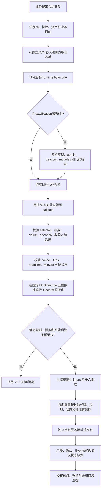

# Day 24：智能合约交互与合约安全

> 学习目标：理解 Solidity Storage、`call`、`delegatecall`、ABI、Event 与 EVM 执行上下文；掌握 ERC-20、ERC-721、ERC-1155 和 Safe 多签的关键交互语义；识别 Proxy、初始化、管理员、重入、授权、精度、预言机和拒绝服务风险；让钱包在签名前校验链、合约身份、代码版本、函数参数、额度和模拟结果；为 DeFi 与外部合约交互建立审批、限额、隔离和紧急止损机制。  
> 建议用时：5～6 小时  
> 完成标准：完成一个基于 OpenZeppelin 的最小测试网合约阅读/编写练习，制作常见漏洞影响与防护表，画出钱包调用外部合约前的安全校验流程，并闭卷回答文末恰好 7 道面试题。

## 安全边界与核心结论

- 所有练习仅使用本地链或测试网、无价值测试账户和固定夹具；不要连接生产钱包，不要提交真实私钥、助记词、API Key 或可控制真实资产的授权。
- 合约地址不是身份的充分证明。还要绑定链 ID、部署字节码、代理实现、管理员、初始化状态和允许的方法。
- 交易 `status = 1` 只代表顶层 EVM 执行未回滚，不自动证明用户收到了预期资产，也不证明协议经济结果正确。
- 模拟成功不是执行承诺。链上状态、区块、预言机、余额、allowance、nonce、Gas 和 MEV 排序都可能在广播前变化。
- `delegatecall` 在调用者存储和身份上下文中执行目标代码，风险远高于普通库调用；未知实现绝不能进入托管钱包白名单。
- 无限 `approve` 将未来可转走金额扩大到全部余额。授权应使用最小额度、最短时间、固定 spender，并持续盘点与撤销。
- 可升级合约的真实安全边界包括 Proxy、implementation、admin、beacon、模块、初始化器和升级时延，不能只审计当前实现源码。
- 钱包必须从 calldata 独立解析资产、目的地址、数量、spender、token ID、接收回调和协议参数，不能信任上游展示字段。
- DeFi 交互需要独立钱包、独立限额和可撤销授权，不应让核心冷储备直接连接任意协议。
- 发生漏洞时先暂停签名、广播和自动补充，再撤销授权、迁移资金和保存证据；不要用未经审核的新合约仓促“救火”。

安全不变量：

```text
I1. 每个合约调用绑定 chain ID、目标地址、运行时代码哈希和代理实现快照。
I2. 只有白名单 selector 与规范化参数可以进入签名流程。
I3. 钱包独立解析 calldata，不信任调用方声明的函数、资产、金额和收款人。
I4. native value、Token 数量、授权额度、Gas 和协议损失上限分别受控。
I5. 模拟使用明确区块锚点、发送者和状态覆盖，并记录结果与限制。
I6. 签名前重新读取代码、代理、管理员、allowance、nonce 和关键协议状态。
I7. 代码或代理实现变化会使旧审批与旧模拟失效。
I8. 高风险合约和 DeFi 使用隔离钱包，不能直接扩散到核心储备。
I9. Receipt、Event、余额变化和协议状态共同证明业务效果。
I10. 紧急停机、授权撤销、资金迁移和恢复均有多人审批与审计。
```

---

## 一、Solidity 与 EVM 执行基础

### 1. 代码、状态与交易

EVM 合约账户主要包含：

```text
address
nonce
balance
runtime bytecode
storage root
```

部署交易执行 init code，返回 runtime bytecode。钱包白名单应核验运行时代码，而不是只保存编译器生成的 init code 或源码仓库链接。

### 2. Storage、Memory、Calldata

| 区域 | 生命周期 | 可变性 | 典型用途 | 风险 |
|---|---|---|---|---|
| Storage | 跨交易持久化 | 可写 | 余额、owner、配置 | 布局冲突、升级破坏、昂贵写入 |
| Memory | 当前调用 | 可写 | 临时数组、计算 | 内存扩展 Gas、错误指针 |
| Calldata | 当前外部调用 | 只读 | ABI 参数 | 非规范编码、selector/参数欺骗 |
| Stack | 当前执行帧 | 可写 | 操作数 | stack too deep、底层语义复杂 |
| Transient Storage | 当前交易 | 可写 | 临时锁等 | 链/编译器兼容与错误假设 |

### 3. Storage Slot

状态变量按 Solidity 布局规则映射到 slot；小类型可能打包，mapping 和动态数组通过哈希定位。可升级合约若改变变量顺序、类型或继承关系，旧 slot 会被新逻辑错误解释。

```text
旧实现：slot 0 = owner, slot 1 = totalSupply
错误升级：slot 0 = paused, slot 1 = owner
结果：旧 owner 数据被当作布尔/新字段，权限与资产状态损坏
```

使用经过审计的升级框架、显式 namespaced storage、storage gap（旧模式）和升级布局检查，不手工猜 slot。

### 4. ABI

函数 selector 是函数签名 Keccak-256 的前 4 字节：

$$
selector = first4bytes(keccak256("transfer(address,uint256)"))
$$

后续参数按 32 字节 ABI 规则编码。钱包必须使用已批准 ABI 解码全部 calldata，并检查：

- selector 是否唯一映射到允许函数；
- 参数数量、类型、动态偏移和长度是否规范；
- 地址高位填充是否正确；
- 尾随字节和嵌套动态数据是否允许；
- 代理目标的 ABI 是否与当前 implementation 匹配。

### 5. Event

Event 写入 Receipt Log：`topic0` 通常为事件签名哈希，indexed 参数进入 topics，其他参数在 data。Event 适合索引和审计，但不是状态本身：

- 合约可发出欺骗性或不完整 Event；
- 非标准 Token 可能不按预期实现；
- Proxy 日志地址通常是 Proxy 地址；
- 重组会移除 Log；
- 业务判断还要结合代码身份、Receipt 和余额/所有权变化。

---

## 二、`call`、`delegatecall` 与 `staticcall`

### 1. 语义对比

| 特性 | `call` | `delegatecall` | `staticcall` |
|---|---|---|---|
| 执行代码 | 目标合约 | 目标合约 | 目标合约 |
| 读写 Storage | 目标 Storage | 调用者 Storage | 禁止状态写入 |
| `address(this)` | 目标地址 | 调用者地址 | 目标地址 |
| `msg.sender` | 调用者 | 保留上层 sender | 调用者 |
| `msg.value` | 可显式传递 | 保留上层 value 语义 | 不可转 value |
| 典型用途 | 外部合约调用 | Proxy/库式执行 | 只读查询/模拟片段 |
| 主要风险 | 重入、返回值、恶意目标 | 存储破坏、权限接管、任意代码 | 对上下文/状态变化的错误假设 |

### 2. 低级调用返回值

低级 `call` 返回 `(success, returndata)`，失败不会自动冒泡，调用者若忽略 `success` 会把失败当成功。Token 兼容还存在“无返回值、返回 false、revert”等差异，应使用成熟安全封装而不是自写返回值兼容逻辑。

### 3. `delegatecall` 风险

```solidity
(bool success, bytes memory result) = implementation.delegatecall(data);
```

这段调用允许 implementation 以 Proxy 的地址、余额和 Storage 执行。若 implementation 恶意、未初始化或布局不兼容，它可以：

- 改 owner、admin、threshold 或 implementation slot；
- 清空余额、授予 allowance、调用自毁/危险外部逻辑；
- 破坏关键状态导致永久 DoS；
- 借 Proxy 身份调用其他协议；
- 读取或覆盖原实现没有预期的 slot。

钱包不能把“Proxy 地址已白名单”理解为未来所有 implementation 都可信。

### 4. 重入来源

外部调用会把控制权交给不可信代码。重入不仅发生在 ETH 转账，还包括：

- ERC-777 hooks；
- ERC-721/1155 safe receiver callbacks；
- Token 或协议自定义回调；
- Flash loan callback；
- fallback/receive；
- 跨函数、跨合约和只读重入。

防护使用 Checks-Effects-Interactions、Pull Payment、重入锁和最小外部调用，但锁不是万能的，所有共享状态入口都要分析。

---

## 三、标准 Token 交互语义

### 1. ERC-20

关键能力：

```text
totalSupply
balanceOf(account)
transfer(to, amount)
allowance(owner, spender)
approve(spender, amount)
transferFrom(from, to, amount)
Transfer / Approval events
```

钱包应关注非标准行为：

- 无返回值或返回 false；
- 转账手续费导致实收少于 amount；
- Rebase 导致余额自动变化；
- 黑名单、暂停和管理员铸造；
- decimals 异常或可变；
- transfer hook、回调或恶意重入；
- Proxy 升级后语义改变；
- 假 Token 使用相同名称与 symbol。

最终业务效果应比较交易前后余额或可信事件与状态，不只看 `transfer` 调用成功。

### 2. ERC-721

每个 `tokenId` 表示独立资产。重点接口：`ownerOf`、`safeTransferFrom`、`approve`、`setApprovalForAll`。风险包括：

- `setApprovalForAll` 授予操作方控制全部 NFT；
- safe transfer 会调用接收方回调，可能重入或拒绝；
- 元数据 URI 可变、离线或指向恶意内容；
- collection 名称可仿冒，必须按链和合约地址识别；
- Token 可能受管理员冻结、销毁或升级影响。

### 3. ERC-1155

同一合约管理多个 id，每个 id 有数量。支持批量转账和全局 operator 授权。钱包必须逐项校验 id、amount、接收方与数组长度，防止批量参数隐藏高价值资产；safe transfer 同样触发接收回调。

### 4. 授权风险对比

| 标准 | 授权方式 | 最大风险 |
|---|---|---|
| ERC-20 | allowance | spender 可在额度内持续 `transferFrom` |
| ERC-721 | 单 token approve | 指定 NFT 被转走 |
| ERC-721 | `setApprovalForAll` | 该 collection 全部 NFT 被转走 |
| ERC-1155 | `setApprovalForAll` | 合约内所有 id/数量被操作 |
| Permit 类 | 离线签名授权 | 域、nonce、过期和钓鱼展示错误导致滥用 |

---

## 四、Safe 多签

Safe 是智能合约账户体系，不只是“几个 EOA 签名”。安全边界包括：

```text
owners
threshold
nonce
singleton/implementation
proxy factory
modules
guards
fallback handler
delegatecall operation
升级/迁移流程
```

### 1. 交易检查

- Safe 链和地址正确；
- owners/threshold 与资产台账一致；
- nonce 未被并发交易占用；
- `to`、`value`、`data`、`operation` 完整展示；
- `operation = DelegateCall` 默认高风险拒绝；
- 模块和 Guard 无未授权变化；
- 签名者独立验证交易哈希和链 ID；
- 执行后核验 owner、threshold、modules 与资产变化。

### 2. 模块风险

模块可能绕过常规 owner 阈值执行交易。一个恶意或过度授权模块可使“3-of-5”在实际控制上退化为模块管理员单点。钱包应持续枚举模块、Guard、fallback handler，并将变化作为 P0/P1 事件。

### 3. Safe 不替代业务审批

链上阈值证明足够 owners 签了同一交易，但不证明交易符合交易所业务单、账本、风控和合规要求。签名前仍需业务绑定与独立解析。

---

## 五、最小测试网合约练习

本日选择“阅读标准 ERC-20 + 编写最小包装合约”。核心 Token 逻辑使用 OpenZeppelin，不手写余额和 allowance，以减少教学代码制造错误安全印象。

### 1. 合约

```solidity
// SPDX-License-Identifier: MIT
pragma solidity ^0.8.24;

import {ERC20} from "@openzeppelin/contracts/token/ERC20/ERC20.sol";
import {Ownable} from "@openzeppelin/contracts/access/Ownable.sol";

contract TrainingToken is ERC20, Ownable {
    uint256 public constant MINT_CAP = 1_000_000 ether;

    constructor(address initialOwner)
        ERC20("Training Token", "TRN")
        Ownable(initialOwner)
    {}

    function mint(address recipient, uint256 amount) external onlyOwner {
        require(totalSupply() + amount <= MINT_CAP, "cap exceeded");
        _mint(recipient, amount);
    }
}
```

用途仅限本地链或测试网。这个包装合约故意保持简单，但仍有治理问题：owner 可以持续铸币；owner 泄露会造成供应风险；它没有暂停、时间锁或多签限制；`ether` 只是 $10^{18}$ 单位语法，不代表 ETH。

### 2. 阅读 OpenZeppelin ERC-20 时追踪

不要求复制库源码，沿调用关系阅读：

```text
transfer -> _transfer -> _update
transferFrom -> _spendAllowance -> _transfer -> _update
approve -> _approve
mint -> _mint -> _update
burn -> _burn -> _update
```

重点回答：

- balance 和 allowance 存在什么 Storage 结构；
- allowance 何时减少，无限 allowance 如何处理；
- 零地址检查在哪里；
- `Transfer`/`Approval` 在何处发出；
- 派生合约覆盖 `_update` 会改变哪些语义；
- owner 权限在包装合约而不是 ERC-20 核心中如何体现。

### 3. 本地测试用例

```text
1. 部署者与 initialOwner 不同，确认 owner 正确。
2. owner mint 100 TRN，余额和 totalSupply 增加。
3. 非 owner mint 必须 revert。
4. 超过 MINT_CAP 必须 revert。
5. transfer 后发送方/接收方余额与 Event 一致。
6. approve 10 后 transferFrom 4，allowance 剩余 6。
7. 无限 allowance 下 transferFrom，记录其长期风险。
8. 转零地址、余额不足和 allowance 不足均失败。
9. owner 转移后旧 owner 不能 mint。
10. 用钱包校验器解析 mint/transfer/approve calldata。
```

### 4. 部署与验证清单

- [ ] 固定 Solidity 与 OpenZeppelin 版本并保留 lockfile。
- [ ] 只使用本地链或测试网无价值账户。
- [ ] 编译器优化和 EVM version 有明确配置。
- [ ] 测试、静态分析与格式检查通过。
- [ ] 保存编译 metadata、creation/runtime bytecode hash。
- [ ] 在区块浏览器验证源码仅作为辅助证据。
- [ ] 独立从 RPC 获取 runtime bytecode 并计算代码哈希。
- [ ] 核对 constructor 参数、owner、cap 和初始供应量。
- [ ] 不把测试 owner 或部署私钥提交到仓库。

---

## 六、Proxy 与可升级合约

### 1. 常见模式

| 模式 | 升级控制 | 特点 | 主要风险 |
|---|---|---|---|
| Transparent Proxy | ProxyAdmin/admin | 管理调用与用户调用分流 | admin、实现和 selector 语义复杂 |
| UUPS | implementation 中升级逻辑 | Proxy 较轻 | 授权函数错误可被任意升级/锁死 |
| Beacon | Beacon 决定多个 Proxy 实现 | 批量升级 | 一次升级影响全部实例 |
| Diamond | facets + selector 路由 | 模块化 | 路由、Storage 和审计复杂度高 |
| Minimal Proxy | 固定委托目标 | 低部署成本 | implementation 依赖和初始化抢占 |

### 2. 初始化风险

Proxy constructor 不会在 Proxy Storage 中运行，通常使用 `initialize`。风险包括：

- Proxy 未初始化，被攻击者抢先成为 owner；
- implementation 未禁用初始化，被攻击者接管并影响系统；
- initializer 可重复调用；
- reinitializer 版本冲突；
- 部署与初始化分成两笔交易产生抢跑窗口；
- 初始化参数、owner、threshold 或依赖地址错误。

部署应尽量原子初始化，使用成熟初始化保护，并在部署后读取链上状态验证。

### 3. 升级治理风险

- 单 EOA admin 可任意替换逻辑；
- 多签阈值过低或模块绕过；
- 无时间锁，用户和钱包无法响应；
- 新实现 Storage 布局不兼容；
- 升级后 ABI、selector、Event 或经济语义改变；
- implementation 可自毁、委托危险逻辑或修改升级入口；
- ProxyAdmin、Beacon 与 implementation 台账不一致；
- 管理员密钥轮换/离职未同步链上权限。

### 4. 钱包如何识别 Proxy

```text
读取 runtime bytecode 与已知模式
读取标准 implementation/admin/beacon slot（适用时）
解析链上升级 Event，但不只依赖 Event
对 implementation 获取并校验 runtime code hash
核对 Proxy 和 implementation 的源码/编译证明
检查 owner/admin、多签、时间锁、模块和升级权限
固定 block number 保存评估快照
持续监听代码身份和治理变化
```

检测不到标准 Proxy 不代表不可升级；合约可能通过路由、注册表、外部模块或链上治理改变行为。

---

## 七、常见合约漏洞、影响与防护对照表

| 类别 | 漏洞/失效模式 | 钱包与资金影响 | 合约侧防护 | 钱包侧防护 |
|---|---|---|---|---|
| 重入 | 外部调用前未更新状态 | 重复提款、余额绕过 | CEI、重入锁、Pull Payment | 限额、协议隔离、异常余额监控 |
| 访问控制 | 缺少/错误 owner 或角色检查 | 任意 mint、upgrade、sweep | 成熟 RBAC、多签、测试 | 检查管理员、角色与变更 Event |
| 初始化 | Proxy 可重复或未初始化 | 控制权被抢占 | 原子初始化、initializer guard | 上线前读取 owner/状态 |
| Storage 冲突 | 升级布局不兼容 | 权限、余额、配置损坏 | 布局检查、namespaced storage | 实现升级重新评估并暂停交互 |
| 任意 `delegatecall` | 目标/数据用户可控 | 完全接管调用者资产与状态 | 固定实现、禁任意目标 | selector/operation 默认拒绝 |
| 未检查返回值 | 忽略 `call`/Token false | 账务认为成功但未转账 | 安全封装、检查返回值 | 比对 Receipt、Event、余额 |
| 授权过大 | 无限 allowance/operator | spender 被攻陷后清空资产 | 按需 pull、permit 时效 | 最小额度、专用钱包、定期撤销 |
| Allowance 竞态 | 直接从非零改非零 | spender 利用前后两额度 | `decreaseAllowance`/先清零策略 | 暂停并确认旧交易、最小额度 |
| 精度/舍入 | decimals、比例或方向错误 | 多付、少付、套利、坏账 | 定点数学、明确舍入 | 最小单位整数、独立重算 |
| 预言机操纵 | 现货价、低流动性、陈旧数据 | 错误抵押、兑换或清算 | TWAP、多源、staleness 检查 | 滑点、价格偏差、额度和模拟 |
| Flash loan 组合 | 单交易操纵状态 | 经济攻击、储备耗尽 | 经济不变量、预言机防护 | 协议风险评级和敞口上限 |
| DoS | 无界循环、恶意回调、退款阻塞 | 资金卡住、无法退出 | Pull 模式、分页、有界操作 | 不依赖单一退出路径、演练退出 |
| Front-running/MEV | 交易在公开 mempool 被抢跑 | 滑点、夹击、授权盗用 | commit-reveal、保护参数 | deadline、minOut、私有广播评估 |
| 签名重放 | 域/nonce/chain ID 错误 | 跨链或重复授权 | EIP-712 域、nonce、deadline | 独立展示域和核验 nonce |
| `tx.origin` | 用其鉴权 | 钓鱼合约经调用链盗权 | 使用 `msg.sender` | 拒绝已知危险代码模式 |
| 自毁/代码变化 | 地址代码消失或语义迁移 | 白名单身份失效 | 避免脆弱模式 | 每次签名前核验代码哈希 |
| 代理升级 | 恶意/有漏洞新实现 | 已授权资产被转走 | 多签、时间锁、审计 | 监听升级、自动暂停、重审 |
| Token 特殊语义 | fee/rebase/blacklist/pause | 实收不符、归集失败 | 标准化和透明治理 | 资产级适配、余额差验证 |
| 回调 Token | ERC-777/NFT receiver 等 | 重入或拒收 | 安全回调和锁 | 接收合约审计、隔离资产 |
| 错误 ABI | selector 碰撞/错误解码 | 实际调用不同功能 | 显式接口和测试 | 代码版本绑定 ABI，完整解析 |
| 治理攻击 | 投票借贷、低 quorum、恶意提案 | 协议参数/资金库被接管 | 时间锁、quorum、Guardian | 治理监听、敞口和退出预案 |
| 跨链桥 | 验证器/消息/重放漏洞 | 铸造无抵押资产、资金损失 | 多重验证、限额、暂停 | 桥资产限额、独立风险等级 |
| 升级供应链 | 恶意编译器/依赖/部署 | 后门进入实现 | 锁版本、SBOM、可复现构建 | 校验 bytecode，不只信源码 |
| 私钥/管理员 | admin 泄露或合谋 | mint、pause、upgrade、sweep | 多签、职责分离、时间锁 | 监控 admin 操作、自动止损 |

漏洞表不仅用于审计协议，也用于决定钱包是否允许调用、允许多少资金以及出现什么信号时自动暂停。

---

## 八、合约身份与白名单

### 1. 白名单对象

```text
chain_id
contract_address
runtime_code_hash
proxy_type
implementation_address / code_hash
admin / beacon / owner
allowed_selectors and parameter constraints
token/collection/protocol identity
allowed native value and asset exposure
effective block / reviewed_at / expires_at
risk tier / approval policy / emergency action
```

只记录地址会在 Proxy 升级后继续信任新代码，也无法抵御同地址不同链的假合约。

### 2. 官方 Token 身份证据

按强到弱组合证据：

1. 项目官方多个独立渠道公布的链与地址；
2. 发行方签名声明或治理记录；
3. 链上部署者、owner、mint authority 和历史；
4. 可验证源码、编译配置与 runtime bytecode；
5. 主流可信资产注册表的交叉验证；
6. 流动性、持仓和交易历史作为辅助异常信号；
7. 名称、symbol、图标只能展示，不能证明身份。

高价值资产接入需双人带外核验和冷静期。Token Proxy 还要验证 implementation 与升级权限。

### 3. 代码哈希

```text
runtime_code = eth_getCode(address, blockTag)
runtime_code_hash = keccak256(runtime_code)
```

记录查询区块和节点来源。源码验证平台可能有错误或延迟，最终要对链上 runtime bytecode。含 immutable 或 metadata 的字节码比较需使用明确工具与编译证明，不能随意删字节后比较。

### 4. 白名单变更

- 创建人与批准人分离；
- 记录证据和风险评估；
- 新增地址/selector/额度有冷静期；
- 提额比降额更严格；
- Proxy 升级使原批准自动过期；
- 紧急撤销即时生效且独立告警；
- 定期重认证长期未使用条目。

---

## 九、钱包调用外部合约前的安全校验流程



### 1. 请求准入

- 业务类型是否允许调用合约；
- 使用专用 DeFi/运营钱包，不使用核心冷储备；
- 协议和资产风险评级未过期；
- 链、节点和预言机状态健康；
- 请求人、审批人和签名人职责分离；
- 交互有明确退出和应急撤销路径。

### 2. 静态解析

- 解码顶层 `to/value/data`；
- 解析 multicall/聚合器中每个子调用；
- 禁止任意目标、任意 calldata 和未知 selector；
- 找出所有资产流入、流出、授权和 NFT operator；
- 检查 callback、recipient、refund、beneficiary 等隐蔽地址；
- 检查 `delegatecall`、模块安装和管理权限变化；
- 规范化参数并与业务批准逐项比对。

### 3. 链上身份快照

- 目标和 implementation runtime code hash；
- Proxy admin、Beacon、owner、modules、Guard；
- Token decimals、totalSupply、暂停/黑名单/铸币权限；
- 协议关键参数、预言机、TVL 与暂停状态；
- 钱包余额、allowance、nonce 和在途交易；
- 固定 block number/hash 与节点来源。

### 4. 风险预算

```text
max_native_value
max_token_amount
max_allowance
max_slippage_bps
min_amount_out
deadline
max_gas_limit / max_fee
max_protocol_exposure
max_daily_calls / value
```

这些字段进入批准摘要和签名策略，不能在构建后静默放宽。

---

## 十、调用模拟

### 1. 模拟应回答

- 顶层是否 revert，revert reason 是什么；
- 内部调用树和 `delegatecall` 目标有哪些；
- 哪些账户的原生币/Token/NFT 余额变化；
- allowance、owner、operator、Proxy implementation 是否变化；
- 发出了哪些 Event，与状态变化是否一致；
- 实际 Gas 使用和可能的退款；
- 是否触发未知合约、回调、self-call 或高风险 opcode；
- 协议份额、债务、抵押和滑点结果如何。

### 2. 模拟上下文

```text
chain ID
block number + block hash
from / to / value / calldata
nonce
gas limit and fee assumptions
state overrides（若使用必须标记）
node/client/version
pending or finalized state source
simulation timestamp
```

### 3. 为什么模拟不保证成功

模拟到广播之间可能发生：

- nonce 被其他交易消费；
- allowance、余额或协议储备变化；
- 预言机价格和区块时间变化；
- Proxy 或参数被管理员升级；
- 交易被 MEV 重排、夹击或抢跑；
- 区块 Gas、base fee 或 sequencer 状态变化；
- 节点状态落后或模拟实现与链不一致；
- 其他用户使 minOut、健康因子或限额失效。

因此模拟是必要但不充分的证据。配合 deadline、minOut、代码哈希绑定、签名前复核、私有广播评估和链后业务效果验证。

### 4. 模拟失败策略

未知 revert、Trace 不完整、代码变化或节点冲突时默认拒绝。不能仅提高 Gas 或换节点直到“模拟成功”；先解释差异。允许重试时必须使用相同业务意图，状态变化导致 payload 改变则重新审批。

---

## 十一、`approve` 与 Permit 安全

### 1. 无限授权暴露

若授权为 $2^{256}-1$，授权风险接近 owner 在该 Token 上未来进入钱包的全部余额，而不只是当前交易金额：

$$
Exposure = \min(Allowance, CurrentBalance + FutureInboundBeforeRevoke)
$$

spender 合约、Proxy admin、私钥或模块任一失陷都可能使用 `transferFrom`。

### 2. 推荐策略

- 优先精确授权本次上限；
- 交易完成后按协议和 Token 兼容性撤销；
- 高频协议可给专用低余额钱包设置有限滚动额度；
- spender 绑定链、地址、代码哈希和代理实现；
- 授权与实际协议调用使用统一业务单和时限；
- 盘点长期 allowance 和 NFT operator；
- 发现代码升级、协议事件或长期不用立即撤销；
- 授权失败/非标准 Token 使用成熟库和资产特定策略。

### 3. Permit

Permit 减少一笔链上批准交易，但仍是资金授权。检查：

```text
EIP-712 domain name/version/chainId/verifyingContract
owner / spender / value
nonce
deadline
Permit 类型与 Token 实现
签名展示是否清楚
提交方能否延迟或选择性执行
```

不要把“只是签消息”视为无资金风险。

### 4. Allowance 竞态

从非零额度直接改为另一个非零额度时，spender 可能在变更前使用旧额度，又在变更后使用新额度。策略可要求先减到零并确认，再设置新额度；但这增加交易与时延，仍要结合 Token 行为和业务停机控制。

---

## 十二、DeFi 接入与风险隔离

### 1. 分层钱包

```text
核心冷储备：不直接接 DeFi
温层调拨：只向受控策略钱包补充
协议策略钱包：每协议/风险等级隔离
执行钱包：短期、低余额、最小 allowance
收益/手续费钱包：与本金和管理权限隔离
```

一个协议或授权失陷不应访问其他协议和核心资产。

### 2. 接入评估

| 维度 | 检查 |
|---|---|
| 技术 | 审计、漏洞赏金、代码复杂度、升级与暂停 |
| 治理 | admin、多签、时间锁、投票与紧急权力 |
| 经济 | 预言机、流动性、抵押、清算和坏账 |
| 依赖 | Bridge、Oracle、Keeper、Sequencer、外部 Token |
| 运营 | 前端/API 故障时能否直接退出 |
| 法务合规 | 司法辖区、制裁、条款和资产性质 |
| 可观测 | 代码升级、参数、TVL、价格和余额是否可监控 |

审计报告降低已知代码风险，不保证没有漏洞，也不覆盖审计后的升级、治理和经济组合风险。

### 3. 审批层级

| 风险 | 示例 | 审批与控制 |
|---|---|---|
| 低 | 已审计固定合约的小额兑换 | 双人审批、有限额度、标准模拟 |
| 中 | 可升级协议、有限授权 | 安全复核、代码快照、较低敞口 |
| 高 | 新协议、Bridge、复杂 multicall | 专项审计、多人多团队、金丝雀 |
| 禁止 | 任意 delegatecall、未知代码、无法退出 | 不签名 |

### 4. 持续监控

- implementation/admin/owner/module 变化；
- 协议暂停、紧急提案和治理队列；
- 预言机偏差、陈旧与流动性下降；
- TVL、利用率、坏账和异常大额流出；
- 钱包 allowance/operator 和协议敞口；
- 模拟与链上实际余额差异；
- 安全公告、依赖协议和 Bridge 事件。

---

## 十三、Receipt 与业务效果验证

### 1. 三层结果

| 层次 | 证据 | 不能单独证明 |
|---|---|---|
| 交易执行 | Receipt status、Gas、区块 | 预期资产效果 |
| 合约语义 | Event、return data、Trace | Event 是否真实对应状态/经济价值 |
| 业务效果 | 余额、owner、份额、债务、协议状态 | 最终性与内部账本已更新 |

### 2. Token 转账

核对：正确 Token 合约、`Transfer` topics、from/to/value、交易前后余额、fee-on-transfer 差异、确认与重组。入账使用稳定链事件唯一键，不能只按 tx hash。

### 3. DeFi

例如 swap 的业务成功不是“router 调用成功”，而是：

```text
输入资产实际减少在批准范围
输出资产实际增加 >= minOut
收款地址正确
未产生意外 allowance/资产
协议份额/债务状态符合预期
交易达到最终性
内部业务和账本按实际效果结算
```

### 4. Revert 与部分效果

EVM 单笔交易通常原子回滚状态，但跨链、异步消息、外部系统和之前已执行的授权不在同一原子边界。不要把后续 swap revert 误解为之前 approve 自动撤销。

---

## 十四、合约漏洞应急止损

### 1. 触发信号

- 官方或可信安全渠道披露漏洞；
- implementation/admin/module 未授权变化；
- 协议异常提款、价格、TVL 或坏账；
- 钱包出现未知 allowance、operator 或合约调用；
- 模拟与链上效果持续不一致；
- Token 暂停、黑名单、恶意铸币或供应异常；
- Bridge、Oracle、Keeper、Sequencer 等关键依赖失陷。

### 2. 前 15 分钟

```text
暂停相关合约 selector 和签名策略
阻断待广播交易与自动重试
停止温冷层向协议钱包补充
快照合约代码、Proxy、admin、状态、余额与 allowance
保全业务、签名、广播、节点和链上证据
确认受影响链、资产、钱包、协议和在途交易
建立单一事件指挥与可信沟通渠道
```

### 3. 资金控制

- 撤销危险 allowance/operator，但先评估撤销交易的抢跑风险；
- 通过已审计退出路径赎回或迁移资产；
- 将安全资产迁往预先准备的隔离地址；
- 启用协议官方 pause/Guardian 只在权限和流程可信时；
- 对不可安全退出的仓位限制进一步暴露并持续监控；
- 防止热钱包自动补充再次进入受影响协议；
- 不盲目跟随社交媒体“救援合约”或未知前端。

### 4. 调查

1. 固定事件前后区块，保存 runtime code 与关键 Storage；
2. 还原每笔调用、Trace、Event 和余额变化；
3. 检查升级、治理、管理员、预言机和依赖协议；
4. 盘点所有 allowance、NFT operator 和 Permit；
5. 比对批准 intent、模拟和实际链上效果；
6. 对账链上资产、协议份额、负债和内部账本；
7. 确认是否存在攻击者持久权限或未执行签名。

### 5. 恢复门禁

- 漏洞根因和影响范围已确认；
- 修复 implementation/新合约经过独立审计与字节码验证；
- admin、owner、module、Guard 和时间锁处于预期状态；
- 旧授权已撤销，旧白名单和待签 payload 已失效；
- 钱包余额、协议状态、链上效果和账本对账完成；
- 新代码、selector、参数与额度重新审批；
- 测试网/分叉测试与小额金丝雀通过；
- 低额度、低频率分阶段恢复并设自动回退阈值。

---

## 十五、监控与告警

| 信号 | 建议告警 | 级别 | 自动动作 |
|---|---|---|---|
| runtime code hash 变化 | 任一白名单固定合约变化 | P0 | 暂停 selector |
| Proxy implementation 变化 | 任一 | P0/P1 | 使审批失效并重审 |
| admin/owner/module/Guard 变化 | 任一关键合约变化 | P0 | 暂停协议交互 |
| 未知 selector/子调用 | 任一 | P0/P1 | 拒绝签名 |
| `delegatecall` 请求 | 非明确批准任一 | P0 | 默认拒绝 |
| allowance/operator 增加 | 超策略或未知 spender | P0/P1 | 停止调用并准备撤销 |
| 模拟与实际差异 | 资产变化超容差 | P0/P1 | 暂停结算/协议 |
| 滑点/价格偏差 | 超批准 bps | P1 | 拒绝或暂停 |
| 预言机陈旧/偏差 | 超协议阈值 | P1 | 停止新增敞口 |
| 协议敞口 | 达钱包/协议限额 | P1 | 阻断新增调用 |
| Revert 率 | 短窗显著高于基线 | P2/P1 | 限流、检查升级/状态 |
| 异常 Gas | 超批准上限或基线倍数 | P1/P2 | 拒绝签名 |
| Token supply/暂停/黑名单 | 异常变化 | P1 | 暂停资产业务 |
| 安全公告/治理提案 | 高风险匹配 | P1 | 人工复核和降敞口 |

业务 ID、交易哈希和合约地址明细放日志/Trace；指标标签使用链、协议、风险等级、selector 类别和结果等有限集合，避免高基数。

---

## 十六、故障与攻击演练

### 演练 A：Proxy 升级

1. 在本地分叉或测试合约升级 implementation；
2. 保持 Proxy 地址和旧审批不变；
3. 验证代码身份监控触发告警；
4. 旧模拟、旧 ABI 和旧批准自动失效；
5. 重新做 Storage 布局、权限、代码和模拟评估；
6. 小额金丝雀后才恢复。

### 演练 B：无限授权风险

1. 构建 `approve(spender, maxUint256)`；
2. 验证独立解析显示 spender 和最大暴露；
3. 策略拒绝或要求专项高风险审批；
4. 改为精确额度并执行协议调用；
5. 完成后撤销并核对 allowance；
6. 模拟 spender 升级后自动暂停。

### 演练 C：模拟后状态变化

1. 模拟 swap 并记录 block/hash、minOut 和代码哈希；
2. 在签名前改变池状态或预言机；
3. 验证签前复核或 minOut 保护拒绝危险执行；
4. 参数变化必须重新构建和审批；
5. 不允许只提高滑点绕过；
6. 比较模拟与最终余额差。

### 演练 D：恶意 NFT 接收回调

1. 使用测试合约在 receiver callback 中尝试重入；
2. 验证发送合约状态更新和重入保护；
3. 钱包 Trace 检查识别 callback；
4. 未知接收合约默认拒绝；
5. 失败后状态与授权无残留；
6. 保存调用树与告警证据。

### 演练 E：Safe 模块变化

1. 在测试 Safe 添加一个模块；
2. 验证 owner/threshold 未变但控制面已变化；
3. 监控立即告警并暂停资金操作；
4. 审查模块权限和部署代码；
5. 移除模块并验证链上状态；
6. 重新批准 Safe 身份快照。

### 演练 F：协议漏洞止损

1. 模拟安全公告与异常提款信号；
2. 暂停 selector、待广播任务和自动补充；
3. 盘点余额、仓位、allowance 和在途签名；
4. 通过已审计路径撤销/退出；
5. 对账实际损失和内部账本；
6. 完成修复评估与限额恢复。

---

## 十七、钱包合约交互检查表

### 1. 接入前

- [ ] 已确认链、协议、Token/NFT 官方身份。
- [ ] 已获取并验证 runtime bytecode 和编译证明。
- [ ] 已识别 Proxy、implementation、admin、Beacon 和模块。
- [ ] 已评估升级、暂停、铸币、黑名单和资金取回权限。
- [ ] 已审查审计报告、漏洞历史和审计后变更。
- [ ] 已评估预言机、Bridge、Keeper、Sequencer 等依赖。
- [ ] 已定义协议风险等级、钱包隔离和最大敞口。
- [ ] 已准备无需官方前端的退出路径。

### 2. 白名单

- [ ] 绑定 chain ID、地址、代码哈希和实现版本。
- [ ] 明确允许 selector 与每个参数约束。
- [ ] 设置 native value、Token、allowance、Gas 和频率上限。
- [ ] 新增、提额和升级经过多人审批与冷静期。
- [ ] 配置有效期、复审时间和紧急撤销动作。
- [ ] 所有证据、审批和版本进入不可篡改审计。

### 3. 每次调用

- [ ] 独立解码全部 calldata 与嵌套调用。
- [ ] 目标代码、Proxy 实现与批准快照一致。
- [ ] 地址、资产、数量、spender、recipient 与业务单一致。
- [ ] allowance、operator、slippage、deadline 和 minOut 最小化。
- [ ] nonce、余额、Gas、协议限额和预言机状态通过。
- [ ] 固定区块模拟并检查 Trace、Event 和余额变化。
- [ ] 签名前重新读取可变安全关键状态。
- [ ] 签名服务再次解析并绑定批准摘要。

### 4. 执行后

- [ ] Receipt 状态、确认和重组状态通过。
- [ ] Event 的合约、topics 和 data 与预期一致。
- [ ] 实际余额、所有权、份额、债务和 allowance 已核对。
- [ ] 模拟与实际差异在批准容差内。
- [ ] 账本按实际业务效果幂等结算。
- [ ] 临时授权已撤销或纳入持续盘点。
- [ ] 协议敞口、水位和风险预算已更新。

### 5. 事件响应

- [ ] 可按链/协议/合约/selector 快速熔断。
- [ ] 可独立阻断签名、广播和自动补充。
- [ ] 有授权撤销、资金迁移和离线退出 Runbook。
- [ ] 能快照代码、Storage、余额、Trace 和审计证据。
- [ ] 恢复要求新代码重审、对账和小额金丝雀。

---

## 十八、口头面试题参考答案

> 本节严格包含计划中的 7 道题。先闭卷口述，再按“结论 → 原理 → 生产实现 → 异常与风险 → 监控和恢复”补全。

### 1. `call` 与 `delegatecall` 的安全差异是什么？

**参考回答：**

`call` 执行目标代码并读写目标合约 Storage，目标看到调用者为 `msg.sender`；`delegatecall` 执行目标代码却读写调用者 Storage，同时保留上层 `msg.sender` 和调用者地址上下文，所以目标代码等效获得调用者状态和资产能力。

Proxy 依靠 `delegatecall`，但恶意或布局不兼容的实现可改 owner、实现 slot、余额和权限。生产钱包应识别 Proxy，绑定 implementation 与代码哈希，检查 Storage 布局、admin 和升级治理；任意目标的 `delegatecall` 默认拒绝。低级调用还要检查 success 和返回数据，并防重入。

### 2. 可升级合约有哪些管理风险？

**参考回答：**

风险不只在新代码漏洞，还包括 admin 私钥或多签被接管、阈值过低、模块绕过、无时间锁、未初始化、Storage 布局冲突、ABI 和经济语义改变，以及 Beacon 一次升级影响大量实例。Proxy 地址不变会让只按地址白名单的钱包继续信任恶意实现。

钱包应记录 Proxy 类型、implementation/admin/beacon、代码哈希和治理权限，监听升级并使旧审批、ABI 与模拟失效。升级后重新审计代码与布局、读取链上状态、固定区块模拟并用小额金丝雀恢复。高风险协议使用独立钱包和敞口上限。

### 3. 钱包为什么要限制可调用的合约和函数？

**参考回答：**

一次签名可执行任意合约逻辑，包括转资产、无限授权、安装 Safe 模块、升级 Proxy 或通过 multicall 隐藏子调用。只限制目标地址仍不够，因为同一合约不同 selector 权限完全不同，Proxy 实现还会变化。

生产上白名单绑定 chain ID、地址、runtime code hash、implementation、允许 selector 和参数约束。签名服务独立解析 calldata、嵌套调用、value、recipient、spender 和额度，并结合模拟、限额和审批。未知函数或代码变化 Fail Closed，事件时可按协议/selector 快速熔断。

### 4. `approve` 无限额度有什么风险？

**参考回答：**

无限授权让 spender 在未来持续 `transferFrom`，暴露的不只是当前余额，还包括撤销前进入钱包的资产。spender 合约漏洞、Proxy 恶意升级、管理员泄露或恶意模块都可能清空余额，而且后续业务交易失败不会自动撤销之前的 allowance。

应优先精确额度、短有效窗口和专用低余额钱包，绑定 spender 的链、地址、代码和实现，完成后按兼容性撤销，并持续盘点 allowance/NFT operator。高频场景设置有限滚动额度。授权异常时停止自动补充，评估抢跑后撤销并迁移资金。

### 5. 交易模拟成功是否保证链上一定成功？

**参考回答：**

不保证。模拟只证明在特定节点、区块、发送者和状态下执行成功。广播前 nonce、余额、allowance、池储备、预言机、Proxy 实现、base fee 和区块时间都可能变化，交易还可能被 MEV 抢跑、夹击或重排；节点也可能落后或实现不同。

模拟仍是必要证据，应记录 block/hash、代码版本、调用树、余额变化和 Gas。再配合 deadline、minOut、滑点与费用上限、签前代码和状态复核、独立节点及链后业务效果验证。payload 改变或安全关键状态变化时重新审批，不能只放宽滑点直到成功。

### 6. 如何确认接入的是官方 Token 合约？

**参考回答：**

不能依据名称、symbol 或图标。先确定 chain ID 和规范地址，从项目多个独立官方渠道、签名声明或治理记录交叉核验，再检查部署者、owner、mint authority、Proxy implementation/admin、链上历史和主流可信资产注册表。

从 RPC 获取 runtime bytecode，核对可验证源码、编译配置与代码哈希；若为 Proxy，还要绑定实现和升级权限。接入采用双人带外确认、冷静期和小额测试，持续监听代码、管理员、供应量、暂停和黑名单变化。身份有冲突时暂停，不以区块浏览器标签作为唯一依据。

### 7. 发生合约漏洞时钱包系统如何快速止损？

**参考回答：**

先按链、协议、合约或 selector 暂停签名与广播，阻断待执行任务和温冷层自动补充，同时快照代码、Proxy、管理员、状态、余额、allowance、在途签名和审计。确认受影响钱包、资产、仓位与依赖协议。

随后评估抢跑风险，撤销授权、通过已审计路径退出或迁移到预先验证的隔离地址，持续监控攻击者和治理变化。修复后重新验证字节码、权限、实现与退出路径，完成链上资产、协议仓位和内部账本对账，小额金丝雀并限额恢复。不要盲签社交媒体提供的救援交易。

---

## 十九、当天任务

### 任务 1：Solidity 与标准合约（60 分钟）

- [ ] 部署或阅读本文 OpenZeppelin ERC-20 包装合约。
- [ ] 跟踪 transfer、transferFrom、approve、mint 调用链。
- [ ] 完成至少 10 个本地链/测试网用例。
- [ ] 保存 runtime bytecode hash 和部署配置，不保存私钥。

### 任务 2：调用与 Proxy（45～60 分钟）

- [ ] 用图解释 call、delegatecall 和 staticcall 上下文。
- [ ] 推演一次 Storage 布局不兼容升级。
- [ ] 检查 Safe owners、threshold、modules 和 operation。
- [ ] 设计 Proxy 升级后白名单自动失效规则。

### 任务 3：漏洞与威胁（60 分钟）

- [ ] 复核本文不少于 20 项漏洞/失效模式。
- [ ] 每项补充合约侧和钱包侧控制。
- [ ] 分析一个公开事件，只写可验证事实，不虚构经历。
- [ ] 给最高风险项定义监控和止损动作。

### 任务 4：钱包校验流程（60～90 分钟）

- [ ] 完成外部合约调用前安全校验流程图。
- [ ] 设计合约白名单和代码身份数据结构。
- [ ] 独立解析 transfer、approve、swap 和 Safe 调用。
- [ ] 定义模拟输入、输出、差异和失效条件。

### 任务 5：DeFi 与事件演练（45～60 分钟）

- [ ] 设计协议专用钱包、allowance 和敞口上限。
- [ ] 演练 Proxy 升级、无限授权和模拟后状态变化。
- [ ] 演练协议漏洞后的暂停、撤销、退出和对账。
- [ ] 验证紧急流程不依赖协议官方前端。

### 任务 6：口述（30～45 分钟）

- [ ] 不看资料回答本节恰好 7 道题并录音。
- [ ] 每题覆盖链上身份、失效模式、监控和恢复。
- [ ] 用 10 分钟白板讲清钱包安全调用外部合约。
- [ ] 将薄弱点写入 `progress.md`。

---

## 二十、闭卷验收

- [ ] 能解释 EVM 代码、Storage、Memory 和 Calldata。
- [ ] 能说明 ABI selector、参数和 Event 编码边界。
- [ ] 能比较 call、delegatecall 和 staticcall。
- [ ] 能解释低级调用返回值与重入风险。
- [ ] 能说明 Proxy Storage 布局为何必须兼容。
- [ ] 能解释 ERC-20 balance、allowance 与 transferFrom。
- [ ] 能识别非标准 Token、手续费与 Rebase 风险。
- [ ] 能说明 ERC-721/1155 operator 和回调风险。
- [ ] 能检查 Safe owner、threshold、module、Guard 和 delegatecall。
- [ ] 能阅读 OpenZeppelin ERC-20 的关键调用链。
- [ ] 能解释测试包装合约 owner 和 mint cap 风险。
- [ ] 能设计至少 10 个本地/测试网合约用例。
- [ ] 能比较 Transparent、UUPS、Beacon、Diamond 和 Minimal Proxy。
- [ ] 能识别未初始化、重复初始化和实现未锁风险。
- [ ] 能检查升级管理员、多签和时间锁。
- [ ] 能制作不少于 20 项漏洞影响与防护表。
- [ ] 能解释重入、访问控制、授权、精度和 DoS。
- [ ] 能解释预言机、Flash loan、MEV 和治理风险。
- [ ] 能确认官方 Token 身份而不依赖名称/symbol。
- [ ] 能绑定 chain、地址、代码哈希、实现和 selector。
- [ ] 能画出钱包调用外部合约前安全流程。
- [ ] 能解码 multicall 和所有嵌套子调用。
- [ ] 能定义 native value、额度、滑点、deadline 和 Gas 预算。
- [ ] 能在固定区块模拟并读取 Trace 与余额变化。
- [ ] 能说明模拟成功为何不保证链上成功。
- [ ] 能设计精确 allowance、撤销和持续盘点。
- [ ] 能检查 EIP-712 Permit 域、nonce 和 deadline。
- [ ] 能按协议隔离钱包与最大资金敞口。
- [ ] 能用 Receipt、Event、余额和协议状态验证结果。
- [ ] 能执行合约漏洞暂停、撤销、迁移和恢复。
- [ ] 闭卷回答恰好 7 道面试题。

## 二十一、Day 24 验收清单

- [ ] 已完成最小测试网合约编写或标准 ERC-20 阅读。
- [ ] 已完成合约部署/阅读与 10 个测试用例。
- [ ] 已完成常见合约漏洞影响与防护表。
- [ ] 已完成钱包调用外部合约前安全流程图。
- [ ] 已理解 Storage、ABI、Event 和 EVM 调用上下文。
- [ ] 已比较 call、delegatecall 和 staticcall。
- [ ] 已检查 ERC-20/721/1155 授权与回调风险。
- [ ] 已检查 Safe owners、threshold、module 和 Guard。
- [ ] 已识别 Proxy、implementation、admin 和初始化状态。
- [ ] 已建立合约代码身份和 selector 白名单。
- [ ] 已定义白名单审批、冷静期、失效与撤销流程。
- [ ] 已设计金额、allowance、Gas、滑点和协议敞口限额。
- [ ] 已完成固定区块模拟和 Trace 检查设计。
- [ ] 已定义模拟与链上实际结果差异处理。
- [ ] 已设计 DeFi 协议专用钱包和退出路径。
- [ ] 已监控代码升级、管理员、模块和治理变化。
- [ ] 已监控 allowance、operator、预言机和协议敞口。
- [ ] 已演练 Proxy 升级后旧审批失效。
- [ ] 已演练无限授权的拒绝与撤销。
- [ ] 已演练模拟后状态变化。
- [ ] 已演练协议漏洞紧急止损。
- [ ] 已验证暂停覆盖签名、广播和自动补充。
- [ ] 已完成授权、资产、仓位和账本对账。
- [ ] Git 中没有私钥、助记词、生产凭据或真实资产授权。
- [ ] 已录音回答 7 道题并更新 `progress.md`。

## 二十二、30 分自评分

| 能力 | 1 分 | 3 分 | 5 分 | 今日得分 |
|---|---|---|---|---|
| EVM 语义 | 只会调用 ABI | 能解释 Storage 和 Event | 能分析调用上下文、代理布局、回调与链后效果 |  |
| Token 与 Safe | 只知道 transfer | 能解释授权和多签 | 能覆盖非标准 Token、operator、module 与治理风险 |  |
| 漏洞分析 | 会列漏洞名称 | 能解释代码防护 | 能把漏洞映射到钱包限额、监控、隔离和响应 |  |
| 合约准入 | 只保存地址 | 有源码和白名单 | 绑定链、代码、实现、selector、参数和持续变化 |  |
| 模拟与执行 | 只看模拟成功 | 能分析 Trace | 能识别状态竞争、MEV、差异并验证真实业务效果 |  |
| 应急响应 | 停止调用 | 能撤销和退出 | 能保全证据、迁移、对账、金丝雀并分阶段恢复 |  |

**当日总分：** ____ / 30  
**测试合约地址（仅测试网）：** ______________________________  
**runtime code hash：** ______________________________  
**Proxy/implementation/admin：** ______________________________  
**允许 selector 与额度：** ______________________________  
**最大协议资金敞口：** ______________________________  
**模拟与实际差异：** ______________________________  
**漏洞演练止损耗时：** ______________________________  
**明日优先补强：** ______________________________