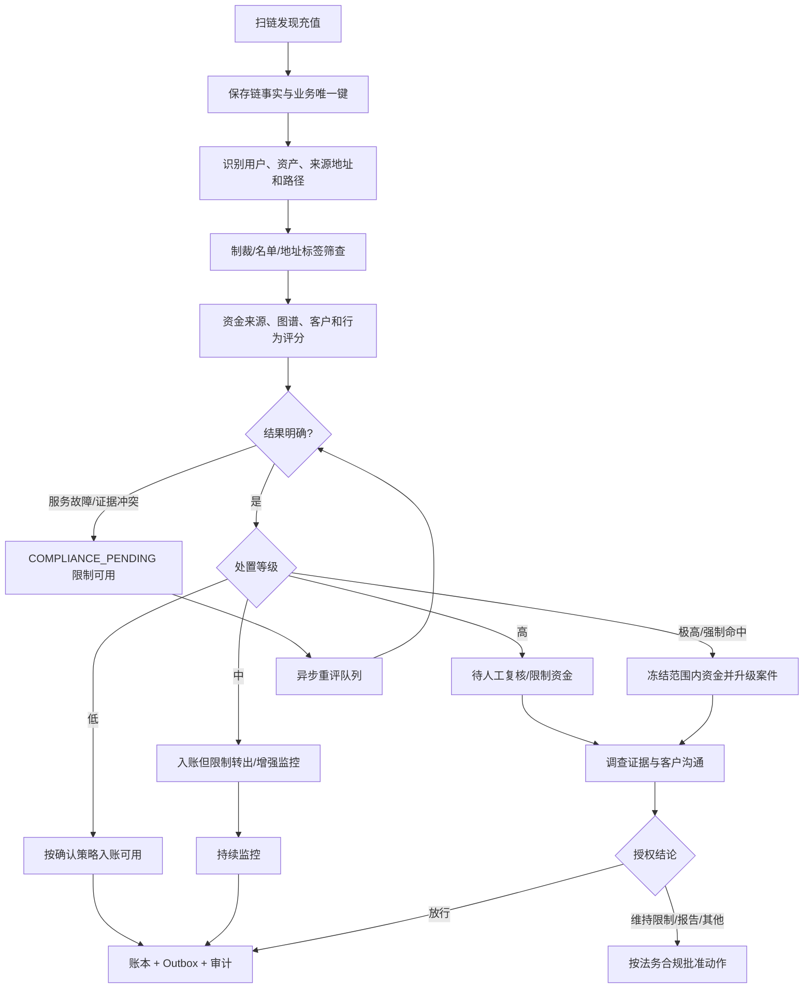
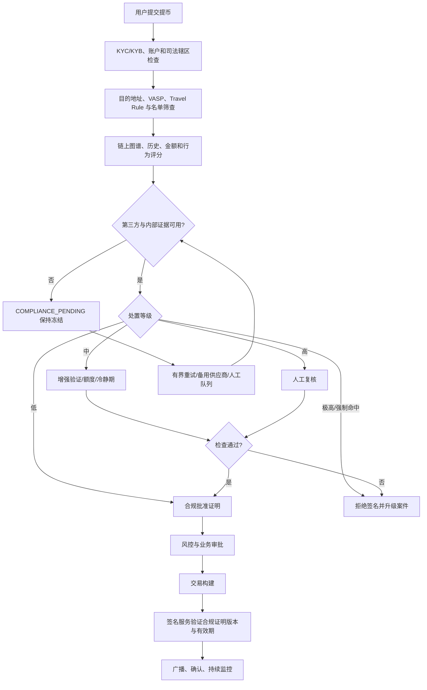
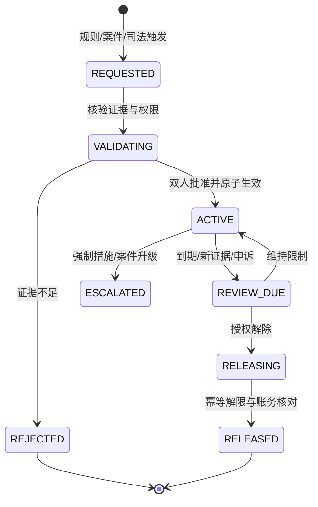
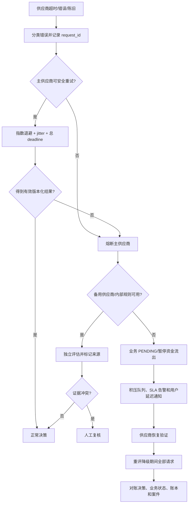

# Day 25：合规钱包、AML 与链上风控

> 学习目标：理解 KYC/KYB、AML、制裁筛查与 Travel Rule 的业务目的和技术边界；建立链上地址标签、交易图谱、资金来源与风险评分模型；设计充值后置审查、提币前置审查和持续监控；掌握白名单、黑名单、人工复核、限制与冻结流程；保存版本化规则、命中证据和可审计决策；在兼顾隐私、司法辖区和误报的前提下设计第三方 AML 服务故障降级。  
> 建议用时：5～6 小时  
> 完成标准：画出充值与提币合规检查流程，完成链上风险评分处置矩阵，编写第三方 AML 服务不可用降级策略，并闭卷回答文末恰好 7 道面试题。

## 使用边界与核心结论

- 本文是钱包工程与系统设计教程，不构成法律意见。制裁、冻结、报告、Travel Rule、数据保留与用户通知必须由适用司法辖区的法务和合规负责人批准。
- 所有练习使用虚构用户、测试网地址和合成风险标签；不要上传真实客户身份、交易历史、制裁命中或调查材料。
- KYC/KYB 识别客户主体，AML 识别和处置洗钱等风险，制裁筛查关注受限制主体，Travel Rule 处理特定虚拟资产转移的信息交换。四者相关但不能互相替代。
- 链上风险分数是概率信号，不是司法事实。地址标签可能错误、过期、继承污染或缺乏归因证据，必须结合客户、交易、业务和人工调查。
- 充值通常先在链上发生，系统只能发现后审查；提币在签名前仍可阻断，所以前置控制更强。二者的状态机和用户沟通不同。
- 第三方 AML 供应商不能直接修改余额、冻结账户或放行提币。它只返回带版本与证据的评估，机构策略引擎和授权人员作最终决定。
- 服务超时不是低风险。新提币和高风险不可逆操作默认暂停；充值事实继续扫描和记录，但可限制入账可用性并进入待审查状态。
- 黑名单不能只存字符串地址。必须绑定链、网络、地址类型、标签来源、证据、有效期、规则版本和处置范围。
- 冻结是受控业务状态，不是删除账本或没收资产。任何限制、解除、退回或报告动作都需要权限、理由、证据和审计。
- 数据最小化与审计并不冲突：业务库保存决策所需的结构化摘要和引用，敏感证据进入分级加密证据库，按授权检索和到期处置。

合规不变量：

```text
I1. 链上交易事实、供应商风险信号、机构规则决策和账本动作分层保存。
I2. 每次决策记录规则、模型、名单、标签和供应商数据版本。
I3. 提币只有在全部强制检查得到明确允许后才能进入签名。
I4. 充值风险未知时仍保存链事实，但不得自动形成不可逆退回或重复入账。
I5. 单一风险分数、单一标签或单一供应商不能自动决定永久冻结或资产处置。
I6. 命中名单、人工限制和司法要求有独立优先级与授权路径。
I7. 决策重试和消息重复不得产生第二次冻结、解冻、入账或拒绝效果。
I8. 敏感身份与调查数据按最小权限、目的限制、加密和保留期管理。
I9. 规则更新不篡改历史结论；通过重评任务产生新版本决策和后续动作。
I10. 第三方故障时系统 Fail Safe，并可证明积压、恢复重评和业务状态一致。
```

---

## 一、KYC、KYB、AML、制裁与 Travel Rule

### 1. 概念边界

| 能力 | 主要对象 | 主要问题 | 典型技术输入 | 典型输出 |
|---|---|---|---|---|
| KYC | 自然人客户 | 客户是谁、风险是否可接受 | 身份文件、活体、地址、职业、资金来源 | 身份状态、客户风险等级 |
| KYB | 企业客户 | 企业、控制人和受益所有人是谁 | 注册信息、董事、UBO、业务性质 | 企业身份与控制关系 |
| AML | 客户与资金活动 | 是否存在洗钱、欺诈等可疑模式 | KYC、交易、链上图谱、行为和规则 | 告警、调查、处置建议 |
| 制裁筛查 | 人、实体、地址、地区 | 是否命中适用限制 | 名单、别名、地址标签、司法辖区 | 潜在/确认命中、阻断要求 |
| Travel Rule | 特定虚拟资产转移 | 是否需交换转出方/接收方信息 | 金额、VASP、客户及司法辖区 | 信息交换状态与证据 |

### 2. KYC/KYB 不是一次性门槛

客户资料、受益所有人、风险地区、业务性质和交易行为会变化。需要：

- 周期复审和事件触发复审；
- 身份状态、风险等级和有效期；
- 资料过期、控制人变化和账户接管信号；
- 客户声明资金来源与实际链上来源的差异；
- 规则变化后的客户群重评。

### 3. Travel Rule 工程边界

具体金额门槛和字段取决于司法辖区。系统设计应支持：

```text
originator / beneficiary identity reference
originating / beneficiary VASP identity
chain / asset / amount / transaction reference
counterparty discovery and protocol status
data validation / encryption / transmission receipt
screening result / exception / retry / manual review
retention and access policy version
```

Travel Rule 信息交换失败不等于链上交易失败，但在签名前可能构成阻断条件。不要把敏感身份数据写入公开链上 memo 或 calldata。

---

## 二、数据与决策分层

```text
链事实层：区块、交易、输入输出、Event、地址、资产和确认
身份层：客户、企业、UBO、VASP、司法辖区和 KYC 状态
风险信号层：地址标签、图谱路径、名单命中、行为特征和供应商分数
规则决策层：规则版本、输入快照、命中原因、动作与有效期
案件层：告警、调查、证据、审批、报告和结论
资金业务层：待审查、限制、放行、拒绝、冻结和账本引用
```

供应商返回的 `risk=HIGH` 不是账本状态。规则引擎也不能直接改余额，而应创建版本化决策，由充值/提币状态机按幂等条件执行对应动作。

### 1. 建议实体

```text
customer_risk_profile
screening_subject
screening_request / screening_result
chain_risk_signal
compliance_rule_version
compliance_decision
compliance_alert / case
case_evidence_reference
account_restriction
travel_rule_transfer
manual_review_task
```

### 2. 关键唯一约束

```sql
UNIQUE (business_type, business_id, screening_stage, evaluation_generation)
UNIQUE (provider_id, provider_request_id)
UNIQUE (subject_type, subject_id, list_source, list_version, match_key)
UNIQUE (case_id, evidence_type, evidence_hash)
UNIQUE (restriction_scope, scope_id, restriction_type, active_generation)
```

---

## 三、链上地址标签与资金来源追踪

### 1. 地址标签不是地址本体属性

地址可能属于交易所、托管人、混币服务、诈骗活动、勒索软件、Bridge、DeFi 协议或普通用户，但归因具有时间和置信度。每条标签至少记录：

```text
chain / network / canonical address
category / subcategory
source / source_record_id
confidence / evidence_grade
observed_from / observed_to
first_seen / last_verified
direct or inferred
list/model/version
jurisdiction / handling caveat
```

### 2. 直接与间接暴露

直接命中通常比多跳关联更强，但不能只用跳数衡量风险。需要考虑：

- 资金占比；
- 时间距离；
- 路径长度与分叉数量；
- 中间实体类型；
- UTXO 的输入归因与 CoinJoin；
- EVM Router、DEX、Bridge 和合约内部调用；
- Solana Program/CPI 与 Token Account；
- TON 异步 Message 与 Jetton Wallet；
- 自托管钱包与 VASP 的归属证据。

### 3. 污染传播的边界

简单“接触过风险地址即永久污染”会产生大量误报。常见方法包括比例、先进先出、发丝模型等，但没有一种能把法律归属变成数学真理。模型输出必须带方法、版本、路径证据和局限。

### 4. 风险特征

```text
直接名单/制裁地址命中
与诈骗、盗币、勒索、暗网等标签的距离和占比
混币、隐私增强或 Peel Chain 模式
高频拆分、归集、跨链和快速过桥
新地址突发大额、金额结构化和循环转账
客户历史、设备、地域与链上行为不一致
资金来源/用途说明与图谱证据不一致
交易对手 VASP 与 Travel Rule 信息异常
```

特征应服务于调查，不能把合法使用隐私工具或某地区自动等同犯罪。

---

## 四、风险评分与可解释性

### 1. 评分示意

可把供应商、名单、链上、客户和行为信号组合，但强制命中应独立于普通加权分：

$$
Score = w_c C + w_o O + w_b B + w_k K + w_j J
$$

其中 $C$ 为交易对手风险，$O$ 为资金来源，$B$ 为行为异常，$K$ 为客户风险，$J$ 为司法辖区风险。权重和阈值必须经合规批准、回测和版本化。

### 2. 强制规则与模型分离

```text
Hard Rule：确认制裁命中、司法冻结、内部确认盗币地址
Deterministic Rule：金额、地区、账户状态、Travel Rule 缺失
Risk Model：图谱、行为和客户信号组合评分
Manual Judgment：证据冲突、误报、复杂来源与例外
```

高分不能覆盖一个明确的低风险事实，低分也不能绕过强制名单命中。

### 3. 可解释输出

```json
{
  "decision_id": "decision-test-001",
  "business_id": "withdrawal-test-001",
  "stage": "PRE_WITHDRAWAL",
  "risk_level": "HIGH",
  "score": 82,
  "reason_codes": ["DIRECT_HIGH_RISK_COUNTERPARTY", "NEW_DESTINATION"],
  "rule_version": "aml-policy-test-v3",
  "provider_versions": ["provider-a-fixture-v7"],
  "evidence_refs": ["evidence:test:001"],
  "action": "MANUAL_REVIEW",
  "expires_at": "2030-01-01T00:05:00Z"
}
```

这是测试数据。生产日志不应包含完整身份资料或调查证据。

### 4. 模型治理

- 训练/规则数据来源合法且可追溯；
- 记录版本、发布日期、适用链与已知限制；
- 评估 precision、recall、误报率和分群偏差；
- 用已结案件回测但防止标签泄漏；
- 阈值变更经过合规审批与灰度；
- 监控分数分布、标签漂移和供应商差异；
- 人工推翻决策要记录理由，不能静默改分。

---

## 五、充值合规检查流程

充值是“链上事实先发生，审查后决定内部可用性”。不能因为风险高就从链上删除交易，也不能未经授权自动原路退回。



### 1. 推荐状态

```text
DETECTED
SCREENING_PENDING
LOW_RISK
ENHANCED_MONITORING
MANUAL_REVIEW
RESTRICTED
FROZEN
CLEARED
REJECTED_FOR_CREDIT（仅内部处理语义）
ESCALATED
```

链交易不能被内部“拒绝”。`REJECTED_FOR_CREDIT` 只表示暂不形成可用余额，链上资产仍需纳入钱包资产和对账。

### 2. 充值关键控制

- 先保存链事实，再调用第三方，避免供应商故障导致漏扫；
- 地址来源不明时记录 unknown，不伪造低风险；
- 风险结果与确认入账采用业务唯一键；
- 高风险金额可记入受限负债/待处理科目，具体账务由制度批准；
- 原路退回也是新的提币，必须重新识别合法接收方、审批、签名和审计；
- 用户通知避免泄露调查规则、第三方标签和报告状态；
- 重组发生时，合规状态与链事实共同回滚/补偿，案件证据保留。

---

## 六、提币合规检查流程

提币发生在资金离开托管范围前，必须完成前置筛查；未知结果不能默认放行。



### 1. 提币检查时点

| 时点 | 检查 |
|---|---|
| 请求时 | 客户状态、地址、金额、司法辖区、Travel Rule |
| 审批前 | 最新名单、图谱、行为和设备风险 |
| 签名前 | 决策未过期、目的地址和 payload 未变化 |
| 广播前 | 紧急名单/暂停状态、签名 payload hash |
| 广播后 | 交易路径、接收方变化和后续高风险流向 |

签名前任何安全关键字段或规则强制版本变化，都应使批准失效并重新评估。

### 2. 合规批准证明

```text
decision_id
business_id / evaluation_generation
customer and destination reference
chain / network / asset / amount band
destination digest
decision / reason codes
rule/list/model/provider versions
approved_by / approved_at / expires_at
evidence manifest hash
attestation issuer / signature
```

签名服务验证证明，不读取第三方供应商页面截图，也不接受调用方声明的 `amlPassed=true`。

---

## 七、链上风险评分处置矩阵

阈值必须经本机构回测与审批，下表是设计模板，不是法律或供应商通用标准。

| 等级 | 典型信号 | 充值处置 | 提币处置 | 人工/持续动作 |
|---|---|---|---|---|
| 低 | 无强制命中、图谱风险低、行为一致 | 正常确认入账 | 正常前置批准 | 常规持续监控 |
| 中 | 间接暴露、标签置信度一般、新地址或行为偏离 | 可入账但限制快速转出/增强监控 | 增强验证、较低限额或冷静期 | 采集资金来源、定期复评 |
| 高 | 直接高风险关联、来源解释冲突、异常拆分/跨链 | 待审查或受限入账 | 保持冻结，不进入签名 | 建案、人工调查、二级审批 |
| 极高 | 确认制裁/司法命中、内部确认盗币、明确禁止场景 | 按适用政策冻结/隔离 | 拒绝签名并升级 | 法务合规决策、报告/通知控制 |
| 未知 | 供应商故障、链不支持、证据冲突、模型过期 | 保存链事实，`PENDING`，限制可用 | 保持资金冻结并排队 | 备用数据源、人工复核、SLA 告警 |

### 1. 决策优先级

```text
司法/强制要求
  > 已确认名单和内部紧急阻断
  > 客户/账户限制
  > 确定性规则
  > 模型评分
  > 供应商建议
```

冲突时不能简单取最高分或多数票，要根据证据级别和授权规则进入人工调查。

### 2. 动作范围

限制可作用于：

- 单业务单；
- 单地址或交易对手；
- 单资产/链；
- 特定金额或在途资金；
- 提币功能或全部资金动作；
- 客户账户；
- 机构级紧急阻断。

优先使用满足法律与安全要求的最小必要范围，避免因一笔可疑交易无依据扩大到所有客户资产。

### 3. 人工审核清单

- 标签来源、置信度、更新时间和归因路径；
- 直接/间接暴露比例、时间和中间实体；
- 客户 KYC/KYB、职业/业务和历史行为；
- 资金来源、用途和支持文件；
- 对手方 VASP、Travel Rule 与司法辖区；
- 多供应商/内部图谱是否一致；
- 是否可能为交易所聚合地址、CoinJoin 或共享基础设施误报；
- 法务合规要求、通知限制和处置授权；
- 放行、维持限制或升级的理由与复核日期。

---

## 八、白名单、黑名单与限制

### 1. 白名单

白名单降低已验证交易对手的操作摩擦，但不能永久绕过制裁和持续监控。条目应包含：

```text
subject / chain / network / canonical address
owner/customer/counterparty reference
verification method and evidence
allowed assets / purpose / amount
created_by / approved_by
effective_at / expires_at
risk review version
revocation state
```

新增地址要带外核验、多人审批和冷静期；地址 ownership 改变、账户接管或风险信号升级时自动失效。

### 2. 黑名单

区分：

- 法定/制裁名单；
- 内部确认高风险名单；
- 调查临时阻断；
- 供应商标签观察名单。

四者证据强度、有效期和动作不同。供应商把地址标为“高风险”不应自动写入永久内部黑名单。

### 3. 冻结流程



冻结记录与余额账本分离。业务在读取有效限制后禁止特定动作；不得直接把用户可用余额改为零而不留下平衡分录和限制依据。

### 4. 申诉与纠错

误报不可避免，系统要支持客户补充材料、独立复核、标签纠错、解除限制和审计。用户通知由合规批准，既说明可披露流程，也避免泄露调查方法、报告或其他主体隐私。

---

## 九、规则版本、命中证据与审计

### 1. 决策必须可重放

保存：

```text
decision input manifest hash
rule / model / list / label / provider versions
chain block height/hash and observed_at
customer risk profile version
matched conditions and reason codes
raw provider response encrypted reference + digest
decision and action
human reviewers and overrides
created_at / expires_at / superseded_by
```

只有当前规则代码而没有历史版本，无法解释过去为何放行或限制。

### 2. 证据分级

| 数据 | 推荐存放 | 访问 |
|---|---|---|
| 决策 ID、原因码、版本 | 业务/合规数据库 | 业务最小可见 |
| 地址路径和标签摘要 | 风控证据库 | 风控与调查人员 |
| 完整供应商响应 | 加密对象存储/WORM | 受控调查访问 |
| KYC 文件与敏感身份 | 专用身份资料库 | 严格法定用途 |
| 审批、冻结、解除日志 | 不可篡改审计库 | 合规、审计、取证 |
| 报告与执法沟通 | 独立案件系统 | 特定授权人员 |

### 3. 隐私保护

- 目的限定：只为明确合规和风险用途处理；
- 数据最小化：业务服务只取决策和必要原因码；
- 字段级加密、密钥分离与细粒度 RBAC；
- JIT 访问、双人审批和完整查询审计；
- 测试使用脱敏/合成数据，禁止复制生产案件；
- 导出加水印、限制下载并监控批量查询；
- 按司法辖区配置保留、legal hold、删除或匿名化；
- 跨境传输和供应商处理有数据驻留与合同控制。

### 4. 日志禁止项

- 完整证件、住址、生日和生物特征；
- 完整 Travel Rule 身份 payload；
- 调查报告正文和可疑活动报告状态；
- 供应商 API Key、认证 token；
- 无需展示的完整链上图谱和其他客户关系；
- 可能造成 tipping-off 的敏感内部备注。

---

## 十、规则更新与历史交易

### 1. 不改写历史

规则更新后，过去的 `APPROVED` 决策仍记录当时版本与证据。新规则产生新的 `evaluation_generation`：

```text
旧决策：保留，不覆盖
新评估：引用旧决策，记录新规则和新证据
差异：生成 alert/case/restriction review
后续动作：由当前政策与权限决定
```

### 2. 重评范围

按风险选择：

- 当前在途提币和待入账充值；
- 活跃客户与高余额账户；
- 新增制裁/确认高风险地址的直接交易；
- 指定时间窗内的历史路径；
- 受影响资产、链、VASP 或司法辖区；
- 已关闭但法定需复查的案件。

### 3. 已完成交易

区块链转账通常不可逆。新规则命中已完成交易时，系统不能伪造回滚，而应：

1. 保存新命中和历史决策差异；
2. 评估账户、剩余资产和后续活动风险；
3. 必要时创建案件、限制未来操作或增强监控；
4. 按授权决定报告、客户复核和其他措施；
5. 不做无依据自动补账、扣款或原路追讨；
6. 更新模型回测与控制缺口，但不把新规则假装成旧规则。

### 4. 大规模回溯

历史重评使用低优先级隔离队列、checkpoint、幂等 generation 和有界节点/供应商调用。优先处理在途和高风险，不压垮实时提币检查。所有差异进入可追踪队列，不因重复扫描创建多个案件或限制。

---

## 十一、第三方 AML 服务不可用降级策略

### 1. 故障分类

| 故障 | 风险 | 处理 |
|---|---|---|
| 超时/连接失败 | 结果未知 | 有界重试、切备用、进入 PENDING |
| 429/配额耗尽 | 容量不足 | 限流非关键重评，保护实时检查 |
| 5xx | 供应商故障 | 熔断并切独立供应商 |
| 4xx/请求错误 | 集成或数据错误 | 拒绝继续，修复映射，不盲重试 |
| 数据过旧 | 静默错误风险 | 结果标记无效，暂停相关决策 |
| 响应 schema 变化 | 解析风险 | 版本不匹配 Fail Closed |
| 多供应商冲突 | 证据冲突 | 不取简单多数，人工复核 |
| 全部不可用 | 无新风险证据 | 启动业务分级降级和事件响应 |

### 2. 降级原则

```text
不可逆资金流出优先 Fail Closed
链事实采集继续，不能因 AML 故障漏扫
已有明确强制名单和内部阻断继续生效
缓存只在版本、TTL 和业务允许范围内使用
低风险不等于无结果，UNKNOWN 单独建模
所有降级决策记录原因、时间、范围和批准人
恢复后对积压和降级期间业务全部重评
```

### 3. 按业务降级

| 业务 | 单供应商故障 | 全供应商故障 | 禁止动作 |
|---|---|---|---|
| 新提币 | 切备用；保持冻结直到明确结论 | 暂停新签名，排队并通知延迟 | 超时默认放行 |
| 已签未广播 | 按政策决定暂停广播；核对紧急名单 | 高风险默认阻断广播 | 重建不同交易绕过检查 |
| 充值扫描 | 继续保存链事实 | 继续扫描与确认 | 跳过记录或丢弃充值 |
| 充值可用 | 使用有效缓存/内部强规则，否则待审查 | `COMPLIANCE_PENDING` 或受限余额 | 自动退回来源地址 |
| 内部转账 | 依风险和产品边界限制 | 高风险路径暂停 | 借内部转账绕过提币检查 |
| 历史重评 | 暂停或低优先级 | 暂停 | 抢占实时检查配额 |
| 案件调查 | 使用已保存证据 | 保留人工流程和内部数据 | 将缺失供应商结果视为无风险 |

### 4. 有条件缓存

仅当制度允许时复用近期结果，并同时满足：

- 主体、链、网络和地址完全相同；
- 规则、名单、模型和供应商版本仍有效；
- TTL 未过期；
- 不存在新交易、账户接管或紧急名单事件；
- 金额/业务类型在缓存允许范围；
- 使用缓存被审计并在恢复后抽样/全量重评。

制裁等高时效检查通常需要更短 TTL 或实时数据，不可长期缓存。

### 5. 熔断与恢复



### 6. 恢复门禁

- API、schema、名单版本、时间和数据新鲜度正常；
- 固定测试样本结果与基线一致；
- 多个风险等级和链都通过金丝雀；
- 熔断半开流量无异常；
- PENDING、重试和人工队列总量可控；
- 所有降级期间提币重新评估，旧批准未被错误复用；
- 充值链事实、受限余额、案件和账本对账一致；
- 冲突与误报完成抽样复核；
- 再逐步放量，保留自动回退阈值。

---

## 十二、误报、漏报与供应商治理

### 1. 误报来源

- 地址聚类错误或托管地址多人共用；
- CoinJoin/混币归因方法过度传播；
- Bridge、DEX Router、中间合约造成路径污染；
- 标签已过期或地址控制权变化；
- 同名实体、别名和模糊匹配；
- 链、网络或 Token 身份映射错误；
- 阈值未按客户、金额和业务校准；
- 多供应商复制同一错误数据源。

### 2. 漏报来源

- 新风险地址尚未标记；
- 跨链、隐私工具和复杂图谱断裂；
- 自托管地址缺少身份；
- 供应商不支持某链、Token 或内部调用；
- 名单同步延迟、模型漂移或接口静默降级；
- 只看直接对手方而不看来源/去向路径。

### 3. 供应商评估

```text
支持链、资产、内部调用和跨链覆盖
标签来源、证据等级、更新时间与纠错机制
图谱方法、可解释路径和已知限制
制裁/名单同步延迟
API 可用性、延迟、配额和数据保留
数据驻留、隐私、分包商和跨境传输
模型/规则变更通知和版本固定能力
审计、事故响应、退出和历史数据导出
```

### 4. 双供应商边界

双供应商提高可用性和交叉验证能力，但不自动提高真相性。需识别共享标签源、评分尺度、版本时间和链覆盖差异。冲突结果使用规范化证据和人工规则解释，不能简单平均分数。

---

## 十三、司法辖区与策略配置

### 1. 策略维度

```text
legal_entity
customer_jurisdiction
originating / beneficiary jurisdiction
product / account type
chain / asset
transaction direction
amount band
customer risk tier
counterparty type / VASP status
effective time
```

不要把全球规则硬编码成一个 `if score > 80`。同一交易在不同法人、产品和司法辖区可能有不同审查、信息交换、保留和通知要求。

### 2. 策略发布

- 法务解释和合规 owner 明确；
- 技术将规则转为可测试的版本化配置；
- 示例、边界值和冲突优先级经共同验收；
- 生效时间、适用范围、回滚和历史重评计划完整；
- 双人批准、签名制品和不可篡改审计；
- 先影子评估，再灰度，不让新规则直接大面积错误冻结；
- 紧急名单可快速生效，但仍有授权和事后复核。

### 3. 规则测试

至少覆盖：

```text
阈值上下边界
多个规则同时命中
强制规则与模型分数冲突
名单新增、删除、纠错和过期
客户/司法辖区变化
供应商超时、陈旧与冲突
规则版本切换时的在途请求
历史重评幂等
人工 override 与到期复审
```

---

## 十四、技术与合规职责边界

| 工作 | 技术团队 | 合规/法务团队 |
|---|---|---|
| 法律义务解释 | 提供系统事实 | 负责解释与批准 |
| 风险规则 | 实现、测试、版本、监控 | 定义阈值、动作和例外 |
| 供应商 | 集成、SLA、数据安全 | 评估方法、覆盖与合规适用性 |
| 名单与标签 | 可靠同步、校验、审计 | 确认来源、证据等级和处置 |
| 自动决策 | 保证幂等、可解释、可回放 | 批准自动化范围 |
| 人工案件 | 提供工具和证据完整性 | 调查、结论和报告 |
| 冻结/解除 | 实现受控状态与账务 | 授权理由、范围和时限 |
| 用户沟通 | 实现通知和访问控制 | 批准内容与披露边界 |
| 数据保留 | 实现生命周期和删除 | 定义期限、legal hold 和辖区要求 |
| 事故响应 | 隔离、恢复、对账 | 决定合规动作和外部沟通 |

技术团队不能自行判断可疑活动报告、永久冻结或法律通知；合规团队也不应绕过技术幂等、账本和签名控制直接修改生产数据。两者通过版本化政策和可审计工作流协作。

---

## 十五、监控与告警

| 信号 | 建议阈值/条件 | 级别 | 动作 |
|---|---|---|---|
| 前置筛查延迟 | P95 超内部 SLO | P1/P2 | 保护实时流量、切备用 |
| 第三方超时率 | 5 分钟显著超基线 | P1 | 熔断、进入降级 |
| 名单新鲜度 | 超最大允许延迟 | P0/P1 | 停止依赖该名单放行 |
| schema/版本未知 | 任一 | P0/P1 | Fail Closed |
| PENDING 提币量/金额 | 超容量或最老年龄 SLO | P1 | 扩人工队列、暂停入口 |
| PENDING 充值量/金额 | 超容量或最老年龄 SLO | P1 | 对账受限余额、恢复重评 |
| 高/极高风险命中 | 大额单次或短窗突增 | P1/P0 | 建案、检查攻击/数据异常 |
| 多供应商冲突率 | 超基线或强制名单冲突 | P1 | 暂停自动决策 |
| 人工推翻率 | 分群显著升高 | P2/P1 | 检查误报与模型漂移 |
| 冻结/解除失败 | 任一状态与账务不一致 | P0 | 停止相关资金动作 |
| 规则发布 | 任一生产变更 | 审计事件 | 影子/灰度与回滚监控 |
| 审计/证据缺口 | 任一不可解释缺口 | P0/P1 | 暂停高风险决策 |
| 数据访问异常 | 批量导出/异常主体查询 | P0/P1 | 撤权、保全证据 |
| Travel Rule 失败 | 超时、对手方不匹配、积压 | P1/P2 | 保持待处理并人工复核 |

高基数地址、客户、业务 ID、案件 ID 放在访问受控的日志和证据系统中，不作为普通指标标签。

---

## 十六、演练场景

### 演练 A：提币筛查超时

1. 让主供应商请求超时；
2. 验证有界重试后熔断并切备用；
3. 备用也失败时请求进入 `COMPLIANCE_PENDING`；
4. 余额保持冻结，不进入构建和签名；
5. 用户只收到合规批准的延迟通知；
6. 服务恢复后重评并核对一次资金效果。

### 演练 B：高风险充值误报

1. 合成一个被错误聚类的交易所共享地址；
2. 充值链事实正常保存，资金进入受限状态；
3. 人工复核标签来源、路径和客户证据；
4. 记录推翻理由，不删除原始供应商结果；
5. 幂等解除限制并更新可用余额；
6. 将误报反馈到供应商治理和规则回测。

### 演练 C：名单新增后的历史重评

1. 发布新版本名单；
2. 优先重评在途提币、待入账和高余额客户；
3. 使用新 generation，不覆盖旧决策；
4. 已完成链交易只创建案件和后续动作，不伪造回滚；
5. 重复任务不产生重复冻结/案件；
6. 对账重评范围、命中和未完成任务。

### 演练 D：供应商大规模误标

1. 模拟高风险命中率突增；
2. 触发分布监控并暂停自动高风险处置；
3. 使用备用供应商和内部固定样本交叉验证；
4. 保持不可逆提币暂停，避免大规模自动退回/永久冻结；
5. 隔离错误数据版本并重评受影响决策；
6. 分阶段恢复并审计所有人工 override。

### 演练 E：隐私数据越权访问

1. 模拟普通工程账号批量读取案件证据；
2. RBAC/JIT 和查询策略应阻断；
3. 访问告警触发撤权与取证；
4. 评估数据范围、导出和下游副本；
5. 按批准流程处理通知与凭据轮换；
6. 修复最小权限和数据生命周期缺口。

---

## 十七、实施检查表

### 1. 身份与政策

- [ ] 已定义客户、企业、UBO、VASP 和司法辖区模型。
- [ ] KYC/KYB 状态、风险等级和复审日期版本化。
- [ ] AML、制裁与 Travel Rule 规则边界明确。
- [ ] 法务/合规 owner、技术 owner 和审批路径明确。
- [ ] 规则、名单、模型和供应商版本可追踪。
- [ ] 强制规则、模型评分和人工判断明确分层。

### 2. 链上风险

- [ ] 标签包含来源、置信度、时间、链和版本。
- [ ] 资金路径记录直接/间接、占比和方法。
- [ ] BTC、EVM、Solana、TON 解析差异已处理。
- [ ] 地址、资产、合约和 VASP 身份规范化。
- [ ] 多供应商冲突不会简单平均或投票。
- [ ] UNKNOWN 与 LOW 明确区分。

### 3. 充值与提币

- [ ] 充值先持久化链事实，再执行筛查。
- [ ] 高风险充值不会未经授权自动退回。
- [ ] 提币前置检查未明确通过不能进入签名。
- [ ] 签名服务验证版本化合规证明和有效期。
- [ ] 业务字段变化会使旧决策失效。
- [ ] 冻结、解冻、限制和账本动作幂等。

### 4. 案件与证据

- [ ] 告警、案件、证据、决定和资金动作关联。
- [ ] 人工推翻记录理由、人员、时间和复审日期。
- [ ] 完整供应商响应进入加密证据库。
- [ ] 业务服务仅获得必要决策与原因码。
- [ ] 审计 append-only、时间一致并可验证完整性。
- [ ] 用户通知和敏感报告状态受控。

### 5. 隐私与数据保留

- [ ] 字段分类、目的、位置、访问与保留期已登记。
- [ ] 身份、Travel Rule 和案件数据分级加密。
- [ ] JIT/RBAC、下载限制和访问审计已启用。
- [ ] 测试环境只使用合成或不可逆脱敏数据。
- [ ] legal hold、删除、匿名化和跨境策略已实现。
- [ ] 第三方数据驻留与分包商已评估。

### 6. 供应商故障

- [ ] 错误、超时、陈旧、schema 和冲突分类完整。
- [ ] 有备用供应商、内部强制规则和人工队列。
- [ ] 提币全故障时 Fail Closed 并保持冻结。
- [ ] 充值继续扫链并进入受限待审查状态。
- [ ] 缓存有版本、TTL、范围和紧急失效条件。
- [ ] 恢复后所有降级期间业务可幂等重评和对账。

---

## 十八、口头面试题参考答案

> 本节严格包含计划中的 7 道题。先闭卷口述，再按“结论 → 原理 → 生产实现 → 异常与风险 → 监控和恢复”补全。

### 1. 充值和提币的 AML 检查时机有何不同？

**参考回答：**

充值在链上已经发生，通常是扫链发现后做后置审查；系统必须先保存链事实，再决定是否形成可用余额、限制转出或进入案件，不能删除交易或未经授权自动退回。提币在签名广播前仍可阻断，因此要做客户、目的地址、名单、图谱、Travel Rule 和行为的前置检查。

两者都需要持续监控和规则更新重评。充值服务故障时继续扫链并进入 `COMPLIANCE_PENDING`；提币检查未知时保持余额冻结，不进入签名。最终通过版本化决策、业务状态、账本和审计证明处理一次且可解释。

### 2. 命中高风险地址后系统应该怎么处理？

**参考回答：**

先区分确认制裁/司法命中、内部确认高风险、供应商标签和间接模型分数，保存链、标签、规则、版本和路径证据。按最小必要范围暂停相关提币或限制充值可用性，创建案件并由授权人员复核；不能由单一分数直接永久冻结、没收或原路退回。

人工调查核对标签来源、置信度、暴露比例、客户资料、资金来源、对手方和多源证据。最终放行、维持限制、报告或其他动作由适用政策批准。所有冻结与解除幂等、与账本分离且可审计，并设置复审日期和用户沟通边界。

### 3. 第三方风控服务超时时是否应继续提币？

**参考回答：**

默认不应继续，因为超时表示风险未知，不是低风险，而提币是不可逆资金流出。系统应有界重试、熔断、切换独立供应商；仍无有效结果时将请求置为 `COMPLIANCE_PENDING`，保持资金冻结，不进入构建、签名和广播。

可以继续链确认、内部账本和不依赖新风险结论的安全操作。若制度允许复用缓存，必须校验主体、规则/名单版本、TTL、金额和紧急失效条件。恢复后重评全部积压并对账，不能通过手工改状态绕过检查。

### 4. 如何保留可审计证据又避免泄露敏感信息？

**参考回答：**

采用数据分层和最小化。业务库只保存 decision ID、原因码、版本、证据引用和动作；完整供应商响应、链上路径、KYC 与案件材料分别进入加密、访问受控的证据/身份系统。使用字段级加密、密钥分离、JIT RBAC、查询审计、WORM 和保留策略。

普通日志不记录完整证件、Travel Rule payload、调查正文、报告状态或 API 凭据。审计通过 manifest hash、事件序列、版本和不可篡改存储证明完整性；测试使用合成数据。访问、导出、跨境和删除按目的、司法辖区与 legal hold 管理。

### 5. 地址风险评分为什么不能作为唯一判断依据？

**参考回答：**

评分是基于不完整图谱、标签和模型的概率信号。共享交易所地址、CoinJoin、DEX、Bridge、中间合约、标签过期和错误聚类都可能误报；新风险地址、复杂跨链和供应商覆盖不足又会漏报。不同供应商分数也不可直接等价。

应结合强制名单、标签证据级别、直接/间接暴露、金额占比、客户 KYC/KYB、历史行为、资金来源、对手方和司法辖区。高风险或冲突结果进入人工复核，保存版本和解释。模型要回测误报/漏报并监控漂移，但不能替代合规判断。

### 6. 如何处理规则更新前已经完成的交易？

**参考回答：**

不覆盖历史决策，也不能把不可逆链上交易伪装成回滚。保留当时规则和证据，用新 `evaluation_generation` 对风险范围重评，记录旧结论、新命中和差异。优先处理在途、高余额、直接命中和指定时间窗。

对已完成交易创建案件，评估剩余资产、未来操作和持续监控，按授权决定限制、报告、客户复核等动作；不自动补账或扣款。历史重评采用隔离队列、checkpoint 和唯一约束，避免压垮实时检查或重复冻结，并最终对账任务、案件、限制和账本。

### 7. 技术团队与合规团队的职责边界是什么？

**参考回答：**

合规/法务解释适用义务，定义规则、阈值、处置、例外、报告、通知和保留要求，并负责案件结论；技术团队把批准政策实现为版本化、可测试、幂等、可观测的系统，保障数据、证据、权限、签名阻断和灾备可靠。

技术不能自行决定永久冻结或报告，合规也不能绕过账本、审批和生产变更流程直接改数据。双方共同验收边界样例、规则冲突、降级与恢复；每次决策保留政策 owner、技术版本、证据和操作审计，使法律判断与系统执行可追踪但相互制衡。

---

## 十九、当天任务

### 任务 1：概念与数据（45～60 分钟）

- [ ] 区分 KYC、KYB、AML、制裁和 Travel Rule。
- [ ] 画出链事实、身份、风险、决策、案件和账本分层。
- [ ] 设计筛查、决策、证据、限制和案件核心字段。
- [ ] 定义稳定业务幂等键与 evaluation generation。

### 任务 2：充提流程（60 分钟）

- [ ] 画出充值后置审查流程。
- [ ] 画出提币前置审查流程。
- [ ] 标出第三方故障、人工复核、冻结和签名门禁。
- [ ] 推演高风险充值与未知提币两条状态机。

### 任务 3：风险处置（45～60 分钟）

- [ ] 完成低、中、高、极高、未知五档处置矩阵。
- [ ] 为每档定义充值、提币、人工和持续动作。
- [ ] 区分法定名单、内部名单和供应商标签。
- [ ] 演练一次误报申诉和幂等解除限制。

### 任务 4：证据与隐私（45 分钟）

- [ ] 设计决策 manifest 和证据引用。
- [ ] 划分业务库、证据库、身份库和案件库。
- [ ] 制定字段分类、RBAC、加密和保留策略。
- [ ] 检查日志不包含敏感身份、报告状态和供应商凭据。

### 任务 5：供应商故障（60 分钟）

- [ ] 编写主备供应商熔断与降级 Runbook。
- [ ] 演练超时、schema 变化、陈旧数据和结果冲突。
- [ ] 验证充值继续扫链、提币保持冻结。
- [ ] 恢复后重评积压并完成业务与账本对账。

### 任务 6：口述（30～45 分钟）

- [ ] 不看资料回答本节恰好 7 道题并录音。
- [ ] 每题覆盖证据、误报、权限、故障与恢复。
- [ ] 用 10 分钟白板讲清合规钱包架构。
- [ ] 将薄弱点写入 `progress.md`。

---

## 二十、闭卷验收

- [ ] 能区分 KYC、KYB、AML、制裁和 Travel Rule。
- [ ] 能说明合规要求需要按司法辖区批准。
- [ ] 能分离链事实、风险信号、决策、案件和账本。
- [ ] 能设计客户、筛查、决策、限制和案件模型。
- [ ] 能解释地址标签的来源、置信度和时间边界。
- [ ] 能分析直接/间接风险路径和污染模型局限。
- [ ] 能识别 BTC/EVM/Solana/TON 图谱差异。
- [ ] 能设计强制规则、确定性规则、模型和人工判断层级。
- [ ] 能保存可解释原因码和全部输入版本。
- [ ] 能画出充值后置 AML 审查流程。
- [ ] 能说明高风险充值不能随意自动退回。
- [ ] 能画出提币前置 AML 审查流程。
- [ ] 能保证未知提币不进入签名。
- [ ] 能设计签名服务可验证的合规批准证明。
- [ ] 能完成五档风险处置矩阵。
- [ ] 能按最小必要范围限制业务。
- [ ] 能设计白名单核验、冷静期和到期复审。
- [ ] 能区分法定、内部、临时和供应商黑名单。
- [ ] 能设计冻结、解除与账本分离的状态机。
- [ ] 能处理误报申诉并保留原始证据。
- [ ] 能让历史决策按原版本可重放。
- [ ] 能分层保存原因码、链图谱、KYC 和案件材料。
- [ ] 能实施最小权限、JIT、加密和访问审计。
- [ ] 能按保留期、legal hold 和跨境要求管理数据。
- [ ] 能对新规则执行幂等历史重评。
- [ ] 能处理已完成不可逆交易而不伪造回滚。
- [ ] 能执行第三方超时、配额、陈旧和冲突降级。
- [ ] 能说明缓存筛查结果的严格边界。
- [ ] 能在供应商恢复后重评并对账全部积压。
- [ ] 能划分技术、合规和法务职责。
- [ ] 闭卷回答恰好 7 道面试题。

## 二十一、Day 25 验收清单

- [ ] 已完成充值和提币合规检查流程图。
- [ ] 已完成低、中、高、极高、未知处置矩阵。
- [ ] 已完成第三方 AML 服务不可用降级策略。
- [ ] 已区分 KYC/KYB、AML、制裁和 Travel Rule。
- [ ] 已定义客户、地址、VASP、链和司法辖区身份。
- [ ] 已定义标签来源、证据等级、置信度和版本。
- [ ] 已设计资金来源和多跳路径分析。
- [ ] 已区分强制规则、评分和人工结论。
- [ ] 已定义充值待审查与受限可用状态。
- [ ] 已定义提币前置阻断和签名门禁。
- [ ] 已设计版本化合规批准证明。
- [ ] 已设计白名单、黑名单和冻结/解除工作流。
- [ ] 已定义人工审核和误报申诉清单。
- [ ] 已保存规则、模型、名单和供应商版本。
- [ ] 已设计证据 manifest 与不可篡改审计。
- [ ] 已划分敏感身份、Travel Rule 和案件数据权限。
- [ ] 已定义数据保留、legal hold、删除和跨境策略。
- [ ] 已设计规则更新的历史重评 generation。
- [ ] 已验证重评不会重复冻结或创建案件。
- [ ] 已设计主备供应商、熔断、缓存和人工队列。
- [ ] 已验证供应商全故障时提币不会默认放行。
- [ ] 已验证 AML 故障不导致充值漏扫。
- [ ] 已演练供应商误标和隐私越权访问。
- [ ] 已定义恢复后的重评、对账和灰度放量。
- [ ] Git 中没有真实身份资料、调查材料、生产凭据或敏感报告。
- [ ] 已录音回答 7 道题并更新 `progress.md`。

## 二十二、30 分自评分

| 能力 | 1 分 | 3 分 | 5 分 | 今日得分 |
|---|---|---|---|---|
| 合规边界 | 只会说 KYC/AML | 能区分基本流程 | 能按辖区、主体、证据和权限实现可审计策略 |  |
| 链上风控 | 只看地址分数 | 能分析标签和路径 | 能处理归因局限、多源冲突、误报与模型治理 |  |
| 充提处置 | 高分一律冻结 | 有风险分级 | 能区分链事实、限制范围、人工案件与账务动作 |  |
| 证据与隐私 | 全量写日志 | 有脱敏和 RBAC | 能做分层存储、目的限制、保留和完整性证明 |  |
| 故障降级 | 超时继续或全停 | 有主备供应商 | 能按业务 Fail Safe、积压重评、对账和灰度恢复 |  |
| 协作治理 | 技术硬编码规则 | 合规给需求 | 能版本化政策、共同验收、制衡权限并回溯决策 |  |

**当日总分：** ____ / 30  
**适用法人/司法辖区（练习）：** ______________________________  
**规则/名单/模型版本：** ______________________________  
**五档处置阈值：** ______________________________  
**供应商故障最长积压：** ______________________________  
**人工误报复核结果：** ______________________________  
**隐私访问负向测试：** ______________________________  
**恢复重评与对账结果：** ______________________________  
**明日优先补强：** ______________________________