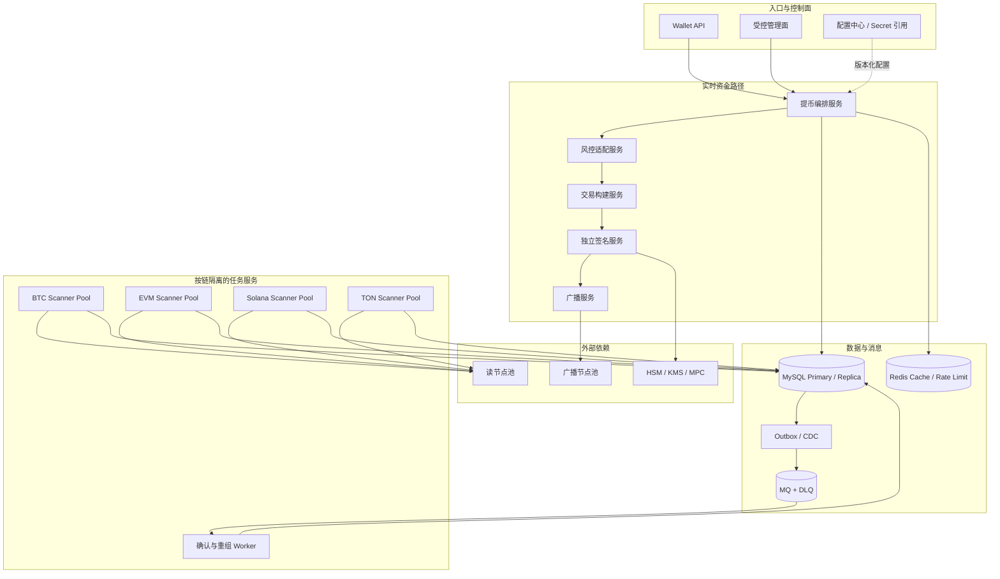
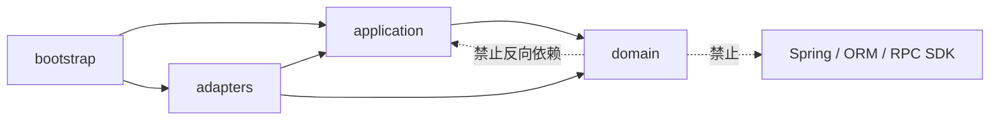
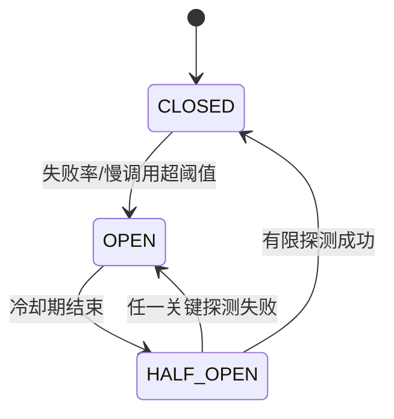
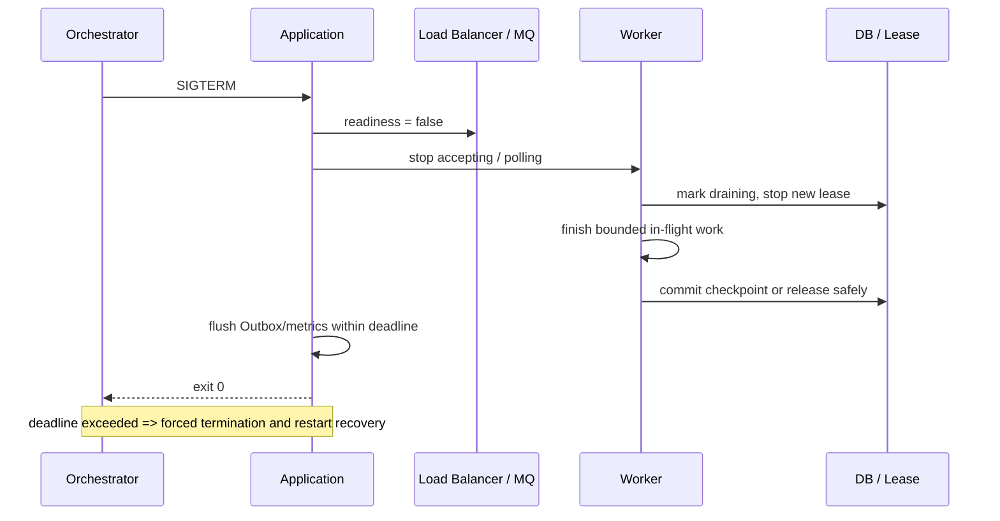

# Day 26：Java 模块优化与高可用工程

> 学习目标：复习 Java 并发、线程池、锁、不可变对象与异常处理；掌握 RPC 超时、退避重试、熔断、限流和隔离仓；理解 Spring Boot 模块边界、配置和依赖治理；能用 JVM、GC、线程 Dump、JFR 与业务指标定位性能问题；正确处理金额、整数、序列化、字节序与签名数据；为扫链、提币、签名任务设计高可用和优雅停机。  
> 建议用时：5～6 小时  
> 完成标准：画出 Java 钱包服务模块与部署架构，整理线程池/超时/重试配置原则，完成“扫链延迟升高”性能排查 Runbook，并闭卷回答文末恰好 7 道面试题。

## 安全边界与核心结论

- 性能优化不能改变资金语义。先固定“不重不漏、顺序边界、确认策略、幂等键和状态迁移”，再改变线程、批次、缓存或部署。
- 吞吐不足不等于线程不够。瓶颈可能在节点 RPC、反序列化、CPU、数据库锁、连接池、MQ、GC 或单分区顺序约束。
- 无界线程、无界队列、无限重试和超长超时只是把故障推迟到内存耗尽或雪崩。
- 不同链、不同任务和不同风险级别必须隔离资源。BTC 扫链变慢不能占满提币审批、签名或其他链的执行器。
- 超时是调用方的资源预算，不是随意填写的常量；重试必须受总 deadline、幂等性、退避、抖动和重试预算约束。
- 熔断保护下游，限流保护自身，隔离仓限制故障半径；三者用途不同，通常需要组合。
- Java `BigInteger` 有符号、`BigDecimal` 有 scale，`byte[]` 可变，默认字符集和默认字节序都可能破坏签名或金额语义。
- 优雅停机不是等待任意长时间。应停止领取新任务、完成或安全交还在途任务、提交 checkpoint，再在截止时间内退出。
- 线程 Dump、GC 日志和 CPU Profile 必须与业务阶段、队列年龄、区块高度差和下游延迟关联，不能只看 JVM 总体 CPU。
- 重构旧模块时用 characterization test、影子流量、双读比对、可回滚发布证明语义未变，不以“代码更漂亮”作为完成标准。

工程不变量：

```text
I1. 同一链分区在任一时刻只有一个有效游标 owner，租约过期不会让旧 owner 继续提交。
I2. 区块高度与区块哈希共同形成 checkpoint，重组检测不能只依赖高度。
I3. 重复扫描、重复消息和进程重启不会重复入账、冻结、签名或广播。
I4. 超时或未知结果不会被当成失败后立即重做不可逆资金动作。
I5. 每个外部调用受 deadline、并发上限、重试预算和熔断状态约束。
I6. 扫链、提币、签名、广播、通知和管理任务使用独立容量池。
I7. 队列有界；过载时显式背压、降级或拒绝，不无限占用堆内存。
I8. 停机时先停止领取新任务，再安全完成、续租或释放在途任务。
I9. 金额始终以资产最小单位整数保存；签名输入使用规范化字节协议。
I10. 优化前后以同一输入比较链事实、状态迁移、账本分录和副作用集合。
```

---

## 一、Java 钱包服务模块与部署架构

### 1. 逻辑模块

```text
wallet-domain
  ├─ chain：区块、交易、地址、确认、重组领域模型
  ├─ deposit：充值识别与状态机
  ├─ withdrawal：提币状态机与链资源预留
  ├─ signing：签名请求、策略证明与签名结果
  └─ ledger-contract：账务命令与结果契约

wallet-application
  ├─ scan-usecase
  ├─ deposit-usecase
  ├─ withdrawal-usecase
  ├─ reconciliation-usecase
  └─ ports：NodePort、RepositoryPort、EventPort、SignerPort

wallet-adapters
  ├─ rpc-btc / rpc-evm / rpc-solana / rpc-ton
  ├─ persistence-mysql
  ├─ messaging
  ├─ signer-client
  └─ observability

wallet-bootstrap
  ├─ Spring Bean 装配
  ├─ 配置绑定与校验
  ├─ health / readiness / metrics
  └─ 进程生命周期
```

领域层不依赖 Spring、RPC SDK、数据库实体或 MQ 客户端。应用层组织用例和事务边界，适配器层处理外部协议，启动层负责装配。这不是为了追求层数，而是为了让链 SDK 升级、节点切换和数据库优化不改资金规则。

### 2. 部署架构



### 3. 故障域划分

| 故障域 | 隔离方式 | 不能影响 |
|---|---|---|
| 单链节点 | 每链独立实例、线程池、连接池和熔断器 | 其他链与签名 |
| 历史重扫 | 独立队列、低优先级、带宽配额 | 实时扫链 |
| 提币请求 | 独立 API/Worker、数据库连接配额 | 充值确认 |
| 签名 | 独立网络区、部署、身份和容量 | 普通查询 |
| 管理任务 | 独立执行器与权限 | 资金主链路 |
| MQ 积压 | 分主题/分区、消费并发上限 | 数据库和节点 |
| 慢租户/大客户 | 配额和公平调度 | 其他客户 |

### 4. 高可用不是所有实例都做同一任务

扫链任务可多实例部署，但同一链分片需要 lease/fencing：

```text
partition_id
owner_id
lease_version      # 单调递增 fencing token
lease_until
checkpoint_height
checkpoint_hash
updated_at
```

Worker 提交 checkpoint 时必须带 `lease_version`：

```sql
UPDATE scan_partition
SET checkpoint_height = ?, checkpoint_hash = ?, updated_at = NOW()
WHERE partition_id = ?
  AND owner_id = ?
  AND lease_version = ?
  AND lease_until > NOW();
```

更新行数为零时，旧 Worker 已失去所有权，必须停止提交。单独依赖 Redis 锁过期不能阻止暂停后的旧进程继续写入。

---

## 二、Spring Boot 模块边界与依赖治理

### 1. 依赖方向



推荐约束：

- 领域对象不加 JPA/MyBatis/RPC 序列化注解；
- Controller 不直接调用 Repository；
- 链 SDK 类型不得穿透到统一业务接口；
- 事务在应用用例中定义，不跨外部 RPC；
- 签名、广播和账本通过显式 Port；
- 使用 ArchUnit 或模块测试阻止反向依赖；
- 模块间暴露命令、值对象和结果，不共享可变 Entity。

### 2. 配置分类

| 类别 | 示例 | 规则 |
|---|---|---|
| 静态构建配置 | 依赖版本、序列化模块 | 随制品发布 |
| 环境配置 | DB 地址、MQ 集群、区域 | 外部注入，不入源码 |
| Secret | 密码、API Key、证书引用 | Secret Manager，禁止明文日志 |
| 业务配置 | 确认数、限额、费率边界 | 版本化、审批、审计 |
| 韧性配置 | timeout、bulkhead、retry | 按依赖和操作配置 |
| 紧急开关 | 暂停链、暂停签名 | 强权限、双人审批、自动过期 |

Spring Boot 使用类型安全绑定并在启动时校验：

```java
@ConfigurationProperties("wallet.rpc.evm")
public record RpcProperties(
        URI endpoint,
        Duration connectTimeout,
        Duration requestTimeout,
        int maxConcurrency,
        int maxAttempts) {

    public RpcProperties {
        Objects.requireNonNull(endpoint, "endpoint");
        Objects.requireNonNull(connectTimeout, "connectTimeout");
        Objects.requireNonNull(requestTimeout, "requestTimeout");
        if (connectTimeout.isNegative() || connectTimeout.isZero()) {
            throw new IllegalArgumentException("connectTimeout must be positive");
        }
        if (requestTimeout.compareTo(connectTimeout) <= 0) {
            throw new IllegalArgumentException("requestTimeout must exceed connectTimeout");
        }
        if (maxConcurrency < 1 || maxAttempts < 1) {
            throw new IllegalArgumentException("limits must be positive");
        }
    }
}
```

动态配置必须有 schema、版本、有效期、默认值、范围、审批者和回滚版本。资金关键参数不能靠刷新 Bean 后无审计地生效。

### 3. 依赖治理

- 使用 BOM/Version Catalog 统一版本；
- 锁定依赖并生成 SBOM；
- CI 执行 CVE、许可证和依赖收敛检查；
- 禁止同一 JSON、Netty、加密库存在互不兼容版本；
- 节点 SDK 放在适配器模块，降低升级半径；
- 加密与签名使用成熟库，不自行实现曲线算法；
- 升级序列化库时运行固定字节向量和跨版本兼容测试；
- 生产制品可追溯到源码、依赖、配置 schema 和构建环境。

---

## 三、Java 并发基础

### 1. 线程安全不等于业务安全

`ConcurrentHashMap` 能保证容器并发，但不能保证“读取余额 → 判断 → 冻结”整个业务原子性。钱包资金一致性通常依赖数据库事务、唯一索引、状态条件更新和链资源约束，而不是 JVM 内锁。

### 2. 不可变对象

适合不可变的对象：

```java
public record ChainAmount(String assetId, BigInteger atomicUnits) {
    public ChainAmount {
        Objects.requireNonNull(assetId, "assetId");
        Objects.requireNonNull(atomicUnits, "atomicUnits");
        if (atomicUnits.signum() < 0) {
            throw new IllegalArgumentException("atomicUnits must not be negative");
        }
    }
}
```

`record` 只是字段引用不可重新赋值。若字段是 `byte[]`、集合或可变 SDK 对象，仍需防御性复制：

```java
public final class SigningPayload {
    private final byte[] bytes;

    public SigningPayload(byte[] bytes) {
        this.bytes = Arrays.copyOf(bytes, bytes.length);
    }

    public byte[] bytes() {
        return Arrays.copyOf(bytes, bytes.length);
    }
}
```

### 3. 锁的选择

| 工具 | 适用 | 风险 |
|---|---|---|
| `synchronized` | JVM 内短临界区 | 跨实例无效，锁内 I/O 导致阻塞 |
| `ReentrantLock` | 需超时、可中断、多个 Condition | 忘记 `finally` 解锁 |
| 乐观锁 | 低冲突状态更新 | 高冲突下重试放大 |
| DB 行锁 | 事务内关键行串行 | 锁顺序错误、长事务、死锁 |
| 唯一索引 | 幂等写入、资源唯一占用 | 仍需处理冲突结果 |
| 分布式租约 | 分片 owner、调度协调 | 时钟、续租和旧 owner 写入 |
| Fencing token | 阻止过期 owner 提交 | 下游必须校验 token |

避免在锁内调用节点、MQ 或签名服务。外部调用不可预测，会延长锁持有时间并形成级联阻塞。

### 4. 并发结构化

- 每个异步任务有 owner、deadline、取消语义和结果接收方；
- 不把资金副作用丢进无人观察的 `CompletableFuture.runAsync`；
- `Future.cancel(true)` 只发中断，任务代码和客户端必须响应；
- 虚拟线程适合大量阻塞 I/O，但不会增加数据库连接、节点配额或下游容量；
- CPU 密集解析仍受核心数限制；
- 使用固定作用域管理生命周期，避免线程泄漏。

### 5. 异常处理

异常至少分为：

```text
ValidationError        不重试，输入或业务前置条件错误
ConflictError          重新读取状态后决定，不盲重试
TransientDependency    在 deadline 和预算内重试
PermanentDependency    熔断/人工介入
UnknownOutcome         查询事实，不能直接重复副作用
InvariantViolation     停止相关资金路径并告警
```

禁止：

```java
try {
    process(block);
} catch (Exception ignored) {
    // 游标继续推进会永久漏块
}
```

异常必须映射到“不推进 checkpoint、重试、死信、暂停分区或升级事件”中的明确动作。

---

## 四、线程池与隔离仓

### 1. 为什么要按任务隔离

```text
scan-fetch-pool       节点 I/O
scan-parse-pool       CPU 解析和验签
scan-persist-pool     数据库写入
withdrawal-pool       提币状态编排
signer-client-pool    签名 RPC
broadcast-pool        节点广播
reconciliation-pool   低优先级对账
admin-pool            管理任务
```

一个公共池会产生 head-of-line blocking：历史重扫的慢 RPC 占满线程后，实时提币即使逻辑正确也无法执行。

### 2. 有界线程池模板

```java
public final class WalletExecutors {
    public static ExecutorService boundedExecutor(
            String name,
            int threads,
            int queueCapacity,
            RejectedExecutionHandler rejectionHandler) {
        AtomicInteger sequence = new AtomicInteger();
        ThreadFactory factory = task -> {
            Thread thread = new Thread(task);
            thread.setName(name + "-" + sequence.incrementAndGet());
            thread.setUncaughtExceptionHandler((ignored, error) ->
                    System.err.println("Uncaught error in " + name + ": " + error));
            return thread;
        };
        return new ThreadPoolExecutor(
                threads,
                threads,
                0L,
                TimeUnit.MILLISECONDS,
                new ArrayBlockingQueue<>(queueCapacity),
                factory,
                rejectionHandler);
    }
}
```

示例只展示结构，生产应接入统一日志、指标和生命周期管理，不能输出敏感 payload。

### 3. 队列容量

用 Little's Law 建立起点：

$$
L = \lambda W
$$

$L$ 是系统内平均任务数，$\lambda$ 是到达率，$W$ 是平均停留时间。容量还要考虑突发窗口，但不能用巨大队列掩盖持续过载。

假设稳定处理 $200$ 个区块任务/秒，希望排队不超过 $2$ 秒，则平均队列基线约为 $400$。实际需压测 P95/P99、突发和内存占用，再设置告警与拒绝策略。

### 4. 拒绝策略

| 策略 | 适用 | 钱包注意事项 |
|---|---|---|
| CallerRuns | 可向上游传播背压 | 不得阻塞 Netty/EventLoop 或数据库回调线程 |
| Abort | 请求可明确失败/稍后重试 | 需返回可识别错误和指标 |
| 持久队列 | 任务不可丢且可异步 | 依赖幂等消费和积压治理 |
| 丢弃 | 仅可重建的低价值遥测 | 禁止用于资金与 checkpoint 任务 |

### 5. 线程数不是固定公式

- CPU 密集：从核心数附近压测；
- I/O 密集：可更多并发，但受连接池、节点配额和内存约束；
- 数据库写：线程数不应远大于该服务连接配额；
- 签名：并发受 HSM session、策略和安全限额约束；
- 每链独立容量，按实时和历史任务再分层；
- 同时监控 active、queue size、oldest age、rejected 和 task latency。

### 6. 常见错误

- 使用 `Executors.newFixedThreadPool` 的无界队列；
- 每个请求创建新线程池；
- 线程池大于数据库连接池数十倍；
- 多个链共享一个 RPC executor；
- 队列满时静默丢弃；
- 在线程池任务中丢失 Trace/MDC；
- 扩容线程但没有提高下游容量；
- 将长时间定时任务放入单线程 scheduler，阻塞所有调度。

---

## 五、超时、重试、熔断与限流

### 1. Deadline 预算

一次调用的总预算应满足：

$$
T_{total} \geq T_{queue} + \sum_{i=1}^{n}(T_{connect,i} + T_{request,i} + T_{backoff,i}) + T_{local}
$$

子调用不能各自使用完整上游超时。上游剩余 deadline 必须向下传播，否则用户请求已超时，下游仍持续消耗资源。

### 2. 钱包场景配置原则

| 调用 | 超时 | 重试 | 隔离与失败语义 |
|---|---|---|---|
| 读区块/Receipt | 基于节点 P99 加余量 | 可重试不同健康节点 | 每链读池；校验高度/hash |
| 广播交易 | 短请求超时 | 先按 txid 查询，谨慎重播同一原始交易 | 独立写池；未知结果不重建 |
| 获取 pending nonce | 短超时 | 可切节点但需结合本地状态 | EVM 地址/分片隔离 |
| 签名请求 | 严格 deadline | 未知结果先查询 request ID | 独立池；禁止生成新业务 ID 重签 |
| 风控检查 | 业务 deadline | 有界主备重试 | 提币未知时 Fail Closed |
| DB 查询 | 语句和事务超时 | 只对可证明幂等事务 | 连接池配额与慢 SQL 告警 |
| MQ 发布 | Outbox 异步重试 | 持久化后重试 | 不在主事务内无限等待 Broker |

### 3. 指数退避与抖动

第 $k$ 次重试上限可表示为：

$$
B_k = \min(B_{max}, B_0 \cdot 2^k)
$$

Full Jitter 从 $[0, B_k]$ 随机取等待时间，避免所有实例同时重试。还必须限制：

- 最大尝试次数；
- 总 deadline；
- 每依赖重试预算；
- 全局并发重试数；
- 可重试异常集合；
- 幂等/未知结果查询策略。

### 4. 重试放大的数学直觉

若原始请求率为 $\lambda$，平均每个请求额外重试 $r$ 次，下游看到的请求率近似为：

$$
\lambda' = \lambda(1+r)
$$

三层各重试 3 次时，最坏调用数可能接近 $3^3=27$，使已经变慢的节点更快失效。重试只应由最了解业务幂等和总预算的一层负责。

### 5. 熔断器



熔断指标应按供应商、节点、链和操作拆分。读请求与广播请求不能共用一个熔断状态。`OPEN` 后的动作可能是切节点、排队、返回不可用或暂停资金路径，不是伪造成功。

### 6. 限流

- 入口限流：按客户、API、资产和风险限制请求；
- 出口限流：按节点/API Key/HSM 限制依赖并发；
- 并发限流：限制同时在途请求；
- 速率限流：Token Bucket 允许受控突发；
- 优先级：提币查询、实时扫链优先于历史重扫；
- 公平性：防止单链或单客户耗尽配额。

### 7. Bulkhead

Bulkhead 同时隔离线程、队列、连接、信号量和实例。仅分线程池但共享同一个 20 连接数据库池，仍可能被慢任务拖垮。

---

## 六、扫链流水线优化

### 1. 分段而不是一个巨大循环


每段记录：

```text
throughput
active concurrency
queue size / oldest age
P50 / P95 / P99 latency
error / retry / timeout
payload size
downstream saturation
```

### 2. 有界乱序、连续提交

可并发抓取高度 $h$ 到 $h+n$，但只能在所有前序高度完成校验和持久化后推进连续 checkpoint。完成集合可暂存，不能因为 $h+5$ 先完成就跳过失败的 $h+2$。

```text
scheduled: 100..109
completed: 100, 101, 103, 104
checkpoint: 101
action: 重试/修复 102，不能提交 104
```

### 3. 批处理边界

- 批量 RPC 只在节点明确支持且错误可逐项识别时使用；
- 批量 DB 写减少往返，但事务不能大到长时间持锁；
- 充值唯一键必须在数据库约束，不只在内存去重；
- checkpoint 与对应链事实提交保持原子或可证明恢复；
- 大区块按交易片段处理时，记录 block-level completion；
- 批次动态调节需有最小/最大值和回退机制。

### 4. 地址匹配

地址量大时避免对每笔交易扫描全部用户地址：

- 数据库中以规范化地址和链建立索引；
- 进程内使用只读快照、分片 Set 或 Bloom Filter 预筛；
- Bloom Filter 只允许假阳性，命中后必须查权威映射；
- 更新地址快照有版本、水位和校验；
- 不因缓存未命中就永久排除充值，历史重扫可修复；
- 共用地址 + Memo 仍按业务键和 memo 规则识别。

### 5. 优化顺序

1. 定义高度差、区块处理延迟和恢复时间目标；
2. 用分段指标找到饱和点；
3. 删除不必要 I/O、N+1 查询和重复解析；
4. 优化索引、查询与批次；
5. 在顺序边界内增加并发；
6. 按链/分片水平扩展；
7. 压测、故障注入和重组测试；
8. 灰度并比较业务语义与资源成本。

---

## 七、JVM 内存、GC 与性能证据

### 1. JVM 内存视图

| 区域 | 常见内容 | 常见问题 |
|---|---|---|
| Heap | 区块 JSON、交易对象、缓存、队列 | 分配率高、泄漏、长 GC |
| Metaspace | 类元数据、动态代理 | ClassLoader 泄漏 |
| Thread Stack | 调用栈与局部变量 | 线程过多、栈空间消耗 |
| Direct Memory | Netty/NIO Buffer | 未释放、上限不足 |
| Code Cache | JIT 编译代码 | 编译受限 |
| Native | JVM/库/HSM SDK | RSS 高但 Heap 正常 |

### 2. GC 观察

关键指标：

```text
allocation rate
young / mixed / full GC count
pause P95 / P99 / max
old generation occupancy after GC
promotion rate
humongous allocation
GC CPU percentage
heap committed / used
```

判断思路：

- GC 后 Old Gen 持续上升：疑似保留/泄漏；
- 分配率高但 GC 后稳定：对象 churn，先减分配；
- Full GC 频繁：检查堆、晋升、元空间、显式 GC；
- Heap 正常但 RSS 上升：检查 Direct Buffer、线程栈和 native SDK；
- 停顿与扫链延迟同窗出现：再用 GC 日志/JFR 找分配热点。

不要第一步就扩大堆。更大堆可能只延迟故障并增加最坏停顿和转储成本。

### 3. 线程 Dump 分类

```text
RUNNABLE 大量同栈       CPU 热点、忙循环或解析热点
BLOCKED 同一 monitor    锁竞争
WAITING on pool         下游连接池/HSM session 耗尽
TIMED_WAITING           超时/退避，需结合数量和 deadline
死锁                    立即阻断相关资金路径并取证
线程数持续增长          Executor/客户端/ThreadLocal 泄漏
```

至少间隔数秒采集 3 份 Dump。单份 Dump 只能显示瞬时状态。

### 4. 工具与安全

| 工具 | 用途 | 注意 |
|---|---|---|
| Micrometer/Metrics | 持续趋势与 SLO | 标签控制基数 |
| GC Log | 分配、停顿、回收 | 轮转与保留 |
| `jcmd` | JVM 信息、直方图、JFR | 生产权限受控 |
| JFR | CPU、锁、分配、I/O | 先使用低开销配置 |
| async-profiler | CPU/Wall/Allocation | 先在同构环境验证 |
| Heap Dump | 泄漏对象路径 | 可能含地址、交易和敏感数据 |
| Thread Dump | 阻塞和死锁 | 栈参数可能含业务数据 |

诊断制品应加密、限权、设置保留期，不能上传公共分析网站。

---

## 八、CPU 高、内存增长与线程阻塞

### 1. CPU 高

1. 判断是单实例、单链还是全局；
2. 对齐请求率、区块大小、重试率和发布变更；
3. 检查 GC CPU 与系统 CPU；
4. 找高 CPU 线程并映射到线程 Dump；
5. 用 JFR/Profiler 定位解析、哈希、序列化、正则或忙循环；
6. 限制历史重扫并保护实时链路；
7. 在固定区块夹具上验证优化前后结果一致。

### 2. 内存增长

1. 区分 Heap、Direct、线程栈和 native；
2. 查看 GC 后存活集趋势，而非只看瞬时 used；
3. 检查无界队列、缓存、未完成 Future、MDC/ThreadLocal；
4. 对比类直方图和对象保留路径；
5. 检查大 JSON、`byte[]`、区块批次和 Netty Buffer；
6. 先止住输入/隔离实例，再在受控条件下采集 Heap Dump；
7. 修复后做长稳压测而非只跑短基准。

### 3. 线程阻塞

1. 采集连续线程 Dump；
2. 按状态和相同栈聚类；
3. 检查锁 owner、持锁时长和锁内 I/O；
4. 检查 DB/HTTP/HSM 连接池 active、pending 和 timeout；
5. 检查下游慢是否让上游线程等待；
6. 隔离或熔断慢依赖，避免新增等待者；
7. 修复锁粒度、调用边界或容量匹配并回归幂等。

---

## 九、金额、序列化与签名字节安全

### 1. 金额

链上金额使用最小单位整数：

```java
BigInteger atomicUnits = new BigInteger("1000000000000000000");
BigDecimal display = new BigDecimal(atomicUnits).movePointLeft(18);
```

禁止：

```java
double amount = 0.1;
BigDecimal unsafe = new BigDecimal(0.1);
long mayOverflow = atomicUnits.longValue();
```

正确检查：

```java
BigDecimal entered = new BigDecimal("1.230000");
BigInteger units = entered.movePointRight(decimals).toBigIntegerExact();
long bounded = units.longValueExact();
```

规则：

- 数据库存最小单位整数或严格 `DECIMAL`，不存浮点；
- 资产精度来自版本化资产配置，不能信任请求；
- 禁止隐式舍入，必须显式 `RoundingMode`；
- 比较 `BigDecimal` 数值通常用 `compareTo`，`equals` 同时比较 scale；
- 做加减乘除前检查单位和资产一致；
- 跨语言契约用十进制字符串，避免 JSON Number 精度丢失。

### 2. `BigInteger` 符号坑

Java 构造器 `new BigInteger(bytes)` 把最高位解释为符号位。无符号链字段应明确：

```java
BigInteger unsigned = new BigInteger(1, bytes);
```

反向编码时不能直接假设 `toByteArray()` 长度固定，它可能为保持正数增加前导 `0x00`。应使用链规范的固定宽度编码并拒绝溢出。

### 3. 字节序

- 网络协议常用 big-endian，但 BTC 展示 txid 与内部字节顺序容易混淆；
- EVM 整数字段通常按 32 字节 big-endian 编码；
- 不同链 SDK 可能返回原始字节或展示字符串；
- 每个转换函数名字应包含 `bigEndian`、`littleEndian`、`hex` 或 `base58`；
- 使用公开测试向量和边界值验证，禁止“看起来一样”。

### 4. Hex 与 Base 编码

```text
0x 前缀是否属于协议
奇数长度 hex 是否允许
大小写是否规范化
前导零是否保留
Base58/Base64 是否混用
地址字符串是否需要 checksum
```

签名输入中任何规范化差异都会生成不同哈希。

### 5. 序列化

- 不用 Java 原生序列化处理跨服务或不可信数据；
- 显式 schema、字段编号、版本和未知字段策略；
- 签名协议禁止依赖 JSON 对象键顺序或默认日期格式；
- 明确 UTF-8，不使用平台默认字符集；
- 明确 null、空字符串、空数组和缺失字段语义；
- 反序列化前限制长度、深度、集合数和数值范围；
- 签名对象采用 canonical encoding，并绑定域、链 ID 和版本。

### 6. 签名数据

```text
domain separator
protocol version
chain / network ID
transaction type
canonical payload length + bytes
business ID / request generation
expiry / anti-replay nonce
policy digest
```

业务服务展示的金额和地址必须由签名服务从 canonical payload 独立解析，而不是签一个上游传入的裸哈希。

---

## 十、扫链、提币与签名高可用

### 1. 扫链

- 多实例 + 分片租约 + fencing token；
- checkpoint 保存高度和 hash；
- 节点读池跨供应商并校验链头；
- 重组时回退到共同祖先并幂等补偿；
- 实时扫描与历史重扫隔离；
- 任务可从数据库 checkpoint 重建，不依赖进程内队列；
- readiness 在实例完成恢复和租约能力检查后才通过。

### 2. 提币

- API 接收使用客户端幂等键；
- 余额冻结和提币单在本地事务中一致；
- 风控、审批、构建、签名、广播是可恢复状态机；
- UTXO、nonce、Blockhash、`seqno` 分别持久化资源状态；
- 广播超时进入 UNKNOWN，先查询 txid/签名；
- Worker 失效后由 lease 到期接管，但旧 owner 不能提交；
- 每个状态都有超时扫描和人工处置路径。

### 3. 签名

- 独立部署、网络区、身份、线程池和 HSM session 池；
- 请求绑定业务 ID、payload digest、策略证明和过期时间；
- 同一 request generation 只产生一个可接受结果；
- 客户端超时后查询签名请求状态，不换 ID 重签；
- 签名服务本地验证链、地址、金额、费用、合约和限额；
- 过载时明确拒绝/排队，不降低策略；
- 停机时停止接收新请求，完成或安全标记在途 session。

### 4. 可用性优先级

```text
资金正确性与密钥安全
  > 不重复副作用
  > 可恢复性与可审计性
  > 核心资金路径可用性
  > 吞吐与平均延迟
  > 非关键查询和批处理时效
```

高可用不意味着风险系统、签名系统未知时继续提币。

---

## 十一、优雅停机

### 1. 生命周期



### 2. 正确顺序

1. readiness 置失败，让新流量停止进入；
2. 停止 HTTP 接收、MQ poll 和新任务调度；
3. 不再获取新分片租约；
4. 等待已接收任务到安全边界；
5. 提交已持久化结果对应的 checkpoint/offset；
6. 未完成任务不确认 MQ，或显式转移为可恢复状态；
7. 关闭客户端、线程池和指标，最后退出；
8. 超出 deadline 时依赖持久化状态由新实例恢复。

### 3. Spring 生命周期示意

```java
@Component
public final class ScanLifecycle implements SmartLifecycle {
    private final AtomicBoolean running = new AtomicBoolean();
    private final ScanCoordinator coordinator;

    public ScanLifecycle(ScanCoordinator coordinator) {
        this.coordinator = coordinator;
    }

    @Override
    public void start() {
        coordinator.start();
        running.set(true);
    }

    @Override
    public void stop(Runnable callback) {
        running.set(false);
        coordinator.stopAccepting();
        coordinator.drain()
                .orTimeout(25, TimeUnit.SECONDS)
                .whenComplete((ignored, error) -> callback.run());
    }

    @Override
    public boolean isRunning() {
        return running.get();
    }

    @Override
    public int getPhase() {
        return 100;
    }
}
```

示意代码仍需保证 `drain()` 不吞异常，并由持久化状态恢复未完成任务。

### 4. 停机陷阱

- readiness 和 shutdown 同时执行，负载均衡仍在送流量；
- 先关闭数据库，再等待 Worker；
- MQ 消息刚领取就确认，任务未完成时停机导致丢失；
- checkpoint 早于链事实事务提交；
- `shutdownNow()` 后假设任务一定停止；
- 等待时间无限，发布永远卡住；
- HSM 已签名但结果未持久化，重启后换 request ID 再签；
- 旧 lease owner 在长 GC 后恢复并继续提交。

---

## 十二、监控与容量模型

### 1. 四类指标

| 类别 | 关键指标 |
|---|---|
| 业务 | scan height lag、oldest unprocessed block、充值延迟、提币状态年龄 |
| 流量 | QPS、区块/交易大小、批次、消息到达率 |
| 饱和 | CPU、Heap、GC、线程池、连接池、队列、HSM session |
| 错误 | timeout、retry、circuit open、reject、deadlock、reorg、幂等冲突 |

### 2. 扫链延迟拆解

$$
T_{deposit} = T_{head} + T_{fetch} + T_{parse} + T_{match} + T_{persist} + T_{confirm} + T_{ledger}
$$

同时监控高度差和时间差。某些链长期不出块时，高度差为零但业务时间延迟仍可能异常；快速出块时少量高度差也可能代表高负载。

### 3. SLO 示例

```text
安全链头到扫描 checkpoint 的 P99 时间差
区块获取/解析/持久化各阶段 P95/P99
实时扫描队列 oldest age
提币各状态最大停留时间
线程池拒绝率和队列使用率
RPC 成功率、慢调用率、重试放大系数
GC pause P99 和 GC CPU
数据库连接等待与慢 SQL
```

阈值需基于链出块特征、容量压测和业务目标，不照搬固定秒数。

### 4. 高基数控制

不要把 txid、地址、用户 ID、业务单号作为 Metrics 标签。它们应进入结构化日志/Trace，并受脱敏和访问控制。指标按 chain、operation、result、provider 等有界维度聚合。

---

## 十三、“扫链延迟升高”Java 性能排查 Runbook

### 0. 触发条件

```text
scan_height_lag 或 scan_time_lag 超 SLO
oldest_unprocessed_block_age 持续增长
充值发现/确认 P99 恶化
实时队列增长且处理率低于到达率
```

### 1. 先保护资金语义

1. 确认 checkpoint 高度/hash、数据库链事实和节点链头；
2. 禁止人工直接跳高游标或删除失败区块；
3. 隔离/暂停历史重扫、批量修复和低优先任务；
4. 若节点数据不一致或重组未处理，暂停该链入账推进；
5. 保留日志、Trace、配置版本、发布版本和时间线；
6. 明确值班 owner、事件级别和下一次更新时间。

### 2. 定位影响范围

| 检查 | 结论示例 |
|---|---|
| 单链还是多链 | 单链偏向节点/链适配；多链偏向共享 DB/JVM/MQ |
| 单实例还是全部实例 | 单实例偏向 GC、热点分片、宿主机；全局偏向依赖或容量 |
| 实时还是历史任务 | 判断隔离仓是否失效 |
| 取块、解析、匹配、写库哪段慢 | 确定下一步证据 |
| 高度差还是确认等待 | 避免把链停止出块误判为扫描慢 |
| 发布/配置/流量变化 | 确定回滚候选 |

### 3. 节点与网络

检查：

```text
RPC P50/P95/P99、timeout、429、5xx
节点 reported height/hash/finality
单区块/批量响应大小
连接建立、TLS、DNS 和连接池等待
主备节点结果与性能
重试次数和实际请求放大系数
```

动作：

- 节点落后或慢：从健康池摘除并切备用；
- 429：降低并发，保护实时请求配额；
- 大区块慢：限制窗口和响应并发，避免堆积大对象；
- 结果不一致：停止推进并交叉校验，不能取最快结果即入账；
- 重试风暴：熔断、减少尝试、增加 jitter 和重试预算限制。

### 4. 线程池与队列

检查每段：

```text
pool size / active
queue size / remaining capacity / oldest age
completed / rejected
task P95/P99
caller thread
DB/HTTP pool pending
```

判断：

- active 满、队列涨、CPU 低：多为 I/O 或连接池等待；
- active 满、CPU 高：多为 CPU 热点；
- Worker 空闲但队列有任务：调度、锁、线程死亡或指标错误；
- 扩线程后 DB pending 上升：瓶颈被推到数据库；
- 历史队列挤占实时队列：隔离配置错误。

### 5. 数据库

检查：

```text
连接池 active/idle/pending/timeout
慢 SQL、执行计划、扫描行数
行锁等待、死锁和长事务
checkpoint / deposit / outbox 索引
批次大小与事务耗时
Primary CPU、I/O、复制延迟
```

动作：

- 回滚异常 SQL/发布；
- 补索引前先验证执行计划和写放大；
- 缩小过大事务和批次；
- 减少 N+1 和重复查询；
- 不通过跳 checkpoint 来缓解写入压力；
- 数据库饱和时向扫描入口背压，避免连接队列无限增长。

### 6. JVM 与操作系统

检查顺序：

1. CPU、load、内存、swap、磁盘、网络；
2. Heap、Direct Memory、线程数和 GC pause；
3. 间隔采集至少 3 份线程 Dump；
4. 使用低开销 JFR 定位 CPU、锁、分配和 I/O；
5. 仅在必要且受控时采 Heap Dump；
6. 对齐延迟峰值与 GC、CPU 节流、容器 OOM 和宿主机事件。

典型映射：

| 证据 | 可能原因 | 下一步 |
|---|---|---|
| RUNNABLE 同一解析栈 | JSON/ABI/哈希 CPU 热点 | Profile + 固定区块基准 |
| BLOCKED 同一锁 | 全局锁或锁内 I/O | 找 owner 与临界区 |
| 等 DB connection | SQL 慢或池容量不匹配 | 查慢 SQL/事务 |
| GC pause 与积压一致 | 分配率、队列或缓存 | JFR allocation |
| Heap 正常、RSS 增长 | Direct/线程/native | NMT/Buffer/线程数 |
| 重试线程占满 | 下游故障放大 | 熔断和预算 |

### 7. MQ 与下游

- Outbox 是否积压，CDC 是否延迟；
- 消费组 lag、rebalance、重复和 poison message；
- 下游慢是否反向阻塞扫描事务；
- 顺序分区是否有单个热点 key；
- DLQ 是否持续增长；
- 不要为了清积压提高并发到压垮数据库或节点。

### 8. 临时缓解

按风险从低到高选择：

1. 暂停历史重扫和非关键任务；
2. 摘除慢节点、切健康供应商；
3. 熔断故障依赖并降低重试；
4. 降低过大批次或并发，恢复稳定服务率；
5. 对无状态解析 Worker 水平扩容；
6. 回滚最近代码/配置；
7. 若无法证明链连续性，暂停相关充值入账并保持扫描事实；
8. 禁止直接改游标、删队列、重复入账或放宽确认策略。

### 9. 修复验证

- checkpoint 从原位置连续推进，高度/hash 链接正确；
- 所有区块、交易和日志可与节点/第二数据源核对；
- 重复扫描不产生重复充值或账本分录；
- 队列 oldest age 持续下降而非仅瞬时清零；
- RPC、DB、线程池和 GC 回到容量安全区；
- 历史重扫恢复后不影响实时 SLO；
- 执行重组、进程重启、节点超时和重复消息测试；
- 完成链资产、充值记录、账本和 Outbox 对账。

### 10. 复盘

```text
时间线与检测延迟
用户、链、资产和金额影响
根因与促成因素
为何容量/隔离/告警未提前阻止
临时动作是否带来资金风险
长期修复、owner、期限和验证方法
Runbook、压测、SLO 和容量模型更新
```

---

## 十四、在不改变资金语义下重构

### 1. 先定义可观测行为

对固定输入记录：

```text
识别出的链事实集合
充值/提币状态迁移序列
业务唯一键与幂等冲突结果
账本命令和金额
Outbox 事件类型、key 与版本
checkpoint 高度/hash
失败、超时和未知结果动作
审计事件
```

### 2. Characterization Test

旧模块可能设计欠佳，但先用测试冻结已批准语义：

- 正常区块、空块、大区块；
- 重复块、漏块、顺序颠倒；
- 短重组和深度超过策略；
- 节点超时、半响应和数据冲突；
- DB 事务失败、唯一键冲突；
- 进程在 checkpoint 前后崩溃；
- 金额边界、最大整数和异常序列化；
- MQ 重复、乱序和积压。

### 3. Strangler 与影子比对


影子实现不能执行真实入账、签名或广播。只比较纯计算结果或写入隔离表。

### 4. 数据迁移

- Schema 扩展先向后兼容；
- 先双写或 CDC 校验，再切读；
- 回填任务独立限速且幂等；
- 比较行数、金额和业务键，不只比较任务成功；
- 切换期间定义 source of truth；
- 回滚不能依赖已经删除的旧字段；
- 删除旧路径要在稳定观察期后执行。

### 5. 性能验收

```text
资金语义差异 = 0
错误和未知结果行为不弱于旧实现
目标吞吐下队列稳定
P95/P99 与高度差达标
CPU/内存/GC/DB/RPC 在预算内
过载时有界背压
故障恢复时间达标
可一键回滚且回滚经过演练
```

---

## 十五、故障演练

### 演练 A：节点延迟与重试风暴

1. 为 EVM 读节点注入高延迟和 20% 超时；
2. 观察重试放大系数、线程池和队列；
3. 验证熔断并切备用节点；
4. 确认历史重扫先限流，实时扫描受保护；
5. 主节点恢复后半开探测，逐步回流；
6. 对账 checkpoint 与充值唯一键。

### 演练 B：数据库连接池耗尽

1. 注入慢 SQL 或缩小测试连接池；
2. 验证 DB pending 与扫描队列告警；
3. Worker 应背压而非无限创建线程；
4. 不推进未持久化区块的 checkpoint；
5. 恢复后积压有界下降；
6. 验证无重复入账和 Outbox 事件。

### 演练 C：长 GC 与租约过期

1. 暂停 owner A 超过 lease；
2. owner B 获得更高 fencing token 并接管；
3. 恢复 owner A；
4. 数据库拒绝 A 的旧 token 提交；
5. 重复区块被唯一约束安全处理；
6. checkpoint 连续且 owner 唯一。

### 演练 D：优雅停机中断

1. Worker 正处理一个批次时发送 SIGTERM；
2. readiness 先失败并停止新任务；
3. 已完成事务才允许提交 checkpoint/offset；
4. 强制在 drain deadline 前终止；
5. 新实例从持久状态恢复未完成批次；
6. 核对链事实、状态、账本和事件一次性效果。

### 演练 E：签名请求未知结果

1. HSM 已签名但客户端响应超时；
2. 客户端保持原 request ID 查询；
3. 禁止创建新 generation 绕过幂等；
4. 恢复相同签名结果并持久化；
5. 广播只使用已批准 payload；
6. 审计一次签名和一次业务状态迁移。

---

## 十六、实施检查表

### 1. 模块与配置

- [ ] 领域层不依赖 Spring、ORM、RPC SDK。
- [ ] 链特有模型封装在适配器边界。
- [ ] 事务边界不包含不可控外部 RPC。
- [ ] 配置有类型、范围、版本、审批和回滚。
- [ ] Secret 不进入源码、普通日志或诊断制品。
- [ ] 依赖锁定、SBOM、CVE 和收敛检查已启用。

### 2. 并发与资源

- [ ] 扫链、提币、签名、广播和管理任务资源隔离。
- [ ] 所有队列、连接池和并发数有界。
- [ ] 拒绝策略不会静默丢资金任务。
- [ ] 外部 I/O 不在长事务或 JVM 锁内。
- [ ] 分片租约使用 fencing token。
- [ ] 线程池指标含 active、queue、oldest age 和 rejected。

### 3. 韧性

- [ ] 超时来自端到端 deadline 预算。
- [ ] 重试仅覆盖明确瞬态错误和幂等操作。
- [ ] 广播/签名未知结果先查询，不重建副作用。
- [ ] 退避含 jitter、最大次数和重试预算。
- [ ] 熔断按链、供应商和操作拆分。
- [ ] 入口、出口和并发限流保护关键资源。

### 4. JVM 与诊断

- [ ] 已采集 GC、Heap、Direct、线程和连接池指标。
- [ ] 能安全采集连续线程 Dump 和低开销 JFR。
- [ ] Heap/Thread Dump 按敏感数据管理。
- [ ] 已为 CPU、内存和阻塞建立证据链。
- [ ] 压测包含稳态、突发、长稳和故障场景。
- [ ] 容器 CPU/Memory limit 与 JVM 参数协调。

### 5. 金额与字节

- [ ] 金额使用最小单位整数，禁止 `double`。
- [ ] 所有 scale/rounding/overflow 都显式处理。
- [ ] 无符号 `BigInteger` 构造与定宽编码正确。
- [ ] Hex、字符集、字节序和前导零规则明确。
- [ ] 签名采用 canonical encoding 和域隔离。
- [ ] 固定测试向量覆盖跨语言和跨版本兼容。

### 6. 高可用与停机

- [ ] 扫链 checkpoint 可从持久状态恢复。
- [ ] 提币每个状态都有超时和恢复动作。
- [ ] 签名 request ID 在未知结果时保持不变。
- [ ] readiness 先摘流，再停止领取新任务。
- [ ] drain 有 deadline，未完成任务可安全重领。
- [ ] 停机、长 GC、节点切换和重复消息已演练。

---

## 十七、口头面试题参考答案

> 本节严格包含计划中的 7 道题。先闭卷口述，再按“结论 → 原理 → 生产实现 → 异常与风险 → 监控和恢复”补全。

### 1. 如何优化一个吞吐不足的扫链模块？

**参考回答：**

先定义不重不漏、连续 checkpoint、重组处理和幂等入账等不可变语义，再把链头、取块、校验、解析、地址匹配、持久化和投递分段测量。用高度/时间差、各阶段吞吐与 P99、线程/连接池、慢 SQL、RPC、GC 找出饱和点，不能直接加线程。

优化通常先消除 N+1、重复解析和错误索引，再调整批次，在连续提交边界内并发取块/解析，并按链和实时/历史任务隔离。需要水平扩展时使用分片租约与 fencing token。用固定区块、重复扫描、重组和崩溃恢复测试证明结果一致，再灰度并监控积压是否持续下降。

### 2. 为什么重试可能放大节点故障？

**参考回答：**

节点已经过载时，立即重试会增加 QPS、连接和在途请求；多层各自重试还会乘法放大，例如三层各三次最坏接近 27 次调用。相同退避时间会形成同步重试峰值，长超时又会占满线程与连接，使健康请求也排队。

应由了解幂等和总 deadline 的一层负责，限制次数、总时长、并发和全局重试预算，使用指数退避与 jitter，并按节点/操作熔断和切换。广播等未知结果先按 txid 查询，不能重建交易。监控实际调用数/原始请求数、429、超时、熔断和队列年龄。

### 3. 钱包中不同任务为什么要隔离线程池？

**参考回答：**

任务的延迟、容量、风险和失败语义不同。历史重扫可能长时间等待 RPC，签名受 HSM session 限制，提币要求低延迟，解析可能消耗 CPU。共用池会产生队头阻塞，一条链或低优先任务可以耗尽线程，让全部资金路径不可用。

应按链和任务隔离线程、队列、连接、熔断和实例，并设置有界容量和明确拒绝/背压策略。线程池大小要与 CPU、DB 连接、节点配额和 HSM 容量匹配。隔离后仍需监控 active、queue、oldest age、rejected 和下游饱和，因为只分线程而共享瓶颈连接池并不是真隔离。

### 4. 如何实现任务服务的优雅停机，避免处理中状态丢失？

**参考回答：**

收到终止信号后先将 readiness 置为失败并停止接受 HTTP、MQ 和新租约，再让已接收任务运行到可恢复的安全边界。链事实事务成功后才能提交 checkpoint，MQ 任务完成后才能确认；未完成任务保留为可重领状态。整个 drain 有明确 deadline。

多实例任务使用 lease 和 fencing token，避免旧实例在长暂停后继续写。签名或广播结果未知时保存原 request ID 并查询，不能换 ID 重做。强制终止后新实例从数据库 checkpoint、状态机和 Outbox 恢复，最后以重复消息、停机点故障注入和账本对账验证没有丢失或重复副作用。

### 5. Java 金额和签名字节处理有哪些常见坑？

**参考回答：**

金额常见错误是使用 `double`、从二进制浮点构造 `BigDecimal`、忽略 scale、隐式舍入以及把超大 `BigInteger` 静默转为 `long`。生产中用资产最小单位整数，显示时显式精度与舍入，转换使用 `toBigIntegerExact`、`longValueExact`，跨服务传十进制字符串。

字节方面，`BigInteger(byte[])` 会解释符号，`toByteArray()` 可能增加前导零；还容易混淆大小端、hex 前缀、字符集、Base58/Base64 和地址 checksum。`byte[]` 可变，必须防御复制。签名输入应使用版本化 canonical encoding、固定宽度、域隔离、链 ID 和公开测试向量，不能依赖 JSON 键顺序或平台默认字符集。

### 6. 如何排查 CPU 高、内存增长和线程阻塞？

**参考回答：**

先确定影响实例、链、时间和发布变化，并将 JVM 现象与业务吞吐、队列、RPC、DB 和 GC 对齐。CPU 高时区分 GC 与应用 CPU，用 JFR/Profiler 和高 CPU 线程定位解析、哈希、序列化或忙循环；内存增长要区分 Heap、Direct、线程栈和 native，看 GC 后存活集、类直方图与保留路径。

阻塞问题要间隔采集多份线程 Dump，按 `BLOCKED`、连接池等待和相同栈聚类，找锁 owner、锁内 I/O、慢 SQL或 HSM/RPC 等待。先限流、隔离或回滚保护资金路径，再修复。诊断文件可能含敏感数据，应加密限权；修复后做长稳压测与故障演练，而非只看一次 CPU 下降。

### 7. 如何在不改变资金语义的前提下重构旧模块？

**参考回答：**

先把链事实、状态迁移、幂等键、账本命令、Outbox、checkpoint 和异常动作定义为可比较契约，用 characterization test 覆盖正常、重复、重组、超时、崩溃和边界金额。把外部 SDK 与纯业务逻辑分离，但不在同一次变更中顺便修改确认或资金规则。

新旧实现使用固定输入或影子流量并行计算，规范化比较结果；影子路径禁止真实入账、签名和广播。数据迁移采用兼容 schema、幂等回填和双读/CDC 校验，再按链或分片灰度。只有资金语义差异为零、性能与恢复目标达标且回滚演练成功后才切换，稳定观察后再删除旧路径。

---

## 十八、当天任务

### 任务 1：模块与部署（45～60 分钟）

- [ ] 画出 domain、application、adapter、bootstrap 依赖图。
- [ ] 画出扫链、提币、签名、数据和节点部署图。
- [ ] 标记链、任务、连接池和实例故障域。
- [ ] 为架构写出 10 条资金工程不变量。

### 任务 2：线程池与韧性（60 分钟）

- [ ] 整理各任务线程池、队列、连接和拒绝策略。
- [ ] 为节点、签名、风控、DB、MQ 定义 deadline 和重试原则。
- [ ] 计算一个重试放大场景和队列容量起点。
- [ ] 推演单链节点变慢时的熔断、限流和隔离。

### 任务 3：JVM 排障（60 分钟）

- [ ] 为测试服务采集 3 份线程 Dump。
- [ ] 开启一段低开销 JFR 并查看 CPU、锁和分配热点。
- [ ] 区分 Heap、Direct、线程与 native 内存。
- [ ] 将 JVM 指标与扫链阶段指标对齐。

### 任务 4：金额与字节（45 分钟）

- [ ] 编写金额最小单位与展示值转换测试。
- [ ] 覆盖 scale、舍入、负数、零和溢出。
- [ ] 编写有符号/无符号和定宽字节测试。
- [ ] 用固定向量验证 hex、字节序、哈希和签名 payload。

### 任务 5：Runbook 与演练（60 分钟）

- [ ] 完成扫链延迟升高 Runbook。
- [ ] 注入节点慢、连接池耗尽和长 GC 场景。
- [ ] 演练 SIGTERM 中断与 checkpoint 恢复。
- [ ] 核对充值、账本、Outbox 和游标一致。

### 任务 6：口述（30～45 分钟）

- [ ] 不看资料回答本节恰好 7 道题并录音。
- [ ] 每题覆盖指标、异常、资金语义和恢复。
- [ ] 用 10 分钟讲清扫链优化与优雅停机。
- [ ] 将薄弱点写入 `progress.md`。

---

## 十九、闭卷验收

- [ ] 能画出 Java 钱包模块和部署架构。
- [ ] 能说明 domain/application/adapter 的依赖方向。
- [ ] 能用 fencing token 防止过期 owner 写入。
- [ ] 能说明线程安全与资金业务原子性的差别。
- [ ] 能选择 JVM 锁、DB 锁、唯一索引和租约。
- [ ] 能设计不可变金额与签名 payload 对象。
- [ ] 能分类可重试、永久和未知结果异常。
- [ ] 能按链、任务和风险隔离线程与连接。
- [ ] 能根据 CPU、I/O 和下游容量配置线程池。
- [ ] 能设计有界队列与明确拒绝策略。
- [ ] 能用 Little's Law 估算容量起点。
- [ ] 能从端到端 deadline 分配子调用超时。
- [ ] 能解释指数退避、jitter 和重试预算。
- [ ] 能计算多层重试放大效应。
- [ ] 能区分熔断、限流与隔离仓。
- [ ] 能拆分扫链流水线并逐段测量。
- [ ] 能实现并发处理与连续 checkpoint。
- [ ] 能优化地址匹配但保留权威校验。
- [ ] 能识别 Heap、Direct、Stack 和 native 内存。
- [ ] 能分析 GC 后存活集与分配率。
- [ ] 能采集并比较连续线程 Dump。
- [ ] 能用 JFR 定位 CPU、锁和分配热点。
- [ ] 能安全管理 Heap/Thread Dump。
- [ ] 能用最小单位整数处理金额。
- [ ] 能处理 `BigDecimal` scale、舍入和溢出。
- [ ] 能处理 `BigInteger` 符号、定宽和字节序。
- [ ] 能设计 canonical signing payload。
- [ ] 能为扫链、提币和签名设计恢复状态。
- [ ] 能实现 readiness、drain 与截止时间。
- [ ] 能执行扫链延迟 Runbook 并完成对账。
- [ ] 能用影子比对和灰度证明重构语义一致。
- [ ] 闭卷回答恰好 7 道面试题。

## 二十、Day 26 验收清单

- [ ] 已完成 Java 钱包服务模块与部署架构图。
- [ ] 已标出四链扫描、提币、签名和数据故障域。
- [ ] 已定义 Spring Boot 模块依赖规则。
- [ ] 已建立配置 schema、校验、审批和回滚。
- [ ] 已整理依赖锁定、SBOM 和 CVE 治理。
- [ ] 已完成线程池、队列和连接池配置表。
- [ ] 已定义每个执行器的拒绝与背压策略。
- [ ] 已定义 RPC、DB、MQ、签名的 timeout/deadline。
- [ ] 已定义最大尝试、退避、jitter 和重试预算。
- [ ] 已按链和操作配置熔断、限流与隔离。
- [ ] 已拆分扫链各阶段并建立分段指标。
- [ ] 已设计有界乱序处理与连续 checkpoint。
- [ ] 已使用 lease version/fencing token 防止旧 owner。
- [ ] 已验证重复扫描不会重复入账。
- [ ] 已完成 JVM、GC、线程和连接池指标清单。
- [ ] 已采集线程 Dump/JFR 并保护诊断数据。
- [ ] 已完成 CPU、内存和阻塞排查流程。
- [ ] 已验证金额、scale、舍入和溢出边界。
- [ ] 已验证符号位、字节序、前导零和编码。
- [ ] 已定义签名 canonical encoding 与测试向量。
- [ ] 已设计扫链、提币和签名高可用状态。
- [ ] 已完成优雅停机顺序与 deadline。
- [ ] 已编写扫链延迟升高 Runbook。
- [ ] 已演练节点慢、DB 耗尽、长 GC 和停机。
- [ ] 已完成固定输入的新旧实现语义比对。
- [ ] 已验证灰度、回滚和恢复后对账。
- [ ] Git 中没有真实私钥、助记词、生产凭据或敏感 Dump。
- [ ] 已录音回答 7 道题并更新 `progress.md`。

## 二十一、30 分自评分

| 能力 | 1 分 | 3 分 | 5 分 | 今日得分 |
|---|---|---|---|---|
| 模块架构 | 只会分 Controller/Service | 能隔离链适配和领域 | 能按故障域、依赖方向和资金语义演进 |  |
| 并发隔离 | 只会增加线程 | 有独立线程池 | 能匹配队列、连接、背压、租约和 fencing |  |
| 韧性设计 | 失败就重试 | 有超时和熔断 | 能管理 deadline、未知结果、预算和级联故障 |  |
| JVM 排障 | 只看 CPU/Heap | 会看 GC 和 Dump | 能关联业务阶段、JFR、资源池并形成证据链 |  |
| 数据安全 | 会用 BigDecimal | 能处理精度和字节序 | 能验证 canonical 编码、溢出和跨语言向量 |  |
| 高可用重构 | 多实例部署 | 有停机和恢复 | 能证明资金语义不变、灰度可回滚且对账一致 |  |

**当日总分：** ____ / 30  
**目标扫描吞吐与 SLO：** ______________________________  
**首要瓶颈及证据：** ______________________________  
**线程池/连接池调整：** ______________________________  
**重试放大系数：** ______________________________  
**JFR/线程 Dump 结论：** ______________________________  
**故障演练与恢复时间：** ______________________________  
**新旧资金语义差异：** ______________________________  
**明日优先补强：** ______________________________