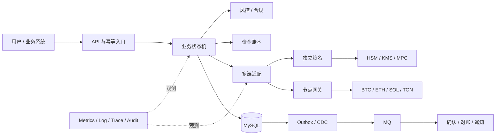
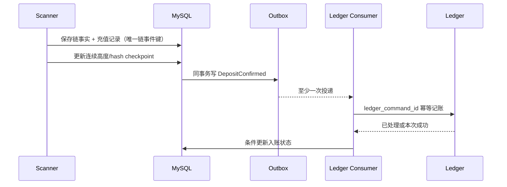
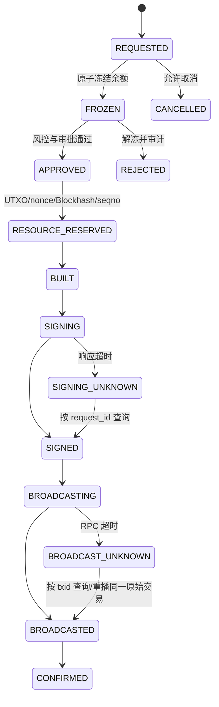
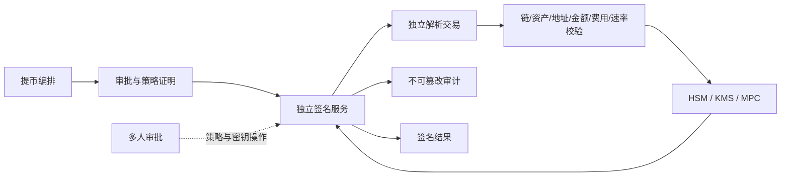
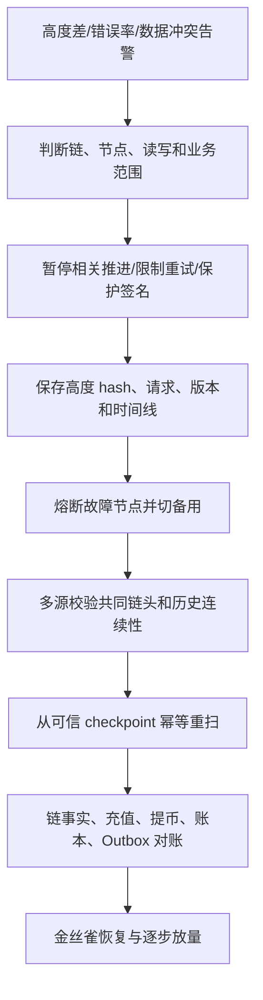
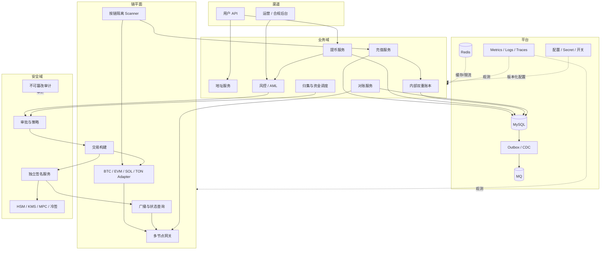
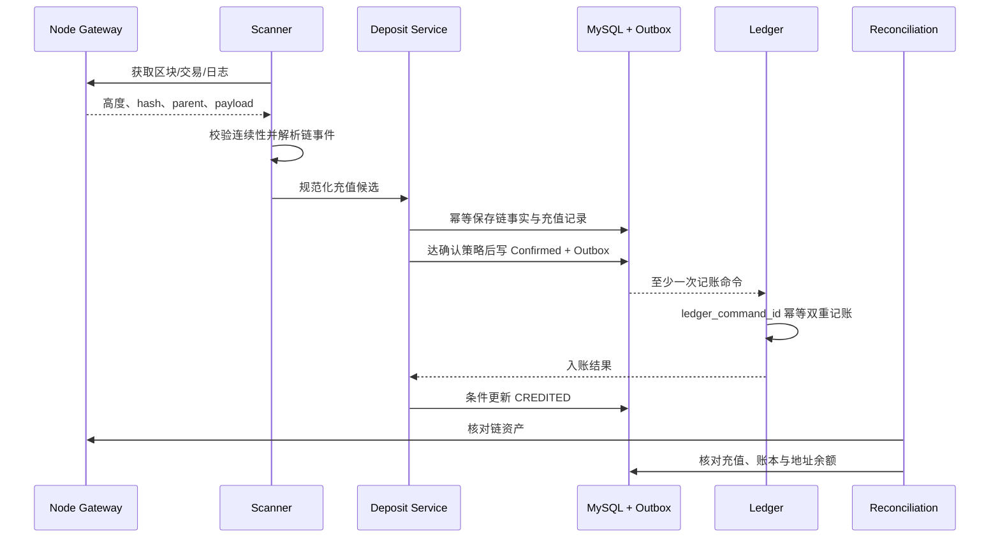
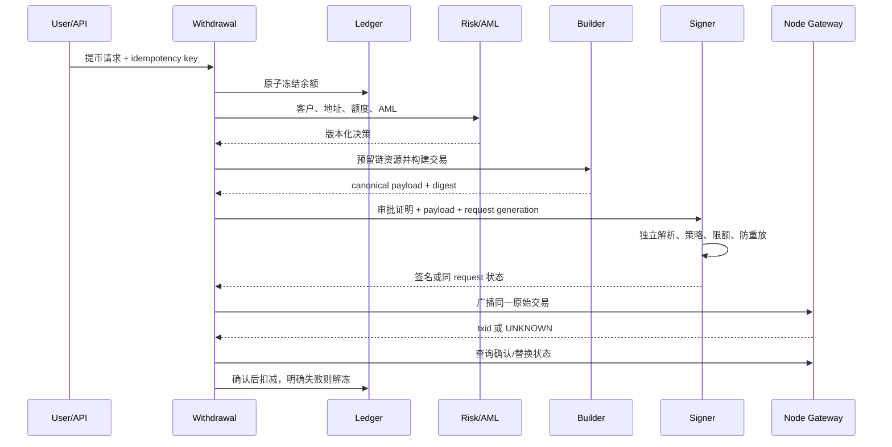
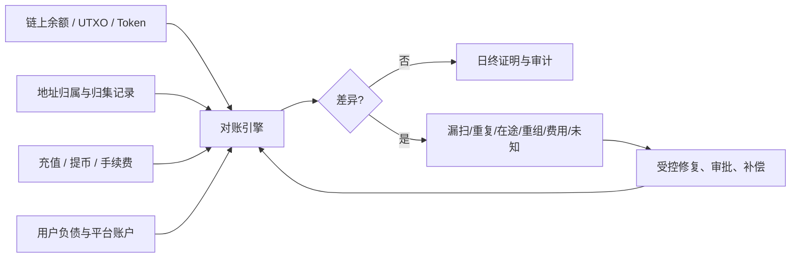

# Day 27：项目表达与综合系统设计

> 学习目标：用 STAR 和证据链表达项目；准备多链接入、充值幂等、提币一致性、私钥安全、节点故障五类案例；掌握从需求、容量、架构、数据、流程、安全、异常、监控到恢复的系统设计方法；用准确口径量化规模和结果；明确区分真实经历、个人实践与理论方案；在 45 分钟内完成支持 BTC、ETH、Solana、TON 的托管钱包设计。  
> 建议用时：5～6 小时  
> 完成标准：形成可口述的 3 分钟自我介绍和 10 分钟项目介绍，完成五张含结果与复盘的案例卡，限时完成四链托管钱包白板设计，并闭卷回答文末恰好 7 道面试题。

## 诚信边界与核心结论

- 不虚构公司、职位、上线规模、交易金额、事故、个人权限或生产结果。
- 真实工作、个人测试网实践、源码研究和理论方案必须明确标注，不能让面试官误以为全部来自生产。
- 不泄露前雇主名称、客户、地址、交易哈希、内部架构、漏洞、密钥策略、阈值或事故细节；必要时匿名化并说明限制。
- STAR 不是流水账。重点是约束、个人判断、关键动作、证据结果和事后反思。
- 数字必须有口径：时间窗口、统计对象、平均/P95/P99、成功率分母、数据来源和本人可验证范围。
- 系统设计先澄清需求，再估算容量；先保证资金正确性与密钥安全，再谈吞吐、成本和体验。
- “Exactly Once”通常不是基础设施承诺，而是至少一次交付、数据库唯一约束、条件状态迁移和幂等副作用共同形成的业务效果。
- 四条链应统一业务骨架，但保留 UTXO、nonce、Recent Blockhash、账户锁、`seqno` 和异步消息等链特有语义。
- 遇到不知道的问题，先说明已知边界、提出验证方法和保守处置，不编造 API 或生产经验。
- 方案中每个自动化动作都要回答：失败后状态在哪里、谁能重试、如何避免重复、如何监控、如何恢复。

表达不变量：

```text
E1. 每段经历明确标记为真实工作、个人实践、研究复盘或理论设计。
E2. 每个数字都有时间窗、分母、统计口径和可验证来源。
E3. “我们”描述团队结果，“我”只描述自己实际承担的分析、设计、实现和推动。
E4. 不披露真实密钥、地址、交易、客户、风控阈值和未公开事故信息。
E5. 不把测试网验证表述为生产上线，不把阅读源码表述为亲自实施。
E6. 系统设计中的假设在开头写明，假设变化时主动调整方案。
E7. 资金状态、链事实、账本和签名边界始终分离。
E8. 正常流程之后必须覆盖未知结果、重组、重复消息和依赖故障。
E9. 每个方案给出指标、告警、降级、恢复和对账证据。
E10. 不确定时明确说“我会如何验证”，而不是给出伪精确结论。
```

---

## 一、面试表达的证据层级

### 1. 四类材料

| 标签 | 定义 | 推荐说法 | 不能说成 |
|---|---|---|---|
| 真实工作 | 在受雇项目中实际参与 | “我负责了……，团队结果是……” | 未承担的 owner 或决策者 |
| 个人实践 | 本地/测试网独立完成 | “我在测试网实现并验证了……” | “生产上线并承载资金” |
| 研究复盘 | 阅读源码、文档或公开事件 | “我分析了……，结论是……” | “我处理过该事故” |
| 理论设计 | 基于经验提出目标方案 | “如果在该约束下设计，我会……” | “我们系统就是这样运行” |

### 2. 证据清单

可使用的证据：

```text
脱敏架构图
公开仓库代码和测试
测试网交易与自建指标
压测报告和故障注入记录
设计文档与评审结论
发布前后同口径指标
事故时间线与行动项（经匿名化）
代码审查、需求和验收记录
```

不可展示：

```text
私钥、助记词、Seed、生产 API Key
真实客户身份、余额、地址和交易关系
未公开安全漏洞和可利用细节
内部签名阈值、冷库位置和审批身份
受保密义务约束的源码、截图和事故材料
```

### 3. 从弱表达到强表达

弱表达：

> 我做过高并发钱包，使用 Redis 锁保证了 Exactly Once，性能提升很多。

问题：没有规模和口径；Redis 锁不能证明资金正确；“很多”不可验证；个人贡献不清。

强表达模板：

> 这部分属于【经历类型】。当时系统在【时间窗与负载口径】下出现【可观测问题】。我的职责是【实际边界】。我先用【证据】定位到【根因】，再通过【关键动作】建立【唯一约束/状态条件/恢复机制】。在同一压测口径下，【结果指标】从【前值】变为【后值】，同时用【重复消息/崩溃/对账测试】验证资金语义不变。局限是【未覆盖范围】，后续我会【改进】。

---

## 二、STAR 方法：从叙事到工程证据

### 1. STAR+L 结构

| 部分 | 占比 | 要回答的问题 |
|---|---:|---|
| S：Situation | 15% | 什么业务、规模、异常和约束？ |
| T：Task | 10% | 团队目标是什么，我负责什么？ |
| A：Action | 50% | 我如何分析、取舍、实施和验证？ |
| R：Result | 15% | 同口径数字、质量和业务结果是什么？ |
| L：Learning | 10% | 局限、错误、复盘和下一步是什么？ |

### 2. Situation

包含：

- 业务背景，但不讲无关公司历史；
- 用户/请求/交易规模及口径；
- 故障或目标的可观测表现；
- 安全、合规、时间、团队和兼容约束；
- 这是生产、测试网还是设计练习。

避免：“项目很复杂”“数据量特别大”“时间很紧”。这些词必须用事实替代。

### 3. Task

区分团队任务和个人责任：

```text
团队目标：把充值延迟恢复到 SLO，并保证不重复入账。
我的责任：定位扫描链路瓶颈，设计 checkpoint 与幂等改造，完成压测和灰度方案。
不在职责内：账本规则审批、节点采购、生产变更最终批准。
```

### 4. Action

用“判断 → 证据 → 动作 → 验证”组织，而不是罗列技术名词：

```text
判断：瓶颈可能在 RPC、解析或写库。
证据：按阶段增加 P99、队列年龄、连接池等待；JFR 显示反序列化热点。
动作：复用解析结果、批量查询、并发取块但连续提交 checkpoint。
验证：固定区块比较识别集合，注入重复、重组和进程崩溃。
```

### 5. Result

结果包括三层：

- 业务：延迟、成功率、事故时长、用户影响；
- 工程：吞吐、P99、资源、恢复时间、告警提前量；
- 正确性：重复副作用为零、对账差异、故障测试覆盖。

没有生产数字时，可以诚实报告测试条件：

> 在本地 8 核、固定 10 万笔合成交易、同一 JVM 参数下，处理吞吐从【实测值】提高到【实测值】；这只证明测试环境结果，不代表生产容量。

### 6. Learning

有价值的复盘不是“加强监控”，而是：

```text
当时遗漏了什么信号或约束
为何评审/测试没有发现
临时止损带来什么代价
后续如何改变设计、流程或告警
还有哪些风险未消除
重新做一次会怎样排序
```

---

## 三、量化表达与容量口径

### 1. 数字审计表

| 指标 | 必须补充的口径 |
|---|---|
| TPS/QPS | 峰值/均值、入口/下游、读/写、持续时长 |
| 日交易量 | 链交易/内部订单/Token Event，成功或全部 |
| 地址量 | 已分配/活跃/监控/有余额，去重规则 |
| 延迟 | 端到端或单阶段，P50/P95/P99，时间窗 |
| 可用性 | SLI、排除项、统计窗口和错误预算 |
| 成功率 | 分子/分母，重试是否重复计数 |
| RTO | 从何时到何种业务状态恢复 |
| RPO | 哪类数据允许丢失，通常资金记录目标为零 |
| 资金规模 | 若保密，只说量级或不披露，不能虚构 |
| 成本 | 节点、Gas、机器或人力，统计边界 |

### 2. 容量估算示例

假设练习场景，不代表真实生产：

```text
注册用户：10,000,000
活跃充值地址：2,000,000
日充值事件：500,000，峰值系数 8
日提币请求：100,000，峰值系数 10
支持：BTC、ETH/ERC-20、SOL/SPL、TON/Jetton
充值发现目标：安全链头后 P99 60 秒内进入待确认
提币 API 可用性目标：99.95%
关键资金数据 RPO：0（依赖同步持久化与恢复），RTO：30 分钟
```

平均充值事件率：

$$
\lambda_{deposit} = \frac{500000}{86400} \approx 5.79\ \text{events/s}
$$

按 8 倍峰值约 $46.3$ events/s。但扫链容量不能只按充值事件，因为需要解析所有区块交易和日志。应按每链区块频率、峰值区块大小、RPC payload、Token 合约数量分别估算。

平均提币率：

$$
\lambda_{withdrawal} = \frac{100000}{86400} \approx 1.16\ \text{requests/s}
$$

10 倍峰值约 $11.6$ requests/s。签名容量还要考虑批量提币、重试查询、HSM session、审批峰值和冷转热，不应直接等同 API QPS。

### 3. 存储粗估

若每个规范化链事件连同索引、审计和冗余平均占 $2$ KB，日事件 $500000$：

$$
Storage_{day} = 500000 \times 2\ \text{KB} \approx 0.95\ \text{GiB}
$$

这只是数量级估算，还需乘以副本、索引、Binlog、Outbox、保留期和增长系数。面试时主动说明未包含项，比给出伪精确容量更可信。

### 4. 可用性换算

30 天窗口内，99.95% 理论不可用预算约：

$$
30 \times 24 \times 60 \times (1 - 0.9995) = 21.6\ \text{minutes}
$$

但“API 能返回”不代表资金路径可用。充值发现、提币受理、签名、广播和查询要分别定义 SLI；安全性降级时暂停提币可能是正确行为，需在 SLO 与风险政策中明确。

---

## 四、3 分钟自我介绍模板

> 下面是可填充结构，不是让你逐字背诵。方括号内容必须替换为自己的真实信息；删除没有证据的句子。

### 1. 时间分配

```text
0:00–0:25  当前定位与年限
0:25–1:05  可迁移的 Java/分布式能力
1:05–1:50  钱包相关真实学习或实践证据
1:50–2:30  一个最相关案例及结果
2:30–3:00  岗位匹配与边界
```

### 2. 口述稿

> 您好，我是【姓名或称呼】，有【真实年限】年【Java 后端/分布式/支付等】经验，主要负责过【真实业务领域】。我的核心能力集中在三点：第一是【一致性/高可用/性能】；第二是【MySQL、Redis、MQ 或服务治理】；第三是【安全或资金类系统的工程纪律】。
>
> 在【真实项目或个人实践】中，我承担了【个人职责】，处理过【具体问题】。例如【一句话案例】，我通过【关键动作】把【同口径指标】从【前值】改善到【后值】，并用【故障测试/对账/监控】验证没有改变【关键业务语义】。这里我实际负责的是【边界】，团队结果是【结果】，我不会把团队工作全部算作个人贡献。
>
> 针对托管钱包方向，我已经系统梳理并实践了 BTC、EVM、Solana 和 TON 的交易、扫描、签名与并发差异，完成了【公开仓库中的真实成果：状态机/测试网解析/架构图/Runbook】。这些属于【个人实践或研究】，不是生产钱包经历。我能清楚说明验证条件、局限和如果进入生产还需补齐的安全与合规环节。
>
> 我与这个岗位的匹配点是，能把已有的【分布式一致性/支付账务/高可用】经验迁移到充值幂等、提币状态机、节点容灾和签名隔离，同时对不知道的链细节会先澄清、查规范并用测试向量验证。希望重点参与【真实目标方向】，并在资金正确性和可审计性优先的前提下提升交付效率。

### 3. 自我介绍审计

- [ ] 年限、职位和项目全部真实。
- [ ] 至少一个数字有明确口径。
- [ ] “我”和“团队”边界清楚。
- [ ] 钱包实践明确说明环境和性质。
- [ ] 没有逐项背技术栈。
- [ ] 没有“精通所有链”“绝对安全”等无法证明的表述。
- [ ] 2 分 40 秒到 3 分 10 秒可完成。

---

## 五、10 分钟项目介绍模板

### 1. 时间盒

| 时间 | 内容 | 面试官应获得的信息 |
|---:|---|---|
| 0:00–0:45 | 项目与经历类型 | 是什么、是否生产、本人角色 |
| 0:45–1:30 | 需求与规模 | 用户、流量、SLO、约束与口径 |
| 1:30–3:00 | 架构与边界 | 模块、数据、依赖和信任边界 |
| 3:00–5:00 | 主流程 | 充值/提币/账本等关键时序 |
| 5:00–7:00 | 最难问题 | 判断、证据、取舍与个人动作 |
| 7:00–8:15 | 异常与安全 | 重组、重复、超时、密钥和降级 |
| 8:15–9:15 | 结果 | 同口径业务、性能和正确性证据 |
| 9:15–10:00 | 复盘 | 局限、改进和可迁移能力 |

### 2. 项目介绍骨架

> 这个项目属于【真实工作/个人实践/研究/理论设计】，目标是【业务目标】。系统服务【用户/上下游】，在【时间窗】内规模约为【有口径数字】，关键目标是【正确性、SLO、RTO/RPO】。我的角色是【个人职责】，没有负责【边界】。
>
> 架构分为【入口、业务状态机、链适配、账本、签名、节点、数据与观测】。我这样拆分，是为了让【业务语义】与【链特有语义】分离，同时把【密钥、节点、数据库】划成独立故障域。核心数据源分别是【链事实、业务状态、账本、审计】，Redis/MQ 不作为资金最终事实。
>
> 主流程以【充值或提币】为例：【用 60–90 秒讲状态和幂等边界】。最难的问题是【问题】，最初表现为【指标/异常】。我提出【假设】，通过【日志、Trace、SQL、链上数据、故障注入】验证，最终采取【两到三个关键动作】，没有选择【备选方案】是因为【取舍】。
>
> 异常上覆盖【链重组/广播未知/节点冲突/消息重复/签名超时】，安全上通过【签名隔离、最小权限、限额、审批、审计】控制风险。故障时先【止损】，再【恢复】，最后用【对账】证明一致。
>
> 在【相同统计口径】下，结果是【指标变化】，正确性证据是【唯一约束、回归、故障测试、对账】。当前局限是【真实局限】。如果重做，我会优先【具体改进】。这个项目最能证明我具备【岗位相关能力】，但不能证明【尚未具备的经验】。

### 3. 项目架构图讲法



讲图时不要逐框念名词，应说明三条边界：

1. 链事实、业务状态和账本为什么分离；
2. 签名为什么独立并重新解析交易；
3. 链适配统一哪些能力、保留哪些特有资源。

### 4. 追问准备

```text
为什么不使用分布式事务？
数据库提交成功、MQ 失败怎么办？
广播超时为何不能直接重建交易？
Redis 锁失效后如何保证正确性？
节点返回冲突数据如何处理？
扩容后顺序和链资源如何协调？
最坏情况下会损失什么，如何限制？
你亲自写了什么，谁批准了方案？
结果数字从哪里来，能否复现？
方案中最大的未解决风险是什么？
```

---

## 六、五个项目案例卡片使用规则

每张卡片控制在 2～4 分钟。卡片中的方括号必须换成个人真实内容；若没有真实工作案例，明确使用个人测试网实践或理论推演。不要把下文的示例结果当成自己的履历。

通用卡片：

```text
标题：
经历类型：真实工作 / 个人实践 / 研究复盘 / 理论设计
时间与环境：
Situation：业务、规模、故障、约束
Task：团队目标、我的职责、非职责边界
Action：判断、证据、关键动作、取舍、验证
Result：业务、工程、正确性指标及口径
Learning：局限、错误、后续改进
证据：图、代码、测试、指标、复盘
敏感信息处理：
压力追问：
```

---

## 七、案例卡 1：多链接入

### 1. Situation

```text
经历类型：【填写真实类型】
目标链：【BTC / EVM / Solana / TON 或真实链】
原系统：【已有链、适配边界和部署方式】
目标：【充值、提币、归集、查询或全流程】
约束：【上线时间、SDK、节点、合规、团队】
规模口径：【地址、日交易、峰值区块/事件】
```

### 2. Task

> 团队目标是【可验收目标】。我负责【规范研究/适配接口/解析/签名/测试/灰度中的真实部分】，不负责【真实边界】。

### 3. Action

推荐叙事：

1. 建立链能力清单：地址、资产身份、费用、构建、签名、广播、查询、扫描、最终性；
2. 明确不可统一语义：BTC UTXO、EVM nonce、Solana Blockhash/账户锁、TON `seqno`/异步消息；
3. 用官方规范和固定测试向量验证地址、金额、字节序与签名；
4. 设计链适配 Port，链特有上下文显式携带；
5. 设计充值唯一键、checkpoint 和重组/回滚；
6. 设计提币链资源预留、未知广播和恢复；
7. 接入多节点交叉验证、指标、告警和暂停开关；
8. 测试网验证后影子扫描、灰度地址/额度和回滚。

### 4. Result

只填写真实结果：

```text
覆盖能力：【数量与定义】
测试向量：【通过数/总数】
测试网交易：【成功数、异常数、时间窗】
充值发现 P99：【口径】
故障恢复：【场景与时间】
对账差异：【口径】
```

### 5. Learning

- 统一接口容易隐藏链特有失败语义；
- 浏览器 API 只能辅助，不能成为唯一资金事实；
- 测试网成功不证明主网容量、安全和合规；
- 新链上线应从只读、影子扫描、充值到小额提币逐步扩大。

### 6. 压力追问

```text
如何识别同名假 Token/Jetton？
如何选择充值唯一键？
链重组或 Solana 交易过期怎么办？
TON Message 部分执行如何映射状态？
为什么不用一个统一 Transaction 类？
```

---

## 八、案例卡 2：充值幂等

### 1. Situation

```text
经历类型：【填写真实类型】
问题：【重复扫描、MQ 重投、服务崩溃或重组】
规模：【链、事件量、峰值和统计时间】
风险：【重复入账、漏账、负余额、人工成本】
```

### 2. Task

> 在至少一次扫描和消息投递前提下，实现业务效果上的一次入账，并能处理重组、补扫与崩溃恢复。

### 3. Action



关键动作：

- 唯一键包含链、网络、交易定位和资产/事件位置；
- 链事实、充值业务和账本分离；
- 充值确认与 Outbox 在本地事务；
- 消费端以稳定 `ledger_command_id` 幂等；
- 状态迁移带 expected state/version；
- checkpoint 只推进到连续持久化区块；
- 重组创建反向/补偿分录，不删除审计；
- 历史补扫独立限流但复用同一幂等路径。

### 4. Result

```text
重复输入次数：【真实测试口径】
账本分录次数：【预期与实测】
崩溃注入点：【事务前/后、Outbox 前/后】
重组场景：【深度和补偿结果】
历史补扫：【范围、耗时、对实时影响】
对账结果：【链事实、充值、账本差异】
```

### 5. Learning

- Broker 去重不能替代消费幂等；
- Redis 锁只能减冲突，不能成为最终正确性；
- 唯一索引需要正确业务键，错误键会稳定地产生漏账；
- 重组后的补偿是新事实，不能篡改历史流水。

### 6. 压力追问

```text
数据库成功后进程崩溃，消息如何发出？
同一 tx 有多个 Token Event 怎么区分？
BTC 一个交易多个输出到交易所怎么办？
重组移除已入账交易怎么办？
如何证明没有漏扫？
```

---

## 九、案例卡 3：提币一致性

### 1. Situation

```text
经历类型：【填写真实类型】
问题：【重复请求、签名超时、广播未知、链资源冲突】
业务目标：【不重复扣款、不重复支付、可恢复】
链范围：【真实范围】
```

### 2. Task

> 设计从请求幂等、余额冻结、审核、构建、签名、广播到确认的持久状态机；在任何一步崩溃或超时后恢复而不产生第二笔资金副作用。

### 3. Action



关键动作：

- 客户幂等键和提币业务 ID 唯一；
- 冻结余额与提币单同事务；
- 审批绑定规范化交易意图与版本；
- UTXO、nonce、Blockhash、`seqno` 使用各自资源模型；
- 签名请求绑定 request generation，超时查询同一 ID；
- 广播超时进入 unknown，按 txid/签名查询；
- 只有终态和明确失败才扣减/解冻；
- 超时扫描器按状态采取不同恢复动作。

### 4. Result

```text
重复 API 请求：【数量与结果】
并发资源冲突：【场景与约束结果】
签名/广播超时注入：【恢复证据】
资金分录：【冻结、扣减、解冻次数】
RTO：【从哪个状态恢复到什么状态】
```

### 5. Learning

- “请求失败”不等于链上未发生；
- 不同链的并发资源不能被一个通用锁隐藏；
- 状态机需要 unknown 状态，不能只有成功/失败；
- 人工修复也必须走幂等命令和审计。

### 6. 压力追问

```text
签名完成但响应丢失怎么办？
广播超时为什么不能构建新交易？
Redis 锁过期导致两个 Worker 怎么办？
余额在哪一步扣减？
链上成功但内部仍为广播中怎么办？
```

---

## 十、案例卡 4：私钥安全

### 1. Situation

```text
经历类型：【填写真实类型】
场景：【签名服务设计/密钥生命周期研究/测试实践】
资产与钱包层级：【只写可披露范围】
威胁：【外部入侵、内部作恶、供应链、灾难恢复】
```

### 2. Task

> 让业务系统无法接触私钥，让被攻陷的提币服务不能任意签名，并限制单次事件最大损失，同时保证可恢复和可审计。

### 3. Action



关键动作：

- 热、温、冷分层和单层损失上限；
- 签名服务独立网络、身份和部署；
- 不只签裸哈希，独立解析链、地址、金额、费用和合约；
- mTLS、短期凭据、请求防重放和业务绑定；
- HSM/KMS/MPC 中的 key usage、限额和多人控制；
- 密钥生成、备份、恢复、轮换、销毁仪式；
- 签名日志记录摘要、策略和结果，不记录私钥/敏感明文；
- 紧急暂停、撤权、资金迁移和恢复演练。

### 4. Result

不得伪造“零事故”。可报告：

```text
威胁模型覆盖：【威胁数量与分类】
负向策略测试：【拒绝数/总数】
重放测试：【结果】
单层额度测试：【结果】
恢复演练：【场景、RTO/RPO】
审计完整性：【验证方式】
```

### 5. Learning

- HSM、MPC 或多签都不是绝对安全；
- 密钥不导出不能阻止合法接口被滥用；
- 策略、审批、身份、供应链和恢复共同构成安全边界；
- 灾备副本和管理员权限本身也是攻击面。

### 6. 压力追问

```text
提币服务被攻陷为何仍不能盗币？
签名服务如何验证上游显示内容？
员工离职如何撤权？
密钥疑似泄露先做什么？
恢复演练如何避免接触真实私钥？
```

---

## 十一、案例卡 5：节点故障

### 1. Situation

```text
经历类型：【填写真实类型】
故障表现：【节点落后、分叉、429、广播失败或全供应商故障】
影响：【链、业务、延迟、金额范围】
发现方式：【告警、用户反馈、对账】
```

### 2. Task

> 在不信任单节点且不制造重复广播的前提下，隔离故障、保护资金路径、恢复链数据连续性，并证明系统状态一致。

### 3. Action



关键动作：

- 读、广播和归档节点池分离；
- 检查高度、hash、parent、finality 和响应新鲜度；
- 超时重试受 deadline、jitter 和预算约束；
- 多节点冲突时暂停推进，不简单多数表决；
- 广播超时重播相同原始交易或先查询；
- 全部节点故障时保留请求和账本状态，暂停不可证明安全的动作；
- 恢复前从共同 checkpoint 重扫并对账。

### 4. Result

```text
检测时间 MTTD：【起点和终点】
止损时间 MTTC：【定义】
恢复时间 MTTR/RTO：【恢复到何种状态】
积压最高值与清理时间：【口径】
重复/遗漏交易：【验证结果】
对账差异：【范围和结论】
```

### 5. Learning

- 多供应商可能共享上游或同时返回同一错误；
- 高度一致不代表 hash 与状态一致；
- 过度重试会把局部节点故障放大为全系统故障；
- 恢复服务需要一致性证据，不以“节点好了”结束。

### 6. 压力追问

```text
如何判断节点落后而不是链停止出块？
两个节点数据冲突听谁的？
全供应商不可用还能做什么？
广播成功率下降是否暂停充值？
恢复前如何证明没有漏块和重复支付？
```

---

## 十二、45 分钟综合系统设计方法

### 1. 时间盒

| 时间 | 输出 |
|---:|---|
| 0–5 分钟 | 澄清需求、范围、SLO、安全与合规假设 |
| 5–9 分钟 | 容量估算和热点判断 |
| 9–16 分钟 | 高层架构、信任边界、数据源 |
| 16–25 分钟 | 充值与提币主流程、状态机与账务 |
| 25–31 分钟 | 四链适配与链特有并发资源 |
| 31–36 分钟 | 私钥、安全、风控与权限 |
| 36–41 分钟 | 故障、重组、未知结果、容灾 |
| 41–44 分钟 | 指标、告警、对账和容量扩展 |
| 44–45 分钟 | 总结取舍、最大风险和演进路线 |

### 2. 开场澄清

```text
托管还是非托管？是否维护内部用户账本？
支持哪些主网、原生币和 Token？
充值地址独立还是共用地址 + Memo？
是否包含归集、冷热调度、合规和客服后台？
用户量、日充提量、峰值和资产规模量级？
充值发现、确认、提币受理和到账 SLO？
RTO/RPO、部署区域和合规辖区？
签名采用 HSM/KMS/MPC/多签中的哪类约束？
本题重点是总体设计还是深入某一链？
```

面试官不给数字时，声明练习假设并继续，不要停在无限提问。

---

## 十三、四链托管钱包白板设计

### 1. 总体架构



### 2. 核心数据边界

| 数据 | Source of Truth | 关键约束 |
|---|---|---|
| 链事实 | 链数据表 + 区块锚点 | chain/network/tx/event 唯一 |
| 扫描游标 | MySQL checkpoint | height + hash + fencing |
| 地址归属 | 地址服务数据库 | chain + canonical address 唯一 |
| 充值状态 | 充值服务数据库 | 链事件业务键唯一 |
| 提币状态 | 提币服务数据库 | 请求幂等键、条件迁移 |
| 用户余额 | 双重账本 | 不可变分录、借贷平衡 |
| 链资源 | UTXO/nonce 等资源表 | owner/generation/状态条件 |
| 签名请求 | 签名服务数据库 | business + generation 唯一 |
| 风控决策 | 风控决策库 | 规则/证据版本 |
| 审计 | Append-only/WORM | 主体、动作、摘要、时间 |

Redis 用于缓存、限流和短期协调，不是余额、nonce 或最终任务状态的唯一事实。MQ 至少一次投递，消费端必须幂等。

### 3. 充值主流程



充值状态：

```text
DETECTED -> PENDING_CONFIRMATION -> CONFIRMED -> CREDITING -> CREDITED
                |                       |
                v                       v
             REORGED              CREDIT_UNKNOWN
                -> 补偿/重新确认/人工处理
```

关键回答：至少一次扫描；链事件唯一键；height+hash；Outbox；账本命令幂等；重组补偿；历史重扫复用同一路径。

### 4. 提币主流程



关键回答：余额冻结与业务单一致；资源预留持久化；审批绑定交易意图；签名超时查询；广播未知不重建；确认后账务终结；人工动作也幂等。

### 5. 四链差异

| 维度 | BTC | EVM | Solana | TON |
|---|---|---|---|---|
| 状态模型 | UTXO | Account + nonce | Account/Program | Account/Contract + Message |
| 并发资源 | UTXO 预留 | 地址 nonce | Recent Blockhash、账户锁 | Wallet `seqno` |
| Token | Script/协议资产 | ERC-20 Event/Call | Mint + Token Account/ATA | Jetton Master/Wallet |
| 费用 | sat/vB，输入输出影响 | EIP-1559 Gas | CU + priority fee | Message/Storage fee |
| 过期/替换 | RBF/CPFP | 同 nonce 提价 | Blockhash 过期后重建 | valid_until/seqno |
| 结果判断 | 输出与确认 | Receipt + Event + 状态 | meta/error/balance | 消息链与阶段 |
| 重组/最终性 | 多确认 | safe/finalized/链策略 | commitment | 链/节点策略 |
| 地址特性 | 多脚本类型 | EOA/Contract | Owner/ATA/PDA | Workchain、bounce、memo |

不要把四条链压成一个字段堆叠的 `Transaction`。统一 `ChainAdapter` 能力和业务结果，特有构建上下文保留专用类型。

### 6. 签名与密钥

```text
热钱包：自动化、小额度、严格速率与单日限额
温钱包：增强审批、中等频率、补充热钱包
冷钱包：离线/隔离、大额储备、多人仪式

业务服务 -> 审批证明 -> 独立签名服务 -> HSM/KMS/MPC/冷签
```

签名服务独立校验：

- chain/network/transaction type；
- 资产、金额、收款地址和合约；
- 手续费与找零；
- UTXO/nonce/Blockhash/`seqno`；
- 调用 selector、calldata 和 Token identity；
- 业务 ID、审批版本、有效期与速率；
- payload digest 与审计摘要。

### 7. 高可用与容灾

| 模块 | 高可用 | 故障时 |
|---|---|---|
| Scanner | 多实例、分片 lease、fencing | 从 checkpoint 接管 |
| Node Gateway | 多供应商、读写分池、健康评分 | 熔断、切换、冲突暂停 |
| MySQL | 同步高可用、备份、PITR | 避免双主资金写入 |
| MQ | 多副本、Outbox、幂等消费 | 积压限流，不丢任务 |
| Signer | 独立实例/区域、HSM HA | 未知结果查询，风险优先暂停 |
| Risk/AML | 主备供应商、缓存边界 | 提币 Fail Closed |
| Ledger | 强一致写、不可变流水 | 禁止 Redis 兜底改余额 |

多区域设计要明确单写 owner、数据一致性、密钥地域与切换 fencing。不能为了“多活”允许两个区域并发分配同一 nonce 或花费同一 UTXO。

### 8. 监控与告警

```text
scan height/time lag、oldest block age
充值发现/确认/入账 P95/P99
提币各状态数量和 oldest age
重复键冲突和状态迁移失败
节点高度/hash 冲突、429、timeout、广播成功率
UTXO/nonce/Blockhash/seqno 资源异常
签名拒绝、延迟、HSM session、限额命中
MQ lag、Outbox age、DLQ
账本不平、链资产与内部负债差异
热钱包水位、手续费余额和归集失败
风控 pending、名单新鲜度和人工队列
```

### 9. 降级原则

```text
节点读故障：保留链事实处理队列，暂停不能验证的入账推进
广播节点故障：保留已签交易，切节点或重播同一原始交易
风控故障：充值继续扫链并限制可用，提币暂停
签名故障：保持冻结与原 request ID，禁止绕过签名策略
MQ 故障：Outbox 积压，数据库事务仍保存事实
Redis 故障：缓存/限流降级，不能改变最终资金事实
账本故障：资金状态保持 pending，不用业务表直接改余额
```

### 10. 对账闭环



---

## 十四、设计取舍：安全、效率与成本

### 1. 决策顺序

```text
法律与安全硬约束
资金正确性和最大损失上限
可恢复性与审计
用户 SLO 和可用性
吞吐与工程复杂度
基础设施和链上成本
```

### 2. 取舍表

| 冲突 | 选择方法 | 示例 |
|---|---|---|
| 确认速度 vs 重组风险 | 按链、金额、风险动态确认 | 大额 BTC 更多确认 |
| 热钱包余额 vs 提币速度 | 水位、预测、温冷补充 | 限制单点损失 |
| 多供应商 vs 成本 | 关键路径冗余、历史查询分层 | 广播和链头优先冗余 |
| 强一致 vs 吞吐 | 资金核心强约束，通知最终一致 | 账本不走异步最终余额 |
| 自动化 vs 内部风险 | 限额、双人审批、职责分离 | 冷转热不完全自动 |
| 批量提币 vs 时延 | 时间窗、费用与风险队列 | 高优先请求单独处理 |
| 日志完整 vs 隐私 | 摘要、引用、分级证据库 | 不记录私钥和 KYC 明文 |

### 3. 决策记录

```text
Context：业务和约束
Options：至少两个可行方案
Decision：选择与适用范围
Reasons：安全、正确性、SLO、成本证据
Consequences：接受的代价和残余风险
Metrics：验证指标和失败阈值
Rollback：如何回退
Owner / Review Date：责任与复审
```

---

## 十五、事故表达与复盘

### 1. 事故回答结构

```text
经历类型与保密边界
影响范围与指标口径
发现方式和时间线
第一止损动作及理由
根因和促成因素
我的具体行动与团队协作
恢复前一致性证明
长期行动项与验证
个人反思
```

### 2. 根因层级

不要停在“某人误操作”或“节点异常”：

```text
触发因素：节点返回陈旧高度
技术根因：健康检查只看 HTTP 200
放大因素：多个服务立即重试并共享连接池
检测缺口：没有高度/hash 新鲜度和重试放大指标
流程缺口：节点切换未演练，Runbook 缺少恢复对账门禁
```

### 3. 事故中诚实表达

如果没有生产事故经历：

> 我没有亲自处理过符合这个严重级别的生产钱包事故，不能把演练说成事故。最接近的是【真实分布式/支付事故】；其中可迁移的方法是【止损、证据、恢复、复盘】。针对钱包场景，我做过【故障演练】，下面按演练结果说明，并指出它与生产的差距。

这比虚构“热钱包被盗后我力挽狂澜”专业得多。

---

## 十六、压力追问方法

### 1. 五步回应

1. 复述问题并确认假设；
2. 先给结论；
3. 给一条核心原理；
4. 展开生产实现、异常和证据；
5. 主动说边界与替代方案。

### 2. 不知道时

```text
我目前能确定的是……
不确定的是具体版本/链规则……
在资金路径上我会先采取保守动作……
我会查官方规范/节点源码/测试向量，并用……验证……
在确认前不会……
```

### 3. 纠错时

> 我刚才把【A】和【B】混在一起了，我修正一下。正确边界是【结论】；这会使方案中的【部分】改为【动作】，但【不变量】不变。

承认并快速修正比继续维护错误答案更可靠。

### 4. 控制篇幅

- 先用 20 秒给摘要；
- 询问面试官希望深入数据、链差异还是安全；
- 单题默认 2～5 分钟；
- 每层最多 3 个重点；
- 避免从密码学历史开始讲提币系统。

---

## 十七、四周知识快速串联

| 主题 | 一句话主线 | 必须能追问到 |
|---|---|---|
| BTC | UTXO、Script、确认、RBF/CPFP | 选币、锁定、重组、PSBT |
| EVM | Account、nonce、Gas、Receipt/Event | 并发 nonce、替换、Token 异常 |
| Solana | Account、Instruction、Blockhash | ATA、账户锁、过期重建 |
| TON | Cell、Message、钱包合约、`seqno` | Jetton、Memo、异步失败 |
| 地址 | 派生、分配、归属、校验 | xpub 风险、memo、恢复 |
| 充值 | 至少一次扫描 + 幂等入账 | checkpoint、重组、补扫 |
| 提币 | 冻结 + 状态机 + 链资源 + 未知结果 | 签名/广播超时 |
| 归集 | 成本、安全、水位与链特有费用 | Gas 补充、UTXO 碎片 |
| 账本 | 双重记账、不可变分录、对账 | 精度、补偿、差异分类 |
| 分布式 | MySQL 约束 + Outbox + 幂等消费 | Redis/MQ 边界 |
| 节点 | 多供应商、交叉验证、读写隔离 | 熔断、重扫、恢复证明 |
| 密钥 | 冷热分层、HSM/MPC/多签 | 生命周期、权限、灾备 |
| 签名 | 独立解析、策略、限额、防重放 | 威胁模型、应急停机 |
| 合约 | 代码身份、模拟、allowance、代理 | DeFi 隔离、漏洞止损 |
| 合规 | 信号、规则、案件、资金动作分层 | 误报、隐私、故障降级 |
| Java | 隔离仓、deadline、JVM、优雅停机 | 不改资金语义的优化 |

---

## 十八、口头面试题参考答案

> 本节严格包含计划中的 7 道题。涉及个人经历的答案必须替换为真实内容；参考答案只提供结构和技术深度，不能当作个人履历照读。

### 1. 请介绍你做过的最复杂的钱包或分布式系统项目。

**参考回答：**

先明确项目属于真实工作、个人实践还是理论设计，再用 10 分钟模板压缩。开头说明业务、规模口径、SLO、本人职责和非职责边界；随后画出入口、状态机、账本、链适配、签名、节点和数据边界，以一条充值或提币主流程说明幂等与恢复。

重点选择一个真正复杂的问题，按假设、证据、动作、取舍和验证展开，而不是堆技术栈。结果同时给业务、性能和正确性证据，并说明时间窗和分母。最后指出局限与复盘。如果没有生产钱包项目，应明确说最接近的分布式经验及测试网实践，解释可迁移能力，不虚构上线和资金规模。

### 2. 如何从零接入一条新链？

**参考回答：**

先做链规范与风险评估：状态模型、地址、资产身份、交易结构、签名、费用、并发资源、最终性、重组和节点能力。再定义适配边界，统一地址校验、费用、构建、广播、查询和扫描等能力，同时保留 UTXO、nonce、Blockhash、`seqno` 等特有类型。

实现上使用官方规范、成熟 SDK 和固定测试向量，设计充值唯一键、checkpoint、提币资源预留、未知结果与恢复；接入多节点、指标、告警、对账和暂停开关。发布从离线解析、测试网、影子扫描、只开充值到小额提币逐级灰度。每一步比较链事实、状态、账本和签名结果，能回滚且不泄露密钥。

### 3. 请设计支持 BTC/ETH/SOL/TON 的交易所钱包。

**参考回答：**

先澄清托管范围、资产、规模、SLO、合规和密钥约束。总体拆为地址、扫描、充值、提币、归集、账本、对账、风控、链适配、节点网关、独立签名和观测平台。链事实、业务状态与双重账本分离，MySQL 是关键状态事实，Outbox 与幂等消费传递事件。

充值采用至少一次扫描、height+hash checkpoint、链事件唯一键、确认策略和重组补偿。提币采用请求幂等、原子冻结、审批、链资源预留、独立签名、广播 unknown 和确认终结。四链分别处理 UTXO、nonce、Blockhash/账户锁、`seqno`/异步消息。密钥冷热分层，节点多供应商隔离；故障时保守降级，恢复后以链、业务、账本和审计对账证明一致。

### 4. 你处理过最严重的生产事故是什么？如何复盘？

**参考回答：**

只能回答真实事故，并先说明保密和个人职责边界。按影响口径、发现、止损、证据、根因、恢复、结果和行动项组织。重点解释为何选择某个止损动作，如何避免二次资金风险，以及恢复前如何用数据和对账证明状态一致。

根因要覆盖触发、技术缺陷、放大因素、检测和流程缺口，不能归咎个人。行动项必须有 owner、期限和验证。如果没有严重生产事故，直接说明没有，使用最接近的真实事件和钱包故障演练分别回答，明确二者差距，绝不把演练包装成事故。

### 5. 如何证明你的设计不会重复入账或重复提币？

**参考回答：**

不能证明整个分布式系统“消息只来一次”，而要证明业务副作用至多一次且可恢复。充值使用稳定链事件唯一键、条件状态迁移、确认与 Outbox 本地事务、稳定账本命令 ID 和消费幂等；checkpoint 只连续推进。提币使用客户端幂等键、余额冻结事务、持久化链资源、签名 request generation 和广播 unknown 查询。

证明来自约束和测试：重复请求/消息、并发 Worker、事务前后崩溃、签名响应丢失、广播超时、重组和历史重扫。每个注入点检查链事实、业务记录、账本分录、签名和交易集合，并做端到端对账。Redis 锁和 Broker 去重只能降冲突，不作为最终证明。

### 6. 安全、效率、成本发生冲突时如何决策？

**参考回答：**

先识别法律、安全和资金正确性的硬约束，再量化最大损失、SLO、错误预算与成本。不可逆签名、账本和密钥控制不能为吞吐降级；非关键查询、历史重扫和通知可以延迟。通过风险分层寻找折中，例如大额更多确认、热钱包水位限制、关键节点多供应商、批量提币时间窗和高风险人工审批。

用 ADR 记录选项、证据、后果、残余风险、指标和回滚，并设置复审时间。发生故障时宁可暂停不能证明安全的资金流出，同时保持链事实采集和可恢复状态。决策不是“安全永远第一”的口号，而是明确哪些不变量不能破坏、接受了什么体验和成本代价。

### 7. 如果没有一年交易所钱包经验，为什么你仍适合这个岗位？

**参考回答：**

先承认经验边界，不声称短期学习等同生产经验。说明已有 Java、分布式一致性、支付/账务、安全或高可用能力如何映射到钱包：唯一约束和 Outbox 对应充值幂等，状态机和未知结果对应提币，隔离与服务治理对应节点和签名故障。

再提供可验证学习证据，例如四链交易解析、状态机、测试网实验、威胁模型、Runbook 和故障注入，并清楚标记为个人实践。强调面对未知链规则会查官方规范、使用测试向量、评审和灰度，不冒险猜测。最后说明入职后的补齐计划和可承担范围，用诚实、学习速度与工程纪律证明潜力，而不是贬低钱包生产经验的价值。

---

## 十九、模拟面试评分表

每项 1～5 分：

| 维度 | 1 分 | 3 分 | 5 分 | 得分 |
|---|---|---|---|---|
| 真实性 | 经历边界模糊 | 能区分实践与生产 | 主动声明证据、边界与保密 |  |
| 结构 | 流水账 | 基本 STAR | 结论清晰、时间受控、可深入 |  |
| 个人贡献 | 全程“我们” | 能说负责部分 | 判断、推动、协作和边界可验证 |  |
| 量化 | “很多、很快” | 有少量数字 | 口径、前后值、分母与来源完整 |  |
| 技术深度 | 只列组件 | 有正常流程 | 不变量、异常、取舍和恢复完整 |  |
| 四链差异 | 强行统一 | 知道主要差异 | 能落实到数据、状态、并发和测试 |  |
| 资金正确性 | 依赖锁和 MQ | 有幂等 | 约束、状态、故障测试和对账闭环 |  |
| 安全 | 只说加密 | 有签名隔离 | 威胁、限额、权限、审计和应急完整 |  |
| 沟通 | 背稿或绕题 | 能回答问题 | 会澄清、纠错、承认未知并给验证法 |  |
| 复盘 | “加强监控” | 有行动项 | 根因层级、owner、验证和残余风险 |  |

**总分：** ____ / 50  
**建议门槛：** 核心题不低于 4 分，总分不低于 40 分。

---

## 二十、当天任务

### 任务 1：材料盘点（30～45 分钟）

- [ ] 将经历标为真实工作、个人实践、研究或理论设计。
- [ ] 删除无法验证的职位、规模、结果和安全表述。
- [ ] 为每个数字补充时间窗、分母和数据来源。
- [ ] 标记需要匿名化或不能披露的内容。

### 任务 2：自我介绍与项目介绍（60 分钟）

- [ ] 写出并录制 3 分钟自我介绍。
- [ ] 写出并录制 10 分钟项目介绍。
- [ ] 检查“我”和“团队”的贡献边界。
- [ ] 各删减一次，使结论更早、技术名词更少。

### 任务 3：五张案例卡（75～90 分钟）

- [ ] 完成多链接入案例卡。
- [ ] 完成充值幂等案例卡。
- [ ] 完成提币一致性案例卡。
- [ ] 完成私钥安全案例卡。
- [ ] 完成节点故障案例卡。
- [ ] 每张卡包含结果、局限、复盘和三个压力追问。

### 任务 4：综合设计（45～60 分钟）

- [ ] 限时 45 分钟画四链托管钱包。
- [ ] 覆盖容量、充值、提币、账本、密钥和链差异。
- [ ] 覆盖重组、未知结果、节点和风控故障。
- [ ] 用最后 5 分钟总结取舍、指标和演进。

### 任务 5：压力追问（45 分钟）

- [ ] 请同事/朋友随机选择 10 个追问。
- [ ] 每题先在 20 秒内给结论。
- [ ] 记录一次不知道、一次纠错和一次被打断后的表现。
- [ ] 回听并删除虚词、重复背景和无口径数字。

### 任务 6：口述（30～45 分钟）

- [ ] 不看资料回答本节恰好 7 道题。
- [ ] 所有经历题只使用真实材料。
- [ ] 将评分低于 4 的问题记入 `progress.md`。
- [ ] 为 Day 28 选择最高优先级的三个薄弱点。

---

## 二十一、闭卷验收

- [ ] 能解释真实工作、个人实践、研究和理论设计的边界。
- [ ] 能在不泄密的前提下提供项目证据。
- [ ] 能用 STAR+L 在 3 分钟内讲清案例。
- [ ] Situation 包含规模、问题和约束。
- [ ] Task 区分团队目标和个人职责。
- [ ] Action 包含判断、证据、取舍和验证。
- [ ] Result 包含业务、工程和正确性结果。
- [ ] Learning 包含遗漏、局限和具体改进。
- [ ] 每个数字有时间窗、分母和来源。
- [ ] 能区分平均、峰值、P95 和 P99。
- [ ] 能估算事件率、存储和不可用预算。
- [ ] 能在 3 分钟内完成自我介绍。
- [ ] 能在 10 分钟内完成项目介绍。
- [ ] 能明确说明钱包实践不是生产经验。
- [ ] 能讲清个人贡献而不抢团队成果。
- [ ] 已完成五张不同主题的案例卡。
- [ ] 每张卡都有真实结果或明确的测试结果。
- [ ] 没有把示例数字当作个人履历。
- [ ] 能在 5 分钟内澄清综合设计需求。
- [ ] 能做有假设、有口径的容量估算。
- [ ] 能画出四链钱包总体架构。
- [ ] 能分离链事实、业务状态和双重账本。
- [ ] 能讲清充值幂等和重组补偿。
- [ ] 能讲清提币状态机和未知结果。
- [ ] 能比较 BTC/EVM/Solana/TON 的链特有资源。
- [ ] 能设计冷热分层和独立签名服务。
- [ ] 能设计节点、数据库、MQ 和签名容灾。
- [ ] 能列出关键指标、告警和对账闭环。
- [ ] 能用硬约束、风险和证据做取舍。
- [ ] 能在不知道时提出保守动作和验证方法。
- [ ] 能接受打断、纠错并回到主线。
- [ ] 闭卷回答恰好 7 道面试题。

## 二十二、Day 27 验收清单

- [ ] 已完成 3 分钟自我介绍稿和录音。
- [ ] 已完成 10 分钟项目介绍稿和录音。
- [ ] 已标注所有材料的经历类型。
- [ ] 已核实年限、职责、规模和结果真实性。
- [ ] 已匿名化客户、地址、交易和内部安全信息。
- [ ] 已为所有数字补充统计口径。
- [ ] 已区分个人贡献和团队结果。
- [ ] 已完成多链接入案例卡。
- [ ] 已完成充值幂等案例卡。
- [ ] 已完成提币一致性案例卡。
- [ ] 已完成私钥安全案例卡。
- [ ] 已完成节点故障案例卡。
- [ ] 五张卡均包含结果与复盘。
- [ ] 五张卡均准备了压力追问。
- [ ] 已限时完成四链托管钱包架构图。
- [ ] 已完成容量、存储和可用性粗估。
- [ ] 已画出充值和提币主流程。
- [ ] 已说明账本、Redis、MQ 的职责边界。
- [ ] 已说明四链状态和并发差异。
- [ ] 已覆盖地址、归集、冷热调度和对账。
- [ ] 已覆盖签名隔离、权限、限额和审计。
- [ ] 已覆盖重组、重复、超时和依赖故障。
- [ ] 已定义核心 SLI/SLO、RTO 和 RPO。
- [ ] 已给出安全、效率和成本取舍依据。
- [ ] 已准备无生产钱包经验时的诚实回答。
- [ ] 已完成至少一次不知道问题的应对练习。
- [ ] 已完成至少一次主动纠错练习。
- [ ] 已请他人进行压力追问并记录反馈。
- [ ] 已录音回答 7 道题并更新 `progress.md`。

## 二十三、30 分自评分

| 能力 | 1 分 | 3 分 | 5 分 | 今日得分 |
|---|---|---|---|---|
| 诚信与证据 | 经历边界模糊 | 能说明材料类型 | 数字、贡献、证据和保密边界完整 |  |
| 项目表达 | 流水账背稿 | 能用 STAR | 结论前置、取舍深入且时间受控 |  |
| 案例深度 | 只讲正常流程 | 有异常处理 | 五类案例均有指标、恢复、复盘 |  |
| 系统设计 | 堆组件 | 有充提架构 | 四链差异、账本、安全和容灾闭环 |  |
| 决策取舍 | 只喊安全第一 | 能比较方案 | 用硬约束、风险、SLO、成本和 ADR 决策 |  |
| 压力沟通 | 不知道就猜 | 能澄清问题 | 能承认边界、纠错并提出验证路径 |  |

**当日总分：** ____ / 30  
**自我介绍时长：** ______________________________  
**项目介绍时长：** ______________________________  
**最有证据的案例：** ______________________________  
**最弱案例及缺口：** ______________________________  
**无口径或待核实数字：** ______________________________  
**综合设计遗漏：** ______________________________  
**压力追问反馈：** ______________________________  
**Day 28 三个优先补强点：** ______________________________