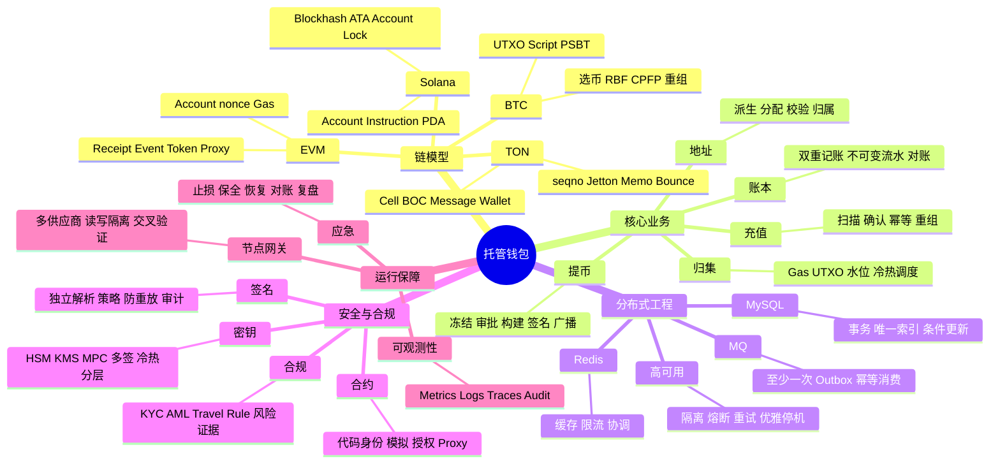
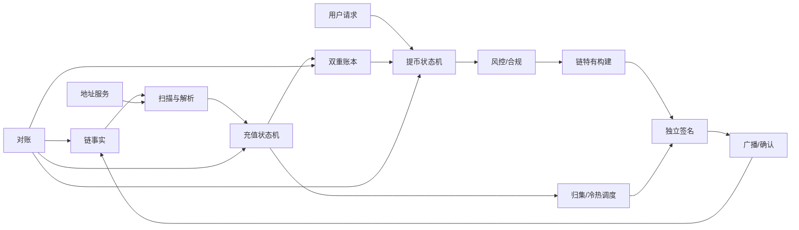
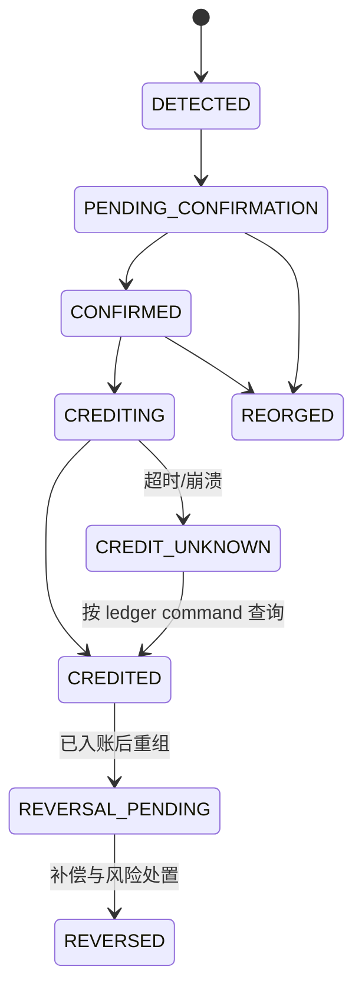
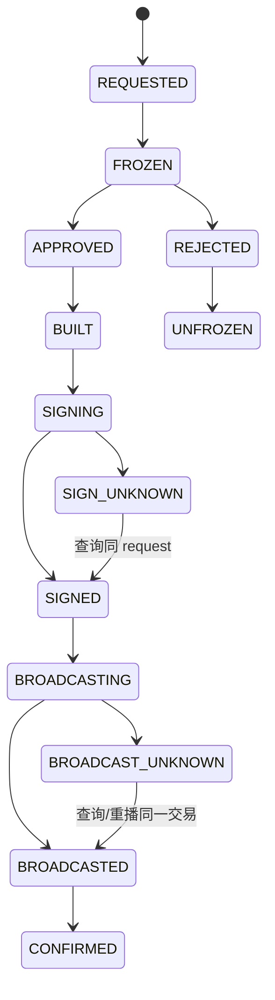
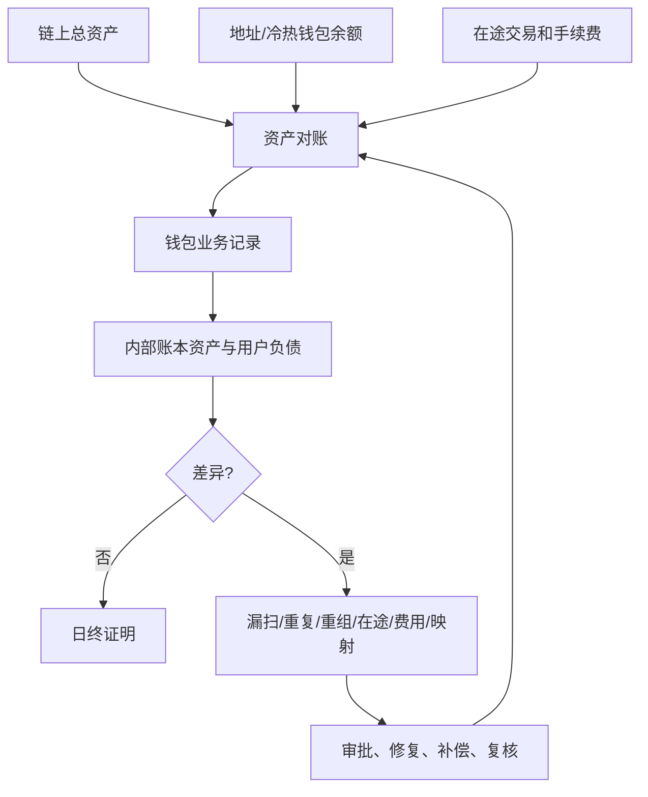
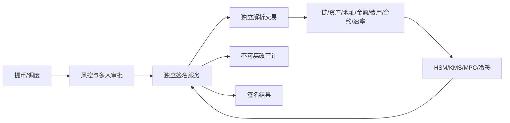

# Day 28：全真模拟面试与最终查漏补缺

> 学习目标：完成一轮严格计时的 90 分钟全真模拟面试；串联 BTC、ETH、Solana、TON、充提、账本、节点、密钥、分布式、合约与合规知识；根据录音和证据识别最高优先级薄弱项；形成面试速查表；制定最后 24 小时轻量复习计划；在未知问题前能澄清假设、诚实说明边界并给出验证路径。  
> 建议用时：5～6 小时，其中全真模拟 90 分钟，回听与复盘 90 分钟。  
> 完成标准：录制一轮不暂停、不查资料的模拟面试，输出最终知识地图、排序后的薄弱项清单和速查表，制定最后 24 小时安排，并闭卷回答文末恰好 10 道题。

## 最终原则

- 今天不再无序扩展新主题。优先修复会导致资金错误、安全误判或回答结构崩溃的前三个缺口。
- 模拟必须一次完成。卡住时也继续计时，才能暴露真实面试中的信息检索和压力问题。
- 不把测试网、个人项目、源码研究或理论方案说成生产经历；不虚构 TPS、资产规模、事故或个人职责。
- 不知道具体链规则时，先声明假设和不确定点，再给保守动作、官方资料来源与验证方法。
- 系统设计先讲不变量：不重复入账、不重复支付、密钥不出安全边界、未知结果不盲重试、恢复前完成对账。
- 回答不能只覆盖正常流程。至少包含一个异常、一个监控信号和一个恢复证据。
- 面试前最后 24 小时不做高风险环境变更，不接触真实密钥，不熬夜堆新术语。
- 速查表用于复习结构，不用于面试时逐字背诵。

最终回答骨架：

```text
结论
  -> 假设与边界
  -> 原理和不变量
  -> 生产流程与数据约束
  -> 异常、安全和取舍
  -> 指标、降级、恢复与对账
```

---

## 一、90 分钟全真模拟面试

### 1. 环境准备

```text
一台录音设备或本机录音软件
一张空白纸或白板
计时器
题目卡（只显示题目，不显示答案）
安静环境与稳定网络
一杯水
```

关闭教程、搜索、IDE 补全和聊天工具。允许面试官追问，但答题者不能暂停录音查资料。白板可拍照保存，禁止包含真实密钥、客户、地址或内部资料。

### 2. 严格时间表

| 时间 | 环节 | 目标 |
|---:|---|---|
| 0–3 分钟 | 自我介绍 | 真实、相关、有证据 |
| 3–8 分钟 | 项目概览 | 规模、角色、架构、结果 |
| 8–30 分钟 | 技术问答 | 四链、充提、分布式、安全 |
| 30–60 分钟 | 系统设计 | 四链托管钱包白板题 |
| 60–72 分钟 | 项目压力追问 | 个人贡献、取舍、数字、局限 |
| 72–84 分钟 | 事故与行为题 | 止损、协作、复盘、诚实边界 |
| 84–88 分钟 | 候选人提问 | 业务、团队、质量和岗位预期 |
| 88–90 分钟 | 收尾 | 纠正关键口误，简短总结 |

### 3. 面试官脚本

技术问答随机抽取：

```text
解释 BTC UTXO 与 EVM nonce 的并发差异。
Solana Blockhash 过期后为什么不能无脑重签？
TON 消息发送成功为何不等于业务成功？
数据库提交成功但 MQ 发送失败怎么办？
Redis 锁为什么不能保证资金正确性？
充值已经入账后发生重组怎么办？
广播超时后如何处理？
签名服务为什么不能只签裸哈希？
节点供应商全部故障如何降级？
AML 服务超时是否继续提币？
```

项目压力追问：

```text
这部分是你做的还是团队做的？
这个数字的时间窗、分母和来源是什么？
为什么没有选择另一个方案？
最坏情况下会损失什么？
你如何证明修复没有改变资金语义？
方案中最大的未解决风险是什么？
如果流量增长十倍，先坏在哪里？
如果重新做一次，你会先改什么？
```

事故与行为题：

```text
描述一次真实事故；如果没有钱包事故，明确说明边界。
你何时主动暂停过发布或资金路径？
与安全/合规意见冲突时如何决策？
发现自己技术判断错误时如何处理？
面对无法按期完成的高风险需求怎么办？
```

### 4. 30 分钟系统设计时间盒

```text
0–3 分钟：澄清托管范围、资产、规模、SLO、RTO/RPO
3–6 分钟：容量数量级和热点
6–11 分钟：总体架构、信任边界、数据源
11–17 分钟：充值、提币和账本主流程
17–21 分钟：BTC/ETH/SOL/TON 特有语义
21–24 分钟：冷热分层、签名、风控与合规
24–27 分钟：故障、重组、未知结果和容灾
27–29 分钟：监控、对账、灰度与回滚
29–30 分钟：总结取舍和最大风险
```

### 5. 模拟纪律

- 面试官可在任意回答 90 秒后打断；
- 至少追问一次异常和一次数据一致性；
- 至少给一个信息不足的问题；
- 至少纠正答题者一个错误假设；
- 系统设计中途将流量提高十倍或让节点全部故障；
- 答题者不得用“实际肯定不会发生”回避；
- 没有搭档时，提前录制题目音频并定时播放。

---

## 二、模拟面试评分

### 1. 四项主评分

| 维度 | 1 分 | 3 分 | 5 分 |
|---|---|---|---|
| 准确 | 概念混淆或资金语义错误 | 主流程正确 | 边界、链差异和异常均准确 |
| 结构 | 绕题、无结论 | 有基本层次 | 结论前置、时间受控、可深入 |
| 深度 | 只列名词 | 有生产流程 | 数据约束、安全、取舍、恢复完整 |
| 简洁 | 大量重复 | 能在 5 分钟内回答 | 20 秒摘要后按追问展开 |

每个题目记录：

```text
准确：__/5
结构：__/5
深度：__/5
简洁：__/5
总分：__/20
致命错误：
遗漏异常：
无证据表述：
一句话修正版：
```

### 2. 一票否决项

- 暗示私钥存数据库或业务服务；
- 将 Redis 锁、MQ Exactly Once 当作资金最终保证；
- 广播超时直接构建并发送新交易；
- 风控/签名未知时默认放行提币；
- 链重组通过删除账本历史“修复”；
- 使用 `double` 保存资产金额；
- 把测试网实践说成生产经验；
- 泄露真实密钥、客户、交易或安全阈值；
- 不经验证相信单个节点或浏览器 API；
- 声称任何系统“绝对安全、绝不重复”。

### 3. 总分

```text
技术问答：30 分
系统设计：30 分
项目表达：15 分
事故与行为：15 分
真实性与沟通：10 分
总分：100 分
```

建议标准：80 分以上且无一票否决项；任一资金正确性、安全或诚信项低于 4/5，列为最高优先级。

---

## 三、最终知识地图



### 1. 贯穿全图的五条主线

```text
事实：链上实际发生了什么？锚点和证据是什么？
状态：业务当前处在哪一步？允许哪些迁移？
价值：账本记录了什么债权、负债和费用？
权限：谁可以构建、批准、签名、广播和修复？
恢复：失败或未知后从哪里继续，如何证明一致？
```

### 2. 四链总表

| 维度 | BTC | EVM | Solana | TON |
|---|---|---|---|---|
| 模型 | UTXO | Account | Account/Program | Account/Contract/Message |
| 签名 | ECDSA/Schnorr | ECDSA | Ed25519 | Ed25519 |
| 并发点 | UTXO 预留 | nonce | Blockhash、账户锁 | Wallet `seqno` |
| Token | 协议/脚本资产 | ERC-20 | SPL/ATA | Jetton Wallet |
| 费用 | sat/vB | EIP-1559 Gas | CU/Priority Fee | Message/Storage Fee |
| 过期/加速 | RBF、CPFP | 同 nonce 替换 | Blockhash 过期重建 | valid_until/seqno |
| 结果 | 输出与确认 | Receipt/Event/状态 | meta/error/balance | 消息链和执行阶段 |
| 充值键 | txid+vout | txHash+logIndex | signature+instruction/path | tx/message/query context |
| 风险重点 | 双花、重组、碎片 | nonce、合约、Token | 过期、账户锁、ATA | 异步、bounce、memo |

### 3. 核心业务地图



### 4. 资金正确性地图

| 场景 | 最终约束 | 不能只依赖 |
|---|---|---|
| 充值不重复 | 链事件唯一键 + 账本命令幂等 | 内存去重、MQ 去重 |
| 扫描不漏 | height+hash checkpoint + 连续推进 + 重扫 | 最新高度、Webhook |
| 提币不重复 | 请求幂等 + 冻结事务 + 状态条件 | API 网关去重 |
| 链资源唯一 | DB 状态/唯一约束/fencing | Redis 锁 |
| 签名不重复滥用 | request generation + payload/策略绑定 | 客户端超时判断 |
| 广播未知 | 同 tx 查询/重播，不重建 | RPC 返回值 |
| MQ 一致性 | 本地事务 + Outbox + 幂等消费 | Broker Exactly Once |
| 修复可审计 | 新补偿分录 + 审批 | 修改/删除历史流水 |

---

## 四、充值速查

```text
扫描：至少一次，节点可重复，处理必须幂等
游标：height + block hash，连续提交
唯一键：链、网络、交易、输出/Event/Instruction 位置、资产
确认：按链、资产、金额、风险动态配置
入账：Confirmed + Outbox 同事务；账本命令幂等
重组：找共同祖先，标记链事实，反向/补偿账务
漏扫：隔离历史重扫，复用同一幂等路径
恢复：链事实、充值、账本、Outbox 和游标对账
```



面试禁区：不能说“扫到一次就够”“确认后永不重组”“删除入账流水”“Redis 防重复即可”。

---

## 五、提币速查

```text
入口：客户端 idempotency key
账务：申请时原子冻结，明确拒绝时解冻，确认后终结
审核：账户、额度、地址、AML、审批版本
构建：持久化 UTXO/nonce/Blockhash/seqno 资源
签名：独立解析 payload，request generation 防重放
广播：超时进入 UNKNOWN，查询 txid/签名，必要时重播同一原始交易
确认：链状态与业务状态协调，卡住时按链加速
恢复：每个状态有 owner、超时、幂等恢复和人工路径
```



面试禁区：不能把业务超时当作链上失败；不能换业务 ID 重签；不能在广播未知时构建第二笔独立支付。

---

## 六、归集、冷热调度与费用速查

| 主题 | 关键点 |
|---|---|
| BTC 归集 | UTXO 碎片、费率、隐私、输入数量、找零 |
| ERC-20 归集 | 地址需 ETH Gas，补 Gas 要额度、频率和幂等 |
| SPL 归集 | ATA、SOL 费用、Token Account 生命周期 |
| Jetton 归集 | Jetton Wallet、TON 费用、异步消息跟踪 |
| 热钱包水位 | 预测需求、上下限、单点损失、告警 |
| 冷转热 | 多人审批、离线/隔离、延迟可接受、审计 |
| 批量提币 | 降成本但增加等待、批次风险和恢复复杂度 |

原则：充值成功不等于资产已经归集；Gas 补充本身也是资金操作；冷转热不应为追求体验完全自动化。

---

## 七、账本与对账速查

### 1. 账本边界

```text
链上记录：区块链实际资产变化
钱包业务：充值、提币、归集、手续费状态
内部账本：用户与平台账户的债权负债
余额快照：分录聚合后的读取优化
```

### 2. 不变量

```text
每个 Journal 借贷平衡
流水不可变，纠错用新分录
金额使用最小单位整数，不用 double
可用、冻结、在途分别记录
业务命令 ID 唯一
Redis 不是最终余额数据源
补账需要审批和审计
```

### 3. 对账层次



恢复不是“服务能访问”，而是链事实、业务状态、签名/交易、账本和审计相互一致。

---

## 八、MySQL、Redis、MQ 速查

| 组件 | 正确职责 | 不应承担 |
|---|---|---|
| MySQL | 事务、唯一索引、状态机、账本、Outbox | 长时间跨 RPC 事务 |
| Redis | 缓存、限流、短期协调、热点读取 | 最终余额、唯一 nonce、唯一任务事实 |
| MQ | 解耦、异步、削峰、至少一次投递 | 自动保证业务 Exactly Once |

可靠事件：

```text
业务数据 + Outbox 同一数据库事务
  -> CDC/Publisher 至少一次发送
  -> Consumer 使用稳定业务键幂等
  -> 成功后记录消费结果
  -> 积压时限流并保护数据库
```

Redis 锁失效时，数据库唯一约束、条件更新或 fencing token 仍必须拒绝旧 owner；否则锁只是“希望不会并发”。

---

## 九、密钥与签名速查

### 1. 方案边界

| 方案 | 解决 | 不自动解决 |
|---|---|---|
| HSM | 密钥不导出、受控密码运算 | 合法接口滥用、错误策略 |
| KMS | 托管密钥、IAM、审计 | 所有链算法、业务审批 |
| MPC | 私钥分片、阈值协作 | 端点入侵、协议实现和治理 |
| 链上多签 | 链上阈值与可见审批 | 所有链支持、隐私和密钥端安全 |
| 冷钱包 | 降低在线攻击面 | 内部作恶、备份和恢复风险 |

### 2. 独立签名架构



签名请求必须绑定业务 ID、generation、链、规范化 payload、策略证明、有效期和防重放值。日志记录摘要、版本、决策和结果，不记录私钥、Seed 或敏感明文。

### 3. 热钱包密钥疑似泄露

```text
1. 立即暂停相关签名、广播、归集和自动补充
2. 隔离签名服务、撤销身份与网络访问，保全证据
3. 确认链、地址、密钥版本、权限和时间范围
4. 准备经批准的新密钥/地址和安全迁移交易
5. 监控攻击者、Mempool、nonce/UTXO 与异常授权
6. 分层迁移剩余资产，撤销 Token allowance/管理员权限
7. 核对链资产、在途交易、账本与客户影响
8. 按法务、合规和事件流程沟通
9. 轮换凭据、修复根因并演练后灰度恢复
```

不要在证据不明时用未经审核脚本争抢资产，也不要删除日志“防泄露”。

---

## 十、节点、合约与合规速查

### 1. 节点

```text
健康：HTTP + 高度 + hash + parent + finality + 新鲜度 + 延迟
架构：自建/第三方、多供应商、读写/归档隔离
重试：deadline、指数退避、jitter、预算
冲突：暂停推进，按链规则和可信锚点交叉验证
全故障：保留状态，停止不可验证资金动作
恢复：可信 checkpoint 重扫 + 链/业务/账本对账
```

### 2. 合约

```text
合约身份 = chain ID + address + runtime code hash + proxy implementation/admin
调用前 = selector/参数白名单 + 金额/allowance/fee 限额 + 模拟
调用后 = Receipt + Event + 余额/协议状态
风险 = delegatecall、Proxy、初始化、权限、重入、预言机、DoS
止损 = 暂停签名/广播、撤销授权、隔离钱包、迁移与审计
```

模拟成功不是链上成功承诺，Token 同名也不证明官方身份。

### 3. 合规

```text
KYC/KYB：识别自然人/企业与风险
AML：客户、资金来源和行为监控
制裁：适用名单和主体限制
Travel Rule：满足条件的 VASP 信息交换
风险分数：证据，不是唯一法律结论
充值：链事实先发生，后置审查并限制可用
提币：签名前置检查，未知时 Fail Closed
故障：主备供应商、有效缓存、人工队列、恢复重评
隐私：最小化、分级加密、JIT 权限、保留和 legal hold
```

供应商评分不能直接永久冻结、没收或自动退回资金；规则、案件、限制与账本动作必须分层。

---

## 十一、故障降级矩阵

| 故障 | 继续做 | 暂停/限制 | 恢复门禁 |
|---|---|---|---|
| 扫链节点故障 | 保存任务、切健康读节点 | 不可验证的充值推进 | 连续重扫与对账 |
| 广播节点故障 | 保存已签原始交易、查询其他节点 | 新广播或高风险链动作 | txid/nonce/UTXO 核对 |
| 风控/AML 故障 | 充值扫链、已保存事实 | 提币签名；充值可用性 | 积压重评、规则版本确认 |
| 签名服务故障 | 保持冻结、查询原 request | 任何绕过策略的签名 | 请求/签名/审计对账 |
| MySQL 故障 | 只读能力视架构保留 | 关键资金写入 | 单写 owner、复制与账本校验 |
| Redis 故障 | 直读权威库、受控限流 | 非关键缓存能力 | 缓存重建，不反写旧值 |
| MQ 故障 | 本地事务写 Outbox | 下游异步效果延迟 | Outbox/消费幂等与积压清理 |
| HSM/MPC 故障 | 查询、审批、保持状态 | 新签名 | session/key version/审计验证 |
| 合约漏洞 | 保存链事实、撤权与迁移准备 | 合约调用、授权和自动补充 | 修复审计、模拟、金丝雀 |
| 密钥疑泄露 | 隔离、取证、准备迁移 | 全部相关密钥动作 | 新密钥、资产对账、演练 |

共同顺序：限制故障范围，保全证据，确认事实，修复根因，幂等恢复，对账证明，金丝雀放量。

---

## 十二、不知道答案时的应对

### 1. 五步法

```text
1. 澄清：您问的是哪条链、哪个版本、托管还是非托管？
2. 边界：我能确定的是……，不确定的是……
3. 不变量：在资金路径上不能……
4. 保守方案：确认前先暂停/隔离/不推进……
5. 验证：查官方规范、源码、测试向量、节点多源和测试网……
```

### 2. 示例

> 我不确定该 TON Wallet 版本对这个错误码的精确阶段定义，不能直接下结论。我能确定的是外部消息被接收不等于内部转账业务成功，因此不会仅凭外部消息哈希完成提币。工程上先保存 BOC、交易阶段和消息链，查询目标 Wallet/Jetton Wallet 的状态变化；随后核对官方合约源码和固定测试向量，再决定状态映射。在确认前保持业务为待核实，不重复扣款或重发。

### 3. 常见错误

- 用模糊术语拖延；
- 猜 API 名、错误码或链规则；
- 说“回去研究”但不给当前保守动作；
- 把不知道包装成“各公司实现不同”；
- 被纠正后继续维护原答案；
- 因为不知道细节而放弃已经确定的系统不变量。

### 4. 主动纠错

> 我刚才把【交易被节点接收】和【链上执行成功】混为一谈。修正后，业务状态应先进入【广播/执行待确认】，再根据【Receipt、meta 或消息阶段】决定终态。幂等键和余额冻结不变，但不能提前扣减。

---

## 十三、薄弱项清单与排序

### 1. 缺口记录表

| 主题 | 错误/遗漏 | 风险 | 证据 | 修复动作 | 复测 |
|---|---|---:|---|---|---|
| 示例：广播未知 | 说成直接重建 | 5 | 录音 24:10 | 重写状态机并口述 | 未完成 |
|  |  |  |  |  |  |
|  |  |  |  |  |  |

风险分建议：

```text
5：可能导致资金损失、密钥泄露、合规或诚信问题
4：核心架构/链语义错误，无法回答追问
3：异常、监控或恢复不完整
2：表达冗长、数字口径不清
1：术语、措辞或次要知识缺口
```

### 2. 优先级公式

$$
Priority = Impact \times Probability \times InterviewFrequency \times ConfidenceGap
$$

每项取 1～5。公式只用于排序，不追求伪精确；任何安全、资金或诚信风险自动进入最高优先级候选。

### 3. 三层修复

| 层级 | 修复时间 | 方法 |
|---|---:|---|
| 致命错误 | 30～60 分钟/项 | 回看对应日、重画流程、做负向题 |
| 结构缺口 | 15～30 分钟/项 | 写 20 秒结论 + 3 个展开点 |
| 表达问题 | 5～15 分钟/项 | 删背景、补口径、限时重录 |

### 4. 停止规则

- 最后 24 小时只处理前三个高优先项；
- 单项修复最多两个专注周期，仍不确定则记住边界和验证路径；
- 不安装新节点、不升级依赖、不接触主网资产；
- 不因为一道冷门题推翻整套复习计划；
- 睡眠和稳定表达优先于新增低频术语。

---

## 十四、单页面试速查表

### 1. 系统设计开场

```text
范围：托管、链/资产、充提/归集/账本/合规
规模：用户、地址、日交易、峰值、区块负载
目标：资金正确、安全、SLO、RTO/RPO
架构：地址、扫描、充提、账本、对账、签名、节点、风控
数据：链事实、业务状态、账本、审计
异常：重组、重复、超时、未知、依赖故障
结尾：指标、降级、恢复、对账、灰度
```

### 2. 七条关键结论

```text
充值：至少一次扫描 + 唯一键 + 幂等账本 + 重组补偿
提币：冻结 + 持久状态机 + 链资源 + unknown 查询
账本：双重记账、不可变流水、最小单位整数
分布式：MySQL 最终约束，Redis 辅助，MQ 至少一次
签名：独立解析、策略绑定、密钥不出安全边界
节点：多源校验、读写隔离、熔断、恢复对账
四链：统一业务骨架，不隐藏 UTXO/nonce/Blockhash/seqno
```

### 3. 五个危险词

```text
“绝对”      -> 改成威胁边界和残余风险
“Exactly Once” -> 改成业务幂等效果和约束
“失败”      -> 区分明确失败与未知结果
“余额”      -> 区分链上、可用、冻结、在途和账本
“交易成功”  -> 说明链、Receipt/Event/状态与业务效果
```

### 4. 事故回答

```text
影响 -> 发现 -> 止损 -> 证据 -> 根因 -> 恢复证明 -> 行动项 -> 复盘
```

### 5. 项目回答

```text
经历类型 -> 背景/规模 -> 个人职责 -> 判断/证据/动作 -> 结果口径 -> 局限
```

### 6. 卡住时

```text
先给能确定的结论
声明假设和未知点
守住资金/密钥不变量
给保守动作
给官方资料和测试验证路径
```

---

## 十五、最后 24 小时轻量复习安排

### T-24h 至 T-20h：完成最后一次全真模拟

- 完成 90 分钟模拟并保存录音、白板；
- 休息 15 分钟后回听；
- 只记录错误和时间点，不边听边自责式重写全部材料；
- 按风险公式选出前三个缺口。

### T-20h 至 T-17h：修复前三项

```text
缺口 1：资金/安全/诚信类，60 分钟
缺口 2：核心链或系统设计，45 分钟
缺口 3：异常/恢复或表达结构，30 分钟
每项最后录制 2～5 分钟修正版
```

### T-17h 至 T-14h：轻量串联

- 手画四链对比表；
- 手画充值、提币和签名三条流程；
- 口述 MySQL/Redis/MQ 边界；
- 口述节点、风控、签名三类故障降级；
- 检查五张项目案例卡的真实性和数字口径。

### T-14h 至 T-10h：生活与设备准备

- 正常吃饭、散步、补水；
- 确认时间、时区、会议链接、耳机、摄像头和网络；
- 准备纸笔、简历和职位描述；
- 关闭不必要通知；
- 不再做完整模拟。

### T-10h 至 T-2h：睡眠

- 保留足够睡眠；
- 不熬夜背诵；
- 不看事故刺激材料；
- 不改简历中的关键事实和数字。

### T-2h 至 T-1h：唤醒

- 正常进食和补水；
- 读一遍单页速查表；
- 各用 20 秒回答充值、提币、四链和签名；
- 看前三个缺口的一句话修正版；
- 停止扩展新内容。

### T-1h 至 T-15min：环境检查

- 重启必要设备但不升级系统；
- 测试麦克风、摄像头、屏幕共享；
- 打开会议、简历、职位描述和空白画板；
- 手机静音并准备备用网络；
- 做几次缓慢呼吸，保持正常说话速度。

### T-15min 至面试

- 不再阅读长文；
- 回忆回答骨架和诚信边界；
- 提醒自己先澄清、先结论、再展开；
- 接受存在不知道的问题，准备给验证方法。

---

## 十六、面试后记录

在记忆新鲜时记录，但不要保存面试官或公司的敏感信息：

```text
日期与岗位：
题目主题：
回答较好的三项：
事实性错误：
结构问题：
未答出的题：
面试官追问路径：
需要核实的官方资料：
下一轮只修复的三项：
```

不要在公开仓库记录对方未公开的系统、漏洞、客户或招聘评价。

---

## 十七、口头面试题参考答案

> 本节严格包含计划中的 10 道题。先闭卷回答，再按“结论 → 假设 → 原理 → 生产实现 → 异常与风险 → 监控和恢复”修正。

### 1. 如何保证充值不重不漏，并处理链重组？

**参考回答：**

采用至少一次扫描和业务幂等，不依赖节点只推一次。Scanner 持久化高度与区块 hash，校验 parent 并只连续推进 checkpoint；充值以链、网络、交易、输出/Event/Instruction 位置和资产形成唯一键。达到确认策略后，在本地事务中更新确认状态并写 Outbox，账本消费者用稳定命令 ID 幂等记账。

重组时找到共同祖先，回退受影响链事实和确认状态；未入账交易重新等待，已入账交易通过新补偿分录、冻结或人工路径处理，不删除历史。历史重扫复用相同幂等入口。用高度/time lag、重复冲突、重组深度、Outbox age 监控，恢复后对账链事实、充值、账本和游标。

### 2. 如何保证提币不重复，并处理广播未知结果？

**参考回答：**

入口用客户端幂等键，提币单和余额冻结同事务，所有状态迁移带期望状态/版本。UTXO、nonce、Blockhash、`seqno` 按链持久化预留；审批和签名绑定业务 ID、generation 与规范化 payload。签名超时查询同一 request ID，不能换 ID 重签。

广播超时是未知结果，不是失败。先按 txid、签名、nonce 或 UTXO 查询，必要时向其他节点重播同一原始交易；只有链规则允许且状态明确时才做替换/重建。每个状态有超时扫描器和人工路径。故障注入重复请求、崩溃、响应丢失，并对账冻结、扣减、签名和链交易集合。

### 3. 四条链的交易模型和并发控制点分别是什么？

**参考回答：**

BTC 是 UTXO 模型，并发核心是防止多个任务消费同一 UTXO，需持久化预留、唯一约束并处理 RBF/CPFP。EVM 是账户模型，同一地址按 nonce 有序，需协调 confirmed、pending 与本地 nonce，处理 gap 和同 nonce 替换。

Solana 交易预声明账户，使用 Recent Blockhash；并发受可写账户锁和 Blockhash 有效期影响，过期重建前要确认旧签名状态。TON 通过钱包合约 `seqno` 串行外部消息，内部消息异步，需跟踪完整消息链、bounce 和执行阶段。适配层统一业务能力，但保留四类资源和失败语义，不能用一个分布式锁掩盖差异。

### 4. 如何设计不会暴露私钥的签名架构？

**参考回答：**

业务、构建、审批、签名和广播分离，私钥只存在 HSM、受控 KMS、MPC 分片或离线冷签环境，业务服务永不读取。签名服务独立网络和身份，使用 mTLS、短期凭据和最小权限；它不只签裸哈希，而是独立解析 canonical payload，校验链、资产、地址、金额、费用、合约、限额、审批、有效期与防重放值。

热温冷钱包按损失上限分层，关键管理动作多人审批和职责分离。签名结果按 request generation 幂等，日志只存摘要、版本与决策。监控拒绝、额度、异常身份和 HSM session；疑似泄露时先停签、隔离、撤权、取证，再迁移资产、轮换和对账，演练后才恢复。

### 5. 如何设计钱包内部账本及链上对账？

**参考回答：**

链上记录、钱包业务和内部账本分离。账本使用最小单位整数、双重记账和不可变流水，区分可用、冻结、在途等账户；每个业务命令 ID 唯一，纠错以新反向/补偿分录完成，余额快照只是读取优化，Redis 不是最终事实。

对账从地址、热冷钱包、UTXO/Token 和在途交易计算链上资产，再与充值、提币、归集、手续费和账本中的平台资产/用户负债核对。差异分类为漏扫、重复、重组、在途、费用、精度或映射错误。补账必须审批审计。监控账本不平、差异金额和年龄，恢复后重新完成全链路对账。

### 6. MySQL、Redis、MQ 在钱包系统中各自承担什么职责？

**参考回答：**

MySQL 保存资金关键状态，以事务、唯一索引、行锁/乐观锁和条件更新保证幂等与状态机，也是账本、链资源和 Outbox 的权威数据源。Redis 用于缓存、限流、短期协调和性能优化；它的锁可能过期或故障，不能单独保证余额、nonce 或资金任务正确。

MQ 用于解耦、异步和削峰，通常至少一次投递，所以消费者必须使用稳定业务键幂等。数据库提交与发消息通过业务数据和 Outbox 同事务，再由 CDC/Publisher 重试。积压时按优先级限流并保护 DB/节点；恢复后核对 Outbox、消费结果和业务状态，不能把 Broker 的 Exactly Once 当作端到端资金保证。

### 7. 节点、风控、签名服务任意一个故障时系统如何降级？

**参考回答：**

共同原则是未知不等于成功，按故障域隔离并保持可恢复状态。节点故障时熔断、切多供应商、继续保存任务；数据冲突或全故障时停止不可验证的充值推进和广播，已签交易保留原文并查询。风控故障时充值继续扫链但可限制可用，提币 Fail Closed，进入待审查和恢复重评队列。

签名故障时保持余额冻结和原 request ID，查询未知结果，禁止绕过策略或改 ID 重签。三类故障都要有 deadline、容量隔离、告警和人工开关。恢复先验证版本、数据与健康，再重放积压、对账链事实/业务/账本/签名，最后金丝雀放量。

### 8. 如何安全、可回滚地接入一条新链？

**参考回答：**

先研究官方规范和威胁边界：状态模型、地址、资产、交易、签名、费用、并发资源、最终性、重组、节点和浏览器差异。定义适配接口但保留链特有类型，使用成熟 SDK、固定测试向量和跨实现结果验证金额、字节序、签名与解析。

实现充值唯一键/checkpoint、提币资源预留/unknown、节点多源、指标、对账和暂停开关。发布按离线解析、测试网、影子扫描、只读、充值、小额提币逐级灰度，限制资产、地址和额度。Schema 向后兼容，旧适配器可切回；切换前后比较链事实、业务状态、账本和签名，异常立即停用新链而不影响其他链。

### 9. 如何处理热钱包密钥疑似泄露事件？

**参考回答：**

先把疑似泄露当成高危事件，立即暂停相关密钥的签名、广播、归集和自动补充，隔离服务、撤销调用身份并保全日志、审计和主机证据。确定受影响链、地址、密钥版本、时间窗、权限和在途交易，同时监控攻击者交易、nonce/UTXO 与 Token allowance。

由安全、钱包、法务/合规和管理授权共同决定迁移。使用已验证的新密钥和地址，按风险分批迁移，撤销 allowance、管理员和旧权限；处理抢跑、手续费与链资源冲突。随后核对链资产、在途交易、账本和客户影响，轮换所有相关凭据，修复根因并完成恢复演练和金丝雀后再开放。

### 10. 请在 30 分钟内完成交易所钱包系统设计。

**参考回答：**

前 3 分钟澄清托管范围、四链资产、地址模式、用户/交易规模、SLO、RTO/RPO、合规和密钥约束。架构包含地址、按链 Scanner、充值、提币、归集、双重账本、对账、风控、链适配、节点网关、独立签名和观测审计；MySQL 保存关键状态，Outbox+MQ 异步，Redis 只做辅助。

充值讲至少一次扫描、height+hash、唯一键、确认、幂等入账和重组补偿；提币讲请求幂等、冻结、审批、UTXO/nonce/Blockhash/`seqno`、签名和广播 unknown。安全上讲冷热分层、HSM/MPC、多权限和限额；可用性讲多节点、隔离、熔断、优雅停机。最后给关键指标、故障降级、链/业务/账本对账、灰度回滚和最大残余风险。

---

## 十八、当天任务

### 任务 1：全真模拟（90 分钟）

- [ ] 一次完成 90 分钟录音，不暂停查资料。
- [ ] 完成 30 分钟技术问答。
- [ ] 完成 30 分钟系统设计。
- [ ] 完成项目追问、事故题和候选人提问。

### 任务 2：回听评分（60～90 分钟）

- [ ] 按准确、结构、深度、简洁逐题评分。
- [ ] 标记事实错误、资金风险和无证据数字。
- [ ] 记录答非所问、超时、口误和被打断后的恢复。
- [ ] 检查是否虚构或混淆实践与生产。

### 任务 3：最终材料（45～60 分钟）

- [ ] 手画最终知识地图。
- [ ] 完成薄弱项清单并计算优先级。
- [ ] 只选择前三个补强点。
- [ ] 将单页速查表改成自己的关键词。

### 任务 4：针对修复（60～90 分钟）

- [ ] 修复最高风险资金/安全错误。
- [ ] 修复一个四链或分布式核心缺口。
- [ ] 修复一个表达结构或事故复盘缺口。
- [ ] 每项重新录制并比较前后答案。

### 任务 5：最后安排（20 分钟）

- [ ] 写出实际面试时间和倒计时。
- [ ] 安排睡眠、饮食、设备和备用网络。
- [ ] 明确停止学习新内容的时间。
- [ ] 将结果和前三个薄弱点写入 `progress.md`。

---

## 十九、最终闭卷验收

- [ ] 能在 20 秒内给出托管钱包总体设计结论。
- [ ] 能在 3 分钟内完成真实自我介绍。
- [ ] 能在 10 分钟内讲清一个真实/明确标注的项目。
- [ ] 能解释 BTC UTXO、签名、确认和重组。
- [ ] 能解释 EVM nonce、Gas、Receipt 和 Token Event。
- [ ] 能解释 Solana Blockhash、账户锁、ATA 和状态。
- [ ] 能解释 TON `seqno`、Message、Jetton 和异步失败。
- [ ] 能比较四链并发资源与恢复方法。
- [ ] 能设计至少一次扫描和连续 checkpoint。
- [ ] 能设计充值唯一键和幂等账本命令。
- [ ] 能处理已入账充值重组而不删除历史。
- [ ] 能设计提币冻结、审批和状态机。
- [ ] 能处理签名与广播未知结果。
- [ ] 能解释 UTXO、nonce、Blockhash、`seqno` 预留。
- [ ] 能设计四链归集和热钱包水位。
- [ ] 能设计双重账本和不可变补偿。
- [ ] 能完成链资产、业务和负债对账。
- [ ] 能说明 MySQL、Redis、MQ 的正确边界。
- [ ] 能设计 Outbox 和幂等消费。
- [ ] 能解释 Redis 锁为什么不是最终保证。
- [ ] 能设计多供应商节点网关和结果校验。
- [ ] 能执行节点全故障降级和恢复对账。
- [ ] 能比较 HSM、KMS、MPC、多签和冷钱包。
- [ ] 能设计独立解析交易的签名服务。
- [ ] 能说明密钥生命周期、多人审批和灾备。
- [ ] 能处理热钱包密钥疑似泄露。
- [ ] 能识别合约、Proxy、授权和模拟边界。
- [ ] 能设计 AML 前后置检查和故障降级。
- [ ] 能用线程池隔离、deadline、熔断和限流保护服务。
- [ ] 能通过 JVM/业务指标定位扫链延迟。
- [ ] 能正确处理金额、整数、字节序和签名编码。
- [ ] 能设计优雅停机与持久状态恢复。
- [ ] 能用指标、告警、Runbook 和对账闭环事故。
- [ ] 能说明安全、效率与成本取舍。
- [ ] 能诚实区分生产、实践、研究和理论。
- [ ] 能在不知道时给出边界、保守动作和验证路径。
- [ ] 能在 30 分钟内完成系统设计。
- [ ] 能闭卷回答恰好 10 道最终题。

## 二十、Day 28 验收清单

- [ ] 已完成并保存 90 分钟模拟面试录音。
- [ ] 模拟期间未暂停查资料。
- [ ] 已保存 30 分钟系统设计白板。
- [ ] 已按四维度逐题评分。
- [ ] 已检查全部一票否决项。
- [ ] 已形成最终知识地图。
- [ ] 已形成带风险和证据的薄弱项清单。
- [ ] 已只选择前三个优先补强项。
- [ ] 已形成个人单页速查表。
- [ ] 已完成四链模型和并发对比。
- [ ] 已闭卷画出充值状态机。
- [ ] 已闭卷画出提币状态机。
- [ ] 已闭卷画出账本与对账关系。
- [ ] 已闭卷画出独立签名架构。
- [ ] 已复述 MySQL、Redis、MQ 边界。
- [ ] 已复述节点、风控、签名故障降级。
- [ ] 已复述密钥泄露应急步骤。
- [ ] 已核对所有项目经历类型和个人贡献。
- [ ] 已核对所有数字的口径和来源。
- [ ] 已删除无法证明的绝对化表述。
- [ ] 已演练一次不知道答案的回应。
- [ ] 已演练一次主动纠错。
- [ ] 已完成前三个薄弱项修正版录音。
- [ ] 已制定最后 24 小时轻量安排。
- [ ] 已安排足够睡眠、饮食与设备检查。
- [ ] 已准备会议、网络和白板备用方案。
- [ ] 已设定停止扩展新知识的时间。
- [ ] Git 中没有真实密钥、凭据、客户或敏感事故材料。
- [ ] 已将最终结果写入 `progress.md`。

## 二十一、最终 100 分评分

| 能力 | 权重 | 得分 |
|---|---:|---:|
| BTC/EVM/Solana/TON 链模型 | 15 |  |
| 充值、提币、归集 | 15 |  |
| 账本、对账、分布式一致性 | 15 |  |
| 密钥、签名和合约安全 | 15 |  |
| 节点、可观测性和应急恢复 | 10 |  |
| 合规、隐私和风控降级 | 10 |  |
| Java、高可用和性能排查 | 5 |  |
| 系统设计结构与取舍 | 5 |  |
| 项目表达、真实性与量化 | 5 |  |
| 简洁、澄清、纠错与未知处理 | 5 |  |

**最终得分：** ____ / 100  
**是否存在一票否决项：** ______________________________  
**模拟面试录音位置：** ______________________________  
**系统设计白板位置：** ______________________________  
**最高优先级缺口 1：** ______________________________  
**最高优先级缺口 2：** ______________________________  
**最高优先级缺口 3：** ______________________________  
**最后 24 小时停止学习时间：** ______________________________  
**面试前一句提醒：** ______________________________